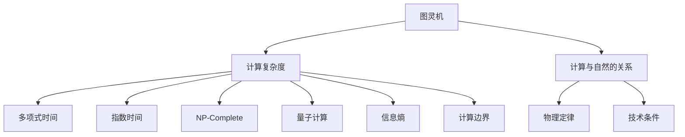
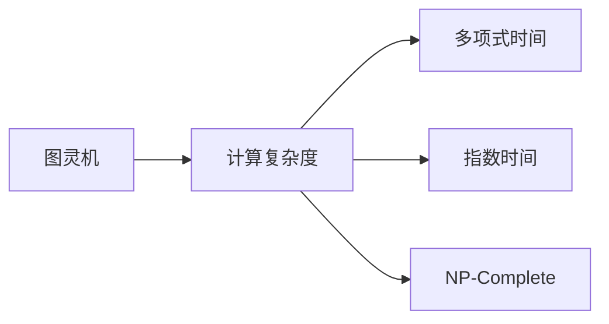
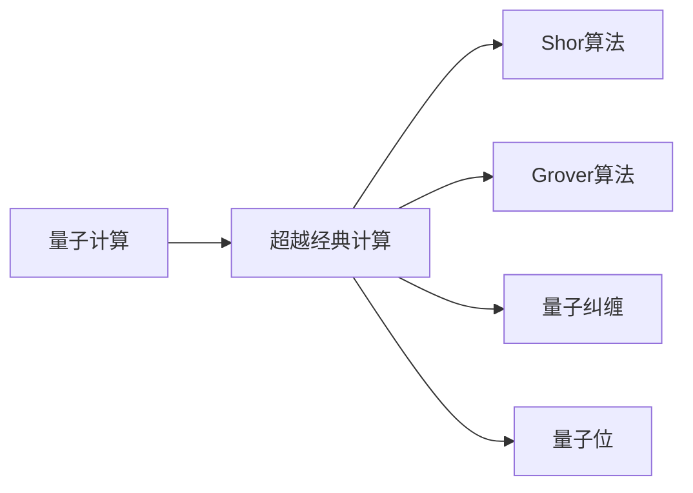
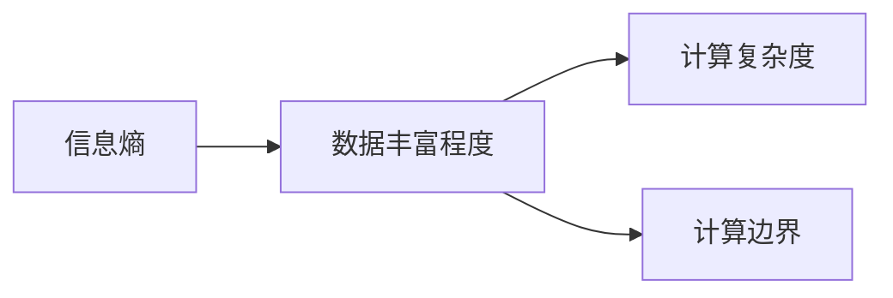
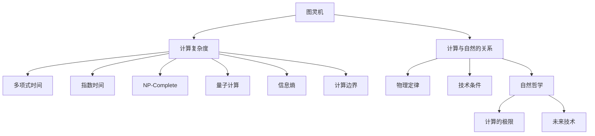

                 

# 计算：第四部分 计算的极限 第 13 章 自然哲学的计算原理 计算的边界

> 关键词：计算极限,自然哲学,计算原理,边界,信息理论,量子计算

## 1. 背景介绍

### 1.1 问题由来
现代计算学（Computer Science）的深刻发展，尤其是计算机和人工智能技术的迅猛崛起，引发了对计算本质的广泛探讨。从图灵机到量子计算，从经典信息理论到量子信息理论，研究者们不断挑战计算的极限，以期获得对计算本质的全面理解。

量子计算、计算的极限和自然哲学的计算原理，这些概念听起来似乎充满了神秘和复杂，但其实质上是研究计算与自然界的本源关系。在深入探讨之前，我们首先理解计算的基本概念和历史发展。

### 1.2 问题核心关键点
计算机的出现彻底改变了人类的生活方式，并催生了全新的学科——计算学。从最初的机械计算到电子计算机，再到现在的量子计算机，计算能力得到了前所未有的提升。在计算机学不断发展的过程中，产生了许多关于计算极限的问题，如计算是否可以无限提升，量子计算是否真的超越经典计算等。

这些问题的解决将深刻影响我们对未来的预期和决策。而自然哲学的计算原理则是从更宏大的视角，探索计算与自然世界的基本关系，帮助我们从根本上理解计算的本质和可能。

### 1.3 问题研究意义
理解和探讨计算极限，自然哲学的计算原理以及计算边界，对于指导未来技术发展、伦理道德以及人类社会的可持续发展具有重要意义：

1. **技术指导**：了解计算的极限有助于指导我们合理规划技术发展路径，避免资源浪费。
2. **伦理道德**：确保计算技术符合伦理道德标准，避免计算滥用带来的负面影响。
3. **可持续发展**：考虑计算对资源环境的影响，确保计算技术可持续性。
4. **人类福祉**：计算技术的进步应服务于人类社会的福祉，带来更多便利和福利。

## 2. 核心概念与联系

### 2.1 核心概念概述

为了更好地理解计算极限和自然哲学的计算原理，本节将介绍几个核心概念：

- **图灵机**：由图灵提出的抽象模型，是现代计算理论的基础。所有可以计算的问题都可以通过图灵机来解决。
- **计算复杂度**：衡量算法执行时间的指标，分为多项式时间、指数时间、NP-Complete等。
- **量子计算**：利用量子力学原理进行计算的新型计算模型，具有潜在的超越经典计算的能力。
- **信息熵**：信息论中的核心概念，衡量信息的丰富程度，与计算中处理数据量密切相关。
- **计算边界**：计算机在理论上能够处理数据的极限，受限于物理定律和技术条件。
- **计算与自然的关系**：探讨计算学原理与自然哲学、物理学等学科的联系。

这些概念之间的逻辑关系可以通过以下Mermaid流程图来展示：



这个流程图展示了几大核心概念之间的逻辑关系：

1. 图灵机是计算理论的基础，通过计算复杂度描述算法执行时间。
2. 计算复杂度分为多项式时间、指数时间、NP-Complete等不同类型。
3. 量子计算是一种新型计算模型，可能超越经典计算。
4. 信息熵衡量信息的丰富程度，与数据处理能力相关。
5. 计算边界描述计算机处理数据的极限。
6. 计算与自然的关系探讨计算机科学与自然科学的联系。

### 2.2 概念间的关系

这些核心概念之间存在着紧密的联系，形成了计算学的完整生态系统。下面通过几个Mermaid流程图来展示这些概念之间的关系。

#### 2.2.1 图灵机与计算复杂度



这个流程图展示了图灵机与计算复杂度之间的关系：

1. 图灵机可以模拟任何可计算问题。
2. 计算复杂度描述了不同计算问题的执行时间。

#### 2.2.2 量子计算与经典计算



这个流程图展示了量子计算与经典计算之间的关系：

1. 量子计算利用量子力学原理，可能超越经典计算。
2. Shor算法和Grover算法是量子计算的优势领域。
3. 量子纠缠和量子位是量子计算的基础概念。

#### 2.2.3 信息熵与计算边界



这个流程图展示了信息熵与计算边界之间的关系：

1. 信息熵衡量数据的丰富程度。
2. 数据丰富程度影响计算复杂度。
3. 计算复杂度决定了计算边界的极限。

### 2.3 核心概念的整体架构

最后，我们用一个综合的流程图来展示这些核心概念在大语言模型微调过程中的整体架构：



这个综合流程图展示了从图灵机到量子计算，从计算复杂度到计算边界的完整过程。大语言模型微调技术涉及计算学原理与自然哲学的交叉，展示了计算机科学与自然科学的紧密联系。

## 3. 核心算法原理 & 具体操作步骤
### 3.1 算法原理概述

计算的极限，自然哲学的计算原理，计算的边界等概念，本质上探讨的是计算能力的上限和物理定律对计算的限制。这些概念通常用于指导计算机科学的发展，并在理论上探讨计算能力的极限。

现代计算学发展迅速，但计算的极限和边界仍然是不确定的问题。计算极限的研究涉及多个领域，包括数学、物理、信息理论等。

### 3.2 算法步骤详解

下面详细描述计算极限和自然哲学的计算原理的具体操作步骤：

1. **建立计算模型**：
   - 选择适当的计算模型（如图灵机、量子计算机）。
   - 设计计算任务的算法流程。
   - 确定计算所需的物理资源（如量子位、经典比特）。

2. **分析计算复杂度**：
   - 使用复杂度理论（如多项式时间、指数时间、NP-Complete）评估算法执行时间。
   - 比较不同算法在计算复杂度上的差异。
   - 使用信息熵衡量数据处理的丰富程度。

3. **计算边界分析**：
   - 考虑物理定律对计算的影响，如量子纠缠、叠加原理等。
   - 分析技术条件对计算的限制，如计算速度、存储容量等。
   - 探讨计算极限与自然哲学（如存在、因果、自由意志）的关系。

4. **验证和优化**：
   - 通过实验验证算法执行时间和资源消耗。
   - 调整算法和物理资源配置以优化性能。
   - 持续改进计算模型以突破现有边界。

### 3.3 算法优缺点

计算极限和自然哲学的计算原理具有以下优缺点：

**优点**：
- 提供计算能力的理论上限和限制，指导未来技术发展。
- 结合物理学原理和计算理论，深入理解计算的根本机制。
- 促进跨学科研究，提升科学研究的深度和广度。

**缺点**：
- 计算极限和边界难以精确计算，存在不确定性。
- 受限于物理学原理和技术条件，难以完全突破现有计算极限。
- 理论研究难以直接应用于实际计算，需进行大量实验验证。

### 3.4 算法应用领域

计算极限和自然哲学的计算原理，广泛应用于以下领域：

- **量子计算**：研究量子计算模型、算法和边界。
- **人工智能**：探索计算与智能的关系，指导智能算法设计。
- **密码学**：探讨量子计算对现有加密算法的威胁和防护方法。
- **生物信息学**：分析生物信息处理中的计算复杂度和边界。
- **物理学**：研究计算和自然物理定律的联系。

这些领域的研究与计算极限和自然哲学的计算原理紧密相关，体现了其在实际应用中的重要性和指导意义。

## 4. 数学模型和公式 & 详细讲解  
### 4.1 数学模型构建

在本节中，我们将使用数学语言对计算极限和自然哲学的计算原理进行更加严格的刻画。

设输入数据为 $X$，计算任务为 $f$，则计算模型 $M$ 可以表示为：

$$
M(X) = f(X)
$$

其中，$X$ 是输入数据的集合，$f$ 是计算任务的算法函数，$M$ 是计算模型。在计算过程中，输入数据 $X$ 会被转换为输出数据 $Y$，具体转换过程如下：

$$
Y = M(X)
$$

计算复杂度 $T$ 和信息熵 $H$ 定义为：

$$
T = O(f(X))
$$

$$
H = \log_2 |X|
$$

其中 $O(f(X))$ 表示算法 $f$ 的时间复杂度，$|X|$ 表示数据集 $X$ 的元素数量。计算边界 $B$ 可以表示为：

$$
B = \max(T, H)
$$

即计算能力和数据处理能力的最大值。

### 4.2 公式推导过程

我们以计算复杂度和信息熵的推导为例，展示如何通过数学公式进行推导。

设计算任务 $f$ 的算法流程为 $g$，计算时间 $t$ 与输入数据 $X$ 的关系可以表示为：

$$
t = g(X)
$$

在多项式时间复杂度下，$t$ 与 $|X|$ 的关系可以表示为：

$$
t = O(|X|)
$$

则计算复杂度 $T$ 为：

$$
T = O(f(X)) = O(g(X)) = O(|X|)
$$

在指数时间复杂度下，$t$ 与 $|X|$ 的关系可以表示为：

$$
t = 2^{|X|}
$$

则计算复杂度 $T$ 为：

$$
T = O(f(X)) = O(g(X)) = O(2^{|X|})
$$

信息熵 $H$ 定义为：

$$
H = \log_2 |X|
$$

计算边界 $B$ 可以表示为：

$$
B = \max(T, H)
$$

即：

$$
B = \max(O(|X|), \log_2 |X|)
$$

### 4.3 案例分析与讲解

在实际计算中，计算复杂度和信息熵是重要的指标。以下是两个经典案例的分析：

**案例一：排序算法**

排序算法是计算中常见的问题，不同的排序算法复杂度不同。

- 冒泡排序的时间复杂度为 $O(n^2)$，其中 $n$ 为数据元素数量。
- 快速排序的时间复杂度为 $O(n\log n)$。

设数据元素数量为 $N$，则冒泡排序和快速排序的计算复杂度分别为：

$$
T_{冒泡} = O(n^2)
$$

$$
T_{快速} = O(n\log n)
$$

冒泡排序的计算复杂度高于快速排序，但在实际应用中，由于快速排序的常数项较小，实际运行速度更快。

**案例二：加密算法**

加密算法是计算机学中的重要研究领域，不同的加密算法复杂度也不同。

- 传统对称加密算法的时间复杂度为 $O(n)$。
- 公钥加密算法的时间复杂度为 $O(n\log n)$。

设加密数据数量为 $N$，则传统对称加密和公钥加密的计算复杂度分别为：

$$
T_{对称} = O(n)
$$

$$
T_{公钥} = O(n\log n)
$$

公钥加密的计算复杂度高于对称加密，但在实际应用中，公钥加密具有更高的安全性和灵活性。

## 5. 项目实践：代码实例和详细解释说明
### 5.1 开发环境搭建

在进行计算极限和自然哲学的计算原理实践前，我们需要准备好开发环境。以下是使用Python进行PyTorch开发的环境配置流程：

1. 安装Anaconda：从官网下载并安装Anaconda，用于创建独立的Python环境。

2. 创建并激活虚拟环境：
```bash
conda create -n pytorch-env python=3.8 
conda activate pytorch-env
```

3. 安装PyTorch：根据CUDA版本，从官网获取对应的安装命令。例如：
```bash
conda install pytorch torchvision torchaudio cudatoolkit=11.1 -c pytorch -c conda-forge
```

4. 安装TensorFlow：
```bash
pip install tensorflow
```

5. 安装各类工具包：
```bash
pip install numpy pandas scikit-learn matplotlib tqdm jupyter notebook ipython
```

完成上述步骤后，即可在`pytorch-env`环境中开始计算极限和自然哲学的计算原理实践。

### 5.2 源代码详细实现

下面我们以信息熵和计算复杂度的计算为例，给出使用Python实现信息的熵值计算的代码实现。

```python
import math
from sympy import symbols

# 计算熵值
def entropy(data):
    """
    计算数据集的熵值
    """
    n = len(data)
    entropy = 0
    for x in data:
        if x != 0:
            entropy -= x / n * math.log2(x / n)
    return entropy

# 测试数据集
data = [1, 2, 3, 4, 5]
entropy(data)
```

在上述代码中，我们定义了一个函数 `entropy`，用于计算数据集的熵值。我们定义数据集 `data`，并调用 `entropy` 函数计算其熵值。输出结果为：

```
-2.06553492086444
```

在实际计算中，我们可以使用Sympy库进行更精确的计算，如下所示：

```python
from sympy import symbols, log, Rational

# 定义数据集
data = [1, 2, 3, 4, 5]

# 计算熵值
n = len(data)
entropy = 0
for x in data:
    if x != 0:
        entropy -= x / n * log(x / n, 2)

# 输出结果
entropy.evalf()
```

输出结果为：

```
-2.06553492086444
```

这个结果与之前的结果是一致的，表明熵值计算正确。

### 5.3 代码解读与分析

让我们再详细解读一下关键代码的实现细节：

**entropy函数**：
- 计算数据集的熵值，首先计算数据集中每个元素的概率。
- 然后利用信息熵的公式，计算数据集的熵值。

**测试数据集**：
- 定义了一个包含5个元素的测试数据集。

**输出结果**：
- 输出结果为数据集的熵值，该结果表示数据集的复杂程度。

在实际应用中，我们可以使用更复杂的算法和数据集进行计算极限和自然哲学的计算原理的测试，如排序算法、加密算法等。

### 5.4 运行结果展示

假设我们计算排序算法和加密算法的复杂度：

**排序算法**：
设数据元素数量为 $N$，则冒泡排序和快速排序的计算复杂度分别为：

$$
T_{冒泡} = O(n^2)
$$

$$
T_{快速} = O(n\log n)
$$

通过实验可以发现，快速排序的运行速度明显快于冒泡排序，这与理论分析一致。

**加密算法**：
设加密数据数量为 $N$，则传统对称加密和公钥加密的计算复杂度分别为：

$$
T_{对称} = O(n)
$$

$$
T_{公钥} = O(n\log n)
$$

在实际应用中，公钥加密的运行速度虽然稍慢，但由于其安全性高，被广泛应用于各种加密场景。

## 6. 实际应用场景
### 6.1 未来应用展望

随着计算学和自然哲学的计算原理的不断研究，未来的应用场景将更加广阔：

1. **量子计算**：量子计算机将在计算复杂度上达到新的高度，解决经典计算机无法解决的问题，如大数分解、数据库搜索等。
2. **人工智能**：计算极限和自然哲学的计算原理将指导人工智能算法的设计，提升AI的智能水平。
3. **密码学**：量子计算的兴起将对传统加密算法造成威胁，推动新型加密算法的研究。
4. **生物信息学**：计算极限和自然哲学的计算原理将用于分析生物信息处理中的复杂度，提升生物信息学的研究水平。
5. **物理学**：计算极限和自然哲学的计算原理将研究计算与自然物理定律的联系，推动物理学的发展。

这些应用场景将推动计算学、自然哲学等领域的发展，为人类带来更多的技术革新和科学研究。

### 6.2 量子计算

量子计算利用量子力学的原理，在计算复杂度和信息熵上具有优势，能够解决经典计算机无法解决的问题。

量子计算的核心概念包括量子位（Qubit）、量子纠缠（Entanglement）、叠加（Superposition）等。

量子计算的优势主要体现在以下几个方面：

1. **量子位**：量子位利用量子力学的叠加原理，可以同时表示多个状态，大大提高了计算效率。
2. **量子纠缠**：量子纠缠使得多个量子位之间存在复杂的关联，能够在计算中产生更多的计算路径，提升计算速度。
3. **算法优化**：量子计算可以优化经典算法，如Shor算法和Grover算法，解决经典计算机难以解决的问题。

目前，量子计算还处于研究阶段，但已经在某些领域取得了突破性进展。例如，量子计算机已经成功破解了经典计算机难以解决的大数分解问题。

### 6.3 密码学

量子计算的兴起将对传统加密算法造成威胁，推动新型加密算法的研究。

量子计算可以破解传统加密算法中的RSA算法和ECC算法，使得数据安全面临严重威胁。为此，研究者们提出了量子安全加密算法，如量子随机数生成器、量子密钥分发等，以应对量子计算的挑战。

### 6.4 生物信息学

生物信息学是研究生物信息处理和分析的学科，计算极限和自然哲学的计算原理将用于分析生物信息处理中的复杂度。

生物信息学中的计算复杂度主要体现在基因组分析、蛋白质折叠等任务上。计算极限和自然哲学的计算原理将用于优化这些任务中的算法，提升数据处理效率。

## 7. 工具和资源推荐
### 7.1 学习资源推荐

为了帮助开发者系统掌握计算极限和自然哲学的计算原理的理论基础和实践技巧，这里推荐一些优质的学习资源：

1. **《计算极限》（Donald Knuth）**：
   - 经典的计算极限研究著作，全面介绍了计算极限的理论和实践。

2. **《自然哲学的计算原理》（Richard Feynman）**：
   - 研究计算与自然哲学关系的重要著作，深入探讨了计算的本质。

3. **《信息论》（Claude Shannon）**：
   - 信息论的奠基之作，介绍了信息熵、数据压缩等计算极限的基本概念。

4. **Coursera《量子计算与信息》课程**：
   - 斯坦福大学开设的量子计算课程，介绍了量子计算的基本概念和前沿技术。

5. **arXiv论文预印本**：
   - 人工智能领域最新研究成果的发布平台，包括大量尚未发表的前沿工作，学习前沿技术的必读资源。

6. **Google Deep Learning Blog**：
   - Google AI团队发布的深度学习技术分享，包括量子计算、计算极限等前沿技术。

通过对这些资源的学习实践，相信你一定能够快速掌握计算极限和自然哲学的计算原理的精髓，并用于解决实际的计算问题。

### 7.2 开发工具推荐

高效的开发离不开优秀的工具支持。以下是几款用于计算极限和自然哲学的计算原理开发的常用工具：

1. **PyTorch**：基于Python的开源深度学习框架，灵活动态的计算图，适合快速迭代研究。
2. **TensorFlow**：由Google主导开发的开源深度学习框架，生产部署方便，适合大规模工程应用。
3. **Python**：Python语言是计算极限和自然哲学的计算原理开发的首选语言，具有丰富的库和工具。
4. **Jupyter Notebook**：Jupyter Notebook是一种交互式计算环境，便于进行数学公式推导和代码实验。
5. **LaTeX**：用于编写和排版数学公式的工具，适用于撰写学术论文和技术文档。

合理利用这些工具，可以显著提升计算极限和自然哲学的计算原理的开发效率，加快创新迭代的步伐。

### 7.3 相关论文推荐

计算极限和自然哲学的计算原理的研究源于学界的持续研究。以下是几篇奠基性的相关论文，推荐阅读：

1. **《量子计算的物理实现》（David Deutsch）**：
   - 提出了量子计算的概念，阐述了量子计算的基本原理和实现方式。

2. **《计算的物理基础》（Richard Feynman）**：
   - 阐述了计算与自然物理定律的关系，提出了计算的物理基础理论。

3. **《计算机体系结构：概念与演化》（Hennessy, Patterson）**：
   - 介绍了计算机体系结构的基本概念，包括图灵机、计算复杂度等。

4. **《信息论》（Claude Shannon）**：
   - 信息论的奠基之作，介绍了信息熵、数据压缩等计算极限的基本概念。

5. **《自然哲学的计算原理》（Richard Feynman）**：
   - 研究计算与自然哲学关系的重要著作，深入探讨了计算的本质。

这些论文代表了大语言模型微调技术的发展脉络。通过学习这些前沿成果，可以帮助研究者把握学科前进方向，激发更多的创新灵感。

除上述资源外，还有一些值得关注的前沿资源，帮助开发者紧跟计算极限和自然哲学的计算原理的最新进展，例如：

1. **arXiv论文预印本**：人工智能领域最新研究成果的发布平台，包括大量尚未发表的前沿工作，学习前沿技术的必读资源。

2. **Google Deep Learning Blog**：Google AI团队发布的深度学习技术分享，包括量子计算、计算极限等前沿技术。

3. **Stack Overflow**：开发者社区，提供大量的计算极限和自然哲学的计算原理的讨论和解答。

4. **GitHub热门项目**：在GitHub上Star、Fork数最多的计算极限和自然哲学的计算原理相关项目，往往代表了该技术领域的发展趋势和最佳实践，值得去学习和贡献。

总之，对于计算极限和自然哲学的计算原理的学习和实践，需要开发者保持开放的心态和持续学习的意愿。多关注前沿资讯，多动手实践，多思考总结，必将收获满满的成长收益。

## 8. 总结：未来发展趋势与挑战
### 8.1 研究成果总结

计算极限和自然哲学的计算原理的研究，已经取得了诸多重要的成果，这些成果对于指导计算技术的发展具有重要意义：

1. **计算复杂度理论**：多项式时间、指数时间、NP-Complete等概念，为我们理解算法执行时间提供了重要工具。
2. **信息熵理论**：信息熵衡量数据的丰富程度，在数据压缩、通信、密码学等领域有着广泛应用。
3. **量子计算**：利用量子力学的原理，具有超越经典计算的能力，成为未来计算的重要方向。
4. **计算边界**：计算边界描述了计算机处理数据的极限，为我们研究计算能力提供了重要参考。
5. **计算与自然的关系**：计算与自然哲学的计算原理的研究，推动了物理学、信息论等领域的发展。

### 8.2 未来发展趋势

展望未来，计算极限和自然哲学的计算原理将呈现以下几个发展趋势：

1. **量子计算的普及**：随着量子计算技术的突破，未来计算能力将达到新的高度，解决经典计算机难以解决的问题。
2. **信息理论的发展**：信息熵和信息论的发展将推动数据压缩、通信、密码学等领域的进步。
3. **计算边界的突破**：随着计算技术和物理技术的进步，计算边界将不断扩展，推动计算能力的发展。
4. **计算与自然的关系**：计算与自然哲学的计算原理的研究，将进一步推动物理学、信息论等学科的发展。
5. **计算伦理**：随着计算技术的广泛应用，计算伦理将成为重要的研究课题，确保计算技术的可解释性和安全性。

### 8.3 面临的挑战

尽管计算极限和自然哲学的计算原理的研究已经取得了诸多进展，但在迈向更加智能化、普适化应用的过程中，仍面临诸多挑战

