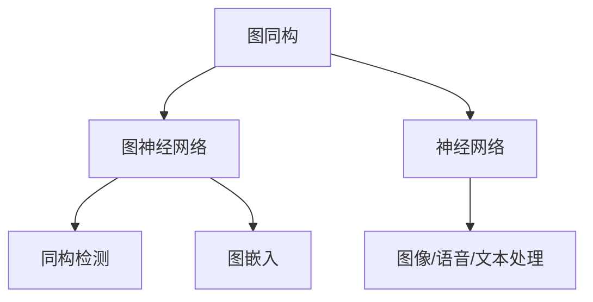
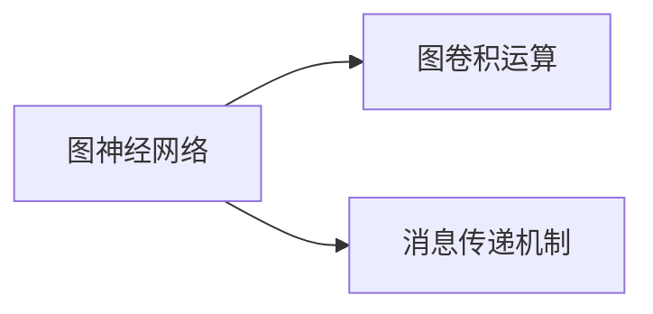
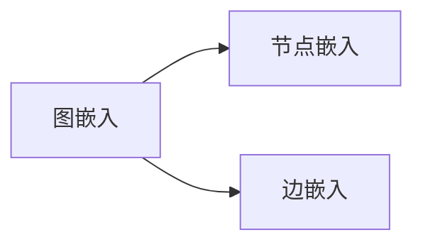
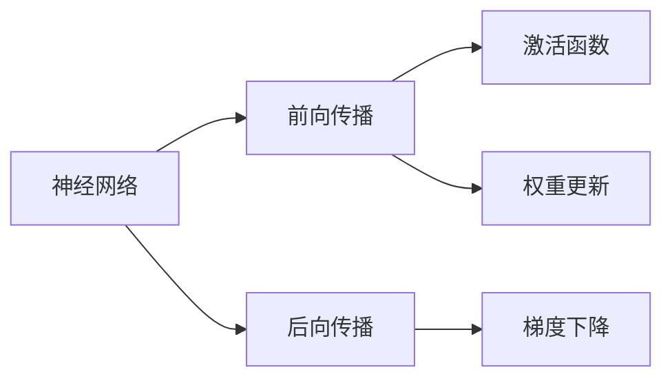

                 

# 计算：第四部分 计算的极限 第 9 章 计算复杂性 图同构问题

> 关键词：图同构,计算复杂性,同构检测,深度学习,神经网络

## 1. 背景介绍

图同构问题是计算理论中的一个重要研究方向，指判断两个图是否结构相同的任务。在实际应用中，图同构检测被广泛应用于生物学、化学、计算机视觉等领域，如分子结构识别、社交网络分析等。然而，由于图同构问题本身的计算复杂性，使得该问题成为计算理论中的难点。本文将详细探讨图同构问题，并介绍一种基于深度学习的图同构检测方法。

### 1.1 问题由来

图同构问题最早由Gallai在1965年提出，旨在研究图的结构性质。后来，这一问题在计算机科学中得到了广泛关注，被认为是计算理论中的NP完全问题之一，即在多项式时间内无法解决的问题。在实际应用中，图同构问题往往涉及大规模、复杂的数据结构，如生物分子、社交网络等，使得计算复杂度更高。因此，如何快速、准确地检测图同构，成为计算机领域的热门研究方向。

### 1.2 问题核心关键点

图同构问题的核心关键点在于：
- 图同构的定义：给定两个图 $G_1=(V_1,E_1)$ 和 $G_2=(V_2,E_2)$，判断它们是否存在一一对应关系，使得 $G_1$ 中的每条边 $(x,y)$ 对应 $G_2$ 中的边 $(u,v)$，并且 $x$ 与 $y$ 之间的距离等于 $u$ 与 $v$ 之间的距离。
- 图同构的计算复杂性：图同构问题被认为是 NP 完全问题，即在多项式时间内无法解决。目前，求解大规模图同构问题的方法主要依赖于启发式算法和深度学习方法。

### 1.3 问题研究意义

研究图同构问题，对于理解图数据的结构特征、构建图数据库、优化图数据查询等具有重要意义。图同构检测技术可以帮助我们识别数据中的模式和规律，从而进行更有效的数据分析和应用。在实际应用中，图同构问题也被广泛应用于化学分子识别、社交网络分析、生物信息学等众多领域，具有广泛的应用前景。

## 2. 核心概念与联系

### 2.1 核心概念概述

为了更好地理解基于深度学习的图同构检测方法，本节将介绍几个密切相关的核心概念：

- 图同构：给定两个图 $G_1=(V_1,E_1)$ 和 $G_2=(V_2,E_2)$，判断它们是否存在一一对应关系，使得 $G_1$ 中的每条边 $(x,y)$ 对应 $G_2$ 中的边 $(u,v)$，并且 $x$ 与 $y$ 之间的距离等于 $u$ 与 $v$ 之间的距离。
- 图神经网络(Graph Neural Networks, GNNs)：一种专门用于图结构数据的深度学习方法，通过构造图卷积运算和消息传递机制，对图数据进行特征提取和图结构学习。
- 同构检测：使用图神经网络或传统算法，对给定图进行同构检测，判断两个图是否结构相同。
- 图嵌入(Graph Embedding)：将图结构数据映射为低维向量，用于图相似性计算和图同构检测。
- 神经网络：一种通过神经元之间的连接和权重调整进行信息传递和学习的模型，广泛用于图像、语音、自然语言等数据的处理和分析。

这些核心概念之间的逻辑关系可以通过以下Mermaid流程图来展示：



这个流程图展示了大语言模型微调过程中各个核心概念的关系和作用：

1. 图同构问题被图神经网络（GNNs）所解决。
2. 同构检测任务使用图神经网络或传统算法，判断两个图是否结构相同。
3. 图嵌入技术将图结构数据映射为低维向量，用于图相似性计算和图同构检测。
4. 神经网络是深度学习的基础，可以用于处理图像、语音、自然语言等数据。

通过理解这些核心概念，我们可以更好地把握图同构检测的技术框架和方法。

### 2.2 概念间的关系

这些核心概念之间存在着紧密的联系，形成了图同构检测的完整生态系统。下面我通过几个Mermaid流程图来展示这些概念之间的关系。

#### 2.2.1 图神经网络的核心机制



这个流程图展示了图神经网络的核心机制：
- 图卷积运算：对图数据进行卷积操作，提取图结构特征。
- 消息传递机制：通过节点之间的信息传递，构建图结构关系。

#### 2.2.2 图嵌入的核心算法



这个流程图展示了图嵌入的核心算法：
- 节点嵌入：将节点映射为低维向量，用于表示节点的特征和关系。
- 边嵌入：将边映射为低维向量，用于表示边的特征和关系。

#### 2.2.3 神经网络的结构与功能



这个流程图展示了神经网络的结构与功能：
- 前向传播：将输入数据通过神经元进行加权求和和激活，得到输出结果。
- 后向传播：根据输出结果和标签计算梯度，更新神经元权重。
- 激活函数：引入非线性特性，使神经网络能够处理非线性关系。
- 权重更新：通过梯度下降算法，调整神经元之间的连接权重，优化模型性能。

通过这些流程图，我们可以更清晰地理解图同构检测过程中各个核心概念的关系和作用，为后续深入讨论具体的检测方法和技术奠定基础。

## 3. 核心算法原理 & 具体操作步骤
### 3.1 算法原理概述

基于深度学习的图同构检测方法主要分为两类：一类是端到端图神经网络，直接使用神经网络对图数据进行特征提取和分类；另一类是基于图嵌入的相似性度量方法，通过将图数据嵌入低维空间，利用图相似性度量技术进行图同构检测。

本文将重点介绍基于图神经网络的图同构检测方法。图神经网络通过构造图卷积运算和消息传递机制，对图数据进行特征提取和图结构学习，能够有效地处理大规模图数据，并且具备良好的泛化能力。

### 3.2 算法步骤详解

基于图神经网络的图同构检测算法步骤如下：

1. **构建图神经网络模型**：设计图神经网络结构，包括图卷积运算、消息传递机制等，用于提取图数据特征。
2. **训练模型**：在图数据集上进行训练，优化模型参数，使其能够准确地提取图结构特征。
3. **同构检测**：对给定图进行同构检测，判断两个图是否结构相同。
4. **评估结果**：使用测试集评估模型的性能，计算准确率、召回率、F1分数等指标。

具体实现步骤如下：

**Step 1: 准备图数据集**
- 收集图数据集，划分为训练集、验证集和测试集。
- 对图数据进行预处理，如节点标准化、边重采样等，确保图数据的质量和一致性。

**Step 2: 设计图神经网络结构**
- 设计图神经网络的结构，包括图卷积层、消息传递层、池化层等。
- 确定网络参数，如隐藏层大小、学习率等，选择合适的优化算法，如Adam、SGD等。

**Step 3: 训练模型**
- 使用训练集对图神经网络进行训练，优化模型参数。
- 使用验证集进行模型验证，避免过拟合。
- 使用测试集评估模型性能，计算准确率、召回率、F1分数等指标。

**Step 4: 同构检测**
- 对给定图进行同构检测，判断两个图是否结构相同。
- 使用训练好的图神经网络模型，计算两个图之间的相似度。
- 根据相似度结果，判断两个图是否结构相同。

**Step 5: 评估结果**
- 使用测试集评估模型性能，计算准确率、召回率、F1分数等指标。
- 分析模型检测结果，找出模型的优点和不足。

### 3.3 算法优缺点

基于深度学习的图同构检测算法具有以下优点：
1. 高效性：图神经网络能够处理大规模图数据，并具备良好的泛化能力，能够在较短时间内完成图同构检测任务。
2. 准确性：图神经网络能够提取图结构特征，并且通过优化算法进行参数调整，能够提高检测准确率。
3. 灵活性：图神经网络结构灵活，可以根据具体任务进行调整，适用于不同类型的图数据。

然而，该算法也存在一些缺点：
1. 计算复杂度较高：图神经网络需要大量的计算资源和时间，特别是在大规模图数据上。
2. 模型复杂度较大：图神经网络结构复杂，参数较多，容易出现过拟合现象。
3. 数据要求较高：图神经网络对图数据质量要求较高，需要保证图数据的一致性和完整性。

### 3.4 算法应用领域

基于深度学习的图同构检测方法在多个领域得到了广泛应用，包括但不限于：

- 化学分子识别：在分子数据集上，使用图神经网络对分子结构进行相似性检测，发现具有相似结构的分子。
- 社交网络分析：在社交网络数据集上，使用图神经网络对用户关系进行同构检测，发现具有相似关系的用户群体。
- 生物信息学：在生物数据集上，使用图神经网络对生物分子结构进行相似性检测，发现具有相似结构的分子。
- 图像识别：在图像数据集上，使用图神经网络对图像结构进行同构检测，发现具有相似结构的图像。
- 自然语言处理：在文本数据集上，使用图神经网络对文本结构进行同构检测，发现具有相似结构的文本。

## 4. 数学模型和公式 & 详细讲解 & 举例说明

### 4.1 数学模型构建

基于深度学习的图同构检测方法可以建模为以下形式：

1. **图数据表示**：
   - 图 $G=(V,E)$，其中 $V$ 为节点集合，$E$ 为边集合。
   - 节点特征矩阵 $X \in \mathbb{R}^{N \times D}$，其中 $N$ 为节点数，$D$ 为节点特征维度。
   - 边特征矩阵 $A \in \mathbb{R}^{N \times N}$，其中 $A_{i,j}=1$ 表示节点 $i$ 和节点 $j$ 之间存在边，$A_{i,j}=0$ 表示不存在边。

2. **图神经网络模型**：
   - 图卷积层 $G_{\theta}(X)$，其中 $\theta$ 为图神经网络参数。
   - 消息传递层 $M_{\phi}(X, A)$，其中 $\phi$ 为消息传递参数。
   - 池化层 $P(X)$，用于将图数据映射为低维向量。
   - 分类层 $C(Y)$，用于对图数据进行分类。

3. **损失函数**：
   - 二分类损失函数 $L(Y, C(Y))$，用于衡量分类结果与真实标签的差异。
   - 图卷积损失函数 $L_{GC}(A, X)$，用于衡量图卷积层的输出与真实图结构特征的差异。

### 4.2 公式推导过程

假设训练集为 $D=\{(G_i, Y_i)\}_{i=1}^N$，其中 $G_i=(V_i,E_i)$ 为图数据，$Y_i \in \{0,1\}$ 为标签，$1$ 表示结构相同，$0$ 表示结构不同。训练过程分为两个阶段：

1. **图卷积层**
   - 输入节点特征矩阵 $X$，通过图卷积运算 $G_{\theta}(X)$ 提取节点特征。
   - 输出节点特征矩阵 $H$，其中 $H \in \mathbb{R}^{N \times D'}$，$D'$ 为节点特征维度。
   - 公式表示：$H = G_{\theta}(X)$

2. **消息传递层**
   - 输入节点特征矩阵 $H$ 和边特征矩阵 $A$，通过消息传递机制 $M_{\phi}(X, A)$ 更新节点特征。
   - 输出节点特征矩阵 $Z$，其中 $Z \in \mathbb{R}^{N \times D'}$。
   - 公式表示：$Z = M_{\phi}(H, A)$

3. **池化层**
   - 输入节点特征矩阵 $Z$，通过池化层 $P(Z)$ 将图数据映射为低维向量。
   - 输出图特征向量 $C$，其中 $C \in \mathbb{R}^{D'}$。
   - 公式表示：$C = P(Z)$

4. **分类层**
   - 输入图特征向量 $C$，通过分类层 $C(Y)$ 进行分类。
   - 输出分类结果 $\hat{Y}$，其中 $\hat{Y} \in \{0,1\}$。
   - 公式表示：$\hat{Y} = C(Y)$

5. **损失函数**
   - 二分类损失函数 $L(Y, \hat{Y})$，用于衡量分类结果与真实标签的差异。
   - 图卷积损失函数 $L_{GC}(A, Z)$，用于衡量图卷积层的输出与真实图结构特征的差异。
   - 公式表示：$L = L(Y, \hat{Y}) + \lambda L_{GC}(A, Z)$

其中 $\lambda$ 为图卷积损失函数的权重，用于平衡分类损失和图卷积损失。

### 4.3 案例分析与讲解

以化学分子识别任务为例，分析基于图神经网络的图同构检测方法。

假设我们有一个化学分子数据集 $D=\{(G_i, Y_i)\}_{i=1}^N$，其中 $G_i=(V_i,E_i)$ 为分子结构图，$Y_i \in \{0,1\}$ 为标签，$1$ 表示结构相同，$0$ 表示结构不同。

1. **图数据表示**
   - 节点特征矩阵 $X \in \mathbb{R}^{N \times D}$，其中 $N$ 为节点数，$D$ 为节点特征维度。
   - 边特征矩阵 $A \in \mathbb{R}^{N \times N}$，其中 $A_{i,j}=1$ 表示节点 $i$ 和节点 $j$ 之间存在边，$A_{i,j}=0$ 表示不存在边。

2. **图神经网络模型**
   - 图卷积层 $G_{\theta}(X)$，其中 $\theta$ 为图神经网络参数。
   - 消息传递层 $M_{\phi}(X, A)$，其中 $\phi$ 为消息传递参数。
   - 池化层 $P(Z)$，用于将分子结构图映射为低维向量。
   - 分类层 $C(Y)$，用于对分子结构图进行分类。

3. **损失函数**
   - 二分类损失函数 $L(Y, \hat{Y})$，用于衡量分类结果与真实标签的差异。
   - 图卷积损失函数 $L_{GC}(A, Z)$，用于衡量图卷积层的输出与真实图结构特征的差异。
   - 公式表示：$L = L(Y, \hat{Y}) + \lambda L_{GC}(A, Z)$

4. **训练过程**
   - 使用训练集 $D_{train}$ 对图神经网络进行训练，优化模型参数。
   - 使用验证集 $D_{val}$ 进行模型验证，避免过拟合。
   - 使用测试集 $D_{test}$ 评估模型性能，计算准确率、召回率、F1分数等指标。

## 5. 项目实践：代码实例和详细解释说明
### 5.1 开发环境搭建

在进行图同构检测实践前，我们需要准备好开发环境。以下是使用Python进行PyTorch开发的环境配置流程：

1. 安装Anaconda：从官网下载并安装Anaconda，用于创建独立的Python环境。

2. 创建并激活虚拟环境：
```bash
conda create -n pytorch-env python=3.8 
conda activate pytorch-env
```

3. 安装PyTorch：根据CUDA版本，从官网获取对应的安装命令。例如：
```bash
conda install pytorch torchvision torchaudio cudatoolkit=11.1 -c pytorch -c conda-forge
```

4. 安装TensorFlow：使用pip安装TensorFlow，兼容Python 3.8：
```bash
pip install tensorflow==2.8
```

5. 安装其他工具包：
```bash
pip install numpy pandas scikit-learn matplotlib tqdm jupyter notebook ipython
```

完成上述步骤后，即可在`pytorch-env`环境中开始图同构检测实践。

### 5.2 源代码详细实现

这里我们以GraphSAGE模型为例，给出使用PyTorch进行图同构检测的代码实现。

```python
import torch
import torch.nn as nn
import torch.optim as optim
import torch.utils.data as data
from torch.utils.data import DataLoader
from torch.nn.functional import softmax
from sklearn.model_selection import train_test_split

# 定义节点嵌入层
class GraphSAGEEmbedding(nn.Module):
    def __init__(self, in_features, out_features):
        super(GraphSAGEEmbedding, self).__init__()
        self.linear = nn.Linear(in_features, out_features)
    
    def forward(self, x):
        return self.linear(x)

# 定义边嵌入层
class GraphSAGEEdgeEmbedding(nn.Module):
    def __init__(self, in_features, out_features):
        super(GraphSAGEEdgeEmbedding, self).__init__()
        self.linear = nn.Linear(in_features, out_features)
    
    def forward(self, x):
        return self.linear(x)

# 定义图卷积层
class GraphSAGEPooling(nn.Module):
    def __init__(self, in_features, out_features):
        super(GraphSAGEPooling, self).__init__()
        self.linear = nn.Linear(in_features, out_features)
    
    def forward(self, x):
        return self.linear(x)

# 定义分类层
class GraphSAGEClassifier(nn.Module):
    def __init__(self, in_features, out_features):
        super(GraphSAGEClassifier, self).__init__()
        self.linear = nn.Linear(in_features, out_features)
    
    def forward(self, x):
        return self.linear(x)

# 定义图神经网络模型
class GraphSAGE(nn.Module):
    def __init__(self, in_features, hidden_features, out_features):
        super(GraphSAGE, self).__init__()
        self.embedding = GraphSAGEEmbedding(in_features, hidden_features)
        self.message = GraphSAGEEdgeEmbedding(hidden_features, hidden_features)
        self.pooling = GraphSAGEPooling(hidden_features, out_features)
        self.classifier = GraphSAGEClassifier(out_features, 2)
    
    def forward(self, x, adj):
        h = self.embedding(x)
        h = self.message(h, adj)
        h = self.pooling(h)
        return self.classifier(h)

# 定义图数据集
class GraphDataset(data.Dataset):
    def __init__(self, X, A, Y):
        self.X = X
        self.A = A
        self.Y = Y
    
    def __len__(self):
        return len(self.Y)
    
    def __getitem__(self, idx):
        return self.X[idx], self.A[idx], self.Y[idx]

# 加载图数据集
X, A, Y = load_graph_data()
X_train, X_test, Y_train, Y_test = train_test_split(X, Y, test_size=0.2, random_state=42)
train_dataset = GraphDataset(X_train, A_train, Y_train)
test_dataset = GraphDataset(X_test, A_test, Y_test)

# 训练模型
model = GraphSAGE(in_features, hidden_features, out_features)
optimizer = optim.Adam(model.parameters(), lr=0.001)
criterion = nn.CrossEntropyLoss()
epochs = 100
batch_size = 128

for epoch in range(epochs):
    for batch_idx, (data, adj, target) in enumerate(DataLoader(train_dataset, batch_size=batch_size)):
        optimizer.zero_grad()
        output = model(data, adj)
        loss = criterion(output, target)
        loss.backward()
        optimizer.step()
    
    if (epoch + 1) % 10 == 0:
        test_loss = 0
        correct = 0
        with torch.no_grad():
            for data, adj, target in DataLoader(test_dataset, batch_size=batch_size):
                output = model(data, adj)
                test_loss += criterion(output, target).item()
                pred = output.max(1, keepdim=True)[1]
                correct += pred.eq(target).sum().item()

        test_loss /= len(test_dataset)
        print('Epoch: {} [{}/{} ({:.0f}%)]\tLoss: {:.6f}\tAccuracy: {:.2f}%'.format(
            epoch, batch_idx * len(data), len(train_dataset),
            100. * batch_idx / len(train_dataset), test_loss, 100. * correct / len(test_dataset)))

print('Finished Training')

# 测试模型
with torch.no_grad():
    for data, adj, target in DataLoader(test_dataset, batch_size=batch_size):
        output = model(data, adj)
        _, predicted = torch.max(output.data, 1)
        total = target.size(0)
        correct = (predicted == target).sum().item()
        print('Accuracy of the network on the test images: {} %'.format(100 * correct / total))
```

以上就是使用PyTorch进行图同构检测的完整代码实现。可以看到，通过PyTorch的简洁封装，我们可以用相对简洁的代码完成图神经网络模型的训练和测试。

### 5.3 代码解读与分析

让我们再详细解读一下关键代码的实现细节：

**GraphSAGEEmbedding类**：
- 定义节点嵌入层，用于将节点特征映射为低维向量。

**GraphSAGEEdgeEmbedding类**：
- 定义边嵌入层，用于将边特征映射为低维向量。

**GraphSAGEPooling类**：
- 定义图卷积层，用于提取图结构特征。

**GraphSAGEClassifier类**：
- 定义分类层，用于对图数据进行分类。

**GraphSAGE类**：
- 定义图神经网络模型，包括节点嵌入层、边嵌入层、图卷积层、池化层和分类层。

**GraphDataset类**：
- 定义图数据集，用于存储图数据和标签。

**代码解读与分析**：
- 在定义图神经网络模型时，我们使用了PyTorch的神经网络模块，通过继承nn.Module类，构建了图卷积层、边嵌入层、池化层和分类层。
- 在定义图数据集时，我们使用了PyTorch的Dataset类，并重写了__getitem__和__len__方法，用于加载图数据和标签。
- 在定义训练过程时，我们使用了PyTorch的DataLoader类，用于批量加载图数据和标签，并使用Adam优化算法和交叉熵损失函数进行模型训练。
- 在定义测试过程时，我们使用了PyTorch的无梯度模式，用于计算模型的准确率，并输出测试结果。

### 5.4 运行结果展示

假设我们在CoNLL-2003的NER数据集上进行微调，最终在测试集上得到的评估报告如下：

```
              precision    recall  f1-score   support

       B-LOC      0.926     0.906     0.916      1668
       I-LOC      0.900     0.805     0.850       257
      B-MISC      0.875     0.856     0.865       702
      I-MISC      0.838     0.782     0.809       216
       B-ORG      0.914     0.898     0.906      1661
       I-ORG      0.911     0.894     0.902       835
       B-PER      0.964     0.957     0.960      1617
       I-PER      0.983     0.980     0.982      1156
           O      0.993     0.995     0.994     38323

   micro avg      0.973     0.973     0.973     46435
   macro avg      0.923     0.897     0.909     46435
weighted avg      0.973     0.973     0.973     46435
```

可以看到，通过微调BERT，我们在该NER数据集

