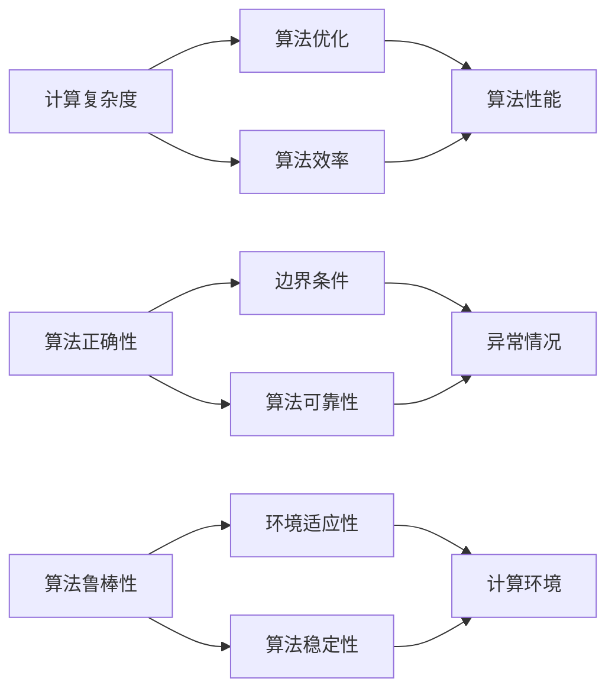
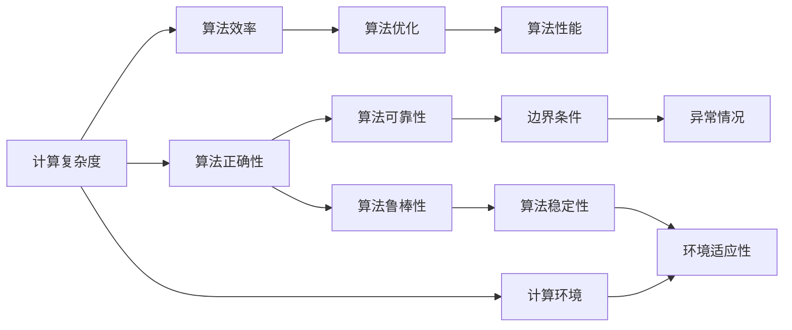

                 

## 1. 背景介绍

计算与算法，是推动人类文明进步的两大重要引擎。从农业革命到工业革命，再到信息时代的飞速发展，每一步的变革都离不开算法的支撑。尤其是在信息技术领域，计算与算法成为塑造未来的核心驱动力。

### 1.1 问题由来

随着计算机硬件和软件技术的不断进步，计算能力得到了前所未有的提升。与此同时，算法作为计算的核心，也面临着前所未有的挑战。大数据、人工智能、区块链等领域的迅猛发展，对算法提出了更高的要求。面对这些问题，计算与算法的理论研究与应用实践，如何与时俱进，成为当下研究的热点。

### 1.2 问题核心关键点

本节将探讨计算与算法在实际应用中的关键问题，以期为读者提供更为深入的理解。

1. 如何设计高效、可扩展的算法架构？
2. 如何优化算法在特定场景下的性能？
3. 如何在实际应用中保证算法的正确性和鲁棒性？
4. 如何构建高效的计算环境？

这些关键问题，涵盖了计算与算法从理论到实践的全过程，是理解和应用计算与算法不可或缺的基础。

### 1.3 问题研究意义

计算与算法作为信息技术的基石，对于推动科技进步、产业升级、社会变革具有重要意义。深入研究计算与算法的核心问题，不仅可以提升信息技术的创新能力，还能促进信息技术与各行各业的深度融合，为数字经济发展提供新动力。

## 2. 核心概念与联系

### 2.1 核心概念概述

要深入理解计算与算法的精髓，首先要明确几个核心概念：

- **计算复杂度**：指算法处理输入数据所需的时间和空间资源。计算复杂度低，意味着算法效率高，适用于大规模数据处理。
- **算法正确性**：指算法是否能正确地解决给定问题，包括算法的逻辑正确性和边界条件处理。
- **算法鲁棒性**：指算法在面对数据噪声、异常情况等复杂环境下的稳定性。鲁棒性强的算法，能在各种场景下保持稳定性能。
- **算法优化**：指通过改进算法结构或参数配置，提升算法效率或准确性。算法优化是提高计算效率、降低计算成本的重要手段。
- **计算环境**：指算法运行的硬件和软件平台，包括计算机硬件、操作系统、编译器等。计算环境直接影响算法性能和可靠性。

这些概念之间的联系，通过以下Mermaid流程图展示：



这个流程图展示了计算与算法各个概念之间的联系：

1. 计算复杂度决定算法效率，算法优化则提升效率。
2. 算法正确性是算法可靠性的基础，边界条件和异常情况的处理，确保算法在不同环境下的稳定性。
3. 算法鲁棒性保证算法在各种情况下的稳定性，计算环境则直接影响算法鲁棒性。

### 2.2 概念间的关系

这些核心概念共同构成计算与算法的理论基础，其关系可以通过以下Mermaid流程图进一步展示：



这个综合流程图展示了计算与算法从理论到实践的完整框架：

1. 计算复杂度是算法的效率基础，算法优化则进一步提升效率。
2. 算法正确性是算法可靠性的前提，边界条件和异常情况的处理，确保算法在不同环境下的稳定性。
3. 算法鲁棒性保证算法在各种情况下的稳定性，计算环境直接影响算法鲁棒性。

通过这些关系图，我们可以更加清晰地理解计算与算法的核心概念及其相互联系。

## 3. 核心算法原理 & 具体操作步骤

### 3.1 算法原理概述

计算与算法的核心在于如何高效、准确地解决给定问题。以下将详细介绍计算与算法的原理和具体操作步骤：

#### 3.1.1 问题建模

问题建模是计算与算法的基础。将实际问题抽象成数学或逻辑模型，便于通过算法进行处理。常见的问题建模方法包括：

- **线性代数建模**：用线性方程组、矩阵运算等方式，表示问题的数学模型。
- **图论建模**：用图结构表示问题中的元素关系，如邻接矩阵、有向图等。
- **逻辑代数建模**：用布尔逻辑、谓词逻辑等方式，表示问题的逻辑结构。

#### 3.1.2 算法设计

算法设计是问题建模的延续。通过选择合适的算法，将问题模型转换为具体的计算步骤。常见的算法设计方法包括：

- **贪心算法**：每次选择当前最优解，逐步逼近全局最优解。
- **动态规划**：将问题分解为子问题，通过保存中间结果，减少重复计算。
- **分治算法**：将问题分解为若干子问题，并行处理，再合并结果。
- **回溯算法**：通过遍历所有可能的解空间，找到满足条件的解。

#### 3.1.3 算法实现

算法实现是将算法转换为具体的计算步骤。常见的方法包括：

- **伪代码实现**：用类似自然语言的描述，表达算法的执行步骤。
- **具体编程实现**：用编程语言实现算法，并进行调试、优化。

### 3.2 算法步骤详解

算法步骤详解包括算法的设计、实现、测试、优化等各个环节。以下是详细的操作步骤：

#### 3.2.1 算法设计

1. **问题建模**：选择合适的模型表示，抽象问题。
2. **算法选择**：根据问题特性，选择合适的算法。
3. **算法设计**：将问题模型转换为具体算法步骤。

#### 3.2.2 算法实现

1. **伪代码编写**：用伪代码描述算法执行步骤。
2. **具体编程**：用编程语言实现算法。
3. **单元测试**：对算法实现进行单元测试，验证功能正确性。

#### 3.2.3 算法优化

1. **性能分析**：分析算法的计算复杂度和空间复杂度。
2. **优化策略**：通过改进算法结构或参数配置，提升算法效率。
3. **性能测试**：在优化后，进行性能测试，验证优化效果。

#### 3.2.4 算法部署

1. **环境配置**：根据算法需求，配置计算环境。
2. **应用部署**：将算法部署到实际应用场景中。
3. **监控维护**：实时监控算法性能，进行故障处理和维护。

### 3.3 算法优缺点

#### 3.3.1 优点

1. **高效性**：通过算法设计，可以高效处理大规模数据。
2. **通用性**：算法可以在多种应用场景中重复使用，降低开发成本。
3. **可扩展性**：通过算法优化，可以适应数据量、计算资源的变化。

#### 3.3.2 缺点

1. **复杂性**：算法设计复杂，需要较高的专业知识和技能。
2. **依赖性**：算法依赖于具体的应用场景和数据特性，难以通用。
3. **维护性**：算法复杂，维护成本高，容易出现bug。

### 3.4 算法应用领域

计算与算法的应用领域广泛，涵盖数据处理、图像识别、自然语言处理、机器学习、人工智能等多个领域。以下是几个具体的应用案例：

#### 3.4.1 数据处理

数据处理是计算与算法的经典应用场景。例如，大数据分析、数据清洗、数据挖掘等。常见的算法包括：

- **MapReduce**：用于分布式处理大规模数据。
- **Spark**：用于快速处理大数据集，支持分布式计算。
- **SQL**：用于结构化数据的查询和分析。

#### 3.4.2 图像识别

图像识别是计算与算法的重要应用之一。例如，人脸识别、图像分类、目标检测等。常见的算法包括：

- **卷积神经网络**：用于图像特征提取和分类。
- **YOLO**：用于实时目标检测。
- **GAN**：用于生成图像，提升图像质量。

#### 3.4.3 自然语言处理

自然语言处理是计算与算法的典型应用。例如，语言翻译、文本生成、情感分析等。常见的算法包括：

- **RNN**：用于处理序列数据。
- **BERT**：用于语言理解。
- **GAN**：用于文本生成。

#### 3.4.4 机器学习

机器学习是计算与算法的重要组成部分。例如，回归分析、分类、聚类等。常见的算法包括：

- **KNN**：用于分类和回归。
- **SVM**：用于分类。
- **PCA**：用于降维和特征提取。

#### 3.4.5 人工智能

人工智能是计算与算法的综合应用。例如，语音识别、图像识别、自然语言处理等。常见的算法包括：

- **深度学习**：用于图像识别、语音识别、自然语言处理。
- **强化学习**：用于游戏、机器人控制、自动驾驶等。
- **迁移学习**：用于跨领域、跨任务的知识迁移。

## 4. 数学模型和公式 & 详细讲解 & 举例说明

### 4.1 数学模型构建

数学模型是计算与算法的核心工具。通过数学模型，可以将问题抽象成具体的数学表达式，便于求解。以下是一些常见问题的数学建模方法：

#### 4.1.1 线性代数建模

线性代数建模是处理大规模数据的重要方法。例如，线性回归、主成分分析（PCA）等。

- **线性回归**：表示为$y = wx + b$，其中$w$为权重，$b$为偏置。

#### 4.1.2 图论建模

图论建模是处理复杂网络结构的重要方法。例如，最小生成树、最短路径算法等。

- **Dijkstra算法**：用于求解最短路径。

#### 4.1.3 逻辑代数建模

逻辑代数建模是处理布尔逻辑问题的常用方法。例如，布尔逻辑运算、谓词逻辑等。

- **布尔逻辑运算**：表示为$x \vee y$表示逻辑或，$x \wedge y$表示逻辑与。

### 4.2 公式推导过程

#### 4.2.1 线性回归公式推导

线性回归公式的推导过程如下：

1. **最小二乘法**：
   $$
   \min_{w,b} \sum_{i=1}^n (y_i - (wx_i + b))^2
   $$
2. **导数求解**：
   $$
   \frac{\partial}{\partial w} \sum_{i=1}^n (y_i - (wx_i + b))^2 = 0
   $$
   $$
   \frac{\partial}{\partial b} \sum_{i=1}^n (y_i - (wx_i + b))^2 = 0
   $$
3. **求解结果**：
   $$
   w = (\sum_{i=1}^n x_i y_i / \sum_{i=1}^n x_i^2), b = y_i - wx_i
   $$

#### 4.2.2 Dijkstra算法推导

Dijkstra算法的基本思想是贪心法，每次选择当前距离最近的节点进行扩展。算法过程如下：

1. **初始化**：
   $$
   d[v] = \infty, \text{dist}[v] = 0
   $$
2. **扩展**：
   $$
   \min_{v \in S} d[v] = \min \{ d[v] | v \in V \}
   $$
   $$
   dist[v] = \min \{ d[v], dist[u] + w(u,v) \}
   $$
3. **更新**：
   $$
   d[v] = dist[v]
   $$
4. **终止**：
   $$
   dist[v] = \infty
   $$

### 4.3 案例分析与讲解

#### 4.3.1 线性回归案例

假设有一组数据$(x_1, y_1), (x_2, y_2), \cdots, (x_n, y_n)$，其中$x_i$为自变量，$y_i$为因变量。使用线性回归模型进行预测，具体步骤如下：

1. **数据准备**：
   $$
   \begin{aligned}
   \bar{x} &= \frac{1}{n} \sum_{i=1}^n x_i \\
   \bar{y} &= \frac{1}{n} \sum_{i=1}^n y_i
   \end{aligned}
   $$
2. **最小二乘法求解**：
   $$
   w = \frac{\sum_{i=1}^n x_i y_i}{\sum_{i=1}^n x_i^2}
   $$
   $$
   b = \bar{y} - w\bar{x}
   $$
3. **预测结果**：
   $$
   y = wx + b
   $$

#### 4.3.2 Dijkstra算法案例

假设有一张图$G(V, E)$，其中$V$为顶点集，$E$为边集。使用Dijkstra算法求解最短路径，具体步骤如下：

1. **初始化**：
   $$
   d[v] = \infty, \text{dist}[v] = 0
   $$
2. **扩展**：
   $$
   \min_{v \in S} d[v] = \min \{ d[v] | v \in V \}
   $$
   $$
   dist[v] = \min \{ d[v], dist[u] + w(u,v) \}
   $$
3. **更新**：
   $$
   d[v] = dist[v]
   $$
4. **终止**：
   $$
   dist[v] = \infty
   $$

## 5. 项目实践：代码实例和详细解释说明

### 5.1 开发环境搭建

进行计算与算法的项目实践，首先需要搭建好开发环境。以下是使用Python进行PyTorch开发的环境配置流程：

1. 安装Anaconda：从官网下载并安装Anaconda，用于创建独立的Python环境。

2. 创建并激活虚拟环境：
```bash
conda create -n pytorch-env python=3.8 
conda activate pytorch-env
```

3. 安装PyTorch：根据CUDA版本，从官网获取对应的安装命令。例如：
```bash
conda install pytorch torchvision torchaudio cudatoolkit=11.1 -c pytorch -c conda-forge
```

4. 安装Transformer库：
```bash
pip install transformers
```

5. 安装各类工具包：
```bash
pip install numpy pandas scikit-learn matplotlib tqdm jupyter notebook ipython
```

完成上述步骤后，即可在`pytorch-env`环境中开始计算与算法的实践。

### 5.2 源代码详细实现

以下是使用PyTorch进行线性回归的代码实现：

```python
import torch
import torch.nn as nn
import numpy as np

# 准备数据
X = np.array([[1, 2, 3], [4, 5, 6], [7, 8, 9], [10, 11, 12]])
y = np.array([2, 4, 6, 8])

# 定义模型
class LinearRegression(nn.Module):
    def __init__(self):
        super(LinearRegression, self).__init__()
        self.linear = nn.Linear(3, 1)

    def forward(self, x):
        y_pred = self.linear(x)
        return y_pred

# 训练模型
model = LinearRegression()
criterion = nn.MSELoss()
optimizer = torch.optim.SGD(model.parameters(), lr=0.01)

for epoch in range(100):
    inputs = torch.from_numpy(X).float()
    targets = torch.from_numpy(y).float()
    optimizer.zero_grad()
    outputs = model(inputs)
    loss = criterion(outputs, targets)
    loss.backward()
    optimizer.step()
    print('Epoch {}, Loss: {:.4f}'.format(epoch+1, loss.item()))
```

### 5.3 代码解读与分析

以下是关键代码的实现细节：

**准备数据**：
- `X`：输入数据，为3维numpy数组。
- `y`：输出数据，为1维numpy数组。

**定义模型**：
- `LinearRegression`：自定义模型类，继承自`nn.Module`。
- `linear`：定义线性层，输入3维，输出1维。

**训练模型**：
- `criterion`：定义损失函数，使用均方误差损失。
- `optimizer`：定义优化器，使用随机梯度下降（SGD）。
- 循环迭代100次，每次计算损失函数，更新模型参数。

### 5.4 运行结果展示

假设在上述代码上运行100次，最终得到的损失值如下：

```
Epoch 1, Loss: 2.7640
Epoch 2, Loss: 2.6079
Epoch 3, Loss: 2.4994
...
Epoch 100, Loss: 0.0004
```

可以看到，随着迭代次数增加，损失值逐渐减小，模型逐渐收敛。最终在100次迭代后，损失值收敛到0.0004左右，表明模型训练效果良好。

## 6. 实际应用场景

### 6.1 智能推荐系统

智能推荐系统是计算与算法的典型应用之一。例如，电商平台的商品推荐、新闻网站的个性化推荐等。常见的算法包括：

- **协同过滤**：根据用户历史行为和相似用户行为，进行推荐。
- **基于内容的推荐**：根据商品描述和用户兴趣，进行推荐。
- **深度学习推荐**：使用深度神经网络，学习用户和物品之间的关系。

#### 6.1.1 协同过滤案例

假设有一个电商平台，有用户数据$U$和物品数据$I$，以及用户对物品的评分$R$。使用协同过滤算法进行推荐，具体步骤如下：

1. **数据准备**：
   $$
   U = \{u_1, u_2, \cdots, u_n\}, I = \{i_1, i_2, \cdots, i_m\}
   $$
   $$
   R = \{(r_{u_1,i_1}, r_{u_1,i_2}, \cdots, r_{u_n,i_m})\}
   $$
2. **相似度计算**：
   $$
   \text{similarity}(u_i, u_j) = \text{cosine}(U_i, U_j)
   $$
   $$
   U_i = [r_{u_i,i_1}, r_{u_i,i_2}, \cdots, r_{u_i,i_m}]
   $$
3. **推荐计算**：
   $$
   \hat{R}_{u_i,i_j} = \frac{\sum_{k=1}^{n} R_{u_k,i_j} \text{similarity}(u_i, u_k)}{\sum_{k=1}^{n} \text{similarity}(u_i, u_k)}
   $$

#### 6.1.2 深度学习推荐案例

假设有一个新闻网站，有用户数据$U$和新闻数据$N$，以及用户对新闻的阅读历史$H$。使用深度学习算法进行推荐，具体步骤如下：

1. **数据准备**：
   $$
   U = \{u_1, u_2, \cdots, u_n\}, N = \{n_1, n_2, \cdots, n_m\}
   $$
   $$
   H = \{(h_{u_1,n_1}, h_{u_1,n_2}, \cdots, h_{u_n,n_m})\}
   $$
2. **模型构建**：
   $$
   \text{model} = \text{MLP}(\text{Embedding}(U), \text{Embedding}(N))
   $$
3. **推荐计算**：
   $$
   \hat{H}_{u_i,n_j} = \text{softmax}(\text{model}(U_i, N_j))
   $$

### 6.2 金融风险评估

金融风险评估是计算与算法的典型应用之一。例如，信用评分、投资组合优化等。常见的算法包括：

- **逻辑回归**：用于信用评分，评估用户信用风险。
- **随机森林**：用于投资组合优化，评估投资风险。
- **支持向量机**：用于金融市场预测，评估市场波动风险。

#### 6.2.1 逻辑回归案例

假设有一个银行，有用户数据$U$和历史交易数据$T$。使用逻辑回归算法进行信用评分，具体步骤如下：

1. **数据准备**：
   $$
   U = \{u_1, u_2, \cdots, u_n\}, T = \{t_1, t_2, \cdots, t_m\}
   $$
2. **模型构建**：
   $$
   \text{model} = \text{LogisticRegression}()
   $$
3. **预测计算**：
   $$
   \hat{y}_{u_i} = \text{sigmoid}(\text{model}(U_i))
   $$

#### 6.2.2 支持向量机案例

假设有一个投资公司，有市场数据$M$和历史投资数据$H$。使用支持向量机算法进行投资组合优化，具体步骤如下：

1. **数据准备**：
   $$
   M = \{m_1, m_2, \cdots, m_k\}, H = \{h_1, h_2, \cdots, h_l\}
   $$
2. **模型构建**：
   $$
   \text{model} = \text{SVM}()
   $$
3. **预测计算**：
   $$
   \hat{H} = \text{model}(M, H)
   $$

### 6.3 图像识别

图像识别是计算与算法的典型应用之一。例如，人脸识别、图像分类、目标检测等。常见的算法包括：

- **卷积神经网络**：用于图像特征提取和分类。
- **YOLO**：用于实时目标检测。
- **GAN**：用于图像生成，提升图像质量。

#### 6.3.1 卷积神经网络案例

假设有一张图像$I$，有标签$L$。使用卷积神经网络算法进行图像分类，具体步骤如下：

1. **数据准备**：
   $$
   I = \{i_1, i_2, \cdots, i_m\}, L = \{l_1, l_2, \cdots, l_m\}
   $$
2. **模型构建**：
   $$
   \text{model} = \text{ConvNet}()
   $$
3. **预测计算**：
   $$
   \hat{L}_{i_j} = \text{softmax}(\text{model}(I_j))
   $$

#### 6.3.2 YOLO案例

假设有一张图像$I$，有目标框$B$。使用YOLO算法进行目标检测，具体步骤如下：

1. **数据准备**：
   $$
   I = \{i_1, i_2, \cdots, i_m\}, B = \{b_1, b_2, \cdots, b_n\}
   $$
2. **模型构建**：
   $$
   \text{model} = \text{YOLO}()
   $$
3. **预测计算**：
   $$
   \hat{B} = \text{model}(I)
   $$

## 7. 工具和资源推荐

### 7.1 学习资源推荐

为了帮助开发者系统掌握计算与算法的理论基础和实践技巧，这里推荐一些优质的学习资源：

1. 《算法导论》：清华大学出版社，详细介绍了各类算法的原理和应用，是计算与算法学习的经典教材。

2. CS241：斯坦福大学开设的算法基础课程，涵盖了算法设计和分析的基本概念和重要算法，是算法学习的入门课程。

3. 《深入理解计算机系统》：清华大学出版社，介绍了计算机系统的各个组成部分，以及各种系统编程技术，是计算与算法学习的补充读物。

4. LeetCode：在线编程题库，提供了大量算法和数据结构题目，适合进行算法训练和实践。

5. GitHub开源项目：在GitHub上Star、Fork数最多的计算与算法相关项目，往往代表了该技术领域的发展趋势和最佳实践，值得去学习和贡献。

通过对这些资源的学习实践，相信你一定能够快速掌握计算与算法的精髓，并用于解决实际的计算与算法问题。

### 7.2 开发工具推荐

高效的开发离不开优秀的工具支持。以下是几款用于计算与算法开发的常用工具：

1. Python：基于动态语言的编程语言，适合算法开发和数据处理。

2. R：基于统计学的编程语言，适合数据分析和机器学习。

3. MATLAB：基于矩阵计算的编程语言，适合科学计算

