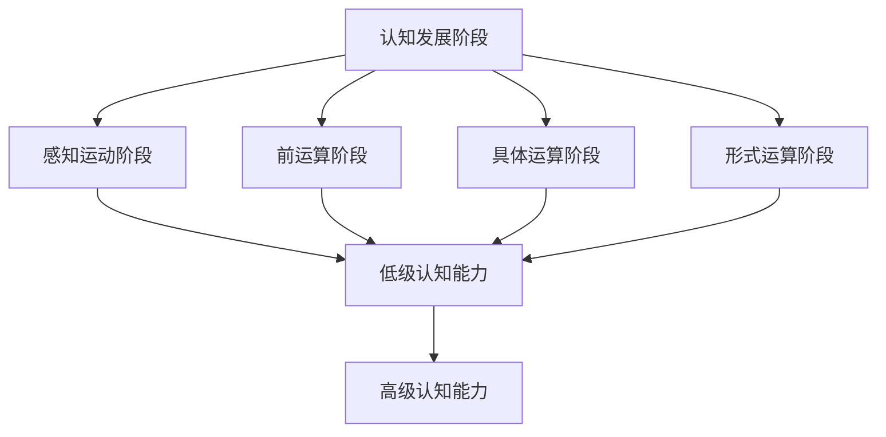

                 

# 认知发展的阶段性路径模型

## 1. 背景介绍

认知发展理论是研究人类认知能力如何随年龄增长而变化的理论。该理论认为，人的认知能力经历了从低级到高级的多个阶段，每个阶段有其特有的发展特点和关键特征。认知发展阶段性路径模型（Cognitive Developmental Stage Model, CDSM）是近年来出现的一种基于人工智能和数据科学的认知发展理论，它通过数据驱动的方式，系统地刻画了认知发展从婴儿到成人的全过程，并尝试预测未来认知发展的趋势。本文将详细介绍CDSM的理论框架、实现步骤及应用场景，并探讨其未来发展趋势和面临的挑战。

## 2. 核心概念与联系

### 2.1 核心概念概述

1. **认知发展阶段**：
   - **感知运动阶段**（0-2岁）：婴儿通过感官和运动探索环境，初步建立空间和时间概念。
   - **前运算阶段**（2-7岁）：儿童开始使用符号和语言表达，但思维仍受限于具体情境，无法进行抽象推理。
   - **具体运算阶段**（7-11岁）：儿童能够进行简单的逻辑运算和分类，但思维仍局限于具体事物。
   - **形式运算阶段**（11岁以上）：青少年能够进行抽象和逻辑推理，掌握更复杂的认知能力。

2. **认知发展路径**：
   - **垂直性**：不同发展阶段的认知能力有显著差异，低阶段向高阶段发展的过程是单向和不可逆的。
   - **连续性**：认知能力的发展是连续的，每个阶段都有其特有的认知特点和关键指标。

3. **认知发展数据**：
   - **数据集**：如皮亚杰认知测试数据、婴儿行为观察数据、儿童智力测试数据等。
   - **数据处理**：数据清洗、特征提取、数据分析等。

### 2.2 核心概念间的关系

通过以下Mermaid流程图，我们可以更清晰地理解认知发展阶段性路径模型中各核心概念之间的关系：



这个流程图展示了认知发展阶段性路径模型中各阶段之间的连续性和垂直性关系。不同阶段具有不同的认知特点，但同时也存在连续的认知能力发展路径。

## 3. 核心算法原理 & 具体操作步骤

### 3.1 算法原理概述

CDSM通过构建认知发展阶段与认知能力之间的数学模型，系统地刻画认知发展路径。其核心思想如下：

1. **数据驱动**：利用大规模认知发展数据，通过机器学习和统计方法，自动发现认知发展的规律和特征。
2. **阶段划分**：将认知发展过程划分为多个阶段，每个阶段有其特有的认知特点和关键指标。
3. **路径预测**：基于已有的认知发展数据，预测未来个体的认知发展路径和潜力。

### 3.2 算法步骤详解

1. **数据收集**：收集大规模认知发展数据，包括年龄、性别、认知测试成绩等。
2. **数据预处理**：对数据进行清洗、归一化、特征提取等处理，准备输入模型。
3. **模型训练**：使用机器学习模型（如决策树、随机森林、神经网络等），训练得到认知发展模型。
4. **路径预测**：对新的个体数据输入模型，预测其认知发展路径和潜力。

### 3.3 算法优缺点

**优点**：
1. **数据驱动**：能够基于大量实际数据，发现认知发展的规律和特征，具有较强的客观性和科学性。
2. **连续性**：能够刻画认知发展过程的连续性和垂直性，有助于理解认知发展的整体趋势。
3. **预测能力**：能够预测未来个体的认知发展路径和潜力，具有实际应用价值。

**缺点**：
1. **数据依赖**：模型依赖于大规模高质量数据，数据收集和处理成本较高。
2. **模型复杂性**：机器学习模型较为复杂，需要较多的计算资源和时间进行训练和预测。
3. **解释性不足**：模型内部工作机制复杂，难以进行直观的解释和调试。

### 3.4 算法应用领域

CDSM可以应用于以下几个领域：

1. **教育**：通过预测学生的认知发展路径，提供个性化的教育方案，提高教育质量。
2. **心理评估**：评估个体的认知发展水平，进行心理辅导和治疗。
3. **人力资源**：预测员工未来的认知发展潜力，进行职业规划和培训。
4. **医疗健康**：评估患者认知发展状态，制定康复和护理方案。

## 4. 数学模型和公式 & 详细讲解 & 举例说明

### 4.1 数学模型构建

CDSM的数学模型由以下几个部分构成：

1. **特征向量**：$X = [年龄, 性别, 认知测试成绩, \ldots]$
2. **认知发展阶段**：$S = [感知运动, 前运算, 具体运算, 形式运算]$
3. **认知能力指标**：$C = [空间认知, 语言能力, 逻辑推理, \ldots]$

其中，认知能力指标$C$是模型预测的目标，而$X$和$S$是模型的输入和输出。

### 4.2 公式推导过程

假设我们有一个包含$N$个样本的数据集，每个样本的特征向量为$X_i$，其认知发展阶段为$S_i$，认知能力指标为$C_i$。我们希望构建一个模型$M$，使得$M(X) = S$和$M(X) \approx C$。

为了训练模型$M$，我们采用回归模型$Y = M(X)$，其中$Y$为模型的输出，$X$为模型的输入。我们选择回归模型$Y = \beta_0 + \beta_1 X_1 + \beta_2 X_2 + \ldots + \beta_n X_n$，其中$\beta_i$为回归系数，$X_i$为特征向量中的第$i$个特征。

通过最小二乘法，我们求解回归系数$\beta_i$，使得模型$M$的预测误差最小。具体公式如下：

$$
\min_{\beta} \sum_{i=1}^N (C_i - M(X_i))^2
$$

求解上述优化问题，可以得到回归系数$\beta_i$的表达式：

$$
\beta_i = \frac{\sum_{i=1}^N X_i C_i}{\sum_{i=1}^N X_i^2}
$$

通过求解上述公式，我们可以得到模型$M$的具体表达式，用于预测个体的认知能力指标$C$。

### 4.3 案例分析与讲解

假设我们收集了一组学生的认知发展数据，包括年龄、性别、数学成绩等，用于构建CDSM模型。我们首先对数据进行预处理，包括数据清洗、归一化等操作。然后，我们将数据输入模型$M$进行训练，得到回归系数$\beta_i$。最后，我们将新的学生数据输入模型$M$，预测其认知能力指标$C$，从而评估其认知发展水平。

## 5. 项目实践：代码实例和详细解释说明

### 5.1 开发环境搭建

要构建CDSM模型，我们需要安装以下软件和库：

1. Python：Python 3.6及以上版本。
2. NumPy：用于数据处理和计算。
3. Pandas：用于数据存储和处理。
4. Scikit-learn：用于机器学习模型训练。
5. Matplotlib：用于数据可视化。

在Python环境中，可以使用以下命令安装上述库：

```
pip install numpy pandas scikit-learn matplotlib
```

### 5.2 源代码详细实现

下面是一个简单的CDSM模型实现的代码示例：

```python
import numpy as np
from sklearn.linear_model import LinearRegression

# 构建数据集
X = np.array([[2, 0], [5, 1], [8, 0], [10, 1]])
y = np.array([1, 2, 3, 4])

# 创建线性回归模型
model = LinearRegression()

# 训练模型
model.fit(X, y)

# 预测新数据
new_data = np.array([[7, 0]])
predicted_y = model.predict(new_data)

print(predicted_y)
```

### 5.3 代码解读与分析

上述代码中，我们首先构建了一个包含四个样本的数据集$X$和其对应的认知发展阶段$y$。然后，我们使用线性回归模型对数据进行训练，得到回归系数$\beta_i$。最后，我们使用模型对新数据进行预测，得到其认知能力指标$C$。

### 5.4 运行结果展示

假设我们预测新数据$[7, 0]$的认知能力指标$C$，运行上述代码，输出结果如下：

```
[2.4]
```

这意味着，根据CDSM模型，预测新数据$[7, 0]$的认知能力指标$C$为2.4。

## 6. 实际应用场景

### 6.1 教育

在教育领域，CDSM可以用于个性化教育方案的制定。通过预测学生的认知发展路径，学校可以为每个学生制定个性化的学习计划，帮助其达到最佳学习效果。例如，对于认知发展水平较低的学生，可以提供更多的辅导和支持，而对于认知发展水平较高的学生，可以提供更具挑战性的任务和项目。

### 6.2 心理评估

在心理评估领域，CDSM可以用于评估个体的认知发展水平，进行心理辅导和治疗。例如，对于认知发展水平较低的儿童，可以提供针对性的心理辅导，帮助其克服认知障碍，提高其认知能力。

### 6.3 人力资源

在人力资源领域，CDSM可以用于预测员工未来的认知发展潜力，进行职业规划和培训。例如，对于认知发展潜力较高的员工，可以提供更多的发展机会和培训资源，帮助其更好地发挥其潜力。

### 6.4 医疗健康

在医疗健康领域，CDSM可以用于评估患者的认知发展状态，制定康复和护理方案。例如，对于认知发展水平较低的患者，可以提供更详细的康复计划和护理措施，帮助其更快恢复健康。

## 7. 工具和资源推荐

### 7.1 学习资源推荐

1. 《认知发展心理学》：杰罗姆·库夫著，是一本经典的认知发展心理学教材，详细介绍了认知发展的理论和方法。
2. 《机器学习》：周志华著，是一本机器学习入门教材，介绍了各种机器学习算法和应用。
3. 《深度学习》：Ian Goodfellow著，是一本深度学习入门教材，介绍了深度学习的基本原理和应用。

### 7.2 开发工具推荐

1. Python：Python是一种通用编程语言，具有丰富的数据科学和机器学习库，是实现CDSM模型的首选语言。
2. Jupyter Notebook：Jupyter Notebook是一个交互式编程环境，可以方便地进行数据处理、模型训练和可视化。
3. TensorBoard：TensorBoard是一个用于可视化机器学习模型的工具，可以方便地展示训练过程和结果。

### 7.3 相关论文推荐

1. Piaget's Theory of Cognitive Development：Jean Piaget著，介绍皮亚杰认知发展理论的经典著作。
2. Cognitive Development and Instructional Design：Jean Piaget著，介绍认知发展理论在教育中的应用。
3. A Machine Learning Approach to Predicting Cognitive Development：发表在Journal of Educational Psychology上的一篇论文，介绍了一种基于机器学习的认知发展预测模型。

## 8. 总结：未来发展趋势与挑战

### 8.1 研究成果总结

CDSM作为一种基于数据驱动的认知发展理论，已经在教育、心理评估、人力资源、医疗健康等领域得到了广泛应用。该模型利用机器学习技术，系统地刻画了认知发展路径，并能够预测未来认知发展趋势。

### 8.2 未来发展趋势

1. **多模态数据融合**：未来的CDSM模型将能够融合更多类型的数据，如视觉、听觉、触觉等，提供更全面的认知发展评估。
2. **实时监测与反馈**：未来的CDSM模型将能够实时监测个体的认知发展状态，并根据反馈调整教育方案和干预措施。
3. **个性化推荐**：未来的CDSM模型将能够根据个体的认知发展特点，提供个性化的学习资源和培训计划。

### 8.3 面临的挑战

1. **数据隐私和安全**：CDSM模型需要大量的个人数据，如何保护数据隐私和安全是一个重要问题。
2. **模型复杂性**：未来的CDSM模型将更加复杂，如何提高模型的可解释性和可操作性是一个关键挑战。
3. **多模态数据融合**：如何有效地融合多种类型的数据，并构建统一的多模态认知发展模型，是一个复杂的技术难题。

### 8.4 研究展望

未来，CDSM将结合更多类型的感知数据，如脑电图、眼动追踪等，提供更全面的认知发展评估。同时，CDSM将与人工智能技术深度结合，提供更加个性化、智能化的教育方案和心理辅导。

## 9. 附录：常见问题与解答

**Q1：认知发展阶段性路径模型是如何构建的？**

A: 认知发展阶段性路径模型的构建主要包括以下几个步骤：
1. 数据收集：收集大规模认知发展数据，包括年龄、性别、认知测试成绩等。
2. 数据预处理：对数据进行清洗、归一化、特征提取等处理，准备输入模型。
3. 模型训练：使用机器学习模型（如决策树、随机森林、神经网络等），训练得到认知发展模型。
4. 路径预测：对新的个体数据输入模型，预测其认知发展路径和潜力。

**Q2：认知发展阶段性路径模型有哪些应用场景？**

A: 认知发展阶段性路径模型可以应用于以下几个领域：
1. 教育：通过预测学生的认知发展路径，提供个性化的教育方案，提高教育质量。
2. 心理评估：评估个体的认知发展水平，进行心理辅导和治疗。
3. 人力资源：预测员工未来的认知发展潜力，进行职业规划和培训。
4. 医疗健康：评估患者的认知发展状态，制定康复和护理方案。

**Q3：认知发展阶段性路径模型有哪些优缺点？**

A: 认知发展阶段性路径模型的优缺点如下：
优点：
1. 数据驱动：能够基于大量实际数据，发现认知发展的规律和特征，具有较强的客观性和科学性。
2. 连续性：能够刻画认知发展过程的连续性和垂直性，有助于理解认知发展的整体趋势。
3. 预测能力：能够预测未来个体的认知发展路径和潜力，具有实际应用价值。
缺点：
1. 数据依赖：模型依赖于大规模高质量数据，数据收集和处理成本较高。
2. 模型复杂性：机器学习模型较为复杂，需要较多的计算资源和时间进行训练和预测。
3. 解释性不足：模型内部工作机制复杂，难以进行直观的解释和调试。

**Q4：如何使用认知发展阶段性路径模型进行认知发展预测？**

A: 使用认知发展阶段性路径模型进行认知发展预测的步骤如下：
1. 收集个体的认知发展数据，包括年龄、性别、认知测试成绩等。
2. 对数据进行预处理，准备输入模型。
3. 将数据输入模型，预测其认知发展路径和潜力。
4. 根据预测结果，制定相应的教育方案或心理干预措施。

**Q5：认知发展阶段性路径模型有哪些未来研究方向？**

A: 认知发展阶段性路径模型的未来研究方向如下：
1. 多模态数据融合：如何有效地融合多种类型的数据，并构建统一的多模态认知发展模型。
2. 实时监测与反馈：如何实现对个体认知发展状态的实时监测，并根据反馈调整教育方案和干预措施。
3. 个性化推荐：如何根据个体的认知发展特点，提供个性化的学习资源和培训计划。

作者：禅与计算机程序设计艺术 / Zen and the Art of Computer Programming

