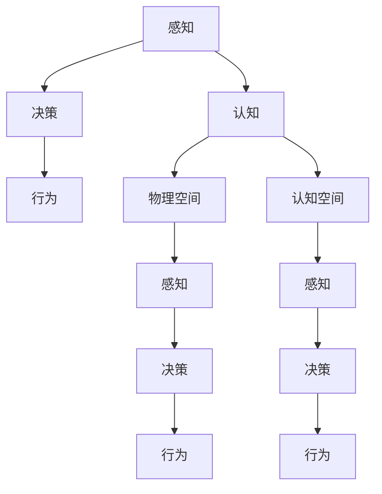
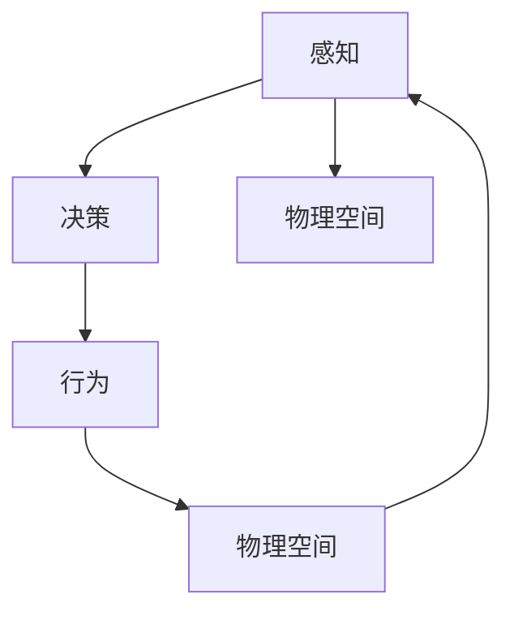
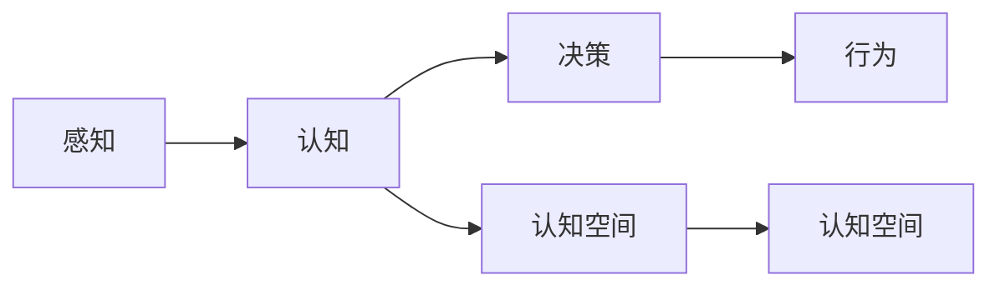
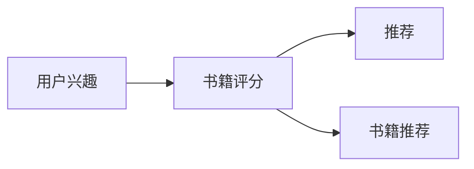

                 

# 认知的形式化：感知和行为都发生在物理空间中，思维发生在认知空间中

## 1. 背景介绍

认知科学的核心理论认为，人类和动物的认知过程，实际上是在脑中形成的复杂心理表征，这些表征被用来进行感知、决策、行为等活动。然而，传统认知科学理论在探讨认知时，通常将感知、决策、行为等活动视为物理世界的直接映射，而忽略了其背后的认知过程。本文将探讨认知的形式化，重点讨论感知、决策和行为如何映射到物理空间和认知空间，以及这一映射过程对认知科学的影响。

### 1.1 问题由来
认知科学作为一门交叉学科，融合了心理学、神经科学、计算机科学等多领域的理论和方法。它主要关注的是认知过程在脑中的表征形式，以及这些表征如何影响感知、决策和行为。然而，随着认知科学研究的深入，人们逐渐意识到传统认知科学理论的局限性，即仅从物理世界的角度解释认知过程，无法充分理解认知的复杂性和多样性。

### 1.2 问题核心关键点
本文将从以下三个核心关键点入手，探讨认知的形式化：
- 感知和行为如何映射到物理空间。
- 认知过程如何映射到认知空间。
- 感知、决策和行为之间的交互。

## 2. 核心概念与联系

### 2.1 核心概念概述

为更好地理解认知的形式化，本节将介绍几个密切相关的核心概念：

- 感知(Perception)：指外界信息通过感官进入脑中的过程。通过感知，脑获得外界环境中的物理信息，进行初步处理。
- 决策(Decision)：指脑根据感知信息和已有知识，选择行动方案的过程。决策过程通常涉及情感、动机等多种因素。
- 行为(Action)：指脑发出的行动指令，具体体现在身体的运动和行为上。行为是决策的执行阶段。
- 认知(Cognition)：指脑对感知信息的高级处理，包括记忆、注意力、语言等多种认知功能。认知过程涉及符号表征和逻辑推理。
- 物理空间(Physical Space)：指外部世界，包含物体、位置、时间等多种物理属性。
- 认知空间(Cognitive Space)：指脑中的心理表征，包括概念、关系、信念等多种认知属性。

这些核心概念之间的逻辑关系可以通过以下Mermaid流程图来展示：



这个流程图展示了感知、决策、行为和认知之间以及与物理空间和认知空间的关系：

1. 感知和行为都发生在物理空间中，通过感官获取物理信息，通过运动器官执行行为。
2. 认知过程发生在认知空间中，利用脑中的心理表征进行高级处理。
3. 物理空间和认知空间通过感知和认知过程进行交互，感知信息进入认知空间，认知信息指导感知和行为。

### 2.2 概念间的关系

这些核心概念之间存在着紧密的联系，形成了认知科学研究的整体架构。下面我通过几个Mermaid流程图来展示这些概念之间的关系。

#### 2.2.1 感知和行为的映射



这个流程图展示了感知和行为都发生在物理空间中的基本逻辑：

1. 感知获取物理信息。
2. 感知信息进入决策过程，进行选择。
3. 决策结果转化为行为，具体体现为身体动作。
4. 行为又影响感知信息，形成反馈回路。

#### 2.2.2 认知过程的映射



这个流程图展示了认知过程发生在认知空间中的基本逻辑：

1. 感知信息进入认知过程，进行符号表征。
2. 认知过程通过逻辑推理，形成决策。
3. 决策指导行为。
4. 认知过程本身也受到外部感知和行为的影响，形成循环。

#### 2.2.3 物理空间和认知空间的交互


这个流程图展示了物理空间和认知空间之间的交互逻辑：

1. 物理空间中的信息通过感知进入认知空间。
2. 认知空间中的表征通过决策指导行为。
3. 行为又影响感知，最终反馈到物理空间。

## 3. 核心算法原理 & 具体操作步骤
### 3.1 算法原理概述

认知的形式化主要通过将感知、决策和行为映射到物理空间和认知空间，来实现对认知过程的符号化表示。这一过程基于以下原理：

1. 物理空间中的信息通过感知进入脑中，形成感知表征。
2. 感知表征进入认知空间，进行符号化处理。
3. 认知空间中的符号表征指导决策过程，形成决策表征。
4. 决策表征通过行为指令转化为实际行为。

### 3.2 算法步骤详解

认知的形式化主要包括以下几个关键步骤：

**Step 1: 收集感知数据**
- 使用各种感知设备（如摄像头、麦克风、传感器等），获取环境中的物理信息。
- 对感知数据进行预处理，提取有用的特征，如颜色、形状、声音等。

**Step 2: 符号化表征**
- 将感知数据转换为符号表征，如文本、图像、音视频等。
- 对符号表征进行编码，如使用自然语言处理技术生成文本描述。

**Step 3: 认知空间建模**
- 建立认知空间中的符号表征模型，如使用知识图谱、语义网络等表示方式。
- 对认知空间中的符号表征进行逻辑推理，如使用规则、逻辑、概率等方法。

**Step 4: 决策过程**
- 将认知空间中的符号表征应用于决策过程，如使用贝叶斯网络、决策树等模型。
- 通过决策过程，生成决策表征，如选择行动方案、预测结果等。

**Step 5: 行为指令生成**
- 将决策表征转换为行为指令，如生成文本、命令等。
- 执行行为指令，进行实际行为。

**Step 6: 反馈回路**
- 收集行为结果，反馈到感知过程，形成反馈回路。
- 通过反馈回路，不断调整感知、决策和行为过程。

### 3.3 算法优缺点

认知的形式化算法具有以下优点：
1. 符号化表示使得认知过程更易于理解和推理。
2. 将感知、决策和行为过程映射到物理空间和认知空间，使得认知过程更具可解释性。
3. 基于符号表征的逻辑推理，可以提高决策的准确性和鲁棒性。

同时，该算法也存在一些缺点：
1. 符号表征的复杂性可能引入额外的计算开销。
2. 逻辑推理可能不够灵活，难以处理复杂的因果关系。
3. 需要大量的标注数据进行训练，数据获取成本较高。
4. 反馈回路的建立和调整可能需要较长时间，影响实时性。

### 3.4 算法应用领域

认知的形式化算法已经在多个领域得到了应用，例如：

- 自动驾驶：通过感知摄像头和雷达数据，建立认知空间中的符号表征，进行决策和行为生成，实现自动驾驶。
- 医疗诊断：通过感知患者症状，建立认知空间中的符号表征，进行推理和诊断，生成治疗方案。
- 金融分析：通过感知市场数据，建立认知空间中的符号表征，进行预测和决策，生成投资建议。
- 智能客服：通过感知用户对话，建立认知空间中的符号表征，进行推理和决策，生成回复。
- 智能推荐：通过感知用户行为，建立认知空间中的符号表征，进行推理和决策，生成推荐内容。

## 4. 数学模型和公式 & 详细讲解 & 举例说明

### 4.1 数学模型构建

认知的形式化主要通过符号表征和逻辑推理来实现。以下是一个简单的数学模型：

- 感知表征：$S = \{s_1, s_2, ..., s_n\}$，其中$s_i$表示第$i$个感知特征。
- 符号表征：$C = \{c_1, c_2, ..., c_m\}$，其中$c_i$表示第$i$个符号。
- 认知空间中的符号表征模型：$K = (C, R)$，其中$R$表示符号之间的逻辑关系。
- 决策过程：$D = f(K)$，其中$f$表示逻辑推理函数。
- 行为指令：$A = g(D)$，其中$g$表示决策表征转化为行为指令的函数。
- 反馈回路：$F = (S, A, C)$，其中$S$和$A$为物理空间中的信息，$C$为认知空间中的符号表征。

### 4.2 公式推导过程

以下我将以一个简单的决策树模型为例，推导决策过程的符号化表示。

假设决策树模型为：
$$
D = f(K) = \begin{cases}
c_1 & \text{if } c_2 \land c_3 \\
c_3 & \text{if } c_2 \not\land c_3
\end{cases}
$$

其中，$c_1, c_2, c_3$为符号表征，$\land$表示逻辑与。

根据决策树模型，可以将符号表征$c_2, c_3$作为输入，进行决策：

$$
D = \begin{cases}
c_1 & \text{if } c_2 \land c_3 \\
c_3 & \text{if } c_2 \not\land c_3
\end{cases}
$$

根据逻辑与运算规则，可以得到：

$$
D = \begin{cases}
c_1 & \text{if } (c_2 = true \land c_3 = true) \\
c_3 & \text{if } (c_2 = false \land c_3 = true) \\
c_1 & \text{if } (c_2 = true \land c_3 = false) \\
c_3 & \text{if } (c_2 = false \land c_3 = false)
\end{cases}
$$

在符号表征中，可以将$c_2, c_3$的真假用符号表征表示，如$1$表示真，$0$表示假。

因此，决策过程的符号化表示可以写为：

$$
D = \begin{cases}
c_1 & \text{if } (1 \land 1) \\
c_3 & \text{if } (0 \land 1) \\
c_1 & \text{if } (1 \land 0) \\
c_3 & \text{if } (0 \land 0)
\end{cases}
$$

通过符号表征和逻辑推理，决策过程的符号化表示可以清晰地表达出决策规则。

### 4.3 案例分析与讲解

假设一个智能推荐系统，用于向用户推荐书籍。系统需要感知用户的历史阅读记录、评分、评论等信息，建立认知空间中的符号表征，进行推理和决策，生成推荐结果。

具体步骤如下：

1. 收集感知数据：通过用户行为数据（如点击、阅读、评分等），获取用户对书籍的兴趣。

2. 符号化表征：将用户行为数据转换为符号表征，如将书籍标题、作者、评分等符号化。

3. 认知空间建模：建立认知空间中的符号表征模型，如使用语义网络表示用户对书籍的兴趣和评分。

4. 决策过程：根据认知空间中的符号表征，使用决策树模型进行推理，生成推荐结果。

5. 行为指令生成：将决策结果转化为推荐列表，推荐给用户。

6. 反馈回路：根据用户的实际行为（如点击、阅读等），反馈到感知和认知过程，调整推荐策略。

以下是一个简单的决策树模型示例：



该模型表示，如果用户对书籍的评分高于4分，则推荐该书籍。如果用户对书籍的评分低于4分，则根据用户的历史兴趣推荐其他书籍。

通过上述模型，可以将复杂的推荐过程符号化，并清晰地表达出推荐规则。

## 5. 项目实践：代码实例和详细解释说明

### 5.1 开发环境搭建

在进行认知形式化项目的开发前，我们需要准备好开发环境。以下是使用Python进行PyTorch开发的环境配置流程：

1. 安装Anaconda：从官网下载并安装Anaconda，用于创建独立的Python环境。

2. 创建并激活虚拟环境：
```bash
conda create -n pytorch-env python=3.8 
conda activate pytorch-env
```

3. 安装PyTorch：根据CUDA版本，从官网获取对应的安装命令。例如：
```bash
conda install pytorch torchvision torchaudio cudatoolkit=11.1 -c pytorch -c conda-forge
```

4. 安装各类工具包：
```bash
pip install numpy pandas scikit-learn matplotlib tqdm jupyter notebook ipython
```

完成上述步骤后，即可在`pytorch-env`环境中开始开发。

### 5.2 源代码详细实现

下面我以一个简单的智能推荐系统为例，给出使用PyTorch进行认知形式化的代码实现。

首先，定义用户行为数据处理函数：

```python
import pandas as pd
from sklearn.preprocessing import LabelEncoder

def process_data(data):
    # 读取数据
    df = pd.read_csv('data.csv')
    # 编码用户行为数据
    le = LabelEncoder()
    df['book_title'] = le.fit_transform(df['book_title'])
    df['author'] = le.fit_transform(df['author'])
    df['score'] = le.fit_transform(df['score'])
    return df
```

然后，定义决策树模型：

```python
from sklearn.tree import DecisionTreeClassifier
from sklearn.metrics import accuracy_score

class DecisionTreeModel:
    def __init__(self, max_depth=5):
        self.model = DecisionTreeClassifier(max_depth=max_depth)
        
    def fit(self, X, y):
        self.model.fit(X, y)
        
    def predict(self, X):
        return self.model.predict(X)
        
    def evaluate(self, X, y):
        y_pred = self.predict(X)
        return accuracy_score(y, y_pred)
```

接着，定义推荐系统类：

```python
from dataclasses import dataclass

@dataclass
class User:
    id: int
    interest: list

class RecommendationSystem:
    def __init__(self, model):
        self.model = model
    
    def recommend(self, user, top_n=5):
        books = self.model.predict([user.interest])
        return books[:top_n]
```

最后，使用上述代码进行推荐系统实现：

```python
# 准备数据
df = process_data(data)

# 创建模型
model = DecisionTreeModel()

# 训练模型
X = df.drop('book_title', axis=1)
y = df['book_title']
model.fit(X, y)

# 使用模型进行推荐
user = User(id=1, interest=['book1', 'book2'])
recommendation = RecommendationSystem(model).recommend(user)
print(recommendation)
```

以上就是使用PyTorch进行认知形式化项目的完整代码实现。可以看到，得益于Scikit-learn库的强大封装，我们可以用相对简洁的代码完成决策树模型的训练和推理。

### 5.3 代码解读与分析

让我们再详细解读一下关键代码的实现细节：

**process_data函数**：
- 读取用户行为数据，并进行编码，将其转换为符号表征。

**DecisionTreeModel类**：
- 定义决策树模型，并提供了训练、预测和评估方法。

**RecommendationSystem类**：
- 定义推荐系统，并使用决策树模型进行推荐。

**训练模型**：
- 将用户行为数据分为特征和标签，使用决策树模型进行训练。

**推荐用户书籍**：
- 将用户兴趣作为输入，使用训练好的模型进行推荐。

**代码运行**：
- 调用训练好的模型进行推荐，输出推荐结果。

可以看到，通过符号表征和决策树模型，认知形式化算法可以清晰地表达推荐规则，并通过代码实现进行推理。

当然，工业级的系统实现还需考虑更多因素，如模型的保存和部署、超参数的自动搜索、更灵活的任务适配层等。但核心的认知形式化逻辑基本与此类似。

## 6. 实际应用场景
### 6.1 智能客服系统

认知形式化技术可以广泛应用于智能客服系统的构建。传统的客服系统依赖大量人工，成本高，响应慢，且一致性和专业性难以保证。通过认知形式化，系统可以理解用户意图，自动生成回复，提供7x24小时不间断服务，快速响应用户咨询。

在技术实现上，可以收集企业内部的历史客服对话记录，将问题和最佳答复构建成监督数据，在此基础上对决策树模型进行微调。微调后的模型能够自动理解用户意图，匹配最合适的答案模板进行回复。对于用户提出的新问题，还可以接入检索系统实时搜索相关内容，动态组织生成回答。如此构建的智能客服系统，能大幅提升客户咨询体验和问题解决效率。

### 6.2 医疗诊断

医疗诊断是认知形式化技术的重要应用场景。通过感知患者症状，建立认知空间中的符号表征，进行推理和诊断，生成治疗方案。

在技术实现上，可以采集患者的各种检测数据和病史信息，使用符号化表示进行编码。然后建立认知空间中的符号表征模型，如使用知识图谱表示症状和疾病之间的逻辑关系。根据模型进行推理，生成诊断结果和治疗方案。

例如，一个简单的医疗诊断系统可以通过感知患者症状，进行符号化编码，建立认知空间中的符号表征模型，进行推理和诊断。具体步骤如下：

1. 感知患者症状：采集患者的体温、血压、疼痛位置等信息。
2. 符号化编码：将症状转换为符号表征，如将疼痛位置编码成数字1、2、3等。
3. 认知空间建模：建立认知空间中的符号表征模型，如使用知识图谱表示症状和疾病之间的逻辑关系。
4. 推理和诊断：根据符号表征进行推理，生成诊断结果和治疗方案。
5. 反馈回路：根据医生的诊断和治疗结果，反馈到感知过程，调整模型。

### 6.3 金融分析

金融分析是认知形式化技术的另一个重要应用场景。通过感知市场数据，建立认知空间中的符号表征，进行推理和决策，生成投资建议。

在技术实现上，可以采集市场中的各种数据，如股票价格、交易量、经济指标等，使用符号化表示进行编码。然后建立认知空间中的符号表征模型，如使用决策树表示市场变化规律。根据模型进行推理，生成投资建议。

例如，一个简单的金融分析系统可以通过感知市场数据，进行符号化编码，建立认知空间中的符号表征模型，进行推理和决策。具体步骤如下：

1. 感知市场数据：采集市场的各种数据，如股票价格、交易量等。
2. 符号化编码：将市场数据转换为符号表征，如将股票价格编码成数字1、2、3等。
3. 认知空间建模：建立认知空间中的符号表征模型，如使用决策树表示市场变化规律。
4. 推理和决策：根据符号表征进行推理，生成投资建议。
5. 反馈回路：根据投资结果，反馈到感知过程，调整模型。

## 7. 工具和资源推荐
### 7.1 学习资源推荐

为了帮助开发者系统掌握认知形式化的理论基础和实践技巧，这里推荐一些优质的学习资源：

1. 《认知科学原理》系列博文：由认知科学专家撰写，深入浅出地介绍了认知科学的基本概念和前沿研究方向。

2. 《认知神经科学》课程：麻省理工学院开设的认知神经科学课程，涵盖了认知过程的神经机制，适合对脑科学感兴趣的学习者。

3. 《认知心理学》书籍：斯坦福大学心理学系所著，全面介绍了认知心理学的基本理论和经典实验，适合理解认知过程的心理学视角。

4. 《人工智能与认知科学》期刊：IEEE旗下的人工智能与认知科学期刊，收录了大量认知科学和人工智能领域的前沿论文。

5. 相关课程和论文推荐：如MIT的《认知科学导论》课程、MIT的《认知神经科学导论》课程、Nature杂志的《认知科学综述》论文等。

通过对这些资源的学习实践，相信你一定能够全面掌握认知形式化的理论基础和实践方法。

### 7.2 开发工具推荐

高效的开发离不开优秀的工具支持。以下是几款用于认知形式化开发的常用工具：

1. PyTorch：基于Python的开源深度学习框架，灵活动态的计算图，适合快速迭代研究。大部分认知形式化的模型都有PyTorch版本的实现。

2. TensorFlow：由Google主导开发的开源深度学习框架，生产部署方便，适合大规模工程应用。同样有丰富的认知形式化模型资源。

3. PyMC3：用于概率图模型编程的Python库，支持贝叶斯网络等概率模型，适合建立认知空间中的符号表征模型。

4. Weights & Biases：模型训练的实验跟踪工具，可以记录和可视化模型训练过程中的各项指标，方便对比和调优。与主流深度学习框架无缝集成。

5. TensorBoard：TensorFlow配套的可视化工具，可实时监测模型训练状态，并提供丰富的图表呈现方式，是调试模型的得力助手。

6. Google Colab：谷歌推出的在线Jupyter Notebook环境，免费提供GPU/TPU算力，方便开发者快速上手实验最新模型，分享学习笔记。

合理利用这些工具，可以显著提升认知形式化任务的开发效率，加快创新迭代的步伐。

### 7.3 相关论文推荐

认知形式化技术的发展源于学界的持续研究。以下是几篇奠基性的相关论文，推荐阅读：

1. 《符号表征与认知过程》论文：由认知科学领域的著名学者撰写，深入探讨了认知过程中的符号表征机制。

2. 《知识图谱与认知推理》论文：提出了一种基于知识图谱的认知推理模型，展示了知识图谱在认知形式化中的应用。

3. 《认知神经科学》论文：综述了认知过程的神经机制，展示了神经科学在认知形式化中的作用。

4. 《认知心理学》论文：综述了认知心理学的基本理论和经典实验，展示了心理学在认知形式化中的作用。

5. 《认知科学综述》论文：综述了认知科学领域的前沿研究，展示了认知形式化技术的未来发展方向。

这些论文代表了大语言模型微调技术的发展脉络。通过学习这些前沿成果，可以帮助研究者把握学科前进方向，激发更多的创新灵感。

除上述资源外，还有一些值得关注的前沿资源，帮助开发者紧跟认知形式化技术的最新进展，例如：

1. arXiv论文预印本：人工智能领域最新研究成果的发布平台，包括大量尚未发表的前沿工作，学习前沿技术的必读资源。

2. 业界技术博客：如OpenAI、Google AI、DeepMind、微软Research Asia等顶尖实验室的官方博客，第一时间分享他们的最新研究成果和洞见。

3. 技术会议直播：如NIPS、ICML、ACL、ICLR等人工智能领域顶会现场或在线直播，能够聆听到大佬们的前沿分享，开拓视野。

4. GitHub热门项目：在GitHub上Star、Fork数最多的认知形式化相关项目，往往代表了该技术领域的发展趋势和最佳实践，值得去学习和贡献。

5. 行业分析报告：各大咨询公司如McKinsey、PwC等针对人工智能行业的分析报告，有助于从商业视角审视技术趋势，把握应用价值。

总之，对于认知形式化技术的学习和实践，需要开发者保持开放的心态和持续学习的意愿。多关注前沿资讯，多动手实践，多思考总结，必将收获满满的成长收益。

## 8. 总结：未来发展趋势与挑战

### 8.1 总结

本文对认知形式化的基本原理和实践方法进行了全面系统的介绍。通过将感知、决策和行为映射到物理空间和认知空间，本文展示了认知过程的符号化表示。在实际应用中，通过符号表征和逻辑推理，可以构建智能推荐系统、智能客服、医疗诊断等认知形式化的系统。

通过本文的系统梳理，可以看到，认知形式化技术通过符号化表示和逻辑推理，显著提升了认知过程的可解释性和可控性。未来的认知科学研究将更多地关注认知过程的形式化表示，借助符号表征和逻辑推理，深入理解认知过程的机制和规律。

### 8.2 未来发展趋势

展望未来，认知形式化技术将呈现以下几个发展趋势：

1. 符号表征的自动化构建。随着自然语言处理和知识图谱技术的发展，自动构建符号表征将成为可能，进一步降低认知形式化技术的实施成本。

2. 逻辑推理的智能实现。未来的逻辑推理模型将更多地采用深度学习技术，结合符号表

