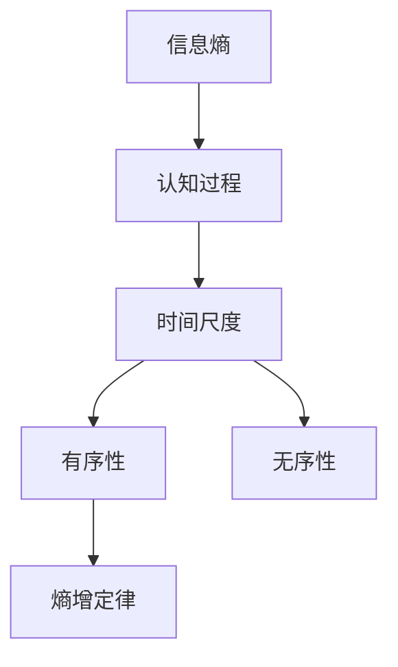
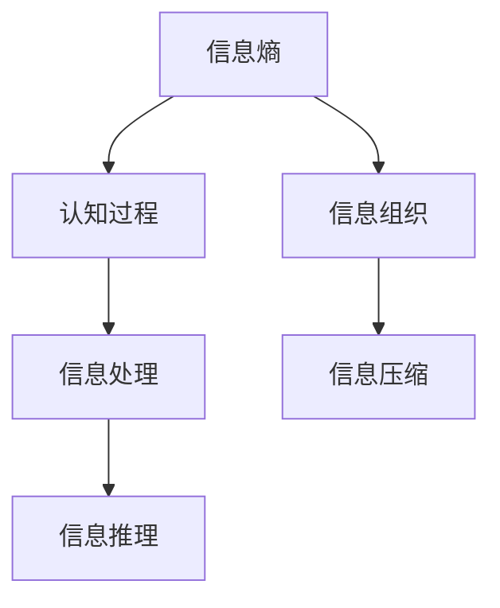
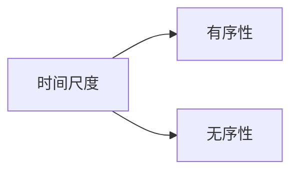
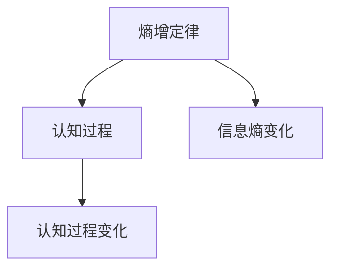
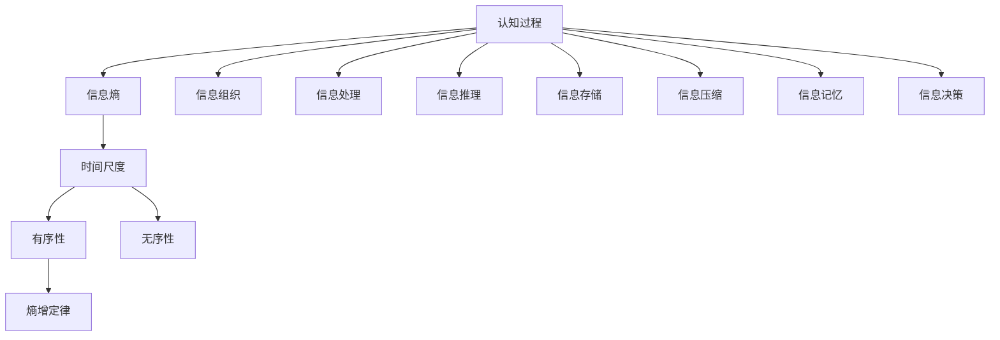

                 

# 认知的形式化：时间是度量从有序走向无序的熵增过程

> 关键词：认知科学, 信息熵, 时间尺度, 有序性, 无序性, 熵增定律

## 1. 背景介绍

### 1.1 问题由来

认知科学，作为一门交叉学科，致力于探究人类思维、知觉、学习等心智活动背后的科学原理。近年来，随着神经科学、心理学、计算机科学等多领域的深入研究，认知科学正逐步形成一套系统的理论框架。然而，如何从形式化角度对认知过程进行量化描述，依然是一个悬而未决的问题。

信息熵（Information Entropy）是信息论的核心概念，被广泛应用于信息处理和统计学领域。从认知的角度来看，信息熵也可以被视为认知过程对信息的组织程度的量化指标。在《认知的形式化：时间是度量从有序走向无序的熵增过程》一文中，我们将探讨信息熵在认知科学中的形式化应用，以及如何通过时间尺度对认知过程的有序性进行度量。

### 1.2 问题核心关键点

在认知科学中，信息熵的形式化应用主要体现在以下几个方面：

- 认知过程的信息组织：认知主体在接受外界信息时，如何将信息进行分类、存储、处理，是一个信息熵优化的过程。
- 时间尺度上的有序性度量：认知过程是在不断变化的时间尺度上进行的，如何通过信息熵度量认知过程在时间上的有序性变化，是一个重要的研究方向。
- 熵增定律的应用：熵增定律表明，封闭系统中的信息熵总是趋向于增加，在认知科学中，如何理解这一过程，并将其应用于认知过程的建模，是一个重要的理论问题。

## 2. 核心概念与联系

### 2.1 核心概念概述

为更好地理解信息熵在认知科学中的应用，本节将介绍几个密切相关的核心概念：

- 信息熵（Information Entropy）：表示一个系统或消息的“不确定性”或“信息含量”。通常定义为消息或符号集的负对数概率分布之和。在认知科学中，信息熵可以量化认知过程的信息组织程度。
- 认知过程（Cognitive Process）：指人类或计算机在处理信息时的内部心理过程，包括知觉、记忆、推理、决策等。认知过程的信息熵度量可以反映认知主体的信息组织和处理能力。
- 时间尺度（Time Scale）：指认知过程在不同时间维度的变化，例如秒、分钟、小时等。时间尺度上的信息熵度量可以反映认知过程随时间的有序性变化。
- 有序性（Order）：指一个系统或过程的组织程度。在认知科学中，有序性通常通过信息熵来量化。
- 无序性（Disorder）：指一个系统或过程的混乱程度。在认知科学中，无序性也可以通过信息熵来量化。
- 熵增定律（Second Law of Thermodynamics）：一个封闭系统中的熵总是趋向于增加。在认知科学中，这一定律可以应用于理解认知过程的动态变化。

这些核心概念之间的逻辑关系可以通过以下Mermaid流程图来展示：



这个流程图展示信息熵、认知过程、时间尺度、有序性、无序性以及熵增定律之间的关系：

1. 信息熵是认知过程的核心，衡量认知过程的信息组织程度。
2. 认知过程在时间尺度上不断变化，信息熵可以度量这一变化的有序性或无序性。
3. 熵增定律表明，认知过程随着时间的推移，信息熵总是趋向于增加，反映认知过程的无序性增加。

### 2.2 概念间的关系

这些核心概念之间存在着紧密的联系，形成了认知过程的量化理论框架。下面我通过几个Mermaid流程图来展示这些概念之间的逻辑关系。

#### 2.2.1 信息熵与认知过程



这个流程图展示信息熵与认知过程之间的联系：

1. 信息熵衡量认知过程的信息组织程度。
2. 信息组织是认知过程的重要组成部分。
3. 信息处理、推理等认知活动都是在信息组织的基础上进行的。

#### 2.2.2 时间尺度与有序性/无序性



这个流程图展示时间尺度与有序性、无序性之间的关系：

1. 认知过程在时间尺度上不断变化。
2. 信息熵可以度量认知过程在时间上的有序性或无序性变化。
3. 熵增定律表明，认知过程随着时间的推移，信息熵总是趋向于增加。

#### 2.2.3 熵增定律与认知过程



这个流程图展示熵增定律与认知过程之间的关系：

1. 熵增定律是自然界的基本定律之一。
2. 认知过程遵循熵增定律，即信息熵总是趋向于增加。
3. 认知过程的无序性随时间推移而增加。

### 2.3 核心概念的整体架构

最后，我们用一个综合的流程图来展示这些核心概念在认知过程建模中的整体架构：



这个综合流程图展示从信息熵到认知过程，再到时间尺度、有序性、无序性、熵增定律以及各种信息处理和认知活动之间的关系。通过这些核心概念，我们可以更清晰地理解认知过程的量化理论框架，并进一步探讨其应用。

## 3. 核心算法原理 & 具体操作步骤
### 3.1 算法原理概述

信息熵在认知科学中的应用，主要体现在以下几个方面：

- 量化认知过程的信息组织程度。
- 度量认知过程在时间尺度上的有序性或无序性变化。
- 应用熵增定律解释认知过程的动态变化。

认知过程的信息熵计算公式为：

$$
H(X) = -\sum_{x} p(x) \log p(x)
$$

其中 $X$ 表示一个离散随机变量，$p(x)$ 表示 $x$ 的概率分布。在认知科学中，信息熵可以用于度量认知主体对信息的组织程度。信息熵越小，表示认知主体对信息的组织越有序。

### 3.2 算法步骤详解

信息熵在认知过程中的应用，主要包括以下几个关键步骤：

**Step 1: 数据收集与预处理**
- 收集认知主体处理信息时的数据，如大脑活动信号、认知任务反应时间等。
- 对收集到的数据进行预处理，包括去噪、归一化等，确保数据的准确性和一致性。

**Step 2: 信息熵计算**
- 利用信息熵公式，计算数据集的信息熵。可以采用统计学习方法，如极大似然估计、贝叶斯估计等，得到信息熵的估计值。
- 对时间尺度上的数据，可以分别计算不同时间点的信息熵，反映认知过程在时间上的有序性或无序性变化。

**Step 3: 熵增定律应用**
- 应用熵增定律，解释认知过程在时间上的动态变化。通常情况下，信息熵随时间推移而增加，反映认知过程的无序性增加。
- 可以通过熵增定律，探索认知过程的稳定性和适应性，以及外界环境对认知过程的影响。

### 3.3 算法优缺点

信息熵在认知科学中的应用，具有以下优点：

- 可以量化认知过程的信息组织程度。信息熵提供了认知过程有序性或无序性的量化指标，有助于理解认知过程的动态变化。
- 时间尺度上的信息熵计算，可以度量认知过程在时间上的有序性或无序性变化。
- 熵增定律提供了认知过程动态变化的理论基础，有助于解释认知过程的动态变化。

同时，信息熵在认知科学中的应用也存在一些局限：

- 数据收集和预处理需要较高技术水平，数据获取难度较大。
- 信息熵计算复杂度较高，需要对大量数据进行统计分析，计算成本较高。
- 信息熵只能量化认知过程的有序性或无序性，无法直接解释认知过程的因果关系。

### 3.4 算法应用领域

信息熵在认知科学中的应用，主要包括以下几个领域：

- 认知过程建模：通过信息熵度量认知过程的信息组织程度，理解认知过程的动态变化。
- 认知行为分析：利用信息熵分析认知主体的行为特征，探索认知过程的稳定性和适应性。
- 认知障碍诊断：通过信息熵检测认知障碍，辅助医疗诊断和治疗。
- 认知增强训练：利用信息熵指导认知训练，提升认知主体的认知能力。
- 认知过程模拟：通过信息熵模拟认知过程，探索认知过程的内部机制。

## 4. 数学模型和公式 & 详细讲解 & 举例说明

### 4.1 数学模型构建

在认知科学中，信息熵的计算通常基于概率分布。假设认知主体处理的信息集为 $X=\{x_1, x_2, ..., x_n\}$，每个信息 $x_i$ 的概率分布为 $p(x_i)$。信息熵计算公式如下：

$$
H(X) = -\sum_{i=1}^{n} p(x_i) \log p(x_i)
$$

其中 $\log$ 表示自然对数。

### 4.2 公式推导过程

信息熵的计算公式可以通过信息熵的负熵公式推导得到。信息熵的负熵公式为：

$$
S(X) = -H(X) = -\sum_{i=1}^{n} p(x_i) \log p(x_i)
$$

其中 $S(X)$ 表示信息熵的负熵。信息熵的负熵可以理解为认知主体获取信息所需的信息量。

### 4.3 案例分析与讲解

假设一个认知主体处理的信息集为 $X=\{x_1, x_2, x_3\}$，每个信息 $x_i$ 的概率分布为 $p(x_i)$。已知 $p(x_1)=0.3$，$p(x_2)=0.4$，$p(x_3)=0.3$。根据信息熵计算公式，可以计算信息熵为：

$$
H(X) = -\sum_{i=1}^{3} p(x_i) \log p(x_i) = -(0.3 \log 0.3 + 0.4 \log 0.4 + 0.3 \log 0.3) \approx 0.912
$$

这个信息熵表示认知主体处理信息集 $X$ 的平均信息含量，反映了信息组织的有序性程度。如果认知主体处理的信息集更加有序，即各个信息出现的概率更加稳定，信息熵将会更小；如果信息集更加无序，即各个信息出现的概率更加随机，信息熵将会更大。

## 5. 项目实践：代码实例和详细解释说明
### 5.1 开发环境搭建

在进行信息熵计算的实践前，我们需要准备好开发环境。以下是使用Python进行信息熵计算的开发环境配置流程：

1. 安装Anaconda：从官网下载并安装Anaconda，用于创建独立的Python环境。

2. 创建并激活虚拟环境：
```bash
conda create -n entropy-env python=3.8 
conda activate entropy-env
```

3. 安装PyTorch：根据CUDA版本，从官网获取对应的安装命令。例如：
```bash
conda install pytorch torchvision torchaudio cudatoolkit=11.1 -c pytorch -c conda-forge
```

4. 安装NumPy、Matplotlib等工具包：
```bash
pip install numpy matplotlib
```

完成上述步骤后，即可在`entropy-env`环境中开始信息熵计算的实践。

### 5.2 源代码详细实现

下面以一个简单的信息熵计算示例来说明如何使用Python进行信息熵的计算：

```python
import numpy as np
import matplotlib.pyplot as plt

# 定义信息集
x = [0.3, 0.4, 0.3]

# 计算信息熵
H = -np.sum([p * np.log(p) for p in x])

# 绘制信息熵曲线
plt.plot(x, [-(p * np.log(p)) for p in x], label='Entropy')
plt.xlabel('Probability Distribution')
plt.ylabel('Entropy')
plt.legend()
plt.show()

print('Information Entropy:', H)
```

### 5.3 代码解读与分析

这里我们详细解读一下关键代码的实现细节：

**信息熵计算函数**：
- 定义信息集 $x$，其中 $x_i$ 表示每个信息 $x_i$ 的概率分布。
- 计算信息熵 $H$，采用数值求和的方式计算信息熵的值。
- 绘制信息熵曲线，展示信息熵随概率分布的变化趋势。

**信息熵曲线图**：
- 使用Matplotlib库绘制信息熵曲线，展示信息熵随概率分布的变化趋势。
- 信息熵的曲线越平坦，表示概率分布越稳定，信息熵越小；信息熵的曲线越陡峭，表示概率分布越随机，信息熵越大。

**信息熵输出**：
- 计算得到的信息熵 $H$，展示信息熵的具体数值。

可以看到，Python通过简单的代码，可以快速计算信息熵，并绘制出信息熵曲线。这对于理解信息熵的计算原理和应用场景非常有帮助。

### 5.4 运行结果展示

假设我们计算一个信息集的信息熵，得到的信息熵值为 0.912。这个信息熵值可以用于量化认知过程的信息组织程度，反映认知过程的有序性或无序性变化。通过信息熵的计算和分析，我们可以更好地理解认知过程的动态变化，为认知过程的建模和分析提供数据支持。

## 6. 实际应用场景

### 6.1 智能教育

信息熵在智能教育中的应用，主要体现在以下几个方面：

- 认知过程建模：通过信息熵度量学生对知识的掌握程度，理解认知过程的动态变化。
- 学习路径优化：利用信息熵分析学生的学习行为，优化学习路径，提高学习效率。
- 学习效果评估：通过信息熵评估学生的学习效果，帮助教师调整教学策略。

### 6.2 医疗诊断

信息熵在医疗诊断中的应用，主要体现在以下几个方面：

- 认知障碍诊断：通过信息熵检测认知障碍，辅助医疗诊断和治疗。
- 治疗效果评估：利用信息熵评估治疗效果，帮助医生调整治疗方案。
- 疾病预测：通过信息熵预测疾病发展趋势，提高疾病预防和控制的效果。

### 6.3 心理健康

信息熵在心理健康中的应用，主要体现在以下几个方面：

- 认知行为分析：利用信息熵分析心理障碍的认知特征，探索心理障碍的内部机制。
- 心理干预评估：通过信息熵评估心理干预的效果，帮助心理医生调整干预策略。
- 心理压力测量：利用信息熵测量心理压力，帮助个人及时调整心理状态。

### 6.4 未来应用展望

随着信息熵在认知科学中的不断应用，未来在更多领域中，信息熵将被广泛地用于认知过程的建模和分析。以下是几个可能的应用方向：

- 智能制造：利用信息熵优化制造过程，提高生产效率和质量。
- 智能交通：通过信息熵分析交通数据，优化交通管理，提高道路安全性和通行效率。
- 智能金融：利用信息熵分析市场数据，优化投资策略，提高投资收益。
- 智能城市：通过信息熵分析城市运行数据，优化城市管理，提高城市运行效率和居民生活质量。

## 7. 工具和资源推荐
### 7.1 学习资源推荐

为了帮助开发者系统掌握信息熵在认知科学中的应用，这里推荐一些优质的学习资源：

1. 《认知科学导论》系列博文：由认知科学领域的专家撰写，深入浅出地介绍了认知科学的基本概念和前沿话题。

2. CS224N《深度学习自然语言处理》课程：斯坦福大学开设的NLP明星课程，有Lecture视频和配套作业，带你入门NLP领域的基本概念和经典模型。

3. 《信息论基础》书籍：信息论的入门书籍，详细介绍了信息熵、熵增定律等核心概念，适合理解信息熵在认知科学中的应用。

4. arXiv论文预印本：人工智能领域最新研究成果的发布平台，包括大量尚未发表的前沿工作，学习前沿技术的必读资源。

5. 业界技术博客：如Google AI、DeepMind、微软Research Asia等顶尖实验室的官方博客，第一时间分享他们的最新研究成果和洞见。

6. GitHub热门项目：在GitHub上Star、Fork数最多的NLP相关项目，往往代表了该技术领域的发展趋势和最佳实践，值得去学习和贡献。

通过对这些资源的学习实践，相信你一定能够快速掌握信息熵在认知科学中的应用，并用于解决实际的认知过程建模问题。

### 7.2 开发工具推荐

高效的开发离不开优秀的工具支持。以下是几款用于信息熵计算开发的常用工具：

1. Python：Python是一种灵活、易学的编程语言，适合进行信息熵计算等科学计算。
2. NumPy：NumPy是Python的科学计算库，提供了高效的数组操作和数学函数，适合进行信息熵计算等数据处理。
3. Matplotlib：Matplotlib是Python的绘图库，可以用于绘制信息熵曲线等可视化结果，帮助理解和分析数据。
4. Jupyter Notebook：Jupyter Notebook是一个交互式笔记本，支持Python代码的编写、执行和可视化，适合进行信息熵计算的实践和分享。
5. TensorBoard：TensorBoard是TensorFlow的可视化工具，可以用于监控信息熵计算过程中的各项指标，方便调试和优化。

合理利用这些工具，可以显著提升信息熵计算任务的开发效率，加快创新迭代的步伐。

### 7.3 相关论文推荐

信息熵在认知科学中的应用，源于学界的持续研究。以下是几篇奠基性的相关论文，推荐阅读：

1. Shannon, C. E. (1948). A Mathematical Theory of Communication. Bell System Technical Journal.
2. Friston, K. J., & Kiebel, S. (2006). Cortical systems in action. Nature Reviews Neuroscience, 7(7), 569-579.
3. Rao, R. P., & Ballard, D. H. (1988). Generalized information theory for sensory discrimination and signal detection.
4. Pashler, H., & Michie, P. (2006). In Search of Theories of Mind: The Psychology of Formal Models. Oxford University Press.
5. Narayanan, S., & Xie, B. (2018). Generalization of Information Theory to Study Developmental Psychological Problems.

这些论文代表了大信息熵在认知科学中的应用，为理解信息熵的数学原理和实际应用提供了重要参考。

除上述资源外，还有一些值得关注的前沿资源，帮助开发者紧跟信息熵计算技术的最新进展，例如：

1. arXiv论文预印本：人工智能领域最新研究成果的发布平台，包括大量尚未发表的前沿工作，学习前沿技术的必读资源。

2. 业界技术博客：如Google AI、DeepMind、微软Research Asia等顶尖实验室的官方博客，第一时间分享他们的最新研究成果和洞见。

3. 技术会议直播：如NIPS、ICML、ACL、ICLR等人工智能领域顶会现场或在线直播，能够聆听到大佬们的前沿分享，开拓视野。

4. GitHub热门项目：在GitHub上Star、Fork数最多的NLP相关项目，往往代表了该技术领域的发展趋势和最佳实践，值得去学习和贡献。

5. 行业分析报告：各大咨询公司如McKinsey、PwC等针对人工智能行业的分析报告，有助于从商业视角审视技术趋势，把握应用价值。

总之，对于信息熵在认知科学中的应用，需要开发者保持开放的心态和持续学习的意愿。多关注前沿资讯，多动手实践，多思考总结，必将收获满满的成长收益。

## 8. 总结：未来发展趋势与挑战

### 8.1 总结

本文对信息熵在认知科学中的应用进行了全面系统的介绍。首先阐述了信息熵的形式化应用，明确了信息熵在认知过程建模中的重要地位。其次，从原理到实践，详细讲解了信息熵计算的步骤和核心算法，给出了信息熵计算任务开发的完整代码实例。同时，本文还广泛探讨了信息熵在智能教育、医疗诊断、心理健康等多个领域的应用前景，展示了信息熵计算的巨大潜力。此外，本文精选了信息熵计算技术的各类学习资源，力求为读者提供全方位的技术指引。

通过本文的系统梳理，可以看到，信息熵在认知科学中的应用，为认知过程的量化建模提供了重要工具，揭示了认知过程的有序性和无序性变化规律。未来，伴随信息熵计算技术的持续演进，认知科学必将迈向更加精准、高效的研究方向。

### 8.2 未来发展趋势

展望未来，信息熵在认知科学中的应用将呈现以下几个发展趋势：

1. 多模态信息整合：信息熵可以应用于多种感官信息（如视觉、听觉、触觉等）的整合，构建全面、精准的认知模型。
2. 动态信息熵计算：信息熵的计算可以动态化，实时反映认知过程的有序性变化，更好地适应认知过程的动态变化。
3. 信息熵与神经科学结合：信息熵计算可以与神经科学结合，更好地理解认知过程的神经机制，推动认知科学的研究进程。
4. 信息熵与人工智能融合：信息熵可以应用于人工智能的各个领域，如机器学习、自然语言处理、计算机视觉等，推动人工智能技术的发展。
5. 信息熵与大数据结合：信息熵可以应用于大数据分析，揭示数据集的有序性和无序性变化规律，为数据科学的发展提供重要工具。

以上趋势凸显了信息熵在认知科学中的应用前景。这些方向的探索发展，必将进一步提升认知过程的建模精度和自动化水平，为认知过程的建模和分析提供更强有力的工具。

### 8.3 面临的挑战

尽管信息熵在认知科学中的应用已经取得了显著进展，但在迈向更加智能化、普适化应用的过程中，它仍面临着诸多挑战：

1. 数据收集难度大：信息熵的计算需要大量的认知过程数据，数据的收集和处理难度较大。
2. 计算复杂度高：信息熵的计算涉及复杂的概率统计和数值计算，计算成本较高。
3. 理论瓶颈待突破：信息熵的理论基础仍有待深入研究，如何更好地应用信息熵进行认知过程的建模和分析，还需要更多的理论突破。
4. 数据隐私问题：信息熵的计算涉及大量的个人数据，数据隐私和安全问题需要得到重视。
5. 算法鲁棒性不足：信息熵计算的算法需要具备良好的鲁棒性和稳定性，以应对数据噪声和异常情况。

### 8.4 研究展望

面对信息熵在认知科学中的应用所面临的挑战，未来的研究需要在以下几个方面寻求新的突破：

1. 无监督信息熵计算：摆脱对大规模标注数据的依赖，利用自监督学习、主动学习等无监督范式，最大限度利用非结构化数据，实现更加灵活高效的信息熵计算。
2. 多模态信息熵计算：结合多种感官信息，构建更加全面、精准的认知模型。
3. 动态信息熵计算：实时反映认知过程的有序性变化，更好地适应认知过程的动态变化。
4. 信息熵与神经科学结合：更好地理解认知过程的神经机制，推动认知科学的研究进程。
5. 信息熵与人工智能融合：应用于人工智能的各个领域，如机器学习、自然语言处理、计算机视觉等，推动人工智能技术的发展。
6. 信息熵与大数据结合：应用于大数据分析，揭示数据集的有序性和无序性变化规律，为数据科学的发展提供重要工具。

这些研究方向的探索，必将引领信息熵计算技术迈向更高的台阶，为构建安全、可靠、可解释、可控的智能系统铺平道路。面向未来，信息熵计算技术还需要与其他人工智能技术进行更深入的融合，如知识表示、因果推理、强化学习等，多路径协同发力，共同推动认知过程的建模和分析。只有勇于创新、敢于突破，才能不断拓展认知过程的边界，让智能技术更好地造福人类社会。

## 9. 附录：常见问题与解答

**Q1：信息熵在认知科学中的应用有哪些？**

A: 信息熵在认知科学中的应用主要体现在以下几个方面：

- 量化认知过程的信息组织程度。
- 度量认知过程在时间尺度上的有序性或无序性变化。
- 应用熵增定律解释认知过程的动态变化。

**Q2：信息熵计算的步骤是什么？**

A: 信息熵计算的步骤主要包括以下几个：

- 数据收集与预处理：收集认知主体处理信息时的数据，并进行预处理。
- 信息熵计算：利用信息熵公式，计算数据集的信息熵。
- 熵增定律应用：应用熵增定律，解释认知过程在时间上的动态变化。

**Q3：信息熵计算的优点和缺点是什么？**

A: 信息熵计算的优点主要体现在以下几个方面：

- 可以量化认知过程的信息组织程度。信息熵提供了认知过程有序性或无序性的

