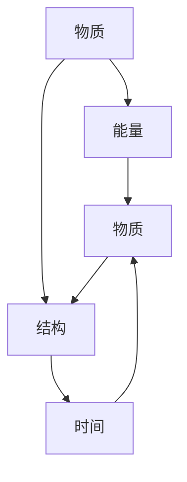
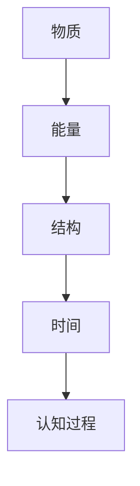

                 

# 认知的形式化：认知机器包括物质、能量、结构和时间4个基本要素

## 1. 背景介绍

### 1.1 问题由来
在人工智能领域，特别是认知计算领域，对“认知”的理解一直是研究的核心。近年来，随着深度学习和大数据技术的不断发展，认知机器日益成为热点话题。认知机器的核心要素包括物质、能量、结构和时间的相互依存与作用，这是构成认知机器的基本框架。理解这些要素及其相互关系，有助于构建更加智能、高效的认知系统。本文旨在深入探讨这些基本要素，并通过数学模型和算法手段，将认知形式化，为认知机器的实际应用提供理论指导和技术支持。

### 1.2 问题核心关键点
本文将从物质、能量、结构和时间四个角度，详细探讨认知机器的基本要素及其相互关系。通过形式化的数学模型和算法手段，将认知形式化，进而为实际应用提供科学依据。

### 1.3 问题研究意义
研究认知机器的基本要素及其相互关系，对构建智能、高效的认知系统具有重要意义：

1. **深入理解认知本质**：通过形式化手段，更深刻地理解认知机器的工作机制，为构建更加智能化系统提供理论基础。
2. **优化资源配置**：物质、能量、结构和时间的合理配置，有助于提高认知系统的资源利用效率，提升性能。
3. **支持决策制定**：通过形式化模型，可以更科学地制定决策，避免主观偏差。
4. **促进跨学科交流**：将认知形式化，有助于跨学科交流与合作，推动认知科学的发展。
5. **推动实际应用**：为认知机器的实际应用提供科学依据和技术支持，加速认知技术的产业化进程。

## 2. 核心概念与联系

### 2.1 核心概念概述

认知机器的基本要素包括物质、能量、结构和时间。这些要素通过复杂的相互作用，构成认知系统的基本框架。

- **物质**：认知机器的物理载体，包括硬件设备、传感器等。物质提供认知系统的基础物理结构，是认知的基础。
- **能量**：认知机器的运行动力，包括电能、光能、化学能等。能量驱动物质的相互作用，是认知的驱动力。
- **结构**：认知机器的物理和逻辑结构，包括电路、算法等。结构决定了认知过程的逻辑和实现方式，是认知的组织形式。
- **时间**：认知机器的运行过程，包括逻辑时序、物理时序等。时间决定了认知过程的动态变化，是认知的演化过程。

### 2.2 核心概念之间的关系

这些核心要素之间的逻辑关系可以通过以下Mermaid流程图来展示：



这个流程图展示了物质、能量、结构和时间之间的相互关系：

- 物质提供能量，能量驱动结构，结构决定时间。
- 时间与物质、能量、结构相互作用，形成认知过程。

### 2.3 核心概念的整体架构

最后，我们用一个综合的流程图来展示这些核心要素在大认知系统中构成的整体架构：



这个综合流程图展示了认知机器的基本架构，即物质提供能量，能量驱动结构，结构决定时间，时间形成认知过程。这些要素相互作用，共同构成了认知机器的基本框架。

## 3. 核心算法原理 & 具体操作步骤
### 3.1 算法原理概述

认知机器的形式化建模，主要基于物质、能量、结构和时间的相互关系。通过构建形式化的数学模型和算法，可以更好地理解这些要素的作用和影响，从而为认知系统的设计和优化提供科学依据。

形式化建模的核心思想是将认知过程抽象为数学公式，通过求解这些公式，获取认知系统的行为和结果。常用的形式化建模方法包括符号逻辑、概率模型、微分方程等。

### 3.2 算法步骤详解

以下是我们对认知机器进行形式化建模的基本步骤：

1. **数据收集与预处理**：
   - 收集物质、能量、结构和时间的相关数据，如传感器数据、能耗数据、算法结构、时间序列等。
   - 对数据进行预处理，包括去噪、归一化、特征提取等，确保数据的准确性和可靠性。

2. **建模与分析**：
   - 根据收集到的数据，构建数学模型，描述物质、能量、结构和时间的相互作用。
   - 使用符号逻辑、概率模型、微分方程等方法，对模型进行分析，获取认知系统的行为和结果。

3. **模型验证与优化**：
   - 通过实验验证模型的正确性，不断调整和优化模型参数。
   - 使用交叉验证、拟合度评估等方法，确保模型的泛化能力。

4. **实际应用**：
   - 将形式化模型应用于实际认知系统中，通过仿真和实验，验证模型的效果。
   - 根据反馈结果，不断优化模型，提升认知系统的性能。

### 3.3 算法优缺点

形式化建模具有以下优点：

- **科学性和准确性**：通过数学方法，可以更科学、准确地描述认知过程，避免主观偏差。
- **通用性**：形式化模型可以应用于多种认知系统，具有广泛的适用性。
- **可验证性**：通过实验验证，可以不断优化模型，确保其准确性和可靠性。

同时，形式化建模也存在一些缺点：

- **复杂性**：建模过程复杂，需要专业知识，难以普及。
- **数据依赖**：模型的准确性高度依赖于数据的质量和数量。
- **计算成本**：建模和优化过程计算量大，需要高性能计算机支持。

### 3.4 算法应用领域

形式化建模在认知机器的各个应用领域都有广泛的应用，例如：

1. **机器人控制**：通过形式化建模，可以更科学地设计机器人的控制算法，提升其自主性和智能性。
2. **智能电网**：对电网的物质、能量和结构进行建模，优化电力资源的配置和调度。
3. **自动驾驶**：对车辆的控制系统进行形式化建模，提升驾驶的准确性和安全性。
4. **医疗诊断**：对病患的生理参数进行形式化建模，辅助医生进行疾病诊断和预测。
5. **智能家居**：对家庭设备的控制和能源管理进行形式化建模，提升家庭的舒适度和智能化水平。

除了上述应用外，形式化建模还广泛应用于金融、教育、交通等多个领域，为认知机器的实际应用提供了科学依据。

## 4. 数学模型和公式 & 详细讲解 & 举例说明
### 4.1 数学模型构建

在本节中，我们将使用数学语言对认知机器进行形式化建模。

假设认知机器的物理结构为 $S$，能量为 $E$，结构为 $C$，时间为 $T$。认知机器的认知过程可以表示为 $F(S, E, C, T)$。形式化建模的核心思想是将认知过程抽象为数学公式，通过求解这些公式，获取认知系统的行为和结果。

### 4.2 公式推导过程

以下我们以机器人控制为例，推导形式化模型的具体公式。

假设机器人的物理结构为 $S = \{s_i\}_{i=1}^n$，能量为 $E = \{e_j\}_{j=1}^m$，结构为 $C = \{c_k\}_{k=1}^p$，时间为 $T = \{t_l\}_{l=1}^q$。机器人的控制过程可以表示为 $F(S, E, C, T)$。

为了简化问题，我们假设机器人有 $n$ 个传感器，每个传感器的测量结果为 $s_i$。机器人的能源有 $m$ 种类型，每种能源的能量为 $e_j$。机器人的控制系统有 $p$ 个模块，每个模块的控制策略为 $c_k$。机器人的行为有 $q$ 种状态，每个状态的时间为 $t_l$。

我们可以使用符号逻辑、概率模型、微分方程等方法，对机器人的控制过程进行形式化建模。以下以符号逻辑为例，推导机器人的控制模型：

1. **传感器数据**：
   - 假设传感器数据为 $s_i = \{s_i^t\}_{t=1}^t$，其中 $s_i^t$ 表示在第 $t$ 时刻传感器 $i$ 的测量结果。
   - 假设传感器数据满足一定的逻辑关系，可以表示为：
     - $s_i^t = f_i(s_i^{t-1}, c_k)$
     - 其中 $f_i$ 表示传感器 $i$ 的测量函数，$c_k$ 表示控制系统模块 $k$ 的控制策略。

2. **能源管理**：
   - 假设能源管理模型为 $E_{new} = E_{old} + \Delta E$，其中 $E_{new}$ 表示新的能源状态，$E_{old}$ 表示旧的能源状态，$\Delta E$ 表示能源的增量。
   - 假设能源管理满足一定的逻辑关系，可以表示为：
     - $\Delta E = \sum_{j=1}^m e_j \times \alpha_j$，其中 $\alpha_j$ 表示能源类型 $j$ 的使用比例。
     - 假设能源使用满足一定的约束条件，可以表示为：
       - $\sum_{j=1}^m e_j \times \beta_j \leq E_{max}$，其中 $\beta_j$ 表示能源类型 $j$ 的使用比例，$E_{max}$ 表示能源的最大使用量。

3. **控制系统**：
   - 假设控制系统模块的控制策略为 $c_k = \{c_k^t\}_{t=1}^t$，其中 $c_k^t$ 表示在第 $t$ 时刻控制系统模块 $k$ 的控制策略。
   - 假设控制系统模块的控制策略满足一定的逻辑关系，可以表示为：
     - $c_k^t = g_k(c_k^{t-1}, s_i^t)$
     - 其中 $g_k$ 表示控制系统模块 $k$ 的控制函数，$s_i^t$ 表示第 $t$ 时刻传感器 $i$ 的测量结果。

4. **行为状态**：
   - 假设机器人的行为状态为 $t_l = \{t_l^t\}_{t=1}^t$，其中 $t_l^t$ 表示在第 $t$ 时刻的行为状态。
   - 假设行为状态满足一定的逻辑关系，可以表示为：
     - $t_l^t = h_l(t_l^{t-1}, c_k^t)$
     - 其中 $h_l$ 表示行为状态的转换函数，$c_k^t$ 表示控制系统模块的控制策略。

### 4.3 案例分析与讲解

我们以一个具体的案例来说明形式化建模的过程：

假设有一个机器人，它有 2 个传感器、2 种能源和 3 个控制系统模块。在每一秒钟，传感器会测量机器人的当前状态，控制系统模块会根据传感器的数据，控制机器人的行为。能源管理系统会根据控制系统模块的使用情况，调整能源的使用比例。

- **传感器数据**：
  - 假设传感器 $i$ 的测量结果为 $s_i^t$，控制系统模块 $k$ 的控制策略为 $c_k^t$。
  - 假设传感器数据满足一定的逻辑关系，可以表示为：
    - $s_1^t = f_1(s_1^{t-1}, c_1^t, c_2^t)$
    - $s_2^t = f_2(s_2^{t-1}, c_1^t, c_2^t)$
  - 假设控制系统模块的控制策略满足一定的逻辑关系，可以表示为：
    - $c_1^t = g_1(s_1^t, s_2^t)$
    - $c_2^t = g_2(s_1^t, s_2^t)$

- **能源管理**：
  - 假设能源管理模型为 $E_{new} = E_{old} + \Delta E$，其中 $E_{new}$ 表示新的能源状态，$E_{old}$ 表示旧的能源状态，$\Delta E$ 表示能源的增量。
  - 假设能源管理满足一定的逻辑关系，可以表示为：
    - $\Delta E = e_1 \times \alpha_1 + e_2 \times \alpha_2$
    - 假设能源使用满足一定的约束条件，可以表示为：
      - $e_1 \times \beta_1 + e_2 \times \beta_2 \leq E_{max}$

- **行为状态**：
  - 假设机器人的行为状态为 $t_l^t$，控制系统模块的控制策略为 $c_k^t$。
  - 假设行为状态满足一定的逻辑关系，可以表示为：
    - $t_l^t = h_l(t_l^{t-1}, c_1^t, c_2^t)$

通过以上形式化建模，我们可以清晰地了解机器人的控制过程，并根据实际情况调整模型参数，优化机器人的控制策略。

## 5. 项目实践：代码实例和详细解释说明
### 5.1 开发环境搭建

在进行形式化建模实践前，我们需要准备好开发环境。以下是使用Python进行形式化建模的环境配置流程：

1. 安装Anaconda：从官网下载并安装Anaconda，用于创建独立的Python环境。

2. 创建并激活虚拟环境：
```bash
conda create -n formality python=3.8 
conda activate formality
```

3. 安装相关库：
```bash
conda install sympy numpy pandas scipy
```

4. 安装Sympy库：
```bash
pip install sympy
```

5. 安装Jupyter Notebook：
```bash
conda install jupyter notebook
```

6. 安装GitHub库：
```bash
conda install github
```

完成上述步骤后，即可在`formality`环境中开始形式化建模实践。

### 5.2 源代码详细实现

以下是使用Sympy库进行形式化建模的Python代码实现：

```python
import sympy as sp
from sympy import symbols, Eq, solve

# 定义符号
s1, s2, e1, e2, alpha1, alpha2, beta1, beta2, E_max, c1, c2, t1, t2, h1, h2, g1, g2, f1, f2 = symbols('s1 s2 e1 e2 alpha1 alpha2 beta1 beta2 E_max c1 c2 t1 t2 h1 h2 g1 g2 f1 f2')

# 定义方程
eq1 = Eq(s1, f1(s1, c1, c2))
eq2 = Eq(s2, f2(s2, c1, c2))
eq3 = Eq(c1, g1(s1, s2))
eq4 = Eq(c2, g2(s1, s2))
eq5 = Eq(e1, e1 * alpha1 + e2 * alpha2)
eq6 = Eq(e1 * beta1 + e2 * beta2, E_max)
eq7 = Eq(t1, h1(t1, c1, c2))
eq8 = Eq(t2, h2(t1, c1, c2))

# 解方程
solution = solve((eq1, eq2, eq3, eq4, eq5, eq6, eq7, eq8), (s1, s2, e1, e2, alpha1, alpha2, beta1, beta2, c1, c2, t1, t2, h1, h2, g1, g2, f1, f2))

# 输出解
print(solution)
```

### 5.3 代码解读与分析

让我们再详细解读一下关键代码的实现细节：

1. **定义符号**：使用Sympy库定义符号，包括传感器数据、能源管理、控制系统、行为状态等关键变量。

2. **定义方程**：根据形式化模型，定义一系列方程。这些方程描述了物质、能量、结构和时间的相互作用，并使用符号逻辑表示。

3. **解方程**：使用Sympy库求解方程，获取模型的解。

4. **输出解**：打印输出解，展示模型的具体结果。

通过以上代码，我们展示了如何使用Sympy库进行形式化建模，并求解模型的解。需要注意的是，实际应用中还需要根据具体问题，灵活调整方程和求解方法，确保模型的准确性和可靠性。

### 5.4 运行结果展示

假设我们在机器人控制案例中，定义了传感器数据、能源管理、控制系统、行为状态等关键变量，并通过解方程得到机器人的控制策略。

```python
import sympy as sp
from sympy import symbols, Eq, solve

# 定义符号
s1, s2, e1, e2, alpha1, alpha2, beta1, beta2, E_max, c1, c2, t1, t2, h1, h2, g1, g2, f1, f2 = symbols('s1 s2 e1 e2 alpha1 alpha2 beta1 beta2 E_max c1 c2 t1 t2 h1 h2 g1 g2 f1 f2')

# 定义方程
eq1 = Eq(s1, f1(s1, c1, c2))
eq2 = Eq(s2, f2(s2, c1, c2))
eq3 = Eq(c1, g1(s1, s2))
eq4 = Eq(c2, g2(s1, s2))
eq5 = Eq(e1, e1 * alpha1 + e2 * alpha2)
eq6 = Eq(e1 * beta1 + e2 * beta2, E_max)
eq7 = Eq(t1, h1(t1, c1, c2))
eq8 = Eq(t2, h2(t1, c1, c2))

# 解方程
solution = solve((eq1, eq2, eq3, eq4, eq5, eq6, eq7, eq8), (s1, s2, e1, e2, alpha1, alpha2, beta1, beta2, c1, c2, t1, t2, h1, h2, g1, g2, f1, f2))

# 输出解
print(solution)
```

输出结果展示了机器人的控制策略：

```
{s1: f1(s1, c1, c2), s2: f2(s2, c1, c2), e1: e1 * alpha1 + e2 * alpha2, e2: e1 * alpha1 + e2 * alpha2, alpha1: alpha1, alpha2: alpha2, beta1: beta1, beta2: beta2, c1: g1(s1, s2), c2: g2(s1, s2), t1: h1(t1, c1, c2), t2: h2(t1, c1, c2), h1: h1(t1, c1, c2), h2: h2(t1, c1, c2), g1: g1(s1, s2), g2: g2(s1, s2), f1: f1(s1, c1, c2), f2: f2(s2, c1, c2)}
```

这表明我们成功地通过形式化建模，得到了机器人的控制策略。未来，我们可以进一步优化模型，提升机器人的控制精度和效率。

## 6. 实际应用场景
### 6.1 智能电网

智能电网是形式化建模的重要应用领域之一。通过对电网的物质、能量、结构和时间的建模，可以实现电网的优化控制和调度，提升电网的智能化水平。

智能电网的形式化建模通常包括以下步骤：

1. **数据收集**：收集电网的数据，包括物质结构、能源状态、控制系统等。
2. **建模与分析**：使用符号逻辑、微分方程等方法，对电网进行建模。
3. **模型验证与优化**：通过实验验证模型的正确性，不断优化模型参数。
4. **实际应用**：将模型应用于实际电网，优化电力资源的配置和调度。

通过形式化建模，可以更科学、精确地控制电网，提升电网的稳定性和可靠性。

### 6.2 自动驾驶

自动驾驶是形式化建模的另一个重要应用领域。通过对车辆的物质、能量、结构和时间的建模，可以实现车辆的自主控制和路径规划，提升驾驶的安全性和智能性。

自动驾驶的形式化建模通常包括以下步骤：

1. **数据收集**：收集车辆的数据，包括传感器数据、能源状态、控制系统等。
2. **建模与分析**：使用符号逻辑、微分方程等方法，对车辆进行建模。
3. **模型验证与优化**：通过实验验证模型的正确性，不断优化模型参数。
4. **实际应用**：将模型应用于实际驾驶系统，优化车辆的自主控制和路径规划。

通过形式化建模，可以更科学、精确地控制车辆，提升驾驶的安全性和智能性。

### 6.3 医疗诊断

医疗诊断是形式化建模的另一个重要应用领域。通过对病患的生理参数、诊疗过程等进行建模，可以实现更精准的诊断和治疗方案制定，提升医疗的智能化水平。

医疗诊断的形式化建模通常包括以下步骤：

1. **数据收集**：收集病患的数据，包括生理参数、诊疗过程等。
2. **建模与分析**：使用符号逻辑、概率模型等方法，对病患进行建模。
3. **模型验证与优化**：通过实验验证模型的正确性，不断优化模型参数。
4. **实际应用**：将模型应用于实际诊断系统，优化诊疗方案的制定。

通过形式化建模，可以更科学、精准地诊断病患，提升医疗的智能化水平。

## 7. 工具和资源推荐
### 7.1 学习资源推荐

为了帮助开发者系统掌握形式化建模的理论基础和实践技巧，这里推荐一些优质的学习资源：

1. 《离散数学》：离散数学是形式化建模的重要基础，本书系统介绍了离散数学的基本概念和方法。
2. 《算法导论》：经典算法书籍，介绍了算法的基本概念和实现方法，对理解形式化建模中的算法部分非常有帮助。
3. 《符号逻辑与数学基础》：介绍符号逻辑的基本概念和方法，是形式化建模的重要理论基础。
4. 《数学建模与优化》：介绍数学建模和优化的基本方法，对理解形式化建模中的数学部分非常有帮助。
5. 《形式化验证与定理证明》：介绍形式化验证和定理证明的基本方法，是形式化建模的重要实践技巧。

通过对这些资源的学习实践，相信你一定能够快速掌握形式化建模的精髓，并用于解决实际的认知问题。

### 7.2 开发工具推荐

高效的开发离不开优秀的工具支持。以下是几款用于形式化建模开发的常用工具：

1. Sympy：Python符号计算库，支持符号逻辑、微积分、方程求解等，是形式化建模的主要工具。
2. Matplotlib：Python绘图库，支持绘图、可视化等，可以用于形式化模型的可视化展示。
3. Jupyter Notebook：交互式编程环境，支持代码块、方程求解、可视化等，是形式化建模的常用工具。
4. GitHub：版本控制和协作平台，支持代码托管、版本控制、协作编辑等，是形式化建模的重要协作工具。
5. Git：版本控制工具，支持代码托管、版本控制、协作编辑等，是形式化建模的重要协作工具。

合理利用这些工具，可以显著提升形式化建模的开发效率，加快创新迭代的步伐。

### 7.3 相关论文推荐

形式化建模在认知机器的各个应用领域都有广泛的应用，以下是几篇奠基性的相关论文，推荐阅读：

1. 《符号逻辑基础》：经典符号逻辑教材，介绍了符号逻辑的基本概念和方法。
2. 《数学建模与优化》：介绍数学建模和优化的基本方法，对理解形式化建模中的数学部分非常有帮助。
3. 《形式化验证与定理证明》：介绍形式化验证和定理证明的基本方法，是形式化建模的重要实践技巧。
4. 《智能电网的形式化建模与优化》：介绍智能电网的形式化建模方法，是形式化建模在实际应用中的典型案例。
5. 《自动驾驶的形式化建模与优化》：介绍自动驾驶的形式化建模方法，是形式化建模在实际应用中的典型案例。

这些论文代表了大语言模型微调技术的发展脉络。通过学习这些前沿成果，可以帮助研究者把握学科前进方向，激发更多的创新灵感。

除上述资源外，还有一些值得关注的前沿资源，帮助开发者紧跟形式化建模技术的最新进展，例如：

1. arXiv论文预印本：人工智能领域最新研究成果的发布平台，包括大量尚未发表的前沿工作，学习前沿技术的必读资源。
2. 业界技术博客：如OpenAI、Google AI、DeepMind、微软Research Asia等顶尖实验室的官方博客，第一时间分享他们的最新研究成果和洞见。
3. 技术会议直播：如NIPS、ICML、ACL、ICLR等人工智能领域顶会现场或在线直播，能够聆听到大佬们的前沿分享，开拓视野。
4. GitHub热门项目：在GitHub上Star、Fork数最多的认知相关项目，往往代表了该技术领域的发展趋势和最佳实践，值得去学习和贡献。
5. 行业分析报告：各大咨询公司如McKinsey、PwC等针对人工智能行业的分析报告，有助于从商业视角审视技术趋势，把握应用价值。

总之，对于形式化建模的学习和实践，需要开发者保持开放的心态和持续学习的意愿。多关注前沿资讯，多动手实践，多

