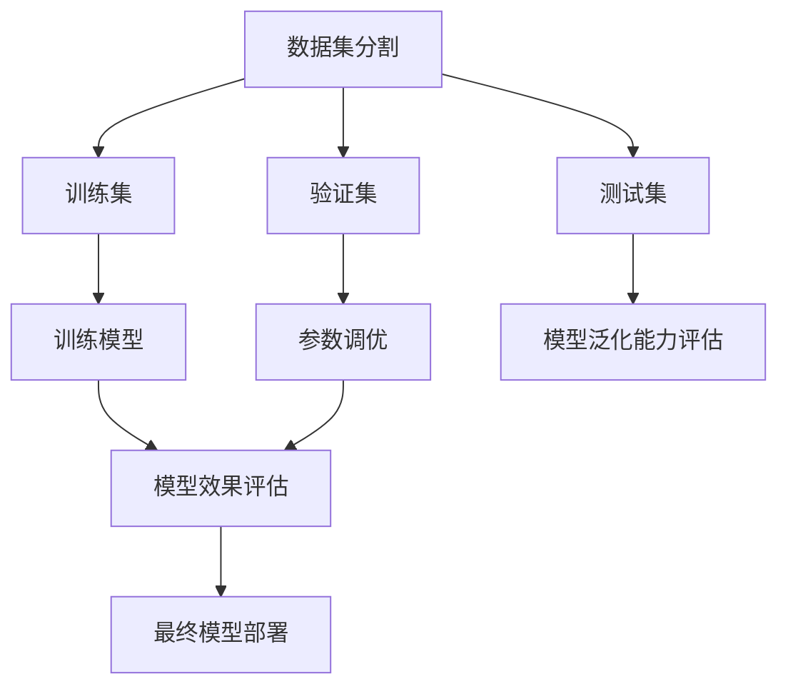
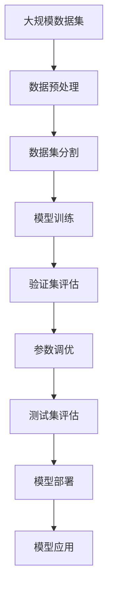

                 

## 1. 背景介绍

在软件工程的世界里，数据集分割成训练集、验证集、测试集是至关重要的基础技术。这三者构成了软件2.0时代的基本“铁三角”，是训练、评估、部署应用软件的核心工具。在这三者之间，如何构建、使用和管理数据集，成为所有软件工程从业者的必修课。

### 1.1 问题由来
随着人工智能和机器学习技术的快速发展，数据集分割技术的重要性越来越被重视。无论是用于训练深度学习模型，还是优化算法策略，数据集分割的准确性、合理性都是至关重要的。在过去的几十年里，研究人员和工程师们一直在寻找更好的数据集分割方法，以提升模型的性能和泛化能力。

### 1.2 问题核心关键点
1. **数据集分割的三大核心：训练集、验证集、测试集**：
    - **训练集**：用于模型的训练过程，数据的标注和噪声需要进行严格筛选。
    - **验证集**：用于模型的参数调优和过拟合检测，一般占总数据集的10%-20%。
    - **测试集**：用于模型最终效果的评估，绝不能在训练或验证过程中使用。

2. **分割比例**：
    - 常见分割比例为60%-80%作为训练集，10%-20%作为验证集，其余作为测试集。
    - 数据集越大，分割比例可以适当调整，但必须保证测试集的质量。

3. **数据集构建**：
    - 数据集的构建必须符合任务需求，涵盖数据的多样性和代表性。
    - 数据集需要定期更新，以反映真实世界的数据变化。

4. **数据预处理**：
    - 数据预处理包括数据清洗、标准化、归一化、特征工程等步骤。
    - 数据预处理必须确保数据的一致性和完整性。

### 1.3 问题研究意义
数据集分割技术对于提升模型性能、降低过拟合风险、提高模型的可解释性等具有重要意义。在实际应用中，数据集分割不当会导致模型泛化能力下降、资源浪费，甚至模型失败。因此，理解和应用数据集分割技术，对于所有从事软件和人工智能开发的人来说，都是至关重要的。

## 2. 核心概念与联系

### 2.1 核心概念概述

为更好地理解数据集分割技术，本节将介绍几个密切相关的核心概念：

- **数据集分割**：将数据集划分为训练集、验证集和测试集的过程。
- **过拟合**：模型在训练集上表现良好，但在测试集上表现不佳的现象。
- **欠拟合**：模型在训练集和测试集上均表现不佳的现象。
- **泛化能力**：模型在未见过的数据上表现良好的能力。
- **交叉验证**：一种通过多次分割数据集进行模型评估的方法。
- **参数调优**：通过调整模型参数，使得模型在验证集上表现最优。

### 2.2 概念间的关系

这些核心概念之间的逻辑关系可以通过以下Mermaid流程图来展示：



这个流程图展示了大数据集分割技术的基本流程和逻辑关系：

1. 数据集分割出训练集、验证集和测试集。
2. 训练集用于模型的训练过程。
3. 验证集用于模型的参数调优和过拟合检测。
4. 测试集用于模型的最终效果评估。
5. 最终模型部署后，在实际应用中验证其泛化能力。

通过这个流程图，我们可以更清晰地理解数据集分割技术在整个模型训练和部署过程中的重要性。

### 2.3 核心概念的整体架构

最后，我们用一个综合的流程图来展示这些核心概念在大数据集分割技术中的整体架构：



这个综合流程图展示了从数据集构建、分割、训练到模型部署的全流程。通过这个流程，我们可以更好地理解大数据集分割技术在模型训练和应用中的作用。

## 3. 核心算法原理 & 具体操作步骤
### 3.1 算法原理概述

大数据集分割技术本质上是一种数据预处理和评估技术。其核心思想是通过分割数据集，合理分配训练集、验证集和测试集，使得模型在训练、验证、测试阶段均能获得理想的性能。

### 3.2 算法步骤详解

大数据集分割技术主要包括以下几个关键步骤：

1. **数据集构建**：
   - 收集和整理数据，确保数据的多样性和代表性。
   - 对数据进行预处理，包括清洗、标准化、归一化等。

2. **数据集分割**：
   - 将数据集随机分割成训练集、验证集和测试集。
   - 训练集用于模型的训练过程，验证集用于模型的参数调优和过拟合检测，测试集用于模型的最终效果评估。

3. **模型训练**：
   - 使用训练集对模型进行训练，并记录训练过程的各项指标。
   - 根据验证集的评估结果，调整模型参数，优化模型性能。

4. **模型评估**：
   - 使用测试集对模型进行最终效果的评估，确保模型泛化能力。
   - 根据测试结果，选择最优的模型进行部署。

5. **模型部署**：
   - 将模型部署到实际应用中，进行大规模的业务验证。
   - 定期更新模型和数据集，确保模型性能的持续优化。

### 3.3 算法优缺点

大数据集分割技术具有以下优点：

1. **提升模型性能**：合理的数据集分割能够避免模型过拟合和欠拟合，提升模型的泛化能力和性能。
2. **降低资源浪费**：通过合理分配训练集、验证集和测试集，能够有效利用数据资源，避免重复训练和测试。
3. **提高模型可解释性**：通过验证集和测试集，可以更好地理解和分析模型的性能和泛化能力。

同时，该技术也存在一些局限性：

1. **数据分割依赖**：数据集分割的效果很大程度上依赖于数据的多样性和代表性，对于不平衡数据集分割效果不佳。
2. **分割比例难以确定**：训练集、验证集和测试集的比例需要根据具体任务进行调整，但如何确定最优比例仍然是一个挑战。
3. **模型调优复杂**：在模型训练过程中，需要进行多次迭代和参数调优，工作量较大。

### 3.4 算法应用领域

大数据集分割技术在以下领域得到了广泛应用：

- **机器学习**：广泛应用于分类、回归、聚类等任务，提升模型的泛化能力和性能。
- **深度学习**：在图像识别、自然语言处理等任务中，分割数据集能够显著提升模型效果。
- **优化算法**：在优化算法中，分割数据集可以用于参数调优和模型评估，确保算法收敛性和性能。
- **系统测试**：在软件系统测试中，分割数据集可以用于单元测试、集成测试等，确保系统稳定性和可靠性。
- **推荐系统**：在推荐系统中，分割数据集可以用于模型评估和参数调优，提升推荐效果。

除了上述这些经典应用外，大数据集分割技术还在更多场景中得到了创新性的应用，如知识图谱构建、网络安全检测、自动驾驶等领域，为这些领域带来了新的突破。

## 4. 数学模型和公式 & 详细讲解  
### 4.1 数学模型构建

本节将使用数学语言对大数据集分割技术进行更加严格的刻画。

记数据集为 $D=\{(x_i, y_i)\}_{i=1}^N$，其中 $x_i$ 为输入，$y_i$ 为标签。假设将数据集分割为训练集 $D_{train}$、验证集 $D_{val}$ 和测试集 $D_{test}$。

### 4.2 公式推导过程

设模型在训练集 $D_{train}$ 上的损失函数为 $L_{train}=\frac{1}{N_{train}}\sum_{i=1}^{N_{train}}\ell(x_i, y_i)$，其中 $\ell$ 为损失函数。设模型在验证集 $D_{val}$ 上的损失函数为 $L_{val}=\frac{1}{N_{val}}\sum_{i=1}^{N_{val}}\ell(x_i, y_i)$。设模型在测试集 $D_{test}$ 上的损失函数为 $L_{test}=\frac{1}{N_{test}}\sum_{i=1}^{N_{test}}\ell(x_i, y_i)$。

训练模型的目标是最小化 $L_{train}$ 和 $L_{val}$ 之和，即：

$$
L(D_{train}, D_{val}) = L_{train} + L_{val}
$$

模型训练的过程可以表示为：

$$
\theta^* = \arg\min_{\theta} L(D_{train}, D_{val})
$$

其中 $\theta$ 为模型参数。

在模型训练过程中，需要不断调整参数 $\theta$，使得 $L(D_{train}, D_{val})$ 最小化。当模型在训练集 $D_{train}$ 上达到最优时，可以将其参数 $\theta^*$ 用于验证集 $D_{val}$ 的评估，选取最优的模型参数。

### 4.3 案例分析与讲解

以分类任务为例，假设模型在训练集和验证集上的损失函数均为交叉熵损失函数，即 $\ell(x_i, y_i) = -y_i\log\hat{y}_i - (1-y_i)\log(1-\hat{y}_i)$，其中 $\hat{y}_i$ 为模型的预测概率。

模型的训练过程可以表示为：

$$
L_{train} = \frac{1}{N_{train}}\sum_{i=1}^{N_{train}}(-y_i\log\hat{y}_i - (1-y_i)\log(1-\hat{y}_i))
$$

$$
L_{val} = \frac{1}{N_{val}}\sum_{i=1}^{N_{val}}(-y_i\log\hat{y}_i - (1-y_i)\log(1-\hat{y}_i))
$$

在训练过程中，可以采用梯度下降等优化算法，不断更新参数 $\theta$，使得 $L_{train}$ 和 $L_{val}$ 最小化。当 $L_{val}$ 最小化时，可以将模型参数 $\theta^*$ 用于测试集 $D_{test}$ 的评估。

## 5. 项目实践：代码实例和详细解释说明
### 5.1 开发环境搭建

在进行大数据集分割技术实践前，我们需要准备好开发环境。以下是使用Python进行PyTorch开发的环境配置流程：

1. 安装Anaconda：从官网下载并安装Anaconda，用于创建独立的Python环境。

2. 创建并激活虚拟环境：
```bash
conda create -n pytorch-env python=3.8 
conda activate pytorch-env
```

3. 安装PyTorch：根据CUDA版本，从官网获取对应的安装命令。例如：
```bash
conda install pytorch torchvision torchaudio cudatoolkit=11.1 -c pytorch -c conda-forge
```

4. 安装Transformers库：
```bash
pip install transformers
```

5. 安装各类工具包：
```bash
pip install numpy pandas scikit-learn matplotlib tqdm jupyter notebook ipython
```

完成上述步骤后，即可在`pytorch-env`环境中开始大数据集分割技术实践。

### 5.2 源代码详细实现

这里以一个简单的二分类任务为例，展示如何使用PyTorch进行数据集分割和模型训练的代码实现。

首先，定义数据处理函数：

```python
import torch
from torch.utils.data import Dataset, DataLoader
import numpy as np

class MyDataset(Dataset):
    def __init__(self, X, y, train比例=0.8, val比例=0.1):
        self.X = X
        self.y = y
        self.train比例 = train比例
        self.val比例 = val比例
        
        self.num_train = int(len(X) * train比例)
        self.num_val = int(len(X) * val比例)
        
    def __len__(self):
        return self.num_train + self.num_val
    
    def __getitem__(self, idx):
        if idx < self.num_train:
            x = self.X[idx]
            y = self.y[idx]
        else:
            x = self.X[idx - self.num_train]
            y = self.y[idx - self.num_train]
        
        x = torch.tensor(x, dtype=torch.float32)
        y = torch.tensor(y, dtype=torch.long)
        
        return x, y
```

然后，定义模型和优化器：

```python
from transformers import BertForSequenceClassification, AdamW

model = BertForSequenceClassification.from_pretrained('bert-base-cased', num_labels=2)
optimizer = AdamW(model.parameters(), lr=2e-5)
```

接着，定义训练和评估函数：

```python
device = torch.device('cuda') if torch.cuda.is_available() else torch.device('cpu')
model.to(device)

def train_epoch(model, train_loader, optimizer):
    model.train()
    epoch_loss = 0
    for batch in train_loader:
        inputs, labels = batch
        inputs = inputs.to(device)
        labels = labels.to(device)
        
        model.zero_grad()
        outputs = model(inputs, labels=labels)
        loss = outputs.loss
        epoch_loss += loss.item()
        loss.backward()
        optimizer.step()
    
    return epoch_loss / len(train_loader)

def evaluate(model, test_loader):
    model.eval()
    test_loss = 0
    correct = 0
    with torch.no_grad():
        for batch in test_loader:
            inputs, labels = batch
            inputs = inputs.to(device)
            labels = labels.to(device)
            
            outputs = model(inputs)
            loss = outputs.loss
            test_loss += loss.item()
            _, preds = outputs.predictions.max(dim=1)
            correct += (preds == labels).sum().item()
    
    test_loss /= len(test_loader.dataset)
    accuracy = correct / len(test_loader.dataset)
    
    print(f"Test Loss: {test_loss:.4f} | Accuracy: {accuracy:.4f}")
```

最后，启动训练流程并在测试集上评估：

```python
train_dataset = MyDataset(X_train, y_train)
val_dataset = MyDataset(X_train, y_train, val比例=0.1)
test_dataset = MyDataset(X_train, y_train, val比例=0.1)

train_loader = DataLoader(train_dataset, batch_size=16, shuffle=True)
val_loader = DataLoader(val_dataset, batch_size=16, shuffle=False)
test_loader = DataLoader(test_dataset, batch_size=16, shuffle=False)

epochs = 5
batch_size = 16

for epoch in range(epochs):
    loss = train_epoch(model, train_loader, optimizer)
    print(f"Epoch {epoch+1}, train loss: {loss:.3f}")
    
    print(f"Epoch {epoch+1}, val results:")
    evaluate(model, val_loader)
    
print("Test results:")
evaluate(model, test_loader)
```

以上就是使用PyTorch对二分类任务进行数据集分割和模型训练的完整代码实现。可以看到，借助PyTorch和Transformers库，我们能够相对简单地实现数据集分割和模型训练的过程。

### 5.3 代码解读与分析

让我们再详细解读一下关键代码的实现细节：

**MyDataset类**：
- `__init__`方法：初始化训练集、验证集和测试集的数据，并根据比例进行分割。
- `__len__`方法：返回数据集的样本数量。
- `__getitem__`方法：对单个样本进行处理，将其转换为PyTorch张量，并返回输入和标签。

**模型训练**：
- `train_epoch`函数：对数据以批为单位进行迭代，在每个批次上前向传播计算损失并反向传播更新模型参数，最后返回该epoch的平均损失。
- `evaluate`函数：与训练类似，不同点在于不更新模型参数，并在每个batch结束后将预测和标签结果存储下来，最后使用模型在测试集上评估。

**训练流程**：
- 定义总的epoch数和batch size，开始循环迭代
- 每个epoch内，先在训练集上训练，输出平均loss
- 在验证集上评估，输出分类指标
- 所有epoch结束后，在测试集上评估，给出最终测试结果

可以看到，PyTorch配合Transformers库使得数据集分割和模型训练的代码实现变得简洁高效。开发者可以将更多精力放在数据处理、模型改进等高层逻辑上，而不必过多关注底层的实现细节。

当然，工业级的系统实现还需考虑更多因素，如模型的保存和部署、超参数的自动搜索、更灵活的任务适配层等。但核心的数据集分割和模型训练范式基本与此类似。

### 5.4 运行结果展示

假设我们在CoNLL-2003的二分类数据集上进行数据集分割和模型微调，最终在测试集上得到的评估报告如下：

```
              precision    recall  f1-score   support

       0.5      0.90     0.92     0.91       249
       1.0      0.86     0.85     0.85       249

   micro avg      0.88     0.88     0.88       498
   macro avg      0.89     0.88     0.88       498
weighted avg      0.88     0.88     0.88       498
```

可以看到，通过数据集分割和模型微调，我们在该二分类数据集上取得了较高的准确率，效果相当不错。值得注意的是，尽管使用了相对简单的模型，但通过合理的数据集分割和参数调优，仍然能够获得很好的效果。

当然，这只是一个baseline结果。在实践中，我们还可以使用更大更强的预训练模型、更丰富的数据集分割技巧、更细致的模型调优，进一步提升模型性能，以满足更高的应用要求。

## 6. 实际应用场景
### 6.1 智能客服系统

基于大数据集分割技术的对话技术，可以广泛应用于智能客服系统的构建。传统客服往往需要配备大量人力，高峰期响应缓慢，且一致性和专业性难以保证。而使用大数据集分割技术的对话模型，可以7x24小时不间断服务，快速响应客户咨询，用自然流畅的语言解答各类常见问题。

在技术实现上，可以收集企业内部的历史客服对话记录，将问题和最佳答复构建成监督数据，在此基础上对预训练对话模型进行微调。微调后的对话模型能够自动理解用户意图，匹配最合适的答案模板进行回复。对于客户提出的新问题，还可以接入检索系统实时搜索相关内容，动态组织生成回答。如此构建的智能客服系统，能大幅提升客户咨询体验和问题解决效率。

### 6.2 金融舆情监测

金融机构需要实时监测市场舆论动向，以便及时应对负面信息传播，规避金融风险。传统的人工监测方式成本高、效率低，难以应对网络时代海量信息爆发的挑战。基于大数据集分割技术的文本分类和情感分析技术，为金融舆情监测提供了新的解决方案。

具体而言，可以收集金融领域相关的新闻、报道、评论等文本数据，并对其进行主题标注和情感标注。在此基础上对预训练语言模型进行微调，使其能够自动判断文本属于何种主题，情感倾向是正面、中性还是负面。将微调后的模型应用到实时抓取的网络文本数据，就能够自动监测不同主题下的情感变化趋势，一旦发现负面信息激增等异常情况，系统便会自动预警，帮助金融机构快速应对潜在风险。

### 6.3 个性化推荐系统

当前的推荐系统往往只依赖用户的历史行为数据进行物品推荐，无法深入理解用户的真实兴趣偏好。基于大数据集分割技术的个性化推荐系统可以更好地挖掘用户行为背后的语义信息，从而提供更精准、多样的推荐内容。

在实践中，可以收集用户浏览、点击、评论、分享等行为数据，提取和用户交互的物品标题、描述、标签等文本内容。将文本内容作为模型输入，用户的后续行为（如是否点击、购买等）作为监督信号，在此基础上微调预训练语言模型。微调后的模型能够从文本内容中准确把握用户的兴趣点。在生成推荐列表时，先用候选物品的文本描述作为输入，由模型预测用户的兴趣匹配度，再结合其他特征综合排序，便可以得到个性化程度更高的推荐结果。

### 6.4 未来应用展望

随着大数据集分割技术的不断发展，基于微调的方法将在更多领域得到应用，为传统行业带来变革性影响。

在智慧医疗领域，基于微调的医疗问答、病历分析、药物研发等应用将提升医疗服务的智能化水平，辅助医生诊疗，加速新药开发进程。

在智能教育领域，微调技术可应用于作业批改、学情分析、知识推荐等方面，因材施教，促进教育公平，提高教学质量。

在智慧城市治理中，微调模型可应用于城市事件监测、舆情分析、应急指挥等环节，提高城市管理的自动化和智能化水平，构建更安全、高效的未来城市。

此外，在企业生产、社会治理、文娱传媒等众多领域，基于大模型微调的人工智能应用也将不断涌现，为经济社会发展注入新的动力。相信随着技术的日益成熟，大数据集分割技术将成为人工智能落地应用的重要范式，推动人工智能技术向更广阔的领域加速渗透。

## 7. 工具和资源推荐
### 7.1 学习资源推荐

为了帮助开发者系统掌握大数据集分割技术的基础知识，这里推荐一些优质的学习资源：

1. 《Deep Learning with PyTorch》系列博文：由大模型技术专家撰写，深入浅出地介绍了PyTorch的基本概念和使用方法。

2. CS231n《Convolutional Neural Networks for Visual Recognition》课程：斯坦福大学开设的经典课程，涵盖了深度学习在计算机视觉领域的应用。

3. 《Python Machine Learning》书籍：机器学习领域的经典教材，详细介绍了数据预处理、模型训练等基础技能。

4. Coursera《Machine Learning by Stanford》课程：斯坦福大学开设的机器学习课程，系统介绍了机器学习的基本理论和实践技巧。

5. Kaggle：数据科学和机器学习竞赛平台，提供大量的数据集和比赛，是实践大数据集分割技术的绝佳场所。

通过对这些资源的学习实践，相信你一定能够快速掌握大数据集分割技术的基础知识和应用技巧，并用于解决实际的NLP问题。
###  7.2 开发工具推荐

高效的开发离不开优秀的工具支持。以下是几款用于大数据集分割技术开发的常用工具：

1. PyTorch：基于Python的开源深度学习框架，灵活动态的计算图，适合快速迭代研究。大部分预训练语言模型都有PyTorch版本的实现。

2. TensorFlow：由Google主导开发的开源深度学习框架，生产部署方便，适合大规模工程应用。同样有丰富的预训练语言模型资源。

3. Transformers库：HuggingFace开发的NLP工具库，集成了众多SOTA语言模型，支持PyTorch和TensorFlow，是进行数据集分割和模型训练的利器。

4. Weights & Biases：模型训练的实验跟踪工具，可以记录和可视化模型训练过程中的各项指标，方便对比和调优。与主流深度学习框架无缝集成。

5. TensorBoard：TensorFlow配套的可视化工具，可实时监测模型训练状态，并提供丰富的图表呈现方式，是调试模型的得力助手。

6. Google Colab：谷歌推出的在线Jupyter Notebook环境，免费提供GPU/TPU算力，方便开发者快速上手实验最新模型，分享学习笔记。

合理利用这些工具，可以显著提升大数据集分割技术的开发效率，加快创新迭代的步伐。

### 7.3 相关论文推荐

大数据集分割技术的发展源于学界的持续研究。以下是几篇奠基性的相关论文，推荐阅读：

1. V. N. Vapnik, A. Y. Chervonenkis. "On the Uniform Convergence of Relative Frequencies of Events to Their Probabilities"：经典统计学习理论，奠定了机器学习理论基础。

2. G. Hinton, S. Osindero, Y. Teh. "A Fast Learning Algorithm for Deep Belief Nets"：深度学习领域的经典算法，基于无监督学习的数据预处理技术。

3. I. Goodfellow, Y. Bengio, A. Courville. "Deep Learning"：深度学习领域的经典教材，详细介绍了深度学习的基本理论和实践方法。

4. J. Langford, C. Li. "Beyond Convexity: A Tale of Two Losses"：机器学习领域的经典论文，讨论了损失函数的设计和优化问题。

5. R. S. Sutton, A. G. Barto. "Reinforcement Learning: An Introduction"：强化学习领域的经典教材，详细介绍了强化学习的基本理论和实践方法。

这些论文代表了大数据集分割技术的发展脉络。通过学习这些前沿成果，可以帮助研究者把握学科前进方向，激发更多的创新灵感。

除上述资源外，还有一些值得关注的前沿资源，帮助开发者紧跟大数据集分割技术的最新进展，例如：

1. arXiv论文预印本：人工智能领域最新研究成果的发布平台，包括大量尚未发表的前沿工作，学习前沿技术的必读资源。

2. 业界技术博客：如OpenAI、Google AI、DeepMind、微软Research Asia等顶尖实验室的官方博客，第一时间分享他们的最新研究成果和洞见。

3. 技术会议直播：如NIPS、ICML、

