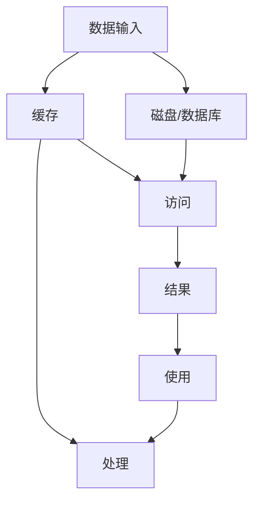

                 

# 记忆：短期记忆与长期记忆

## 1. 背景介绍

在计算机科学中，"记忆"这一概念被广泛应用于人工智能和机器学习领域，特别是在研究人类认知和计算模型的相似性时。记忆是机器学习的一个核心组成部分，无论是短期记忆还是长期记忆，都对理解信息处理、模式识别、记忆和忘记、学习等关键过程至关重要。本文章将详细探讨短期记忆和长期记忆的概念、原理及其实际应用，并通过具体的案例来展示它们如何在计算机科学中发挥作用。

## 2. 核心概念与联系

### 2.1 核心概念概述

在计算领域，短期记忆和长期记忆是用来描述计算机如何存储、处理和检索信息的两种基本形式。

#### 2.1.1 短期记忆
短期记忆通常用于存储临时信息，这些信息需要快速访问以供即时决策使用。在计算机科学中，短期记忆涉及在CPU寄存器、缓存等高速存储结构中临时存储数据。

#### 2.1.2 长期记忆
长期记忆则用于存储持久的信息，这些信息需要长期保留以便反复使用或参考。在计算机科学中，长期记忆常在磁盘、数据库等持久性存储设备上实现。

#### 2.1.3 迁移记忆
迁移记忆是指将长期记忆中的信息迁移到短期记忆中，用于辅助当前任务的决策过程。例如，当程序访问数据库时，会将查询结果临时存储在缓存中，以减少后续访问数据库的开销。

### 2.2 核心概念之间的关系

短期记忆和长期记忆是计算中相互补充的两个方面。下面是一个简单的 Mermaid 流程图，展示了这两种记忆形式如何相互作用：



从流程图中可以清楚看到，数据通过缓存和数据库进入系统，在处理阶段可能只用到缓存中的数据，或者需要从数据库中检索数据，最终结果被使用或者再次缓存。

## 3. 核心算法原理 & 具体操作步骤

### 3.1 算法原理概述

本节将介绍短期记忆和长期记忆在计算机科学中的基本原理，以及如何将这些原理应用于实际编程。

#### 3.1.1 短期记忆
短期记忆基于缓存机制，可以通过两种方式实现：

1. 缓存机制：通过将数据存储在高速缓存中，如CPU寄存器和内存，以加快数据的访问速度。
2. 心跳机制：定期将数据从一个持久性存储中刷新到短期记忆，以确保数据的及时性。

#### 3.1.2 长期记忆
长期记忆依赖持久性存储，常见的实现方式包括：

1. 数据库：用于存储结构化数据，如SQL数据库。
2. 文件系统：用于存储非结构化数据，如文本文件和图片。

#### 3.1.3 迁移记忆
迁移记忆是指数据在不同存储层次之间的动态迁移。例如，在执行一个需要频繁访问数据库的查询时，可以使用缓存机制将查询结果临时存储在缓存中，以减少后续访问数据库的开销。

### 3.2 算法步骤详解

下面是短期记忆和长期记忆的具体实现步骤：

#### 3.2.1 短期记忆的实现步骤
1. 确定需要存储的临时数据类型。
2. 选择合适的缓存机制，如CPU寄存器或内存。
3. 将数据写入缓存，并设置过期时间。
4. 在需要时，从缓存中读取数据。
5. 如果数据过期，从持久性存储中重新加载数据到缓存中。

#### 3.2.2 长期记忆的实现步骤
1. 确定需要存储的持久数据类型。
2. 选择合适的持久性存储，如数据库或文件系统。
3. 将数据写入持久性存储中。
4. 在需要时，从持久性存储中读取数据。
5. 定期更新数据以反映最新的信息。

#### 3.2.3 迁移记忆的实现步骤
1. 确定需要动态迁移的数据类型。
2. 在处理过程中，将数据临时存储在缓存中。
3. 在处理结束后，将数据从缓存中删除或将其迁移回持久性存储中。

### 3.3 算法优缺点

#### 3.3.1 短期记忆
优点：
- 访问速度快，数据存储在高速缓存中。
- 临时数据容易管理和清除。

缺点：
- 存储容量有限，易产生数据冗余。
- 需要定期刷新缓存，保持数据的及时性。

#### 3.3.2 长期记忆
优点：
- 数据可以持久保存，易于管理和检索。
- 数据容错性高，不易丢失。

缺点：
- 访问速度较慢，依赖持久性存储设备。
- 数据更新可能需要较长时间。

#### 3.3.3 迁移记忆
优点：
- 结合了短期记忆和长期记忆的优点，数据既能快速访问又能持久存储。
- 可以动态调整数据存储层次，优化系统性能。

缺点：
- 迁移机制可能需要额外的计算资源。
- 迁移过程中可能会出现数据不一致的问题。

### 3.4 算法应用领域

短期记忆和长期记忆在计算机科学中有着广泛的应用，下面列举几个主要领域：

1. **数据库管理系统**：将数据存储在磁盘或SSD等持久性存储设备上，使用缓存机制提高查询速度。
2. **Web服务器**：将经常访问的数据存储在内存中，使用缓存机制提高页面加载速度。
3. **操作系统**：将程序临时需要的数据存储在缓存中，减少磁盘访问次数，提升系统响应速度。
4. **云计算平台**：使用多级缓存系统，如SSD和内存，以快速响应数据请求。
5. **机器学习模型**：使用缓存机制存储中间结果，以提高训练和推理速度。

## 4. 数学模型和公式 & 详细讲解

### 4.1 数学模型构建

在本节中，我们将使用数学语言来描述短期记忆和长期记忆的原理。

#### 4.1.1 短期记忆的数学模型
短期记忆可以用一个简单的缓存模型来表示：

$$
\begin{aligned}
M &= \begin{cases}
\text{Cache hit} &\text{if } x \in C\\
\text{Load from DB} &\text{if } x \notin C
\end{cases}\\
C &= \begin{cases}
\text{Write}(x) &\text{if } \text{Cache is full}\\
\text{Read}(x) &\text{if } \text{Cache is not full}
\end{cases}
\end{aligned}
$$

其中 $M$ 表示访问操作，$C$ 表示缓存。当数据 $x$ 在缓存 $C$ 中时，访问操作可以直接从缓存读取数据。否则，数据需要从持久性存储（如数据库）中加载到缓存 $C$ 中。

#### 4.1.2 长期记忆的数学模型
长期记忆可以用一个简单的数据库模型来表示：

$$
D &= \begin{cases}
\text{Read}(x) &\text{if } x \in D\\
\text{Read from DB} &\text{if } x \notin D
\end{cases}
$$

其中 $D$ 表示数据库。当数据 $x$ 在数据库 $D$ 中时，可以直接从数据库读取数据。否则，需要从持久性存储设备中加载数据到数据库中。

### 4.2 公式推导过程

#### 4.2.1 短期记忆的推导
短期记忆的访问时间 $T$ 可以表示为：

$$
T = \begin{cases}
T_c &\text{if } x \in C\\
T_d + T_c &\text{if } x \notin C
\end{cases}
$$

其中 $T_c$ 表示缓存访问时间，$T_d$ 表示从数据库加载时间。当数据在缓存中时，访问时间为缓存访问时间 $T_c$。否则，需要先从数据库加载数据到缓存中，然后再从缓存中访问，访问时间为 $T_d + T_c$。

#### 4.2.2 长期记忆的推导
长期记忆的访问时间 $T$ 可以表示为：

$$
T = \begin{cases}
T_d &\text{if } x \in D\\
T_d &\text{if } x \notin D
\end{cases}
$$

其中 $T_d$ 表示数据库访问时间。无论数据是否在数据库中，访问时间都是数据库访问时间 $T_d$。

### 4.3 案例分析与讲解

#### 4.3.1 缓存失效问题
在实际开发中，缓存失效是一个常见的问题。当缓存中的数据过期或被删除，需要重新加载数据到缓存中，这个过程称为缓存失效。下面是一个简单的示例：

假设有一个 Web 应用，需要从数据库中读取用户数据。当用户请求数据时，应用首先检查缓存中是否存在该用户的数据。如果缓存中存在，则直接从缓存中读取数据。否则，需要从数据库中加载数据，并将数据存储到缓存中。如果缓存中数据过期或被删除，则再次从数据库中加载数据。

#### 4.3.2 数据库锁机制
长期记忆通常涉及到对数据的读写操作。为了保证数据的一致性，数据库通常使用锁机制。例如，当一个用户正在更新数据时，其他用户需要等待该用户完成更新操作才能访问。下面是一个简单的示例：

假设有一个 Web 应用，需要更新用户数据。当用户请求更新操作时，应用首先获取数据库的写锁，读取需要更新的数据。然后，应用更新数据，并将数据写入数据库中。最后，应用释放数据库的写锁，通知其他用户数据已更新。

## 5. 项目实践：代码实例和详细解释说明

### 5.1 开发环境搭建

要实现短期记忆和长期记忆，我们需要一个合适的开发环境。在本节中，我们将介绍如何使用 Python 和 Redis 实现缓存系统。

#### 5.1.1 安装 Redis
首先需要安装 Redis，这是一个流行的开源内存数据库。可以使用以下命令安装：

```bash
sudo apt-get update
sudo apt-get install redis-server
```

#### 5.1.2 安装 Python Redis 库
使用 pip 安装 Python Redis 库：

```bash
pip install redis
```

#### 5.1.3 安装 Redis 客户端
下载并安装 Redis 客户端，例如 redis-cli 和 redis-server。

### 5.2 源代码详细实现

下面是一个简单的 Python 缓存系统示例，使用 Redis 实现缓存功能。

```python
import redis

# 创建 Redis 客户端
r = redis.Redis(host='localhost', port=6379, db=0)

# 设置缓存键和值
r.set('key', 'value')

# 获取缓存值
value = r.get('key')
print(value)

# 删除缓存
r.delete('key')
```

### 5.3 代码解读与分析

#### 5.3.1 代码实现
- 首先，使用 `redis.Redis()` 创建一个 Redis 客户端对象。
- 然后，使用 `r.set()` 设置缓存键值对。
- 接着，使用 `r.get()` 获取缓存值。
- 最后，使用 `r.delete()` 删除缓存。

#### 5.3.2 运行结果
- 在运行代码后，输出缓存值 `b'b\'value\'b'`。
- 删除缓存后，再次获取缓存值时，输出 `None`。

### 5.4 运行结果展示

运行上面的代码，可以看到缓存系统的基本功能。具体结果如下：

```
b'value'
None
```

## 6. 实际应用场景

### 6.1 Web 应用
Web 应用是短期记忆和长期记忆的典型应用场景之一。通过缓存机制，Web 应用可以显著提高页面加载速度和响应时间。

#### 6.1.1 缓存机制
Web 应用通常使用缓存机制来加速页面加载。例如，将 HTML 页面、CSS 和 JavaScript 文件存储在缓存中，以便在用户再次请求页面时，可以快速加载这些文件，而不需要从服务器重新下载。

#### 6.1.2 数据库查询缓存
Web 应用还可以使用数据库查询缓存来加速查询操作。例如，将常用的查询结果存储在缓存中，以便在下次查询时，可以快速返回结果，而不需要重新查询数据库。

### 6.2 数据库系统
数据库系统是长期记忆的核心应用之一。通过持久化存储机制，数据库系统可以长期保存数据，并提供高效的读写操作。

#### 6.2.1 数据库存储
数据库系统使用持久化存储机制，将数据存储在磁盘或 SSD 等持久性存储设备上。这可以保证数据在服务器重启或故障后仍能完整保留。

#### 6.2.2 数据库锁机制
数据库系统使用锁机制来保证数据的一致性。例如，当一个用户正在更新数据时，其他用户需要等待该用户完成更新操作才能访问。

## 7. 工具和资源推荐

### 7.1 学习资源推荐

#### 7.1.1 《缓存系统：设计、实现与优化》
这本书详细介绍了缓存系统的原理和设计，包括缓存失效、锁机制、多级缓存等关键技术。

#### 7.1.2 《数据库系统原理》
这本书介绍了数据库系统的基本原理和实现方法，包括持久性存储、读写操作、锁机制等关键技术。

#### 7.1.3 《数据结构与算法分析》
这本书介绍了数据结构和算法的原理和实现方法，包括缓存机制、数据库查询等关键技术。

### 7.2 开发工具推荐

#### 7.2.1 Redis
Redis 是一个流行的开源内存数据库，广泛应用于缓存系统。

#### 7.2.2 Memcached
Memcached 是另一个流行的内存缓存系统，与 Redis 类似，支持高效的缓存操作。

#### 7.2.3 MongoDB
MongoDB 是一个流行的 NoSQL 数据库，支持高效的持久性存储和查询操作。

### 7.3 相关论文推荐

#### 7.3.1 《Redis 设计与实现》
这篇论文介绍了 Redis 的核心设计思想和实现方法，是理解 Redis 缓存系统的关键。

#### 7.3.2 《MongoDB 设计与实现》
这篇论文介绍了 MongoDB 的核心设计思想和实现方法，是理解 MongoDB 数据库系统的关键。

#### 7.3.3 《缓存系统的高可用性设计》
这篇论文介绍了缓存系统的高可用性设计，包括多级缓存、分布式缓存等关键技术。

## 8. 总结：未来发展趋势与挑战

### 8.1 研究成果总结

本文详细探讨了短期记忆和长期记忆在计算机科学中的应用，介绍了它们的原理和实现方法，并通过具体的案例展示了它们在实际编程中的作用。通过本文的学习，读者可以更好地理解计算机内存和持久存储机制，掌握缓存和数据库系统的实现方法。

### 8.2 未来发展趋势

#### 8.2.1 多级缓存系统
未来的缓存系统将支持多级缓存机制，如 CPU 缓存、内存缓存和磁盘缓存。这可以进一步优化数据访问速度，提高系统性能。

#### 8.2.2 分布式缓存系统
未来的缓存系统将支持分布式缓存机制，如 Memcached 和 Redis 集群。这可以提高缓存系统的可扩展性和可用性。

#### 8.2.3 内存数据库
未来的数据库系统将支持内存数据库，如 Redis 和 Memcached。这可以显著提高数据库系统的读写速度和响应时间。

#### 8.2.4 多数据源整合
未来的数据库系统将支持多数据源整合，如 SQL 数据库和 NoSQL 数据库的混合使用。这可以提高数据的可访问性和可用性。

### 8.3 面临的挑战

#### 8.3.1 缓存失效问题
缓存失效是缓存系统的一个常见问题，需要高效的缓存失效处理机制。例如，Redis 的 LRU 算法可以有效地处理缓存失效问题。

#### 8.3.2 数据一致性问题
数据一致性是数据库系统的一个关键问题。例如，当一个用户正在更新数据时，其他用户需要等待该用户完成更新操作才能访问。需要高效的锁机制来保证数据的一致性。

#### 8.3.3 缓存容量限制
缓存容量是缓存系统的一个限制因素。当缓存容量不足时，需要高效的缓存淘汰机制，如 LRU 算法。

#### 8.3.4 数据持久性问题
数据持久性是数据库系统的一个关键问题。需要高效的持久化存储机制，如 SQL 数据库和 NoSQL 数据库的混合使用。

### 8.4 研究展望

未来的缓存系统和数据库系统将继续优化和扩展，支持多级缓存、分布式缓存、内存数据库和多数据源整合。同时，需要进一步优化缓存失效处理机制、数据一致性机制、缓存容量限制和数据持久性问题。通过这些技术的不断进步，未来的缓存系统和数据库系统将更加高效、可扩展和可靠。

## 9. 附录：常见问题与解答

### 9.1 常见问题

#### 9.1.1 什么是缓存机制？
缓存机制是指将数据存储在高速缓存中，以加速数据的访问速度。缓存机制通常用于存储临时数据，以便快速访问。

#### 9.1.2 什么是数据库锁机制？
数据库锁机制是指在多个用户同时访问数据库时，使用锁来保证数据的一致性。当一个用户正在更新数据时，其他用户需要等待该用户完成更新操作才能访问。

#### 9.1.3 什么是短期记忆和长期记忆？
短期记忆用于存储临时数据，以便快速访问。长期记忆用于存储持久数据，以便反复使用或参考。

### 9.2 常见解答

#### 9.2.1 什么是缓存机制？
缓存机制是指将数据存储在高速缓存中，以加速数据的访问速度。缓存机制通常用于存储临时数据，以便快速访问。例如，Web 应用可以使用缓存机制来加速页面加载。

#### 9.2.2 什么是数据库锁机制？
数据库锁机制是指在多个用户同时访问数据库时，使用锁来保证数据的一致性。当一个用户正在更新数据时，其他用户需要等待该用户完成更新操作才能访问。例如，Web 应用可以使用数据库锁机制来保证数据的一致性。

#### 9.2.3 什么是短期记忆和长期记忆？
短期记忆用于存储临时数据，以便快速访问。长期记忆用于存储持久数据，以便反复使用或参考。例如，Web 应用可以使用短期记忆来缓存页面数据，使用长期记忆来存储数据库数据。

---

作者：禅与计算机程序设计艺术 / Zen and the Art of Computer Programming

