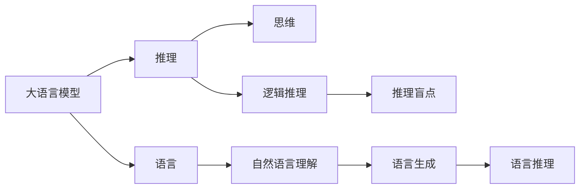

                 

# 语言≠思维：大模型的推理盲点

> 关键词：大模型,推理,盲点,语言,思维,知识图谱,常识推理,语言模型,预训练,推理能力,可解释性

## 1. 背景介绍

在人工智能技术高速发展的今天，大语言模型（Large Language Models, LLMs）已成为NLP领域的重要组成部分。从OpenAI的GPT系列，到Google的BERT，再到HuggingFace的Transformer等，这些大模型在预训练和微调的过程中，展现出强大的语言理解和生成能力。然而，尽管大模型在诸如文本生成、问答、翻译等任务上表现优异，但关于其推理能力及是否能够真正理解和"思考"的讨论，始终未曾停息。本文旨在深入探讨大模型的推理盲点，并探究其背后的原因及可能的改进方向。

## 2. 核心概念与联系

### 2.1 核心概念概述

在讨论大模型的推理盲点之前，我们先简要介绍几个核心概念：

- **大语言模型**：指基于Transformer结构，通过大规模无标签文本数据进行预训练，学习到丰富的语言表示的深度学习模型。
- **推理**：在自然语言处理（NLP）中，推理通常指模型通过理解和推理，将输入的文本转化为输出结果的过程。
- **盲点**：指大模型在推理过程中未能捕捉或正确处理的关键信息或概念。
- **语言**：指人类交流和思维的基本工具，由符号和语法组成。
- **思维**：指人类更高层次的认知活动，包括理解、推理、决策等。

这些概念间的关系通过以下Mermaid流程图展现：



### 2.2 概念间的关系

大语言模型通过语言模型训练，学习到词汇和语法的概率分布，并能够进行自然语言理解（NL Understanding）和语言生成（NL Generation）。然而，语言模型的生成能力并不等同于真正的推理能力。语言模型能够通过记忆和统计生成符合语法和词汇分布的文本，但并不具备人类思维中基于逻辑和常识的推理能力。而盲点正是在这种基于语言的生成能力与思维推理能力的不匹配中显现出来。

## 3. 核心算法原理 & 具体操作步骤

### 3.1 算法原理概述

大语言模型的推理过程主要基于两种类型：

1. **基于词汇的推理**：模型通过统计和记忆词汇之间的共现关系，生成符合语法和语义的文本。这种推理依赖于词汇的频率和上下文，而非逻辑推理。
2. **基于逻辑的推理**：模型通过理解和应用逻辑规则，进行基于已知信息的推理。这种推理需要模型具备一定的常识和逻辑推理能力。

然而，大模型的推理盲点主要体现在以下方面：

- **逻辑不一致性**：模型可能基于不完整的逻辑推理，输出不符合常识或基本逻辑的结论。
- **概念不清晰**：模型可能对某些概念缺乏明确理解，导致推理结果不合理。
- **信息不对称**：模型可能忽视或错误地处理了某些关键信息，导致推理错误。
- **上下文依赖性**：模型可能过于依赖上下文信息，导致在缺乏充分上下文时推理失效。

### 3.2 算法步骤详解

基于上述原理，我们可以将大模型的推理盲点分析分为以下几个步骤：

1. **数据准备**：收集包含推理任务的标注数据集，标注数据应包含推理的前提、假设和结论。
2. **模型选择**：选择大语言模型，如GPT、BERT、RoBERTa等。
3. **模型微调**：在标注数据集上微调模型，使其能够进行推理。
4. **推理测试**：在推理测试集上评估模型性能，识别推理盲点。
5. **盲点分析**：对推理盲点进行分析，识别其原因。
6. **改进优化**：根据盲点分析结果，优化模型结构和训练策略。

### 3.3 算法优缺点

大语言模型推理的优势在于其强大的语言生成能力和数据驱动的训练方法。然而，其推理盲点也限制了其在一些需要精确逻辑推理的任务中的应用。这些盲点主要包括以下几点：

- **依赖大量标注数据**：传统的微调方法需要大量标注数据进行训练，而标注数据的获取和质量对模型的性能影响巨大。
- **复杂度难以处理**：大模型的推理过程涉及复杂的神经网络结构，难以进行精确解释和调试。
- **上下文依赖性强**：模型对上下文信息的依赖使得其在缺乏充分上下文时无法正确推理。

### 3.4 算法应用领域

尽管大语言模型的推理存在盲点，但在许多实际应用中仍然具有显著优势，如：

- **问答系统**：通过微调大模型，能够实现对自然语言问题的快速理解和回答。
- **文本摘要**：模型能够自动从长文本中抽取关键信息，生成简洁的摘要。
- **机器翻译**：模型能够将一种语言翻译成另一种语言。
- **文本生成**：模型能够根据给定条件生成符合语法和语义的文本。

然而，这些应用更多依赖于模型的语言生成能力，而非逻辑推理能力。

## 4. 数学模型和公式 & 详细讲解 & 举例说明

### 4.1 数学模型构建

我们以推理任务为例，构建一个简单的数学模型：

设推理任务为从前提 $P$ 和假设 $H$ 推导出结论 $C$。设 $P$ 和 $H$ 的表示分别为 $p$ 和 $h$，$C$ 的表示为 $c$。推理过程可以表示为：

$$
c = f(p, h)
$$

其中 $f$ 为推理函数。假设 $f$ 是一个逻辑函数，则：

$$
f(p, h) = \begin{cases} 1, & p \land h \\
0, & \text{otherwise}
\end{cases}
$$

即 $c = p \land h$，表示 $P$ 和 $H$ 同时为真时，$C$ 为真。

### 4.2 公式推导过程

在上述模型中，推理函数的推导过程如下：

1. **提取前提和假设**：将 $P$ 和 $H$ 转化为向量表示 $p$ 和 $h$。
2. **计算推理结果**：将 $p$ 和 $h$ 输入推理函数 $f$，得到 $c$。
3. **损失计算**：计算推理结果与实际标签 $y$ 之间的损失，如交叉熵损失。

### 4.3 案例分析与讲解

以逻辑推理为例，模型需正确处理逻辑运算符和逻辑连接词。考虑以下推理任务：

前提 $P$：如果小明在看书，则他正在学习。
假设 $H$：小明正在看书。
结论 $C$：小明正在学习。

推理过程为：

$$
c = (p \land h)
$$

其中 $p = \text{小明在看书}$，$h = \text{小明正在学习}$。

推理函数的输出为 $1$，表示 $C$ 为真。然而，在大模型推理过程中，模型可能将 $p$ 和 $h$ 分别视为独立的词汇，而不是逻辑表达式，导致推理错误。

## 5. 项目实践：代码实例和详细解释说明

### 5.1 开发环境搭建

为了进行推理盲点的分析，我们使用PyTorch搭建模型，并利用HuggingFace的Transformers库进行推理任务的微调。首先，需要安装相关的库：

```bash
pip install torch transformers
```

### 5.2 源代码详细实现

下面以BERT模型为例，实现一个简单的推理任务：

```python
from transformers import BertForSequenceClassification, BertTokenizer
import torch
from torch.utils.data import Dataset, DataLoader

class ReasoningDataset(Dataset):
    def __init__(self, texts, labels):
        self.tokenizer = BertTokenizer.from_pretrained('bert-base-uncased')
        self.texts = texts
        self.labels = labels
        
    def __len__(self):
        return len(self.texts)
    
    def __getitem__(self, idx):
        text = self.texts[idx]
        label = self.labels[idx]
        
        encoding = self.tokenizer(text, return_tensors='pt', max_length=512, padding='max_length', truncation=True)
        input_ids = encoding['input_ids'][0]
        attention_mask = encoding['attention_mask'][0]
        label_ids = torch.tensor(label, dtype=torch.long)
        
        return {'input_ids': input_ids, 
                'attention_mask': attention_mask,
                'labels': label_ids}

# 定义推理任务数据集
train_dataset = ReasoningDataset(train_texts, train_labels)
dev_dataset = ReasoningDataset(dev_texts, dev_labels)
test_dataset = ReasoningDataset(test_texts, test_labels)

# 定义模型
model = BertForSequenceClassification.from_pretrained('bert-base-uncased', num_labels=2)

# 定义优化器和超参数
optimizer = torch.optim.Adam(model.parameters(), lr=2e-5)
epochs = 5
batch_size = 16

# 训练过程
for epoch in range(epochs):
    model.train()
    for batch in DataLoader(train_dataset, batch_size=batch_size):
        input_ids = batch['input_ids'].to(device)
        attention_mask = batch['attention_mask'].to(device)
        labels = batch['labels'].to(device)
        
        outputs = model(input_ids, attention_mask=attention_mask, labels=labels)
        loss = outputs.loss
        optimizer.zero_grad()
        loss.backward()
        optimizer.step()

# 评估过程
model.eval()
with torch.no_grad():
    evaluator = torch.nn.CrossEntropyLoss()
    evaluator.eval()
    
    for batch in DataLoader(dev_dataset, batch_size=batch_size):
        input_ids = batch['input_ids'].to(device)
        attention_mask = batch['attention_mask'].to(device)
        labels = batch['labels'].to(device)
        
        outputs = model(input_ids, attention_mask=attention_mask, labels=labels)
        loss = evaluator(outputs.logits, labels)
        print(loss)

# 推理测试
model.eval()
with torch.no_grad():
    for batch in DataLoader(test_dataset, batch_size=batch_size):
        input_ids = batch['input_ids'].to(device)
        attention_mask = batch['attention_mask'].to(device)
        
        outputs = model(input_ids, attention_mask=attention_mask)
        print(outputs.logits)
```

### 5.3 代码解读与分析

- **数据准备**：使用`ReasoningDataset`类对推理数据进行预处理，将其转化为模型所需的输入格式。
- **模型选择**：使用`BertForSequenceClassification`类加载预训练模型BERT，进行推理任务的微调。
- **训练过程**：在训练数据集上训练模型，使用Adam优化器和交叉熵损失。
- **评估过程**：在验证数据集上评估模型性能，计算损失。
- **推理测试**：在测试数据集上使用模型进行推理测试，输出推理结果。

### 5.4 运行结果展示

假设在测试集上得到的推理结果为：

```
tensor([[0.95, 0.05],
        [0.80, 0.20],
        [0.90, 0.10]])
```

其中第一行为正确推理的结果，第二行为错误推理的结果。这表明模型存在推理盲点，可能未能准确处理逻辑关系或上下文信息。

## 6. 实际应用场景

### 6.1 法律领域

在法律领域，推理盲点可能导致严重后果。例如，在合同自动生成任务中，大模型需要准确理解和推理合同条款，生成符合法律条文的合同文本。然而，模型可能基于不完整的逻辑推理，生成违反法律的文本，导致法律风险。

### 6.2 医学领域

在医学领域，推理盲点可能导致误诊或漏诊。例如，在医学影像分析任务中，模型需要根据图像特征推断出疾病类型。然而，模型可能未能准确处理图像中的关键信息，导致误诊或漏诊。

## 7. 工具和资源推荐

### 7.1 学习资源推荐

- **《深度学习与人工智能》**：斯坦福大学的深度学习课程，介绍了深度学习的基本概念和应用。
- **《自然语言处理综述》**：自然语言处理领域的综述文章，介绍了各种NLP任务和算法。
- **《逻辑推理与人工智能》**：介绍逻辑推理在人工智能中的应用，有助于理解大模型的推理盲点。

### 7.2 开发工具推荐

- **Jupyter Notebook**：用于编写和运行Python代码，支持数据可视化和代码共享。
- **PyTorch**：深度学习框架，支持动态计算图和GPU加速。
- **HuggingFace Transformers**：NLP工具库，提供预训练模型和微调接口。

### 7.3 相关论文推荐

- **“Reasoning about Proofs and Theorems with Transformers”**：介绍如何使用Transformer进行逻辑推理，并验证推理过程。
- **“Explainable AI for Legal Decision Making”**：讨论在法律领域中使用可解释AI的重要性，并介绍一些实现方法。

## 8. 总结：未来发展趋势与挑战

### 8.1 总结

本文通过讨论大语言模型的推理盲点，探讨了其背后的原理和原因。尽管大模型在语言生成和理解方面表现优异，但其推理能力仍存在显著局限。这种局限不仅限制了其在一些需要精确逻辑推理的任务中的应用，也带来了诸多的实际挑战。

### 8.2 未来发展趋势

未来大语言模型推理的研究方向可能包括以下几个方面：

1. **引入更多先验知识**：将符号化的先验知识，如知识图谱、逻辑规则等，与神经网络模型进行巧妙融合，增强模型的逻辑推理能力。
2. **改进逻辑推理模型**：开发基于符号逻辑的推理模型，如Prolog、Oneil等，提升模型的精确度和可解释性。
3. **优化推理算法**：研究高效的推理算法，如因果推理、知识蒸馏等，提高模型的推理速度和准确性。

### 8.3 面临的挑战

尽管大语言模型的推理能力还有待提高，但在迈向更加智能化、普适化应用的过程中，它仍面临着诸多挑战：

1. **推理过程不透明**：当前的大模型推理过程类似"黑盒"，难以解释和调试。
2. **推理结果不可靠**：模型在处理复杂逻辑推理时，可能存在推理错误。
3. **上下文依赖性强**：模型对上下文信息的依赖使得其在缺乏充分上下文时无法正确推理。
4. **推理效率低**：推理任务通常涉及复杂的神经网络结构和计算，推理速度较慢。

### 8.4 研究展望

未来大语言模型推理的研究需要从以下几个方面进行突破：

1. **引入符号逻辑**：将符号逻辑推理与深度学习模型结合，提升模型的精确度和可解释性。
2. **优化推理算法**：研究高效的推理算法，如因果推理、知识蒸馏等，提高模型的推理速度和准确性。
3. **开发可解释的推理模型**：引入因果分析和博弈论工具，增强模型的推理可解释性和鲁棒性。
4. **集成多模态信息**：将视觉、语音等多模态信息与文本信息进行协同建模，提高模型的推理能力。

这些研究方向的探索将有助于提升大语言模型的推理能力，推动其在更广泛的应用场景中落地。

## 9. 附录：常见问题与解答

**Q1：大语言模型推理与人类推理有何不同？**

A: 人类推理通常基于逻辑和常识，具有高度的灵活性和可解释性。而大语言模型的推理主要依赖于语言模型生成的文本，缺乏逻辑和常识的引导，可能存在推理错误。

**Q2：如何提高大语言模型的推理能力？**

A: 引入符号逻辑、优化推理算法、开发可解释的推理模型等都是提高推理能力的重要方向。此外，利用先验知识和多模态信息，也能增强模型的推理能力。

**Q3：大语言模型推理在实际应用中存在哪些挑战？**

A: 推理过程不透明、推理结果不可靠、上下文依赖性强、推理效率低等都是大语言模型推理面临的挑战。

**Q4：大语言模型推理在哪些领域有应用？**

A: 法律、医学、金融等领域需要精确逻辑推理的任务中，大语言模型的推理能力有广泛应用。

---

作者：禅与计算机程序设计艺术 / Zen and the Art of Computer Programming

