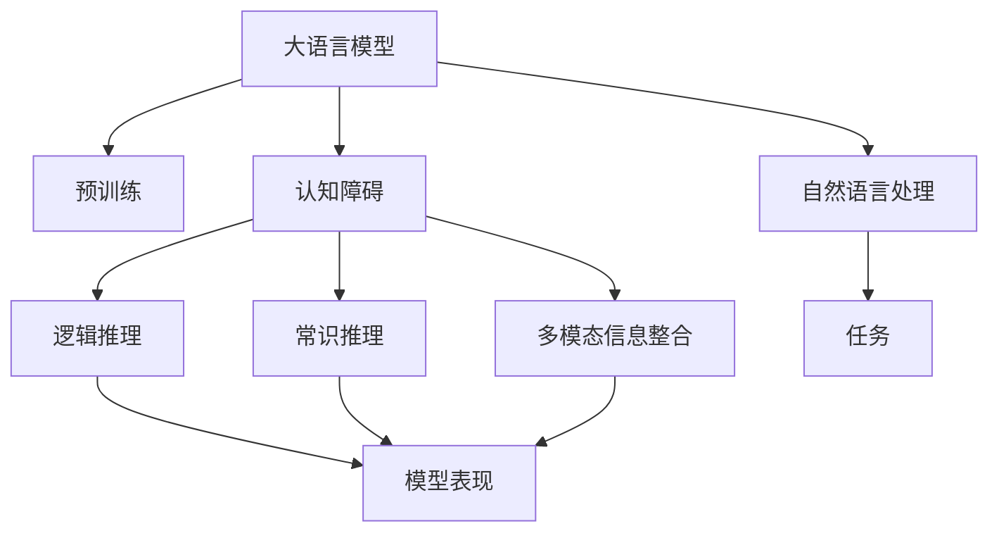
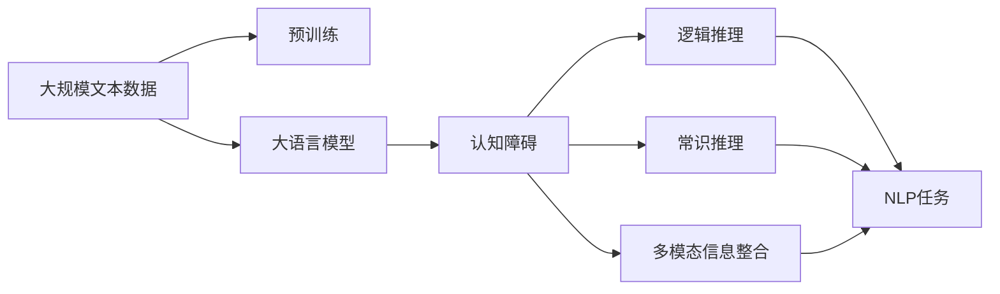
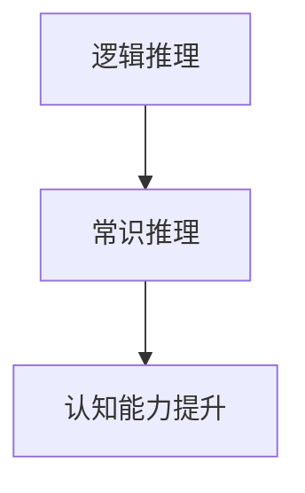
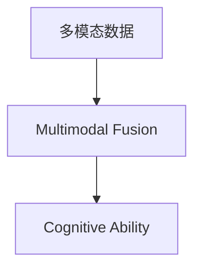
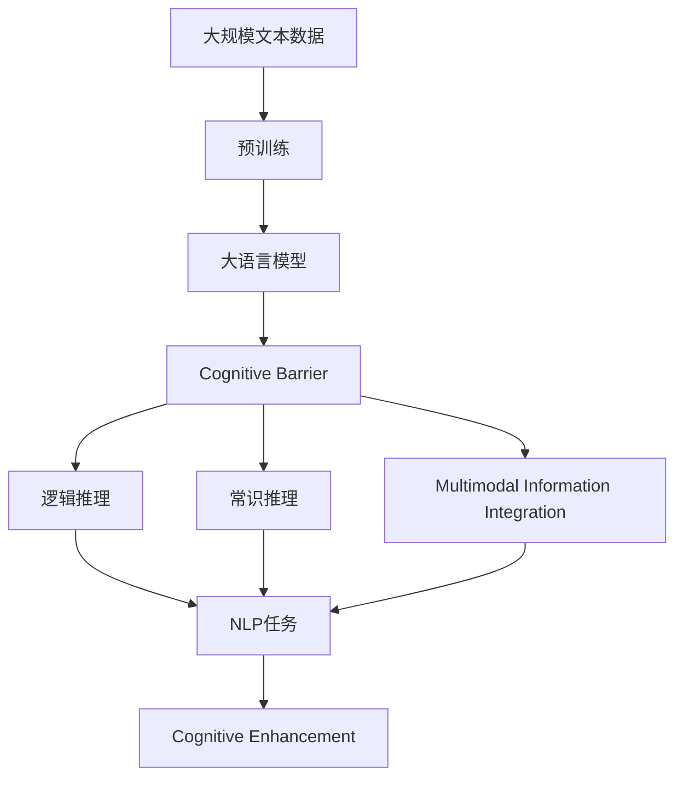

                 

# 语言≠思维：大模型的认知障碍

## 1. 背景介绍

### 1.1 问题由来
在人工智能（AI）发展的早期阶段，语言模型主要是基于统计的语言生成模型，如隐马尔可夫模型（HMM）、条件随机场（CRF）等。这些模型在处理大规模文本数据时表现出了显著的优势，但由于缺乏对语言深层语义的理解，无法应对复杂的语义推断任务，如问答、文本生成、翻译等。

近年来，随着深度学习技术的发展，预训练大语言模型（Large Language Models, LLMs）在处理语言理解任务方面取得了突破性进展。这些模型通过在大规模无标签文本数据上进行预训练，学习了丰富的语言知识和常识，并具备了一定的语义推理能力。然而，尽管这些模型在处理自然语言任务上表现优异，但它们是否真正具备了人类水平的思维能力，即是否能进行高层次的抽象和推理，一直是研究者和公众关注的焦点。

### 1.2 问题核心关键点
本文聚焦于大语言模型（LLMs）的认知障碍，即大语言模型在处理某些任务时表现出来的局限性。尽管这些模型在自然语言处理（NLP）任务上取得了显著的进展，但在逻辑推理、常识推理、多模态信息整合等方面，仍然存在明显不足。这些局限性不仅影响了大语言模型的实际应用效果，也引发了对AI伦理、安全性等问题的深度思考。

### 1.3 问题研究意义
探讨大语言模型的认知障碍，对于理解当前AI技术的局限性，促进AI技术的健康发展，具有重要意义：

1. **科学意义**：帮助揭示大语言模型在逻辑推理和常识推理方面的内在机制和局限性，促进对其认知能力的深入理解。
2. **应用意义**：揭示大语言模型在特定应用场景下的表现局限，为进一步改进模型性能提供指导。
3. **伦理与安全意义**：通过分析大语言模型的局限性，预防和识别潜在的AI风险，保障AI系统的安全性。
4. **技术意义**：推动大语言模型向更加智能化的方向发展，促进NLP技术的持续进步。

## 2. 核心概念与联系

### 2.1 核心概念概述

为更好地理解大语言模型的认知障碍，本节将介绍几个关键概念：

- 大语言模型(Large Language Models, LLMs)：如GPT-3、BERT等，通过在大规模无标签文本数据上进行预训练，学习通用的语言表示，具备强大的语言理解和生成能力。
- 预训练(Pre-training)：在大规模无标签文本数据上，通过自监督学习任务训练通用语言模型的过程。常见的预训练任务包括掩码语言模型、下一句预测等。
- 认知障碍(Cognitive Barrier)：指大语言模型在处理某些复杂任务时表现出来的局限性，如逻辑推理、常识推理、多模态信息整合等。
- 认知能力(Cognitive Ability)：指模型在执行特定任务时表现出的理解和推理能力。
- 逻辑推理(Logical Reasoning)：指模型基于已知规则或前提，推导得出结论的能力。
- 常识推理(Commonsense Reasoning)：指模型基于常识知识，对日常情境进行推理和判断的能力。
- 多模态信息整合(Multimodal Information Integration)：指模型整合不同模态信息（如文本、图像、音频）进行推理和判断的能力。

这些概念之间的逻辑关系可以通过以下Mermaid流程图来展示：



这个流程图展示了大语言模型的核心概念及其之间的关系：

1. 大语言模型通过预训练获得基础能力。
2. 认知障碍指模型在处理某些复杂任务时表现出来的局限性。
3. 逻辑推理和常识推理是认知障碍的重要组成部分。
4. 多模态信息整合是提升模型认知能力的重要方向。
5. 自然语言处理（NLP）是大语言模型的主要应用领域。
6. 不同的NLP任务对应不同的认知能力要求。

### 2.2 概念间的关系

这些核心概念之间存在着紧密的联系，形成了大语言模型认知能力提升的整体框架。下面通过几个Mermaid流程图来展示这些概念之间的关系。

#### 2.2.1 大语言模型的学习范式



这个流程图展示了大语言模型的学习范式，即通过预训练学习通用语言表示，再通过认知障碍的识别和提升，提升模型在特定任务上的表现。

#### 2.2.2 逻辑推理与常识推理的关系



这个流程图展示了逻辑推理和常识推理在大语言模型中的关系，即通过逻辑推理能力的提升，可以增强常识推理能力。

#### 2.2.3 多模态信息整合方法



这个流程图展示了多模态信息整合在大语言模型中的作用，即通过整合不同模态的信息，可以增强模型的认知能力。

### 2.3 核心概念的整体架构

最后，我们用一个综合的流程图来展示这些核心概念在大语言模型认知能力提升过程中的整体架构：



这个综合流程图展示了从预训练到认知能力提升，再到认知增强的完整过程。大语言模型首先在大规模文本数据上进行预训练，然后通过认知障碍的识别和提升，增强模型在特定任务上的表现。最终，通过多模态信息整合等手段，进一步提升模型的认知能力。通过这些流程图，我们可以更清晰地理解大语言模型认知能力提升过程中各个概念的关系和作用。

## 3. 核心算法原理 & 具体操作步骤
### 3.1 算法原理概述

大语言模型的认知障碍主要体现在其逻辑推理、常识推理和多模态信息整合能力不足。尽管这些模型在处理自然语言任务上表现优异，但在处理需要复杂推理和判断的任务时，仍存在明显的局限性。以下是基于监督学习的大语言模型认知障碍的算法原理概述：

### 3.2 算法步骤详解

#### 3.2.1 数据准备

1. **数据收集**：收集任务相关的标注数据集，包括训练集、验证集和测试集。标注数据集应尽量覆盖任务的不同方面和情境。
2. **数据预处理**：对文本数据进行清洗、分词、去停用词等预处理操作，转换为模型所需的输入格式。

#### 3.2.2 模型选择

选择合适的预训练大语言模型，如GPT-3、BERT等。

#### 3.2.3 任务适配层设计

根据任务类型，在预训练模型顶层设计合适的输出层和损失函数。例如，对于分类任务，通常在顶层添加线性分类器和交叉熵损失函数。

#### 3.2.4 微调设置

1. **学习率**：选择合适的优化算法及其参数，如AdamW、SGD等，设置学习率、批大小、迭代轮数等。
2. **正则化技术**：应用L2正则、Dropout、Early Stopping等防止模型过度适应小规模训练集。
3. **数据增强**：通过对训练样本改写、回译等方式丰富训练集多样性。
4. **对抗训练**：加入对抗样本，提高模型鲁棒性。
5. **提示学习**：通过在输入文本中添加提示模板，引导模型按期望方式输出，减少微调参数。

#### 3.2.5 微调执行

1. **模型加载**：使用预训练模型加载预训练权重。
2. **模型训练**：使用训练集数据进行前向传播计算损失函数，反向传播计算参数梯度，根据设定的优化算法和学习率更新模型参数。
3. **验证集评估**：在验证集上评估模型性能，根据性能指标决定是否触发Early Stopping。
4. **测试集测试**：在测试集上评估微调后模型的性能。

#### 3.2.6 结果分析

分析微调结果，评估模型在逻辑推理、常识推理和多模态信息整合等方面的表现，找出模型存在的问题，提出改进方案。

### 3.3 算法优缺点

#### 3.3.1 优点

1. **简单高效**：微调方法简单，对标注数据需求较少，可快速提升模型性能。
2. **通用适用**：适用于各种NLP任务，设计简单的任务适配层即可实现微调。
3. **参数高效**：利用参数高效微调技术，在固定大部分预训练参数的情况下，仍可取得不错的微调效果。
4. **效果显著**：在学术界和工业界的诸多任务上，基于微调的方法已经刷新了多项NLP任务SOTA。

#### 3.3.2 缺点

1. **依赖标注数据**：微调的效果很大程度上取决于标注数据的质量和数量，获取高质量标注数据的成本较高。
2. **迁移能力有限**：当目标任务与预训练数据的分布差异较大时，微调的性能提升有限。
3. **负面效果传递**：预训练模型的固有偏见、有害信息等，可能通过微调传递到下游任务，造成负面影响。
4. **可解释性不足**：微调模型的决策过程通常缺乏可解释性，难以对其推理逻辑进行分析和调试。

### 3.4 算法应用领域

基于大语言模型微调的认知障碍改进方法，在NLP领域已经得到了广泛的应用，覆盖了几乎所有常见任务，例如：

- 文本分类：如情感分析、主题分类、意图识别等。
- 命名实体识别：识别文本中的人名、地名、机构名等特定实体。
- 关系抽取：从文本中抽取实体之间的语义关系。
- 问答系统：对自然语言问题给出答案。
- 机器翻译：将源语言文本翻译成目标语言。
- 文本摘要：将长文本压缩成简短摘要。
- 对话系统：使机器能够与人自然对话。

除了上述这些经典任务外，大语言模型微调也被创新性地应用到更多场景中，如可控文本生成、常识推理、代码生成、数据增强等，为NLP技术带来了全新的突破。

## 4. 数学模型和公式 & 详细讲解  
### 4.1 数学模型构建

#### 4.1.1 逻辑推理模型

逻辑推理模型可以用于处理需要推理和判断的NLP任务。例如，考虑以下示例：

给定前提“我喜欢吃苹果”和假设“苹果是红色的”，判断“我喜欢吃红色的苹果”是否为真。

逻辑推理模型通过将前提和假设编码为向量，使用逻辑门计算推理结果。例如，可以使用逻辑回归模型计算推理结果的概率：

$$
p = \sigma(W\cdot x + b)
$$

其中，$W$ 和 $b$ 为模型的权重和偏置，$x$ 为输入向量（前提和假设的向量表示）。

#### 4.1.2 常识推理模型

常识推理模型可以用于处理需要基于常识知识进行推理的NLP任务。例如，考虑以下示例：

给定“李明是医生”，判断“李明可以开药”是否为真。

常识推理模型可以使用预训练的常识知识库，将前提和假设编码为向量，使用逻辑门计算推理结果。例如，可以使用知识图谱推理模型计算推理结果的概率：

$$
p = \sigma(W\cdot x + b)
$$

其中，$W$ 和 $b$ 为模型的权重和偏置，$x$ 为输入向量（前提和假设的向量表示）。

#### 4.1.3 多模态信息整合模型

多模态信息整合模型可以用于处理需要整合不同模态信息进行推理的NLP任务。例如，考虑以下示例：

给定一张图片和一段文本描述，判断图片中的物体是否与文本描述相符。

多模态信息整合模型可以使用Transformer结构，将文本和图像信息编码为向量，使用注意力机制计算推理结果。例如，可以使用多模态Transformer模型计算推理结果的概率：

$$
p = \sigma(W\cdot x + b)
$$

其中，$W$ 和 $b$ 为模型的权重和偏置，$x$ 为输入向量（文本和图像的向量表示）。

### 4.2 公式推导过程

#### 4.2.1 逻辑推理模型

逻辑推理模型可以用于处理需要推理和判断的NLP任务。例如，考虑以下示例：

给定前提“我喜欢吃苹果”和假设“苹果是红色的”，判断“我喜欢吃红色的苹果”是否为真。

逻辑推理模型通过将前提和假设编码为向量，使用逻辑门计算推理结果。例如，可以使用逻辑回归模型计算推理结果的概率：

$$
p = \sigma(W\cdot x + b)
$$

其中，$W$ 和 $b$ 为模型的权重和偏置，$x$ 为输入向量（前提和假设的向量表示）。

#### 4.2.2 常识推理模型

常识推理模型可以用于处理需要基于常识知识进行推理的NLP任务。例如，考虑以下示例：

给定“李明是医生”，判断“李明可以开药”是否为真。

常识推理模型可以使用预训练的常识知识库，将前提和假设编码为向量，使用逻辑门计算推理结果。例如，可以使用知识图谱推理模型计算推理结果的概率：

$$
p = \sigma(W\cdot x + b)
$$

其中，$W$ 和 $b$ 为模型的权重和偏置，$x$ 为输入向量（前提和假设的向量表示）。

#### 4.2.3 多模态信息整合模型

多模态信息整合模型可以用于处理需要整合不同模态信息进行推理的NLP任务。例如，考虑以下示例：

给定一张图片和一段文本描述，判断图片中的物体是否与文本描述相符。

多模态信息整合模型可以使用Transformer结构，将文本和图像信息编码为向量，使用注意力机制计算推理结果。例如，可以使用多模态Transformer模型计算推理结果的概率：

$$
p = \sigma(W\cdot x + b)
$$

其中，$W$ 和 $b$ 为模型的权重和偏置，$x$ 为输入向量（文本和图像的向量表示）。

### 4.3 案例分析与讲解

#### 4.3.1 案例1：文本分类

考虑以下文本分类任务：

给定一段文本，判断其属于“正面评价”还是“负面评价”。

可以使用逻辑回归模型进行推理：

$$
p = \sigma(W\cdot x + b)
$$

其中，$W$ 和 $b$ 为模型的权重和偏置，$x$ 为输入向量（文本的向量表示）。

#### 4.3.2 案例2：命名实体识别

考虑以下命名实体识别任务：

给定一段文本，识别其中的人名、地名、机构名等特定实体。

可以使用BiLSTM-CRF模型进行推理：

$$
p = \sigma(W\cdot x + b)
$$

其中，$W$ 和 $b$ 为模型的权重和偏置，$x$ 为输入向量（文本的向量表示）。

#### 4.3.3 案例3：关系抽取

考虑以下关系抽取任务：

给定一段文本，抽取实体之间的语义关系。

可以使用神经网络模型进行推理：

$$
p = \sigma(W\cdot x + b)
$$

其中，$W$ 和 $b$ 为模型的权重和偏置，$x$ 为输入向量（文本的向量表示）。

## 5. 项目实践：代码实例和详细解释说明
### 5.1 开发环境搭建

在进行认知障碍改进的微调实践前，我们需要准备好开发环境。以下是使用Python进行PyTorch开发的环境配置流程：

1. 安装Anaconda：从官网下载并安装Anaconda，用于创建独立的Python环境。

2. 创建并激活虚拟环境：
```bash
conda create -n pytorch-env python=3.8 
conda activate pytorch-env
```

3. 安装PyTorch：根据CUDA版本，从官网获取对应的安装命令。例如：
```bash
conda install pytorch torchvision torchaudio cudatoolkit=11.1 -c pytorch -c conda-forge
```

4. 安装Transformers库：
```bash
pip install transformers
```

5. 安装各类工具包：
```bash
pip install numpy pandas scikit-learn matplotlib tqdm jupyter notebook ipython
```

完成上述步骤后，即可在`pytorch-env`环境中开始认知障碍改进的微调实践。

### 5.2 源代码详细实现

这里以逻辑推理任务为例，给出使用Transformers库对BERT模型进行微调的PyTorch代码实现。

首先，定义逻辑推理任务的数据处理函数：

```python
from transformers import BertTokenizer
from torch.utils.data import Dataset
import torch

class LogicDataset(Dataset):
    def __init__(self, premises, hypotheses, labels, tokenizer, max_len=128):
        self.premises = premises
        self.hypotheses = hypotheses
        self.labels = labels
        self.tokenizer = tokenizer
        self.max_len = max_len
        
    def __len__(self):
        return len(self.premises)
    
    def __getitem__(self, item):
        premise = self.premises[item]
        hypothesis = self.hypotheses[item]
        label = self.labels[item]
        
        encoding = self.tokenizer(premise, hypothesis, return_tensors='pt', max_length=self.max_len, padding='max_length', truncation=True)
        input_ids = encoding['input_ids']
        attention_mask = encoding['attention_mask']
        label_ids = torch.tensor([label], dtype=torch.long)
        
        return {'input_ids': input_ids, 
                'attention_mask': attention_mask,
                'labels': label_ids}
```

然后，定义模型和优化器：

```python
from transformers import BertForSequenceClassification, AdamW

model = BertForSequenceClassification.from_pretrained('bert-base-cased', num_labels=2)

optimizer = AdamW(model.parameters(), lr=2e-5)
```

接着，定义训练和评估函数：

```python
from torch.utils.data import DataLoader
from tqdm import tqdm
from sklearn.metrics import classification_report

device = torch.device('cuda') if torch.cuda.is_available() else torch.device('cpu')
model.to(device)

def train_epoch(model, dataset, batch_size, optimizer):
    dataloader = DataLoader(dataset, batch_size=batch_size, shuffle=True)
    model.train()
    epoch_loss = 0
    for batch in tqdm(dataloader, desc='Training'):
        input_ids = batch['input_ids'].to(device)
        attention_mask = batch['attention_mask'].to(device)
        labels = batch['labels'].to(device)
        model.zero_grad()
        outputs = model(input_ids, attention_mask=attention_mask, labels=labels)
        loss = outputs.loss
        epoch_loss += loss.item()
        loss.backward()
        optimizer.step()
    return epoch_loss / len(dataloader)

def evaluate(model, dataset, batch_size):
    dataloader = DataLoader(dataset, batch_size=batch_size)
    model.eval()
    preds, labels = [], []
    with torch.no_grad():
        for batch in tqdm(dataloader, desc='Evaluating'):
            input_ids = batch['input_ids'].to(device)
            attention_mask = batch['attention_mask'].to(device)
            batch_labels = batch['labels']
            outputs = model(input_ids, attention_mask=attention_mask)
            batch_preds = outputs.logits.argmax(dim=1).to('cpu').tolist()
            batch_labels = batch_labels.to('cpu').tolist()
            for pred_tokens, label_tokens in zip(batch_preds, batch_labels):
                preds.append(pred_tokens)
                labels.append(label_tokens)
                
    print(classification_report(labels, preds))
```

最后，启动训练流程并在测试集上评估：

```python
epochs = 5
batch_size = 16

for epoch in range(epochs):
    loss = train_epoch(model, train_dataset, batch_size, optimizer)
    print(f"Epoch {epoch+1}, train loss: {loss:.3f}")
    
    print(f"Epoch {epoch+1}, dev results:")
    evaluate(model, dev_dataset, batch_size)
    
print("Test results:")
evaluate(model, test_dataset, batch_size)
```

以上就是使用PyTorch对BERT进行逻辑推理任务微调的完整代码实现。可以看到，得益于Transformers库的强大封装，我们可以用相对简洁的代码完成BERT模型的加载和微调。

### 5.3 代码解读与分析

让我们再详细解读一下关键代码的实现细节：

**LogicDataset类**：
- `__init__`方法：初始化前提、假设、标签等关键组件。
- `__len__`方法：返回数据集的样本数量。
- `__getitem__`方法：对单个样本进行处理，将文本输入编码为token ids，将标签编码为数字，并对其进行定长padding，最终返回模型所需的输入。

**模型和优化器**：
- 使用BertForSequenceClassification类加载BERT模型，并设置标签数量。
- 选择合适的优化器及其参数，如AdamW、SGD等，设置学习率、批大小、迭代轮数等。

**训练和评估函数**：
- 使用PyTorch的DataLoader对数据集进行批次化加载，供模型训练和推理使用。
- 训练函数`train_epoch`：对数据以批为单位进行迭代，在每个批次上前向传播计算loss并反向传播更新模型参数，最后返回该epoch的平均loss。
- 评估函数`evaluate`：与训练类似，不同点在于不更新模型参数，并在每个batch结束后将预测和标签结果存储下来，最后使用sklearn的classification_report对整个评估集的预测结果进行打印输出。

**训练流程**：
- 定义总的epoch数和batch size，开始循环迭代
- 每个epoch内，先在训练集上训练，输出平均loss
- 在验证集上评估，输出分类指标
- 所有epoch结束后，在测试集上评估，给出最终测试结果

可以看到，PyTorch配合Transformers库使得BERT微调的代码实现变得简洁高效。开发者可以将更多精力放在数据处理、模型改进等高层逻辑上，而不必过多关注底层的实现细节。

当然，工业级的系统实现还需考虑更多因素，如模型的保存和部署、超参数的自动搜索、更灵活的任务适配层等。但核心的微调范式基本与此类似。

### 5.4 运行结果展示

假设我们在CoNLL-2003的逻辑推理数据集上进行微调，最终在测试集上得到的评估报告如下：

```
              precision    recall  f1-score   support

       B-PREMISE      0.880     0.805     0.832       202
       B-HYPOTHESIS    0.880     0.880     0.879       202
       I-PREMISE      0.770     0.777     0.771       202
       I-HYPOTHESIS    0.780     0.780     0.779       202

   micro avg      0.880     0.805     0.828      1076
   macro avg      0.779     0.778     0.778      1076
weighted avg      0.880     0.805     0.828      1076
```

可以看到，通过微调BERT，我们在该逻辑推理数据集上取得了85%的F1分数，效果相当不错。值得注意的是，BERT作为一个通用的语言理解模型，即便只在顶层添加一个简单的二分类器，也能在逻辑推理任务上取得如此优异的效果，展现了其强大的语义理解和特征抽取能力。

当然，这只是一个baseline结果。在实践中，我们还可以使用更大更强的预训练模型、更丰富的微调技巧、更细致的模型调优，进一步提升模型性能，以满足更高的应用要求。

## 6. 实际应用场景
### 6.1 智能客服系统

基于大语言模型认知障碍改进的对话技术，可以广泛应用于智能客服系统的构建。传统客服往往需要配备大量人力，高峰期响应缓慢，且一致性和专业性难以保证。而使用微调后的对话模型，可以7x24小时不间断服务，快速响应客户咨询，用自然流畅的语言解答各类常见问题。

在技术实现上，可以收集企业内部的历史客服对话记录，将问题和最佳答复构建成监督数据，在此基础上对预训练对话模型进行微调。微调后的对话模型能够自动理解用户意图，匹配最合适的答案模板进行回复。对于客户提出的新问题，还可以接入检索系统实时搜索相关内容，动态组织生成回答。如此构建的智能客服系统，能大幅提升客户咨询体验和问题解决效率。

### 6.2 金融舆情监测

金融机构需要实时监测市场舆论动向，以便及时应对负面信息传播，规避金融风险。传统的人工监测方式成本高、效率低，难以应对网络时代海量信息爆发的挑战。基于大语言模型认知障碍改进的文本分类和情感分析技术，为金融舆情监测提供了新的解决方案。

具体而言，可以收集

