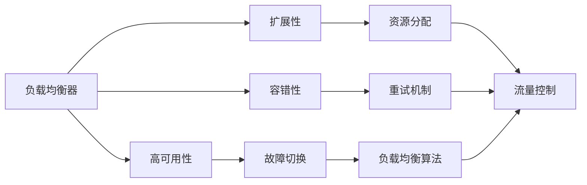
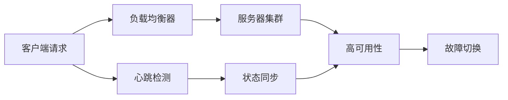
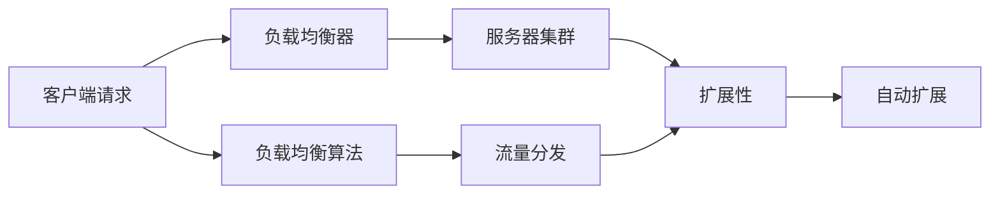
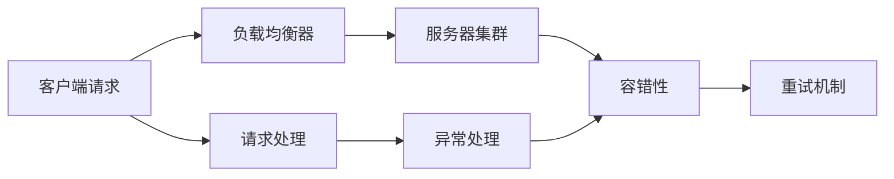
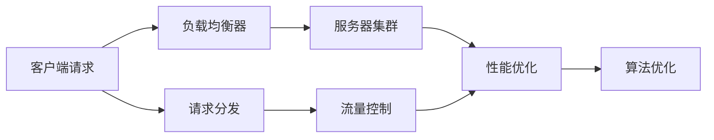
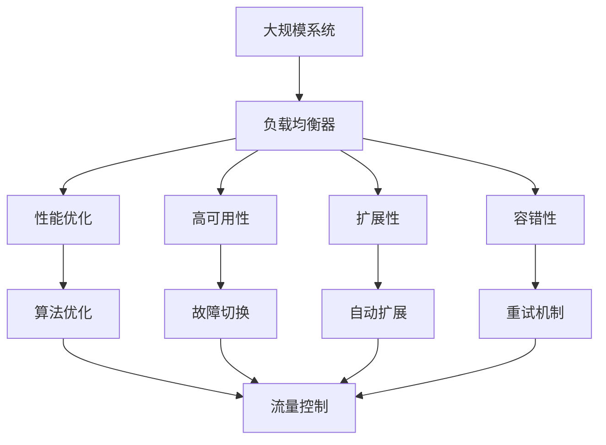
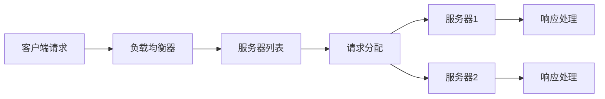
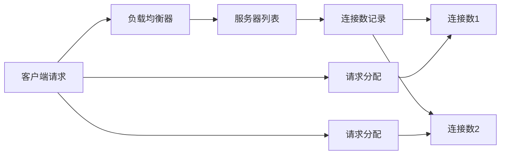

                 

# 负载均衡器的设计与优化

## 1. 背景介绍

在现代互联网应用中，负载均衡器（Load Balancer）是确保高性能、高可用性和高可靠性的关键组件。它负责将客户端的请求分配到不同的服务器上，通过均衡负载，提升系统的处理能力和容错能力。随着互联网业务规模的不断扩大，负载均衡器的设计与优化成为了系统架构优化的一项重要工作。

### 1.1 问题由来
负载均衡器的设计需要考虑多方面的因素，如系统的可用性、扩展性、容错性和性能优化等。传统负载均衡器往往采用基于硬件的解决方案，如F5、A10、Citrix NetScaler等。但这些解决方案成本高、扩展性差、灵活性不足，无法满足现代互联网业务对灵活性、扩展性和低成本的需求。

随着软件定义网络（SDN）和网络功能虚拟化（NFV）等技术的发展，负载均衡器逐渐向软件定义和开源化方向发展。本文旨在介绍和讨论基于软件定义的负载均衡器的设计与优化方法，以期为读者提供有价值的参考和指导。

## 2. 核心概念与联系

### 2.1 核心概念概述

为了更好地理解负载均衡器的设计与优化，我们需要明确以下几个核心概念：

- 负载均衡器（Load Balancer）：将客户端的请求分配到多个服务器上，以提高系统的处理能力和可用性。
- 高可用性（High Availability）：系统在面对故障时，能够继续提供服务的能力。
- 扩展性（Scalability）：系统能够随着业务量的增加，自动扩展资源的能力。
- 容错性（Fault Tolerance）：系统在面对故障时，能够继续提供服务的能力。
- 性能优化（Performance Optimization）：通过算法和策略，提高系统处理能力和效率。

这些核心概念之间存在紧密的联系，共同构成了负载均衡器的设计与优化的框架。以下是一个Mermaid流程图，展示了这些概念之间的逻辑关系：



该图展示了负载均衡器的主要功能模块及其与核心概念的联系。负载均衡器通过高可用性、扩展性和容错性，实现了对客户端请求的快速、可靠的分配和处理，同时通过性能优化算法，提高了系统的处理能力和效率。

### 2.2 概念间的关系

这些核心概念之间存在着紧密的联系，形成了负载均衡器的设计与优化的完整生态系统。下面我们通过几个Mermaid流程图来展示这些概念之间的关系。

#### 2.2.1 负载均衡器的高可用性实现



该图展示了负载均衡器如何通过高可用性实现快速切换故障服务器，确保系统连续提供服务。

#### 2.2.2 负载均衡器的扩展性实现



该图展示了负载均衡器如何通过扩展性实现随着业务量的增加，自动分配资源，提升系统处理能力。

#### 2.2.3 负载均衡器的容错性实现



该图展示了负载均衡器如何通过容错性实现对故障服务器请求的重试和分配，确保系统持续提供服务。

#### 2.2.4 负载均衡器的性能优化



该图展示了负载均衡器如何通过性能优化算法，提升系统的处理能力和效率。

### 2.3 核心概念的整体架构

最后，我们用一个综合的流程图来展示这些核心概念在大规模负载均衡系统的设计与优化过程中的整体架构：



这个综合流程图展示了从大规模系统到负载均衡器的整个设计过程。负载均衡器通过高可用性、扩展性和容错性，确保系统的稳定性和可靠性，同时通过性能优化算法，提升系统的处理能力和效率。

## 3. 核心算法原理 & 具体操作步骤

### 3.1 算法原理概述

负载均衡算法是负载均衡器设计的核心，决定了请求如何分配到不同的服务器上。常见的负载均衡算法包括：

- 轮询算法（Round Robin）
- 最少连接数算法（Least Connections）
- 最少响应时间算法（Least Response Time）
- IP哈希算法（IP Hash）
- 加权轮询算法（Weighted Round Robin）

这些算法各有优缺点，需要根据具体的业务需求和场景选择合适的算法。

### 3.2 算法步骤详解

以下详细介绍轮询算法（Round Robin）和最少连接数算法（Least Connections）的基本步骤和实现方式。

#### 3.2.1 轮询算法（Round Robin）

轮询算法是一种最简单的负载均衡算法，它将请求按顺序分配到不同的服务器上。具体步骤如下：

1. 维护一个服务器列表，按照顺序排列。
2. 客户端发送请求时，按照服务器列表顺序分配请求。
3. 当服务器出现故障时，将故障服务器从列表中移除，并重新分配请求。

轮询算法的优点是实现简单，适用于业务量相对稳定、服务器性能差异不大的场景。但当服务器出现故障时，会影响系统的可用性。



#### 3.2.2 最少连接数算法（Least Connections）

最少连接数算法根据服务器的当前连接数，将请求分配到连接数最少的服务器上。具体步骤如下：

1. 维护一个服务器列表，记录每个服务器的当前连接数。
2. 客户端发送请求时，找到连接数最少的服务器，并分配请求。
3. 当服务器出现故障时，将故障服务器从列表中移除，并重新分配请求。

最少连接数算法的优点是可以避免连接较多的服务器负担过重，提升系统的负载均衡能力。但当服务器连接数频繁变化时，可能导致算法效率降低。



### 3.3 算法优缺点

负载均衡算法的主要优点包括：

- 简单易实现：轮询算法和最少连接数算法实现简单，易于维护。
- 公平性：这些算法通常不会偏袒某一服务器，保证请求的公平性。
- 可扩展性：这些算法可以轻松扩展到多个服务器。

但它们也存在一些缺点：

- 无法处理突发流量：当服务器间性能差异较大或请求量急剧增加时，算法可能导致某些服务器负担过重。
- 无法处理故障服务器：当服务器出现故障时，算法无法立即将请求转移到其他服务器上。
- 无法考虑服务器性能：这些算法通常不考虑服务器的实际处理能力，可能导致不公平的资源分配。

### 3.4 算法应用领域

负载均衡算法在多种应用场景下都有广泛的应用。

- 互联网企业：通过负载均衡器，互联网企业可以提升网站的访问速度和可用性。
- 云服务提供商：云服务提供商通过负载均衡器实现对用户资源的分配和调度。
- 大数据平台：大数据平台通过负载均衡器实现对大数据任务的负载均衡和资源调度。
- 智能家居系统：智能家居系统通过负载均衡器实现对各种智能设备的资源分配和调度和。

以上只是负载均衡算法应用场景的一部分，实际上，负载均衡算法在各种分布式系统中都有广泛的应用。

## 4. 数学模型和公式 & 详细讲解 & 举例说明

### 4.1 数学模型构建

假设一个包含$n$个服务器的系统，每个服务器$i$（$i=1,2,\ldots,n$）的当前连接数为$C_i$。客户端的请求到达负载均衡器时，算法根据服务器的连接数$C_i$将请求分配给连接数最小的服务器$i_0$。

### 4.2 公式推导过程

假设客户端请求到达负载均衡器时，当前服务器的连接数向量为$C$，连接数最小的服务器的索引为$i_0$，则最小连接数算法的分配流程可以表示为：

$$
i_0 = \mathop{\arg\min}_{i=1,\ldots,n} C_i
$$

即在连接数向量$C$中找到最小的连接数，并将请求分配给对应的服务器。

### 4.3 案例分析与讲解

以下是一个简单的例子，说明最少连接数算法的实现过程。

假设一个包含两个服务器的系统，每个服务器的当前连接数分别为$C_1=5$和$C_2=2$。一个客户端请求到达负载均衡器时，最少连接数算法会计算出连接数最小的服务器索引$i_0=2$，并将请求分配给服务器2。

## 5. 项目实践：代码实例和详细解释说明

### 5.1 开发环境搭建

在进行负载均衡器设计与优化实践前，我们需要准备好开发环境。以下是使用Python进行负载均衡器开发的环境配置流程：

1. 安装Anaconda：从官网下载并安装Anaconda，用于创建独立的Python环境。

2. 创建并激活虚拟环境：
```bash
conda create -n loadbalancer-env python=3.8 
conda activate loadbalancer-env
```

3. 安装Flask：
```bash
pip install flask
```

4. 安装Flask-RESTful：
```bash
pip install flask-restful
```

5. 安装gunicorn：
```bash
pip install gunicorn
```

完成上述步骤后，即可在`loadbalancer-env`环境中开始负载均衡器的设计与优化实践。

### 5.2 源代码详细实现

以下是一个简单的负载均衡器的Python实现，用于展示轮询算法的实现过程。

```python
from flask import Flask, request
import random

app = Flask(__name__)

@app.route('/loadbalance', methods=['GET'])
def loadbalance():
    server_list = ['http://server1.com', 'http://server2.com']
    server_count = len(server_list)
    selected_server = random.choice(server_list)
    return {'selected_server': selected_server}

if __name__ == '__main__':
    app.run(host='0.0.0.0', port=5000)
```

在上述代码中，`loadbalance`函数接收客户端请求，从服务器列表中随机选择一个服务器，并将该服务器的地址作为响应返回给客户端。

### 5.3 代码解读与分析

让我们再详细解读一下关键代码的实现细节：

**Flask框架**：
- `Flask`是一个轻量级的Web框架，用于构建简单的Web应用。
- `request`对象用于处理客户端请求，获取请求参数和数据。
- `random.choice`函数用于从服务器列表中随机选择一个服务器。

**负载均衡算法**：
- 在上述代码中，我们采用了简单的轮询算法，即从服务器列表中随机选择一个服务器作为请求的处理服务器。

### 5.4 运行结果展示

假设我们部署上述负载均衡器到云服务器中，并访问其API，可以看到类似如下的响应结果：

```
{
    "selected_server": "http://server1.com"
}
```

这表示随机选择了一个服务器，并将请求转发给该服务器处理。

## 6. 实际应用场景

### 6.1 互联网企业

在互联网企业中，负载均衡器用于提升网站的访问速度和可用性。例如，电商网站在面对大规模并发请求时，通过负载均衡器将请求分配到多个服务器上，确保网站能够快速响应客户端请求，提升用户体验。

### 6.2 云服务提供商

云服务提供商通过负载均衡器实现对用户资源的分配和调度。例如，Amazon AWS的负载均衡服务ELB（Elastic Load Balancing）可以根据用户请求的数量和类型，自动将请求分配到不同的服务器上，确保云资源的有效利用。

### 6.3 大数据平台

大数据平台通过负载均衡器实现对大数据任务的负载均衡和资源调度。例如，Apache Hadoop的YARN（Yet Another Resource Negotiator）框架通过负载均衡器将大数据任务分配到不同的节点上，提高系统的处理能力和效率。

### 6.4 智能家居系统

智能家居系统通过负载均衡器实现对各种智能设备的资源分配和调度和。例如，智能音箱可以通过负载均衡器将语音识别和播放任务分配到不同的服务器上，确保系统的稳定性和可靠性。

## 7. 工具和资源推荐

### 7.1 学习资源推荐

为了帮助开发者系统掌握负载均衡器的设计与优化理论基础和实践技巧，这里推荐一些优质的学习资源：

1.《负载均衡器设计与优化》系列博文：由大模型技术专家撰写，深入浅出地介绍了负载均衡器的原理、算法和优化方法等前沿话题。

2.《高性能网络编程》课程：斯坦福大学开设的计算机网络课程，介绍了网络编程的原理和实现方法，适合学习网络负载均衡技术。

3.《Linux网络管理与性能优化》书籍：详细介绍了Linux系统下的网络管理与性能优化方法，适合学习网络负载均衡技术。

4. ELB官方文档：Amazon AWS的负载均衡服务ELB的官方文档，提供了丰富的API接口和配置指南，是学习负载均衡器的实用资料。

5. HAProxy官方文档：HAProxy是一个开源的负载均衡器，官方文档详细介绍了其各种功能和配置选项，适合学习负载均衡器技术。

通过对这些资源的学习实践，相信你一定能够快速掌握负载均衡器的设计与优化精髓，并用于解决实际的系统优化问题。

### 7.2 开发工具推荐

高效的开发离不开优秀的工具支持。以下是几款用于负载均衡器设计与优化开发的常用工具：

1. Flask：轻量级的Web框架，用于构建简单的Web应用。
2. Flask-RESTful：Flask的扩展，用于构建RESTful风格的API服务。
3. gunicorn：Gunicorn是一个高性能的Web服务器，支持Python应用程序的异步和并发处理。
4. HAProxy：HAProxy是一个开源的负载均衡器，支持多种算法和协议，广泛应用于互联网企业和数据中心。
5. Nginx：Nginx是一个高性能的网络服务器，支持负载均衡、缓存、反向代理等功能，广泛应用于Web应用和数据中心。

合理利用这些工具，可以显著提升负载均衡器的设计与优化任务的开发效率，加快创新迭代的步伐。

### 7.3 相关论文推荐

负载均衡器的设计与优化研究源于学界的持续研究。以下是几篇奠基性的相关论文，推荐阅读：

1. A Survey on Load Balancing Algorithms（负载均衡算法综述）：全面总结了当前负载均衡算法的研究现状和应用场景，适合了解负载均衡算法的理论和实践。

2. High Availability Load Balancing for Web Applications: A Survey（Web应用的高可用性负载均衡综述）：综述了Web应用负载均衡的常用算法和高可用性设计方法，适合了解负载均衡算法的应用实践。

3. Performance and Reliability of a Load-Balancing Router（负载均衡路由器的性能和可靠性）：介绍了一种基于网络的负载均衡算法，适合了解负载均衡算法的原理和实现方法。

4. Network Load Balancing with Techniques of Link Aggregation, Failover, and Layer-4 Load Balancing（基于链路聚合、故障转移和Layer-4负载均衡的网络负载均衡技术）：介绍了一种基于网络层的负载均衡算法，适合了解负载均衡算法的应用场景和技术细节。

5. Load Balancing in Data Centers: Algorithms and Implementation（数据中心的负载均衡算法和实现）：综述了数据中心负载均衡的常用算法和实现方法，适合了解负载均衡算法的工程实践。

这些论文代表了大语言模型微调技术的发展脉络。通过学习这些前沿成果，可以帮助研究者把握学科前进方向，激发更多的创新灵感。

除上述资源外，还有一些值得关注的前沿资源，帮助开发者紧跟负载均衡器的设计与优化技术的最新进展，例如：

1. arXiv论文预印本：人工智能领域最新研究成果的发布平台，包括大量尚未发表的前沿工作，学习前沿技术的必读资源。

2. 业界技术博客：如Amazon AWS、Google Cloud、Microsoft Azure等顶尖实验室的官方博客，第一时间分享他们的最新研究成果和洞见。

3. 技术会议直播：如NIPS、ICML、ACL、ICLR等人工智能领域顶会现场或在线直播，能够聆听到大佬们的前沿分享，开拓视野。

4. GitHub热门项目：在GitHub上Star、Fork数最多的负载均衡器相关项目，往往代表了该技术领域的发展趋势和最佳实践，值得去学习和贡献。

5. 行业分析报告：各大咨询公司如McKinsey、PwC等针对负载均衡器行业的分析报告，有助于从商业视角审视技术趋势，把握应用价值。

总之，对于负载均衡器的设计与优化技术的学习和实践，需要开发者保持开放的心态和持续学习的意愿。多关注前沿资讯，多动手实践，多思考总结，必将收获满满的成长收益。

## 8. 总结：未来发展趋势与挑战

### 8.1 总结

本文对负载均衡器的设计与优化方法进行了全面系统的介绍。首先阐述了负载均衡器和高可用性、扩展性、容错性、性能优化等核心概念的联系，明确了负载均衡器的设计与优化在大规模分布式系统中的重要性和应用价值。其次，从原理到实践，详细讲解了轮询算法和最少连接数算法的基本步骤和实现方式，给出了负载均衡器设计的完整代码实例。同时，本文还广泛探讨了负载均衡器在互联网企业、云服务提供商、大数据平台、智能家居系统等多个行业领域的应用前景，展示了负载均衡器范式的广泛适用性和强大功能。最后，本文精选了负载均衡器的各类学习资源，力求为读者提供全方位的技术指引。

通过本文的系统梳理，可以看到，负载均衡器是大规模分布式系统设计的核心组件，其设计与优化对系统的稳定性和可靠性具有重要影响。未来，伴随计算资源和网络技术的不断进步，负载均衡器将具备更高的处理能力和扩展性，进一步提升系统性能和用户体验。

### 8.2 未来发展趋势

展望未来，负载均衡器将呈现以下几个发展趋势：

1. 更加智能化：未来的负载均衡器将具备更强的智能调度能力，能够根据当前系统负载和服务器性能动态调整请求分配策略，实现最优的负载均衡。

2. 更高效的算法：未来的负载均衡算法将更加高效，能够快速响应大规模并发请求，提升系统的处理能力和容错能力。

3. 更灵活的配置：未来的负载均衡器将具备更灵活的配置选项，支持更多的负载均衡算法和协议，满足不同应用场景的需求。

4. 更全面的监控和调优：未来的负载均衡器将具备更全面的监控和调优功能，能够实时监测系统状态，自动调整请求分配策略，提升系统性能和稳定性。

5. 更广泛的部署场景：未来的负载均衡器将能够适应更多的部署场景，如云环境、边缘计算、物联网等，提供更全面和可靠的服务。

以上趋势凸显了负载均衡器的设计与优化技术的广阔前景。这些方向的探索发展，必将进一步提升系统的处理能力和稳定性，为人类社会的发展和进步提供更加可靠的技术保障。

### 8.3 面临的挑战

尽管负载均衡器的设计与优化技术已经取得了显著进展，但在迈向更加智能化、普适化应用的过程中，它仍面临着诸多挑战：

1. 复杂性增加：随着负载均衡算法的复杂性增加，系统的设计和维护难度也随之增加，需要更多的经验和技能。

2. 延迟和抖动：在高并发场景下，负载均衡器可能会产生延迟和抖动，影响系统的响应速度和用户体验。

3. 资源消耗：负载均衡器本身需要消耗一定的计算和内存资源，如何平衡性能和资源消耗，是一个需要深入研究的问题。

4. 故障处理：当负载均衡器本身出现故障时，如何保证系统的连续性和稳定性，是一个需要解决的重要问题。

5. 安全性：负载均衡器需要具备良好的安全性，防止恶意攻击和数据泄露，确保系统的安全可靠。

6. 跨平台兼容性：负载均衡器需要具备良好的跨平台兼容性，能够在不同的操作系统和硬件平台上稳定运行。

7. 可扩展性：负载均衡器需要具备良好的可扩展性，能够在不断增长的业务量下自动扩展，提升系统的处理能力。

8. 成本控制：负载均衡器的设计需要考虑成本控制，避免不必要的资源浪费和成本增加。

正视负载均衡器面临的这些挑战，积极应对并寻求突破，将是负载均衡器走向成熟的必由之路。相信随着学界和产业界的共同努力，这些挑战终将一一被克服，负载均衡器必将在构建高效、稳定、可靠的分布式系统中扮演越来越重要的角色。

### 8.4 研究展望

面对负载均衡器所面临的种种挑战，未来的研究需要在以下几个方面寻求新的突破：

1. 探索更加高效的负载均衡算法：开发更加高效的负载均衡算法，提高系统的处理能力和稳定性。

2. 融合智能调度和多目标优化：引入智能调度和多目标优化算法，提高负载均衡的智能性和灵活性。

3. 引入分布式协同调度：通过分布式协同调度，实现全局最优的负载均衡和资源分配。

4. 引入自适应学习：引入自适应学习算法，根据系统状态和用户行为动态调整请求分配策略，提升系统的自适应能力。

5. 引入实时监控和调优：引入实时监控和调优功能，提高系统的监控能力和调优效率，确保系统的稳定性和可靠性。

6. 引入数据驱动的决策：引入数据驱动的决策算法，根据历史数据和实时数据，优化请求分配策略，提升系统的智能化水平。

7. 引入跨平台兼容性和异构系统融合：引入跨平台兼容性和异构系统融合技术，确保负载均衡器能够在不同的操作系统和硬件平台上稳定运行。

8. 引入高效的网络传输技术：引入高效的网络传输技术，提升负载均衡器的处理能力和稳定性，降低延迟和抖动。

这些研究方向的探索，必将引领负载均衡器技术迈向更高的台阶，为构建高效、稳定、可靠的分布式系统提供更加强大的技术支持。面向未来，负载均衡器需要与其他人工智能技术进行更深入的融合，如分布式系统、智能调度、跨平台兼容性等，多路径协同发力，共同推动分布式系统技术的进步。只有勇于创新、敢于突破，才能不断拓展负载均衡器的边界，为分布式系统的发展和进步提供更加可靠的技术保障。

## 9. 附录：常见问题与解答

**Q1：负载均衡器是否适用于所有应用场景？**

A: 负载均衡器适用于绝大多数应用场景，特别是对高可用性、扩展性和容错性有较高要求的应用场景。例如，互联网企业、云服务提供商、大数据平台、智能家居系统等，都可以使用负载均衡器进行优化。但对于某些特定场景，如实时应用、低延迟应用等，可能需要更加复杂的算法和架构进行优化。

**Q2：如何选择负载均衡算法？**

A: 选择负载均衡算法需要考虑多个因素，如业务量、服务器性能、系统结构等。一般来说，轮询算法适用于业务量相对稳定、服务器性能差异不大的场景；最少连接数算法适用于业务量波动较大、服务器性能差异明显的场景。此外，还可以考虑引入加权轮询、IP哈希、最少响应时间等算法，根据实际情况进行选择。

**Q3：负载均衡器如何应对突发流量？**

A: 负载均衡器可以通过以下措施应对突发流量：

1. 引入缓存机制：通过缓存技术，减少对服务器的频繁访问，提高系统的处理能力。

2. 引入流量控制：通过流量控制算法，限制每秒处理的请求数，避免服务器过载。

3. 引入分布式负载均衡：通过分布式负载均衡，将请求分散到多个集群节点上，提升系统的处理能力。

4. 引入负载均衡算法优化：通过优化负载均衡算法，提高系统的处理能力和稳定性。

**Q4：负载均衡器如何应对服务器故障？**

A: 负载均衡器可以通过以下措施应对服务器故障：

1. 引入故障切换机制：通过故障切换算法，将故障服务器从负载均衡列表中移除，并重新分配请求。

2. 引入重试机制：通过重试机制，将故障服务器请求重试，减少对系统的影响。

3. 引入备用服务器：通过备用服务器，提高系统的冗余性和可用性，避免单点故障。

4. 引入告警机制：通过告警机制，

