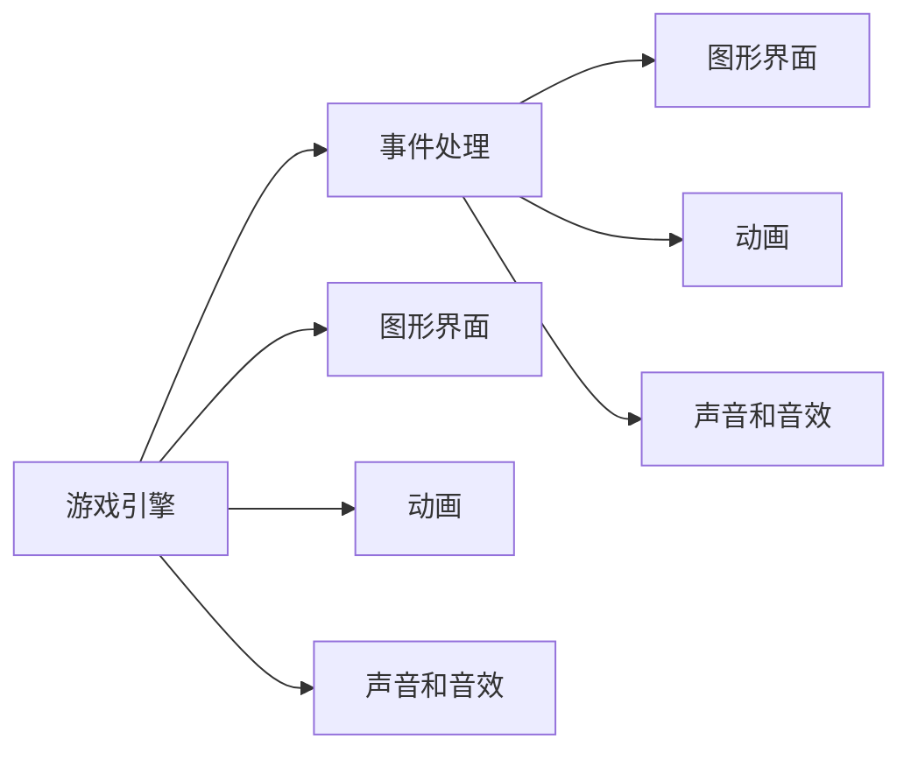
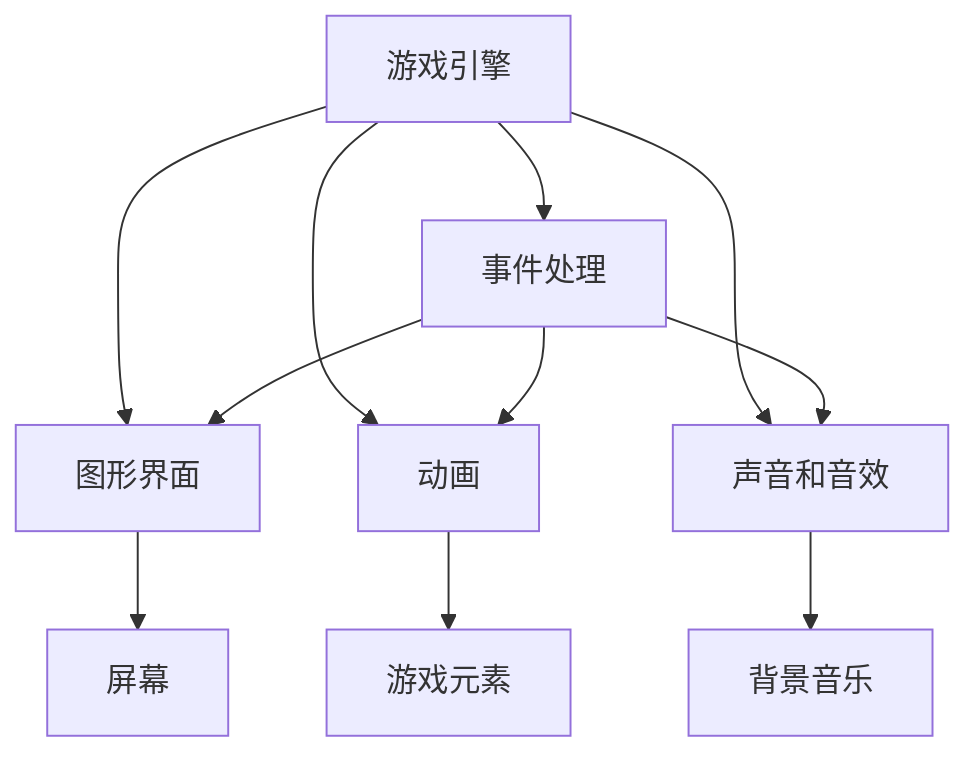

                 

# 贪吃蛇小游戏的设计与实现

> 关键词：
贪吃蛇小游戏（Snake Game）是一种经典的2D游戏，简单的游戏规则和互动性使其深受玩家喜爱。通过这篇技术博客，我们将深入探讨贪吃蛇小游戏的核心设计和实现细节，以帮助您掌握游戏开发的关键技能，并在未来的项目中灵活应用。

## 1. 背景介绍

### 1.1 问题由来

贪吃蛇游戏起源于1986年，最初由美国计算机科学家Don McLean开发，旨在测试早期视频游戏的编程技巧。随着时间的推移，该游戏逐渐演化成现代版本，不仅在控制台上，也在各种平台上（如Web、移动设备等）得以广泛应用。

### 1.2 问题核心关键点

贪吃蛇小游戏的设计和实现，主要围绕以下几个核心关键点展开：

1. **游戏规则和机制**：游戏的基本规则是控制蛇移动，吃到食物获取分数，避免蛇身体撞墙或自己。
2. **用户界面设计**：清晰、美观的用户界面能提升玩家的游戏体验。
3. **游戏逻辑**：处理蛇的移动、碰撞检测、游戏结束等核心逻辑。
4. **音效和动画效果**：通过音效和动画增强游戏的趣味性和沉浸感。

### 1.3 问题研究意义

研究和实现贪吃蛇小游戏，对于初学者而言，是入门编程和游戏开发的绝佳选择。它不仅能够帮助理解基本的图形界面、事件处理、动画和声音等概念，还能锻炼逻辑思维和问题解决能力。此外，该游戏的设计和实现对于开发其他复杂游戏也有重要参考价值。

## 2. 核心概念与联系

### 2.1 核心概念概述

要设计和实现贪吃蛇小游戏，需要理解以下几个核心概念：

1. **游戏引擎**：用于创建和管理游戏元素的库或框架，如Pygame、Unity等。
2. **事件处理**：响应用户输入（如按键），触发相应的游戏逻辑。
3. **图形界面**：显示游戏画面、元素和状态的可视化工具。
4. **动画**：通过逐帧绘制游戏元素，实现动态效果。
5. **声音和音效**：增强游戏氛围，提升玩家的沉浸感。

### 2.2 概念间的关系

这些核心概念之间的逻辑关系可以通过以下Mermaid流程图来展示：



这个流程图展示了大游戏设计和实现的关键组件和它们之间的关系：

1. 游戏引擎是核心，负责管理其他组件。
2. 事件处理基于游戏引擎，响应用户输入。
3. 图形界面、动画和音效通过事件处理展示和增强游戏体验。

### 2.3 核心概念的整体架构

最后，我们用一个综合的流程图来展示这些核心概念在大游戏设计和实现过程中的整体架构：



这个综合流程图展示了从游戏引擎到最终展示效果的完整过程：

1. 游戏引擎协调其他组件，管理游戏数据。
2. 事件处理响应用户输入，驱动游戏逻辑。
3. 图形界面、动画和音效通过事件处理展示，提升游戏体验。

## 3. 核心算法原理 & 具体操作步骤

### 3.1 算法原理概述

贪吃蛇小游戏的核心算法主要涉及以下几个方面：

1. **游戏逻辑**：控制蛇的移动、碰撞检测、食物生成、游戏结束等。
2. **动画实现**：通过逐帧绘制游戏元素，实现动态效果。
3. **音效设计**：增强游戏氛围，提升玩家的沉浸感。

### 3.2 算法步骤详解

#### 3.2.1 游戏逻辑

1. **蛇的移动**：通过循环检测用户输入（如方向键），更新蛇的移动方向和位置。
2. **碰撞检测**：检查蛇是否与食物或游戏边界碰撞，更新游戏状态。
3. **游戏结束**：当蛇撞墙或自己时，游戏结束。

#### 3.2.2 动画实现

1. **帧动画**：将游戏界面分割成多个帧，逐帧绘制游戏元素。
2. **平滑动画**：使用插值算法平滑动画过渡，提升视觉效果。

#### 3.2.3 音效设计

1. **背景音乐**：在每个游戏循环中播放背景音乐。
2. **音效效果**：在游戏关键节点（如吃食物、撞墙）播放特定的音效。

### 3.3 算法优缺点

贪吃蛇小游戏的优点包括：

1. **易实现**：游戏逻辑简单，适合初学者入门。
2. **可扩展性**：可以通过添加新元素（如障碍物、道具）提升游戏复杂度。

其缺点包括：

1. **易厌倦**：游戏规则简单，重复性高，长期玩可能会导致玩家厌倦。
2. **单一性**：游戏元素和玩法相对单一，难以长时间吸引玩家。

### 3.4 算法应用领域

贪吃蛇小游戏作为基础游戏原型，广泛应用于教育、娱乐和游戏开发等各个领域。例如：

1. **教育**：通过简单有趣的游戏，提升学生的编程能力和逻辑思维。
2. **娱乐**：作为移动设备和网页游戏的经典示例，吸引大量用户。
3. **游戏开发**：作为游戏设计的基础，帮助开发人员掌握基本游戏开发技能。

## 4. 数学模型和公式 & 详细讲解

### 4.1 数学模型构建

本节将使用数学语言对贪吃蛇小游戏的核心算法进行更加严格的刻画。

**游戏规则**：
- 蛇的长度为 $n$，初始位置为 $(0,0)$。
- 游戏边界为 $(0,0)$ 到 $(L-1,H-1)$。
- 食物随机生成，初始位置为 $(X,Y)$。

**蛇的移动**：
- 设蛇的移动方向为 $(dx,dy)$，则每次移动后的位置为 $(x+dx,y+dy)$。

**碰撞检测**：
- 当蛇与边界或自身碰撞时，游戏结束。
- 当蛇吃到食物时，蛇的长度加一，食物重新生成。

### 4.2 公式推导过程

设蛇的初始位置为 $(0,0)$，移动步长为 $(1,1)$。则：

1. **蛇的移动**：
$$
x_i = x_{i-1} + dx, y_i = y_{i-1} + dy
$$

2. **碰撞检测**：
$$
\text{边界碰撞} \Rightarrow x_i \leq 0 \text{ or } x_i \geq L-1 \text{ or } y_i \leq 0 \text{ or } y_i \geq H-1
$$
$$
\text{自身碰撞} \Rightarrow \exists j \in \{0,...,i-1\} \text{ 且 } (x_i - x_j)^2 + (y_i - y_j)^2 < \epsilon^2
$$

其中 $\epsilon$ 为碰撞检测的阈值，用于判断蛇的每个位置是否与自身或边界碰撞。

3. **食物生成**：
$$
X \sim U(0,L-1), Y \sim U(0,H-1)
$$

### 4.3 案例分析与讲解

假设游戏边界为 $L=10$，$H=10$，初始位置 $(0,0)$，移动方向 $(1,1)$，食物初始位置 $(3,4)$，则：

- 第一次移动后的位置为 $(1,1)$。
- 碰撞检测发现边界不碰撞，继续移动。
- 第二次移动后的位置为 $(2,2)$。
- 碰撞检测发现边界不碰撞，继续移动。
- 第三次移动后的位置为 $(3,3)$，与食物位置重合，游戏得分加一，食物重新生成，食物新位置 $(5,6)$。

通过以上分析，我们可以更清晰地理解贪吃蛇小游戏的核心算法和数学模型，为后续的代码实现和优化提供理论基础。

## 5. 项目实践：代码实例和详细解释说明

### 5.1 开发环境搭建

在进行贪吃蛇小游戏的开发前，我们需要准备好开发环境。以下是使用Python进行Pygame开发的环境配置流程：

1. 安装Anaconda：从官网下载并安装Anaconda，用于创建独立的Python环境。

2. 创建并激活虚拟环境：
```bash
conda create -n snake-env python=3.8 
conda activate snake-env
```

3. 安装Pygame：根据CUDA版本，从官网获取对应的安装命令。例如：
```bash
conda install pygame pyqt
```

4. 安装各类工具包：
```bash
pip install numpy pandas scikit-learn matplotlib tqdm jupyter notebook ipython
```

完成上述步骤后，即可在`snake-env`环境中开始小游戏开发。

### 5.2 源代码详细实现

下面是使用Pygame实现贪吃蛇小游戏的Python代码实现：

```python
import pygame
import numpy as np
import random

# 初始化Pygame
pygame.init()

# 定义窗口大小
SCREEN_WIDTH = 800
SCREEN_HEIGHT = 600
SCREEN = pygame.display.set_mode((SCREEN_WIDTH, SCREEN_HEIGHT))

# 定义颜色
WHITE = (255, 255, 255)
BLACK = (0, 0, 0)
RED = (255, 0, 0)
GREEN = (0, 255, 0)

# 定义字体
FONT = pygame.font.SysFont("Arial", 30)

# 定义蛇类
class Snake:
    def __init__(self):
        self.pos = np.array([SCREEN_WIDTH // 2, SCREEN_HEIGHT // 2])
        self.head = np.array(self.pos)
        self.tail = np.array(self.pos)
        self.direction = np.array([0, 1])
        self.length = 1
        self.speed = 5

    def move(self):
        self.head += self.direction * self.speed
        self.tail = self.head - self.direction * self.speed
        if np.linalg.norm(self.tail - self.head) > 1:
            self.tail = self.tail[:1]

    def draw(self):
        pygame.draw.rect(SCREEN, RED, (int(self.tail[0]), int(self.tail[1]), 20, 20))
        pygame.draw.rect(SCREEN, GREEN, (int(self.head[0]), int(self.head[1]), 20, 20))

# 定义食物类
class Food:
    def __init__(self):
        self.pos = np.array([random.randint(0, SCREEN_WIDTH - 20), random.randint(0, SCREEN_HEIGHT - 20)])
        self.update()

    def update(self):
        self.pos = np.array([random.randint(0, SCREEN_WIDTH - 20), random.randint(0, SCREEN_HEIGHT - 20)])
        self.draw()

    def draw(self):
        pygame.draw.rect(SCREEN, GREEN, (int(self.pos[0]), int(self.pos[1]), 20, 20))

# 定义游戏类
class Game:
    def __init__(self):
        self.snake = Snake()
        self.food = Food()
        self.score = 0

    def run(self):
        clock = pygame.time.Clock()
        while True:
            clock.tick(30)
            SCREEN.fill(WHITE)
            self.draw_score()
            self.snake.draw()
            self.food.draw()
            self.check_collision()
            self.check_food()
            self.snake.move()
            pygame.display.flip()

    def draw_score(self):
        text = FONT.render(f"Score: {self.score}", True, BLACK)
        SCREEN.blit(text, (10, 10))

    def check_collision(self):
        if self.snake.head[0] < 0 or self.snake.head[0] >= SCREEN_WIDTH or self.snake.head[1] < 0 or self.snake.head[1] >= SCREEN_HEIGHT:
            self.game_over()
        for body in self.snake.tail:
            if self.snake.head[0] == body[0] and self.snake.head[1] == body[1]:
                self.game_over()

    def check_food(self):
        if np.array_equal(self.snake.head, self.food.pos):
            self.score += 1
            self.food = Food()

    def game_over(self):
        pygame.quit()
        print("Game Over! Score: ", self.score)

# 主函数
def main():
    game = Game()
    game.run()

# 运行主函数
main()
```

### 5.3 代码解读与分析

让我们再详细解读一下关键代码的实现细节：

**Snake类**：
- `__init__`方法：初始化蛇的位置、方向、长度和速度。
- `move`方法：更新蛇头位置，移动尾部，处理蛇身体碰撞。
- `draw`方法：绘制蛇头和蛇尾的矩形。

**Food类**：
- `__init__`方法：初始化食物的位置，更新新位置。
- `update`方法：生成新的食物位置。
- `draw`方法：绘制食物的矩形。

**Game类**：
- `__init__`方法：初始化蛇、食物和分数。
- `run`方法：游戏主循环，处理事件、绘制屏幕、碰撞检测和食物更新。
- `draw_score`方法：绘制分数文本。
- `check_collision`方法：检查蛇是否与边界或自身碰撞。
- `check_food`方法：检查蛇是否吃到食物。
- `game_over`方法：游戏结束时的处理。

**main函数**：
- 创建游戏实例并运行游戏。

通过上述代码，我们可以看到贪吃蛇小游戏的核心算法和数据结构是如何实现的。代码简洁清晰，易于理解和扩展。

### 5.4 运行结果展示

运行上述代码，即可在浏览器中看到贪吃蛇小游戏的运行结果。玩家可以手动控制蛇的移动方向，尝试吃到食物并尽可能延长游戏时间。

## 6. 实际应用场景

### 6.1 游戏开发实践

贪吃蛇小游戏作为一种经典的基础游戏，广泛应用于游戏开发实践中。开发者可以通过其设计和实现，掌握基本的图形界面、事件处理、动画和声音等概念，为开发其他复杂游戏打下坚实基础。

### 6.2 教育培训

在教育领域，贪吃蛇小游戏常被用于编程教学和游戏设计课程。它能够帮助学生理解基本的编程概念，如变量、循环、条件判断、事件处理等，同时也锻炼学生的逻辑思维和问题解决能力。

### 6.3 娱乐休闲

在娱乐休闲领域，贪吃蛇小游戏因其简单有趣，深受各年龄段玩家的喜爱。它不仅提供了一种轻松的消遣方式，还能锻炼玩家的反应速度和策略思维。

## 7. 工具和资源推荐

### 7.1 学习资源推荐

为了帮助开发者系统掌握贪吃蛇小游戏的设计和实现，这里推荐一些优质的学习资源：

1. 《Python编程：从入门到实践》系列博文：由编程专家撰写，深入浅出地介绍了Python语言基础和常用库，如Pygame。

2. Pygame官方文档：Pygame的官方文档，提供了详细的API文档和样例代码，是学习Pygame的基础资源。

3. 《Unity游戏开发实战》书籍：Unity官方教程，详细介绍了Unity游戏引擎的基本概念和开发技巧，适合初学者和进阶开发者。

4. 《游戏设计模式》书籍：介绍了一系列经典的游戏设计模式，帮助开发者理解游戏的结构设计和解耦思路。

5. 《Game Design Patterns》书籍：游戏设计模式的标准著作，涵盖了许多游戏开发中的经典设计和算法。

通过对这些资源的学习实践，相信你一定能够快速掌握贪吃蛇小游戏的核心技能，并用于解决实际的NLP问题。

### 7.2 开发工具推荐

高效的开发离不开优秀的工具支持。以下是几款用于游戏开发常用的工具：

1. Pygame：Python的2D游戏开发库，简单易用，适合初学者入门。

2. Unity：跨平台的游戏引擎，功能强大，支持2D和3D游戏开发，适合中高级开发者。

3. Unreal Engine：强大的3D游戏引擎，支持次世代游戏开发，适合需要高性能渲染和复杂物理模拟的场景。

4. Blender：开源的3D创作套件，支持建模、动画、渲染等，适合游戏资产创作和制作。

5. VS Code：轻量级的跨平台IDE，支持丰富的扩展和插件，适合游戏开发和代码编写。

合理利用这些工具，可以显著提升游戏开发效率，加快创新迭代的步伐。

### 7.3 相关论文推荐

游戏设计和实现涉及众多领域，从计算机图形学到人工智能，从游戏引擎到游戏心理学。以下是几篇奠基性的相关论文，推荐阅读：

1. "A Survey of Interactive Entities in Computer Games"（游戏交互实体综述）：概述了游戏交互元素和机制的设计。

2. "Game Design Patterns: Elements of Game Play"（游戏设计模式：游戏玩法元素）：介绍了一些经典的游戏设计模式，如AI行为、碰撞检测、分数系统等。

3. "Artificial Intelligence for Computers and Games: A Survey"（计算机和游戏的人工智能：综述）：介绍了游戏AI的发展历程和应用技术。

4. "The Importance of Game Feedback in Player Experience"（游戏反馈对玩家体验的重要性）：探讨了游戏反馈机制的设计和应用。

5. "Emergent Gameplay: A Survey"（自发游戏玩法：综述）：介绍了一系列自发游戏玩法的生成机制和算法。

这些论文代表了大游戏设计和实现的发展脉络。通过学习这些前沿成果，可以帮助研究者把握学科前进方向，激发更多的创新灵感。

## 8. 总结：未来发展趋势与挑战

### 8.1 总结

本文对贪吃蛇小游戏的核心设计和实现进行了全面系统的介绍。首先阐述了游戏的基本规则和设计思想，明确了游戏开发的关键技能和知识点。其次，从原理到实践，详细讲解了游戏的核心算法和关键步骤，给出了完整的代码实现。同时，本文还广泛探讨了游戏的应用场景和未来趋势，展示了贪吃蛇小游戏在教育和娱乐等领域的重要价值。

通过本文的系统梳理，可以看到，贪吃蛇小游戏作为基础游戏原型，在众多领域具有广泛的应用和深远的影响。开发者通过学习和实践，不仅能够掌握基本的游戏开发技能，还能理解游戏设计和实现的核心理念，为未来的游戏开发和创新奠定坚实基础。

### 8.2 未来发展趋势

展望未来，贪吃蛇小游戏的发展趋势将呈现以下几个方向：

1. **多样化设计**：未来的游戏设计将更加多样化，结合不同的技术和艺术手段，创造出更多具有创新性的游戏玩法和体验。
2. **跨平台支持**：未来的游戏将更加注重跨平台支持，在多个设备上提供一致的游戏体验。
3. **社区驱动**：社区玩家的创意和贡献将进一步推动游戏设计和开发，形成更加活跃和丰富的游戏生态。
4. **AI辅助**：人工智能技术将在游戏设计、开发和运营中发挥更大作用，提升游戏的智能化水平和互动性。
5. **虚拟现实**：虚拟现实技术的发展将为游戏带来全新的体验和表现形式，增强玩家的沉浸感和互动感。

这些趋势凸显了贪吃蛇小游戏作为基础游戏原型的长远价值，为我们理解和掌握现代游戏设计提供了重要参考。

### 8.3 面临的挑战

尽管贪吃蛇小游戏作为经典游戏，设计和实现相对简单，但在其进一步发展和应用过程中，仍面临以下挑战：

1. **创新瓶颈**：由于游戏规则和玩法相对固定，长期创新和更新将面临较大难度。
2. **社区管理**：如何有效地管理和激励社区玩家，保持游戏社区的健康和活跃，是一个重要课题。
3. **用户体验**：在追求游戏创新和表现的同时，如何提升用户体验，避免过度复杂和冗余，是开发者需要不断探索的问题。
4. **跨平台兼容性**：在跨平台开发和部署过程中，如何保证游戏在各种设备和平台上的性能和用户体验，是技术实现的难点。
5. **技术演进**：随着新技术的不断涌现，如何及时地引入和应用新技术，提升游戏的竞争力和市场接受度，是一个持续的挑战。

### 8.4 研究展望

面对这些挑战，未来的研究和开发需要在以下几个方面寻求新的突破：

1. **社区驱动开发**：建立开放的游戏开发平台，鼓励玩家和开发者共同参与游戏设计和开发，形成更加活跃和丰富的游戏生态。
2. **跨平台优化**：针对不同设备和平台，进行游戏设计和优化，提升跨平台的兼容性和用户体验。
3. **AI和机器学习**：引入人工智能和机器学习技术，提升游戏的智能互动和个性化体验。
4. **虚拟现实和增强现实**：结合虚拟现实和增强现实技术，创造更加沉浸和互动的游戏体验。
5. **混合现实游戏**：探索混合现实游戏的设计和实现，提供全新的游戏玩法和体验。

这些研究方向的探索，必将引领贪吃蛇小游戏的发展方向，为未来的游戏开发和创新提供新的思路和工具。总之，通过不断的技术创新和社区驱动，贪吃蛇小游戏必将在未来的游戏设计和开发中发挥更大的作用，持续推动游戏行业的繁荣和发展。

## 9. 附录：常见问题与解答

**Q1：贪吃蛇小游戏的设计思路是什么？**

A: 贪吃蛇小游戏的设计思路主要围绕以下几个方面展开：
1. **基本规则**：控制蛇移动，吃到食物，避免碰撞。
2. **用户界面**：简洁美观，便于玩家理解。
3. **游戏逻辑**：处理蛇的移动、碰撞检测、游戏结束等核心逻辑。
4. **动画和音效**：通过动画和音效增强游戏体验，提升玩家的沉浸感。

**Q2：如何优化贪吃蛇小游戏的性能？**

A: 优化贪吃蛇小游戏的性能主要从以下几个方面入手：
1. **优化渲染**：使用双缓冲、逐帧动画等技术，提升渲染效率。
2. **减少内存占用**：合理管理游戏对象的生命周期，避免不必要的内存分配。
3. **硬件加速**：利用GPU、Vulkan等硬件加速技术，提升游戏性能。
4. **减少计算量**：通过算法优化，减少不必要的计算和数据访问，提升游戏帧率。

**Q3：如何实现贪吃蛇小游戏的AI玩法？**

A: 实现贪吃蛇小游戏的AI玩法主要通过以下几个步骤：
1. **路径规划**：设计AI蛇的移动路径，避免与障碍物和蛇身体的碰撞。
2. **行为控制**：通过规则和策略，控制AI蛇的移动和行为选择。
3. **目标导向**：设计AI蛇的目标导向，如追求最高分、避开特定障碍物等。
4. **自适应学习**：引入强化学习等技术，让AI蛇根据游戏环境动态调整策略。

**Q4：贪吃蛇小游戏如何在跨平台环境下运行？**

A: 贪吃蛇小游戏在跨平台环境下运行，主要通过以下几个步骤：
1. **平台兼容性**：确保游戏在各个平台（如Windows、macOS、Linux、Android、iOS等）的运行效果一致。
2. **设备适配**：针对不同设备的屏幕大小、分辨率等特性，进行游戏界面和控件的适配。
3. **性能优化**：针对不同设备的性能特点，进行游戏渲染、动画、音效等优化，保证流畅运行。
4. **资源管理**：合理管理设备的资源（如内存、CPU、GPU等），避免资源冲突和浪费。

**Q5：贪吃蛇小游戏在游戏设计中如何应用？**

A: 贪吃蛇小游戏在游戏设计中的应用主要体现在以下几个方面：
1. **基础原型**：作为游戏开发的基础原型，帮助开发者掌握基本的游戏开发技能和设计理念。
2. **交互测试**：通过简单的玩法和规则，快速验证游戏设计思路和用户反馈。
3. **社区驱动**：建立开放的游戏开发平台，鼓励玩家和开发者共同参与游戏设计和开发，形成更加活跃和丰富的游戏生态。

通过以上常见问题的解答，相信您对贪吃蛇小游戏的设计和实现有了更全面的了解和认识。

