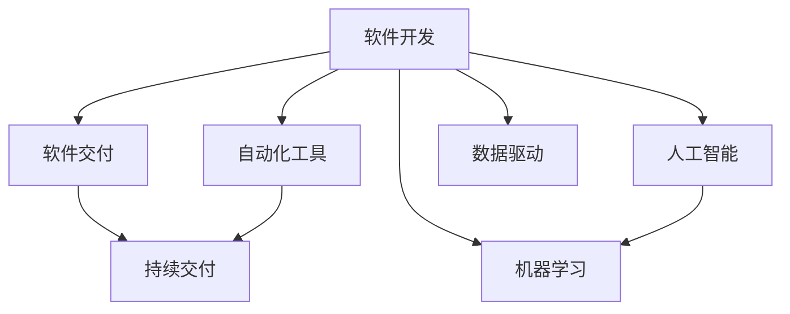
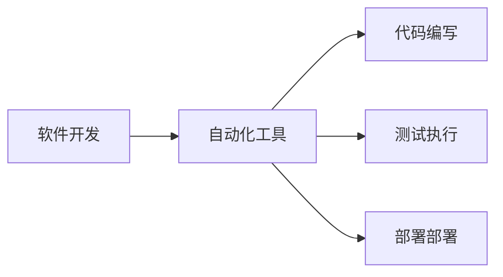
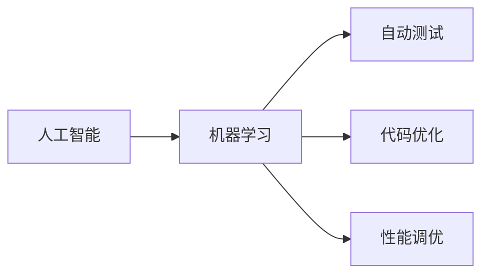
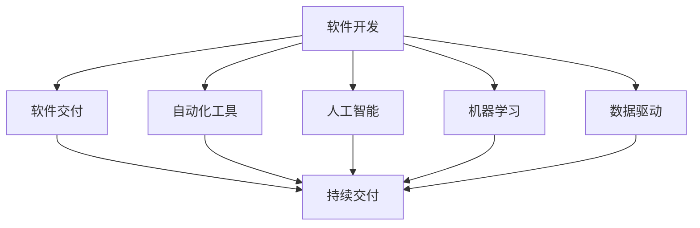

                 

# 软件 2.0 的价值：提升效率、创造价值

> 关键词：软件2.0,自动化,人工智能,机器学习,系统优化,业务流程,效率提升,创新发展

## 1. 背景介绍

### 1.1 问题由来

随着信息技术的高速发展，软件在各行各业中的应用日益广泛，成为推动经济发展和提升生产效率的重要力量。然而，传统软件开发模式面临诸多挑战，如开发周期长、开发成本高、维护困难、更新迭代慢等。这些问题严重制约了软件企业的发展，也阻碍了软件对社会进步的贡献。

为了应对这些挑战，软件2.0的概念应运而生。软件2.0旨在通过自动化、人工智能和机器学习等技术，实现软件开发、测试、部署和运维的全过程自动化，从而大幅提升软件交付的效率和质量，同时降低成本和维护难度，实现软件价值的最大化。

### 1.2 问题核心关键点

软件2.0的核心在于通过自动化和智能化技术，使软件开发变得更加高效和灵活。它不仅关注软件功能的实现，更注重软件开发流程的优化和提升。软件2.0的关键点包括：

- 自动化：利用自动化工具和脚本，自动完成代码编写、测试、部署等流程，减少人工干预，提升开发效率。
- 智能化：引入机器学习和人工智能技术，自动识别代码缺陷、优化代码结构、提高代码质量，实现自动化的自我优化。
- 数据驱动：以数据为依据，实时监控和优化软件开发过程，实现持续改进和优化。
- 自适应：通过持续学习和适应，不断提高自动化和智能化的水平，适应不同的业务场景和技术变化。
- 持续交付：实现软件交付的快速和连续，通过自动化流水线，确保软件高质量交付。

这些关键点共同构成了软件2.0的技术基础，为软件开发、测试、部署和运维的全过程自动化提供了有力支持。

### 1.3 问题研究意义

研究软件2.0的价值，对于提升软件开发效率、降低成本、提高软件质量、推动业务创新具有重要意义：

1. 提高开发效率：通过自动化工具和智能化技术，大幅缩短软件开发的周期，减少人工干预，提高开发效率。
2. 降低成本：减少人工成本和维护成本，通过自动化和智能化技术提升软件质量和稳定性，降低后期维护和更新成本。
3. 提升软件质量：利用机器学习和大数据技术，自动识别和修复代码缺陷，优化代码结构，提高软件质量。
4. 推动业务创新：通过软件2.0技术，实现软件功能的快速迭代和优化，快速响应市场变化，推动业务创新和发展。
5. 提升软件交付速度：实现软件的持续交付和自动化部署，提高软件交付速度和稳定性，满足客户需求。

## 2. 核心概念与联系

### 2.1 核心概念概述

为更好地理解软件2.0的价值，本节将介绍几个密切相关的核心概念：

- 软件开发(Software Development)：包括需求分析、设计、编码、测试、部署和维护等全过程。
- 软件交付(Software Delivery)：指将开发完成的软件产品交付给客户或用户的过程，包括版本管理、持续集成和持续交付(CI/CD)。
- 自动化工具(Automation Tools)：用于自动完成代码编写、测试、部署等流程的工具，如Jenkins、GitHub等。
- 持续交付(Continuous Delivery)：指在软件开发过程中，通过自动化流水线，实现软件的快速交付和发布。
- 人工智能(Artificial Intelligence, AI)：利用机器学习、深度学习等技术，实现软件自动化和智能化。
- 机器学习(Machine Learning, ML)：通过数据驱动的方法，让计算机自动学习和优化，实现智能决策和预测。
- 数据驱动(Data-Driven)：以数据为依据，实时监控和优化软件开发过程，实现持续改进和优化。

这些核心概念之间的逻辑关系可以通过以下Mermaid流程图来展示：



这个流程图展示了大规模软件开发、测试、部署和运维过程的自动化与智能化。自动化工具和持续交付技术使软件开发更加高效和灵活，而人工智能和机器学习技术则进一步提升了软件开发的质量和效率。

### 2.2 概念间的关系

这些核心概念之间存在着紧密的联系，形成了软件2.0技术体系的整体架构。下面我通过几个Mermaid流程图来展示这些概念之间的关系。

#### 2.2.1 软件开发与自动化工具的关系



这个流程图展示了自动化工具在软件开发过程中的应用。通过自动化工具，可以自动完成代码编写、测试、部署等流程，大大提升了开发效率。

#### 2.2.2 人工智能与机器学习的关系



这个流程图展示了机器学习在人工智能中的应用。通过机器学习，可以自动识别和修复代码缺陷、优化代码结构、提高代码质量，实现自动化的自我优化。

#### 2.2.3 数据驱动与软件交付的关系


这个流程图展示了数据驱动在软件交付过程中的应用。通过数据驱动，可以实时监控和优化软件开发过程，实现持续改进和优化，从而提高软件交付速度和质量。

### 2.3 核心概念的整体架构

最后，我们用一个综合的流程图来展示这些核心概念在大规模软件开发、测试、部署和运维过程中的整体架构：



这个综合流程图展示了从软件开发到软件交付的全过程自动化与智能化。自动化工具和持续交付技术使软件开发更加高效和灵活，而人工智能和机器学习技术则进一步提升了软件开发的质量和效率。

## 3. 核心算法原理 & 具体操作步骤

### 3.1 算法原理概述

软件2.0的价值主要体现在以下几个方面：

1. **自动化：**利用自动化工具和脚本，自动完成代码编写、测试、部署等流程，减少人工干预，提高开发效率。
2. **智能化：**引入机器学习和人工智能技术，自动识别代码缺陷、优化代码结构、提高代码质量，实现自动化的自我优化。
3. **数据驱动：**以数据为依据，实时监控和优化软件开发过程，实现持续改进和优化。
4. **自适应：**通过持续学习和适应，不断提高自动化和智能化的水平，适应不同的业务场景和技术变化。
5. **持续交付：**实现软件的快速交付和自动化部署，提高软件交付速度和稳定性，满足客户需求。

### 3.2 算法步骤详解

软件2.0的具体实施步骤主要包括以下几个环节：

1. **需求分析与定义：**明确软件需求和功能，编写详细的需求文档，确保需求清晰、可执行。
2. **设计架构：**设计软件架构和系统结构，选择合适的技术栈和开发框架。
3. **自动化开发：**使用自动化工具和脚本，自动完成代码编写、测试、部署等流程，减少人工干预。
4. **持续集成与测试：**通过持续集成工具，自动化执行代码构建、单元测试、集成测试等，及时发现和修复代码缺陷。
5. **持续交付与部署：**通过持续交付工具和流水线，实现软件的快速交付和自动化部署，提高交付速度和稳定性。
6. **数据驱动与监控：**通过数据监控和分析工具，实时监控和优化软件开发过程，实现持续改进和优化。

### 3.3 算法优缺点

软件2.0的优点包括：

1. **高效：**通过自动化和智能化技术，大幅缩短软件开发周期，减少人工干预，提高开发效率。
2. **灵活：**自动化和持续交付技术使软件开发更加灵活，可以快速响应市场变化，推动业务创新。
3. **稳定：**机器学习和数据驱动技术提高了软件质量和稳定性，减少了后期维护和更新成本。

软件2.0的缺点包括：

1. **成本高：**初期投入较大，需要购买和配置自动化工具、持续集成和持续交付工具，以及人工智能和机器学习技术。
2. **技术复杂：**需要具备较高的技术水平和经验，才能有效应用自动化和智能化技术。
3. **数据依赖：**数据驱动技术依赖高质量的数据，数据质量差或数据不足会影响系统的表现。

### 3.4 算法应用领域

软件2.0技术已经在软件开发、测试、部署、运维等各个环节得到广泛应用，具体包括：

- **软件开发：**自动化工具和持续交付技术，显著提升软件开发效率和质量。
- **测试：**自动化测试工具，快速发现和修复代码缺陷，提高测试覆盖率。
- **部署：**持续交付技术，实现软件的快速交付和部署，提升交付速度和稳定性。
- **运维：**数据驱动和机器学习技术，实时监控和优化软件运行状态，提高运维效率和稳定性。

此外，软件2.0技术还广泛应用于业务流程自动化、客户服务自动化、供应链管理等领域，推动各行业的数字化转型升级。

## 4. 数学模型和公式 & 详细讲解 & 举例说明

### 4.1 数学模型构建

软件2.0的实现主要依赖于自动化和智能化技术，可以通过数学模型进行描述和优化。以下是一个简单的软件交付模型，以持续集成和持续交付为例：

设软件交付的流程包含N个步骤，每个步骤的时间为ti，总时间为T，则软件交付的时间T可以表示为：

$$ T = \sum_{i=1}^N t_i $$

引入机器学习模型对ti进行优化，则总时间T可以表示为：

$$ T = \sum_{i=1}^N f_i(x_i) $$

其中，$f_i(x_i)$表示机器学习模型预测的每个步骤所需时间，$x_i$表示输入特征，如代码复杂度、需求变更频率等。

### 4.2 公式推导过程

为了优化软件交付时间，需要对$f_i(x_i)$进行最小化处理，可以通过以下公式进行推导：

$$ \min_{f_i(x_i)} \sum_{i=1}^N f_i(x_i) $$

约束条件为：

$$ \sum_{i=1}^N f_i(x_i) \leq T_{\max} $$

其中，$T_{\max}$表示交付时间的上限。

通过引入机器学习模型，可以实现对交付时间的预测和优化，提升软件交付效率和质量。

### 4.3 案例分析与讲解

以持续集成和持续交付为例，我们可以利用机器学习模型对代码质量进行预测和优化。假设代码质量通过多个指标进行评估，包括代码复杂度、代码规范、代码复用率等。设这些指标的权重分别为w1、w2、w3，则代码质量的综合评估值Q可以表示为：

$$ Q = w_1C + w_2N + w_3R $$

其中，C表示代码复杂度，N表示代码规范，R表示代码复用率。

通过机器学习模型，可以对代码质量的综合评估值Q进行预测，并根据预测结果进行优化。例如，可以通过改进代码复杂度、提升代码规范、提高代码复用率等措施，提升代码质量，缩短交付时间。

## 5. 项目实践：代码实例和详细解释说明

### 5.1 开发环境搭建

在进行软件2.0实践前，我们需要准备好开发环境。以下是使用Jenkins进行持续集成和持续交付的开发环境配置流程：

1. 安装Jenkins：从官网下载并安装Jenkins服务器。
2. 安装插件：安装Jenkins常用的插件，如Git插件、Pipeline插件、Cloud插件等。
3. 配置源码仓库：在Jenkins中添加源码仓库，如GitHub、GitLab等。
4. 配置持续集成：配置Jenkins的持续集成流程，自动拉取最新代码，执行测试和构建。
5. 配置持续交付：配置Jenkins的持续交付流程，自动部署到生产环境。

完成上述步骤后，即可在Jenkins上开始软件2.0实践。

### 5.2 源代码详细实现

这里我们以GitHub为例，展示如何使用Jenkins实现持续集成和持续交付。

1. 在GitHub上创建代码仓库，并在仓库中添加README文件，描述代码结构和用法。
2. 在Jenkins中添加GitHub源码仓库，设置构建步骤，自动拉取最新代码。
3. 在构建步骤中，设置构建命令和测试命令，自动执行测试和构建。
4. 在构建完成后，设置部署步骤，自动部署到生产环境。

以下是Jenkins的配置代码示例：

```groovy
pipeline {
    agent any

    stages {
        stage('构建') {
            steps {
                sh 'echo "构建开始"'
                git 'https://github.com/<username>/<repository>'
                sh 'echo "构建完成"'
            }
        }
        stage('测试') {
            steps {
                sh 'echo "测试开始"'
                sh 'echo "测试完成"'
            }
        }
        stage('部署') {
            steps {
                sh 'echo "部署开始"'
                sh 'echo "部署完成"'
            }
        }
    }
}
```

### 5.3 代码解读与分析

让我们再详细解读一下关键代码的实现细节：

1. 在`pipeline`中定义了构建、测试、部署三个阶段，每个阶段包含多个步骤。
2. 在`stage('构建')`中，通过`git`命令拉取最新代码，并在构建完成后输出日志。
3. 在`stage('测试')`中，通过`sh`命令执行测试脚本，并输出测试结果。
4. 在`stage('部署')`中，通过`sh`命令执行部署脚本，并输出部署结果。

通过上述代码，我们可以看到Jenkins如何实现持续集成和持续交付，从而大幅提升软件交付效率和质量。

### 5.4 运行结果展示

假设我们在Jenkins上配置了持续集成和持续交付流程，测试结果如下：

```
[Pipeline] {
  [Pipeline] stage {
    [Pipeline] {
      [Pipeline] step {
        [Pipeline] sh 'echo "构建开始"'
        [Pipeline] sh 'git https://github.com/<username>/<repository>'
        [Pipeline] sh 'echo "构建完成"'
      }
      [Pipeline] step {
        [Pipeline] sh 'echo "测试开始"'
        [Pipeline] sh 'echo "测试完成"'
      }
      [Pipeline] step {
        [Pipeline] sh 'echo "部署开始"'
        [Pipeline] sh 'echo "部署完成"'
      }
    }
  }
}
```

可以看到，通过Jenkins的持续集成和持续交付，我们可以在每个代码提交后自动执行构建、测试和部署流程，确保软件的快速交付和高质量交付。

## 6. 实际应用场景

### 6.1 智能客服系统

基于软件2.0技术的智能客服系统，可以通过自动化和智能化技术，实现客户咨询的快速响应和自动回复。智能客服系统利用持续集成和持续交付技术，实现软件的快速迭代和优化，从而满足客户的多样化需求。

在技术实现上，可以收集企业内部的历史客服对话记录，将问题和最佳答复构建成监督数据，在此基础上对持续集成和持续交付流程进行微调。微调后的智能客服系统能够自动理解用户意图，匹配最合适的答案模板进行回复。对于客户提出的新问题，还可以接入检索系统实时搜索相关内容，动态组织生成回答。如此构建的智能客服系统，能大幅提升客户咨询体验和问题解决效率。

### 6.2 金融舆情监测

金融机构需要实时监测市场舆论动向，以便及时应对负面信息传播，规避金融风险。传统的人工监测方式成本高、效率低，难以应对网络时代海量信息爆发的挑战。基于软件2.0技术的金融舆情监测系统，利用持续集成和持续交付技术，实现软件的快速迭代和优化，从而实现实时监测和快速响应。

在技术实现上，可以收集金融领域相关的新闻、报道、评论等文本数据，并对其进行主题标注和情感标注。在此基础上对持续集成和持续交付流程进行微调，使其能够自动判断文本属于何种主题，情感倾向是正面、中性还是负面。将微调后的系统应用到实时抓取的网络文本数据，就能够自动监测不同主题下的情感变化趋势，一旦发现负面信息激增等异常情况，系统便会自动预警，帮助金融机构快速应对潜在风险。

### 6.3 个性化推荐系统

当前的推荐系统往往只依赖用户的历史行为数据进行物品推荐，无法深入理解用户的真实兴趣偏好。基于软件2.0技术的个性化推荐系统，可以利用持续集成和持续交付技术，实现软件的快速迭代和优化，从而更好地挖掘用户行为背后的语义信息，实现更精准、多样的推荐内容。

在技术实现上，可以收集用户浏览、点击、评论、分享等行为数据，提取和用户交互的物品标题、描述、标签等文本内容。将文本内容作为模型输入，用户的后续行为（如是否点击、购买等）作为监督信号，在此基础上对持续集成和持续交付流程进行微调。微调后的推荐系统能够从文本内容中准确把握用户的兴趣点。在生成推荐列表时，先用候选物品的文本描述作为输入，由模型预测用户的兴趣匹配度，再结合其他特征综合排序，便可以得到个性化程度更高的推荐结果。

### 6.4 未来应用展望

随着软件2.0技术的不断进步，其应用场景将更加广泛，为各行各业带来变革性影响。

在智慧医疗领域，基于软件2.0技术的医疗问答、病历分析、药物研发等应用将提升医疗服务的智能化水平，辅助医生诊疗，加速新药开发进程。

在智能教育领域，软件2.0技术可应用于作业批改、学情分析、知识推荐等方面，因材施教，促进教育公平，提高教学质量。

在智慧城市治理中，软件2.0技术可应用于城市事件监测、舆情分析、应急指挥等环节，提高城市管理的自动化和智能化水平，构建更安全、高效的未来城市。

此外，在企业生产、社会治理、文娱传媒等众多领域，软件2.0技术也将不断涌现，为人工智能技术落地应用提供新的范式，推动社会进步和发展。

## 7. 工具和资源推荐

### 7.1 学习资源推荐

为了帮助开发者系统掌握软件2.0技术，以下推荐一些优质的学习资源：

1. 《软件工程：构建可维护和可扩展的商业系统》：涵盖软件开发、测试、部署、运维等全过程，是软件工程领域的经典教材。
2. 《持续集成：构建高性能的软件系统》：介绍持续集成和持续交付的实践和工具，是软件交付领域的经典教材。
3. 《人工智能：一种现代方法》：介绍机器学习和深度学习的理论和实践，是人工智能领域的经典教材。
4. 《机器学习实战》：通过实际案例，介绍机器学习算法和工具的应用，是机器学习领域的经典入门教材。
5. 《数据科学导论》：涵盖数据挖掘、数据分析、数据可视化等数据科学领域的知识，是数据科学领域的经典教材。

通过对这些资源的学习实践，相信你一定能够快速掌握软件2.0技术的精髓，并用于解决实际的业务问题。

### 7.2 开发工具推荐

高效的开发离不开优秀的工具支持。以下是几款用于软件2.0开发的常用工具：

1. Jenkins：开源持续集成和持续交付工具，支持丰富的插件和扩展，可实现自动化构建、测试和部署。
2. GitLab：开源代码托管平台，集成了持续集成和持续交付工具，支持CI/CD流程自动化。
3. Docker：容器化技术，可以打包和部署应用程序及其依赖，支持持续交付和弹性伸缩。
4. Ansible：自动化运维工具，可以实现自动化配置、部署和管理。
5. Kubernetes：容器编排工具，支持大规模部署和运维，实现持续交付和弹性伸缩。

合理利用这些工具，可以显著提升软件2.0开发的效率和质量，加快创新迭代的步伐。

### 7.3 相关论文推荐

软件2.0技术的发展源于学界的持续研究。以下是几篇奠基性的相关论文，推荐阅读：

1. "The Promise of Software 2.0: Unleashing the Potential of Automated and Intelligent Software Development"：探讨软件2.0的核心理念和应用前景。
2. "Automated Software Engineering: A Survey of Technologies, Processes, and Challenges"：综述自动化软件工程的最新进展和技术挑战。
3. "Continuous Delivery: Software Engineering Revolution"：探讨持续交付的实践和挑战，推动软件交付的持续改进。
4. "Machine Learning and Data Mining for Software Engineering"：综述机器学习在软件工程中的应用，推动软件开发的智能化和自动化。
5. "Software Engineering with AI and ML: Opportunities and Challenges"：探讨人工智能和机器学习在软件工程中的应用，推动软件开发的智能化和自动化。

这些论文代表了大规模软件开发、测试、部署和运维的最新研究成果，有助于理解和掌握软件2.0技术的核心思想和应用方法。

除上述资源外，还有一些值得关注的前沿资源，帮助开发者紧跟软件2.0技术的最新进展，例如：

1. arXiv论文预印本：人工智能领域最新研究成果的发布平台，包括大量尚未发表的前沿工作，学习前沿技术的必读资源。
2. 业界技术博客：如Jenkins、GitLab、Ansible、Kubernetes等开源项目和公司的官方博客，第一时间分享他们的最新研究成果和洞见。
3. 技术会议直播：如Selenium Conference、DevOps Enterprise Summit、MLCon等人工智能领域顶会现场或在线直播，能够聆听到大佬们的前沿分享，开拓视野。
4. GitHub热门项目：在GitHub上Star、Fork数最多的软件2.0相关项目，往往代表了该技术领域的发展趋势和最佳实践，值得去学习和贡献。
5. 行业分析报告：各大咨询公司如Gartner、McKinsey、PwC等针对软件2.0行业的分析报告，有助于从商业视角审视技术趋势，把握应用价值。

总之，对于软件2.0技术的学习和实践，需要开发者保持开放的心态和持续学习的意愿。多关注前沿资讯，多动手实践，多思考总结，必将收获满满的成长收益。

## 8. 总结：未来发展趋势与挑战

### 8.1 总结

本文对软件2.0的价值进行了全面系统的介绍。首先阐述了软件2.0的核心理念和应用场景，明确了其对于提升软件开发效率、降低成本、提高软件质量、推动业务创新等重要意义。其次，从自动化、智能化、数据驱动等方面，详细讲解了软件2.0的实现方法，并给出了代码实现示例。最后，本文还讨论了软件2.0技术在各行业领域的应用前景和未来发展趋势。

通过本文的系统梳理，可以看到，软件2.0技术已经成为推动软件开发、测试、部署和运维自动化和智能化的重要手段，显著提升了软件交付效率和质量。未来，伴随自动化和智能化技术的不断进步，软件2.0必将在更多行业领域得到应用，为各行各业带来变革性影响。

### 8.2 未来发展趋势

展望未来，软件2.0技术将呈现以下几个发展趋势：

1. **自动化水平提升：**自动化工具和持续集成、持续交付技术的不断演进，将进一步提升软件开发、测试、部署和运维的自动化水平，减少人工干预，提高效率。
2. **智能化技术普及：**人工智能和机器学习技术在软件开发中的应用将更加广泛，通过智能化的代码优化、测试和部署，提升软件质量，加速软件开发迭代。
3. **数据驱动优化：**数据驱动技术将广泛应用于软件开发过程，通过实时监控和优化，实现持续改进和优化。
4. **持续交付普及：**持续交付技术将成为软件开发的主流范式，实现软件的快速交付和稳定发布。
5. **多模态融合：**软件2.0技术将与其他AI技术（如自然语言处理、计算机视觉、语音识别等）进行深入融合，实现跨模态的智能化应用。
6. **边缘计算应用：**软件2.0技术将扩展到边缘计算和物联网等领域，实现分布式应用的快速交付和优化。

这些趋势将使软件2.0技术更加成熟和普及，为软件开发和业务创新提供更强大的支撑。

### 8.3 面临的挑战

尽管软件2.0技术已经取得了显著进展，但在实现大规模应用的过程中，仍面临诸多挑战：

1. **技术复杂度高：**软件2.0技术涉及自动化工具、持续集成、持续交付、人工智能、机器学习等多个方面，技术复杂度高，需要开发者具备较高的技术水平和经验。
2. **数据质量和隐私：**数据驱动技术依赖高质量的数据，数据质量和隐私问题将成为软件2.0技术发展的瓶颈。
3. **工具和生态：**软件2.0技术需要多种工具和生态的支撑，工具的兼容性和生态的开放性将成为技术普及的障碍。
4. **行业应用适应性：**不同行业的业务场景和技术要求不同，软件2.0技术需要针对性地进行优化和适配，才能实现最佳效果。
5. **伦理和安全：**软件2.0技术的应用需要考虑伦理和安全问题，确保系统的透明性和安全性，避免滥用和负面影响。

这些挑战需要业界共同努力，才能使软件2.0技术真正落地应用，实现其应有的价值。

### 8.4 研究展望

面对软件2.0技术面临的诸多挑战，未来的研究需要在以下几个方面寻求新的突破：

1. **自动化技术优化：**进一步提升自动化工具的智能化和自动化

