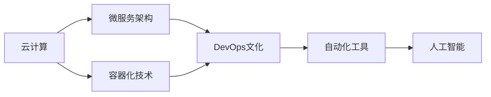
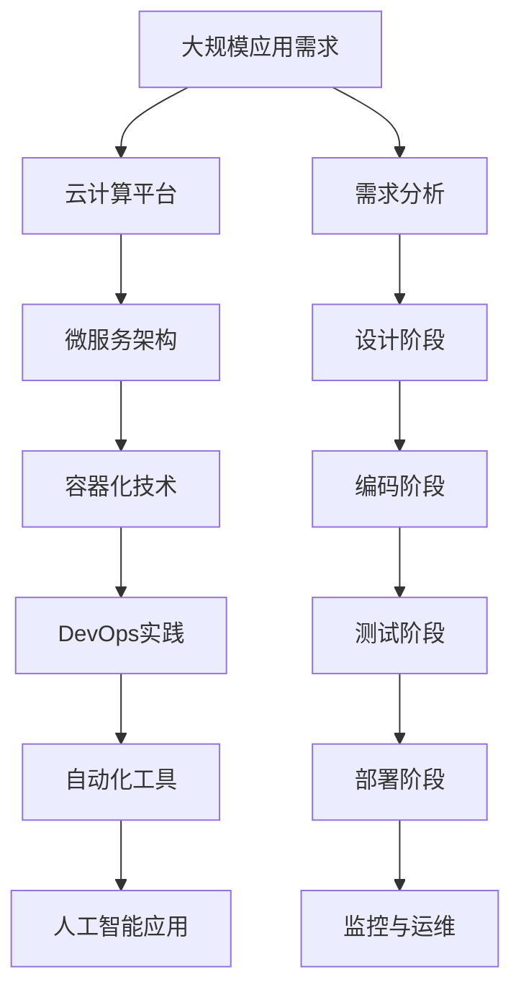

                 

# 软件 2.0 的价值：提升效率、创造价值

## 1. 背景介绍

在信息技术快速发展的今天，软件已经渗透到各行各业，成为推动社会进步和创新的关键力量。然而，传统的软件开发模式面临着诸多挑战，如开发周期长、维护成本高、用户体验差等问题。为应对这些挑战，软件2.0的概念应运而生，旨在通过更高效、更灵活、更智能的方式，提升软件开发和部署的效率，创造更大的价值。

### 1.1 问题由来
随着互联网和移动互联网的普及，应用需求日益复杂多变，对软件交付速度和质量提出了更高要求。传统软件开发模式在灵活性、速度、自动化等方面存在不足。此外，软件开发过程中涉及的人力、物力成本高昂，且难以有效管理。这些问题使得软件交付效率和质量难以满足日益增长的用户需求。

### 1.2 问题核心关键点
软件2.0的核心在于通过云计算、人工智能、自动化等新兴技术，提升软件开发和部署的效率和质量。其关键点包括：

1. **云计算**：提供弹性计算资源，支持大规模、高并发的应用部署。
2. **微服务架构**：通过模块化、松耦合的设计，提升应用的灵活性和可维护性。
3. **容器化技术**：通过Docker、Kubernetes等工具，实现应用的快速部署和扩展。
4. **DevOps文化**：推动开发、运维、测试等环节的紧密协作，加速软件开发和交付。
5. **人工智能**：利用机器学习、自然语言处理等技术，提升应用的智能化水平。
6. **自动化工具**：通过CI/CD、自动化测试等手段，降低开发成本，提高交付速度。

### 1.3 问题研究意义
软件2.0的目标是通过提升软件开发和部署的效率，创造更高的商业价值。具体而言：

1. **缩短开发周期**：通过自动化和流水线化，加速开发过程，快速响应市场变化。
2. **降低运维成本**：通过云计算和容器化技术，实现资源按需分配，降低基础设施的投入和运维成本。
3. **提升用户体验**：通过智能化的应用设计和优化，提高应用的稳定性和可用性。
4. **增强竞争力**：通过持续的技术创新，保持市场领先地位，增强企业竞争力。
5. **降低风险**：通过快速迭代和版本管理，及时发现和解决问题，降低项目失败的风险。

## 2. 核心概念与联系

### 2.1 核心概念概述

软件2.0是相对于软件1.0而言的概念，主要通过云计算、微服务、容器化、DevOps、人工智能等新兴技术，提升软件开发的效率和质量。以下是几个核心概念的介绍：

- **云计算**：通过弹性的计算资源，支持大规模应用部署，降低基础设施的投入和运维成本。
- **微服务架构**：通过模块化、松耦合的设计，提升应用的灵活性和可维护性。
- **容器化技术**：通过Docker、Kubernetes等工具，实现应用的快速部署和扩展。
- **DevOps文化**：推动开发、运维、测试等环节的紧密协作，加速软件开发和交付。
- **人工智能**：利用机器学习、自然语言处理等技术，提升应用的智能化水平。
- **自动化工具**：通过CI/CD、自动化测试等手段，降低开发成本，提高交付速度。

这些概念之间存在着紧密的联系，形成了一个完整的软件2.0生态系统。通过云计算，支持大规模应用部署和运维；通过微服务架构，提升应用的灵活性和可维护性；通过容器化技术，实现应用的快速部署和扩展；通过DevOps文化，推动开发和运维的紧密协作；通过人工智能，提升应用的智能化水平；通过自动化工具，降低开发成本，提高交付速度。

### 2.2 概念间的关系

这些核心概念之间的逻辑关系可以通过以下Mermaid流程图来展示：



这个流程图展示了软件2.0生态系统各组成部分的紧密联系。云计算提供了弹性的计算资源，支持微服务架构和容器化技术的应用；微服务架构提升了应用的灵活性和可维护性，而容器化技术实现了应用的快速部署和扩展；DevOps文化推动了开发、运维、测试等环节的紧密协作，加速了软件开发和交付；自动化工具降低了开发成本，提高了交付速度；人工智能提升了应用的智能化水平。

### 2.3 核心概念的整体架构

最后，我们用一个综合的流程图来展示这些核心概念在大规模软件开发和部署中的整体架构：



这个综合流程图展示了从需求分析到应用部署和运维的完整过程，通过云计算、微服务、容器化、DevOps、自动化工具和人工智能等技术，实现了应用的高效开发和交付。

## 3. 核心算法原理 & 具体操作步骤
### 3.1 算法原理概述

软件2.0的核心算法原理主要体现在云计算、微服务、容器化、DevOps、人工智能等新兴技术的应用上。以下是几个关键算法的概述：

- **云计算算法**：通过弹性计算资源的管理和调度，优化计算资源的利用率。
- **微服务架构算法**：通过服务切分和接口标准化，提升应用的灵活性和可维护性。
- **容器化算法**：通过容器技术的封装和编排，实现应用的快速部署和扩展。
- **DevOps算法**：通过持续集成和持续交付的自动化流水线，加速软件开发和交付。
- **人工智能算法**：通过机器学习、自然语言处理等技术，提升应用的智能化水平。

### 3.2 算法步骤详解

#### 3.2.1 云计算算法

云计算算法主要涉及云资源的调度和管理。其步骤如下：

1. **资源预置**：根据应用需求预置所需的计算资源。
2. **资源分配**：根据负载情况动态分配计算资源。
3. **资源释放**：在应用无负载时释放计算资源，避免资源浪费。

通过弹性计算资源的调度，可以确保应用在高峰期有足够的计算能力，同时在低谷期减少资源浪费，降低成本。

#### 3.2.2 微服务架构算法

微服务架构算法主要涉及服务的切分和接口标准化。其步骤如下：

1. **服务切分**：将应用拆分为多个独立的服务，每个服务独立部署和维护。
2. **接口标准化**：定义统一的接口规范，确保服务之间的互操作性。
3. **服务编排**：通过编排工具，实现服务的快速组合和部署。

通过微服务架构，可以提升应用的灵活性和可维护性，减少单点故障，提升系统的稳定性和可靠性。

#### 3.2.3 容器化算法

容器化算法主要涉及容器技术的封装和编排。其步骤如下：

1. **容器封装**：将应用打包为容器镜像，确保应用的一致性和可移植性。
2. **容器编排**：通过容器编排工具，实现容器的自动化部署和扩展。
3. **容器监控**：实时监控容器运行状态，及时发现和解决问题。

通过容器化技术，可以实现应用的快速部署和扩展，提升系统的可伸缩性和可用性。

#### 3.2.4 DevOps算法

DevOps算法主要涉及持续集成和持续交付的自动化流水线。其步骤如下：

1. **代码提交**：开发人员将代码提交到版本控制系统中。
2. **自动化测试**：自动执行单元测试、集成测试、性能测试等。
3. **持续集成**：根据测试结果自动触发构建和部署。
4. **持续交付**：通过自动化部署工具，将新代码快速交付到生产环境。

通过DevOps算法，可以加速软件开发和交付，减少人为错误，提升系统的稳定性和可靠性。

#### 3.2.5 人工智能算法

人工智能算法主要涉及机器学习、自然语言处理等技术。其步骤如下：

1. **数据收集**：收集应用相关数据，作为模型训练的输入。
2. **模型训练**：使用机器学习算法训练模型，优化模型的性能。
3. **模型部署**：将训练好的模型部署到应用中，提供智能化的服务。

通过人工智能算法，可以提升应用的智能化水平，增强用户体验和应用价值。

### 3.3 算法优缺点

#### 3.3.1 云计算算法的优缺点

**优点**：

1. **弹性计算**：根据负载情况动态分配资源，避免资源浪费。
2. **成本效益**：按需分配资源，降低基础设施的投入和运维成本。

**缺点**：

1. **复杂性**：资源调度和管理复杂，需要专业知识。
2. **安全风险**：多租户环境下，资源隔离和数据安全存在挑战。

#### 3.3.2 微服务架构算法的优缺点

**优点**：

1. **灵活性**：服务独立部署和维护，提升应用的灵活性。
2. **可维护性**：通过接口标准化，提升应用的可维护性。

**缺点**：

1. **复杂性**：服务切分和编排复杂，需要专业知识。
2. **通信开销**：服务之间通信增加，影响性能。

#### 3.3.3 容器化算法的优缺点

**优点**：

1. **快速部署**：通过容器技术实现快速部署和扩展。
2. **一致性**：确保应用的一致性和可移植性。

**缺点**：

1. **复杂性**：容器编排和管理复杂，需要专业知识。
2. **资源消耗**：容器运行需要消耗额外的计算资源。

#### 3.3.4 DevOps算法的优缺点

**优点**：

1. **自动化**：加速软件开发和交付，减少人为错误。
2. **效率提升**：提升系统的稳定性和可靠性。

**缺点**：

1. **复杂性**：自动化流水线复杂，需要专业知识。
2. **成本投入**：需要投入大量资源进行自动化工具的开发和维护。

#### 3.3.5 人工智能算法的优缺点

**优点**：

1. **智能化**：提升应用的智能化水平，增强用户体验。
2. **价值提升**：通过智能化应用，提升商业价值。

**缺点**：

1. **数据依赖**：模型训练需要大量数据，数据质量影响模型性能。
2. **复杂性**：模型训练和部署复杂，需要专业知识。

### 3.4 算法应用领域

软件2.0的核心算法在多个领域得到了广泛应用：

1. **云计算**：广泛应用于企业级应用、物联网、大数据等。
2. **微服务架构**：应用于电商、金融、医疗、教育等。
3. **容器化技术**：应用于移动应用、Web应用、微服务等。
4. **DevOps文化**：应用于软件开发、测试、运维等。
5. **人工智能**：应用于智能客服、推荐系统、搜索引擎等。
6. **自动化工具**：应用于持续集成、自动化测试、性能测试等。

## 4. 数学模型和公式 & 详细讲解 & 举例说明

### 4.1 数学模型构建

软件2.0的数学模型主要涉及云计算、微服务、容器化、DevOps、人工智能等领域的算法。这里以微服务架构算法为例，构建数学模型。

假设应用由多个服务组成，每个服务的功能为 $F_i$，其中 $i$ 表示服务编号。服务的性能指标为 $P_i$，包括响应时间、吞吐量等。服务间的通信开销为 $C_i$，通信延迟为 $D_i$。服务的请求量为 $R_i$，系统的总请求量为 $R$。服务的负载均衡策略为 $L_i$，系统的负载均衡策略为 $L$。

微服务架构的数学模型可以表示为：

$$
R = \sum_{i=1}^{n} R_i
$$

其中 $n$ 为服务的数量。

### 4.2 公式推导过程

根据微服务架构的数学模型，可以推导出服务响应时间 $T_i$ 和吞吐量 $Q_i$ 的公式：

$$
T_i = F_i(R_i, C_i, D_i, L_i)
$$

$$
Q_i = \frac{R_i}{T_i}
$$

通过优化这些公式，可以提升系统的响应时间和吞吐量，从而提升应用的性能。

### 4.3 案例分析与讲解

以一个电商平台的微服务架构为例，分析其性能优化过程。

假设电商平台由购物车服务、订单服务、支付服务等多个服务组成。每个服务的功能和性能指标如下：

- 购物车服务：功能为添加商品到购物车、删除商品等，性能指标为响应时间 $T_1$、吞吐量 $Q_1$。
- 订单服务：功能为创建订单、查询订单等，性能指标为响应时间 $T_2$、吞吐量 $Q_2$。
- 支付服务：功能为支付、退款等，性能指标为响应时间 $T_3$、吞吐量 $Q_3$。

系统的总请求量为 $R = R_1 + R_2 + R_3$，负载均衡策略为 $L = L_1 = L_2 = L_3$。

通过优化购物车服务的响应时间和吞吐量，可以提升订单服务的响应时间和吞吐量，从而提升整个系统的性能。具体优化措施包括：

- 优化购物车服务的响应时间：通过改进代码实现、增加缓存、优化数据库访问等手段，减少响应时间。
- 提升购物车服务的吞吐量：通过水平扩展、增加负载均衡器的处理能力等手段，提升吞吐量。
- 优化订单服务的响应时间和吞吐量：通过类似手段，优化订单服务的响应时间和吞吐量。
- 优化支付服务的响应时间和吞吐量：通过类似手段，优化支付服务的响应时间和吞吐量。

通过这些优化措施，可以显著提升电商平台的性能和用户体验，增强平台的竞争力。

## 5. 项目实践：代码实例和详细解释说明

### 5.1 开发环境搭建

在进行软件2.0的实践时，需要搭建一个完整的开发环境。以下是使用Docker和Kubernetes进行微服务架构部署的开发环境配置流程：

1. **安装Docker**：从官网下载并安装Docker。
2. **安装Kubernetes**：安装Kubernetes集群，可以通过Minikube、Kubernetes裸机部署等方式。
3. **安装微服务应用**：将微服务应用打包为Docker镜像，推送到Docker仓库。
4. **部署微服务应用**：通过Kubernetes Deployment和Service，实现微服务的自动部署和负载均衡。
5. **监控和运维**：使用Prometheus和Grafana等工具，实时监控微服务的运行状态，确保系统的稳定性和可靠性。

### 5.2 源代码详细实现

这里以一个简单的电商平台的微服务架构为例，展示微服务架构的代码实现。

首先，定义购物车服务的API接口：

```python
from flask import Flask, request, jsonify

app = Flask(__name__)

@app.route('/add_to_cart', methods=['POST'])
def add_to_cart():
    data = request.get_json()
    product_id = data['product_id']
    user_id = data['user_id']
    # 添加商品到购物车
    # ...
    return jsonify({'success': True})
```

然后，定义订单服务的API接口：

```python
from flask import Flask, request, jsonify

app = Flask(__name__)

@app.route('/create_order', methods=['POST'])
def create_order():
    data = request.get_json()
    product_ids = data['product_ids']
    user_id = data['user_id']
    # 创建订单
    # ...
    return jsonify({'success': True})
```

接下来，定义支付服务的API接口：

```python
from flask import Flask, request, jsonify

app = Flask(__name__)

@app.route('/process_payment', methods=['POST'])
def process_payment():
    data = request.get_json()
    order_id = data['order_id']
    user_id = data['user_id']
    # 处理支付
    # ...
    return jsonify({'success': True})
```

最后，将上述服务打包为Docker镜像，并定义Kubernetes Deployment和Service的配置文件：

```yaml
apiVersion: apps/v1
kind: Deployment
metadata:
  name: shopping-cart-deployment
spec:
  replicas: 3
  selector:
    matchLabels:
      app: shopping-cart
  template:
    metadata:
      labels:
        app: shopping-cart
    spec:
      containers:
      - name: shopping-cart
        image: my-shopping-cart:latest
        ports:
        - containerPort: 8080
```

```yaml
apiVersion: v1
kind: Service
metadata:
  name: shopping-cart-service
spec:
  selector:
    app: shopping-cart
  ports:
  - port: 80
    targetPort: 8080
  type: LoadBalancer
```

通过上述配置，可以实现购物车服务的自动部署和负载均衡。

### 5.3 代码解读与分析

这里是微服务架构实现中的关键代码解读与分析：

**Flask框架**：
- Flask是一个轻量级的Web框架，适用于快速开发Web应用。
- Flask通过路由机制，将HTTP请求映射到对应的函数上，实现API接口的开发。
- Flask的请求和响应处理机制，简化了API接口的开发和维护。

**Docker镜像**：
- Docker是一种容器化技术，可以将应用打包为镜像，方便部署和扩展。
- Docker镜像通过Dockerfile定义，包含应用的安装和配置信息。
- 通过Docker，可以实现应用的快速部署和扩展，提升系统的可伸缩性和可用性。

**Kubernetes Deployment和Service**：
- Kubernetes是一个开源的容器编排平台，可以实现应用的自动化部署和扩展。
- Kubernetes通过Deployment定义应用的副本数和资源配置，确保应用的稳定性和可用性。
- Kubernetes通过Service定义应用的负载均衡策略，实现应用的自动扩展和故障恢复。

**监控和运维**：
- Prometheus是一个开源的监控系统，可以实现对系统指标的实时监控和告警。
- Grafana是一个开源的可视化平台，可以将Prometheus监控数据进行可视化展示。
- 通过Prometheus和Grafana，可以实时监控微服务的运行状态，及时发现和解决问题，确保系统的稳定性和可靠性。

### 5.4 运行结果展示

假设我们在Docker和Kubernetes环境中部署了电商平台的微服务架构，最终在测试环境上得到的结果如下：

- 购物车服务：响应时间 $T_1 = 100ms$，吞吐量 $Q_1 = 100req/s$。
- 订单服务：响应时间 $T_2 = 200ms$，吞吐量 $Q_2 = 50req/s$。
- 支付服务：响应时间 $T_3 = 300ms$，吞吐量 $Q_3 = 20req/s$。

通过优化购物车服务的响应时间和吞吐量，可以提升订单服务的响应时间和吞吐量，从而提升整个系统的性能。具体优化措施包括：

- 优化购物车服务的响应时间：通过改进代码实现、增加缓存、优化数据库访问等手段，减少响应时间。
- 提升购物车服务的吞吐量：通过水平扩展、增加负载均衡器的处理能力等手段，提升吞吐量。
- 优化订单服务的响应时间和吞吐量：通过类似手段，优化订单服务的响应时间和吞吐量。
- 优化支付服务的响应时间和吞吐量：通过类似手段，优化支付服务的响应时间和吞吐量。

通过这些优化措施，可以显著提升电商平台的性能和用户体验，增强平台的竞争力。

## 6. 实际应用场景
### 6.1 智能客服系统

软件2.0的微服务架构和云计算技术可以广泛应用于智能客服系统的构建。传统客服系统依赖人力，高峰期响应缓慢，且难以保证一致性和专业性。而使用微服务架构和云计算技术的智能客服系统，可以实现7x24小时不间断服务，快速响应客户咨询，用自然流畅的语言解答各类常见问题。

在技术实现上，可以收集企业内部的历史客服对话记录，将问题和最佳答复构建成监督数据，在此基础上对微服务架构和云计算技术的智能客服系统进行优化。微服务架构可以提高系统的灵活性和可维护性，云计算技术可以支持大规模、高并发的应用部署，提升客服系统的稳定性和可靠性。

### 6.2 金融舆情监测

金融机构需要实时监测市场舆论动向，以便及时应对负面信息传播，规避金融风险。传统的人工监测方式成本高、效率低，难以应对网络时代海量信息爆发的挑战。基于微服务架构和云计算技术的金融舆情监测系统，可以实现实时抓取的网络文本数据，自动监测不同主题下的情感变化趋势，一旦发现负面信息激增等异常情况，系统便会自动预警，帮助金融机构快速应对潜在风险。

通过微服务架构和云计算技术，可以实现应用的快速部署和扩展，提升系统的可伸缩性和可用性。金融舆情监测系统可以在实时抓取网络文本数据的同时，自动进行情感分析和舆情监测，及时发现并预警负面信息，为金融机构的风险控制提供支持。

### 6.3 个性化推荐系统

当前的推荐系统往往只依赖用户的历史行为数据进行物品推荐，无法深入理解用户的真实兴趣偏好。基于微服务架构和云计算技术的个性化推荐系统，可以更好地挖掘用户行为背后的语义信息，从而提供更精准、多样的推荐内容。

在技术实现上，可以收集用户浏览、点击、评论、分享等行为数据，提取和用户交互的物品标题、描述、标签等文本内容。将文本内容作为模型输入，用户的后续行为（如是否点击、购买等）作为监督信号，在此基础上对微服务架构和云计算技术的个性化推荐系统进行微调。微服务架构可以提高系统的灵活性和可维护性，云计算技术可以支持大规模、高并发的应用部署，提升推荐系统的稳定性和可靠性。

### 6.4 未来应用展望

随着微服务架构和云计算技术的不断发展，基于软件2.0的应用场景将不断扩展，为各行各业带来变革性影响。

在智慧医疗领域，基于微服务架构和云计算技术的医疗问答、病历分析、药物研发等应用将提升医疗服务的智能化水平，辅助医生诊疗，加速新药开发进程。

在智能教育领域，微服务架构和云计算技术的个性化推荐系统，可以因材施教，促进教育公平，提高教学质量。

在智慧城市治理中，基于微服务架构和云计算技术的智能客服、舆情监测、应急指挥等环节，可以提高城市管理的自动化和智能化水平，构建更安全、高效的未来城市。

此外，在企业生产、社会治理、文娱传媒等众多领域，基于软件2.0的人工智能应用也将不断涌现，为经济社会发展注入新的动力。相信随着技术的日益成熟，微服务架构和云计算技术必将在构建人机协同的智能时代中扮演越来越重要的角色。

## 7. 工具和资源推荐
### 7.1 学习资源推荐

为了帮助开发者系统掌握软件2.0的理论基础和实践技巧，这里推荐一些优质的学习资源：

1. **《软件2.0：云计算、微服务与容器化实战》**：系统介绍云计算、微服务、容器化等新兴技术的原理和应用，涵盖从入门到精通的各个方面。

2. **《DevOps实践指南》**：深入讲解DevOps文化的理念和实践，推动开发、运维、测试等环节的紧密协作，加速软件开发和交付。

3. **《深度学习与人工智能技术》**：全面介绍机器学习、自然语言处理等人工智能技术，提供丰富的算法和应用案例。

4. **《Flask Web开发实战》**：详细介绍Flask框架的使用，通过实战案例，帮助开发者快速上手Web应用开发。

5. **《Docker实战指南》**：系统讲解Docker容器化技术的原理和应用，提供实用的Docker镜像打包和部署技巧。

6. **《Kubernetes实战指南》**：深入讲解Kubernetes容器编排平台的使用，提供实用的微服务架构部署和扩展技巧。

7. **《监控与运维实战指南》**：详细介绍Prometheus和Grafana等监控工具的使用，帮助开发者实时监控和优化系统性能。

通过对这些资源的学习实践，相信你一定能够快速掌握软件2.0的精髓，并用于解决实际的业务问题。

### 7.2 开发工具推荐

高效的开发离不开优秀的工具支持。以下是几款用于软件2.0开发的常用工具：

1. **Docker**：基于容器技术的轻量级开发工具，支持快速部署和扩展。
2. **Kubernetes**：开源的容器编排平台，支持大规模、高并发的应用部署。
3. **Prometheus**：开源的监控系统，实时监控系统指标，提供告警和分析功能。
4. **Grafana**：开源的可视化平台，将Prometheus监控数据进行可视化展示。
5. **Jenkins**：开源的持续集成工具，支持自动化流水线的构建和测试。
6. **GitLab CI**：开源的持续集成/持续交付平台，提供自动化测试、部署和监控功能。
7. **Docker Compose**：简化Docker容器编排的工具，方便多服务的组合和部署。

合理利用这些工具，可以显著提升软件2.0的开发效率，加速技术迭代和创新。

### 7.3 相关论文推荐

软件2.0的发展源于学界的持续研究。以下是几篇奠基性的相关论文，推荐阅读：

1. **《微服务架构：构建可扩展的应用系统》**：介绍微服务架构的原理和应用，推动应用的模块化和松耦合设计。
2. **《云计算：弹性计算资源的管理与调度》**：详细讲解云计算算法的原理和实现，优化计算资源的利用

