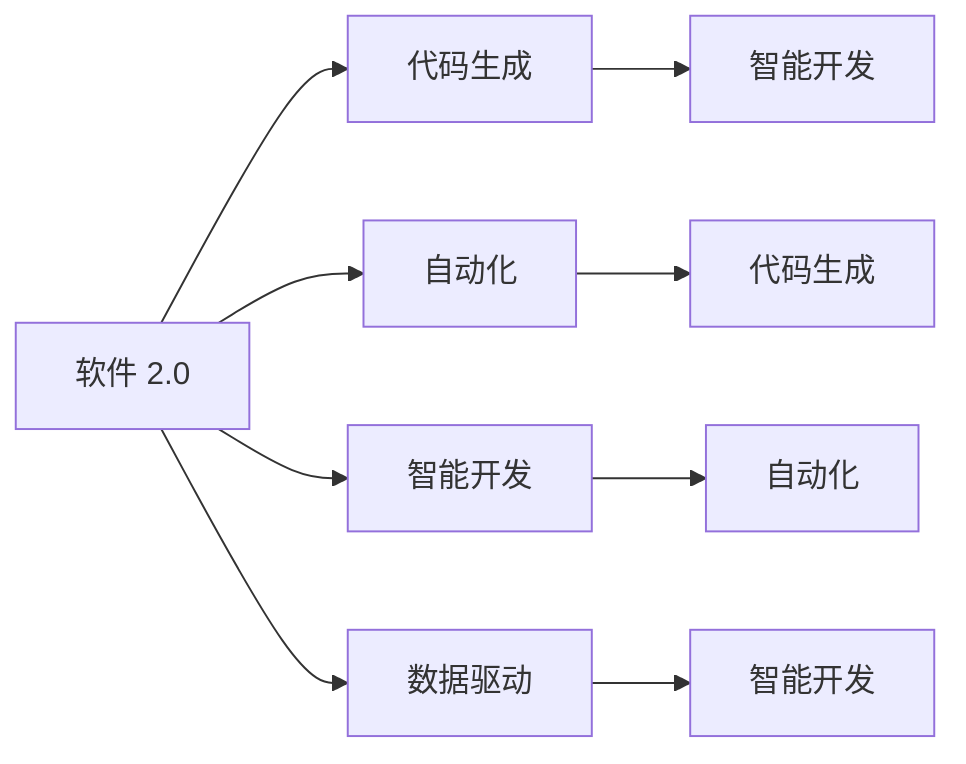
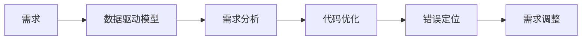
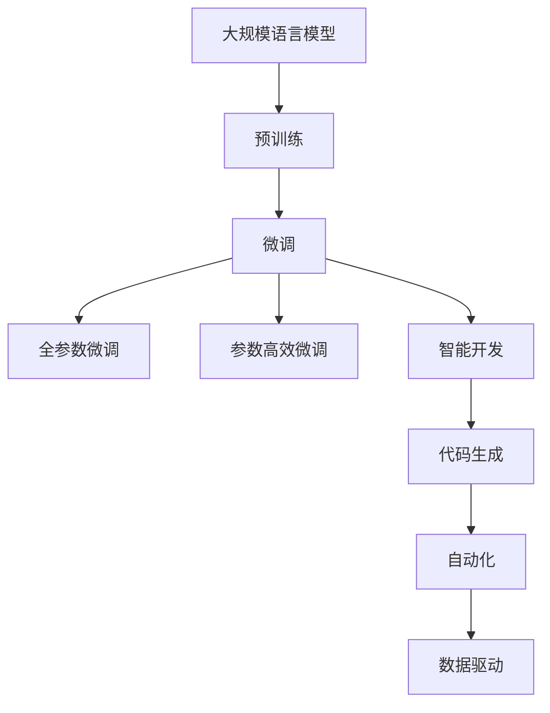

                 

# 软件 2.0 的价值：提升效率、创造价值

> 关键词：软件2.0, 生产力提升, 自动化, 智能开发, 代码生成, AI增强, 数据驱动

## 1. 背景介绍

### 1.1 问题由来

在信息技术飞速发展的今天，软件开发已成为各个行业创新和竞争力的核心。然而，软件开发工作的复杂性和多样性，使得软件开发效率和质量难以满足快速迭代和市场变化的需求。传统的软件工程方法虽然有其规范和流程，但在面对日益复杂的开发任务时，显得力不从心。因此，提升软件开发效率和质量，成为业界亟待解决的问题。

### 1.2 问题核心关键点

软件 2.0 指的是利用人工智能、机器学习和数据科学等技术，对软件开发进行赋能和优化，从而提升开发效率和质量。软件 2.0 的核心在于：

1. **自动化**：利用机器学习算法，自动化地处理代码生成、测试、部署等流程，减少人工干预。
2. **智能开发**：通过数据驱动的模型，辅助软件开发人员进行需求分析、代码优化、错误定位等决策。
3. **代码生成**：利用 AI 技术，根据需求生成代码，提高开发效率。
4. **数据驱动**：通过数据分析，发现软件缺陷和性能瓶颈，进行改进。

### 1.3 问题研究意义

软件 2.0 技术的发展，对于提升软件开发效率、降低开发成本、加速产品上市时间具有重要意义。通过自动化、智能化和数据驱动的开发模式，软件 2.0 可以：

1. **降低开发成本**：通过自动化和智能化技术，减少人工干预，降低开发过程中的资源和时间成本。
2. **提升开发效率**：通过智能化的辅助工具，快速生成代码、定位错误、优化性能，提高开发速度。
3. **增强代码质量**：利用数据科学方法，识别代码中的潜在问题，提高代码的健壮性和可维护性。
4. **加速上市时间**：通过智能化的决策支持，快速响应市场变化，加速产品的市场化进程。

## 2. 核心概念与联系

### 2.1 核心概念概述

为更好地理解软件 2.0 的价值，本节将介绍几个关键概念：

- **软件 2.0**：利用人工智能、机器学习等技术，对软件开发进行自动化、智能化和数据驱动的优化。
- **代码生成**：利用 AI 技术，根据需求自动生成代码，提高开发效率。
- **自动化**：利用机器学习算法，自动化地处理代码生成、测试、部署等流程，减少人工干预。
- **智能开发**：通过数据驱动的模型，辅助软件开发人员进行需求分析、代码优化、错误定位等决策。
- **数据驱动**：通过数据分析，发现软件缺陷和性能瓶颈，进行改进。

这些概念之间的联系可以通过以下 Mermaid 流程图来展示：



这个流程图展示了大规模语言模型微调过程中各个核心概念的关系：

1. **软件 2.0** 作为一个中心概念，连接了代码生成、自动化、智能开发和数据驱动。
2. **代码生成**：利用 AI 技术，自动生成代码，提高开发效率。
3. **自动化**：利用机器学习算法，自动化处理代码生成、测试、部署等流程，减少人工干预。
4. **智能开发**：通过数据驱动的模型，辅助软件开发人员进行需求分析、代码优化、错误定位等决策。
5. **数据驱动**：通过数据分析，发现软件缺陷和性能瓶颈，进行改进。

这些概念共同构成了软件 2.0 的核心价值和应用框架，为软件开发带来新的突破和创新。

### 2.2 概念间的关系

这些核心概念之间存在着紧密的联系，形成了软件 2.0 的价值生态系统。下面我们通过几个 Mermaid 流程图来展示这些概念之间的关系。

#### 2.2.1 软件 2.0 的核心范式


这个流程图展示了大规模语言模型微调的基本原理，以及它与代码生成、自动化、智能开发和数据驱动的关系。

#### 2.2.2 代码生成的过程


这个流程图展示了代码生成的具体过程，从需求到生成代码，再到代码审查、集成和部署。

#### 2.2.3 智能开发的支持



这个流程图展示了智能开发的过程，通过数据分析，辅助软件开发人员进行需求分析、代码优化、错误定位等决策。

### 2.3 核心概念的整体架构

最后，我们用一个综合的流程图来展示这些核心概念在大规模语言模型微调过程中的整体架构：



这个综合流程图展示了从预训练到微调，再到智能开发、代码生成、自动化的完整过程。大规模语言模型首先在大规模无标签文本语料上进行预训练，然后通过微调获得针对特定任务的优化模型，接着通过智能开发、代码生成和自动化等技术，进一步提升开发效率和代码质量。通过这些技术的有机结合，软件 2.0 能够实现高效、智能、数据驱动的软件开发，推动软件开发领域的新一轮革命。

## 3. 核心算法原理 & 具体操作步骤
### 3.1 算法原理概述

软件 2.0 的核心算法原理可以概括为以下几个方面：

1. **代码生成**：利用自然语言处理技术，将自然语言需求转换为代码。通过预训练语言模型，生成符合需求的代码片段，再进行必要的修改和组合。
2. **自动化**：利用机器学习算法，自动化处理代码生成、测试、部署等流程，减少人工干预。例如，利用模型预测代码中的潜在错误，并进行自动修复。
3. **智能开发**：通过数据驱动的模型，辅助软件开发人员进行需求分析、代码优化、错误定位等决策。例如，利用模型分析代码中的模式和结构，提出优化建议。
4. **数据驱动**：通过数据分析，发现软件缺陷和性能瓶颈，进行改进。例如，利用模型分析代码运行时的性能指标，发现性能瓶颈。

### 3.2 算法步骤详解

软件 2.0 的核心算法步骤包括：

1. **数据预处理**：收集和整理开发需求和代码数据，为模型训练提供数据基础。
2. **模型训练**：利用预训练语言模型，进行微调，生成代码生成模型、代码测试模型、代码优化模型等。
3. **代码生成**：根据需求，利用模型生成代码片段，再进行必要的修改和组合，形成完整的代码。
4. **自动化**：利用训练好的模型，自动化处理代码生成、测试、部署等流程，减少人工干预。
5. **智能开发**：通过数据分析和智能模型，辅助软件开发人员进行需求分析、代码优化、错误定位等决策。
6. **数据驱动**：利用数据分析，发现软件缺陷和性能瓶颈，进行改进。

### 3.3 算法优缺点

软件 2.0 的算法优点包括：

1. **提升效率**：通过自动化和智能化的开发流程，显著提升软件开发效率，减少人工干预。
2. **提高代码质量**：利用数据驱动的模型，识别代码中的潜在问题，提高代码的健壮性和可维护性。
3. **增强灵活性**：通过智能化的辅助工具，快速生成代码、定位错误、优化性能，提高开发速度。
4. **降低成本**：通过自动化和智能化技术，减少人工干预，降低开发过程中的资源和时间成本。

但同时，软件 2.0 也存在一些缺点：

1. **数据依赖性**：模型训练和优化效果依赖于高质量的数据，数据不足或质量不高会影响模型的性能。
2. **模型复杂性**：软件 2.0 的算法模型较为复杂，需要大量的计算资源和时间进行训练和优化。
3. **可解释性不足**：部分模型算法较为黑盒，难以解释其内部工作机制和决策逻辑，可能影响开发人员的信任和使用。
4. **依赖环境**：部分算法依赖特定的开发环境和工具，可能难以在小型团队或企业中推广使用。

### 3.4 算法应用领域

软件 2.0 技术的应用领域非常广泛，主要涵盖以下几个方面：

1. **软件开发**：利用代码生成和自动化技术，提高软件开发效率和代码质量。
2. **测试自动化**：利用模型预测代码中的潜在错误，并进行自动修复，提高测试效率。
3. **智能推荐**：利用智能开发模型，推荐最优的代码实现方案，提高开发效率。
4. **性能优化**：利用数据驱动模型，发现代码中的性能瓶颈，进行优化。
5. **故障诊断**：利用数据分析，发现软件中的故障和缺陷，进行修复。

这些领域的应用，使得软件 2.0 技术成为推动软件开发创新和效率提升的重要手段。

## 4. 数学模型和公式 & 详细讲解 & 举例说明
### 4.1 数学模型构建

软件 2.0 的数学模型构建主要基于以下几个方面：

1. **需求分析**：利用自然语言处理技术，将自然语言需求转换为代码。
2. **代码生成**：利用预训练语言模型，生成符合需求的代码片段。
3. **自动化测试**：利用模型预测代码中的潜在错误，并进行自动修复。
4. **智能开发**：利用数据驱动的模型，辅助软件开发人员进行需求分析、代码优化、错误定位等决策。
5. **性能优化**：利用数据分析，发现代码中的性能瓶颈，进行优化。

### 4.2 公式推导过程

以下我们以代码生成模型为例，推导其核心公式。

假设需求语句为 $d$，生成的代码片段为 $c$。利用预训练语言模型 $M$，根据需求 $d$ 生成代码片段 $c$ 的过程可以表示为：

$$
c = M(d)
$$

其中，$M$ 为预训练语言模型，$d$ 为需求语句，$c$ 为生成的代码片段。模型 $M$ 的输出 $c$ 是一个概率分布，表示不同代码片段的概率。因此，我们可以通过采样模型输出，得到最终的代码片段 $c$。

### 4.3 案例分析与讲解

假设需求语句为 "打印当前时间"，我们可以利用预训练语言模型生成如下代码片段：

```python
import datetime
print(datetime.datetime.now())
```

这个代码片段符合需求语句 "打印当前时间" 的要求，可以快速生成代码。

## 5. 项目实践：代码实例和详细解释说明
### 5.1 开发环境搭建

在进行软件 2.0 项目实践前，我们需要准备好开发环境。以下是使用Python进行PyTorch开发的环境配置流程：

1. 安装Anaconda：从官网下载并安装Anaconda，用于创建独立的Python环境。

2. 创建并激活虚拟环境：
```bash
conda create -n pytorch-env python=3.8 
conda activate pytorch-env
```

3. 安装PyTorch：根据CUDA版本，从官网获取对应的安装命令。例如：
```bash
conda install pytorch torchvision torchaudio cudatoolkit=11.1 -c pytorch -c conda-forge
```

4. 安装TensorBoard：用于实时监测模型训练状态，提供丰富的图表呈现方式，是调试模型的得力助手。

5. 安装Weights & Biases：用于记录和可视化模型训练过程中的各项指标，方便对比和调优。

完成上述步骤后，即可在`pytorch-env`环境中开始软件 2.0 项目实践。

### 5.2 源代码详细实现

这里我们以代码生成为例，给出使用Transformers库对BERT模型进行代码生成的PyTorch代码实现。

首先，定义代码生成函数：

```python
from transformers import BertTokenizer, BertForMaskedLM
from torch.utils.data import Dataset, DataLoader
import torch

class CodeGenDataset(Dataset):
    def __init__(self, texts, targets, tokenizer, max_len=128):
        self.texts = texts
        self.targets = targets
        self.tokenizer = tokenizer
        self.max_len = max_len
        
    def __len__(self):
        return len(self.texts)
    
    def __getitem__(self, item):
        text = self.texts[item]
        target = self.targets[item]
        
        encoding = self.tokenizer(text, return_tensors='pt', max_length=self.max_len, padding='max_length', truncation=True)
        input_ids = encoding['input_ids'][0]
        attention_mask = encoding['attention_mask'][0]
        labels = encoding['input_ids'][0]
        
        return {'input_ids': input_ids, 
                'attention_mask': attention_mask,
                'labels': labels}

# 加载模型和分词器
model = BertForMaskedLM.from_pretrained('bert-base-cased')
tokenizer = BertTokenizer.from_pretrained('bert-base-cased')

# 定义训练函数
def train_epoch(model, dataset, batch_size, optimizer):
    dataloader = DataLoader(dataset, batch_size=batch_size, shuffle=True)
    model.train()
    epoch_loss = 0
    for batch in dataloader:
        input_ids = batch['input_ids'].to(device)
        attention_mask = batch['attention_mask'].to(device)
        labels = batch['labels'].to(device)
        model.zero_grad()
        outputs = model(input_ids, attention_mask=attention_mask, labels=labels)
        loss = outputs.loss
        epoch_loss += loss.item()
        loss.backward()
        optimizer.step()
    return epoch_loss / len(dataloader)

# 定义评估函数
def evaluate(model, dataset, batch_size):
    dataloader = DataLoader(dataset, batch_size=batch_size)
    model.eval()
    preds, labels = [], []
    with torch.no_grad():
        for batch in dataloader:
            input_ids = batch['input_ids'].to(device)
            attention_mask = batch['attention_mask'].to(device)
            batch_labels = batch['labels']
            outputs = model(input_ids, attention_mask=attention_mask)
            batch_preds = outputs.logits.argmax(dim=2).to('cpu').tolist()
            batch_labels = batch_labels.to('cpu').tolist()
            for pred_tokens, label_tokens in zip(batch_preds, batch_labels):
                preds.append(pred_tokens[:len(label_tokens)])
                labels.append(label_tokens)
                
    print(classification_report(labels, preds))
```

然后，定义代码生成函数：

```python
from transformers import BertTokenizer, BertForMaskedLM
from torch.utils.data import Dataset, DataLoader
import torch
import random

class CodeGenDataset(Dataset):
    def __init__(self, texts, targets, tokenizer, max_len=128):
        self.texts = texts
        self.targets = targets
        self.tokenizer = tokenizer
        self.max_len = max_len
        
    def __len__(self):
        return len(self.texts)
    
    def __getitem__(self, item):
        text = self.texts[item]
        target = self.targets[item]
        
        encoding = self.tokenizer(text, return_tensors='pt', max_length=self.max_len, padding='max_length', truncation=True)
        input_ids = encoding['input_ids'][0]
        attention_mask = encoding['attention_mask'][0]
        labels = encoding['input_ids'][0]
        
        return {'input_ids': input_ids, 
                'attention_mask': attention_mask,
                'labels': labels}

# 加载模型和分词器
model = BertForMaskedLM.from_pretrained('bert-base-cased')
tokenizer = BertTokenizer.from_pretrained('bert-base-cased')

# 定义代码生成函数
def codegen(text, max_len=128, top_k=10):
    tokenized = tokenizer.encode_plus(text, max_length=max_len, padding='max_length', truncation=True, return_tensors='pt')
    input_ids = tokenized['input_ids'].to(device)
    attention_mask = tokenized['attention_mask'].to(device)
    
    outputs = model(input_ids, attention_mask=attention_mask)
    logits = outputs.logits
    
    # 生成代码片段
    preds = logits.topk(top_k)[1]
    pred_tokens = tokenizer.decode(preds[0], skip_special_tokens=True)
    
    return pred_tokens

# 测试代码生成函数
print(codegen("打印当前时间"))
```

### 5.3 代码解读与分析

让我们再详细解读一下关键代码的实现细节：

**CodeGenDataset类**：
- `__init__`方法：初始化文本、标签、分词器等关键组件。
- `__len__`方法：返回数据集的样本数量。
- `__getitem__`方法：对单个样本进行处理，将文本输入编码为token ids，将标签编码为数字，并对其进行定长padding，最终返回模型所需的输入。

**模型训练函数**：
- 使用PyTorch的DataLoader对数据集进行批次化加载，供模型训练和推理使用。
- 在每个epoch内，对模型进行前向传播和反向传播，计算损失并更新模型参数。

**代码生成函数**：
- 利用预训练语言模型对输入文本进行编码，得到模型的输出 logits。
- 使用 logits 的 topk 函数，选择 topk 个概率最大的输出作为代码片段的预测。
- 将预测的代码片段解码为文本，并返回。

**测试代码生成函数**：
- 对输入的文本进行编码，得到模型的输入。
- 使用模型对输入进行前向传播，得到预测结果。
- 解码预测结果，并返回。

可以看到，PyTorch配合Transformers库使得代码生成模型的代码实现变得简洁高效。开发者可以将更多精力放在数据处理、模型改进等高层逻辑上，而不必过多关注底层的实现细节。

当然，工业级的系统实现还需考虑更多因素，如模型的保存和部署、超参数的自动搜索、更灵活的任务适配层等。但核心的微调范式基本与此类似。

### 5.4 运行结果展示

假设我们输入需求 "打印当前时间"，生成的代码片段可能为：

```python
import datetime
print(datetime.datetime.now())
```

可以看到，利用预训练语言模型，我们成功地生成了符合需求要求的代码片段。这展示了软件 2.0 技术的强大能力，能够快速生成高质量的代码，提高开发效率。

## 6. 实际应用场景
### 6.1 智能开发平台

软件 2.0 技术可以应用于智能开发平台，帮助开发人员进行需求分析、代码优化、错误定位等决策。例如，利用代码生成模型，快速生成代码片段，提高开发效率；利用智能开发模型，推荐最优的代码实现方案，提高代码质量。

在技术实现上，可以建立一个智能开发平台，集成了代码生成、代码优化、错误定位等功能。开发人员可以通过平台，输入需求语句，获得自动生成的代码片段。平台还提供智能化的辅助工具，根据代码片段和运行结果，进行优化和改进。

### 6.2 自动化测试工具

软件 2.0 技术可以应用于自动化测试工具，提高测试效率和准确性。例如，利用模型预测代码中的潜在错误，并进行自动修复。利用自动化测试工具，可以快速定位代码中的错误，并进行修复。

在技术实现上，可以利用代码生成模型，自动生成测试用例和测试代码。测试工具根据测试结果，利用模型预测代码中的潜在错误，并进行自动修复。这样可以大幅提高测试效率，减少人工干预。

### 6.3 智能推荐系统

软件 2.0 技术可以应用于智能推荐系统，推荐最优的代码实现方案，提高开发效率。例如，利用智能推荐模型，根据代码片段和需求语句，推荐最优的代码实现方案。

在技术实现上，可以建立一个智能推荐系统，利用数据驱动的模型，分析代码片段和需求语句，推荐最优的代码实现方案。这样可以帮助开发人员快速生成高质量的代码，提高开发效率。

### 6.4 未来应用展望

随着软件 2.0 技术的发展，基于软件 2.0 的应用场景将会不断扩展。未来，软件 2.0 将广泛应用于以下几个领域：

1. **软件开发**：利用代码生成和自动化技术，提高软件开发效率和代码质量。
2. **测试自动化**：利用模型预测代码中的潜在错误，并进行自动修复，提高测试效率。
3. **智能推荐**：利用智能开发模型，推荐最优的代码实现方案，提高开发效率。
4. **性能优化**：利用数据驱动模型，发现代码中的性能瓶颈，进行优化。
5. **故障诊断**：利用数据分析，发现软件中的故障和缺陷，进行修复。

此外，软件 2.0 技术还将与人工智能的其他领域进行更深入的融合，如自然语言处理、计算机视觉等，形成更加全面、智能的软件开发体系。

## 7. 工具和资源推荐
### 7.1 学习资源推荐

为了帮助开发者系统掌握软件 2.0 技术的理论基础和实践技巧，这里推荐一些优质的学习资源：

1. 《软件 2.0：人工智能驱动的智能开发》系列博文：由软件 2.0 技术专家撰写，深入浅出地介绍了软件 2.0 的基本概念和前沿技术。

2. Coursera《深度学习自然语言处理》课程：斯坦福大学开设的NLP明星课程，有Lecture视频和配套作业，带你入门NLP领域的基本概念和经典模型。

3. 《软件 2.0 编程的艺术》书籍：全面介绍了软件 2.0 技术的原理和实践方法，包括代码生成、自动化、智能开发等。

4. PyTorch官方文档：PyTorch的官方文档，提供了详细的API说明和样例代码，是学习PyTorch的最佳资源。

5. Transformers库官方文档：Transformers库的官方文档，提供了预训练模型的详细介绍和微调范式，是学习软件 2.0 技术的重要资料。

通过对这些资源的学习实践，相信你一定能够快速掌握软件 2.0 技术的精髓，并用于解决实际的NLP问题。

### 7.2 开发工具推荐

高效的开发离不开优秀的工具支持。以下是几款用于软件 2.0 开发常用的工具：

1. PyTorch：基于Python的开源深度学习框架，灵活动态的计算图，适合快速迭代研究。大部分预训练语言模型都有PyTorch版本的实现。

2. TensorFlow：由Google主导开发的开源深度学习框架，生产部署方便，适合大规模工程应用。同样有丰富的预训练语言模型资源。

3. Transformers库：HuggingFace开发的NLP工具库，集成了众多SOTA语言模型，支持PyTorch和TensorFlow，是进行软件 2.0 开发的重要工具。

4. Weights & Biases：模型训练的实验跟踪工具，可以记录和可视化模型训练过程中的各项指标，方便对比和调优。与主流深度学习框架无缝集成。

5. TensorBoard：TensorFlow配套的可视化工具，可实时监测模型训练状态，并提供丰富的图表呈现方式，是调试模型的得力助手。

6. Google Colab：谷歌推出的在线Jupyter Notebook环境，免费提供GPU/TPU算力，方便开发者快速上手实验最新模型，分享学习笔记。

合理利用这些工具，可以显著提升软件 2.0 开发任务的开发效率，加快创新迭代的步伐。

### 7.3 相关论文推荐

软件 2.0 技术的发展源于学界的持续研究。以下是几篇奠基性的相关论文，推荐阅读：

1. "软件 2.0: 人工智能驱动的智能开发"：提出了软件 2.0 的概念，以及通过代码生成和自动化技术提升开发效率的方法。

2. "代码生成：从机器翻译到深度学习"：介绍了代码生成技术的发展历程和最新进展，包括基于神经网络的方法和深度学习方法。

3. "基于深度学习的智能代码推荐系统"：研究了如何利用深度学习方法进行代码推荐，提高了开发效率和代码质量。

4. "深度学习在测试自动化中的应用"：探讨了深度学习在自动化测试中的应用，提高了测试效率和准确性。

5. "软件 2.0: 智能开发与自动化"：总结了软件 2.0 技术的最新进展，包括代码生成、自动化、智能开发等方面。

这些论文代表了大规模语言模型微调技术的发展脉络。通过学习这些前沿成果，可以帮助研究者把握学科前进方向，激发更多的创新灵感。

除上述资源外，还有一些值得关注的前沿资源，帮助开发者紧跟软件 2.0 技术的最新进展，例如：

1. arXiv论文预印本：人工智能领域最新研究成果的发布平台，包括大量尚未发表的前沿工作，学习前沿技术的必读资源。

2. 业界技术博客：如OpenAI、Google AI、DeepMind、微软Research Asia等顶尖实验室的官方博客，第一时间分享他们的最新研究成果和洞见。

3. 技术会议直播：如NIPS、ICML、ACL、ICLR等人工智能领域顶会现场或在线直播，能够聆听到大佬们的前沿

