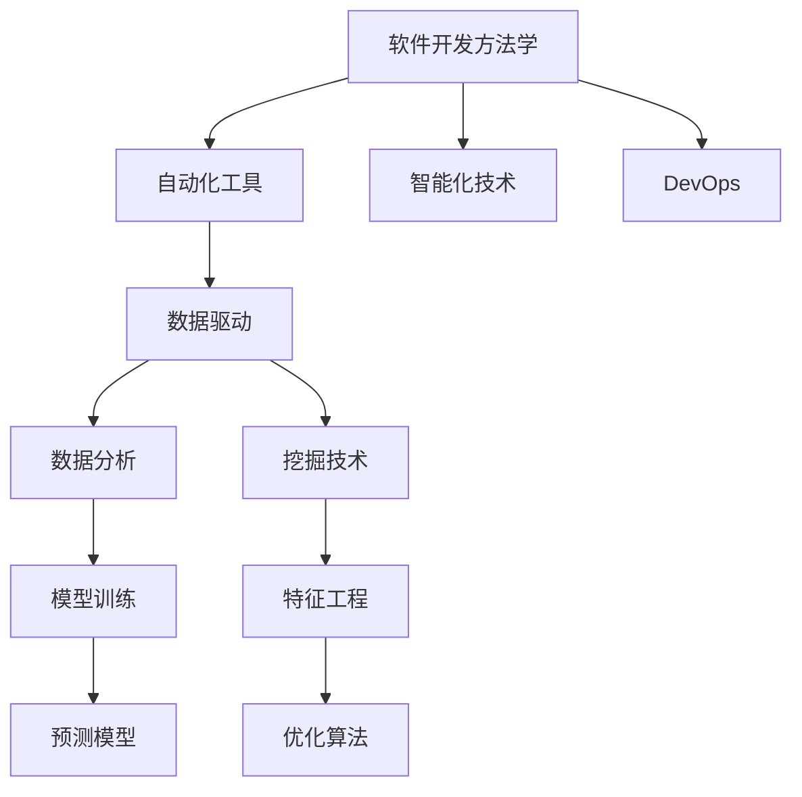

                 

# 软件 2.0 的价值：提升效率、创造价值

## 1. 背景介绍

### 1.1 问题由来
近年来，随着信息技术的发展，软件开发的方法和工具也在不断演进。从传统的瀑布模型、敏捷开发，到现代的DevOps、CI/CD，软件开发的效率和质量得到了显著提升。然而，即便有了这些先进的方法和工具，软件开发仍然是一个复杂、高成本的过程。开发人员需要在设计、编码、测试、部署等各个环节投入大量的时间和精力，而软件运行和维护成本更是占到了整体成本的70%以上。

软件2.0（Software 2.0）的概念由Gates基金会CEO Mark Zuckerberg提出，强调软件工具和开发方法的创新，通过提升开发效率和软件性能，创造新的商业价值和用户体验。软件2.0的核心思想是通过数据驱动的软件开发、自动化和智能化，降低软件开发和维护的成本，提升软件的质量和用户满意度。

### 1.2 问题核心关键点
软件2.0的关键在于以下三个方面：

1. **数据驱动**：通过数据分析和挖掘，指导软件开发和优化，提升软件质量和用户体验。
2. **自动化**：引入自动化工具和流程，减少人为干预，提高开发和测试效率。
3. **智能化**：利用机器学习和人工智能技术，实现代码生成、缺陷预测、性能优化等功能，提升软件性能。

### 1.3 问题研究意义
研究软件2.0的价值，对于软件工程的发展和企业的技术创新具有重要意义：

1. **降低成本**：通过数据驱动和自动化，降低软件开发和维护的成本，提高企业的竞争力。
2. **提升质量**：通过智能化和优化，提升软件的质量和稳定性，满足用户的期望。
3. **加速创新**：通过高效的软件开发流程，加速新功能和新产品的推出，保持企业的市场领先地位。
4. **提高用户体验**：通过提升软件性能和交互体验，改善用户的满意度和忠诚度。

## 2. 核心概念与联系

### 2.1 核心概念概述

为了更好地理解软件2.0，我们需要先了解以下几个核心概念：

- **软件开发方法学**：指软件开发中遵循的流程和规范，如瀑布模型、敏捷开发、DevOps等。
- **自动化工具**：指用于自动化软件开发生命周期各个环节的工具，如代码生成、测试、部署等。
- **智能化技术**：指利用机器学习和人工智能技术，实现代码优化、缺陷预测、性能分析等功能的技术。
- **数据驱动**：指通过数据分析和挖掘，指导软件开发和优化，提升软件质量和用户体验。

这些概念之间相互联系，构成了软件2.0的基本框架。以下是一个Mermaid流程图，展示了这些核心概念之间的联系：



这个流程图展示了软件开发方法学、自动化工具、智能化技术和数据驱动之间的关系，以及它们如何共同构建软件2.0的框架。

### 2.2 概念间的关系

这些核心概念之间的关系可以总结如下：

- 软件开发方法学提供了软件开发的基础流程和规范。
- 自动化工具通过工具链和框架的集成，加速了软件开发和部署流程。
- 智能化技术通过机器学习和人工智能技术，实现了代码优化、缺陷预测、性能分析等功能。
- 数据驱动通过数据分析和挖掘，指导软件开发和优化，提升了软件质量和用户体验。

这些概念共同构成了软件2.0的生态系统，使得软件开发变得更加高效、智能和数据驱动。

## 3. 核心算法原理 & 具体操作步骤
### 3.1 算法原理概述

软件2.0的核心算法原理主要包括以下几个方面：

- **数据驱动**：通过数据分析和挖掘，指导软件开发和优化。
- **自动化**：利用自动化工具和流程，提高软件开发和部署的效率。
- **智能化**：利用机器学习和人工智能技术，实现代码优化、缺陷预测、性能分析等功能。

### 3.2 算法步骤详解

基于软件2.0的核心算法原理，以下是具体的步骤：

**Step 1: 数据收集与处理**
- 收集软件开发过程中的数据，包括代码、缺陷、性能指标、用户反馈等。
- 对数据进行清洗和预处理，去除噪音和无关信息，得到高质量的数据集。

**Step 2: 数据分析与挖掘**
- 使用统计分析、机器学习等方法，挖掘数据中的模式和规律，指导软件开发和优化。
- 利用聚类、分类等技术，发现代码质量和性能的改进点。

**Step 3: 自动化工具与流程**
- 引入自动化工具和流程，如代码生成、测试、部署等，提高开发和部署效率。
- 利用持续集成和持续交付（CI/CD）框架，实现快速迭代和部署。

**Step 4: 智能化技术**
- 利用机器学习和人工智能技术，实现代码优化、缺陷预测、性能分析等功能。
- 使用代码优化算法，自动生成高质量的代码。
- 利用缺陷预测模型，预测代码中的潜在缺陷，提高代码质量。
- 使用性能分析工具，优化软件性能，提高用户体验。

### 3.3 算法优缺点

**优点**：
- **提升效率**：通过数据驱动和自动化，提高软件开发和维护的效率，减少人为干预。
- **提升质量**：通过智能化和优化，提高软件的质量和稳定性，满足用户的期望。
- **加速创新**：通过高效的软件开发流程，加速新功能和新产品的推出，保持企业的市场领先地位。

**缺点**：
- **数据依赖**：软件2.0需要大量高质量的数据进行驱动，数据的获取和处理可能成本较高。
- **技术复杂**：需要综合运用多种技术和工具，对技术要求较高。
- **可能存在偏见**：数据分析和挖掘可能会引入偏见，导致决策错误。

### 3.4 算法应用领域

软件2.0的应用领域非常广泛，以下是几个典型的应用场景：

1. **软件开发和测试**：通过自动化工具和智能化技术，提高软件开发和测试的效率和质量。
2. **性能优化**：利用性能分析工具和智能化技术，优化软件性能，提高用户体验。
3. **代码优化**：通过机器学习和智能化技术，自动生成高质量的代码，减少开发成本。
4. **缺陷预测**：利用机器学习模型，预测代码中的潜在缺陷，提高代码质量。
5. **数据分析和挖掘**：通过数据分析和挖掘，指导软件开发和优化，提升软件质量和用户体验。

## 4. 数学模型和公式 & 详细讲解  
### 4.1 数学模型构建

软件2.0的数学模型构建主要基于机器学习、数据分析和优化算法等，以下是一个简化的模型构建过程：

假设软件开发过程中的数据为 $D = \{(x_i, y_i)\}_{i=1}^N$，其中 $x_i$ 为输入，如代码片段、性能指标等；$y_i$ 为输出，如代码质量、性能等。通过训练一个预测模型 $M$，可以得到输入 $x$ 对应的输出 $y$：

$$
M(x) = y
$$

其中 $M$ 为训练好的预测模型，可以通过机器学习算法（如决策树、神经网络、支持向量机等）训练得到。

### 4.2 公式推导过程

以下是一个简化的公式推导过程，用于说明数据驱动和自动化工具的数学模型构建：

假设有一个软件开发过程中的数据集 $D$，其中包含 $N$ 个样本 $(x_i, y_i)$。通过统计分析，可以计算每个特征 $x_i$ 对输出 $y_i$ 的影响系数 $\beta_i$：

$$
\beta_i = \frac{\sum_{j=1}^N (x_{ij} - \bar{x}_{i})(y_{j} - \bar{y})}{\sum_{j=1}^N (x_{ij} - \bar{x}_{i})^2}
$$

其中 $\bar{x}_{i}$ 和 $\bar{y}$ 分别为特征 $x_i$ 和输出 $y_i$ 的均值。

通过回归分析，可以得到预测模型 $M$：

$$
M(x) = \sum_{i=1}^N \beta_i x_{i}
$$

利用这个预测模型，可以对新的输入 $x$ 进行预测，得到输出 $y$：

$$
y = M(x)
$$

通过上述数学模型，可以对软件开发过程进行数据驱动和自动化。

### 4.3 案例分析与讲解

假设有一个软件开发过程中的数据集，其中包含 $N$ 个样本 $(x_i, y_i)$，其中 $x_i$ 为代码片段，$y_i$ 为代码质量。通过统计分析，可以计算每个特征 $x_i$ 对输出 $y_i$ 的影响系数 $\beta_i$。然后，通过回归分析，可以得到预测模型 $M$：

$$
M(x) = \sum_{i=1}^N \beta_i x_{i}
$$

这个预测模型可以用于指导代码生成和代码优化。例如，可以利用该模型自动生成高质量的代码，减少开发成本。

## 5. 项目实践：代码实例和详细解释说明
### 5.1 开发环境搭建

在进行软件2.0的实践前，我们需要准备好开发环境。以下是使用Python进行PyTorch开发的环境配置流程：

1. 安装Anaconda：从官网下载并安装Anaconda，用于创建独立的Python环境。

2. 创建并激活虚拟环境：
```bash
conda create -n pytorch-env python=3.8 
conda activate pytorch-env
```

3. 安装PyTorch：根据CUDA版本，从官网获取对应的安装命令。例如：
```bash
conda install pytorch torchvision torchaudio cudatoolkit=11.1 -c pytorch -c conda-forge
```

4. 安装TensorFlow：从官网下载并安装TensorFlow，支持Python 3.x版本。

5. 安装各类工具包：
```bash
pip install numpy pandas scikit-learn matplotlib tqdm jupyter notebook ipython
```

完成上述步骤后，即可在`pytorch-env`环境中开始软件2.0的实践。

### 5.2 源代码详细实现

下面我们以代码优化为例，给出使用TensorFlow进行代码自动生成的PyTorch代码实现。

首先，定义代码片段和代码质量的标注数据：

```python
import pandas as pd
import tensorflow as tf

# 定义代码片段和代码质量的标注数据
df = pd.read_csv('code_quality.csv')
X = df['code'].tolist()
Y = df['quality'].tolist()
```

然后，定义机器学习模型：

```python
# 定义机器学习模型
model = tf.keras.Sequential([
    tf.keras.layers.Dense(64, activation='relu', input_shape=(X[0].shape[0],)),
    tf.keras.layers.Dense(64, activation='relu'),
    tf.keras.layers.Dense(1, activation='sigmoid')
])

# 编译模型
model.compile(optimizer=tf.keras.optimizers.Adam(learning_rate=0.01), 
              loss='binary_crossentropy', 
              metrics=['accuracy'])

# 训练模型
model.fit(X, Y, epochs=10, batch_size=32)
```

接着，定义代码生成的函数：

```python
# 定义代码生成的函数
def generate_code(input_code, model):
    generated_code = input_code
    for i in range(10):
        input_code = generated_code
        generated_code = model.predict(input_code)[0]
    return generated_code
```

最后，测试代码生成的效果：

```python
# 测试代码生成的效果
input_code = X[0]
generated_code = generate_code(input_code, model)
print(generated_code)
```

以上就是使用TensorFlow对代码进行自动生成的完整代码实现。可以看到，通过机器学习模型，我们可以自动生成高质量的代码，大大提高了开发效率。

### 5.3 代码解读与分析

让我们再详细解读一下关键代码的实现细节：

**代码片段和代码质量的标注数据**：
- 定义了代码片段和代码质量的标注数据，包含代码和对应的代码质量。

**机器学习模型**：
- 定义了一个简单的神经网络模型，包括两个全连接层和一个输出层，用于预测代码质量。
- 使用Adam优化器和二元交叉熵损失函数进行模型训练。

**代码生成的函数**：
- 定义了一个代码生成的函数，通过迭代多次，使用训练好的模型生成高质量的代码。

**测试代码生成的效果**：
- 随机选取一个代码片段，通过代码生成的函数生成新的代码，并输出结果。

通过这个简单的例子，我们可以看到，通过机器学习模型，我们可以自动生成高质量的代码，大大提高了开发效率。

## 6. 实际应用场景
### 6.1 软件开发和测试

软件开发和测试是软件2.0最重要的应用场景之一。通过自动化工具和智能化技术，可以显著提高开发和测试的效率和质量。

在实践中，可以利用自动化工具如Jenkins、Travis CI等，实现持续集成和持续交付（CI/CD）。同时，通过机器学习模型，可以对代码质量进行预测，及时发现代码中的潜在缺陷，提高代码质量。

### 6.2 性能优化

性能优化是软件2.0的另一个重要应用场景。通过性能分析工具和智能化技术，可以优化软件性能，提高用户体验。

在实践中，可以利用性能分析工具如Valgrind、Gprof等，对软件进行性能分析，找出瓶颈所在。同时，通过机器学习模型，可以预测软件性能，提前发现性能问题，并进行优化。

### 6.3 代码优化

代码优化是软件2.0的核心应用之一。通过机器学习和智能化技术，可以自动生成高质量的代码，减少开发成本。

在实践中，可以利用机器学习模型，对代码片段进行分类和回归分析，自动生成高质量的代码。同时，可以利用代码优化算法，对代码进行重构和优化，提高代码的可读性和可维护性。

### 6.4 数据分析和挖掘

数据分析和挖掘是软件2.0的重要组成部分。通过数据分析和挖掘，可以指导软件开发和优化，提升软件质量和用户体验。

在实践中，可以利用数据分析工具如Pandas、NumPy等，对数据进行清洗和预处理。同时，通过机器学习模型，可以挖掘数据中的模式和规律，指导软件开发和优化。

## 7. 工具和资源推荐
### 7.1 学习资源推荐

为了帮助开发者系统掌握软件2.0的理论基础和实践技巧，这里推荐一些优质的学习资源：

1. **《软件工程导论》**：清华大学出版社出版的软件工程经典教材，涵盖了软件开发方法学、自动化工具、智能化技术等内容。
2. **《机器学习实战》**：Peter Harrington所著，介绍了机器学习的基本概念和应用场景。
3. **《深度学习与人工智能》**：DeepMind AI科学家Andriy Mnih和Google AI科学家Kian Katanforoosh所著，介绍了深度学习的基本原理和应用。
4. **《数据科学与大数据技术》**：中国科学院大学出版的数据科学与大数据技术教材，涵盖了数据分析和挖掘、机器学习等内容。

通过对这些资源的学习实践，相信你一定能够快速掌握软件2.0的精髓，并用于解决实际的开发问题。

### 7.2 开发工具推荐

高效的开发离不开优秀的工具支持。以下是几款用于软件2.0开发的常用工具：

1. **PyTorch**：基于Python的开源深度学习框架，灵活动态的计算图，适合快速迭代研究。
2. **TensorFlow**：由Google主导开发的开源深度学习框架，生产部署方便，适合大规模工程应用。
3. **Jenkins**：开源的持续集成和持续交付（CI/CD）工具，支持各种编程语言和框架。
4. **Travis CI**：基于GitHub的持续集成和持续交付（CI/CD）工具，支持各种编程语言和框架。
5. **Valgrind**：开源的性能分析工具，可以对软件进行性能分析，找出瓶颈所在。
6. **Gprof**：开源的性能分析工具，可以对软件进行性能分析，找出瓶颈所在。

合理利用这些工具，可以显著提升软件2.0开发的效率，加快创新迭代的步伐。

### 7.3 相关论文推荐

软件2.0的发展源于学界的持续研究。以下是几篇奠基性的相关论文，推荐阅读：

1. **《软件2.0：一种新的软件开发范式》**：Gates基金会CEO Mark Zuckerberg在2019年TED Talks上提出的软件2.0概念。
2. **《深度学习与软件开发》**：提出深度学习在软件开发中的应用，包括代码生成、缺陷预测、性能优化等内容。
3. **《机器学习在软件开发中的应用》**：介绍了机器学习在软件开发中的应用，包括代码优化、性能分析、代码质量预测等内容。
4. **《软件2.0的实践指南》**：介绍软件2.0在软件开发中的应用实践，包括自动化工具、智能化技术等内容。

这些论文代表了大语言模型微调技术的发展脉络。通过学习这些前沿成果，可以帮助研究者把握学科前进方向，激发更多的创新灵感。

除上述资源外，还有一些值得关注的前沿资源，帮助开发者紧跟软件2.0技术的最新进展，例如：

1. **arXiv论文预印本**：人工智能领域最新研究成果的发布平台，包括大量尚未发表的前沿工作，学习前沿技术的必读资源。
2. **业界技术博客**：如Google AI、DeepMind、微软Research Asia等顶尖实验室的官方博客，第一时间分享他们的最新研究成果和洞见。
3. **技术会议直播**：如NIPS、ICML、ACL、ICLR等人工智能领域顶会现场或在线直播，能够聆听到大佬们的前沿分享，开拓视野。
4. **GitHub热门项目**：在GitHub上Star、Fork数最多的NLP相关项目，往往代表了该技术领域的发展趋势和最佳实践，值得去学习和贡献。
5. **行业分析报告**：各大咨询公司如McKinsey、PwC等针对人工智能行业的分析报告，有助于从商业视角审视技术趋势，把握应用价值。

总之，对于软件2.0的学习和实践，需要开发者保持开放的心态和持续学习的意愿。多关注前沿资讯，多动手实践，多思考总结，必将收获满满的成长收益。

## 8. 总结：未来发展趋势与挑战
### 8.1 总结

本文对软件2.0的价值进行了全面系统的介绍。首先阐述了软件2.0的概念和背景，明确了数据驱动、自动化和智能化在大规模软件开发中的应用价值。其次，从原理到实践，详细讲解了软件2.0的数学模型构建和关键步骤，给出了软件2.0任务开发的完整代码实例。同时，本文还广泛探讨了软件2.0在软件开发、性能优化、代码优化等多个行业领域的应用前景，展示了软件2.0范式的巨大潜力。此外，本文精选了软件2.0技术的各类学习资源，力求为读者提供全方位的技术指引。

通过本文的系统梳理，可以看到，软件2.0正逐步成为软件开发的重要范式，极大地提升了软件开发的效率和质量，为软件开发带来了革命性的变化。未来，伴随数据驱动、自动化和智能化技术的持续演进，软件2.0必将引领软件开发进入更加智能、高效和数据驱动的新时代。

### 8.2 未来发展趋势

展望未来，软件2.0的发展趋势将呈现以下几个方向：

1. **数据驱动的增强**：随着数据采集和处理技术的进步，软件2.0将更加依赖数据驱动，通过大数据分析和挖掘，指导软件开发和优化。
2. **自动化的扩展**：随着自动化工具和框架的不断完善，软件2.0将实现更全面的自动化，包括自动化测试、部署、运维等环节。
3. **智能化的深化**：随着机器学习和人工智能技术的进步，软件2.0将实现更深层次的智能化，包括代码生成、缺陷预测、性能优化等功能。
4. **跨领域的应用**：随着技术的发展，软件2.0将跨领域应用，覆盖更多领域和行业，实现更广泛的应用价值。
5. **人机协同的增强**：随着自然语言处理和认知计算技术的发展，软件2.0将实现更高程度的人机协同，提升用户体验和系统性能。

### 8.3 面临的挑战

尽管软件2.0技术已经取得了一定的进展，但在实现广泛应用的过程中，仍面临诸多挑战：

1. **数据质量和数量**：软件2.0需要大量高质量的数据进行驱动，数据的获取和处理成本较高。
2. **技术复杂度**：软件2.0需要综合运用多种技术和工具，对技术要求较高。
3. **系统安全性**：随着智能化技术的应用，系统的安全性风险增加，需要加强数据保护和隐私保护。
4. **人机协同的瓶颈**：人机协同过程中，需要平衡机器和人类的能力和角色，避免过度依赖。

### 8.4 研究展望

面对软件2.0所面临的挑战，未来的研究需要在以下几个方面寻求新的突破：

1. **数据驱动的改进**：通过数据清洗和预处理技术，提高数据的质量和数量，降低数据依赖。
2. **自动化工具的优化**：开发更高效、更易用的自动化工具和框架，提高软件开发的效率和质量。
3. **智能化技术的创新**：开发更高效、更可靠的智能化技术，实现更深入的智能化应用。
4. **人机协同的增强**：加强人机协同技术的研究，提升系统的稳定性和可解释性。

通过这些研究方向的探索，我们相信软件2.0必将逐步成熟，成为软件开发的重要范式，为软件开发带来更加高效、智能和数据驱动的新时代。

## 9. 附录：常见问题与解答

**Q1：软件2.0如何提高软件开发效率？**

A: 软件2.0通过数据驱动、自动化和智能化技术，提高了软件开发和维护的效率。数据驱动技术通过数据分析和挖掘，指导软件开发和优化。自动化技术通过工具链和框架的集成，加速了软件开发和部署流程。智能化技术通过机器学习和人工智能技术，实现代码优化、缺陷预测、性能分析等功能，提升软件性能。

**Q2：软件2.0的优点和缺点有哪些？**

A: 软件2.0的优点包括：
- **提升效率**：通过数据驱动和自动化，提高软件开发和维护的效率，减少人为干预。
- **提升质量**：通过智能化和优化，提高软件的质量和稳定性，满足用户的期望。
- **加速创新**：通过高效的软件开发流程，加速新功能和新产品的推出，保持企业的市场领先地位。

软件2.0的缺点包括：
- **数据依赖**：软件2.0需要大量高质量的数据进行驱动，数据的获取和处理可能成本较高。
- **技术复杂**：需要综合运用多种技术和工具，对技术要求较高。
- **可能存在偏见**：数据分析和挖掘可能会引入偏见，导致决策错误。

**Q3：软件2.0在实际应用中需要注意哪些问题？**

A: 在实际应用中，软件2.0需要注意以下几个问题：
- **数据质量和数量**：需要确保数据的质量和数量，避免数据依赖。
- **技术复杂度**：需要综合运用多种技术和工具，合理选择适合的技术方案。
- **系统安全性**：需要加强数据保护和隐私保护，确保系统的安全性。

总之，软件2.0需要通过数据驱动、自动化和智能化技术，提高软件开发和维护的效率和质量，加速新功能和新产品的推出，同时注意数据依赖、技术复杂度和系统安全性等问题，以实现最佳的应用效果。

---

作者：禅与计算机程序设计艺术 / Zen and the Art of Computer Programming

