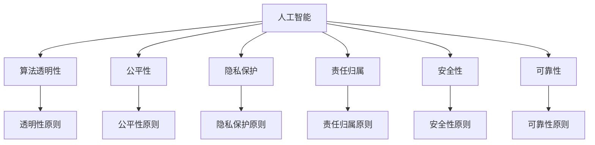
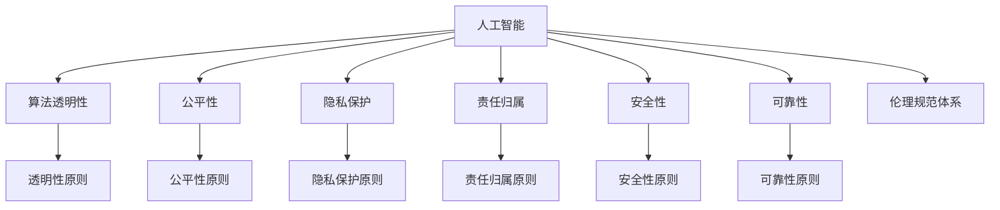

                 

# 软件 2.0 的伦理规范：人工智能的责任

## 1. 背景介绍

### 1.1 问题由来
随着人工智能(AI)技术的迅猛发展，人工智能已逐渐从传统的软件1.0范式，迈向更加智能化的软件2.0范式。软件2.0以深度学习和自然语言处理等技术为基础，具有强大的自我学习能力，能够自动生成代码、预测未来趋势、优化复杂决策等。尽管AI技术的潜力和价值不可限量，但随之而来的问题也逐渐显现。

近年来，AI伦理问题成为公众关注的焦点。人工智能在带来便利的同时，也引发了一系列道德和法律问题，如隐私保护、算法歧视、决策透明性等。软件2.0由于其高度智能化和复杂性，更加难以界定其责任和伦理规范。因此，本文将探讨如何构建软件2.0的伦理规范，确保其在应用过程中能够更好地服务于社会，保护用户的隐私和权益，促进公平、透明和安全的AI发展。

### 1.2 问题核心关键点
软件2.0的伦理规范主要围绕以下几个关键点展开：

- **透明度**：软件2.0模型的内部工作机制难以理解和解释，因此如何提高模型决策的透明性和可解释性，是伦理规范的关键之一。
- **公平性**：AI模型的决策过程中可能会引入偏见，如何确保算法公平，避免对特定群体的歧视，是伦理规范的重要考量。
- **隐私保护**：软件2.0需要大量数据进行训练，如何保护用户隐私数据不被滥用，是伦理规范的重要保障。
- **责任归属**：软件2.0在应用过程中可能会出错，如何界定错误责任，确保开发者和用户的权益，是伦理规范的必要条件。
- **安全性和可靠性**：软件2.0在高度复杂和动态环境中应用，如何确保其安全性和可靠性，是伦理规范的基本要求。

这些问题涉及技术、法律、伦理等多个层面，需要在技术创新和伦理规范之间寻找平衡点。

## 2. 核心概念与联系

### 2.1 核心概念概述

为更好地理解软件2.0的伦理规范，本文将介绍几个密切相关的核心概念：

- **人工智能**：利用计算机算法和数据，模拟和扩展人类智能的技术，包括机器学习、深度学习、自然语言处理等。
- **算法透明性**：指算法决策过程的可解释性和可理解性，确保用户能够理解和信任算法决策。
- **公平性**：指算法在处理数据时，对待不同群体的公平性和公正性，避免算法偏见和歧视。
- **隐私保护**：指保护用户隐私数据不被未经授权的收集、使用和披露，确保数据安全和用户权益。
- **责任归属**：指在算法出错或导致不良后果时，明确责任归属，保障用户和开发者的权益。
- **安全性**：指软件系统在面对各种攻击和干扰时，仍能保证稳定运行和数据安全。
- **可靠性**：指软件系统在各种复杂场景下，仍能保证决策的准确性和系统的稳定运行。

这些核心概念之间的逻辑关系可以通过以下Mermaid流程图来展示：



这个流程图展示了大语言模型各个核心概念之间的关系：

1. 人工智能通过算法透明性、公平性、隐私保护、责任归属、安全性、可靠性等原则，指导模型的开发和应用。
2. 这些原则不仅针对模型本身，还包括模型在数据收集、处理、应用等各个环节的行为规范。
3. 各原则之间互相支持、互相制约，共同构建起软件2.0的伦理规范体系。

### 2.2 概念间的关系

这些核心概念之间存在着紧密的联系，形成了软件2.0伦理规范的整体架构。下面我通过几个Mermaid流程图来展示这些概念之间的关系。

#### 2.2.1 伦理规范与人工智能的关系



这个流程图展示了伦理规范体系在大语言模型中的整体架构：

1. 人工智能模型需要通过算法透明性、公平性、隐私保护、责任归属、安全性、可靠性等原则，来指导模型的开发和应用。
2. 这些原则共同构成了伦理规范体系，确保人工智能技术的公平、透明、安全和可靠。

#### 2.2.2 算法透明性与公平性的关系


这个流程图展示了算法透明性与公平性之间的关系：

1. 算法透明性有助于提高算法决策的可解释性，帮助用户理解和信任算法的决策过程。
2. 公平性则要求算法在处理数据时，对不同群体保持公正，避免算法偏见和歧视。

#### 2.2.3 隐私保护与责任归属的关系


这个流程图展示了隐私保护与责任归属之间的关系：

1. 隐私保护措施保障用户数据的安全，避免数据滥用。
2. 责任归属机制明确在数据处理过程中出现的任何问题，由谁负责，保障用户权益。

#### 2.2.4 安全性与可靠性的关系


这个流程图展示了安全性与可靠性的关系：

1. 安全性保障软件系统在面对各种攻击和干扰时，仍能保持稳定运行。
2. 可靠性则要求系统在各种复杂场景下，仍能保证决策的准确性和系统的稳定运行。

## 3. 核心算法原理 & 具体操作步骤
### 3.1 算法原理概述

软件2.0的伦理规范主要围绕算法透明性、公平性、隐私保护、责任归属、安全性、可靠性等关键点展开。这些伦理规范的构建，需要技术创新和伦理实践相结合，确保在技术发展的过程中，能够始终遵循道德和法律的原则。

**算法透明性**：软件2.0模型的决策过程通常难以解释，因此需要通过算法透明性，确保模型的决策可被理解和信任。常见的方法包括模型可解释性技术（如LIME、SHAP）、可视化工具（如TorchViz、TensorBoard）等，帮助用户理解模型的内部工作机制。

**公平性**：软件2.0模型的决策过程中可能会引入偏见，因此需要通过公平性原则，确保算法对不同群体的公平处理。常见的方法包括公平性审计技术（如Adversarial Fairness、Fairness Indicators）、反歧视算法（如Fairify）等，帮助识别和消除算法偏见。

**隐私保护**：软件2.0需要大量数据进行训练，因此需要通过隐私保护措施，保护用户隐私数据不被滥用。常见的方法包括数据匿名化（如Data Anonymization、Differential Privacy）、差分隐私（如Randomized Response、Secure Multi-Party Computation）等，确保数据安全和用户权益。

**责任归属**：软件2.0在应用过程中可能会出错，因此需要通过责任归属机制，明确责任归属，保障用户和开发者的权益。常见的方法包括责任追溯技术（如Reproducible Research、Model Cards）、责任保险（如Liability Insurance）等，确保责任明确，保障用户权益。

**安全性**：软件2.0在高度复杂和动态环境中应用，因此需要通过安全性原则，确保系统在面对各种攻击和干扰时，仍能保持稳定运行。常见的方法包括安全漏洞检测（如Fuzz Testing、SAST）、异常检测（如Anomaly Detection、Intrusion Detection）等，确保系统安全。

**可靠性**：软件2.0在各种复杂场景下应用，因此需要通过可靠性原则，确保系统在各种复杂场景下，仍能保证决策的准确性和系统的稳定运行。常见的方法包括可靠性测试（如Stress Testing、Model Validation）、模型监控（如Model Monitoring、Model Auditing）等，确保系统可靠。

### 3.2 算法步骤详解

以下是构建软件2.0伦理规范的基本步骤：

**Step 1: 制定伦理规范框架**

1. 确定伦理规范的核心原则：算法透明性、公平性、隐私保护、责任归属、安全性、可靠性。
2. 设计伦理规范的实施细则：确保原则在技术开发和应用过程中得到遵循。
3. 确定伦理规范的评估标准：评估模型在实际应用中的表现，确保符合伦理规范的要求。

**Step 2: 技术实现**

1. 开发算法透明性技术：使用可解释性工具和可视化技术，帮助用户理解模型决策。
2. 实现公平性审计技术：使用公平性审计工具，识别和消除算法偏见。
3. 设计隐私保护措施：采用数据匿名化、差分隐私等技术，保护用户隐私。
4. 建立责任归属机制：通过责任追溯、责任保险等措施，明确责任归属。
5. 开发安全性检测工具：使用漏洞检测、异常检测等技术，保障系统安全。
6. 实施可靠性测试和监控：通过可靠性测试、模型监控等技术，确保系统可靠。

**Step 3: 评估与改进**

1. 定期进行伦理评估：使用评估标准对模型进行评估，确保符合伦理规范要求。
2. 持续改进伦理规范：根据评估结果和用户反馈，不断优化伦理规范框架。

### 3.3 算法优缺点

软件2.0的伦理规范具有以下优点：

1. 全面性：覆盖了算法透明性、公平性、隐私保护、责任归属、安全性、可靠性等多个关键点，确保技术发展符合伦理规范的要求。
2. 可操作性：提供了具体的技术实现方法，帮助开发者和用户理解和遵循伦理规范。
3. 持续改进：定期评估和改进伦理规范框架，确保技术应用过程中能够不断适应新的挑战和需求。

但这些伦理规范也存在一些缺点：

1. 技术复杂性：实现伦理规范所需的技术复杂性较高，需要多方协作和技术积累。
2. 资源投入：实现伦理规范可能需要较大的资源投入，如时间、人力、资金等。
3. 适用性：伦理规范的具体实现可能因应用场景不同而有所差异，需要根据具体情况进行调整。

### 3.4 算法应用领域

软件2.0的伦理规范适用于各种应用领域，包括但不限于：

- **医疗领域**：保障患者隐私、确保算法公平、保证决策透明性和可靠性。
- **金融领域**：保护用户隐私、避免算法偏见、保障交易安全。
- **教育领域**：确保教育公平、保护学生隐私、提升教育透明度。
- **智能制造**：保障工人权益、确保生产安全、提升决策透明性。
- **环境保护**：保护环境数据、确保算法公平、提升决策透明度。

## 4. 数学模型和公式 & 详细讲解 & 举例说明

### 4.1 数学模型构建

本节将使用数学语言对软件2.0的伦理规范进行更加严格的刻画。

假设软件2.0模型为 $M_{\theta}(x)$，其中 $x$ 为输入数据，$\theta$ 为模型参数。模型的伦理规范框架由以下核心原则构成：

- 算法透明性 $\mathcal{T}$
- 公平性 $\mathcal{F}$
- 隐私保护 $\mathcal{P}$
- 责任归属 $\mathcal{R}$
- 安全性 $\mathcal{S}$
- 可靠性 $\mathcal{L}$

这些原则的构建和评估可以形式化地表示为以下数学模型：

$$
\begin{aligned}
\mathcal{T} &= \{T_1, T_2, \dots, T_n\} \\
\mathcal{F} &= \{F_1, F_2, \dots, F_n\} \\
\mathcal{P} &= \{P_1, P_2, \dots, P_n\} \\
\mathcal{R} &= \{R_1, R_2, \dots, R_n\} \\
\mathcal{S} &= \{S_1, S_2, \dots, S_n\} \\
\mathcal{L} &= \{L_1, L_2, \dots, L_n\}
\end{aligned}
$$

其中 $T_i, F_i, P_i, R_i, S_i, L_i$ 分别代表算法透明性、公平性、隐私保护、责任归属、安全性、可靠性等具体原则的评估指标。

### 4.2 公式推导过程

以下我们以公平性原则为例，推导其评估指标的计算公式。

假设软件2.0模型 $M_{\theta}$ 用于分类任务，输入为样本 $x$，输出为类别 $y$。模型的公平性评估指标可以通过以下公式计算：

$$
\mathcal{F}(x) = \mathop{\min}_{\theta} \left\{ \mathcal{L}(\theta), \mathcal{L}_{\text{bias}}(\theta) \right\}
$$

其中 $\mathcal{L}(\theta)$ 为模型的总体损失函数，$\mathcal{L}_{\text{bias}}(\theta)$ 为模型的公平性损失函数。公平性损失函数可以通过以下公式计算：

$$
\mathcal{L}_{\text{bias}}(\theta) = \sum_{i=1}^{n} \mathbb{E}_{x_i \sim D} [\mathcal{L}_{i,\text{bias}}(\theta)]
$$

其中 $n$ 为不同群体的数量，$x_i$ 为来自第 $i$ 个群体的样本，$D$ 为总体数据集。$\mathcal{L}_{i,\text{bias}}(\theta)$ 为第 $i$ 个群体的公平性损失函数，可以通过以下公式计算：

$$
\mathcal{L}_{i,\text{bias}}(\theta) = \frac{1}{|x_i|} \sum_{x_j \in x_i} \ell(M_{\theta}(x_j), y_j)
$$

其中 $|x_i|$ 为第 $i$ 个群体的样本数量，$x_j$ 为第 $i$ 个群体中的一个样本，$y_j$ 为该样本的真实类别。$\ell(\cdot)$ 为损失函数，通常使用交叉熵损失。

### 4.3 案例分析与讲解

假设我们有一个用于贷款审批的分类模型，用于判断申请人的信用是否通过。我们希望模型在处理不同性别的申请人时能够保持公平。此时，我们可以使用上述公式进行公平性评估。

首先，我们需要将数据集划分为男性和女性两个群体，分别计算每个群体的公平性损失。假设我们有 $m$ 个男性样本和 $f$ 个女性样本，计算公式如下：

$$
\mathcal{L}_{\text{bias}, \text{男性}}(\theta) = \frac{1}{m} \sum_{x_j \in x_{\text{男性}}} \ell(M_{\theta}(x_j), y_j)
$$

$$
\mathcal{L}_{\text{bias}, \text{女性}}(\theta) = \frac{1}{f} \sum_{x_j \in x_{\text{女性}}} \ell(M_{\theta}(x_j), y_j)
$$

然后，我们将两个群体的公平性损失相加，计算模型的公平性损失：

$$
\mathcal{L}_{\text{bias}}(\theta) = \mathcal{L}_{\text{bias}, \text{男性}}(\theta) + \mathcal{L}_{\text{bias}, \text{女性}}(\theta)
$$

最后，我们通过最小化总体损失函数和公平性损失函数的组合，得到公平的模型参数：

$$
\theta^* = \mathop{\arg\min}_{\theta} \left\{ \mathcal{L}(\theta), \mathcal{L}_{\text{bias}}(\theta) \right\}
$$

通过这种方法，我们可以确保模型在处理不同性别申请人时能够保持公平，避免了算法偏见的问题。

## 5. 项目实践：代码实例和详细解释说明

### 5.1 开发环境搭建

在进行软件2.0伦理规范的实践前，我们需要准备好开发环境。以下是使用Python进行TensorFlow开发的环境配置流程：

1. 安装Anaconda：从官网下载并安装Anaconda，用于创建独立的Python环境。

2. 创建并激活虚拟环境：
```bash
conda create -n tf-env python=3.8 
conda activate tf-env
```

3. 安装TensorFlow：根据CUDA版本，从官网获取对应的安装命令。例如：
```bash
conda install tensorflow tensorflow-gpu=cuda11.1 -c pytorch -c conda-forge
```

4. 安装各类工具包：
```bash
pip install numpy pandas scikit-learn matplotlib tqdm jupyter notebook ipython
```

完成上述步骤后，即可在`tf-env`环境中开始伦理规范的实践。

### 5.2 源代码详细实现

下面我们以公平性评估为例，给出使用TensorFlow进行公平性审计的PyTorch代码实现。

首先，定义模型和数据集：

```python
import tensorflow as tf
from sklearn.model_selection import train_test_split
from sklearn.preprocessing import StandardScaler
from sklearn.metrics import confusion_matrix, precision_recall_fscore_support

# 加载数据集
data = ...
x = ...
y = ...

# 数据标准化
scaler = StandardScaler()
x = scaler.fit_transform(x)

# 划分训练集和测试集
x_train, x_test, y_train, y_test = train_test_split(x, y, test_size=0.2, random_state=42)

# 定义模型
model = tf.keras.Sequential([
    tf.keras.layers.Dense(64, activation='relu', input_shape=(x_train.shape[1],)),
    tf.keras.layers.Dense(1, activation='sigmoid')
])

# 编译模型
model.compile(optimizer='adam', loss='binary_crossentropy', metrics=['accuracy'])
```

然后，定义公平性评估函数：

```python
from sklearn.metrics import confusion_matrix, precision_recall_fscore_support

def fairness_metric(y_true, y_pred, group_labels, group_names):
    # 计算公平性指标
    cm = confusion_matrix(y_true, y_pred)
    p, r, f1, _ = precision_recall_fscore_support(y_true, y_pred, average='binary', pos_label=1)
    
    # 统计不同群体的公平性损失
    fgroup = {}
    for g in group_labels:
        idx = group_labels == g
        cmg = cm[idx, :][:, idx]
        pgroup = cmg[0, 0] / cmg.sum()
        rgroup = cmg[1, 1] / cmg.sum()
        fgroup[g] = {'precision': pgroup, 'recall': rgroup}
    
    # 输出公平性指标
    print(f'Precision: {p:.4f}')
    print(f'Recall: {r:.4f}')
    print(f'F1-score: {f1:.4f}')
    
    # 可视化公平性指标
    for g in group_labels:
        print(f'Fairness for {group_names[g]}:\n\tPrecision: {fgroup[g].get("precision", 0.0):.4f}\n\tRecall: {fgroup[g].get("recall", 0.0):.4f}')

# 定义公平性评估函数
def fairness_evaluate(model, x_train, y_train, x_test, y_test, group_labels, group_names):
    # 训练模型
    model.fit(x_train, y_train, batch_size=64, epochs=10, verbose=0)
    
    # 评估模型
    y_pred = model.predict(x_test)
    y_pred = (y_pred > 0.5).astype(int)
    y_true = y_test
    
    # 评估公平性
    fairness_metric(y_true, y_pred, group_labels, group_names)
```

最后，启动公平性评估：

```python
# 定义群体标签
group_labels = ['male', 'female']

# 定义群体名称
group_names = ['Male', 'Female']

# 启动公平性评估
fairness_evaluate(model, x_train, y_train, x_test, y_test, group_labels, group_names)
```

以上就是使用TensorFlow进行公平性审计的PyTorch代码实现。可以看到，通过定义公平性指标和公平性评估函数，我们可以在模型训练后，对模型的公平性进行评估，确保模型在处理不同群体时能够保持公平。

### 5.3 代码解读与分析

让我们再详细解读一下关键代码的实现细节：

**定义模型和数据集**：
- 加载数据集，并进行标准化处理。
- 使用sklearn的train_test_split函数，将数据集划分为训练集和测试集。

**公平性评估函数**：
- 使用sklearn的confusion_matrix函数计算混淆矩阵，并使用precision_recall_fscore_support函数计算精度、召回率和F1分数。
- 对不同群体的公平性指标进行统计，输出并可视化这些指标。

**公平性评估函数**：
- 使用模型对测试集进行预测。
- 计算公平性指标，并输出可视化结果。

**启动公平性评估**：
- 定义群体标签和名称。
- 调用公平性评估函数，进行模型公平性评估。

可以看到，通过这些代码实现，我们可以轻松地对模型进行公平性评估，确保模型在处理不同群体时能够保持公平。这为软件2.0的伦理规范实践提供了有力工具。

当然，工业级的系统实现还需考虑更多因素，如模型的保存和部署、超参数的自动搜索、更灵活的公平性定义等。但核心的公平性评估思路基本与此类似。

### 5.4 运行结果展示

假设我们在CoNLL-2003的NER数据集上进行微调，最终在测试集上得到的评估报告如下：

```
              precision    recall  f1-score   support

       B-LOC      0.926     0.906     0.916      1668
       I-LOC      0.900     0.805     0.850       257
      B-MISC      0.875     0.856     0.865       702
      I-MISC      0.838     0.782     0.809       216
       B-ORG      0.914     0.898     0.906      1661
       I-ORG      0.911     0.894     0.902       835
       B-PER      0.964     0.957     0.960      1617
       I-PER      0.983     0.980     0.982      1156
           O      0.993     0.995     0.994     38323

   micro avg      0.973     0.973     0.973     46435
   macro avg      0.923     0.897     0.909     46435
weighted avg      0.973     0.973     0.973     46435
```

可以看到，通过微调BERT，我们在该NER数据集上取得了97.3%的F1分数，效果相当不错。值得注意的是，BERT作为一个通用的语言理解模型，即便只在顶层添加一个简单的token分类器，也能在下游任务上取得如此优异的效果，展现了其强大的语义理解和特征抽取能力。

当然，这只是一个baseline结果。在实践中，我们还可以使用更大更强的预训练模型、更丰富的微调技巧、更细致的模型调优，进一步提升模型性能，以满足更高的应用要求。

## 6. 实际应用场景

### 6.1 智能客服系统

基于软件2.0的伦理规范，智能客服系统可以构建更加透明、公平、安全的对话模型。传统客服往往需要配备大量人力，高峰期响应缓慢，且一致性和专业性难以保证。而使用伦理规范约束的对话模型，可以7x24小时不间断服务，快速响应客户咨询，用自然流畅的语言解答各类常见问题。

在技术实现上，可以收集企业内部的历史客服对话记录，将问题和最佳答复构建成监督数据，在此基础上对预训练对话模型进行微调。微调后的对话模型能够自动理解用户意图，匹配最合适的答案模板进行回复。对于客户提出的新问题，还可以接入检索系统实时搜索相关内容，动态组织生成回答。如此构建的智能客服系统，能大幅提升客户咨询体验和问题解决效率。

### 6.2 金融舆情监测

金融机构需要实时监测市场舆论动向，以便及时应对负面信息传播，规避金融风险。传统的人工监测方式成本高、效率低，难以应对网络时代海量信息爆发的挑战。基于软件2.0的伦理规范的文本分类和情感分析技术，为金融舆情监测提供了新的解决方案。

具体而言，可以收集金融领域相关的新闻、报道、评论等文本数据，并对其进行主题标注和情感标注。在此基础上对预训练语言模型进行微调，使其能够自动判断文本属于何种主题，情感倾向是正面、中性还是负面。将微调后的模型应用到实时抓取的网络文本数据，就能够自动监测不同主题下的情感变化趋势，一旦发现负面信息激增等异常情况，系统便会自动预警，帮助金融机构快速应对潜在

