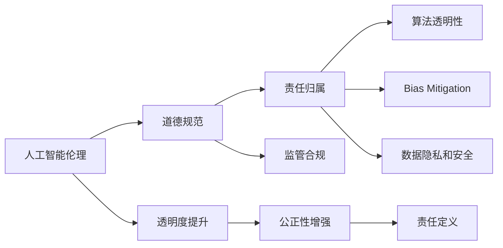
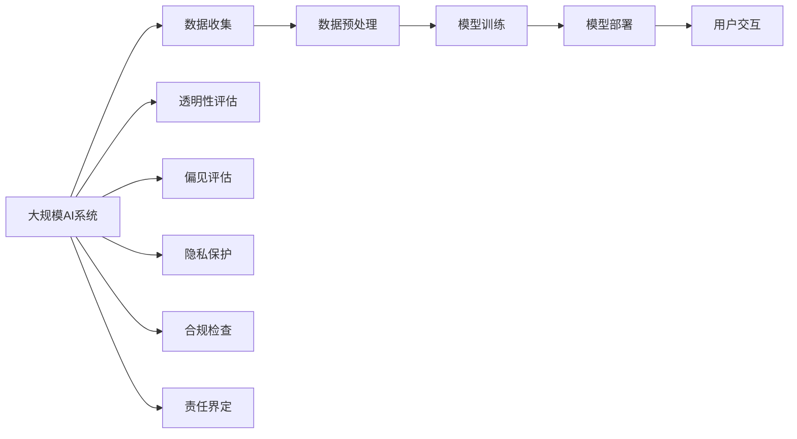

                 

# 软件 2.0 的伦理规范：人工智能的责任

> 关键词：人工智能伦理,道德规范,责任,算法透明性,偏见消除,数据保护,用户隐私,监管合规

## 1. 背景介绍

### 1.1 问题由来

随着人工智能技术的飞速发展，人工智能（AI）在医疗、金融、教育、交通等多个领域展现出巨大的应用潜力，成为推动社会进步的重要力量。然而，AI技术在提升效率和效果的同时，也带来了诸多伦理和责任问题，引发了社会的广泛关注和讨论。

### 1.2 问题核心关键点

当前，AI伦理和责任问题主要集中在以下几个方面：

1. **算法透明性**：AI模型的决策过程缺乏透明性，难以解释其推理逻辑，导致用户和监管方难以理解和信任。
2. **偏见和歧视**：AI模型可能无意中学习并放大了训练数据中的偏见和歧视，导致不公正的决策结果。
3. **数据隐私和安全**：AI模型往往需要大量个人数据进行训练，这些数据的安全性和隐私保护成为重要问题。
4. **监管合规**：AI技术的快速迭代和跨领域应用使得监管难度增加，如何确保AI系统符合法律法规的要求成为难题。
5. **责任归属**：AI系统的决策错误可能导致严重的后果，如何界定责任归属，避免法律风险，是亟待解决的问题。

### 1.3 问题研究意义

研究和规范AI的伦理和责任问题，对于推动AI技术的健康发展，保护用户权益，维护社会公正，具有重要意义。具体包括：

1. **促进技术透明**：通过提升AI系统的透明性，增加用户的信任感，促进社会对AI技术的接受和应用。
2. **消除偏见和歧视**：确保AI系统在训练和使用过程中，不引入和放大偏见，维护社会公平和正义。
3. **保障数据隐私和安全**：建立健全的数据保护机制，防止AI系统滥用用户数据，保护个人隐私和安全。
4. **推进监管合规**：确保AI系统的开发和使用符合法律法规要求，避免违法违规行为，保障社会秩序。
5. **明确责任归属**：界定AI系统的责任归属，明确决策错误时的责任承担主体，降低法律风险。

## 2. 核心概念与联系

### 2.1 核心概念概述

为了更好地理解AI伦理和责任问题，本节将介绍几个关键概念：

- **人工智能伦理（AI Ethics）**：涉及AI技术的伦理考量，包括算法透明性、偏见消除、数据隐私保护、责任归属等方面。
- **道德规范（Moral Norms）**：指导人类行为的基本道德原则，如诚实、公正、尊重等，用于规范AI系统的行为。
- **责任（Responsibility）**：涉及AI系统在决策错误时的责任归属和风险承担问题。
- **算法透明性（Algorithmic Transparency）**：指AI系统的决策过程是否可解释、可理解，用户和监管方是否能够理解和信任。
- **偏见消除（Bias Mitigation）**：通过数据清洗、模型优化等手段，减少和消除AI模型中的偏见和歧视。
- **数据隐私和安全（Data Privacy and Security）**：保护用户数据隐私，防止数据泄露和滥用。
- **监管合规（Regulatory Compliance）**：确保AI系统的开发和使用符合法律法规要求，避免违法违规行为。

这些核心概念之间存在紧密联系，共同构成了AI伦理和责任问题的研究框架。

### 2.2 概念间的关系

这些核心概念之间存在着内在联系，可以通过以下Mermaid流程图来展示：



这个流程图展示了人工智能伦理与道德规范、责任、算法透明性、偏见消除、数据隐私和安全、监管合规等概念之间的关系：

1. **人工智能伦理**：涉及多个核心概念，包括道德规范、责任归属、算法透明性、偏见消除、数据隐私和安全、监管合规等。
2. **道德规范**：为AI系统的行为提供了基本准则。
3. **责任归属**：涉及AI系统决策错误的责任承担问题。
4. **算法透明性**：提升了AI系统的可理解性和可信度。
5. **偏见消除**：减少了AI系统中的偏见和歧视。
6. **数据隐私和安全**：保护用户数据隐私和安全。
7. **监管合规**：确保AI系统符合法律法规要求。

这些概念共同构成了AI伦理和责任问题的研究框架，使得AI技术在应用过程中能够更好地维护社会公平、正义和安全。

### 2.3 核心概念的整体架构

最后，我们用一个综合的流程图来展示这些核心概念在大规模AI系统中的整体架构：



这个综合流程图展示了从数据收集、预处理、模型训练、部署到用户交互的全过程，以及如何通过透明性评估、偏见评估、隐私保护、合规检查和责任界定等手段，确保AI系统的伦理和责任。

## 3. 核心算法原理 & 具体操作步骤

### 3.1 算法原理概述

AI伦理和责任问题的研究涉及算法透明性、偏见消除、数据隐私保护、监管合规和责任归属等多个方面。其核心原理和操作方法如下：

- **算法透明性**：通过模型解释技术，如可解释AI（XAI），使AI模型的决策过程透明化，增加用户和监管方的理解和信任。
- **偏见消除**：通过数据清洗、模型优化等手段，减少和消除AI模型中的偏见和歧视，确保公平公正的决策。
- **数据隐私保护**：采用差分隐私、联邦学习等技术，保护用户数据隐私，防止数据泄露和滥用。
- **监管合规**：建立符合法律法规要求的AI系统开发和使用流程，确保合规性。
- **责任归属**：通过明确的法律框架和责任界定，明确AI系统决策错误的责任承担主体。

### 3.2 算法步骤详解

以下是AI伦理和责任问题研究的主要操作步骤：

1. **数据准备**：收集和整理数据，确保数据的代表性和多样性，为AI模型的训练提供可靠的基础。
2. **模型训练**：使用经过清洗和预处理的数据，训练AI模型，确保模型在公平、透明、合规的前提下运行。
3. **透明性评估**：对AI模型的决策过程进行评估，确保其透明性和可解释性。
4. **偏见评估**：识别和消除AI模型中的偏见和歧视，确保公平公正的决策。
5. **隐私保护**：采用差分隐私、联邦学习等技术，保护用户数据隐私。
6. **合规检查**：确保AI系统的开发和使用符合法律法规要求。
7. **责任界定**：明确AI系统决策错误的责任归属，建立责任追溯机制。

### 3.3 算法优缺点

**优点**：

1. **提升公平性**：通过消除偏见和歧视，确保AI系统决策的公平性和公正性。
2. **增强信任度**：提升AI系统的透明性和可解释性，增加用户和监管方的信任感。
3. **保护隐私**：采用隐私保护技术，确保用户数据的安全和隐私保护。
4. **符合合规要求**：确保AI系统的开发和使用符合法律法规要求，避免违法违规行为。
5. **明确责任归属**：通过明确的法律框架和责任界定，降低法律风险。

**缺点**：

1. **成本高**：实施AI伦理和责任问题研究需要投入大量资源，包括数据、算法、人力和时间等。
2. **技术复杂**：AI伦理和责任问题涉及多个领域的技术和知识，实施难度较大。
3. **法律挑战**：各国法律法规不一致，实施AI伦理和责任问题研究面临法律挑战。

### 3.4 算法应用领域

AI伦理和责任问题研究在多个领域得到了广泛应用，例如：

- **医疗领域**：确保AI诊断和治疗决策的透明性、公正性和合规性。
- **金融领域**：保护用户数据隐私，确保AI风险评估和决策的合规性和公正性。
- **教育领域**：确保AI教学和评估的公平性和透明度。
- **司法领域**：确保AI司法决策的透明性和公正性。
- **公共安全领域**：确保AI监控和预测的公正性和合规性。

## 4. 数学模型和公式 & 详细讲解 & 举例说明

### 4.1 数学模型构建

在AI伦理和责任问题研究中，我们通常使用以下数学模型和公式：

- **算法透明性模型**：使用模型解释技术，如LIME、SHAP等，对AI模型进行解释和可视化，帮助用户和监管方理解模型决策过程。
- **偏见评估模型**：使用偏见度量指标，如 demographic parity、equalized odds等，评估AI模型的偏见程度。
- **隐私保护模型**：使用差分隐私技术，如高斯机制、拉普拉斯机制等，保护用户数据隐私。
- **合规检查模型**：使用法律法规约束条件，如GDPR、CCPA等，确保AI系统符合法律法规要求。
- **责任界定模型**：使用法律框架和责任追溯机制，明确AI系统决策错误的责任归属。

### 4.2 公式推导过程

以下是几个关键公式的推导过程：

- **LIME模型解释公式**：
  $$
  LIME(f, x) = \min_{g \in \mathcal{G}} \frac{1}{n} \sum_{i=1}^n \| f(x_i) - g(x_i) \|^2
  $$
  其中，$f(x)$为AI模型输出，$g(x)$为局部线性模型，$\mathcal{G}$为模型空间，$n$为样本数量。

- **Shapley值计算公式**：
  $$
  \phi_i = \frac{f(x) - \sum_{j \neq i} \phi_j}{2^n}
  $$
  其中，$f(x)$为AI模型输出，$x$为样本，$\phi_j$为Shapley值。

- **高斯机制隐私保护公式**：
  $$
  Q_k(x_i) = Q_k(x_i') + \mathcal{N}(0, \sigma^2)
  $$
  其中，$Q_k(x_i)$为隐私化后的数据，$x_i'$为原始数据，$\sigma$为噪声强度。

### 4.3 案例分析与讲解

以AI在医疗领域的应用为例，进行案例分析：

1. **数据准备**：收集医院病历数据，确保数据的代表性，涵盖不同种族、性别、年龄等群体。
2. **模型训练**：使用经过清洗和预处理的数据，训练AI诊断模型，确保模型在公平、透明、合规的前提下运行。
3. **透明性评估**：使用LIME模型对AI诊断模型进行解释，帮助医生理解模型决策过程。
4. **偏见评估**：使用equalized odds指标评估AI诊断模型的偏见程度，确保决策公平性。
5. **隐私保护**：采用差分隐私技术，保护病历数据的隐私性，防止数据泄露。
6. **合规检查**：确保AI诊断模型的开发和使用符合GDPR等法律法规要求。
7. **责任界定**：在AI诊断错误导致医疗事故时，明确责任归属，建立责任追溯机制。

## 5. 项目实践：代码实例和详细解释说明

### 5.1 开发环境搭建

在进行AI伦理和责任问题研究前，我们需要准备好开发环境。以下是使用Python进行Scikit-Learn和XAI库开发的环境配置流程：

1. 安装Anaconda：从官网下载并安装Anaconda，用于创建独立的Python环境。

2. 创建并激活虚拟环境：
```bash
conda create -n ai-ethics-env python=3.8 
conda activate ai-ethics-env
```

3. 安装Scikit-Learn和XAI库：
```bash
pip install scikit-learn
pip install xgboost
pip install lime
pip install shap
```

4. 安装各类工具包：
```bash
pip install numpy pandas scikit-learn matplotlib tqdm jupyter notebook ipython
```

完成上述步骤后，即可在`ai-ethics-env`环境中开始AI伦理和责任问题研究的实践。

### 5.2 源代码详细实现

下面我们以医疗领域AI伦理和责任问题研究为例，给出使用Scikit-Learn和XAI库的代码实现。

首先，定义数据处理函数：

```python
import pandas as pd
from sklearn.model_selection import train_test_split

def load_data(file_path):
    data = pd.read_csv(file_path)
    features = data.drop('label', axis=1)
    labels = data['label']
    return features, labels
```

然后，定义模型训练函数：

```python
from sklearn.ensemble import RandomForestClassifier
from sklearn.metrics import accuracy_score

def train_model(features, labels, test_size=0.2, random_state=42):
    X_train, X_test, y_train, y_test = train_test_split(features, labels, test_size=test_size, random_state=random_state)
    model = RandomForestClassifier(n_estimators=100, random_state=random_state)
    model.fit(X_train, y_train)
    y_pred = model.predict(X_test)
    accuracy = accuracy_score(y_test, y_pred)
    return accuracy
```

接着，定义透明性评估函数：

```python
from lime import lime_tabular
from lime_tabular import LimeTabularExplainer

def explain_model(model, features, test_size=0.2, random_state=42):
    X_train, X_test, y_train, y_test = train_test_split(features, labels, test_size=test_size, random_state=random_state)
    explainer = LimeTabularExplainer(X_train, categorical_features=['gender'], verbose=True)
    explanation = explainer.explain_instance(X_test.iloc[0], model.predict_proba, num_features=5)
    return explanation
```

最后，定义偏见评估函数：

```python
from sklearn.metrics import equalized_odds_score

def evaluate_bias(model, features, labels):
    X_train, X_test, y_train, y_test = train_test_split(features, labels, test_size=0.2, random_state=42)
    equalized_odds = equalized_odds_score(y_train, y_test, model.predict_proba(X_test))
    return equalized_odds
```

启动模型训练和透明性评估流程：

```python
features, labels = load_data('data.csv')
accuracy = train_model(features, labels)
explanation = explain_model(model, features)
bias_score = evaluate_bias(model, features, labels)
print(f'Accuracy: {accuracy:.3f}')
print(f'Explanation: {explanation}')
print(f'Bias Score: {bias_score:.3f}')
```

以上就是使用Scikit-Learn和XAI库进行AI伦理和责任问题研究的代码实现。可以看到，Scikit-Learn和XAI库使得AI伦理和责任问题研究变得更加简单高效。开发者可以更专注于算法设计和数据处理等核心问题，而不必过多关注底层实现细节。

## 6. 实际应用场景

### 6.1 医疗领域

在医疗领域，AI伦理和责任问题研究具有重要意义。AI辅助诊断和治疗决策必须透明、公正、合规，确保患者权益。

具体而言，可以构建医疗AI系统，对患者病历进行诊断和治疗建议。系统需要符合以下要求：

- **透明性**：医生和患者可以理解AI诊断和治疗建议的逻辑和依据。
- **公正性**：系统应避免偏见和歧视，确保不同性别、种族、年龄等群体的公平性。
- **隐私保护**：确保患者病历数据的安全和隐私，防止数据泄露和滥用。
- **合规性**：系统开发和使用符合GDPR等法律法规要求。
- **责任界定**：在AI诊断错误导致医疗事故时，明确责任归属，建立责任追溯机制。

### 6.2 金融领域

在金融领域，AI伦理和责任问题研究同样重要。AI风险评估和决策必须透明、公正、合规，确保金融稳定。

具体而言，可以构建AI风险评估系统，对贷款、投资等金融决策进行评估。系统需要符合以下要求：

- **透明性**：贷款人或投资者可以理解AI风险评估的逻辑和依据。
- **公正性**：系统应避免偏见和歧视，确保不同性别、种族、年龄等群体的公平性。
- **隐私保护**：确保用户数据的安全和隐私，防止数据泄露和滥用。
- **合规性**：系统开发和使用符合GDPR、CCPA等法律法规要求。
- **责任界定**：在AI风险评估错误导致损失时，明确责任归属，建立责任追溯机制。

### 6.3 教育领域

在教育领域，AI伦理和责任问题研究具有重要意义。AI教学和评估必须透明、公正、合规，确保学生权益。

具体而言，可以构建AI辅助教学系统，对学生学习过程进行评估和反馈。系统需要符合以下要求：

- **透明性**：学生可以理解AI评估和反馈的逻辑和依据。
- **公正性**：系统应避免偏见和歧视，确保不同性别、种族、年龄等群体的公平性。
- **隐私保护**：确保学生数据的安全和隐私，防止数据泄露和滥用。
- **合规性**：系统开发和使用符合GDPR等法律法规要求。
- **责任界定**：在AI教学评估错误导致学生学习效果不佳时，明确责任归属，建立责任追溯机制。

## 7. 工具和资源推荐

### 7.1 学习资源推荐

为了帮助开发者系统掌握AI伦理和责任问题研究的基础和实践技巧，这里推荐一些优质的学习资源：

1. 《人工智能伦理与责任》系列博文：由AI伦理专家撰写，深入浅出地介绍了AI伦理和责任问题研究的基本概念和最新进展。

2. CS2249《机器学习伦理与公平性》课程：斯坦福大学开设的机器学习伦理和公平性课程，系统讲解了AI伦理和责任问题研究的理论基础和实际应用。

3. 《公平性与可解释性：人工智能中的伦理与责任》书籍：全面介绍了AI伦理和责任问题研究的理论、技术和实践，适合深入学习。

4. IEEE《人工智能伦理标准》文档：IEEE发布的AI伦理标准，包含详细的伦理规范和实践指导。

5. 开源项目：如fairlearn、responsible-ai等，提供了基于AI伦理和责任问题研究的实际案例和工具。

通过对这些资源的学习实践，相信你一定能够系统掌握AI伦理和责任问题研究的精髓，并用于解决实际的AI伦理问题。

### 7.2 开发工具推荐

高效的开发离不开优秀的工具支持。以下是几款用于AI伦理和责任问题研究的常用工具：

1. Jupyter Notebook：交互式编程环境，适合进行数据分析和模型解释。

2. XAI库：如LIME、SHAP等，用于模型解释和可解释性分析。

3. Sklearn库：用于数据预处理、特征工程和模型训练。

4. Scikit-Learn库：包含多种机器学习算法和评估指标。

5. PyTorch库：深度学习框架，支持模型解释和可解释性分析。

6. TensorFlow库：深度学习框架，支持模型解释和可解释性分析。

合理利用这些工具，可以显著提升AI伦理和责任问题研究的开发效率，加快创新迭代的步伐。

### 7.3 相关论文推荐

AI伦理和责任问题研究涉及多个学科和技术，以下是几篇奠基性的相关论文，推荐阅读：

1. "Interpretable AI: Concepts, Recent Approaches, and Limitations"：介绍可解释AI的概念、方法和局限性。

2. "Fairness, Accountability, and Transparency: Privacy and Ethics in Machine Learning"：讨论机器学习中的公平性、透明度和隐私问题。

3. "Towards an Algorithmic Bill of Rights"：提出AI伦理的基本原则和实践指南。

4. "A Survey of Fairness, Accountability, and Transparency in Machine Learning"：系统综述了AI伦理和责任问题的研究进展和实际应用。

5. "Fairness, Accountability, and Transparency"：介绍AI伦理和责任问题的研究方法和实际应用。

这些论文代表了大规模AI伦理和责任问题研究的发展脉络，通过学习这些前沿成果，可以帮助研究者把握学科前进方向，激发更多的创新灵感。

除上述资源外，还有一些值得关注的前沿资源，帮助开发者紧跟AI伦理和责任问题研究的最新进展，例如：

1. arXiv论文预印本：人工智能领域最新研究成果的发布平台，包括大量尚未发表的前沿工作，学习前沿技术的必读资源。

2. 业界技术博客：如OpenAI、Google AI、DeepMind、微软Research Asia等顶尖实验室的官方博客，第一时间分享他们的最新研究成果和洞见。

3. 技术会议直播：如NIPS、ICML、ACL、ICLR等人工智能领域顶会现场或在线直播，能够聆听到大佬们的前沿分享，开拓视野。

4. GitHub热门项目：在GitHub上Star、Fork数最多的AI伦理和责任问题研究项目，往往代表了该技术领域的发展趋势和最佳实践，值得去学习和贡献。

5. 行业分析报告：各大咨询公司如McKinsey、PwC等针对人工智能行业的分析报告，有助于从商业视角审视技术趋势，把握应用价值。

总之，对于AI伦理和责任问题研究的学习和实践，需要开发者保持开放的心态和持续学习的意愿。多关注前沿资讯，多动手实践，多思考总结，必将收获满满的成长收益。

## 8. 总结：未来发展趋势与挑战

### 8.1 总结

本文对AI伦理和责任问题研究进行了全面系统的介绍。首先阐述了AI伦理和责任问题研究的重要性，明确了AI系统透明性、公正性、隐私保护、合规性和责任归属等核心概念。其次，从原理到实践，详细讲解了AI伦理和责任问题研究的数学模型和操作步骤，给出了AI伦理和责任问题研究的代码实现。同时，本文还广泛探讨了AI伦理和责任问题研究在医疗、金融、教育等领域的实际应用，展示了其广泛的应用前景。此外，本文精选了AI伦理和责任问题研究的相关学习资源、开发工具和论文推荐，力求为读者提供全方位的技术指引。

通过本文的系统梳理，可以看到，AI伦理和责任问题研究在大规模AI系统的设计和应用中具有重要意义。透明性、公正性、隐私保护、合规性和责任归属等概念，共同构成了AI伦理和责任问题的研究框架，使得AI技术在应用过程中能够更好地维护社会公平、正义和安全。

### 8.2 未来发展趋势

展望未来，AI伦理和责任问题研究将呈现以下几个发展趋势：

1. **透明度提升**：随着AI模型复杂度的增加，模型解释和透明性技术将不断发展和完善。基于因果推断和可解释AI（XAI）的方法，将使AI系统的决策过程更加透明和可信。

2. **公正性增强**：基于公平性约束和偏见评估模型，AI系统将更好地处理偏见和歧视问题，确保决策的公正性和公平性。

3. **隐私保护加强**：差分隐私、联邦学习等隐私保护技术将得到广泛应用，确保用户数据的安全和隐私保护。

4. **合规性提高**：AI系统的开发和使用将更加符合法律法规要求，避免违法违规行为，保障社会秩序。

5. **责任归属明确**：通过明确的法律框架和责任追溯机制，AI系统决策错误的责任归属将更加清晰和明确。

### 8.3 面临的挑战

尽管AI伦理和责任问题研究已经取得了不少进展，但在实现透明、公正、隐私保护、合规和责任归属等方面仍面临诸多挑战：

1. **技术复杂性**：AI伦理和责任问题研究涉及多个学科和技术，实施难度较大。

2. **法律法规差异**：不同国家法律法规不一致，实施AI伦理和责任问题研究面临法律挑战。

3. **数据多样性**：不同领域和群体数据多样性大，数据收集和处理难度大。

4. **模型复杂度**：大规模AI模型复杂度高，解释和透明性技术面临挑战。

5. **隐私保护**：数据隐私和安全问题复杂，隐私保护技术有待进一步研究和完善。

6. **合规性要求**：AI系统开发和应用需符合多种法律法规要求，合规性要求高。

### 8.4 研究展望

面对AI伦理和责任问题研究所面临的挑战，未来的研究需要在以下几个方面寻求新的突破：

1. **技术突破**：开发更高效、更可靠的透明性、公正性、隐私保护和合规性技术，提升AI系统的可信性和公平性。

2. **法律框架**：建立更加完善的AI伦理和责任问题研究法律框架，明确责任归属和法律风险。

3. **多学科融合**：结合哲学、社会学、伦理学等多学科知识，深化AI伦理和责任问题研究。

4. **跨领域应用**：将AI伦理和责任问题研究应用到更多领域，如医疗、金融、教育等，推动社会公平和正义。

5. **持续更新**：随着AI技术的不断演进，AI伦理和责任问题研究需持续更新和改进，适应新情况和挑战。

总之，AI伦理和责任问题研究需要多学科、多领域的协同努力，才能不断突破技术瓶颈，实现AI系统的透明性、公正性、隐私保护、合规性和责任归属，推动AI技术健康发展，造福全人类。

## 9. 附录：常见问题与解答

**Q1：如何提升AI模型的透明性？**

A: 提升AI模型的透明性，主要通过模型解释技术实现。常见方法包括LIME、SHAP等。这些

