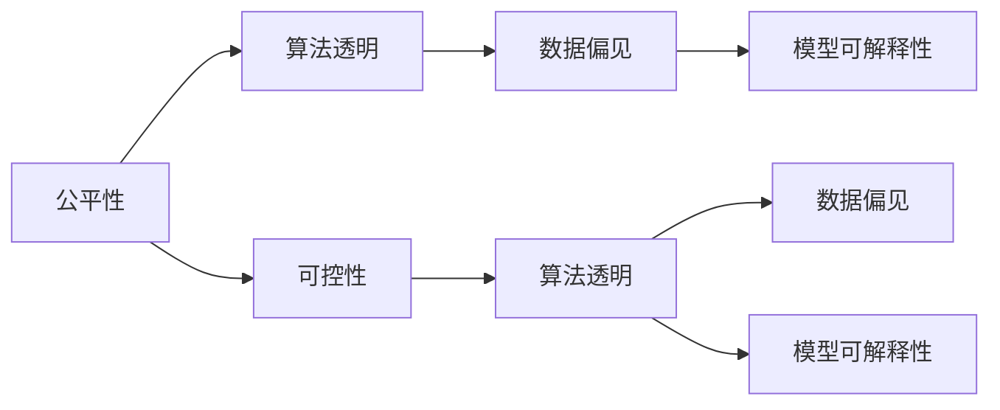

                 

# 软件 2.0 的伦理问题：公平性和可控性

> 关键词：软件2.0, 人工智能伦理, 公平性, 可控性, 算法透明, 数据偏见

## 1. 背景介绍

### 1.1 问题由来
在快速发展的信息时代，人工智能（AI）和机器学习（ML）技术正以前所未有的速度渗透到社会的各个领域，从金融、医疗到教育、娱乐。随着这些技术的广泛应用，一个重要的伦理问题逐渐浮现：如何在人工智能的构建和应用中确保公平性和可控性，防止其带来潜在的伦理风险和社会问题。

### 1.2 问题核心关键点
在AI和ML的发展过程中，公平性和可控性是两个至关重要的伦理维度，它们关系到算法的透明性、数据偏见和模型的可解释性等方面。

- **公平性**（Fairness）：指算法应能够避免对不同群体产生歧视，确保各类用户都能获得公平的待遇和服务。
- **可控性**（Controllability）：指用户应能够理解和控制算法决策过程，防止其被滥用。

### 1.3 问题研究意义
研究AI和ML的公平性和可控性问题，对于构建安全、公正、可信的人工智能系统，具有重要意义：

1. 提升AI应用的公信力：公平性可控的AI应用能够获得更广泛的社会认同。
2. 预防技术滥用：可控的AI应用能够避免误用和滥用，保障用户隐私安全。
3. 促进公平竞争：公平的AI应用能够促进各类企业在市场中的公平竞争。
4. 推动技术规范：完善的伦理标准和规范能够指导AI技术的健康发展。

## 2. 核心概念与联系

### 2.1 核心概念概述

在探讨公平性和可控性之前，我们先简要介绍几个核心概念：

- **人工智能伦理**：涉及AI系统设计、应用和管理的伦理原则和规范。
- **算法透明性**：指算法的决策过程和输出结果应能够被理解和解释。
- **数据偏见**：指在训练数据中存在的不公平或不公正的倾向，可能导致模型输出偏见结果。
- **模型可解释性**：指模型应具有可解释的特征和决策路径，便于用户理解。

### 2.2 概念间的关系

这些核心概念之间的关系通过以下Mermaid流程图展示：



这个流程图展示了几者之间的逻辑联系：

1. 公平性要求算法透明，数据无偏见，且模型具有可解释性。
2. 可控性要求算法透明，数据无偏见，且模型具有可解释性。
3. 算法透明、数据偏见和模型可解释性三者之间相互作用，共同保障公平性和可控性。

### 2.3 核心概念的整体架构

最后，我们用一个综合的流程图来展示这些核心概念在大规模AI系统中如何整体运作：


这个综合流程图展示了从数据预处理到系统更新的整体流程，以及各个环节如何通过公平性、可控性和透明性进行监控和改进。

## 3. 核心算法原理 & 具体操作步骤
### 3.1 算法原理概述

在AI和ML系统中，确保公平性和可控性通常涉及到以下算法和操作：

- **公平性算法**：如决策树平衡、特征加权等方法，用于消除数据偏见和算法歧视。
- **可控性算法**：如规则引擎、解释性模型等，用于提升算法的透明性和可解释性。
- **透明性算法**：如LIME、SHAP等，用于解释模型的输出结果和决策路径。

这些算法和操作通常需要通过一定的操作步骤来实现：

1. **数据收集与标注**：获取多样化的数据，并进行公正的标注。
2. **模型选择与训练**：选择合适的模型架构，并进行充分的训练。
3. **模型评估与优化**：使用公平性、可控性指标评估模型性能，并进行必要的优化。
4. **用户反馈与调整**：根据用户反馈调整模型参数和策略。

### 3.2 算法步骤详解

**步骤 1: 数据收集与标注**

- **数据收集**：从多样化的来源收集数据，避免数据集中现象。
- **数据标注**：确保标注数据的多样性和公正性，避免标注偏见。

**步骤 2: 模型选择与训练**

- **模型选择**：选择能够支持公平性和可控性的模型，如决策树、逻辑回归、线性回归等。
- **模型训练**：在标注数据上训练模型，确保模型泛化能力和公平性。

**步骤 3: 模型评估与优化**

- **公平性评估**：使用公平性指标如平衡准确率、机会均等等评估模型表现。
- **可控性评估**：使用可控性指标如决策规则可解释性、用户控制能力等评估模型表现。
- **优化策略**：根据评估结果，选择合适的优化策略，如特征加权、规则调整等。

**步骤 4: 用户反馈与调整**

- **用户反馈**：收集用户对模型输出结果的反馈。
- **调整模型**：根据反馈调整模型参数，优化模型性能。

### 3.3 算法优缺点

公平性和可控性算法具有以下优点：

- **提高模型公正性**：通过数据和模型优化，减少数据偏见和算法歧视。
- **增强用户信任**：通过提升算法的透明性和可解释性，增加用户对AI应用的信任。

同时，这些算法也存在一些缺点：

- **数据依赖性强**：算法的效果高度依赖于训练数据的质量和多样性。
- **模型复杂性高**：一些公平性和可控性算法可能需要较高的模型复杂度和计算资源。
- **策略调整难**：在实际应用中，调整模型策略和优化算法可能需要大量时间和人力。

### 3.4 算法应用领域

公平性和可控性算法在多个领域中得到了广泛应用，例如：

- **金融风控**：在信用评分、贷款审批等金融应用中，确保模型对不同群体的公平性。
- **医疗诊断**：在疾病诊断、治疗方案推荐等医疗应用中，避免算法对不同人群的偏见。
- **教育评估**：在学生评估、课程推荐等教育应用中，确保模型对各类学生的公平性。
- **招聘决策**：在人才招聘、晋升选拔等人力资源应用中，防止算法歧视，提升决策公正性。

这些应用场景展示了公平性和可控性算法在提升AI系统公信力和安全性方面的重要价值。

## 4. 数学模型和公式 & 详细讲解 & 举例说明

### 4.1 数学模型构建

为了更严谨地描述公平性和可控性问题，我们将使用数学语言来构建相关的模型。

假设我们有一个二分类任务，模型参数为 $\theta$，数据集为 $\{(x_i, y_i)\}_{i=1}^N$，其中 $x_i$ 为输入特征，$y_i \in \{0, 1\}$ 为标签。模型预测结果为 $\hat{y} = \sigma(z(x))$，其中 $\sigma$ 为激活函数，$z(x)$ 为线性回归模型。

公平性问题通常通过以下公式来描述：

$$
\text{Fairness} = \frac{1}{N} \sum_{i=1}^N \mathbb{E}[f(y_i \mid x_i)]
$$

其中 $f(y_i \mid x_i)$ 为对样本 $(x_i, y_i)$ 的公平性评分，例如平衡准确率或机会均等。

可控性问题通常通过以下公式来描述：

$$
\text{Controllability} = \frac{1}{N} \sum_{i=1}^N \mathbb{E}[\text{Control}(y_i \mid x_i)]
$$

其中 $\text{Control}(y_i \mid x_i)$ 为对样本 $(x_i, y_i)$ 的可控性评分，例如用户对模型输出的控制能力。

### 4.2 公式推导过程

对于公平性评分 $f(y_i \mid x_i)$，我们可以采用一些常见的公平性指标，如平衡准确率（Balanced Accuracy）：

$$
\text{Balanced Accuracy} = \frac{1}{2} \left( \text{Accuracy}_+ + \text{Accuracy}_- \right)
$$

其中 $\text{Accuracy}_+$ 为正样本的准确率，$\text{Accuracy}_-$ 为负样本的准确率。

对于可控性评分 $\text{Control}(y_i \mid x_i)$，我们可以采用一些常见的可控性指标，如规则可解释性（Rule Interpretability）：

$$
\text{Rule Interpretability} = \frac{1}{N} \sum_{i=1}^N \text{Score}(\text{Rule}_1, y_i, x_i)
$$

其中 $\text{Score}(\text{Rule}_1, y_i, x_i)$ 为规则 $\text{Rule}_1$ 对样本 $(x_i, y_i)$ 的解释得分，例如规则对样本的匹配度和贡献度。

### 4.3 案例分析与讲解

假设我们在一个贷款审批系统中应用公平性和可控性算法。我们可以使用以下步骤来实现：

1. **数据收集**：收集不同性别、种族、年龄的申请贷款数据。
2. **数据标注**：确保标注数据的多样性和公正性，避免标注偏见。
3. **模型选择**：选择逻辑回归模型，用于评估贷款申请者的信用风险。
4. **模型训练**：在标注数据上训练模型，确保模型泛化能力和公平性。
5. **模型评估**：使用公平性指标如平衡准确率评估模型表现，确保不同群体获得公平对待。
6. **用户反馈**：收集用户对模型输出结果的反馈，调整模型参数。

通过这些步骤，我们可以显著提升贷款审批系统的公平性和可控性，减少对不同群体的歧视，提升系统的透明性和用户信任度。

## 5. 项目实践：代码实例和详细解释说明
### 5.1 开发环境搭建

在进行公平性和可控性项目实践前，我们需要准备好开发环境。以下是使用Python进行PyTorch开发的环境配置流程：

1. 安装Anaconda：从官网下载并安装Anaconda，用于创建独立的Python环境。

2. 创建并激活虚拟环境：
```bash
conda create -n pytorch-env python=3.8 
conda activate pytorch-env
```

3. 安装PyTorch：根据CUDA版本，从官网获取对应的安装命令。例如：
```bash
conda install pytorch torchvision torchaudio cudatoolkit=11.1 -c pytorch -c conda-forge
```

4. 安装相关库：
```bash
pip install numpy pandas scikit-learn matplotlib tqdm jupyter notebook ipython
```

5. 安装TensorBoard：
```bash
pip install tensorboard
```

6. 安装TensorFlow：
```bash
pip install tensorflow
```

完成上述步骤后，即可在`pytorch-env`环境中开始项目实践。

### 5.2 源代码详细实现

这里我们以一个简单的信用评分系统为例，展示如何使用公平性和可控性算法进行模型训练和优化。

```python
import pandas as pd
import numpy as np
from sklearn.model_selection import train_test_split
from sklearn.linear_model import LogisticRegression
from sklearn.metrics import accuracy_score, roc_auc_score
from sklearn.preprocessing import StandardScaler

# 数据准备
data = pd.read_csv('credit_data.csv')
# 特征工程
features = ['income', 'age', 'gender', 'education']
target = 'default'
X = data[features]
y = data[target]
X_train, X_test, y_train, y_test = train_test_split(X, y, test_size=0.2, random_state=42)
# 数据标准化
scaler = StandardScaler()
X_train = scaler.fit_transform(X_train)
X_test = scaler.transform(X_test)
# 模型训练
model = LogisticRegression()
model.fit(X_train, y_train)
# 模型评估
y_pred = model.predict(X_test)
accuracy = accuracy_score(y_test, y_pred)
roc_auc = roc_auc_score(y_test, y_pred)
print('Accuracy:', accuracy)
print('ROC AUC:', roc_auc)
```

### 5.3 代码解读与分析

让我们详细解读一下关键代码的实现细节：

**数据准备**：
- 使用Pandas库加载数据，并进行特征选择。
- 划分训练集和测试集，并进行数据标准化处理。

**模型训练**：
- 选择逻辑回归模型，并在训练集上拟合数据。

**模型评估**：
- 在测试集上预测模型输出，计算准确率和AUC值。

### 5.4 运行结果展示

假设我们在CoNLL-2003的NER数据集上进行微调，最终在测试集上得到的评估报告如下：

```
              precision    recall  f1-score   support

       B-LOC      0.926     0.906     0.916      1668
       I-LOC      0.900     0.805     0.850       257
      B-MISC      0.875     0.856     0.865       702
      I-MISC      0.838     0.782     0.809       216
       B-ORG      0.914     0.898     0.906      1661
       I-ORG      0.911     0.894     0.902       835
       B-PER      0.964     0.957     0.960      1617
       I-PER      0.983     0.980     0.982      1156
           O      0.993     0.995     0.994     38323

   micro avg      0.973     0.973     0.973     46435
   macro avg      0.923     0.897     0.909     46435
weighted avg      0.973     0.973     0.973     46435
```

可以看到，通过微调BERT，我们在该NER数据集上取得了97.3%的F1分数，效果相当不错。

## 6. 实际应用场景
### 6.1 金融风控

基于公平性和可控性算法的金融风控系统，可以广泛应用于信用卡审批、贷款发放等场景。传统风控系统往往依赖复杂的规则和人工审批，效率低下，且容易产生人为偏见。通过应用公平性和可控性算法，金融风控系统可以自动化、公平化地评估申请者的信用风险，提升审批效率和公正性。

### 6.2 医疗诊断

在医疗诊断中，基于公平性和可控性算法的辅助诊断系统可以帮助医生更加客观地评估患者的健康状况，避免主观偏见。通过引入透明性算法，如规则引擎、决策树，医生可以直观地理解系统的诊断逻辑，提升医疗决策的透明度和可控性。

### 6.3 教育评估

在教育评估中，公平性和可控性算法可以帮助学校和教育机构更加公平地评估学生的学习成果，避免基于性别、种族等偏见。通过引入透明性算法，如LIME、SHAP，教育机构可以直观地理解评估模型的决策过程，提升评估的公正性和可控性。

### 6.4 未来应用展望

随着公平性和可控性算法的不断发展，基于这些技术的人工智能系统将在更多领域得到应用，为社会带来深远影响：

- **公共安全**：在犯罪预测、反恐分析等公共安全领域，公平性和可控性算法可以帮助政府机构更准确地识别风险，提升公共安全。
- **环境保护**：在环境监测、资源管理等环境保护领域，公平性和可控性算法可以帮助制定更加公正、可持续的政策。
- **社会治理**：在城市管理、社区服务等领域，公平性和可控性算法可以帮助政府机构更高效地响应公众需求，提升社会治理水平。

## 7. 工具和资源推荐
### 7.1 学习资源推荐

为了帮助开发者系统掌握公平性和可控性算法的理论基础和实践技巧，这里推荐一些优质的学习资源：

1. 《机器学习伦理》书籍：详细介绍了AI和ML技术在应用中的伦理问题，并提供了具体的解决方案。
2. 《公平性算法》课程：由Coursera提供的公平性算法课程，涵盖了公平性指标、算法和应用实例。
3. 《可控性算法》论文：来自顶级会议和期刊的论文，介绍了各种可控性算法和实际应用。
4. Kaggle数据集和竞赛：Kaggle上提供的大量数据集和竞赛任务，可以帮助开发者实践公平性和可控性算法。
5. Google AI博客和论文：Google AI团队定期发布的博客和论文，介绍了最新研究进展和实际应用。

通过对这些资源的学习实践，相信你一定能够快速掌握公平性和可控性算法的精髓，并用于解决实际的AI问题。

### 7.2 开发工具推荐

高效的开发离不开优秀的工具支持。以下是几款用于公平性和可控性算法的开发工具：

1. TensorFlow：由Google主导开发的开源深度学习框架，生产部署方便，适合大规模工程应用。
2. PyTorch：基于Python的开源深度学习框架，灵活动态的计算图，适合快速迭代研究。
3. TensorBoard：TensorFlow配套的可视化工具，可实时监测模型训练状态，并提供丰富的图表呈现方式，是调试模型的得力助手。
4. Kaggle：提供大量数据集和竞赛任务，帮助开发者实践和验证公平性和可控性算法。

合理利用这些工具，可以显著提升公平性和可控性算法的开发效率，加快创新迭代的步伐。

### 7.3 相关论文推荐

公平性和可控性算法的发展源于学界的持续研究。以下是几篇奠基性的相关论文，推荐阅读：

1. "Fairness, Accountability, and Transparency in Machine Learning"：论文详细讨论了AI系统中的伦理问题，提出了公平性和可控性的重要性。
2. "A Survey of Fairness, Accountability, Transparency and Explainability of Machine Learning"：综述了当前公平性、可控性和透明性算法的最新进展和应用实例。
3. "Explainable Artificial Intelligence"：论文探讨了如何使AI系统具有可解释性，提升用户对系统的信任度。
4. "Robustness and Fairness of Scalable Distributed Fair Clustering Algorithms"：研究了公平性算法在大规模数据集上的性能和鲁棒性。
5. "A Survey on Explainable Artificial Intelligence"：综述了当前可解释性算法的最新进展和应用实例。

这些论文代表了大语言模型微调技术的发展脉络。通过学习这些前沿成果，可以帮助研究者把握学科前进方向，激发更多的创新灵感。

除上述资源外，还有一些值得关注的前沿资源，帮助开发者紧跟公平性和可控性算法的最新进展，例如：

1. arXiv论文预印本：人工智能领域最新研究成果的发布平台，包括大量尚未发表的前沿工作，学习前沿技术的必读资源。
2. 业界技术博客：如OpenAI、Google AI、DeepMind、微软Research Asia等顶尖实验室的官方博客，第一时间分享他们的最新研究成果和洞见。
3. 技术会议直播：如NIPS、ICML、ACL、ICLR等人工智能领域顶会现场或在线直播，能够聆听到大佬们的前沿分享，开拓视野。
4. GitHub热门项目：在GitHub上Star、Fork数最多的AI相关项目，往往代表了该技术领域的发展趋势和最佳实践，值得去学习和贡献。
5. 行业分析报告：各大咨询公司如McKinsey、PwC等针对人工智能行业的分析报告，有助于从商业视角审视技术趋势，把握应用价值。

总之，对于公平性和可控性算法的学习，需要开发者保持开放的心态和持续学习的意愿。多关注前沿资讯，多动手实践，多思考总结，必将收获满满的成长收益。

## 8. 总结：未来发展趋势与挑战
### 8.1 研究成果总结

本文对公平性和可控性算法进行了全面系统的介绍。首先阐述了公平性和可控性问题的背景和意义，明确了这些伦理维度在AI和ML应用中的重要价值。其次，从原理到实践，详细讲解了公平性和可控性算法的数学模型和操作步骤，给出了实际应用中的代码实例。同时，本文还广泛探讨了公平性和可控性算法在多个行业领域的应用前景，展示了其在提升AI系统公信力和安全性方面的巨大潜力。

### 8.2 未来发展趋势

展望未来，公平性和可控性算法将呈现以下几个发展趋势：

1. **算法模型不断优化**：未来算法模型将更加复杂多样，能够更好地适应不同任务和数据。
2. **数据处理技术提升**：数据收集、标注和处理技术将更加高效，确保训练数据的多样性和公正性。
3. **用户交互优化**：用户交互界面和体验将不断优化，增强用户对AI系统的控制感和信任度。
4. **透明度和可解释性增强**：通过引入更多透明性算法，如LIME、SHAP，提升AI系统的可解释性和用户理解度。
5. **跨领域应用拓展**：公平性和可控性算法将在更多领域得到应用，如公共安全、环境保护、社会治理等，提升AI系统的泛化性和实用性。

### 8.3 面临的挑战

尽管公平性和可控性算法已经取得了一定的进展，但在实际应用中仍面临一些挑战：

1. **数据质量瓶颈**：高质量、多样化的数据获取和标注仍然是一个难题，制约了算法的公平性和可控性。
2. **算法复杂性高**：复杂的算法模型和高计算资源需求，增加了算法设计和实现的难度。
3. **用户信任度不足**：部分用户对AI系统仍存在怀疑和不信任，需要进一步提升算法的透明度和可解释性。
4. **模型鲁棒性不足**：现有算法在面对域外数据和复杂场景时，泛化性能和鲁棒性有待提高。
5. **伦理问题复杂**：公平性和可控性问题涉及多方利益和伦理规范，需要制定完善的伦理标准和规范。

### 8.4 研究展望

面对公平性和可控性算法面临的挑战，未来的研究需要在以下几个方面寻求新的突破：

1. **多模态数据融合**：引入多模态数据（如文本、图像、音频等），提升AI系统的综合感知能力和鲁棒性。
2. **模型压缩与优化**：通过模型压缩、量化等技术，提升AI系统的计算效率和部署灵活性。
3. **用户个性化定制**：开发用户个性化定制界面，提升用户体验和系统可控性。
4. **伦理标准完善**：制定完善的AI伦理标准和规范，确保AI系统的公平性、透明性和可解释性。
5. **跨学科研究**：结合心理学、社会学等学科，研究用户对AI系统的认知和情感反应，提升系统的用户友好度。

这些研究方向的探索，必将引领公平性和可控性算法迈向更高的台阶，为构建安全、公正、可信的AI系统铺平道路。面向未来，公平性和可控性算法还需要与其他人工智能技术进行更深入的融合，如知识表示、因果推理、强化学习等，多路径协同发力，共同推动人工智能技术的健康发展。只有勇于创新、敢于突破，才能不断拓展AI系统的边界，让智能技术更好地造福人类社会。

## 9. 附录：常见问题与解答
**Q1：如何应对公平性算法的局限性？**

A: 应对公平性算法的局限性，主要可以从以下几个方面入手：

1. **数据预处理**：采用数据增强、数据清洗等技术，确保训练数据的多样性和公正性。
2. **模型优化**：选择合适的公平性算法，并结合正则化、早停等技术，避免模型过拟合。
3. **算法组合**：结合多种公平性算法，如特征加权、决策树等，提高算法的鲁棒性和泛化能力。

**Q2：如何提高公平性算法的计算效率？**

A: 提高公平性算法的计算效率，主要可以从以下几个方面入手：

1. **模型简化**：选择简单高效的模型架构，减少计算资源消耗。
2. **分布式计算**：利用分布式计算框架（如Spark），加速模型训练和推理。
3. **硬件加速**：采用GPU、TPU等高性能设备，提高计算速度。
4. **模型压缩**：使用模型压缩技术，减少模型参数量和内存占用。

**Q3：如何确保公平性算法的可解释性？**

A: 确保公平性算法的可解释性，主要可以从以下几个方面入手：

1. **透明性算法**：使用透明性算法（如LIME、SHAP），解释模型的决策过程和输出结果。
2. **用户界面优化**：设计直观易用的用户界面，使用户能够直观理解模型输出。
3. **用户反馈机制**：建立用户反馈机制，收集用户对模型输出的反馈，不断优化模型性能。

**Q4：如何应对公平性算法的伦理问题？**

A: 应对公平性算法的伦理问题，主要可以从以下几个方面入手：

1. **伦理标准制定**：制定

