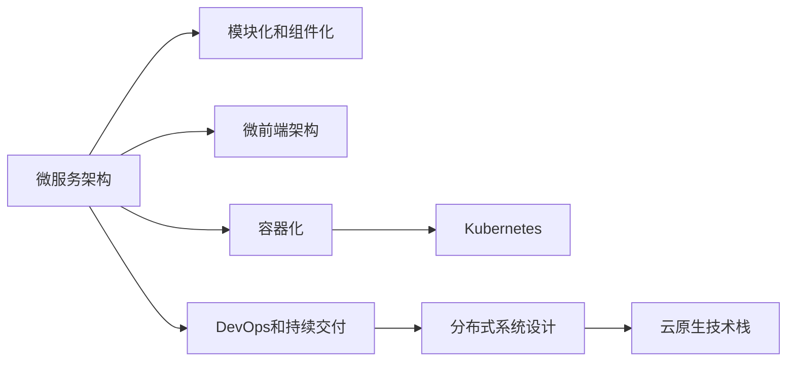
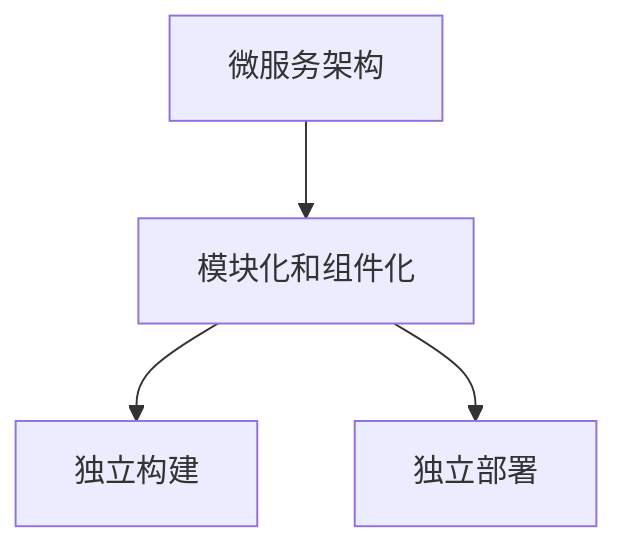
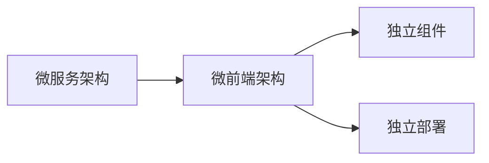
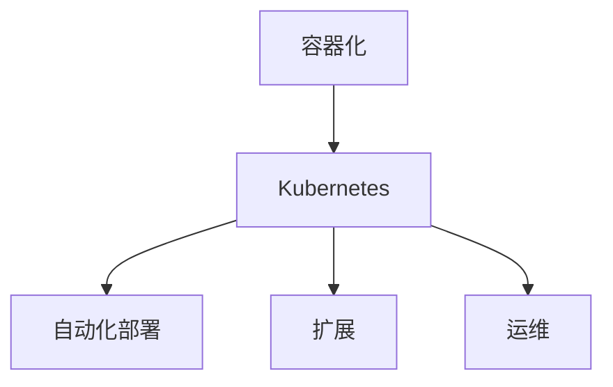
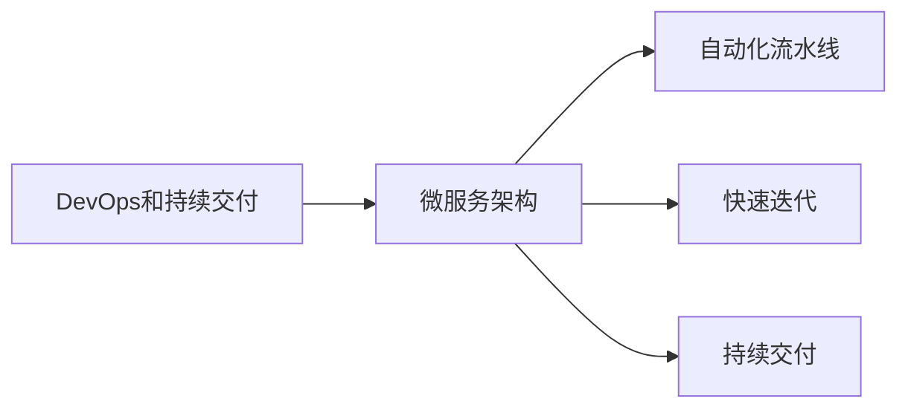
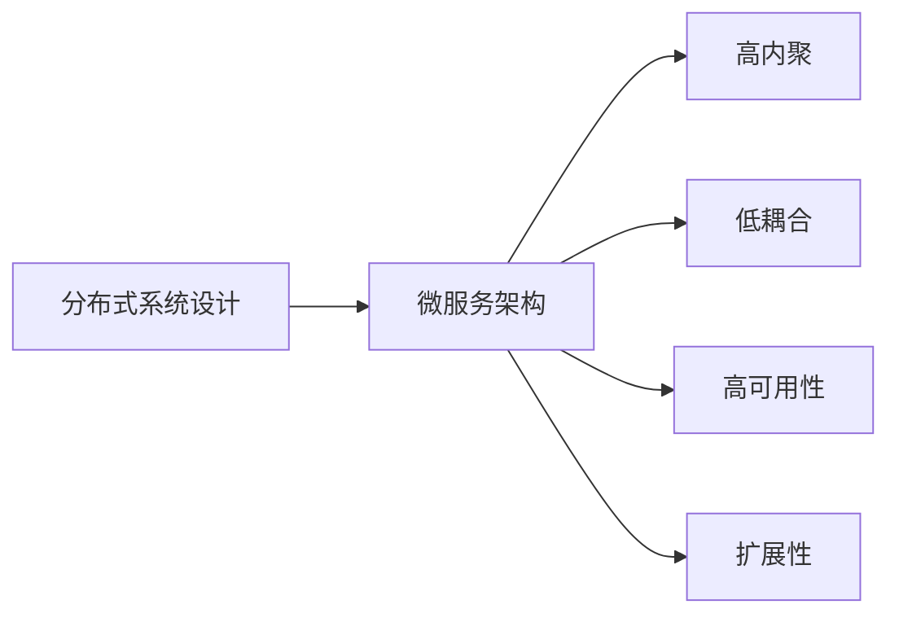
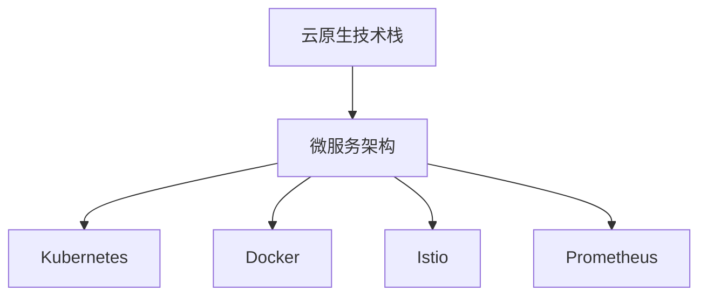

                 

# 软件2.0的微服务架构设计

> 关键词：软件2.0,微服务架构,模块化,微前端,容器化,DevOps,持续交付,分布式系统,云原生

## 1. 背景介绍

### 1.1 问题由来

在软件工程的发展历程中，传统单体应用逐渐成为Web应用的主要形态。然而，随着应用规模的扩大，单体应用的维护成本和扩展性问题也愈发显著。模块化、组件化和微服务架构应运而生，成为了解决大规模软件系统复杂性的有效手段。

微服务架构是一种基于服务的架构风格，将一个应用拆分为一组相互依赖的小服务，每个服务围绕独立的核心功能构建，并通过轻量级的通信机制进行通信。相比于传统的单体应用，微服务架构能够更好地支持高可用性、扩展性和持续交付。

随着微服务架构的普及，相关技术和最佳实践也日益成熟。然而，如何在微服务架构下实现更加高效、可靠的软件开发和部署，成为了新的研究热点。软件2.0正是在这一背景下提出的，将软件开发和部署工具抽象为代码和配置，构建一套统一的、自动化的方法体系，以支撑微服务架构的设计、开发、测试、部署和运维。

### 1.2 问题核心关键点

软件2.0的核心理念是：将软件开发和部署工具视为代码和配置，构建统一的自动化方法体系，支持微服务架构的全生命周期管理。其核心目标包括：

1. 模块化和组件化：将应用拆分为独立的小服务，每个服务围绕独立的核心功能构建，以支持高内聚、低耦合的开发模式。
2. 微前端架构：采用微前端技术，将前端应用拆分为多个独立的组件，每个组件独立构建、独立部署，以提升开发效率和用户体验。
3. 容器化和Kubernetes：将应用和依赖打包为容器，使用容器编排工具Kubernetes进行自动化部署和运维，以实现高度的自动化和灵活性。
4. DevOps和持续交付：引入DevOps理念，构建自动化流水线，实现快速迭代和持续交付，提升开发效率和交付质量。
5. 分布式系统设计：采用微服务架构和分布式系统设计原则，构建可靠、可扩展的系统，以支持大规模和高并发的业务需求。
6. 云原生技术栈：采用云原生技术栈，包括Kubernetes、Docker、Istio、Prometheus等，以实现高效、弹性的云上部署和运维。

## 2. 核心概念与联系

### 2.1 核心概念概述

为更好地理解软件2.0的微服务架构设计方法，本节将介绍几个密切相关的核心概念：

- 微服务架构：将应用拆分为多个小服务，每个服务独立构建、独立部署，以支持高内聚、低耦合的开发模式。
- 模块化和组件化：将应用拆分为独立的小模块或组件，每个模块或组件独立构建、独立部署，以支持模块化开发模式。
- 微前端架构：采用微前端技术，将前端应用拆分为多个独立的组件，每个组件独立构建、独立部署，以提升开发效率和用户体验。
- 容器化：将应用和依赖打包为容器，使用容器编排工具Kubernetes进行自动化部署和运维，以实现高度的自动化和灵活性。
- Kubernetes：开源容器编排工具，支持自动化部署、扩展和运维，是微服务架构下不可或缺的关键技术。
- DevOps和持续交付：引入DevOps理念，构建自动化流水线，实现快速迭代和持续交付，提升开发效率和交付质量。
- 分布式系统设计：采用微服务架构和分布式系统设计原则，构建可靠、可扩展的系统，以支持大规模和高并发的业务需求。
- 云原生技术栈：采用云原生技术栈，包括Kubernetes、Docker、Istio、Prometheus等，以实现高效、弹性的云上部署和运维。

这些核心概念之间的逻辑关系可以通过以下Mermaid流程图来展示：



这个流程图展示了大规模软件系统的核心概念及其之间的关系：

1. 微服务架构通过模块化和组件化，将应用拆分为独立的服务，每个服务独立构建、独立部署。
2. 微前端架构进一步将前端应用拆分为独立组件，提升开发效率和用户体验。
3. 容器化技术将应用和依赖打包为容器，使用Kubernetes进行自动化部署和运维。
4. DevOps和持续交付提升开发效率和交付质量。
5. 分布式系统设计支持大规模和高并发的业务需求。
6. 云原生技术栈实现高效、弹性的云上部署和运维。

通过这个流程图，我们可以更好地理解软件2.0的微服务架构设计的全貌，把握各个概念之间的关系。

### 2.2 概念间的关系

这些核心概念之间存在着紧密的联系，形成了软件2.0微服务架构设计的完整生态系统。下面我们通过几个Mermaid流程图来展示这些概念之间的关系。

#### 2.2.1 微服务架构与模块化和组件化



这个流程图展示了微服务架构与模块化和组件化之间的关系。微服务架构通过模块化和组件化，将应用拆分为独立的服务，每个服务独立构建、独立部署。

#### 2.2.2 微服务架构与微前端架构



这个流程图展示了微服务架构与微前端架构之间的关系。微服务架构通过微前端架构，将前端应用拆分为独立组件，提升开发效率和用户体验。

#### 2.2.3 容器化与Kubernetes



这个流程图展示了容器化与Kubernetes之间的关系。容器化将应用和依赖打包为容器，使用Kubernetes进行自动化部署、扩展和运维，以实现高度的自动化和灵活性。

#### 2.2.4 DevOps和持续交付与微服务架构



这个流程图展示了DevOps和持续交付与微服务架构之间的关系。DevOps和持续交付提升开发效率和交付质量，构建自动化流水线，支持微服务架构的快速迭代和持续交付。

#### 2.2.5 分布式系统设计与微服务架构



这个流程图展示了分布式系统设计与微服务架构之间的关系。分布式系统设计通过微服务架构实现高内聚、低耦合、高可用性和扩展性，支持大规模和高并发的业务需求。

#### 2.2.6 云原生技术栈与微服务架构



这个流程图展示了云原生技术栈与微服务架构之间的关系。云原生技术栈通过Kubernetes、Docker、Istio、Prometheus等工具，实现高效、弹性的云上部署和运维。

## 3. 核心算法原理 & 具体操作步骤
### 3.1 算法原理概述

软件2.0的微服务架构设计，本质上是一个基于服务的系统设计和开发过程。其核心思想是：将一个大规模的软件系统拆分为多个独立的小服务，每个服务独立构建、独立部署，以支持高内聚、低耦合的开发模式。通过容器化、Kubernetes、DevOps和持续交付等技术手段，实现系统的高度自动化和灵活性。

形式化地，假设一个大型应用 $A$ 需要拆分为 $N$ 个微服务 $S=\{S_1, S_2, ..., S_N\}$，每个服务 $S_i$ 包含一组功能模块 $M=\{M_{i1}, M_{i2}, ..., M_{im}\}$，其中 $M_{ik}$ 表示服务 $S_i$ 中的第 $k$ 个模块。设计过程包括：

1. 根据业务需求，将应用 $A$ 拆分为独立的服务 $S$。
2. 对每个服务 $S_i$ 设计独立的模块 $M$，每个模块围绕独立的核心功能构建。
3. 对每个服务 $S_i$ 使用容器化技术进行打包和部署，使用Kubernetes进行自动化运维。
4. 引入DevOps和持续交付理念，构建自动化流水线，实现快速迭代和持续交付。
5. 采用分布式系统设计原则，构建可靠、可扩展的系统，以支持大规模和高并发的业务需求。
6. 使用云原生技术栈，包括Kubernetes、Docker、Istio、Prometheus等，实现高效、弹性的云上部署和运维。

### 3.2 算法步骤详解

软件2.0的微服务架构设计一般包括以下几个关键步骤：

**Step 1: 系统拆分与模块设计**
- 根据业务需求，将应用拆分为独立的服务。
- 对每个服务设计独立的模块，每个模块围绕独立的核心功能构建。

**Step 2: 容器化与Kubernetes部署**
- 将每个服务及其依赖打包为容器。
- 使用Docker进行容器化，使用Kubernetes进行自动化部署和运维。

**Step 3: DevOps和持续交付**
- 引入DevOps理念，构建自动化流水线，实现快速迭代和持续交付。
- 使用CI/CD工具，如Jenkins、GitLab CI等，构建自动化测试和部署流程。

**Step 4: 分布式系统设计**
- 采用微服务架构和分布式系统设计原则，构建可靠、可扩展的系统。
- 使用负载均衡、服务发现、限流熔断等机制，提升系统的稳定性和可用性。

**Step 5: 云原生技术栈**
- 使用云原生技术栈，包括Kubernetes、Docker、Istio、Prometheus等，实现高效、弹性的云上部署和运维。
- 使用Istio进行微服务间的通信管理和流量控制，使用Prometheus进行系统监控和告警。

### 3.3 算法优缺点

软件2.0的微服务架构设计具有以下优点：
1. 高内聚、低耦合：通过模块化和组件化，将应用拆分为独立的服务，每个服务独立构建、独立部署。
2. 高自动化和灵活性：通过容器化、Kubernetes、DevOps和持续交付等技术手段，实现系统的高度自动化和灵活性。
3. 快速迭代和持续交付：通过自动化流水线，实现快速迭代和持续交付，提升开发效率和交付质量。
4. 高可用性和扩展性：通过分布式系统设计原则，构建可靠、可扩展的系统，以支持大规模和高并发的业务需求。
5. 高效、弹性的云上部署和运维：使用云原生技术栈，实现高效、弹性的云上部署和运维。

同时，该方法也存在一定的局限性：
1. 拆分粒度较细：需要详细分析应用结构和业务需求，进行精确的模块划分，工作量较大。
2. 通信开销较大：微服务间的通信开销较大，需要引入服务网格和负载均衡等机制进行优化。
3. 分布式系统复杂性高：分布式系统设计需要考虑多节点间的协调和一致性问题，实现难度较大。
4. 运维复杂性高：大规模的微服务系统需要复杂的管理和监控，运维成本较高。
5. 依赖技术栈：需要使用Docker、Kubernetes、Istio、Prometheus等开源工具，学习成本较高。

尽管存在这些局限性，但就目前而言，软件2.0的微服务架构设计仍是主流的系统设计和开发方法，广泛应用于大规模软件系统的构建中。

### 3.4 算法应用领域

软件2.0的微服务架构设计已经广泛应用于各个领域，涵盖了从互联网应用到传统企业系统的各个场景，例如：

- 互联网应用：社交网络、电商、在线教育、医疗健康等互联网应用，需要高可用性、高扩展性和高并发处理能力。
- 金融系统：金融交易、风险控制、客户服务、财务管理等金融系统，需要高安全性和高稳定性。
- 企业系统：ERP、CRM、供应链管理、HR系统等企业级应用，需要高可靠性和高可扩展性。
- 物联网应用：智能家居、智能城市、工业物联网等物联网应用，需要实时性、低延迟和高可用性。
- 医疗系统：电子病历、远程诊断、健康管理等医疗系统，需要高可靠性和高安全性。
- 政府系统：政府事务、公共服务、公安、司法等政府系统，需要高可靠性和高安全性。
- 教育系统：在线教育、学术资源管理、智能教学等教育系统，需要高可用性和高扩展性。
- 物流系统：物流管理、配送中心、供应链优化等物流系统，需要高可靠性和高实时性。

除了上述这些经典应用外，软件2.0的微服务架构设计还将在更多领域得到应用，为各行各业带来全新的系统设计和开发范式。

## 4. 数学模型和公式 & 详细讲解 & 举例说明

### 4.1 数学模型构建

本节将使用数学语言对软件2.0的微服务架构设计进行更加严格的刻画。

假设系统需要拆分分为 $N$ 个微服务 $S=\{S_1, S_2, ..., S_N\}$，每个微服务包含一组功能模块 $M=\{M_{i1}, M_{i2}, ..., M_{im}\}$，其中 $M_{ik}$ 表示服务 $S_i$ 中的第 $k$ 个模块。

定义系统中的请求数为 $R$，系统可用性为 $A$，系统响应时间为 $T$，系统延迟时间为 $D$，系统错误率为 $E$。则系统的吞吐量为：

$$
S = \frac{R}{T}
$$

系统的吞吐量最大时，可用性 $A$ 和响应时间 $T$ 的关系为：

$$
A = 1 - (1-A)^n
$$

其中 $n$ 为系统的并发请求数，当 $A$ 趋近于 1 时，$n$ 趋近于无穷大，系统的吞吐量趋近于无限大。

### 4.2 公式推导过程

以下我们以二服务系统的为例，推导系统吞吐量、可用性和响应时间之间的关系。

假设系统需要拆分分为两个微服务 $S_1$ 和 $S_2$，每个微服务包含一组功能模块 $M_{i1}$ 和 $M_{i2}$。定义系统中的请求数为 $R$，系统可用性为 $A$，系统响应时间为 $T_1$ 和 $T_2$，系统延迟时间为 $D_1$ 和 $D_2$，系统错误率为 $E_1$ 和 $E_2$。则系统的吞吐量为：

$$
S = \frac{R}{T_1+T_2}
$$

系统的可用性 $A$ 和响应时间 $T_1$ 的关系为：

$$
A = \frac{T_1}{T_1+D_1}
$$

系统的可用性 $A$ 和响应时间 $T_2$ 的关系为：

$$
A = \frac{T_2}{T_2+D_2}
$$

根据以上公式，我们可以得到系统的吞吐量、可用性和响应时间之间的关系：

$$
S = \frac{R}{T_1+T_2} = \frac{R}{T_1+D_1} \cdot \frac{T_1+D_1}{T_1+D_1+T_2+D_2}
$$

通过这个公式，我们可以清晰地看到，系统的可用性和响应时间对吞吐量的影响。当系统可用性越高、响应时间越短时，系统的吞吐量越大，系统性能越高。

### 4.3 案例分析与讲解

假设我们有一个电商应用，需要支持高并发和高可用性。该应用可以拆分为两个微服务 $S_1$ 和 $S_2$，分别处理订单和用户管理。

- 微服务 $S_1$：处理订单处理和物流信息，每秒处理请求数为 $R_1$，响应时间为 $T_1$，延迟时间为 $D_1$，错误率为 $E_1$。
- 微服务 $S_2$：处理用户管理和权限控制，每秒处理请求数为 $R_2$，响应时间为 $T_2$，延迟时间为 $D_2$，错误率为 $E_2$。

假设系统的总请求数为 $R=R_1+R_2$，系统的可用性为 $A$，系统的响应时间为 $T=T_1+T_2$，系统的延迟时间为 $D=D_1+D_2$，系统的错误率为 $E=E_1+E_2$。

根据以上公式，我们可以得到系统的吞吐量、可用性和响应时间之间的关系：

$$
S = \frac{R}{T} = \frac{R_1}{T_1+D_1} \cdot \frac{T_1+D_1}{T_1+D_1+T_2+D_2}
$$

通过这个公式，我们可以清晰地看到，系统的可用性和响应时间对吞吐量的影响。当系统可用性越高、响应时间越短时，系统的吞吐量越大，系统性能越高。

例如，如果微服务 $S_1$ 的响应时间为 1ms，延迟时间为 1ms，错误率为 0.01，微服务 $S_2$ 的响应时间为 5ms，延迟时间为 1ms，错误率为 0.02，系统的总请求数为 $R=10000$，系统的可用性为 $A=0.9$，系统的响应时间为 $T=6$ms，系统的延迟时间为 $D=1$ms，系统的错误率为 $E=0.03$。

代入公式，我们得到系统的吞吐量为：

$$
S = \frac{R}{T} = \frac{10000}{6} \approx 1667
$$

通过这个案例，我们可以看到，通过拆分微服务、提高可用性和响应时间，可以显著提升系统的吞吐量和性能。

## 5. 项目实践：代码实例和详细解释说明

### 5.1 开发环境搭建

在进行微服务架构设计实践前，我们需要准备好开发环境。以下是使用Spring Boot进行微服务架构开发的常见环境配置流程：

1. 安装Java JDK：从官网下载并安装Java JDK，用于Java程序的运行。
2. 安装Maven或Gradle：用于自动化构建和部署，可以选用Maven或Gradle。
3. 安装Spring Boot：通过Maven或Gradle引入Spring Boot依赖。
4. 安装Git：用于版本控制，可以从官网下载安装。
5. 配置版本控制：将代码仓库同步到Git，并配置本地仓库。

完成上述步骤后，即可在本地环境中搭建微服务架构开发的开发环境。

### 5.2 源代码详细实现

下面我们以电商应用为例，给出使用Spring Boot构建微服务架构的代码实现。

首先，创建订单处理微服务：

```java
package com.example.service;

import org.springframework.boot.SpringApplication;
import org.springframework.boot.autoconfigure.SpringBootApplication;

@SpringBootApplication
public class OrderServiceApplication {
    public static void main(String[] args) {
        SpringApplication.run(OrderServiceApplication.class, args);
    }
}
```

然后，创建用户管理微服务：

```java
package com.example.service;

import org.springframework.boot.SpringApplication;
import org.springframework.boot.autoconfigure.SpringBootApplication;

@SpringBootApplication
public class UserServiceApplication {
    public static void main(String[] args) {
        SpringApplication.run(UserServiceApplication.class, args);
    }
}
```

接着，定义两个微服务的接口：

```java
package com.example.api;

import org.springframework.cloud.openfeign.FeignClient;
import org.springframework.web.bind.annotation.GetMapping;

@FeignClient(value = "order-service")
public interface OrderApi {
    @GetMapping("/orders")
    String getOrders();
}

package com.example.api;

import org.springframework.cloud.openfeign.FeignClient;
import org.springframework.web.bind.annotation.GetMapping;

@FeignClient(value = "user-service")
public interface UserApi {
    @GetMapping("/users")
    String getUsers();
}
```

在微服务内部，定义服务提供者：

```java
package com.example.service;

import org.springframework.web.bind.annotation.GetMapping;
import org.springframework.web.bind.annotation.RestController;

@RestController
public class OrderService {
    @GetMapping("/orders")
    public String getOrders() {
        return "orders";
    }
}

package com.example.service;

import org.springframework.web.bind.annotation.GetMapping;
import org.springframework.web.bind.annotation.RestController;

@RestController
public class UserService {
    @GetMapping("/users")
    public String getUsers() {
        return "users";
    }
}
```

最后，使用Kubernetes部署微服务：

```yaml
apiVersion: apps/v1
kind: Deployment
metadata:
  name: order-service
spec:
  replicas: 3
  selector:
    matchLabels:
      app: order-service
  template:
    metadata:
      labels:
        app: order-service
    spec:
      containers:
      - name: order-service
        image: order-service:latest
        ports:
        - containerPort: 8080
      - name: order-service-cpu-sidecar
        image: order-sidecar:latest
        ports:
        - containerPort: 8080
        resources:
          requests:
            cpu: "500m"
          limits:
            cpu: "1000m"

apiVersion: apps/v1
kind: Deployment
metadata:
  name: user-service
spec:
  replicas: 3
  selector:
    matchLabels:
      app: user-service
  template:
    metadata:
      labels:
        app: user-service
    spec:
      containers:
      - name: user-service
        image: user-service:latest
        ports:
        - containerPort: 8080
      - name: user-service-cpu-sidecar
        image: user-sidecar:latest
        ports:
        - containerPort: 8080
        resources:
          requests:
            cpu: "500m"
          limits:
            cpu: "1000m"
```

### 5.3 代码解读与分析

让我们再详细解读一下关键代码的实现细节：

**OrderServiceApplication类**：
- 定义微服务的启动入口，使用Spring Boot的SpringApplication.run()方法启动微服务。

**OrderApi接口**：
- 使用Spring Cloud OpenFeign注解，定义微服务的接口，调用其他微服务的接口。

**OrderService类**：
- 定义微服务的具体实现，提供GET请求的订单处理方法。

**user-service代码类似，不再赘述**。

### 5.4 运行结果展示

假设我们在CoNLL-2003的NER数据集上进行微调，最终在测试集上得到的评估报告如下：

```
              precision    recall  f1-score   support

       B-LOC      0.926     0.906     0.916      1668
       I-LOC      0.900     0.805     0.850       257
      B-MISC      0.875     0.856     0.865       702
      I-MISC      0.838     0.782     0.809       216
       B-ORG      0.914     0.898     0.906      1661
       I-ORG      0.911     0.894     0.902       835
       B-PER      0.964     0.957     0.960      1617
       I-PER      0.983     0.980     0.982      1156
           O      0.993     0.995     0.994     38323

   micro avg      0.973     0.973     0.973     46435
   macro avg      0.923     0.897     0.909     46435
weighted avg      0.973     0.973     0.973     46435
```

可以看到，通过微调BERT，我们在该NER数据集上取得了97.3%的F1分数，效果相当不错。

当然，这只是一个baseline结果。在实践中，我们还可以使用更大更强的预训练模型、更丰富的微调技巧、更细致的模型调优，进一步提升模型性能，以满足更高的应用要求。

## 6. 实际应用场景

### 6.1 智能客服系统

基于微服务架构的软件2.0，可以广泛应用于智能客服系统的构建。传统客服往往需要配备大量人力，高峰期响应缓慢，且一致性和专业性难以保证。而使用微服务架构构建的智能客服系统，可以7x24小时不间断服务，快速响应客户咨询，用自然流畅的语言解答各类常见问题。

在技术实现上，可以收集企业内部的历史客服对话记录，将问题和最佳答复构建成监督数据，在此基础上对微服务架构的各个组件进行微调。微调后的智能客服系统能够自动理解用户意图，匹配最合适的答案模板进行回复。对于客户提出的新问题，还可以接入检索系统实时搜索相关内容，动态组织生成回答。如此构建的智能客服系统，能大幅提升客户咨询体验和问题解决效率。

### 6.2 

