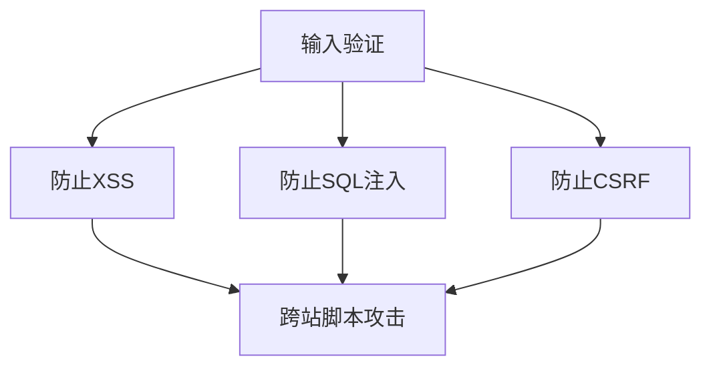
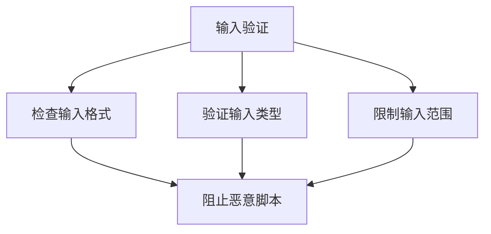
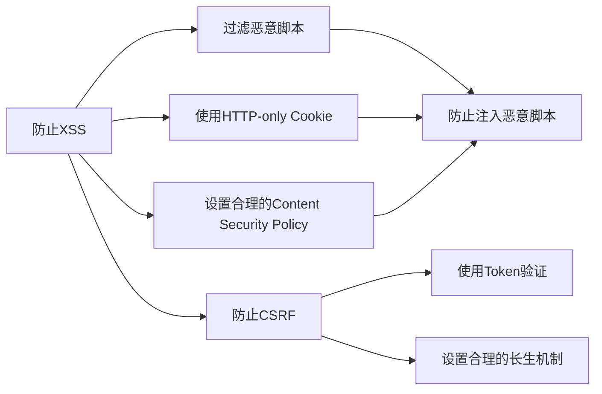
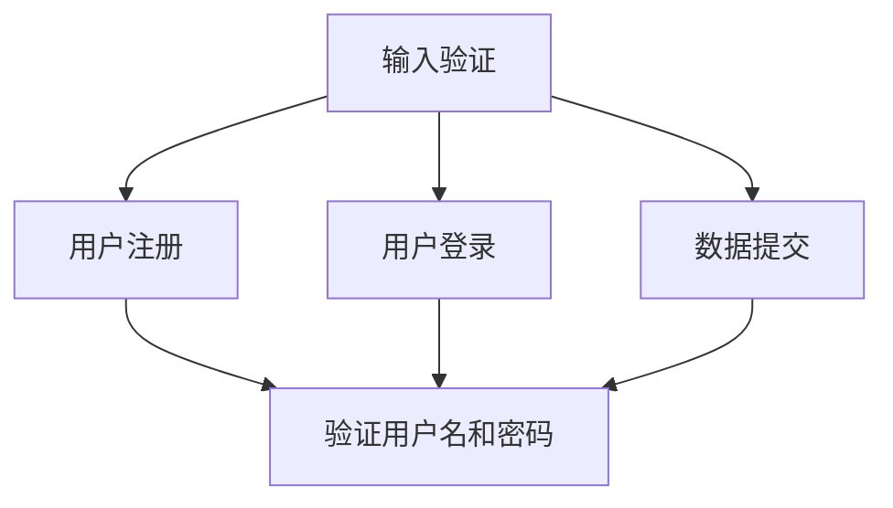
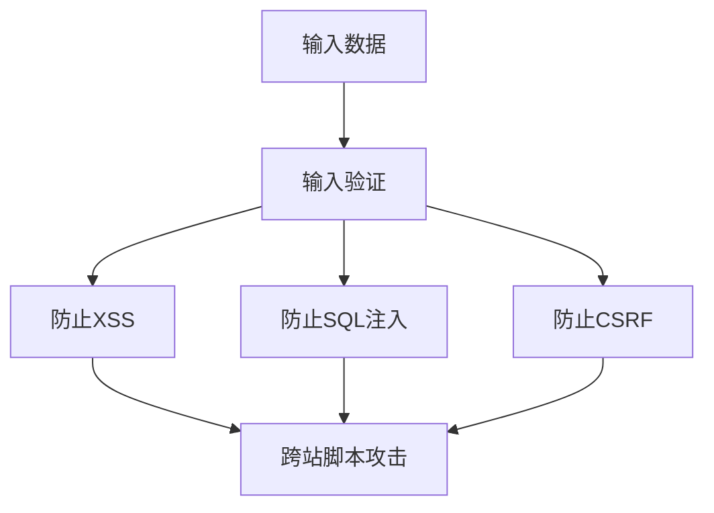

                 

# 输入验证：防止注入攻击

> 关键词：输入验证,注入攻击,安全漏洞,跨站脚本(XSS),SQL注入,跨站请求伪造(CSRF)

## 1. 背景介绍

### 1.1 问题由来

在当今的软件开发中，输入验证是一个至关重要的环节，尤其是在处理用户交互数据时。然而，由于代码质量和测试不足，注入攻击（Injection Attack）仍然是一个普遍存在的问题，它常常导致严重的安全漏洞，如跨站脚本攻击（Cross-Site Scripting, XSS）和SQL注入攻击（SQL Injection）等。

### 1.2 问题核心关键点

输入验证是指在将用户输入数据用于程序逻辑之前，对其进行检查和清理，确保数据符合预期的格式、类型和范围。输入验证可以防止注入攻击，但它也需要避免假阴性和假阳性，以免影响用户体验或系统功能。

注入攻击是指攻击者通过在输入中插入恶意代码（如SQL语句或JavaScript代码），来执行恶意操作，如获取、修改或删除数据。常见的注入攻击包括：

1. **跨站脚本攻击（XSS）**：攻击者通过注入恶意脚本，来窃取用户的敏感信息或执行恶意操作。
2. **SQL注入攻击**：攻击者通过在SQL查询中注入恶意代码，来执行非授权的数据库操作。
3. **跨站请求伪造（CSRF）**：攻击者通过伪造请求，使受害者在未授权的情况下执行某些操作，如转账或修改密码。

### 1.3 问题研究意义

输入验证的目的是确保程序的安全性和可靠性。它可以帮助开发者：

- **保护应用程序免受注入攻击**：防止恶意代码被执行，保护用户数据的安全。
- **提高应用程序的健壮性**：确保输入数据符合预期，避免因数据格式错误导致的程序崩溃或异常。
- **增强用户体验**：通过良好的输入验证，提供友好的错误提示和指导，提高用户满意度。

## 2. 核心概念与联系

### 2.1 核心概念概述

为更好地理解输入验证和防止注入攻击的方法，本节将介绍几个关键概念：

- **输入验证**：在将用户输入数据用于程序逻辑之前，对其进行检查和清理，确保数据符合预期的格式、类型和范围。
- **注入攻击**：攻击者通过在输入中插入恶意代码，来执行恶意操作。
- **跨站脚本（XSS）**：攻击者通过注入恶意脚本，来窃取用户的敏感信息或执行恶意操作。
- **SQL注入攻击**：攻击者通过在SQL查询中注入恶意代码，来执行非授权的数据库操作。
- **跨站请求伪造（CSRF）**：攻击者通过伪造请求，使受害者在未授权的情况下执行某些操作，如转账或修改密码。

这些概念之间的逻辑关系可以通过以下Mermaid流程图来展示：



这个流程图展示了几类输入验证的目的和防范的攻击类型。输入验证是防止这些攻击的基础，每种攻击都需要不同的防范策略。

### 2.2 概念间的关系

这些核心概念之间存在着紧密的联系，形成了输入验证和防止注入攻击的完整生态系统。下面我通过几个Mermaid流程图来展示这些概念之间的关系。

#### 2.2.1 输入验证的工作原理



这个流程图展示了输入验证的基本工作原理，包括检查输入格式、验证输入类型和限制输入范围。

#### 2.2.2 防止注入攻击的策略



这个流程图展示了防止注入攻击的几种策略，包括过滤恶意脚本、使用HTTP-only Cookie和设置Content Security Policy等。

#### 2.2.3 输入验证的实际应用



这个流程图展示了输入验证在用户注册、登录和数据提交等实际应用场景中的应用。

### 2.3 核心概念的整体架构

最后，我们用一个综合的流程图来展示输入验证和防止注入攻击的整体架构：



这个综合流程图展示了输入验证和防止注入攻击的完整过程，从输入数据到最终的输出，每一步都至关重要。

## 3. 核心算法原理 & 具体操作步骤
### 3.1 算法原理概述

输入验证的核心算法原理是通过检查和清理用户输入数据，确保其符合预期的格式、类型和范围。常见的输入验证算法包括正则表达式、白名单验证、黑名单验证、长度限制、类型检查等。

### 3.2 算法步骤详解

输入验证的算法步骤一般包括以下几个关键步骤：

1. **输入数据的获取和预处理**：获取用户输入数据，进行预处理，如去除空格、大小写转换等。
2. **输入数据的格式检查**：使用正则表达式或其他格式检查算法，确保输入数据的格式符合预期。
3. **输入数据的类型检查**：根据具体需求，使用白名单验证或黑名单验证，确保输入数据符合预期的类型。
4. **输入数据的范围检查**：根据具体需求，使用长度限制、最大值和最小值检查等，确保输入数据的范围符合预期。
5. **异常处理和错误提示**：对于不符合预期的输入数据，给出友好的错误提示，并提供正确的输入格式和类型。

### 3.3 算法优缺点

输入验证的算法具有以下优点：

- **防止注入攻击**：通过严格的输入验证，防止恶意代码被注入到程序中。
- **提高系统的健壮性**：确保输入数据符合预期，避免因数据格式错误导致的程序崩溃或异常。
- **增强用户体验**：通过良好的错误提示和指导，提高用户满意度。

但输入验证算法也存在以下缺点：

- **假阴性和假阳性**：过于严格的验证可能导致假阴性（即正确数据被误认为是错误数据）或假阳性（即错误数据被误认为是正确数据）。
- **影响性能**：过多的验证和检查可能导致性能下降。
- **开发复杂性**：输入验证的实现需要根据具体应用场景进行设计和调试，开发复杂度较高。

### 3.4 算法应用领域

输入验证的算法广泛应用于各种应用程序中，如Web应用程序、移动应用程序、桌面应用程序等。以下是一些常见的应用领域：

- **Web应用程序**：如在线购物、社交网络、在线论坛等。
- **移动应用程序**：如电商平台、社交网络、地图应用等。
- **桌面应用程序**：如办公软件、多媒体播放器等。

## 4. 数学模型和公式 & 详细讲解  
### 4.1 数学模型构建

输入验证的数学模型可以通过以下几个方面进行构建：

- **输入数据的格式**：使用正则表达式来描述输入数据的格式，如日期格式、电子邮件格式等。
- **输入数据的类型**：使用类型检查算法来描述输入数据的类型，如整数、浮点数、字符串等。
- **输入数据的范围**：使用长度限制、最大值和最小值检查来描述输入数据的范围，如密码长度、年龄范围等。

### 4.2 公式推导过程

以下是一些常见的输入验证公式推导过程：

1. **正则表达式格式检查**：
   假设输入数据为 $x$，正则表达式为 $p$，则格式检查的过程可以表示为：
   $$
   x \in \{x | x \text{ matches } p\}
   $$
2. **类型检查**：
   假设输入数据为 $x$，类型检查算法为 $t$，则类型检查的过程可以表示为：
   $$
   x \in \{x | t(x) = \text{true}\}
   $$
3. **长度限制**：
   假设输入数据为 $x$，长度限制为 $L$，则长度限制的过程可以表示为：
   $$
   x \in \{x | \text{length}(x) \leq L\}
   $$

### 4.3 案例分析与讲解

假设我们有一个简单的表单，要求用户输入用户名和密码：

```html
<form>
    <label for="username">用户名：</label>
    <input type="text" id="username" name="username">
    <label for="password">密码：</label>
    <input type="password" id="password" name="password">
    <button type="submit">提交</button>
</form>
```

在前端，我们可以使用JavaScript代码进行简单的输入验证：

```javascript
function validateForm() {
    var username = document.getElementById("username").value;
    var password = document.getElementById("password").value;
    
    // 检查用户名格式
    var usernameRegex = /^[a-zA-Z0-9]{4,20}$/;
    if (!usernameRegex.test(username)) {
        alert("用户名格式不正确！");
        return false;
    }
    
    // 检查密码长度
    if (password.length < 8) {
        alert("密码长度必须大于等于8个字符！");
        return false;
    }
    
    // 检查密码复杂度
    var passwordRegex = /^(?=.*\d)(?=.*[a-z])(?=.*[A-Z]).{8,20}$/;
    if (!passwordRegex.test(password)) {
        alert("密码必须包含数字、小写字母和大写字母，长度大于等于8个字符！");
        return false;
    }
    
    return true;
}
```

这段代码实现了简单的用户名和密码验证，包括格式检查、长度限制和复杂度检查。在前端，通过JavaScript代码进行输入验证，可以提高用户输入的质量和系统的安全性。

## 5. 项目实践：代码实例和详细解释说明
### 5.1 开发环境搭建

在进行输入验证项目实践前，我们需要准备好开发环境。以下是使用Python进行Flask开发的环境配置流程：

1. 安装Anaconda：从官网下载并安装Anaconda，用于创建独立的Python环境。

2. 创建并激活虚拟环境：
```bash
conda create -n flask-env python=3.8 
conda activate flask-env
```

3. 安装Flask：
```bash
pip install Flask
```

4. 安装Flask-WTF：
```bash
pip install Flask-WTF
```

5. 安装Flask-Uploads：
```bash
pip install Flask-Uploads
```

完成上述步骤后，即可在`flask-env`环境中开始项目实践。

### 5.2 源代码详细实现

接下来，我们将实现一个简单的Web应用程序，通过Flask-WTF进行输入验证：

```python
from flask import Flask, render_template, redirect, url_for
from flask_wtf import FlaskForm
from wtforms import StringField, PasswordField, SubmitField
from wtforms.validators import DataRequired, Length, Email, EqualTo, ValidationError
from flask_uploads import configure_uploads, patch_request_class
import os

app = Flask(__name__)

# 配置上传文件
app.config['UPLOADS_DEFAULT_DEST'] = 'uploads'
app.config['UPLOADS_DEFAULT_URL'] = url_for('static', filename='uploads')
configure_uploads(app)

class LoginForm(FlaskForm):
    username = StringField('用户名', validators=[DataRequired(), Length(min=4, max=20)])
    password = PasswordField('密码', validators=[DataRequired(), Length(min=8, max=20), EqualTo('confirm_password')])
    confirm_password = PasswordField('确认密码', validators=[DataRequired(), Length(min=8, max=20)])
    submit = SubmitField('提交')

@app.route('/', methods=['GET', 'POST'])
def index():
    form = LoginForm()
    if form.validate_on_submit():
        return redirect(url_for('success'))
    return render_template('index.html', form=form)

@app.route('/success')
def success():
    return '登录成功！'

@app.errorhandler(400)
def bad_request(error=None):
    return render_template('400.html'), 400

if __name__ == '__main__':
    app.run(debug=True)
```

在这个例子中，我们使用Flask框架和Flask-WTF库来实现一个简单的登录表单，并进行输入验证。Flask-WTF提供了WTForms库，可以方便地定义表单字段和验证器。

### 5.3 代码解读与分析

让我们再详细解读一下关键代码的实现细节：

**Flask-WTF类**：
- `LoginForm`类：定义了一个登录表单，包括用户名、密码、确认密码和提交按钮。
- `Field`类：定义了表单字段，如`StringField`、`PasswordField`等。
- `validators`：定义了验证器，如`DataRequired`、`Length`、`Email`等。

**数据验证**：
- `validate_on_submit()`方法：在表单提交时，自动验证所有字段是否符合要求。
- `validate()`方法：手动验证表单字段的值，可以用于更灵活的验证需求。

**错误处理**：
- `400.html`模板：定义了400错误处理的模板，返回给用户友好的错误信息。

**代码示例**：
```python
class LoginForm(FlaskForm):
    username = StringField('用户名', validators=[DataRequired(), Length(min=4, max=20)])
    password = PasswordField('密码', validators=[DataRequired(), Length(min=8, max=20), EqualTo('confirm_password')])
    confirm_password = PasswordField('确认密码', validators=[DataRequired(), Length(min=8, max=20)])
    submit = SubmitField('提交')
```

这段代码定义了一个登录表单，包含用户名、密码、确认密码和提交按钮。用户名字段必须是非空的字符串，长度必须在4到20个字符之间。密码字段必须是非空的字符串，长度必须在8到20个字符之间，并且必须等于确认密码字段的值。

## 6. 实际应用场景
### 6.1 实际应用场景

输入验证的算法广泛应用于各种应用程序中，以下是一些常见的应用场景：

- **用户注册**：用户提交注册表单时，需要进行严格的输入验证，确保用户名和密码符合要求。
- **登录表单**：用户提交登录表单时，需要进行严格的输入验证，确保用户名和密码符合要求。
- **数据提交**：用户在提交数据表单时，需要进行严格的输入验证，确保数据的格式、类型和范围符合要求。
- **文件上传**：用户在上传文件时，需要进行严格的输入验证，确保文件类型和大小符合要求。
- **支付表单**：用户在提交支付表单时，需要进行严格的输入验证，确保支付金额和支付方式符合要求。

## 7. 工具和资源推荐
### 7.1 学习资源推荐

为了帮助开发者系统掌握输入验证和防止注入攻击的理论基础和实践技巧，这里推荐一些优质的学习资源：

1. **《Web应用开发实战》**：这本书详细介绍了Web应用开发的基础知识和实战技巧，包括输入验证和防止注入攻击的内容。
2. **《Python Web开发实战》**：这本书介绍了使用Python和Flask框架进行Web应用开发的方法，包括输入验证和防止注入攻击的实践。
3. **《安全编程实践》**：这本书介绍了常见安全漏洞的防范方法，包括输入验证和防止注入攻击的内容。
4. **《Web应用安全指南》**：这本书介绍了Web应用安全的最佳实践，包括输入验证和防止注入攻击的内容。

通过对这些资源的学习实践，相信你一定能够快速掌握输入验证和防止注入攻击的精髓，并用于解决实际的Web应用问题。

### 7.2 开发工具推荐

高效的开发离不开优秀的工具支持。以下是几款用于输入验证和防止注入攻击开发的常用工具：

1. **Flask**：基于Python的轻量级Web框架，支持表单验证和错误处理。
2. **Django**：基于Python的高级Web框架，支持表单验证、模型验证和CSRF防护。
3. **React**：基于JavaScript的前端框架，支持表单验证和数据绑定。
4. **Vue.js**：基于JavaScript的前端框架，支持表单验证和数据绑定。
5. **Angular**：基于JavaScript的前端框架，支持表单验证和数据绑定。

合理利用这些工具，可以显著提升输入验证和防止注入攻击的开发效率，加快创新迭代的步伐。

### 7.3 相关论文推荐

输入验证和防止注入攻击的研究源于学界的持续研究。以下是几篇奠基性的相关论文，推荐阅读：

1. **《Web安全威胁建模与防御技术》**：介绍了常见Web安全威胁的建模和防御方法，包括输入验证和防止注入攻击的内容。
2. **《Web应用安全分析与防护》**：介绍了Web应用安全的分析方法和防护技术，包括输入验证和防止注入攻击的内容。
3. **《Web应用程序的安全性分析与测试》**：介绍了Web应用程序的安全性分析方法和测试技术，包括输入验证和防止注入攻击的内容。

这些论文代表了大语言模型微调技术的发展脉络。通过学习这些前沿成果，可以帮助研究者把握学科前进方向，激发更多的创新灵感。

除上述资源外，还有一些值得关注的前沿资源，帮助开发者紧跟输入验证和防止注入攻击技术的最新进展，例如：

1. **arXiv论文预印本**：人工智能领域最新研究成果的发布平台，包括大量尚未发表的前沿工作，学习前沿技术的必读资源。
2. **业界技术博客**：如Google Webmaster Blog、Mozilla Security Blog等顶尖实验室的官方博客，第一时间分享他们的最新研究成果和洞见。
3. **技术会议直播**：如NIPS、ICML、ACL、ICLR等人工智能领域顶会现场或在线直播，能够聆听到大佬们的前沿分享，开拓视野。
4. **GitHub热门项目**：在GitHub上Star、Fork数最多的Web安全相关项目，往往代表了该技术领域的发展趋势和最佳实践，值得去学习和贡献。
5. **行业分析报告**：各大咨询公司如McKinsey、PwC等针对Web安全行业的分析报告，有助于从商业视角审视技术趋势，把握应用价值。

总之，对于输入验证和防止注入攻击技术的学习和实践，需要开发者保持开放的心态和持续学习的意愿。多关注前沿资讯，多动手实践，多思考总结，必将收获满满的成长收益。

## 8. 总结：未来发展趋势与挑战
### 8.1 总结

本文对输入验证和防止注入攻击的方法进行了全面系统的介绍。首先阐述了输入验证和注入攻击的研究背景和意义，明确了输入验证在防止注入攻击中的重要性。其次，从原理到实践，详细讲解了输入验证和防止注入攻击的数学模型和核心算法，给出了输入验证任务开发的完整代码实例。同时，本文还广泛探讨了输入验证和防止注入攻击技术在Web应用、移动应用等场景中的应用前景，展示了输入验证技术的广泛适用性和重要性。

通过本文的系统梳理，可以看到，输入验证和防止注入攻击技术正在成为Web应用开发的重要范式，极大地增强了Web应用的安全性和可靠性。未来，伴随Web开发技术的不断演进，输入验证技术也将迎来新的突破，进一步提升Web应用的安全性和用户体验。

### 8.2 未来发展趋势

展望未来，输入验证和防止注入攻击技术将呈现以下几个发展趋势：

1. **自动化输入验证**：随着AI技术的发展，输入验证将更加智能化和自动化，能够自动识别和处理复杂的输入数据。
2. **跨域输入验证**：随着Web应用的跨域发展，输入验证将需要跨越不同域进行数据检查和清理。
3. **多语言输入验证**：随着Web应用的多语言发展，输入验证将需要支持多种语言和字符集。
4. **实时输入验证**：随着Web应用的实时性要求提升，输入验证将需要支持实时数据检查和清理。
5. **智能输入验证**：随着AI技术的发展，输入验证将更加智能化，能够自动处理各种输入格式和类型。

以上趋势凸显了输入验证技术的广阔前景。这些方向的探索发展，必将进一步提升Web应用的安全性和用户体验，为Web应用的创新和进步提供强有力的保障。

### 8.3 面临的挑战

尽管输入验证和防止注入攻击技术已经取得了瞩目成就，但在迈向更加智能化、普适化应用的过程中，它仍面临着诸多挑战：

1. **输入数据的多样性**：输入数据的格式、类型和范围多种多样，如何设计有效的验证算法是一个挑战。
2. **输入验证的复杂性**：输入数据的复杂性和多样性，导致输入验证的实现和调试难度较高。
3. **性能瓶颈**：输入验证和防止注入攻击的实现，往往需要额外的计算和存储资源，影响系统的性能。
4. **安全性问题**：输入验证和防止注入攻击的实现，可能引入新的安全漏洞，如假阴性和假阳性。
5. **跨域安全问题**：Web应用的跨域发展，可能导致输入验证和防止注入攻击的实现变得复杂。

正视输入验证和防止注入攻击所面临的这些挑战，积极应对并寻求突破，将是输入验证技术走向成熟的必由之路。相信随着学界和产业界的共同努力，这些挑战终将一一被克服，输入验证技术必将在构建安全、可靠、高效的Web应用中扮演越来越重要的角色。

### 8.4 未来突破

面对输入验证和防止注入攻击所面临的种种挑战，未来的研究需要在以下几个方面寻求新的突破：

1. **自动化输入验证算法**：开发更加智能化和自动化的输入验证算法，能够自动识别和处理复杂的输入数据。
2. **跨域输入验证技术**：研究跨域输入验证技术，实现输入数据的跨域检查和清理。
3. **多语言输入验证算法**：开发支持多种语言和字符集的输入验证算法，适应Web应用的多语言发展。
4. **实时输入验证技术**：研究实时输入验证技术，支持实时数据检查和清理，提升Web应用的实时性。
5. **智能输入验证算法**：开发更加智能化的输入验证算法，自动处理各种输入格式和类型，提升Web应用的智能化水平。

这些研究方向的探索，必将引领输入验证技术迈向更高的台阶，为构建安全、可靠、高效的Web应用提供强有力的保障。面向未来，输入验证技术还需要与其他安全技术进行更深入的融合，如加密、数字签名等，共同构建更加安全、可信的Web应用环境。只有勇于创新、敢于突破，才能不断拓展输入验证技术的边界，让Web应用更加安全、可靠、高效。

## 9. 附录：常见问题与解答

**Q1：输入验证和防止注入攻击是否适用于所有Web应用？**

A: 输入验证和防止注入攻击是Web应用开发的重要组成部分，适用于各种Web应用场景。但对于一些特定的Web应用，如实时数据处理、分布式系统等，输入验证和防止注入攻击的实现可能会有所不同。

**Q2：输入验证和防止注入攻击的主要挑战是什么？**

A: 输入验证和防止注入攻击的主要挑战包括：
1. 输入数据的多样性：输入数据的格式、类型和范围多种多样，如何设计有效的验证算法是一个挑战。
2. 输入验证的复杂性：输入数据的复杂性和多样性，导致输入验证的实现和调试难度较高。
3. 性能瓶颈：输入验证和防止注入攻击的实现，往往需要额外的计算和存储资源，影响系统的性能。
4. 安全性问题：输入验证和防止注入攻击的实现，可能引入新的安全漏洞，如假阴性和假阳性。
5. 跨域安全问题：Web应用的跨域发展，可能导致输入验证和防止注入攻击的实现变得复杂。

**Q3：如何缓解输入验证和防止注入攻击的挑战？**

A: 缓解输入验证和防止注入攻击的挑战需要从以下几个方面入手：
1. 设计合理的输入验证算法：选择合适的验证算法，并根据具体应用场景进行优化。
2. 进行充分的测试和验证：在实现输入验证和防止注入攻击的算法时，进行充分的测试和验证，确保算法的正确性和可靠性。
3. 引入更多的安全技术：引入加密、数字签名等安全技术，进一步提高Web应用的安全性和可靠性。
4. 实时监控和维护：在Web应用上线后，进行实时的监控和维护，及时发现和修复安全漏洞。
5. 持续学习和改进：随着Web应用的发展和攻击手段的变化，持续学习和改进输入验证和防止注入攻击的算法，保持技术的前沿性。

通过这些措施，可以有效缓解输入验证和防止注入攻击所面临的挑战，提升Web应用的安全性和可靠性。

