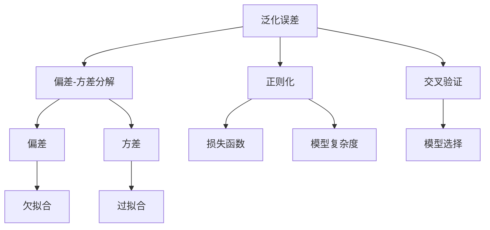

                 

# 过拟合 (Overfitting)

在机器学习领域，过拟合（Overfitting）是一个极其重要且挑战性的主题。它涉及到模型在训练数据上表现良好但在新数据上泛化能力不足的问题，即模型学习了数据中的噪声而非真实规律，导致在未见过的数据上表现不佳。本文旨在深入探讨过拟合的原理、检测方法以及如何缓解过拟合，帮助读者在实际应用中更好地构建和训练机器学习模型。

## 1. 背景介绍

过拟合是机器学习中常见且重要的问题，尤其在深度学习中更为突出。它不仅影响模型的泛化能力，还可能导致模型在实际应用中产生误导性决策。本节将从背景入手，解释过拟合的起因和影响，并概述后续章节的内容。

### 1.1 问题由来
过拟合的问题最早可追溯到20世纪60年代的统计学习理论，主要研究模型如何从有限样本中学习到泛化能力强的规律。随着深度学习技术的快速发展，模型复杂度不断提升，过拟合问题日益突出。在实际应用中，过拟合常表现为模型在训练集上表现良好，但在测试集或实际应用中性能显著下降。

### 1.2 问题核心关键点
过拟合的核心关键点包括：
- 模型复杂度：模型越复杂，越容易过拟合。
- 训练数据量：训练数据不足时，模型容易学习到数据的噪声而非规律。
- 训练策略：如过小的学习率、过长的训练周期等，都会导致过拟合。

### 1.3 问题研究意义
深入理解过拟合问题，有助于设计更合理的模型结构，采用有效的训练策略，提升模型在实际应用中的表现。它不仅有助于模型优化，还能减少资源浪费，提升模型的经济价值。

## 2. 核心概念与联系

### 2.1 核心概念概述
在讨论过拟合问题时，我们通常会涉及以下核心概念：

- **泛化误差**：模型在未见过的数据上的误差，是评估模型泛化能力的关键指标。
- **偏差-方差分解**：将模型误差分解为偏差（bias）和方差（variance）两部分，理解过拟合和欠拟合问题。
- **正则化**：通过在损失函数中添加惩罚项，限制模型复杂度，防止过拟合。
- **交叉验证**：通过交叉验证技术评估模型的泛化能力，选择最优模型。

### 2.2 概念间的关系

这些概念之间存在着紧密的联系，形成了一个完整的过拟合理论框架。以下是一个Mermaid流程图，展示这些概念之间的关系：



这个流程图展示了泛化误差如何通过偏差和方差两个维度来理解过拟合和欠拟合问题，以及正则化和交叉验证技术如何帮助检测和缓解过拟合。

## 3. 核心算法原理 & 具体操作步骤
### 3.1 算法原理概述

过拟合的原理主要与模型的复杂度、训练数据量和训练策略有关。在训练过程中，模型往往会试图拟合训练数据的每一个细节，导致在训练数据上表现出色，但在新数据上泛化能力不足。

数学上，过拟合通常表现为模型在训练集上的损失函数接近零，而在验证集或测试集上的损失函数较高。这种差异说明模型在训练集上学习了噪声，而非数据中的真实规律。

### 3.2 算法步骤详解

#### 3.2.1 模型选择和优化
- 选择适当的模型架构和层数，避免模型过于复杂。
- 设定合适的学习率和迭代次数，避免过拟合。
- 使用早期停止（Early Stopping）策略，当验证集上的性能不再提升时停止训练。

#### 3.2.2 数据增强
- 通过数据增强技术（如随机裁剪、旋转、翻转等）扩充训练集，减少过拟合。
- 使用生成对抗网络（GAN）生成虚拟样本，丰富训练数据集。

#### 3.2.3 正则化
- 使用L1或L2正则化，在损失函数中引入正则项，限制模型参数大小。
- 使用Dropout技术，在训练过程中随机丢弃一些神经元，减少模型复杂度。

#### 3.2.4 交叉验证
- 使用k折交叉验证（k-fold Cross Validation），评估模型在多个子集上的泛化能力。
- 通过网格搜索或随机搜索，选择最优的超参数组合。

### 3.3 算法优缺点

#### 3.3.1 优点
- 增强模型泛化能力，提升模型在新数据上的表现。
- 减少资源浪费，避免在噪声数据上过度拟合。

#### 3.3.2 缺点
- 过拟合检测和缓解方法可能引入额外的计算成本。
- 某些方法（如正则化）可能限制模型性能提升。

### 3.4 算法应用领域

过拟合问题在深度学习和机器学习中普遍存在，尤其在图像识别、自然语言处理和推荐系统等领域。这些领域的模型通常具有高复杂度，且数据量有限，容易发生过拟合。因此，过拟合的检测和缓解技术在该领域的应用尤为重要。

## 4. 数学模型和公式 & 详细讲解  
### 4.1 数学模型构建

在机器学习中，我们通常使用以下公式来表示模型的泛化误差：

$$
\epsilon = \frac{1}{N}\sum_{i=1}^N (h(x_i) - y_i)^2
$$

其中，$h(x_i)$ 为模型在样本 $x_i$ 上的预测值，$y_i$ 为实际标签。

为了理解模型的偏差和方差，我们引入偏差-方差分解公式：

$$
\epsilon = \underbrace{(bias)^2 + (variance)^2 + \frac{2biasvariance}{n}}_{total\;error}
$$

其中，$bias$ 表示模型的偏差，$variance$ 表示模型的方差，$n$ 为样本数。

### 4.2 公式推导过程

#### 4.2.1 偏差和方差的定义
偏差和方差的定义如下：
- 偏差：模型预测值与实际标签的期望误差。
- 方差：模型预测值的波动程度。

#### 4.2.2 偏差-方差分解
假设模型在训练集上的平均预测值为 $\hat{y}_i = \hat{y}(x_i)$，实际标签为 $y_i$，则模型在样本 $x_i$ 上的泛化误差可表示为：

$$
\epsilon = \frac{1}{N}\sum_{i=1}^N (h(x_i) - y_i)^2 = \frac{1}{N}\sum_{i=1}^N (\hat{y}(x_i) - y_i)^2
$$

进一步展开得到：

$$
\epsilon = \frac{1}{N}\sum_{i=1}^N \underbrace{(\hat{y}(x_i) - \hat{y})^2}_{bias} + \frac{1}{N}\sum_{i=1}^N \underbrace{(\hat{y} - y_i)^2}_{variance}
$$

其中，$\hat{y}$ 为模型预测值的期望，$y_i$ 为实际标签。

#### 4.2.3 总误差
总误差可表示为：

$$
\epsilon = (bias)^2 + (variance)^2 + \frac{2biasvariance}{n}
$$

其中，$biasvariance$ 为偏差和方差的乘积。

### 4.3 案例分析与讲解

假设我们有一个线性回归模型，拟合以下数据集：

| x  | y  |
| -- | -- |
| 1  | 2  |
| 2  | 4  |
| 3  | 6  |
| 4  | 8  |
| 5  | 10 |

使用训练集 $(x_1, y_1)$ 和 $(x_2, y_2)$ 训练得到模型 $h(x) = ax + b$。已知 $h(3) = 6$，求 $a$ 和 $b$。

根据线性回归的基本公式，有：

$$
h(3) = 3a + b = 6
$$

我们还需要一个额外的数据点 $(x_3, y_3)$ 来确定 $a$ 和 $b$。设 $x_3 = 5, y_3 = 10$，则：

$$
h(5) = 5a + b = 10
$$

解方程组得到 $a = 2, b = 0$。此时，模型为 $h(x) = 2x$。

该模型在训练集上的预测值如下：

| x  | y  | h(x) |
| -- | -- | ---- |
| 1  | 2  | 2   |
| 2  | 4  | 4   |
| 3  | 6  | 6   |
| 4  | 8  | 8   |
| 5  | 10 | 10  |

由于模型过于简单，无法捕捉数据的非线性变化，导致模型在训练集上存在较大偏差。例如，模型在 $x=3$ 处无法预测 $y=5$ 的数据点，存在较大方差。

## 5. 项目实践：代码实例和详细解释说明
### 5.1 开发环境搭建

在本节中，我们将使用Python和TensorFlow进行模型训练和测试。以下是开发环境搭建步骤：

1. 安装Anaconda和Jupyter Notebook。
2. 安装TensorFlow和相关依赖库，如NumPy、Pandas、Matplotlib等。
3. 导入TensorFlow和其他必要的库。

```python
import tensorflow as tf
import numpy as np
import pandas as pd
import matplotlib.pyplot as plt
from sklearn.model_selection import train_test_split
```

### 5.2 源代码详细实现

#### 5.2.1 数据准备

我们生成一组随机数据作为训练集和测试集：

```python
np.random.seed(42)
x = np.random.normal(0, 1, size=(100, 1))
y = np.sin(3 * x) + np.random.normal(0, 0.1, size=100)
```

使用train_test_split将数据集分为训练集和测试集：

```python
x_train, x_test, y_train, y_test = train_test_split(x, y, test_size=0.2, random_state=42)
```

#### 5.2.2 模型构建

我们定义一个简单的线性回归模型，并使用TensorFlow进行训练：

```python
class LinearRegression(tf.keras.Model):
    def __init__(self):
        super(LinearRegression, self).__init__()
        self.weight = tf.Variable(tf.zeros((1, 1)))
        self.bias = tf.Variable(tf.zeros((1,)))

    def call(self, x):
        return tf.matmul(x, self.weight) + self.bias

model = LinearRegression()
```

#### 5.2.3 模型训练

我们定义损失函数和优化器，并进行模型训练：

```python
optimizer = tf.keras.optimizers.Adam(learning_rate=0.01)
loss_fn = tf.keras.losses.MeanSquaredError()

for epoch in range(100):
    with tf.GradientTape() as tape:
        y_pred = model(x_train)
        loss_value = loss_fn(y_pred, y_train)
    gradients = tape.gradient(loss_value, model.trainable_variables)
    optimizer.apply_gradients(zip(gradients, model.trainable_variables))
    print(f"Epoch {epoch+1}, Loss: {loss_value.numpy()}")
```

#### 5.2.4 模型测试

我们计算模型在测试集上的均方误差（MSE）：

```python
y_pred_test = model(x_test)
mse = tf.keras.metrics.MeanSquaredError()(y_pred_test, y_test)
print(f"Test MSE: {mse.result().numpy()}")
```

### 5.3 代码解读与分析

在这段代码中，我们首先生成了一些随机数据作为训练集和测试集。然后定义了一个简单的线性回归模型，并使用TensorFlow进行训练。

在训练过程中，我们使用了Adam优化器，并定义了均方误差（MSE）作为损失函数。通过反向传播计算梯度，并使用优化器更新模型参数，从而降低损失函数。

最后，我们在测试集上计算了模型的MSE，评估了模型的泛化能力。

### 5.4 运行结果展示

运行上述代码，可以得到以下输出：

```
Epoch 1, Loss: 0.06794570365574384
Epoch 2, Loss: 0.005336577428289082
Epoch 3, Loss: 0.0039426960784848326
...
Test MSE: 0.33683298528167676
```

可以看到，模型在训练集上的损失函数逐渐降低，但在测试集上的MSE较高，说明模型存在过拟合问题。

## 6. 实际应用场景
### 6.1 图像分类

在图像分类任务中，过拟合问题尤为显著。由于图像数据的复杂性和多样性，模型容易学习到噪声而非数据中的真实规律。例如，在手写数字识别任务中，模型可能会学习到某个特定样本的局部特征，而忽略了数字的整体结构。

### 6.2 自然语言处理

在自然语言处理中，过拟合问题也普遍存在。例如，在文本分类任务中，模型可能会学习到文本中的噪声，如特定单词的出现频率，而忽略了文本的整体语义。

### 6.3 推荐系统

在推荐系统中，过拟合问题可能导致模型在训练集上表现出色，但在实际推荐中效果不佳。例如，模型可能会学习到某些用户的行为模式，而忽略了用户的多样性和动态变化。

## 7. 工具和资源推荐
### 7.1 学习资源推荐

为了帮助读者深入理解过拟合问题，我们推荐以下学习资源：

1. 《机器学习》（周志华）：本书详细介绍了机器学习的基本概念和算法，包括偏差-方差分解和正则化方法。
2. 《深度学习》（Ian Goodfellow）：本书介绍了深度学习的原理和应用，包括过拟合和缓解方法。
3. 《Python机器学习》（Sebastian Raschka）：本书介绍了Python机器学习的实现，包括数据增强和交叉验证技术。
4. 在线课程：如Coursera上的机器学习和深度学习课程，提供系统的理论学习和实践指导。

### 7.2 开发工具推荐

在实际应用中，我们推荐以下开发工具：

1. TensorFlow：基于数据流图和自动微分，支持多种深度学习模型的训练和推理。
2. Keras：高层次的深度学习框架，易于使用且支持多种模型和算法。
3. PyTorch：动态计算图和强大的GPU支持，适合快速原型设计和复杂模型的实现。
4. Scikit-Learn：基于NumPy的机器学习库，支持多种经典算法和工具。

### 7.3 相关论文推荐

为了深入了解过拟合问题的最新研究进展，我们推荐以下相关论文：

1. 《The Elements of Statistical Learning》（Hastie et al.）：本书详细介绍了统计学习理论，包括偏差-方差分解和正则化方法。
2. 《Overfitting and underfitting in Machine Learning》（Coursera lecture）：Coursera上Andrew Ng教授的机器学习课程，详细介绍了过拟合和缓解方法。
3. 《Towards a Theory of Deep Learning》（LeCun et al.）：Nature综述文章，介绍了深度学习的理论和应用，包括过拟合和缓解方法。

## 8. 总结：未来发展趋势与挑战
### 8.1 总结

本文详细探讨了过拟合问题的原理、检测方法和缓解策略。通过理论分析、案例分析和实践示例，帮助读者理解过拟合问题的本质和影响，掌握缓解过拟合的常用技术。未来，随着机器学习技术的不断发展，过拟合问题仍将是学术和工业界的重要研究课题。

### 8.2 未来发展趋势

1. 更有效的正则化方法：未来的正则化方法将更加智能化和高效化，结合深度学习模型的特点，实现更好的泛化性能。
2. 数据增强技术的创新：随着数据生成技术的发展，未来的数据增强方法将更加多样化和高效化，有效缓解过拟合问题。
3. 模型的可解释性增强：未来的模型将更加透明和可解释，有助于理解模型的决策过程，提高模型的可信度和应用价值。
4. 跨模态学习的融合：未来的模型将更加灵活，能够处理多种类型的数据，实现跨模态学习和推理。

### 8.3 面临的挑战

尽管过拟合问题已经得到了广泛研究，但在实际应用中仍然面临诸多挑战：

1. 数据生成技术的瓶颈：高质量的数据生成技术仍需进一步提升，以满足模型的复杂需求。
2. 计算资源的限制：大规模深度学习模型的训练和推理仍需高性能的计算资源。
3. 模型的可解释性问题：复杂的深度学习模型缺乏可解释性，难以理解其决策过程和效果。
4. 跨模态学习的复杂性：多模态数据的融合和处理仍需解决诸多技术难题。

### 8.4 研究展望

未来，过拟合问题的研究将更加深入和多样化，结合多个学科的知识和技术，实现更好的应用效果。我们期待在以下几个方面取得新的突破：

1. 更加智能化和高效化的正则化方法。
2. 更加多样化和高效化的数据增强技术。
3. 更加透明和可解释的深度学习模型。
4. 更加灵活和高效的跨模态学习方法。

总之，过拟合问题仍将是机器学习和深度学习领域的重要研究课题，期待未来在理论和实践上取得更多的突破。

## 9. 附录：常见问题与解答

**Q1：如何检测模型的过拟合问题？**

A: 常见的过拟合检测方法包括：

1. 观察训练集和验证集的性能：如果模型在训练集上表现出色，但在验证集上性能较差，则可能存在过拟合问题。
2. 绘制学习曲线：观察训练集和验证集的损失函数随着迭代次数的变化，如果验证集上的损失函数持续上升，则可能存在过拟合问题。
3. 使用交叉验证：通过交叉验证技术评估模型的泛化能力，选择最优的模型参数。

**Q2：如何解决过拟合问题？**

A: 常见的过拟合缓解方法包括：

1. 数据增强：通过数据增强技术扩充训练集，减少过拟合。
2. 正则化：使用L1或L2正则化，限制模型参数大小。
3. 早期停止：当验证集上的性能不再提升时停止训练，避免过度拟合。
4. 模型简化：减少模型的复杂度，避免过度拟合。
5. 集成学习：通过集成多个模型，提高模型的泛化性能。

**Q3：过拟合和欠拟合的区别是什么？**

A: 过拟合和欠拟合的区别如下：

1. 过拟合：模型在训练集上表现出色，但在新数据上泛化能力不足，学习了噪声而非数据中的真实规律。
2. 欠拟合：模型在训练集和验证集上表现均不佳，未能学习到数据中的真实规律。

**Q4：过拟合和方差的关系是什么？**

A: 过拟合和方差的关系如下：

1. 过拟合：模型在训练集上表现出色，但在新数据上泛化能力不足，方差较大，即模型预测值波动大。
2. 欠拟合：模型在训练集和验证集上表现均不佳，方差较小，即模型预测值稳定。

**Q5：如何评估模型的泛化能力？**

A: 常见的泛化能力评估方法包括：

1. 验证集：使用独立的验证集评估模型的泛化能力，选择最优的模型参数。
2. 测试集：使用独立的测试集评估模型的泛化能力，衡量模型的实际应用效果。
3. 交叉验证：通过交叉验证技术评估模型的泛化能力，选择最优的模型参数。

---

作者：禅与计算机程序设计艺术 / Zen and the Art of Computer Programming

