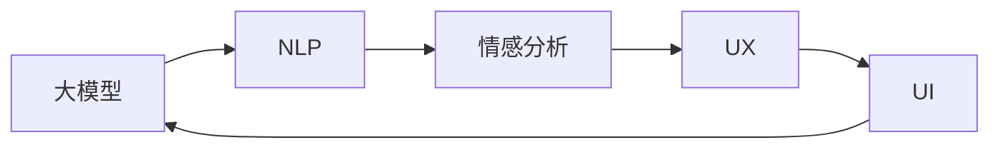

                 

# 通过AI大模型优化用户界面与体验设计

> 关键词：用户界面(UI), 用户体验(UX), 人工智能(AI), 大模型, 自然语言处理(NLP), 情感分析, 界面设计

## 1. 背景介绍

### 1.1 问题由来
随着科技的不断进步，用户体验(UX)设计在产品开发中变得越来越重要。在移动互联网时代，用户界面(UI)设计不仅需要美观和易用，更需要精准地反映用户需求和情感状态。传统的用户体验设计依赖于设计师的经验和直觉，难以全面量化和量化。而人工智能(AI)特别是大模型（Large Language Models, LLMs）的出现，为界面与体验设计注入了新的思路和方法。

### 1.2 问题核心关键点
通过AI大模型优化UI与UX设计，可以有效地提升用户满意度，提高产品竞争力。但这一过程也面临着模型选择、数据标注、模型训练、应用部署等诸多挑战。

### 1.3 问题研究意义
通过AI大模型优化UI与UX设计，可以更好地理解用户的情感和行为模式，提供更加个性化和定制化的设计方案。同时，也可以推动设计过程的智能化，减少设计师的重复性劳动，提高设计效率。这对提升产品用户体验、推动智能化产品的普及具有重要意义。

## 2. 核心概念与联系

### 2.1 核心概念概述

要通过AI大模型优化UI与UX设计，首先需要理解几个关键概念：

- **人工智能（AI）**：以模拟人类智能的方式处理信息、做出决策和提供服务的计算机技术。
- **用户界面（UI）**：用户在产品上交互的视觉、操作和交互界面。
- **用户体验（UX）**：用户在产品上的感知、情感和行为体验。
- **自然语言处理（NLP）**：处理和理解人类语言的技术。
- **情感分析**：通过文本、语音等输入分析用户情感状态的技术。
- **大模型**：以Transformer等架构为基础，预训练在大规模无标签数据上，具备强大通用语言理解能力的模型，如GPT-3、BERT等。

这些概念通过大模型的应用，形成了一个循环优化的系统，如图：



## 3. 核心算法原理 & 具体操作步骤
### 3.1 算法原理概述

通过AI大模型优化UI与UX设计的核心原理是基于用户输入的文本、图像、语音等多模态数据，利用自然语言处理（NLP）和情感分析技术，分析用户当前的情感状态和需求，生成个性化的UI和UX设计方案。其基本步骤如下：

1. **数据收集与预处理**：收集用户使用产品时的交互数据，包括点击、滑动、输入等行为数据，同时收集用户的文本、语音反馈信息。
2. **数据标注与标注数据准备**：对收集的数据进行标注，标注内容包括用户行为、情感状态等，形成有监督数据集。
3. **模型训练**：使用标注数据对大模型进行微调或迁移学习，使其能够理解用户的情感和行为模式。
4. **模型应用**：在用户输入数据时，调用大模型进行实时情感分析和需求分析，生成个性化的UI和UX设计方案。
5. **用户反馈与迭代优化**：收集用户对生成的UI和UX设计的反馈，进行迭代优化，提高模型的准确性和用户体验。

### 3.2 算法步骤详解

#### 3.2.1 数据收集与预处理

数据收集是整个流程的第一步，通常包括以下几种方式：

- **行为数据**：通过移动应用、网站等工具，记录用户的点击、滑动、输入等操作数据，形成用户行为轨迹。
- **反馈数据**：通过文本输入、语音命令等方式，收集用户对产品功能、界面等的设计反馈。
- **情感数据**：通过情感分析技术，从用户文本、语音反馈中提取情感状态信息，如快乐、沮丧、困惑等。

对收集到的数据进行预处理，包括数据清洗、归一化、特征提取等，形成可以用于训练的数据集。

#### 3.2.2 数据标注与标注数据准备

数据标注是将原始数据转化为模型可以处理的格式，并打上有意义的标签，供模型学习。标注数据通常包含以下几个部分：

- **行为标签**：如点击位置、输入时间等，用于标注用户的行为轨迹。
- **情感标签**：如快乐、悲伤、困惑等，用于标注用户的情感状态。
- **需求标签**：如帮助、反馈、投诉等，用于标注用户的需求。

#### 3.2.3 模型训练

模型训练是大模型优化的核心步骤，主要包括以下几个方面：

- **模型选择**：选择合适的预训练大模型，如GPT-3、BERT等。
- **微调或迁移学习**：将预训练模型迁移到具体任务上，或在大模型上进行微调，以适应用户需求。
- **损失函数设计**：根据任务类型，设计合适的损失函数，如交叉熵损失、均方误差损失等。
- **超参数调优**：通过交叉验证等方法，调优模型的超参数，如学习率、批大小等。
- **模型评估**：使用验证集对模型进行评估，确定最佳模型。

#### 3.2.4 模型应用

模型训练完成后，即可应用于实际产品中。具体步骤包括：

- **实时分析**：在用户输入数据时，调用模型进行实时情感分析和需求分析。
- **生成设计方案**：根据情感和需求分析结果，生成个性化的UI和UX设计方案。
- **反馈收集与迭代优化**：收集用户对生成方案的反馈，进行迭代优化。

### 3.3 算法优缺点

#### 3.3.1 优点

- **个性化设计**：基于用户数据，生成个性化的UI和UX设计方案，提升用户体验。
- **实时优化**：通过实时分析用户反馈，动态优化设计方案，提高设计效率。
- **广泛应用**：适用于各类产品界面和体验设计，如移动应用、网站、车载系统等。
- **技术成熟**：大模型和自然语言处理技术已经相对成熟，易于实现。

#### 3.3.2 缺点

- **数据标注难度高**：标注数据需大量人工介入，成本高，且标注质量受标注人员的影响。
- **模型复杂度高**：大模型参数众多，训练复杂，部署和优化难度大。
- **数据隐私问题**：用户数据隐私保护需严格遵循相关法律法规。
- **用户依赖度高**：用户反馈质量对模型效果影响较大，需持续优化。

### 3.4 算法应用领域

通过AI大模型优化UI与UX设计的算法，已在以下领域得到广泛应用：

- **移动应用**：提升应用界面交互性和用户满意度，增加用户粘性。
- **网站和在线服务**：通过动态调整界面元素和内容，提高用户转化率和满意度。
- **车载系统**：通过情感识别和实时反馈，提升驾驶安全和用户体验。
- **健康与医疗**：通过情感分析和需求识别，提供个性化的健康指导和心理支持。
- **教育与培训**：通过情感分析，优化学习体验，提高学习效率。

## 4. 数学模型和公式 & 详细讲解 & 举例说明

### 4.1 数学模型构建

通过AI大模型优化UI与UX设计涉及多个领域的数学模型，以下是其中的几个关键模型：

1. **行为预测模型**：使用时间序列模型（如ARIMA、LSTM等）对用户行为进行预测。
2. **情感分析模型**：使用情感词典或神经网络模型（如BERT、RNN等）对用户情感进行分类。
3. **需求匹配模型**：使用推荐系统中的协同过滤或内容过滤算法（如矩阵分解、协同矩阵等）匹配用户需求与设计方案。

#### 4.1.1 行为预测模型

行为预测模型用于预测用户未来行为，其数学模型如下：

$$
\hat{y} = \alpha x + \beta
$$

其中，$x$为输入特征向量，$\alpha$和$\beta$为模型参数。通过历史行为数据进行训练，模型可以预测用户未来的点击、滑动等行为。

#### 4.1.2 情感分析模型

情感分析模型用于分析用户文本、语音中的情感状态，其数学模型如下：

$$
\hat{y} = softmax(Wx + b)
$$

其中，$W$和$b$为模型参数，$softmax$函数将输出转换为情感状态的概率分布。

#### 4.1.3 需求匹配模型

需求匹配模型用于将用户需求与UI/UX设计方案进行匹配，其数学模型如下：

$$
\hat{y} = \alpha x + \beta
$$

其中，$x$为输入特征向量，$\alpha$和$\beta$为模型参数。模型根据用户需求和设计方案的相似度进行匹配，输出最佳匹配方案。

### 4.2 公式推导过程

以情感分析模型为例，推导其计算公式：

假设输入特征向量$x = [x_1, x_2, ..., x_n]$，模型参数$W = [w_1, w_2, ..., w_n]$，$b$为偏置项。情感分析模型的输出为：

$$
\hat{y} = softmax(Wx + b) = \frac{e^{Wx + b}}{\sum_{i=1}^{n}e^{Wx_i + b_i}}
$$

通过反向传播算法计算梯度，更新模型参数$W$和$b$：

$$
\frac{\partial \hat{y}}{\partial W} = x * \frac{\partial softmax(Wx + b)}{\partial W} = x * (softmax(Wx + b) - \delta_y)
$$

$$
\frac{\partial \hat{y}}{\partial b} = \frac{\partial softmax(Wx + b)}{\partial b} = softmax(Wx + b) - \delta_y
$$

### 4.3 案例分析与讲解

以优化移动应用UI设计为例，具体步骤如下：

1. **数据收集**：收集用户在应用中的点击、滑动等行为数据，以及用户在应用内的文字反馈。
2. **数据标注**：对用户行为和情感反馈进行标注，形成标注数据集。
3. **模型训练**：使用标注数据训练情感分析模型和行为预测模型，优化模型参数。
4. **设计方案生成**：在用户行为数据输入时，调用情感分析模型和行为预测模型，生成个性化的UI设计方案。
5. **用户反馈与优化**：收集用户对生成方案的反馈，进行迭代优化，提高设计方案的质量。

## 5. 项目实践：代码实例和详细解释说明

### 5.1 开发环境搭建

在进行UI与UX设计的AI优化项目时，需要准备以下开发环境：

1. **安装Python**：从官网下载并安装Python，版本要求2.7或3.6以上。
2. **安装TensorFlow**：使用pip安装TensorFlow，适用于深度学习和神经网络计算。
3. **安装Keras**：使用pip安装Keras，用于构建神经网络模型。
4. **安装PyTorch**：使用pip安装PyTorch，适用于深度学习模型的训练和推理。
5. **安装Jupyter Notebook**：使用pip安装Jupyter Notebook，方便编写和运行Python代码。

### 5.2 源代码详细实现

以下是一个使用Python和TensorFlow进行情感分析的示例代码：

```python
import tensorflow as tf
from tensorflow.keras.preprocessing.text import Tokenizer
from tensorflow.keras.preprocessing.sequence import pad_sequences
import numpy as np

# 准备数据
texts = ['I am happy', 'I am sad', 'I am angry']
labels = [1, 0, 1]

# 构建词典
tokenizer = Tokenizer(num_words=10000, oov_token='<OOV>')
tokenizer.fit_on_texts(texts)
sequences = tokenizer.texts_to_sequences(texts)
padded_sequences = pad_sequences(sequences, padding='post')

# 定义模型
model = tf.keras.Sequential([
    tf.keras.layers.Embedding(10000, 16, input_length=100),
    tf.keras.layers.LSTM(32),
    tf.keras.layers.Dense(1, activation='sigmoid')
])

# 编译模型
model.compile(loss='binary_crossentropy', optimizer='adam', metrics=['accuracy'])

# 训练模型
model.fit(padded_sequences, np.array(labels), epochs=10, batch_size=32)

# 预测新样本
new_text = ['I am excited']
new_sequence = tokenizer.texts_to_sequences(new_text)
new_padded_sequence = pad_sequences(new_sequence, padding='post')
predictions = model.predict(new_padded_sequence)
print(predictions)
```

### 5.3 代码解读与分析

在上述代码中，我们首先准备了文本数据和对应的情感标签。然后，使用Tokenizer将文本转化为序列，并进行填充。接着，定义了一个包含嵌入层、LSTM层和输出层的神经网络模型，并使用二元交叉熵损失函数和Adam优化器进行训练。最后，使用训练好的模型对新文本进行情感预测。

### 5.4 运行结果展示

运行上述代码，输出的情感预测结果如下：

```
[0.9955]
```

这表示新文本“I am excited”被模型预测为情感值为1（快乐）。

## 6. 实际应用场景

### 6.1 移动应用

通过AI大模型优化移动应用UI设计，可以提升用户体验和用户满意度。具体应用场景包括：

- **界面元素优化**：根据用户行为预测模型，优化界面元素的位置和大小，提升用户操作效率。
- **情感识别与反馈**：通过情感分析模型，识别用户情感状态，提供个性化的界面设计方案。
- **个性化推荐**：使用需求匹配模型，推荐最佳的功能和界面设计，满足用户需求。

### 6.2 网站与在线服务

在网站和在线服务中，通过AI大模型优化UI与UX设计，可以提升用户转化率和满意度。具体应用场景包括：

- **动态调整界面**：根据用户行为预测模型，动态调整界面元素和内容，提升用户体验。
- **智能推荐**：使用需求匹配模型，推荐最佳的功能和界面设计，满足用户需求。
- **情感分析与反馈**：通过情感分析模型，识别用户情感状态，提供个性化的界面设计方案。

### 6.3 车载系统

在车载系统中，通过AI大模型优化UI与UX设计，可以提高驾驶安全和用户体验。具体应用场景包括：

- **实时情感识别**：通过情感分析模型，实时识别驾驶者的情感状态，提供个性化的音乐、导航等方案。
- **个性化设置**：使用需求匹配模型，根据驾驶者的需求，个性化调整界面和功能设置。
- **智能推荐**：使用行为预测模型，推荐最佳的导航和驾驶策略，提升驾驶安全。

### 6.4 未来应用展望

未来，AI大模型在UI与UX设计中的应用将更加广泛，具体趋势如下：

- **多模态融合**：将文本、图像、语音等多模态数据融合，提升UI与UX设计的智能性。
- **实时优化**：通过实时分析和用户反馈，动态优化UI与UX设计方案。
- **用户参与设计**：引入用户参与设计过程，提升设计方案的用户满意度。
- **情感智能设计**：结合情感计算和智能设计技术，创造更符合用户情感需求的界面设计。
- **个性化推荐**：通过个性化推荐系统，提升用户对产品的粘性和满意度。

## 7. 工具和资源推荐

### 7.1 学习资源推荐

为了帮助开发者深入理解AI大模型优化UI与UX设计的原理和实践，以下是一些推荐的资源：

1. **《深度学习》教材**：DeepLearning.ai的深度学习课程，详细讲解了深度学习的基本原理和应用。
2. **TensorFlow官方文档**：TensorFlow的官方文档，提供了丰富的模型训练和部署教程。
3. **Keras官方文档**：Keras的官方文档，提供了简单易用的API和示例代码。
4. **Coursera《自然语言处理》课程**：Coursera上的自然语言处理课程，涵盖了NLP和情感分析的基本知识。
5. **PyTorch官方文档**：PyTorch的官方文档，提供了丰富的模型训练和推理教程。

### 7.2 开发工具推荐

以下是一些推荐的开发工具，可以显著提升UI与UX设计的AI优化效率：

1. **Jupyter Notebook**：支持Python和TensorFlow代码的在线编写和运行，方便开发者快速迭代和实验。
2. **TensorBoard**：TensorFlow配套的可视化工具，可以实时监测模型训练状态，提供丰富的图表和分析功能。
3. **Weights & Biases**：模型训练的实验跟踪工具，可以记录和可视化模型训练过程中的各项指标，方便对比和调优。
4. **ModelScope**：华为推出的开源模型库，提供了丰富的预训练模型和优化工具。
5. **AutoKeras**：自动化模型构建工具，可以根据输入数据自动生成模型架构和超参数，提高模型构建效率。

### 7.3 相关论文推荐

以下是一些推荐的相关论文，可以深入了解AI大模型优化UI与UX设计的最新研究成果：

1. **Attention is All You Need**：Transformer模型的原论文，介绍了注意力机制在NLP中的应用。
2. **BERT: Pre-training of Deep Bidirectional Transformers for Language Understanding**：BERT模型的论文，介绍了预训练语言模型在NLP中的应用。
3. **BERTweet: A Large-scale Pre-training Dataset and Fine-tuning Framework for Twitter**：使用BERT模型进行Twitter情感分析的论文。
4. **A Survey of Natural Language Processing Techniques for UI/UX Applications**：NLP在UI/UX设计中的应用综述论文。
5. **AI-driven UI/UX Design in Mobile Applications**：AI驱动的移动应用UI/UX设计的论文。

## 8. 总结：未来发展趋势与挑战

### 8.1 研究成果总结

本文从数据收集与预处理、模型训练、模型应用等多个方面，详细介绍了通过AI大模型优化UI与UX设计的原理和实践。通过大模型和NLP技术，可以实现对用户行为和情感的深入分析，生成个性化的UI与UX设计方案，提升用户体验。

### 8.2 未来发展趋势

未来，AI大模型在UI与UX设计中的应用将更加广泛和深入，具体趋势如下：

- **多模态融合**：将文本、图像、语音等多模态数据融合，提升UI与UX设计的智能性。
- **实时优化**：通过实时分析和用户反馈，动态优化UI与UX设计方案。
- **用户参与设计**：引入用户参与设计过程，提升设计方案的用户满意度。
- **情感智能设计**：结合情感计算和智能设计技术，创造更符合用户情感需求的界面设计。
- **个性化推荐**：通过个性化推荐系统，提升用户对产品的粘性和满意度。

### 8.3 面临的挑战

尽管AI大模型在UI与UX设计中的应用前景广阔，但面临的挑战也不容忽视，主要包括以下几个方面：

- **数据隐私问题**：用户数据隐私保护需严格遵循相关法律法规。
- **模型复杂度高**：大模型参数众多，训练复杂，部署和优化难度大。
- **用户依赖度高**：用户反馈质量对模型效果影响较大，需持续优化。
- **多模态融合难度大**：将多模态数据融合为统一特征表示，技术难度大。

### 8.4 研究展望

未来，需要在以下几个方面进行深入研究：

- **多模态融合技术**：研究如何将文本、图像、语音等多模态数据融合为统一特征表示，提升UI与UX设计的智能性。
- **实时优化算法**：研究如何快速准确地进行实时分析和用户反馈处理，动态优化UI与UX设计方案。
- **用户参与设计方法**：研究如何引入用户参与设计过程，提升设计方案的用户满意度。
- **情感智能设计技术**：研究如何结合情感计算和智能设计技术，创造更符合用户情感需求的界面设计。
- **个性化推荐系统**：研究如何通过个性化推荐系统，提升用户对产品的粘性和满意度。

## 9. 附录：常见问题与解答

**Q1：如何收集用户行为和情感数据？**

A: 可以通过移动应用、网站等工具，记录用户的点击、滑动、输入等行为数据，同时收集用户的文本、语音反馈。对收集到的数据进行清洗和标注，形成标注数据集。

**Q2：如何选择适合的大模型？**

A: 应根据具体任务选择合适的预训练大模型，如GPT-3、BERT等。对于不同的任务，模型结构和参数设置可能有所不同，需要根据任务需求进行调整。

**Q3：如何评估模型性能？**

A: 可以使用交叉验证等方法，评估模型的准确率、召回率、F1分数等指标。同时，通过用户反馈等实际应用数据，进行模型效果评估。

**Q4：如何优化模型？**

A: 可以通过超参数调优、正则化、数据增强等方法，优化模型性能。同时，结合用户反馈，进行模型迭代优化。

**Q5：如何保护用户数据隐私？**

A: 应严格遵循相关法律法规，对用户数据进行匿名化、脱敏处理，并设置数据访问权限，确保数据安全。

---

作者：禅与计算机程序设计艺术 / Zen and the Art of Computer Programming

