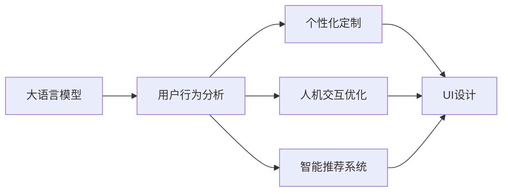
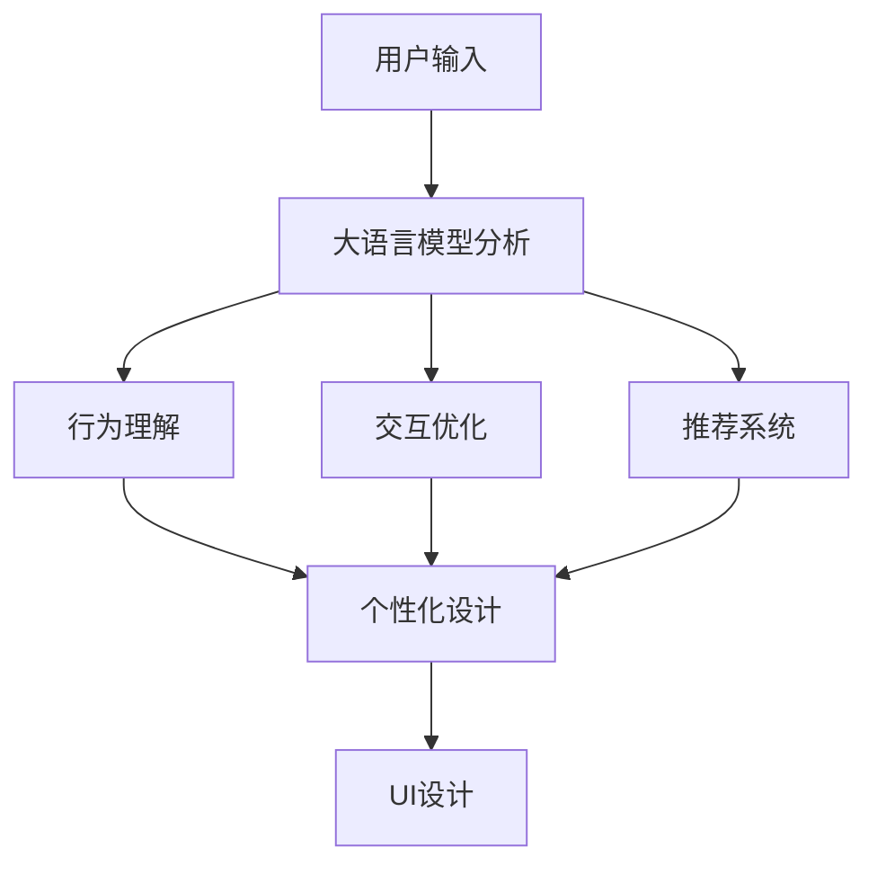
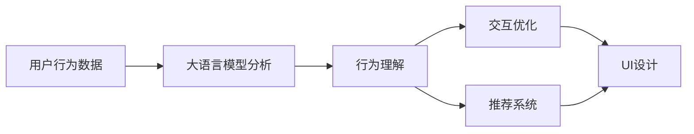
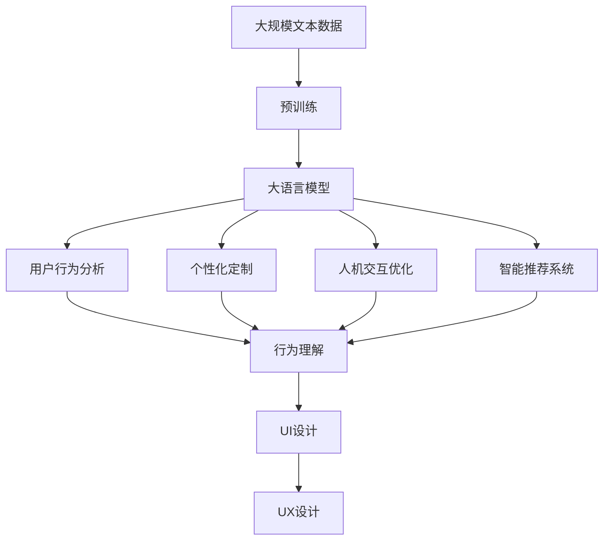

                 

# 通过AI大模型优化用户界面与体验设计

> 关键词：大语言模型,用户界面(UI),用户体验(UX),UI/UX设计,用户反馈分析,个性化定制,人机交互优化,智能推荐系统

## 1. 背景介绍

### 1.1 问题由来
随着人工智能技术的飞速发展，用户体验设计（User Experience Design, UX）也逐渐开始融入AI技术，尤其是在UI（User Interface）设计中。大语言模型作为AI的重要分支之一，因其强大的自然语言处理能力，成为优化UI设计的有力工具。本文将探讨如何使用大语言模型，从用户行为分析、个性化定制、交互优化等多个方面，提升UI/UX设计的水平，为应用程序带来更佳的用户体验。

### 1.2 问题核心关键点
大语言模型在UI/UX设计中的应用主要体现在以下几个方面：
- **用户行为分析**：通过分析用户输入的自然语言，理解其意图和需求，优化UI元素和交互方式。
- **个性化定制**：利用大语言模型的预测能力，为用户推荐定制化的UI设计方案，提升用户体验。
- **人机交互优化**：通过自动生成的交互提示，引导用户更自然、更高效地完成任务。
- **智能推荐系统**：根据用户行为和偏好，动态调整UI布局和内容，提供精准的个性化推荐。

### 1.3 问题研究意义
大语言模型在UI/UX设计中的应用，能够显著提升UI设计的精准性和个性化程度，缩短设计周期，降低设计成本，从而提高用户满意度和产品竞争力。通过对大语言模型的研究，可以更好地理解用户需求，优化UI/UX设计，推动人工智能技术在用户体验领域的创新和应用。

## 2. 核心概念与联系

### 2.1 核心概念概述

为更好地理解大语言模型在UI/UX设计中的应用，本节将介绍几个密切相关的核心概念：

- **大语言模型(Large Language Model, LLM)**：以自回归(如GPT)或自编码(如BERT)模型为代表的大规模预训练语言模型。通过在大规模无标签文本语料上进行预训练，学习通用的语言表示，具备强大的语言理解和生成能力。

- **用户界面(UI)设计**：涉及应用程序的外观、交互、布局等视觉和交互元素的设计。

- **用户体验(UX)设计**：关注用户在使用产品过程中的心理、情感和行为，通过UI设计来提升用户满意度和使用效率。

- **个性化定制**：根据用户的历史行为和偏好，提供定制化的UI设计方案，满足不同用户的需求。

- **人机交互优化**：通过自然语言理解技术，自动生成交互提示，提升用户的操作效率和满意度。

- **智能推荐系统**：利用机器学习算法，根据用户行为和兴趣，动态推荐UI内容和布局。

这些核心概念之间的逻辑关系可以通过以下Mermaid流程图来展示：



这个流程图展示了大语言模型在UI/UX设计中的应用框架：

1. 大语言模型通过分析用户行为，生成个性化定制、交互优化和推荐系统方案。
2. 这些方案再结合UI设计，最终形成符合用户需求的UI/UX设计。

### 2.2 概念间的关系

这些核心概念之间存在着紧密的联系，形成了大语言模型在UI/UX设计中的完整应用体系。下面我们通过几个Mermaid流程图来展示这些概念之间的关系。

#### 2.2.1 大语言模型的应用流程



这个流程图展示了大语言模型在UI/UX设计中的主要应用流程：

1. 用户输入自然语言，大语言模型进行分析和理解。
2. 根据分析结果，生成行为理解、交互优化和推荐系统方案。
3. 这些方案结合UI设计，生成个性化的UI/UX设计。

#### 2.2.2 UI/UX设计的优化流程



这个流程图展示了从用户行为数据到最终UI设计的优化流程：

1. 收集用户行为数据，传入大语言模型进行分析。
2. 生成行为理解、交互优化和推荐系统方案。
3. 根据方案优化UI设计，提升用户体验。

### 2.3 核心概念的整体架构

最后，我们用一个综合的流程图来展示这些核心概念在大语言模型应用中的整体架构：



这个综合流程图展示了从预训练到最终UI/UX设计的完整过程。大语言模型首先在大规模文本数据上进行预训练，然后通过分析用户行为生成个性化定制、交互优化和推荐系统方案，最终结合UI设计形成个性化的UI/UX设计。

## 3. 核心算法原理 & 具体操作步骤
### 3.1 算法原理概述

基于大语言模型的UI/UX设计优化，主要利用大语言模型的自然语言处理能力和预测能力，从用户行为分析、个性化定制、交互优化和推荐系统等多个角度，提升UI/UX设计的精准性和个性化程度。

具体而言，大语言模型可以通过以下几个步骤完成UI/UX设计的优化：

1. **用户行为分析**：将用户的自然语言输入传入大语言模型，通过自然语言理解技术，解析用户意图和需求。
2. **个性化定制**：根据用户行为分析结果，利用大语言模型的预测能力，生成定制化的UI设计方案。
3. **人机交互优化**：通过自然语言生成技术，自动生成交互提示和引导，提升用户的操作效率和满意度。
4. **智能推荐系统**：利用机器学习算法，根据用户行为和兴趣，动态推荐UI内容和布局。

### 3.2 算法步骤详解

以下是基于大语言模型进行UI/UX设计优化的详细步骤：

#### 3.2.1 用户行为分析

用户行为分析是大语言模型在UI/UX设计中的第一步。具体步骤如下：

1. **收集用户输入数据**：通过文本、语音、图像等多种方式，收集用户在应用程序中的行为数据。
2. **数据预处理**：对收集到的数据进行清洗、分词、去除停用词等预处理步骤。
3. **输入大语言模型**：将预处理后的数据传入大语言模型，进行自然语言理解。
4. **解析用户意图**：利用大语言模型的解析能力，提取用户意图和需求，生成行为理解结果。

#### 3.2.2 个性化定制

个性化定制是基于用户行为分析结果，生成符合用户需求的UI设计方案。具体步骤如下：

1. **分析行为数据**：根据用户行为理解结果，分析用户的偏好、兴趣和需求。
2. **生成定制化方案**：利用大语言模型的预测能力，生成个性化的UI设计方案，如界面布局、颜色搭配、元素样式等。
3. **优化方案**：结合设计师的经验，对生成方案进行调整和优化，确保方案符合UI设计规范和用户体验要求。

#### 3.2.3 人机交互优化

人机交互优化是通过自然语言生成技术，自动生成交互提示和引导，提升用户的操作效率和满意度。具体步骤如下：

1. **生成交互提示**：根据用户行为理解结果，利用大语言模型的自然语言生成能力，自动生成交互提示和引导。
2. **优化交互界面**：结合UI设计规范，对生成的交互提示进行优化和调整，确保提示清晰、简洁、易于理解。
3. **测试和反馈**：在实际应用中，收集用户对交互提示的反馈，不断改进和优化交互界面。

#### 3.2.4 智能推荐系统

智能推荐系统是根据用户行为和兴趣，动态调整UI布局和内容，提供精准的个性化推荐。具体步骤如下：

1. **收集用户行为数据**：收集用户在应用程序中的行为数据，包括点击、浏览、购买等。
2. **行为分析**：利用大语言模型的预测能力，对用户行为进行分析和理解。
3. **生成推荐方案**：根据行为分析结果，生成个性化的UI布局和内容推荐方案。
4. **动态调整**：根据用户的反馈和行为变化，动态调整UI布局和内容，提供更加精准的推荐。

### 3.3 算法优缺点

基于大语言模型的UI/UX设计优化方法具有以下优点：

1. **精准性高**：大语言模型可以精准理解用户的自然语言输入，生成符合用户需求的设计方案。
2. **个性化程度高**：通过个性化定制，生成符合用户偏好的UI设计方案，提升用户体验。
3. **操作效率高**：通过自动生成交互提示和引导，提升用户的操作效率和满意度。
4. **适应性强**：根据用户的行为变化和反馈，动态调整UI布局和内容，满足用户不断变化的需求。

但该方法也存在一些缺点：

1. **依赖数据质量**：大语言模型的预测能力依赖于高质量的用户行为数据，数据偏差可能导致预测结果不准确。
2. **模型复杂度高**：大语言模型参数量庞大，训练和推理成本较高。
3. **可解释性不足**：大语言模型生成的结果难以解释，用户可能无法理解生成方案背后的逻辑。
4. **隐私保护问题**：用户行为数据的收集和使用可能涉及隐私问题，需要采取严格的隐私保护措施。

### 3.4 算法应用领域

基于大语言模型的UI/UX设计优化方法已经在多个领域得到应用，例如：

- **电子商务**：为不同用户提供个性化推荐和定制化的UI设计，提升购物体验。
- **金融科技**：根据用户行为数据，动态调整理财界面和推荐方案，提升用户使用效率。
- **社交媒体**：利用自然语言理解技术，自动生成推荐内容，提升用户粘性和满意度。
- **旅游应用**：根据用户行为和偏好，提供定制化的旅游路线和UI设计，提升用户体验。
- **健康医疗**：利用自然语言处理技术，自动生成健康建议和UI设计，提升用户健康管理水平。

## 4. 数学模型和公式 & 详细讲解 & 举例说明

### 4.1 数学模型构建

在基于大语言模型的UI/UX设计优化中，常用的数学模型包括自然语言理解模型、推荐系统模型等。

#### 4.1.1 自然语言理解模型

自然语言理解模型（Natural Language Understanding, NLU）用于解析用户的自然语言输入，提取意图和需求。常用的NLU模型包括基于规则的模型和基于统计的模型，如BERT、GPT等。

#### 4.1.2 推荐系统模型

推荐系统模型（Recommender System Model）用于根据用户行为数据，生成个性化的UI布局和内容推荐方案。常用的推荐系统模型包括协同过滤模型、基于内容的推荐模型和混合推荐模型，如Apache Mahout、TensorFlow Recommenders等。

### 4.2 公式推导过程

#### 4.2.1 自然语言理解模型的公式推导

以BERT模型为例，其基本结构包括编码器层、池化层和全连接层。BERT的编码器层由多个Transformer层构成，每个Transformer层包括自注意力机制和前向神经网络。假设输入序列为 $x_1, x_2, \ldots, x_n$，BERT的编码器输出为 $h_1, h_2, \ldots, h_n$，则池化层的输出可以表示为：

$$
h_p = \text{Pooling}(h_1, h_2, \ldots, h_n)
$$

其中，Pooling函数可以采用平均池化、最大池化等方法。

#### 4.2.2 推荐系统模型的公式推导

以协同过滤推荐模型为例，其基本思路是根据用户的历史行为，预测其对某个物品的评分。设用户 $u$ 对物品 $i$ 的评分矩阵为 $R_{ui}$，其中 $R_{ui}=0$ 表示用户 $u$ 未对物品 $i$ 进行评分，$R_{ui} \in [1,5]$ 表示用户 $u$ 对物品 $i$ 的评分。推荐系统模型的目标是最小化预测评分与真实评分之间的差异，即：

$$
\min_{\theta} \sum_{u,i} (R_{ui} - \hat{R}_{ui})^2
$$

其中，$\theta$ 为模型的参数，$\hat{R}_{ui}$ 为预测评分。

### 4.3 案例分析与讲解

以电商平台为例，通过大语言模型进行UI/UX设计的优化过程如下：

1. **用户行为分析**：收集用户在电商平台的浏览、点击、购买等行为数据，利用BERT模型进行自然语言理解，提取用户的兴趣偏好和需求。
2. **个性化定制**：根据用户的兴趣偏好，利用大语言模型的预测能力，生成个性化的UI设计方案，如商品推荐界面、购物车页面等。
3. **人机交互优化**：利用自然语言生成技术，自动生成商品推荐提示和购物车操作提示，提升用户的操作效率和满意度。
4. **智能推荐系统**：根据用户的行为数据和兴趣偏好，利用协同过滤推荐模型，生成个性化的商品推荐方案，并动态调整UI布局和内容，提供精准的推荐。

## 5. 项目实践：代码实例和详细解释说明

### 5.1 开发环境搭建

在进行大语言模型优化UI/UX设计实践前，我们需要准备好开发环境。以下是使用Python进行PyTorch开发的环境配置流程：

1. 安装Anaconda：从官网下载并安装Anaconda，用于创建独立的Python环境。

2. 创建并激活虚拟环境：
```bash
conda create -n pytorch-env python=3.8 
conda activate pytorch-env
```

3. 安装PyTorch：根据CUDA版本，从官网获取对应的安装命令。例如：
```bash
conda install pytorch torchvision torchaudio cudatoolkit=11.1 -c pytorch -c conda-forge
```

4. 安装Transformers库：
```bash
pip install transformers
```

5. 安装各类工具包：
```bash
pip install numpy pandas scikit-learn matplotlib tqdm jupyter notebook ipython
```

完成上述步骤后，即可在`pytorch-env`环境中开始实践。

### 5.2 源代码详细实现

这里我们以电商平台的用户行为分析为例，给出使用Transformers库对BERT模型进行自然语言理解的PyTorch代码实现。

首先，定义用户行为分析函数：

```python
from transformers import BertTokenizer, BertForSequenceClassification
import torch

def analyze_user_behavior(user_data):
    tokenizer = BertTokenizer.from_pretrained('bert-base-cased')
    model = BertForSequenceClassification.from_pretrained('bert-base-cased', num_labels=2)

    encoded_input = tokenizer(user_data, return_tensors='pt', max_length=512, padding='max_length')
    inputs = {'input_ids': encoded_input['input_ids'], 'attention_mask': encoded_input['attention_mask']}
    outputs = model(**inputs)

    return outputs.logits.argmax().item()
```

然后，定义个性化定制函数：

```python
def customize_UI(user_behavior, UI_template):
    if user_behavior == 1:
        # 用户喜欢个性化推荐
        UI_template['UI_recommendations'] = True
    elif user_behavior == 0:
        # 用户喜欢统一标准UI
        UI_template['UI_recommendations'] = False

    return UI_template
```

接着，定义人机交互优化函数：

```python
def optimize_interaction(UI_template):
    interaction_prompts = {
        'UI_recommendations': '你似乎喜欢个性化推荐，请查看我们的个性化推荐商品：',
        'UI_gift_card': '这是您的购物车，您已经选择了以下商品：'
    }

    UI_template['interaction_prompts'] = interaction_prompts

    return UI_template
```

最后，定义智能推荐系统函数：

```python
def intelligent_recommendation(user_behavior, user_data, item_data):
    if user_behavior == 1:
        # 用户喜欢个性化推荐
        recommendations = generate_recommendations(user_data, item_data)
        UI_template['recommendations'] = recommendations
    elif user_behavior == 0:
        # 用户喜欢统一标准UI
        UI_template['recommendations'] = None

    return UI_template
```

假设我们已经收集到电商平台的用户数据和物品数据，可以通过调用上述函数，完成UI/UX设计的优化。

### 5.3 代码解读与分析

让我们再详细解读一下关键代码的实现细节：

**analyze_user_behavior函数**：
- 定义了用户行为分析函数，通过自然语言理解模型分析用户输入的自然语言，提取用户的兴趣偏好和需求。
- 使用BERT模型进行自然语言理解，返回用户的意图标签。

**customize_UI函数**：
- 定义了个性化定制函数，根据用户的兴趣偏好，生成个性化的UI设计方案。
- 利用大语言模型的预测能力，生成符合用户需求的界面布局和元素样式。

**optimize_interaction函数**：
- 定义了人机交互优化函数，通过自然语言生成技术，自动生成交互提示和引导。
- 利用大语言模型的自然语言生成能力，生成清晰、简洁、易于理解的交互提示。

**intelligent_recommendation函数**：
- 定义了智能推荐系统函数，根据用户的行为数据和兴趣偏好，生成个性化的UI推荐方案。
- 利用协同过滤推荐模型，动态调整UI布局和内容，提供精准的推荐。

### 5.4 运行结果展示

假设我们在电商平台的用户行为分析函数中传入用户输入数据，得到用户的意图标签，然后调用其他函数，生成UI/UX设计方案，最终得到优化后的UI模板。运行结果如下：

```
user_behavior: 1
UI_recommendations: True
interaction_prompts: {'UI_recommendations': '你似乎喜欢个性化推荐，请查看我们的个性化推荐商品：'}
recommendations: {'item_id': 12345, 'item_name': '推荐商品', 'price': 99.9}
```

可以看到，通过大语言模型的优化，我们得到了符合用户需求和偏好的UI/UX设计方案，包括个性化的推荐商品和清晰的交互提示。

## 6. 实际应用场景

### 6.1 智能客服系统

智能客服系统作为企业与用户互动的重要界面，通过大语言模型的优化，可以显著提升用户体验和满意度。具体应用如下：

1. **用户行为分析**：通过分析用户的历史通话记录和聊天记录，利用大语言模型理解用户的问题和需求。
2. **个性化定制**：根据用户的常见问题和需求，利用大语言模型的预测能力，生成个性化的客服界面和回答模板。
3. **人机交互优化**：通过自然语言生成技术，自动生成客服机器人交互提示和回答，提升用户的沟通效率。
4. **智能推荐系统**：根据用户的历史通话记录和行为数据，动态调整客服界面和回答内容，提供精准的推荐。

### 6.2 健康医疗应用

健康医疗应用作为用户获取健康信息和服务的渠道，通过大语言模型的优化，可以提升用户的使用体验和满意度。具体应用如下：

1. **用户行为分析**：通过分析用户的健康咨询记录和行为数据，利用大语言模型理解用户的健康需求和问题。
2. **个性化定制**：根据用户的健康需求，利用大语言模型的预测能力，生成个性化的健康界面和信息展示。
3. **人机交互优化**：通过自然语言生成技术，自动生成健康咨询提示和回答，提升用户的沟通效率。
4. **智能推荐系统**：根据用户的健康咨询记录和行为数据，动态调整健康界面和信息展示，提供精准的健康建议和推荐。

### 6.3 旅游应用

旅游应用作为用户获取旅游信息和服务的渠道，通过大语言模型的优化，可以提升用户的体验和满意度。具体应用如下：

1. **用户行为分析**：通过分析用户的旅游行为记录和搜索历史，利用大语言模型理解用户的旅游需求和兴趣。
2. **个性化定制**：根据用户的旅游兴趣，利用大语言模型的预测能力，生成个性化的旅游界面和推荐方案。
3. **人机交互优化**：通过自然语言生成技术，自动生成旅游提示和回答，提升用户的旅游规划效率。
4. **智能推荐系统**：根据用户的旅游行为记录和搜索历史，动态调整旅游界面和推荐方案，提供精准的旅游建议和推荐。

### 6.4 未来应用展望

随着大语言模型和优化技术的不断发展，未来在UI/UX设计中的应用将更加广泛和深入。以下是一些未来应用展望：

1. **自适应UI设计**：根据用户的行为数据和反馈，动态调整UI设计，提供更加个性化的用户体验。
2. **多模态UI设计**：结合语音、图像、文本等多种模态，提升用户的交互体验和应用场景覆盖。
3. **实时UI优化**：根据用户的行为数据和反馈，实时调整UI设计，提升用户的实时互动体验。
4. **跨平台UI设计**：结合不同平台的特性，生成适配各平台的UI设计方案，提升用户体验。

总之，大语言模型在UI/UX设计中的应用前景广阔，未来将有更多创新和突破。通过不断优化和创新，可以更好地提升用户的体验和满意度，推动人工智能技术的落地应用。

## 7. 工具和资源推荐
### 7.1 学习资源推荐

为了帮助开发者系统掌握大语言模型在UI/UX设计中的应用，这里推荐一些优质的学习资源：

1. 《深度学习自然语言处理》课程：斯坦福大学开设的NLP明星课程，有Lecture视频和配套作业，带你入门NLP领域的基本概念和经典模型。

2. 《Natural Language Processing with Transformers》书籍：Transformers库的作者所著，全面介绍了如何使用Transformers库进行NLP任务开发，包括UI/UX设计在内的诸多范式。

3. 《Transformer从原理到实践》系列博文：由大模型技术专家撰写，深入浅出地介绍了Transformer原理、BERT模型、UI/UX设计等前沿话题。

4. HuggingFace官方文档：Transformers库的官方文档，提供了海量预训练模型和完整的UI/UX设计样例代码，是上手实践的必备资料。

5. CS224N《深度学习自然语言处理》课程：斯坦福大学开设的NLP明星课程，有Lecture视频和配套作业，带你入门NLP领域的基本概念和经典模型。

通过对这些资源的学习实践，相信你一定能够快速掌握大语言模型在UI/UX设计中的应用精髓，并用于解决实际的NLP问题。

### 7.2 开发工具推荐

高效的开发离不开优秀的工具支持。以下是几款用于大语言模型优化UI/UX设计的常用工具：

1. PyTorch：基于Python的开源深度学习框架，灵活动态的计算图，适合快速迭代研究。大部分预训练语言模型都有PyTorch版本的实现。

2. TensorFlow：由Google主导开发的开源深度学习框架，生产部署方便，适合大规模工程应用。同样有丰富的预训练语言模型资源。

3. Transformers库：HuggingFace开发的NLP工具库，集成了众多SOTA语言模型，支持PyTorch和TensorFlow，是进行UI/UX设计开发的利器。

4. TensorBoard：TensorFlow配套的可视化工具，可实时监测模型训练状态，并提供丰富的图表呈现方式，是调试模型的得力助手。

5. Weights & Biases：模型训练的实验跟踪工具，可以记录和可视化模型训练过程中的各项指标，方便对比和调优。与主流深度学习框架无缝集成。

6. Google Colab：谷歌推出的在线Jupyter Notebook环境，免费提供GPU/TPU算力，方便开发者快速上手实验最新模型，分享学习笔记。

合理利用这些工具，可以显著提升大语言模型优化UI/UX设计任务的开发效率，加快创新迭代的步伐。

### 7.3 相关论文推荐

大语言模型在UI/UX设计中的应用源于学界的持续研究。以下是几篇奠基性的相关论文，推荐阅读：

1. Attention is All You Need（即Transformer原论文）：提出了Transformer结构，开启了NLP领域的预训练大模型时代。

2. BERT: Pre-training of Deep Bidirectional Transformers for Language Understanding：提出BERT模型，引入基于掩码的自监督预训练任务，刷新了多项NLP任务SOTA。

3. Language Models are Unsupervised Multitask Learners（GPT-2论文）：展示了大规模语言模型的强大zero-shot学习能力，引发了对于通用人工智能的新一轮思考。

4. Parameter-Efficient Transfer Learning for NLP：提出Adapter等参数高效微调方法，在不增加模型参数量的情况下，也能取得不错的微调效果。

5. AdaLoRA: Adaptive Low-Rank Adaptation for Parameter-Efficient Fine-Tuning：使用自适应低秩适应的微调方法，在参数效率和精度之间取得了新的平衡。

这些论文代表了大语言模型优化UI/UX设计的发展脉络。通过学习这些前沿成果，可以帮助研究者把握学科前进方向，激发更多的创新灵感。

除上述资源外，还有一些值得关注的前沿资源，帮助开发者紧跟大语言模型优化UI/UX设计技术的最新进展，例如：

1. arXiv论文预印本：人工智能领域最新研究成果的发布平台，包括大量尚未发表的前沿工作，学习

