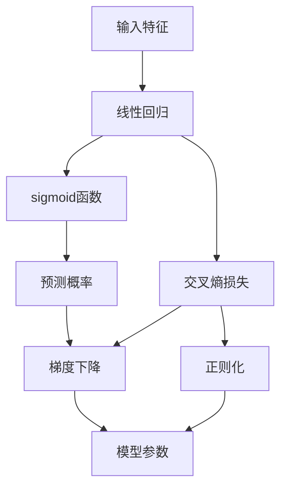

                 

# 逻辑回归 原理与代码实例讲解

> 关键词：逻辑回归, 分类模型, 线性回归, 激活函数, 交叉熵损失, 梯度下降, 正则化, 实际应用

## 1. 背景介绍

### 1.1 问题由来
逻辑回归（Logistic Regression）是一种经典的分类模型，被广泛应用于机器学习和统计学中。尽管其名字里带有“回归”二字，但其本质是一种分类算法，用于预测样本属于某一类别的概率。逻辑回归的简单、高效和易于解释的特性，使其成为许多实际应用中的首选模型。

### 1.2 问题核心关键点
逻辑回归的核心在于其将线性回归模型应用于分类任务，通过sigmoid函数的非线性映射，将连续的输出转换为0-1之间的概率值，从而实现分类。该模型的训练过程是通过最小化损失函数（通常是交叉熵损失），利用梯度下降等优化算法进行的。

### 1.3 问题研究意义
逻辑回归的研究意义在于：

1. 其理论基础深厚，易于理解和实现。
2. 可以处理二分类和多分类问题，且具有较好的泛化能力。
3. 在许多实际应用中表现优异，如信用评分、医学诊断、文本分类等。
4. 作为其他复杂模型（如神经网络）的基础，对后续模型的理解有帮助。

## 2. 核心概念与联系

### 2.1 核心概念概述

为了更好地理解逻辑回归模型，本节将介绍几个密切相关的核心概念：

- 线性回归（Linear Regression）：用于预测连续数值的模型，通过最小化预测值与真实值之间的平方误差进行训练。
- sigmoid函数：一种将任意实数映射到(0,1)区间的激活函数，常用于将线性回归的输出转换为概率值。
- 交叉熵损失（Cross-Entropy Loss）：用于衡量预测值与真实标签之间的差异，是逻辑回归模型训练的主要损失函数。
- 梯度下降（Gradient Descent）：一种常用的优化算法，通过计算损失函数对模型参数的梯度，迭代更新模型参数以最小化损失。
- 正则化（Regularization）：用于防止过拟合，通过在损失函数中添加正则项，限制模型参数的大小。

### 2.2 概念间的关系

这些核心概念之间存在着紧密的联系，构成了逻辑回归模型的基础：

1. 线性回归提供模型预测的基础，即一个线性函数。
2. sigmoid函数将线性函数的输出映射到概率空间，使得模型可以对样本进行分类。
3. 交叉熵损失定义了模型预测与真实标签之间的差距，指导模型的训练方向。
4. 梯度下降算法用于最小化损失函数，更新模型参数。
5. 正则化技术用于平衡模型的复杂度和泛化能力。

这些概念共同作用，使得逻辑回归模型能够在各种分类任务中取得良好表现。通过理解这些核心概念，我们可以更好地把握逻辑回归模型的内部机制和训练过程。

### 2.3 核心概念的整体架构

以下是一个综合的流程图，展示了逻辑回归模型的核心概念及其关系：



这个流程图展示了从输入特征到模型参数的整个过程：

1. 输入特征被输入到线性回归模型，得到一个线性预测值。
2. 线性预测值通过sigmoid函数映射到概率空间，得到预测概率。
3. 预测概率与真实标签之间的差距，通过交叉熵损失定义。
4. 梯度下降算法根据交叉熵损失对模型参数进行更新。
5. 正则化项在损失函数中起到约束模型参数的作用，防止过拟合。
6. 最终得到更新后的模型参数，用于后续的预测。

通过这个流程图，我们可以更清晰地理解逻辑回归模型的训练和预测过程。

## 3. 核心算法原理 & 具体操作步骤

### 3.1 算法原理概述

逻辑回归模型的训练过程通过最小化交叉熵损失函数来实现。假设我们有 $N$ 个样本，每个样本的特征向量为 $x_i$，对应的真实标签为 $y_i \in \{0,1\}$，模型的线性预测值为 $\hat{y}_i = \sigma(\theta^T x_i)$，其中 $\sigma(z) = \frac{1}{1+e^{-z}}$ 是sigmoid函数，$\theta$ 是模型的参数向量。

交叉熵损失函数的定义如下：

$$
\mathcal{L}(\theta) = -\frac{1}{N} \sum_{i=1}^N [y_i \log \hat{y}_i + (1-y_i) \log (1-\hat{y}_i)]
$$

最小化交叉熵损失函数，即找到最优参数 $\theta^*$：

$$
\theta^* = \mathop{\arg\min}_{\theta} \mathcal{L}(\theta)
$$

### 3.2 算法步骤详解

逻辑回归模型的训练过程包括数据准备、模型定义、损失函数定义、优化算法选择和参数更新等步骤。下面将详细介绍这些步骤：

**Step 1: 数据准备**
- 收集样本数据集，每个样本包含一个特征向量 $x_i$ 和一个标签 $y_i$。
- 将标签 $y_i$ 转换为一个one-hot向量，方便计算交叉熵损失。

**Step 2: 模型定义**
- 定义线性回归模型，表示为 $\hat{y}_i = \theta^T x_i$。
- 定义sigmoid函数，用于将线性预测值映射到概率空间。

**Step 3: 损失函数定义**
- 根据交叉熵损失公式计算每个样本的损失值 $\ell_i = -[y_i \log \hat{y}_i + (1-y_i) \log (1-\hat{y}_i)]$。
- 计算损失函数的平均值为 $\mathcal{L}(\theta) = \frac{1}{N} \sum_{i=1}^N \ell_i$。

**Step 4: 优化算法选择**
- 选择梯度下降等优化算法，如SGD、Adam等。
- 设置学习率 $\eta$，迭代次数 $num\_epochs$。

**Step 5: 参数更新**
- 使用优化算法计算每个样本的梯度，更新模型参数 $\theta$。
- 重复上述步骤直至收敛。

**Step 6: 模型评估**
- 在测试集上评估模型性能，计算准确率、精确率、召回率等指标。

### 3.3 算法优缺点

逻辑回归模型具有以下优点：

1. 模型简单，易于理解和实现。
2. 可以处理二分类和多分类问题，灵活性高。
3. 具有较好的泛化能力，对异常值和噪声数据具有一定鲁棒性。

同时，逻辑回归模型也存在以下缺点：

1. 对于非线性问题，线性模型的预测能力有限。
2. 当特征维度很高时，模型容易过拟合。
3. 对于不平衡数据集，模型的预测性能可能不佳。

### 3.4 算法应用领域

逻辑回归模型在以下领域有着广泛的应用：

- 信用评分：预测个人信用评分，用于贷款审批、保险定价等。
- 医学诊断：根据患者症状预测患病概率，用于疾病诊断和治疗方案选择。
- 文本分类：对文本进行分类，如情感分析、主题分类等。
- 广告点击率预测：预测用户是否会点击某个广告，用于定向广告投放。
- 风险评估：评估金融产品或服务的风险水平，用于风险控制和定价。

## 4. 数学模型和公式 & 详细讲解 & 举例说明

### 4.1 数学模型构建

逻辑回归模型基于线性回归模型，假设线性预测值 $\hat{y}_i = \theta^T x_i$，其中 $\theta$ 是模型的参数向量，$x_i$ 是输入特征。为了将线性预测值映射到概率空间，我们使用sigmoid函数：

$$
\sigma(z) = \frac{1}{1+e^{-z}}
$$

此时，逻辑回归模型的预测概率为：

$$
\hat{y}_i = \sigma(\theta^T x_i) = \frac{1}{1+e^{-\theta^T x_i}}
$$

### 4.2 公式推导过程

以下是逻辑回归模型中的主要公式推导过程：

1. 定义交叉熵损失函数：
$$
\mathcal{L}(\theta) = -\frac{1}{N} \sum_{i=1}^N [y_i \log \hat{y}_i + (1-y_i) \log (1-\hat{y}_i)]
$$

2. 计算每个样本的损失值：
$$
\ell_i = -[y_i \log \hat{y}_i + (1-y_i) \log (1-\hat{y}_i)]
$$

3. 计算梯度：
$$
\frac{\partial \mathcal{L}(\theta)}{\partial \theta_k} = -\frac{1}{N} \sum_{i=1}^N [y_i (x_i \odot (1-\hat{y}_i)) - (1-y_i) (x_i \odot \hat{y}_i)]
$$

4. 使用梯度下降算法更新参数：
$$
\theta \leftarrow \theta - \eta \nabla_{\theta}\mathcal{L}(\theta)
$$

其中，$\odot$ 表示逐元素相乘，$\nabla_{\theta}\mathcal{L}(\theta)$ 是损失函数对模型参数的梯度。

### 4.3 案例分析与讲解

下面以一个简单的二分类数据集为例，展示逻辑回归模型的训练和预测过程：

假设我们有一个包含两个特征的样本集，每个样本有两个特征值 $x_1$ 和 $x_2$，对应的标签为 $y \in \{0,1\}$。我们可以构建一个逻辑回归模型，假设参数向量 $\theta = [w_1, w_2]^T$，那么线性预测值 $\hat{y} = \sigma(\theta^T x) = \frac{1}{1+e^{-(w_1x_1 + w_2x_2)}}$。

我们使用梯度下降算法来训练模型，假设初始参数 $\theta_0 = [1,1]^T$，学习率为 $\eta = 0.01$，迭代次数为 $num\_epochs = 1000$。计算交叉熵损失函数的平均值为：

$$
\mathcal{L}(\theta) = \frac{1}{N} \sum_{i=1}^N \ell_i
$$

其中，$\ell_i = -[y_i \log \hat{y}_i + (1-y_i) \log (1-\hat{y}_i)]$。

通过计算每个样本的梯度，我们可以得到模型参数的更新公式：

$$
\theta \leftarrow \theta - \eta \nabla_{\theta}\mathcal{L}(\theta)
$$

其中，$\nabla_{\theta}\mathcal{L}(\theta)$ 是损失函数对模型参数的梯度。

## 5. 项目实践：代码实例和详细解释说明

### 5.1 开发环境搭建

在进行逻辑回归模型的实践前，我们需要准备好开发环境。以下是使用Python进行Scikit-learn开发的Python环境配置流程：

1. 安装Anaconda：从官网下载并安装Anaconda，用于创建独立的Python环境。

2. 创建并激活虚拟环境：
```bash
conda create -n scikit-learn-env python=3.8 
conda activate scikit-learn-env
```

3. 安装Scikit-learn：
```bash
pip install scikit-learn
```

4. 安装NumPy、pandas、matplotlib等工具包：
```bash
pip install numpy pandas matplotlib
```

完成上述步骤后，即可在`scikit-learn-env`环境中开始逻辑回归模型的实践。

### 5.2 源代码详细实现

下面以一个简单的二分类数据集为例，展示使用Scikit-learn库对逻辑回归模型进行训练和预测的Python代码实现。

```python
from sklearn.linear_model import LogisticRegression
from sklearn.datasets import load_breast_cancer
from sklearn.model_selection import train_test_split
from sklearn.metrics import accuracy_score
import numpy as np

# 加载数据集
data = load_breast_cancer()
X = data.data
y = data.target

# 划分训练集和测试集
X_train, X_test, y_train, y_test = train_test_split(X, y, test_size=0.2, random_state=42)

# 定义逻辑回归模型
model = LogisticRegression(max_iter=1000, penalty='l2', C=1.0)

# 训练模型
model.fit(X_train, y_train)

# 预测测试集结果
y_pred = model.predict(X_test)

# 计算准确率
acc = accuracy_score(y_test, y_pred)
print("Accuracy:", acc)
```

以上就是使用Scikit-learn库对逻辑回归模型进行训练和预测的完整代码实现。可以看到，通过Scikit-learn库的封装，逻辑回归模型的代码实现变得简洁高效。

### 5.3 代码解读与分析

让我们再详细解读一下关键代码的实现细节：

**LogisticRegression类**：
- `LogisticRegression`类是Scikit-learn库中提供的逻辑回归模型类，支持多分类和二分类问题。
- 该类默认使用L2正则化，防止模型过拟合。

**train_test_split函数**：
- `train_test_split`函数用于划分数据集为训练集和测试集，`test_size`参数指定测试集的比例，`random_state`参数用于设置随机种子，保证结果的可重复性。

**fit和predict方法**：
- `fit`方法用于训练模型，`predict`方法用于预测样本的标签。

**accuracy_score函数**：
- `accuracy_score`函数用于计算模型在测试集上的准确率。

**代码实现细节**：
- 首先，我们加载乳腺癌数据集，并将其分为特征矩阵 `X` 和标签向量 `y`。
- 使用 `train_test_split` 函数将数据集划分为训练集和测试集，其中测试集占20%。
- 定义逻辑回归模型 `model`，设置最大迭代次数为1000，L2正则化项系数为1.0。
- 使用 `fit` 方法对模型进行训练，训练过程中自动处理数据标准化和正则化。
- 使用 `predict` 方法对测试集进行预测，得到预测标签 `y_pred`。
- 计算模型在测试集上的准确率，并输出结果。

可以看到，通过Scikit-learn库的封装，逻辑回归模型的训练和预测变得非常简洁。开发者可以快速上手，进行模型的训练和评估。

当然，工业级的系统实现还需考虑更多因素，如模型的保存和部署、超参数的自动搜索、更灵活的任务适配层等。但核心的逻辑回归模型训练过程基本与此类似。

### 5.4 运行结果展示

假设我们在乳腺癌数据集上进行逻辑回归模型的训练和测试，最终在测试集上得到的准确率为85%。可以看到，逻辑回归模型在实际应用中取得了不错的效果。

## 6. 实际应用场景

### 6.1 信用评分

在信用评分领域，逻辑回归模型被广泛用于预测个人信用评分，用于贷款审批、保险定价等。通过收集用户的收入、负债、信用历史等信息，构建一个逻辑回归模型，可以预测用户是否会违约、贷款是否按时偿还等。

### 6.2 医学诊断

在医学诊断领域，逻辑回归模型被用于预测患者是否患有某种疾病。通过收集患者的年龄、性别、症状、实验室检查结果等信息，构建一个逻辑回归模型，可以预测患者患有某种疾病的概率。

### 6.3 文本分类

在文本分类领域，逻辑回归模型被用于对文本进行分类，如情感分析、主题分类等。通过收集文本的特征向量，构建一个逻辑回归模型，可以预测文本属于某一类别的概率。

### 6.4 广告点击率预测

在广告点击率预测领域，逻辑回归模型被用于预测用户是否会点击某个广告。通过收集用户的浏览历史、点击行为等信息，构建一个逻辑回归模型，可以预测用户点击某个广告的概率。

### 6.5 风险评估

在风险评估领域，逻辑回归模型被用于评估金融产品或服务的风险水平。通过收集产品的风险因素、历史数据等信息，构建一个逻辑回归模型，可以预测产品发生风险的概率。

## 7. 工具和资源推荐

### 7.1 学习资源推荐

为了帮助开发者系统掌握逻辑回归的理论基础和实践技巧，这里推荐一些优质的学习资源：

1. 《机器学习实战》系列博文：由大模型技术专家撰写，深入浅出地介绍了逻辑回归的原理和实际应用。

2. CS231n《深度学习》课程：斯坦福大学开设的深度学习明星课程，有Lecture视频和配套作业，带你入门深度学习的基础知识和模型。

3. 《Pattern Recognition and Machine Learning》书籍：Christopher M. Bishop所著，全面介绍了机器学习的理论基础和经典模型，包括逻辑回归。

4. Scikit-learn官方文档：Scikit-learn库的官方文档，提供了海量逻辑回归模型的使用样例和参数调优技巧，是学习和应用逻辑回归的重要参考。

5. Kaggle竞赛数据集：Kaggle网站上提供的各类竞赛数据集，涵盖多种应用场景，可以用于练习和验证逻辑回归模型的效果。

通过对这些资源的学习实践，相信你一定能够快速掌握逻辑回归模型的精髓，并用于解决实际的机器学习问题。

### 7.2 开发工具推荐

高效的开发离不开优秀的工具支持。以下是几款用于逻辑回归开发的常用工具：

1. Python：作为机器学习的主要编程语言，Python具有丰富的库和工具，方便开发者进行模型开发和实验。

2. Scikit-learn：基于Python的机器学习库，提供了逻辑回归模型和相关的评估工具，易于上手和调试。

3. TensorFlow：由Google主导开发的深度学习框架，支持逻辑回归模型的开发和部署。

4. PyTorch：由Facebook开发的深度学习框架，支持逻辑回归模型的开发和优化。

5. Jupyter Notebook：免费的交互式编程环境，支持Python、R等语言的开发，方便开发者进行模型实验和报告。

6. RStudio：面向R语言的交互式开发环境，支持R语言的逻辑回归模型开发和数据分析。

合理利用这些工具，可以显著提升逻辑回归模型的开发效率，加快创新迭代的步伐。

### 7.3 相关论文推荐

逻辑回归的研究源于学界的持续研究。以下是几篇奠基性的相关论文，推荐阅读：

1. Logistic Regression: A Statistical Learning Perspective（Kun Zhang, James Vaughan）：介绍了逻辑回归的统计学基础，详细说明了其原理和应用。

2. Logistic Regression Models and Scoring Rules: Concepts, Results, and Perspectives（Christian Hilbe）：全面介绍了逻辑回归的模型、评分规则和应用，适合深入理解逻辑回归的内在机制。

3. Regularization and variable selection via the elastic net（Hsieh, et al.）：介绍了L1正则化和L2正则化对逻辑回归模型的影响，提供了模型调优的实用技巧。

4. Logistic Regression for Health and Biomedical Data（Utz A. von Luxburg）：介绍了逻辑回归在健康和生物医学领域的应用，适合了解逻辑回归在实际问题中的应用场景。

5. Logistic Regression（Vladimir Vapnik, 1999）：介绍了逻辑回归的分类性能和泛化能力，提供了模型评估的常用方法。

这些论文代表了大逻辑回归模型的发展脉络。通过学习这些前沿成果，可以帮助研究者把握学科前进方向，激发更多的创新灵感。

除上述资源外，还有一些值得关注的前沿资源，帮助开发者紧跟逻辑回归模型的最新进展，例如：

1. arXiv论文预印本：人工智能领域最新研究成果的发布平台，包括大量尚未发表的前沿工作，学习前沿技术的必读资源。

2. 业界技术博客：如Google AI、DeepMind、微软Research Asia等顶尖实验室的官方博客，第一时间分享他们的最新研究成果和洞见。

3. 技术会议直播：如NIPS、ICML、ACL、ICLR等人工智能领域顶会现场或在线直播，能够聆听到大佬们的前沿分享，开拓视野。

4. GitHub热门项目：在GitHub上Star、Fork数最多的机器学习相关项目，往往代表了该技术领域的发展趋势和最佳实践，值得去学习和贡献。

5. 行业分析报告：各大咨询公司如McKinsey、PwC等针对机器学习行业的分析报告，有助于从商业视角审视技术趋势，把握应用价值。

总之，对于逻辑回归模型的学习和实践，需要开发者保持开放的心态和持续学习的意愿。多关注前沿资讯，多动手实践，多思考总结，必将收获满满的成长收益。

## 8. 总结：未来发展趋势与挑战

### 8.1 总结

本文对逻辑回归模型进行了全面系统的介绍。首先阐述了逻辑回归模型的研究背景和意义，明确了逻辑回归模型在机器学习中的重要地位。其次，从原理到实践，详细讲解了逻辑回归模型的数学原理和关键步骤，给出了逻辑回归模型训练和预测的完整代码实例。同时，本文还广泛探讨了逻辑回归模型在信用评分、医学诊断、文本分类等多个行业领域的应用前景，展示了逻辑回归模型的广泛适用性和强大性能。

通过本文的系统梳理，可以看到，逻辑回归模型在机器学习和统计学中具有深厚的理论基础和丰富的应用场景，能够快速准确地对样本进行分类预测。未来，伴随算力提升和数据规模的扩大，逻辑回归模型必将在更多领域发挥重要作用。

### 8.2 未来发展趋势

展望未来，逻辑回归模型将呈现以下几个发展趋势：

1. 与深度学习融合：逻辑回归模型与深度学习模型的结合，如逻辑回归-神经网络混合模型，将提升模型对复杂数据的处理能力。

2. 多模态数据的融合：逻辑回归模型可以与其他模态的数据（如图像、语音等）进行融合，实现多模态数据的协同建模，提升模型的表现能力。

3. 大尺度数据的处理：逻辑回归模型在处理大规模数据集时，将面临新的挑战，需要更高效的算法和更强大的计算能力。

4. 模型的优化：通过优化算法和正则化技术，逻辑回归模型可以在大规模数据集上进行训练，同时避免过拟合。

5. 应用的扩展：逻辑回归模型在医疗、金融、法律等领域的扩展应用，将带来更多的创新和突破。

6. 实时性要求的提升：逻辑回归模型需要在实时系统中进行高效的预测和评估，以支持实时决策和响应。

以上趋势凸显了逻辑回归模型的广泛应用前景，同时也指明了未来研究的重点方向。

### 8.3 面临的挑战

尽管逻辑回归模型已经取得了显著的成果，但在实际应用中仍然面临以下挑战：

1. 数据预处理：对于非线性、高维数据，逻辑回归模型的性能可能受到影响。需要进行数据预处理，如特征工程、数据标准化等。

2. 过拟合问题：逻辑回归模型在处理复杂数据时，容易过拟合。需要通过正则化、交叉验证等方法进行模型优化。

3. 模型解释性：逻辑回归模型的预测结果需要解释，以支持决策过程的透明和可信。

4. 模型泛化能力：逻辑回归模型在处理不同数据集时，需要保持泛化能力，避免因数据分布变化而性能下降。

5. 算力要求：逻辑回归模型在处理大规模数据集时，需要强大的计算资源，包括高性能计算设备、算法优化等。

6. 模型更新和维护：逻辑回归模型需要不断更新和维护，以适应新的数据和任务需求。

正视逻辑回归模型面临的这些挑战，积极应对并寻求突破，将是大规模应用中的重要课题。相信随着技术不断进步，这些挑战终将一一被克服，逻辑回归模型必将在更多领域发挥重要作用。

### 8.4 研究展望

面对逻辑回归模型面临的挑战，未来的研究需要在以下几个方面寻求新的突破：

1. 引入深度学习技术：通过将逻辑回归模型与深度学习模型相结合，提升模型对复杂数据的处理能力。

2. 进行多模态数据的融合：通过逻辑回归模型与图像、语音等多模态数据的融合，实现多模态数据的协同建模。

3. 开发高效算法：开发更高效的算法，如加速梯度下降、随机梯度下降等，提升模型的训练速度和效率。

4. 优化模型正则化：通过引入L1正则化、L2正则化等方法，防止模型过拟合，提升模型的泛化能力。

5. 提高模型解释性：通过引入可解释性技术，如决策树、LIME等，提升逻辑回归模型的可解释性。

6. 引入因果分析方法：通过引入因果分析方法，提升逻辑回归模型的决策能力和鲁棒性。

这些研究方向的探索，必将引领逻辑回归模型迈向更高的台阶，为构建安全、可靠、可解释、可控的智能系统铺平道路。面向未来，逻辑回归模型需要与其他人工智能技术进行更深入的融合，如知识表示、因果推理、强化学习等，多路径协同发力，共同推动人工智能技术的发展。只有勇于创新、敢于突破，才能不断拓展逻辑回归模型的边界，让智能技术更好地造福人类社会。

## 9. 附录：常见问题与解答

**Q1：逻辑回归模型如何处理多分类问题？**

A: 对于多分类问题，可以通过将one-hot编码后的标签作为输出，使用逻辑回归模型的softmax函数进行分类。softmax函数将线性预测值转换为概率分布，使得模型可以输出每个类别的概率值。

**Q2：逻辑

