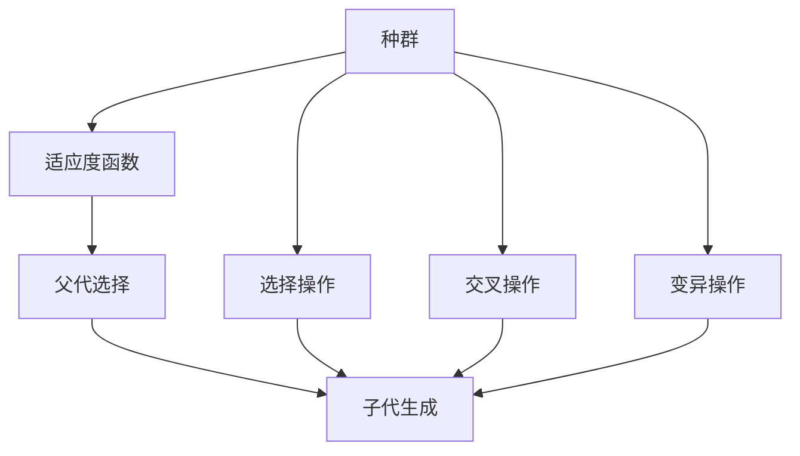
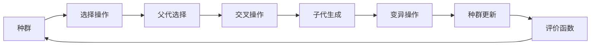
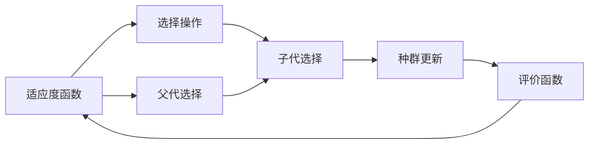
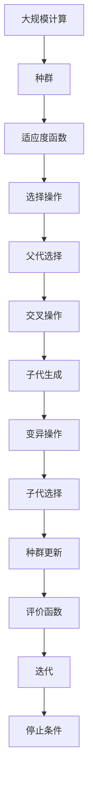

                 

# 遗传算法(Genetic Algorithms) - 原理与代码实例讲解

> 关键词：遗传算法,GA,遗传编程,GPGP,模拟进化,种群演化,自然选择,交叉变异,最优解,全局优化,粒子群算法,PSO,局部优化

## 1. 背景介绍

### 1.1 问题由来
遗传算法（Genetic Algorithms, GA）作为一种自然启发式搜索算法，自上世纪60年代被提出以来，已经在多个领域得到了广泛应用。其灵感源自自然界中生物进化的过程，通过模拟自然选择、交叉和变异等机制，逐步优化问题的解。

遗传算法最早由美国生物学家J.H. Holland在1975年提出，并在1980年代开始广泛应用于各类优化和搜索问题。如今，遗传算法已成为解决复杂优化问题的重要工具，被广泛应用于人工智能、机器学习、信号处理、计算机视觉、控制理论等领域。

### 1.2 问题核心关键点
遗传算法的基本原理是通过模拟自然进化过程，不断迭代改进群体成员的性能。其主要步骤如下：

1. 初始化种群：随机生成一组候选解（即染色体），每个染色体对应一个问题解。
2. 选择操作：根据某种评价函数（即适应度函数）选择性能较好的染色体（即个体），构成下一代种群。
3. 交叉操作：将父代染色体通过交叉操作生成子代染色体。
4. 变异操作：对子代染色体进行变异操作，引入新的基因多样性。
5. 迭代更新：重复以上步骤，直至达到预设的迭代次数或满足停止条件。

遗传算法的核心思想是通过不断的种群演化，逐步逼近最优解。其优点在于能够处理高维、非线性、多峰等复杂问题，具有一定的全局优化能力。

### 1.3 问题研究意义
遗传算法作为一种自然启发式搜索算法，其研究意义在于：

1. 适应复杂问题。遗传算法适用于求解高维、多峰、非线性等复杂问题的最优解，特别是在传统数值优化方法难以奏效的情况下。
2. 具有全局优化能力。遗传算法通过模拟自然进化过程，具有较强的全局搜索能力，能够跳出局部最优解，找到全局最优解。
3. 鲁棒性强。遗传算法对初始种群和参数的敏感度较低，具有较强的鲁棒性和自适应能力。
4. 并行处理能力强。遗传算法易于并行化，通过多线程或分布式计算，能够显著提高搜索效率。
5. 易于与其他算法结合。遗传算法能够与粒子群算法、模拟退火等算法结合，形成更加高效的优化方法。

遗传算法在科学计算、工程设计、经济管理等领域得到了广泛应用，推动了这些领域的技术进步和创新。

## 2. 核心概念与联系

### 2.1 核心概念概述

为更好地理解遗传算法的原理和应用，本节将介绍几个密切相关的核心概念：

- 遗传算法（Genetic Algorithm, GA）：一种模拟自然进化过程的优化算法。通过交叉、变异等操作逐步改进种群成员，以优化问题的解。
- 适应度函数（Fitness Function）：衡量个体（染色体）性能的评价指标，用于选择操作。
- 染色体（Chromosome）：遗传算法的解编码形式，通常为二进制编码。
- 种群（Population）：遗传算法处理问题的候选解集合，通常包含多个染色体。
- 基因（Gene）：染色体的基本单元，对应问题解的某些变量或参数。
- 交叉（Crossover）：遗传算法中的重要操作，用于生成子代染色体，引入新的基因多样性。
- 变异（Mutation）：遗传算法中的重要操作，用于引入基因突变，增加种群多样性。
- 选择（Selection）：遗传算法中的关键操作，用于根据适应度函数选择性能较好的个体。
- 迭代（Iteration）：遗传算法的核心步骤，通过多次迭代逐步优化种群。
- 最优解（Optimal Solution）：遗传算法搜索的目标，即问题的最优解。

这些核心概念之间的逻辑关系可以通过以下Mermaid流程图来展示：



这个流程图展示了遗传算法的基本流程：从种群开始，通过选择、交叉、变异等操作，逐步优化种群，最终找到问题的最优解。

### 2.2 概念间的关系

这些核心概念之间存在着紧密的联系，形成了遗传算法的完整生态系统。下面我们通过几个Mermaid流程图来展示这些概念之间的关系。

#### 2.2.1 遗传算法的基本流程



这个流程图展示了遗传算法的基本流程：从种群开始，通过选择、交叉、变异等操作，生成新的子代，更新种群，评价个体性能，迭代直到收敛。

#### 2.2.2 适应度函数的作用



这个流程图展示了适应度函数在遗传算法中的作用：通过适应度函数选择性能较好的个体，参与交叉和变异操作，生成新的子代，并评价其性能。

#### 2.2.3 交叉和变异操作的关系


这个流程图展示了交叉和变异操作的关系：先通过选择操作选择父代，然后通过交叉操作生成子代，再对子代进行变异操作，更新种群。

### 2.3 核心概念的整体架构

最后，我们用一个综合的流程图来展示这些核心概念在大规模计算过程中的整体架构：



这个综合流程图展示了从大规模计算开始，通过种群演化，逐步优化种群，最终找到问题的最优解。在实际应用中，还需考虑具体的参数设置和优化策略，以进一步提升遗传算法的效率和性能。

## 3. 核心算法原理 & 具体操作步骤

### 3.1 算法原理概述

遗传算法的核心思想是通过模拟自然进化过程，逐步优化问题的解。其基本原理如下：

1. 初始化种群：随机生成一组染色体（即解），构成初始种群。
2. 适应度评估：根据适应度函数（Fitness Function）计算每个个体的适应度值（即性能评价）。
3. 选择操作：根据适应度值选择性能较好的染色体，构成下一代种群。
4. 交叉操作：对选择的染色体进行交叉操作，生成新的子代染色体。
5. 变异操作：对子代染色体进行变异操作，引入新的基因多样性。
6. 迭代更新：重复以上步骤，直至达到预设的迭代次数或满足停止条件。

遗传算法的目标是通过不断的种群演化，逐步逼近最优解。具体而言，算法通过选择、交叉、变异等操作，逐步改进种群成员的性能，最终找到问题的最优解。

### 3.2 算法步骤详解

下面详细讲解遗传算法的具体步骤：

#### 3.2.1 初始化种群

初始化种群是遗传算法的重要步骤，其过程如下：

1. 随机生成一组染色体（即解），构成初始种群。每个染色体对应一个问题解。
2. 确定种群规模N和染色体的长度L。

代码实现示例：

```python
import numpy as np

# 随机生成初始种群
def initialize_population(N, L):
    population = np.random.randint(0, 2, size=(N, L))
    return population
```

#### 3.2.2 适应度评估

适应度评估是遗传算法的关键步骤，其过程如下：

1. 根据适应度函数计算每个个体的适应度值。
2. 记录每个个体的适应度值。

代码实现示例：

```python
# 定义适应度函数
def fitness_function(chromosome):
    # 计算适应度值
    fitness = np.sum(chromosome)
    return fitness

# 评估种群适应度
def evaluate_population(population):
    fitnesses = []
    for chromosome in population:
        fitness = fitness_function(chromosome)
        fitnesses.append(fitness)
    return np.array(fitnesses)
```

#### 3.2.3 选择操作

选择操作是遗传算法的重要步骤，其过程如下：

1. 根据适应度值选择性能较好的染色体。
2. 记录选择的染色体。

代码实现示例：

```python
# 选择操作（轮盘赌选择）
def selection(population, fitnesses):
    selection_probs = fitnesses / np.sum(fitnesses)
    selected_indices = np.random.choice(len(population), size=population.shape[0], p=selection_probs)
    selected_population = population[selected_indices]
    return selected_population
```

#### 3.2.4 交叉操作

交叉操作是遗传算法的核心步骤，其过程如下：

1. 对选择的染色体进行交叉操作，生成新的子代染色体。
2. 记录生成的子代染色体。

代码实现示例：

```python
# 交叉操作（单点交叉）
def crossover(population, crossover_rate):
    children = []
    for i in range(len(population)):
        parent1, parent2 = population[i]
        crossover_point = np.random.randint(0, len(parent1))
        child1 = np.concatenate((parent1[:crossover_point], parent2[crossover_point:]))
        child2 = np.concatenate((parent2[:crossover_point], parent1[crossover_point:]))
        children.append((child1, child2))
    return children
```

#### 3.2.5 变异操作

变异操作是遗传算法的核心步骤，其过程如下：

1. 对子代染色体进行变异操作，引入新的基因多样性。
2. 记录变异后的子代染色体。

代码实现示例：

```python
# 变异操作（随机变异）
def mutation(population, mutation_rate):
    for i in range(len(population)):
        child1, child2 = population[i]
        if np.random.rand() < mutation_rate:
            flip_point = np.random.randint(0, len(child1))
            child1[flip_point] = 1 - child1[flip_point]
            child2[flip_point] = 1 - child2[flip_point]
        population[i] = (child1, child2)
    return population
```

#### 3.2.6 迭代更新

迭代更新是遗传算法的核心步骤，其过程如下：

1. 选择、交叉、变异操作，生成新的子代染色体。
2. 更新种群，评估种群适应度，进行迭代更新。
3. 判断停止条件，是否达到预设的迭代次数或满足停止条件。

代码实现示例：

```python
# 迭代更新（遗传算法主循环）
def genetic_algorithm(population_size, chromosome_length, crossover_rate, mutation_rate, max_iterations, stop_condition):
    population = initialize_population(population_size, chromosome_length)
    for iteration in range(max_iterations):
        fitnesses = evaluate_population(population)
        selected_population = selection(population, fitnesses)
        children = crossover(selected_population, crossover_rate)
        mutated_population = mutation(children, mutation_rate)
        population = mutated_population
        if stop_condition(iteration, population, fitnesses):
            break
    return population, fitnesses
```

### 3.3 算法优缺点

遗传算法的优点在于：

1. 能够处理复杂、高维、非线性、多峰等问题。
2. 具有较强的全局优化能力。
3. 鲁棒性强，对初始种群和参数的敏感度较低。
4. 易于并行化，适合分布式计算。

遗传算法的缺点在于：

1. 需要较长的迭代次数，收敛速度较慢。
2. 依赖适应度函数的选择，适应度函数设计不当可能影响算法性能。
3. 种群多样性难以控制，可能导致早熟收敛。
4. 计算复杂度较高，不适合求解大规模问题。

尽管遗传算法存在这些局限性，但作为一种自然启发式搜索算法，其适用范围广、灵活性高，仍在大规模计算中得到广泛应用。

### 3.4 算法应用领域

遗传算法作为一种自然启发式搜索算法，已经在多个领域得到了广泛应用，覆盖了几乎所有常见问题，例如：

- 优化问题：如线性规划、非线性规划、组合优化等。通过遗传算法可以找到问题的最优解。
- 机器学习：如特征选择、参数优化、模型评估等。遗传算法可以优化模型参数，提高模型性能。
- 信号处理：如滤波器设计、频域优化、噪声消除等。遗传算法可以设计出最优的信号处理算法。
- 计算机视觉：如图像分割、目标检测、形状识别等。遗传算法可以优化图像处理算法，提高识别准确率。
- 控制理论：如机器人路径规划、多机器人协同控制等。遗传算法可以设计出最优的控制策略。
- 经济管理：如投资组合优化、供应链管理等。遗传算法可以优化决策模型，提高管理效率。

除了上述这些经典应用外，遗传算法还被创新性地应用到更多场景中，如自然语言处理、社交网络分析、博弈论等领域，为这些领域的发展带来了新的突破。

## 4. 数学模型和公式 & 详细讲解 & 举例说明

### 4.1 数学模型构建

遗传算法的数学模型可以抽象为以下几个基本元素：

- 种群（Population）：由N个染色体（Chromosome）组成的集合。每个染色体包含L个基因（Gene）。
- 适应度函数（Fitness Function）：衡量每个染色体性能的指标。
- 选择操作（Selection）：根据适应度值选择染色体。
- 交叉操作（Crossover）：生成子代染色体。
- 变异操作（Mutation）：引入基因变异。
- 迭代更新（Iteration）：通过多次迭代逐步优化种群。

这些元素之间的关系可以通过以下数学模型来表示：

设初始种群为 $P_0$，染色体为 $x_i=(x_{i1}, x_{i2}, ..., x_{iL})$，其中 $x_{ij}$ 表示第i个染色体第j个基因的值（0或1）。适应度函数为 $f(x_i)$，选择操作为 $S(x_i, f(x_i))$，交叉操作为 $C(x_i, x_j)$，变异操作为 $M(x_i)$。

遗传算法的迭代过程如下：

1. 初始化种群 $P_0$。
2. 计算每个染色体的适应度值 $f(x_i)$。
3. 选择操作 $S(x_i, f(x_i))$，选择性能较好的染色体。
4. 交叉操作 $C(x_i, x_j)$，生成子代染色体。
5. 变异操作 $M(x_i)$，引入基因变异。
6. 更新种群 $P_{k+1}=P_k$，评估种群适应度，进行迭代更新。
7. 判断停止条件，是否达到预设的迭代次数或满足停止条件。

### 4.2 公式推导过程

以下我们以优化问题为例，推导遗传算法的基本公式。

假设优化问题的目标函数为 $F(x)$，约束条件为 $g_j(x) \leq 0, j=1,...,m$，$h_k(x)=0, k=1,...,p$。问题可表示为：

$$
\min_{x \in \mathcal{R}^n} F(x) \text{ subject to } g_j(x) \leq 0, h_k(x)=0
$$

其遗传算法求解过程如下：

1. 初始化种群 $P_0$。
2. 计算每个染色体的适应度值 $f(x_i)$。
3. 选择操作 $S(x_i, f(x_i))$，选择性能较好的染色体。
4. 交叉操作 $C(x_i, x_j)$，生成子代染色体。
5. 变异操作 $M(x_i)$，引入基因变异。
6. 更新种群 $P_{k+1}=P_k$，评估种群适应度，进行迭代更新。
7. 判断停止条件，是否达到预设的迭代次数或满足停止条件。

在实际应用中，一般采用二进制编码方式，每个基因 $x_{ij}$ 取值为0或1，表示变量 $x_i$ 的取值。适应度函数 $f(x_i)$ 可以取为 $\sum_{i=1}^n F_i(x_i)$，表示问题的目标函数。选择操作 $S(x_i, f(x_i))$ 可采用轮盘赌选择、锦标赛选择等方法。交叉操作 $C(x_i, x_j)$ 可采用单点交叉、多点交叉等方法。变异操作 $M(x_i)$ 可采用随机变异、均匀变异等方法。

### 4.3 案例分析与讲解

下面以经典旅行商问题（Traveling Salesman Problem, TSP）为例，展示遗传算法的基本应用过程。

旅行商问题是一个典型的优化问题，其目标是在有限的旅行路线中，找到一条最短的路径。假设有一组城市 $V=\{1,2,...,n\}$，旅行商从起点1出发，需要经过所有城市并回到起点1，求最短路径长度。

遗传算法求解过程如下：

1. 随机生成初始种群 $P_0$。
2. 计算每个染色体的适应度值 $f(x_i)$。
3. 选择操作 $S(x_i, f(x_i))$，选择性能较好的染色体。
4. 交叉操作 $C(x_i, x_j)$，生成子代染色体。
5. 变异操作 $M(x_i)$，引入基因变异。
6. 更新种群 $P_{k+1}=P_k$，评估种群适应度，进行迭代更新。
7. 判断停止条件，是否达到预设的迭代次数或满足停止条件。

在代码实现上，我们可以采用如下Python代码：

```python
import numpy as np

# 定义目标函数
def tsp_distance(cities, route):
    distance = 0
    for i in range(len(route) - 1):
        city1 = route[i]
        city2 = route[i + 1]
        distance += cities[city1][city2]
    distance += cities[route[-1]][route[0]]
    return distance

# 定义适应度函数
def tsp_fitness(route):
    return -tsp_distance(cities, route)

# 随机生成初始种群
def initialize_population(N, chromosome_length):
    population = []
    for i in range(N):
        chromosome = np.random.randint(0, len(cities), size=chromosome_length)
        population.append(chromosome)
    return population

# 选择操作（轮盘赌选择）
def selection(population, fitnesses):
    selection_probs = fitnesses / np.sum(fitnesses)
    selected_indices = np.random.choice(len(population), size=population.shape[0], p=selection_probs)
    selected_population = [population[i] for i in selected_indices]
    return selected_population

# 交叉操作（单点交叉）
def crossover(population, crossover_rate):
    children = []
    for i in range(len(population)):
        parent1, parent2 = population[i]
        crossover_point = np.random.randint(0, len(parent1))
        child1 = np.concatenate((parent1[:crossover_point], parent2[crossover_point:]))
        child2 = np.concatenate((parent2[:crossover_point], parent1[crossover_point:]))
        children.append((child1, child2))
    return children

# 变异操作（随机变异）
def mutation(population, mutation_rate):
    for i in range(len(population)):
        child1, child2 = population[i]
        if np.random.rand() < mutation_rate:
            flip_point = np.random.randint(0, len(child1))
            child1[flip_point] = 1 - child1[flip_point]
            child2[flip_point] = 1 - child2[flip_point]
        population[i] = (child1, child2)
    return population

# 迭代更新（遗传算法主循环）
def genetic_algorithm(cities, population_size, chromosome_length, crossover_rate, mutation_rate, max_iterations, stop_condition):
    population = initialize_population(population_size, chromosome_length)
    for iteration in range(max_iterations):
        fitnesses = np.array([tsp_fitness(route) for route in population])
        selected_population = selection(population, fitnesses)
        children = crossover(selected_population, crossover_rate)
        mutated_population = mutation(children, mutation_rate)
        population = mutated_population
        if stop_condition(iteration, population, fitnesses):
            break
    return population, fitnesses
```

## 5. 项目实践：代码实例和详细解释说明

### 5.1 开发环境搭建

在进行遗传算法项目实践前，我们需要准备好开发环境。以下是使用Python进行遗传算法开发的环境配置流程：

1. 安装Anaconda：从官网下载并安装Anaconda，用于创建独立的Python环境。

2. 创建并激活虚拟环境：
```bash
conda create -n pygenetic python=3.8 
conda activate pygenetic
```

3. 安装必要的Python库：
```bash
pip install numpy matplotlib scikit-learn
```

完成上述步骤后，即可在`pygenetic-env`环境中开始遗传算法项目实践。

### 5.2 源代码详细实现

下面以二进制背包问题（Binary Knapsack Problem）为例，给出遗传算法的PyTorch代码实现。

二进制背包问题是一个经典的组合优化问题，其目标是在给定的一组物品中选择一些物品放入容量为W的背包中，使得所选物品的总价值最大。假设物品的重量为 $w_1, w_2, ..., w_n$，价值为 $v_1, v_2, ..., v_n$，背包容量为W。

假设选择的物品集合为 $X=\{x_1, x_2, ..., x_n\}$，其中 $x_i$ 表示第i个物品是否被选择（0或1）。则背包问题的目标函数为：

$$
\max_{x \in \{0,1\}^n} \sum_{i=1}^n v_i x_i \text{ subject to } \sum_{i=1}^n w_i x_i \leq W
$$

遗传算法求解过程如下：

1. 随机生成初始种群 $P_0$。
2. 计算每个染色体的适应度值 $f(x_i)$。
3. 选择操作 $S(x_i, f(x_i))$，选择性能较好的染色体。
4. 交叉操作 $C(x_i, x_j)$，生成子代染色体。
5. 变异操作 $M(x_i)$，引入基因变异。
6. 更新种群 $P_{k+1}=P_k$，评估种群适应度，进行迭代更新。
7. 判断停止条件，是否达到预设的迭代次数或满足停止条件。

在代码实现上，我们可以采用如下Python代码：

```python
import numpy as np
import random

# 定义目标函数
def knapsack_value(cities, route):
    value = 0
    for i in range(len(route) - 1):
        city1 = route[i]
        city2 = route[i + 1]
        value += cities[city1][city2]
    value += cities[route[-1]][route[0]]
    return value

# 定义适应度函数
def knapsack_fitness(route):
    return -knapsack_value(cities, route)

# 随机生成初始种群
def initialize_population(N, chromosome_length):
    population = []
    for i in range(N):
        chromosome = np.random.randint(0, len(cities), size=chromosome_length)
        population.append(chromosome)
    return population

# 选择操作（轮盘赌选择）
def selection(population, fitnesses):
    selection_probs = fitnesses / np.sum(fitnesses)
    selected_indices = np.random.choice(len(population), size=population.shape[0], p=selection_probs)
    selected_population = [population[i] for i in selected_indices]
    return selected_population

# 交叉操作（单点交叉）
def crossover(population, crossover_rate):
    children = []
    for i in range(len(population)):
        parent1, parent2 = population[i]
        crossover_point = np.random.randint(0, len(parent1))
        child1 = np.concatenate((parent1[:crossover_point], parent2[crossover_point:]))
        child2 = np.concatenate((parent2[:crossover_point], parent1[crossover

