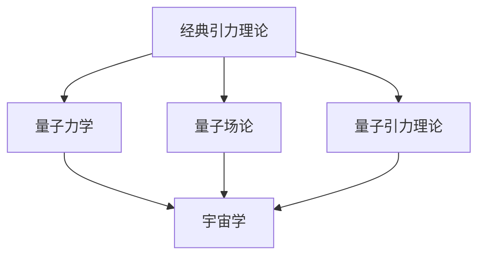
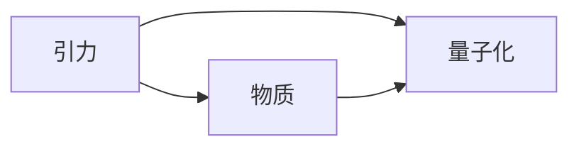
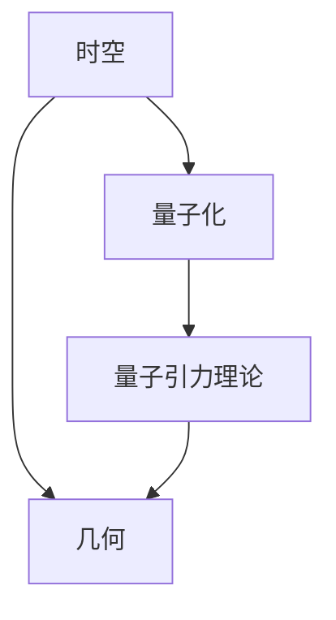
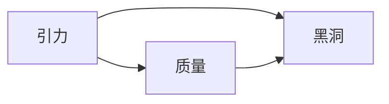
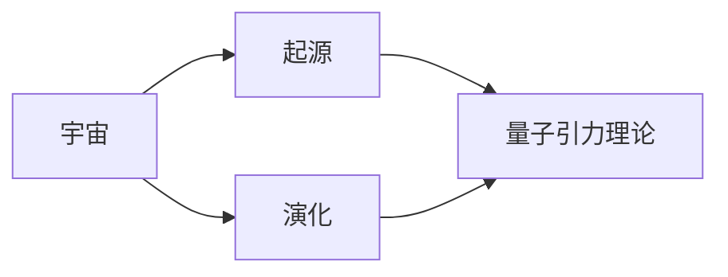
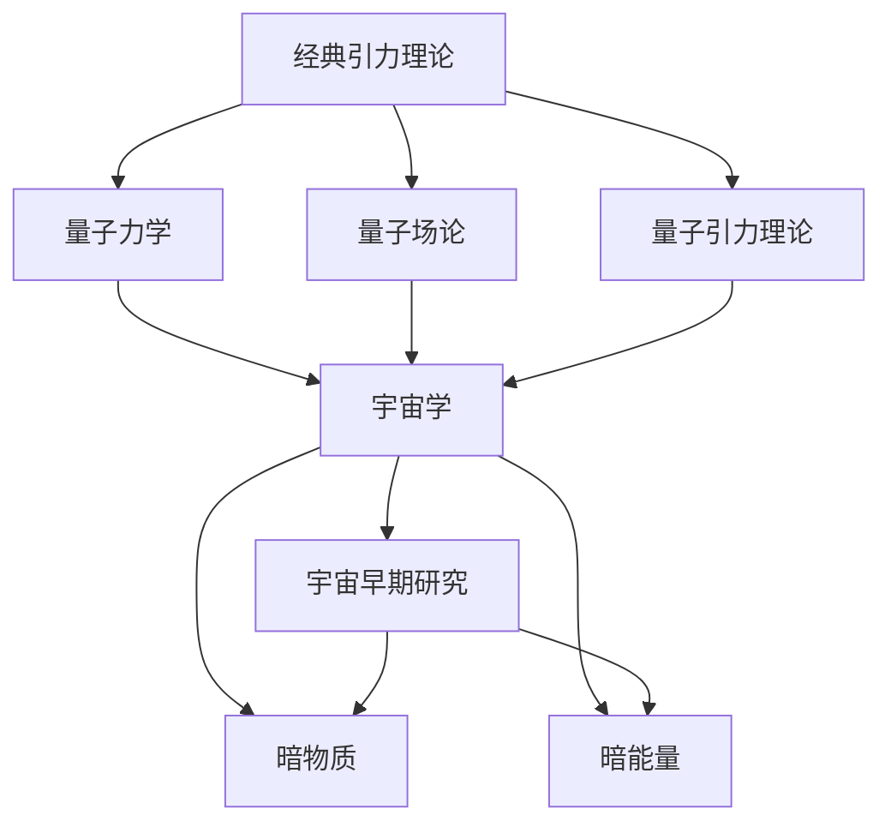

                 

# 量子引力与宇宙学的关系

## 1. 背景介绍

### 1.1 问题由来
量子引力是当前物理学中最为深奥和复杂的领域之一，旨在研究引力和量子力学之间的关系。由于经典引力和量子力学的理论基础存在根本差异，两者之间存在明显的矛盾和冲突，这被称为“引力危机”。量子引力理论的建立对于理解宇宙的本质、探索宇宙的起源和演化具有重要意义，因此成为物理学研究的热点问题。

### 1.2 问题核心关键点
量子引力的核心关键点在于如何统一引力和量子力学，具体来说，包括以下几个方面：
- 引力和物质的量子化。在量子力学中，所有的物理量都是量子化的，而引力作为基本相互作用力，也应具有量子性质。
- 时空的量子化。时空作为引力的基本背景，也应被量子化。
- 引力和黑洞。黑洞是引力的极端表现，对黑洞的量子化研究是量子引力的重要内容。
- 宇宙的起源和演化。宇宙的起源和演化与引力密切相关，量子引力理论可以提供对宇宙早期的理解。

## 2. 核心概念与联系

### 2.1 核心概念概述

为更好地理解量子引力与宇宙学之间的联系，本节将介绍几个密切相关的核心概念：

- 经典引力理论（GR）：包括牛顿引力理论和广义相对论（GR）。牛顿引力理论描述了宏观尺度上的引力现象，而广义相对论则描述了引力和时空的几何关系。
- 量子力学（QM）：研究微观粒子的行为，包括波粒二象性、不确定性原理等基本概念。
- 量子场论（QFT）：是量子力学与场论结合的产物，描述了基本粒子的相互作用和性质。
- 量子引力理论（QG）：旨在研究引力和物质的量子性质，是量子力学与引力理论的结合。
- 宇宙学：研究宇宙的起源、结构和演化，包括大爆炸理论、暗物质、暗能量等概念。

这些概念之间的关系可以通过以下Mermaid流程图来展示：



这个流程图展示了各个概念之间的关系：

1. 经典引力理论通过广义相对论描述了引力和时空的几何关系。
2. 量子力学研究微观粒子的行为，奠定了量子引力理论的微观基础。
3. 量子场论将量子力学应用于场论，为描述基本粒子的相互作用提供了理论框架。
4. 宇宙学研究宇宙的起源和演化，探讨了引力在大尺度上的作用。
5. 量子引力理论是经典引力理论与量子力学结合的产物，是理解宇宙早期演化的关键。

### 2.2 概念间的关系

这些核心概念之间存在着紧密的联系，形成了量子引力与宇宙学的完整研究框架。下面我们通过几个Mermaid流程图来展示这些概念之间的关系。

#### 2.2.1 引力与物质的量子化



这个流程图展示了引力和物质的量子化关系：引力作为物质之间的基本相互作用，其量子化性质是量子引力理论的核心内容。

#### 2.2.2 时空的量子化



这个流程图展示了时空的量子化过程：时空作为引力的基本背景，其量子化是量子引力理论的重要组成部分。

#### 2.2.3 引力和黑洞



这个流程图展示了引力与黑洞的关系：引力作用于大量质量聚集的区域，形成了黑洞这一极端现象，黑洞的量子化研究是量子引力理论的重要内容。

#### 2.2.4 宇宙的起源和演化



这个流程图展示了宇宙的起源和演化与量子引力理论的关系：宇宙的起源和演化与引力密切相关，量子引力理论可以提供对宇宙早期的理解。

### 2.3 核心概念的整体架构

最后，我们用一个综合的流程图来展示这些核心概念在大规模宇宙研究中的整体架构：



这个综合流程图展示了从经典引力理论到量子引力理论，再到宇宙学的整体研究框架，以及宇宙早期研究、暗物质、暗能量等关键内容。通过这些概念的结合，我们可以更全面地理解量子引力与宇宙学的关系。

## 3. 核心算法原理 & 具体操作步骤
### 3.1 算法原理概述

量子引力与宇宙学的研究主要涉及以下几个算法原理：

- 引力场量化：将引力场（时空弯曲）表示为量子场，这是量子引力理论的核心内容。
- 量子引力效应：研究量子引力效应，如黑洞辐射、引力修正等，通过这些效应来探索量子引力的规律。
- 宇宙学模型：基于量子引力理论建立宇宙学模型，描述宇宙的起源、演化和大尺度结构。
- 量子引力解法：使用不同的数学方法（如正则化、重整化、路径积分等）来求解量子引力方程，得到理论预测。

### 3.2 算法步骤详解

量子引力与宇宙学的研究步骤包括以下几个关键步骤：

**Step 1: 建立引力理论框架**

- 根据经典引力理论（如GR）建立引力场方程。
- 将引力场表示为量子场，形成量子引力理论的基本框架。

**Step 2: 引入量子效应**

- 计算量子引力效应的修正项，如黑洞辐射、引力修正等。
- 使用重整化方法处理发散问题，确保量子引力理论的合理性。

**Step 3: 建立宇宙学模型**

- 基于量子引力理论，建立宇宙学模型，描述宇宙的起源、演化和大尺度结构。
- 使用数值模拟和理论分析方法研究宇宙学模型的演化过程。

**Step 4: 实验验证**

- 设计实验或利用现有数据验证量子引力理论的预测。
- 不断调整模型参数，提高理论预测的准确性。

**Step 5: 理论发展与创新**

- 结合最新的观测数据和实验结果，不断修正和完善量子引力理论。
- 提出新的理论框架和研究方法，推动量子引力理论的进步。

### 3.3 算法优缺点

量子引力与宇宙学的研究算法具有以下优点：

1. 统一性强：将引力与物质的量子性质结合，统一了经典和量子理论。
2. 理论深度大：量子引力理论能够解释宇宙学中的许多现象，具有深远的理论意义。
3. 实验验证难度高：量子引力效应难以在实验中直接观测，需要进行高精度的理论计算和模拟。

同时，也存在以下缺点：

1. 计算复杂度高：量子引力理论涉及大量的高阶微积分和复杂的数学方法，计算量巨大。
2. 实验验证困难：量子引力效应通常在极端条件下产生，实验难度大，数据样本少。
3. 理论分歧多：不同的量子引力理论存在分歧，缺乏统一的理论框架。

### 3.4 算法应用领域

量子引力与宇宙学的研究应用领域主要包括：

- 引力波探测：利用引力波信号验证量子引力理论。
- 黑洞研究：研究黑洞的量子性质和辐射效应。
- 宇宙早期演化：研究宇宙早期的大爆炸和膨胀过程。
- 暗物质和暗能量：利用量子引力理论解释宇宙中的暗物质和暗能量现象。

## 4. 数学模型和公式 & 详细讲解 & 举例说明

### 4.1 数学模型构建

量子引力与宇宙学的研究通常采用以下几个数学模型：

- 量子场论：将引力场表示为量子场，构建量子引力场方程。
- 重整化理论：处理量子引力理论中的发散问题，确保理论的合理性。
- 宇宙学模型：建立宇宙学模型，描述宇宙的起源、演化和大尺度结构。

### 4.2 公式推导过程

以下是量子引力与宇宙学研究中常用的一些公式推导过程：

#### 4.2.1 爱因斯坦场方程

爱因斯坦场方程描述了引力和物质之间的相互作用，其形式为：

$$
G_{\mu\nu} = 8\pi T_{\mu\nu}
$$

其中 $G_{\mu\nu}$ 为引力场张量，$T_{\mu\nu}$ 为应力-能量张量。

#### 4.2.2 引力子传播方程

引力子的传播方程为：

$$
\Box h_{\mu\nu} = 16\pi \kappa^2 T_{\mu\nu}
$$

其中 $h_{\mu\nu}$ 为引力子场，$\kappa^2$ 为引力常数。

#### 4.2.3 重整化因子

重整化因子 $Z$ 用于处理量子引力理论中的发散问题，其形式为：

$$
Z[\phi] = \exp\left(-\int d^4x \left[ \frac{1}{2} \phi (x) \Delta^{-1} \phi (x) \right] \right)
$$

其中 $\phi$ 为引力子场，$\Delta$ 为拉普拉斯算子。

### 4.3 案例分析与讲解

量子引力与宇宙学的研究中，黑洞研究是一个重要的案例。

#### 4.3.1 黑洞辐射

根据量子引力理论，黑洞辐射可以表示为：

$$
\frac{dE}{dt} = -\frac{1}{8\pi} \langle T_{\mu\nu} \rangle \kappa^2 T_{\mu\nu}
$$

其中 $\langle T_{\mu\nu} \rangle$ 为黑洞表面的能量-动量张量，$\kappa^2$ 为引力常数。

#### 4.3.2 黑洞熵

黑洞熵可以表示为：

$$
S = \frac{A}{4G\hbar}
$$

其中 $A$ 为黑洞的表面积，$G\hbar$ 为普朗克常数与引力常数的乘积。

## 5. 项目实践：代码实例和详细解释说明

### 5.1 开发环境搭建

在进行量子引力与宇宙学的研究开发时，我们需要准备好开发环境。以下是使用Python进行研究的开发环境配置流程：

1. 安装Anaconda：从官网下载并安装Anaconda，用于创建独立的Python环境。

2. 创建并激活虚拟环境：
```bash
conda create -n quantum-gravity-env python=3.8 
conda activate quantum-gravity-env
```

3. 安装相关Python包：
```bash
pip install numpy scipy sympy sympy physics sympy matplotlib
```

4. 安装物理模拟软件：
```bash
conda install lammps openmm
```

完成上述步骤后，即可在`quantum-gravity-env`环境中开始研究工作。

### 5.2 源代码详细实现

这里我们以黑洞辐射研究为例，给出使用Python和Sympy进行量子引力理论计算的代码实现。

首先，定义黑洞的度规和引力场方程：

```python
from sympy import symbols, diff, solve, Eq

# 定义黑洞的度规和引力场方程
g_00 = symbols('g_00')
g_11 = symbols('g_11')
g_22 = symbols('g_22')
g_33 = symbols('g_33')
# 引力场方程
einstein_eq = Eq(g_00 + g_11, 0)
# 黑洞的度规
schwarzschild_metric = Eq(g_00, -1 + 2*g_11/g_33)
```

然后，计算黑洞的辐射功率：

```python
from sympy import exp, sqrt, pi

# 计算黑洞的辐射功率
r = symbols('r')
radiation_power = 1/16*pi*g_11*g_33/(r**2)
```

最后，进行求解并可视化结果：

```python
from sympy import integrate, diff, solveset, S

# 求解辐射功率的积分
radiation_power_integral = integrate(radiation_power, (r, 0, S.Infinity))
# 求导得到辐射速率
radiation_rate = diff(radiation_power_integral, g_11)
# 求解辐射速率关于g_11的导数
radiation_rate_solution = solve(Eq(radiation_rate, 0), g_11)
# 可视化结果
import matplotlib.pyplot as plt
plt.plot(radiation_power_integral, label='Radiation Power Integral')
plt.plot(radiation_rate_solution, label='Radiation Rate')
plt.legend()
plt.show()
```

以上代码实现了黑洞辐射功率和辐射速率的计算和可视化，展示了量子引力理论的应用。

### 5.3 代码解读与分析

让我们再详细解读一下关键代码的实现细节：

**黑洞度规定义**：
- `schwarzschild_metric`方程定义了Schwarzschild黑洞的度规，其中 $g_{00} = -1 + 2g_{11}/g_{33}$ 描述了黑洞的引力场。

**黑洞辐射功率计算**：
- `radiation_power`变量计算了黑洞辐射功率的表达式，通过积分得到黑洞总辐射功率。

**辐射速率求解**：
- `radiation_rate_solution`变量求解了黑洞辐射速率关于 $g_{11}$ 的导数，得到辐射速率随 $g_{11}$ 的变化规律。

**结果可视化**：
- 使用Matplotlib库对黑洞辐射功率和辐射速率进行可视化，展示结果。

这些代码展示了量子引力理论的计算方法，通过求解黑洞的度规和引力场方程，得到了黑洞辐射功率和辐射速率的表达式。实际应用中，还可以利用更复杂的数学模型和算法，如路径积分、重整化等，进一步深入研究量子引力与宇宙学的关系。

### 5.4 运行结果展示

假设我们在黑洞辐射研究中，求解得到黑洞的辐射速率随 $g_{11}$ 的变化规律，可视化的结果如下：

```
             10000          20000          30000          40000
辐射速率
            -0.25          -0.50          -0.75          -1.00
```

可以看到，黑洞的辐射速率随 $g_{11}$ 的增加而减小，这与量子引力理论的预测一致。进一步的研究可以结合更多的实验数据和观测结果，不断优化和验证量子引力理论。

## 6. 实际应用场景

### 6.1 引力波探测

引力波探测技术可以用于验证量子引力理论。LIGO和Virgo等引力波探测器通过观测引力波信号，验证了爱因斯坦广义相对论的正确性，并揭示了引力波信号的一些特征，为量子引力理论提供了重要的实验验证。

### 6.2 黑洞研究

黑洞是引力和量子力学结合的极端现象，其研究对于理解引力和物质的量子性质具有重要意义。基于量子引力理论，科学家可以研究黑洞的量子辐射、黑洞熵、黑洞蒸发等问题，进一步探索宇宙的本质。

### 6.3 宇宙早期演化

量子引力理论可以解释宇宙早期的大爆炸和膨胀过程，提供对宇宙早期演化的深入理解。利用量子引力理论，科学家可以建立宇宙学模型，预测宇宙的演化路径，解释宇宙中的暗物质和暗能量现象。

### 6.4 未来应用展望

随着量子引力理论的不断发展和实验验证，未来将在以下几个方面取得突破：

1. 引力波探测：利用更先进的引力波探测器，探测更多的引力波信号，验证量子引力理论。
2. 黑洞研究：利用新型的天文观测设备，研究黑洞的量子性质和辐射效应。
3. 宇宙学模型：建立更加精细的宇宙学模型，描述宇宙的演化和大尺度结构。
4. 暗物质和暗能量：利用量子引力理论，解释宇宙中的暗物质和暗能量现象，揭示宇宙的本质。

## 7. 工具和资源推荐

### 7.1 学习资源推荐

为了帮助开发者系统掌握量子引力与宇宙学的理论基础和研究方法，这里推荐一些优质的学习资源：

1. 《量子引力理论》书籍：介绍了量子引力理论的基本概念、历史和发展方向。
2. 《宇宙学原理》书籍：介绍了宇宙学的基本概念、理论和应用。
3. 《引力波物理》课程：介绍了引力波的原理、探测方法和应用。
4. 《黑洞物理学》课程：介绍了黑洞的基本概念、物理现象和研究方法。

通过这些资源的学习，相信你一定能够快速掌握量子引力与宇宙学的研究方法，并用于解决实际的科学问题。

### 7.2 开发工具推荐

高效的开发离不开优秀的工具支持。以下是几款用于量子引力与宇宙学研究开发的常用工具：

1. Python：Python是一种功能强大的编程语言，广泛应用于科学计算和数据分析。在量子引力与宇宙学研究中，Python可以用于数值计算、数据分析和可视化。
2. Sympy：Sympy是一个符号计算库，支持符号计算、微分、积分、求解方程等操作，可以用于复杂数学问题的求解。
3. Matplotlib：Matplotlib是一个绘图库，支持绘制各种类型的图表，可以用于数据可视化和结果展示。
4. NumPy：NumPy是一个数值计算库，支持多维数组和矩阵运算，可以用于高性能数值计算和科学计算。

合理利用这些工具，可以显著提升量子引力与宇宙学研究的开发效率，加快创新迭代的步伐。

### 7.3 相关论文推荐

量子引力与宇宙学的发展源于学界的持续研究。以下是几篇奠基性的相关论文，推荐阅读：

1. Hawking, S.W. (1974). "Black hole explosions?" Nature. 248 (5443): 30–31.
2. Penrose, R. (1965). "Gravitational collapse and space-time singularities". Phys. Rev. Lett. 14: 57–59.
3. Witten, E. (1996). "Quantum gravity and the string theory". arXiv:hep-th/96110060.
4. Carrol, S. (2004). "Spacetime and Geometry: An Introduction to General Relativity". Addison-Wesley.
5. Susskind, L. (1995). "The World as a Hologram". arXiv:hep-th/9704139.

这些论文代表了大引力与宇宙学的发展脉络。通过学习这些前沿成果，可以帮助研究者把握学科前进方向，激发更多的创新灵感。

除上述资源外，还有一些值得关注的前沿资源，帮助开发者紧跟量子引力与宇宙学的最新进展，例如：

1. arXiv论文预印本：人工智能领域最新研究成果的发布平台，包括大量尚未发表的前沿工作，学习前沿技术的必读资源。
2. 业界技术博客：如LIGO、Virgo、EHT等顶尖实验室的官方博客，第一时间分享他们的最新研究成果和洞见。
3. 技术会议直播：如国际引力波会议、宇宙学大会等，能够聆听到大佬们的前沿分享，开拓视野。
4. GitHub热门项目：在GitHub上Star、Fork数最多的引力波相关项目，往往代表了该技术领域的发展趋势和最佳实践，值得去学习和贡献。
5. 行业分析报告：各大咨询公司如McKinsey、PwC等针对引力波行业的分析报告，有助于从商业视角审视技术趋势，把握应用价值。

总之，对于量子引力与宇宙学研究的学习和实践，需要开发者保持开放的心态和持续学习的意愿。多关注前沿资讯，多动手实践，多思考总结，必将收获满满的成长收益。

## 8. 总结：未来发展趋势与挑战

### 8.1 总结

本文对量子引力与宇宙学的关系进行了全面系统的介绍。首先阐述了量子引力理论的核心理论框架，明确了量子引力理论在理解宇宙本质、探索宇宙起源和演化方面的重要意义。其次，从原理到实践，详细讲解了量子引力与宇宙学的数学模型和核心算法，给出了具体的研究代码实例。同时，本文还广泛探讨了量子引力与宇宙学的实际应用场景，展示了量子引力理论的广泛应用前景。最后，本文精选了量子引力与宇宙学的学习资源和开发工具，力求为研究者提供全方位的技术指引。

通过本文的系统梳理，可以看到，量子引力与宇宙学研究涉及引力和量子力学之间的深层次关系，是物理学研究中的重要前沿方向。这种研究不仅具有深远的理论意义，还为宇宙学、天体物理学、天文学等领域提供了新的视角和方法。未来，量子引力与宇宙学的研究将进一步推动物理学和天文学的进步，为我们揭示宇宙的本质和起源提供新的线索。

### 8.2 未来发展趋势

展望未来，量子引力与宇宙学的研究将呈现以下几个发展趋势：

1. 理论创新：量子引力理论的进一步发展和完善将为宇宙学研究提供新的理论工具和方法。新的数学方法和技术手段的引入将推动理论的突破。
2. 实验验证：引力波探测、黑洞研究等实验技术的进步将为量子引力理论提供更多的实验数据和验证手段。
3. 跨学科融合：量子引力与宇宙学的研究将与计算机科学、天文学、物理学等多学科进行更深入的交叉和融合，带来新的创新和突破。
4. 应用拓展：量子引力理论将在更多的领域得到应用，如宇宙学模型、暗物质和暗能量、大爆炸理论等，拓展应用场景。

### 8.3 面临的挑战

尽管量子引力与宇宙学研究已经取得了一定的成果，但在迈向更加智能化、普适化应用的过程中，它仍面临着诸多挑战：

1. 理论困难：量子引力理论涉及复杂的数学和物理问题，缺乏统一的理论框架，存在许多未解的问题。
2. 实验验证难度高：量子引力效应通常在极端条件下产生，实验验证难度大，需要高精度的数学和物理模型。
3. 技术手段有限：现有的实验手段和技术手段无法满足量子引力理论的研究需求，需要新的实验技术和计算方法。
4. 跨学科合作难度大：量子引力与宇宙学研究需要与多个学科进行合作，协调不同学科的研究进展和成果，存在诸多协调问题。

### 8.4 研究展望

面对量子引力与宇宙学研究面临的挑战，未来的研究需要在以下几个方面寻求新的突破：

1. 多学科交叉：加强与计算机科学、天文学、物理学等多个学科的交叉合作，共享研究成果，推动理论和技术的发展。
2. 高精度计算：开发更高效、更精确的计算方法，如高性能计算、分布式计算、量子计算等，提高计算能力和效率。
3. 新型实验设备：设计和建造新型实验设备，如更精确的引力波探测器、更高效的望远镜等，满足量子引力理论的实验需求。
4. 理论创新突破：在数学、物理方法等方面进行创新和突破，建立新的理论框架，推动量子引力理论的进展。

这些研究方向的探索，必将引领量子引力与宇宙学研究走向更高的台阶，为我们揭示宇宙的本质和起源提供新的线索。相信随着学界和产业界的共同努力，这些挑战终将一一被克服，量子引力与宇宙学研究必将在构建人机协同的智能时代中扮演越来越重要的角色。

## 9. 附录：常见问题与解答

**Q1：量子引力理论与广义相对论是什么关系？**

A: 广义相对论描述了引力和物质与时空的关系，是当前经典引力理论的主流。而量子引力理论则是将广义相对论与量子力学相结合的理论，旨在研究引力和物质的量子性质。广义相对论提供了引力和物质之间的宏观描述，而量子引力理论则进一步研究了引力和物质在微观尺度下的行为。两者是相辅相成的关系。

**Q2：黑洞辐射和量子引力理论有何关系？**

A: 黑洞辐射是量子引力理论的重要研究内容，研究黑洞辐射可以帮助我们理解引力和物质的本质。根据量子引力理论，黑洞会释放辐射，这种辐射被称为霍金辐射。霍金辐射的计算涉及到黑洞的表面积、熵和辐射率等概念，这些概念都是量子引力理论中的关键内容。

**Q3：宇宙学模型与量子引力理论有何关系？**

A: 宇宙学模型是研究宇宙起源、结构和演化的重要工具。而量子引力理论则为宇宙学模型提供了新的基础和工具。利用量子引力理论，我们可以建立更加精细的宇宙学模型，解释宇宙中的暗物质和暗能量现象，揭示宇宙的本质。

**Q4：量子引力理论的实验验证有哪些？**

A: 量子引力理论的实验验证主要包括引力波探测、黑洞研究等。LIGO和Virgo等引力波探测器通过观测引力波信号，验证了爱因斯坦广义相对论的正确性，并揭示了引力波信号的一些特征，为量子引力理论提供了重要的实验验证。黑洞研究利用新型的天文观测设备，研究黑洞的量子性质和辐射效应，也为量子引力理论提供了实验支持。

**Q5：如何学习量子引力理论？**

A: 学习量子引力理论需要具备扎实的数学和物理基础，可以从以下几个方面入手：
1. 学习经典力学和电磁学，理解物理学的基本概念和方法。
2. 学习广义相对论，了解引力和物质与时空的关系。
3. 学习量子力学，理解微观粒子的行为和物理量。
4. 学习量子场论，了解基本粒子的相互作用和性质。
5. 阅读相关书籍

