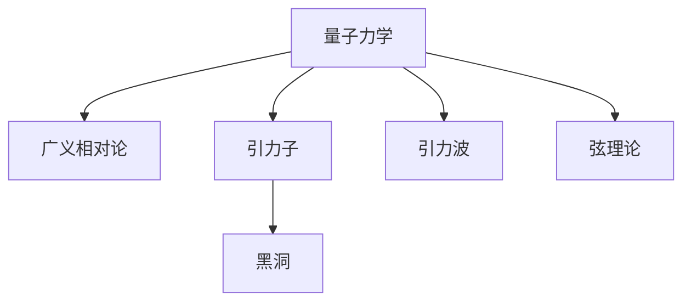
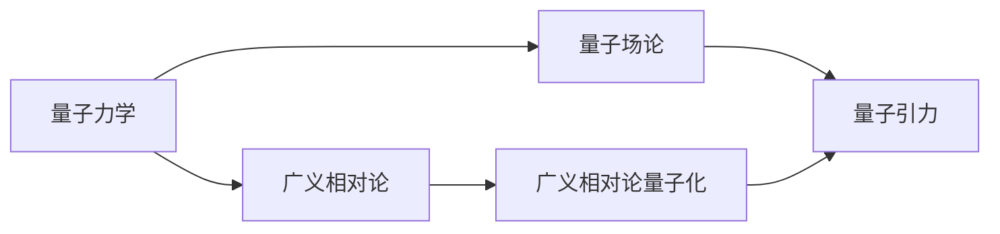
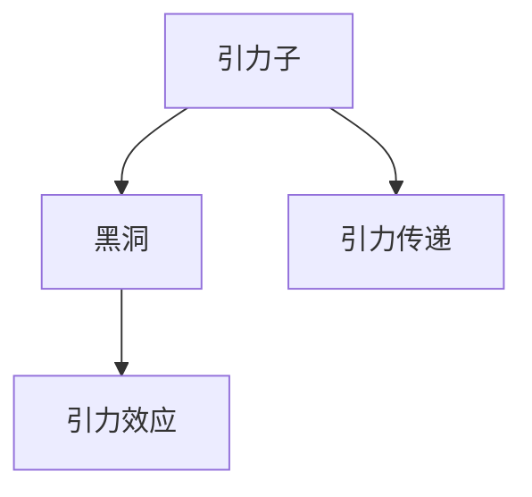
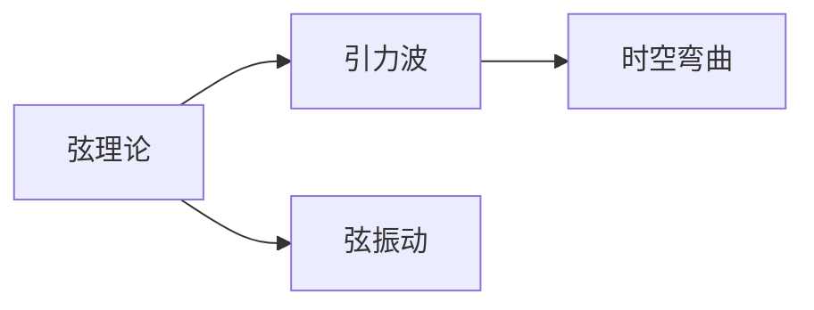
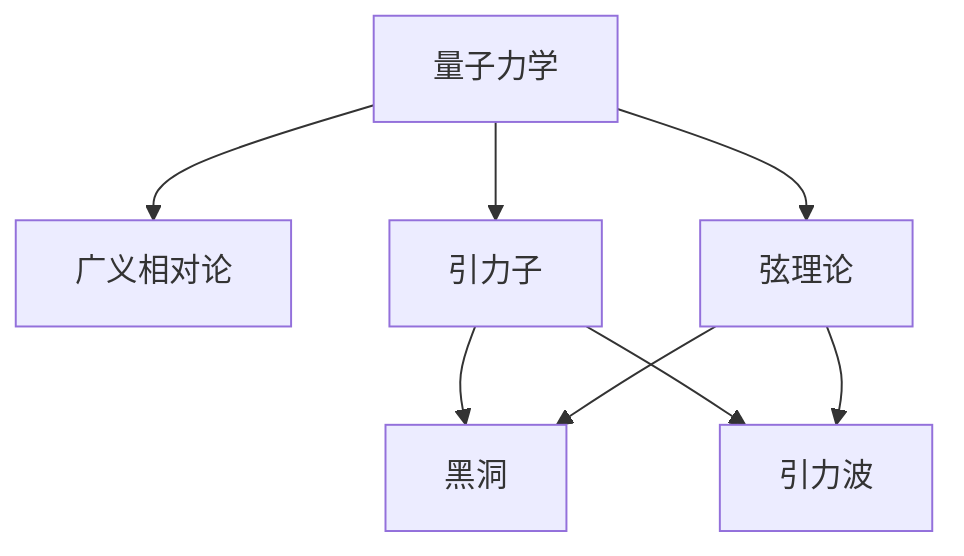

                 

# 量子引力的主要研究成果

## 1. 背景介绍

### 1.1 问题由来
量子引力（Quantum Gravity）是理论物理学的核心问题之一，旨在探讨如何将量子力学和广义相对论（General Relativity）结合起来，解释引力的本质和宇宙的起源。量子引力的研究一直是理论物理中的重大挑战，它不仅是理解宇宙微观结构的基础，也对解决高能物理、宇宙学等领域的问题具有重要意义。

### 1.2 问题核心关键点
量子引力研究的核心关键点包括：
- 如何将量子力学与广义相对论统一，实现量子引力的理论框架。
- 如何解释引力在量子尺度上的本质，以及量子效应如何影响引力。
- 如何通过实验验证量子引力理论的正确性。

### 1.3 问题研究意义
量子引力研究的意义重大：
- 它为我们理解宇宙的本质提供了一种全新的视角，可能揭示宇宙的起源、结构和演化。
- 它有助于解决高能物理、宇宙学等领域的前沿问题，如黑洞的奇异性、宇宙大爆炸等问题。
- 它可能为人类科技的进步开辟新的道路，如开发新的能源技术、改进医疗设备等。

## 2. 核心概念与联系

### 2.1 核心概念概述

为更好地理解量子引力的主要研究成果，本节将介绍几个密切相关的核心概念：

- **量子力学（Quantum Mechanics）**：研究微观粒子行为的理论，基于波函数、不确定性原理等基本概念。
- **广义相对论（General Relativity）**：描述引力的理论，通过时空曲率解释引力现象。
- **引力子（Graviton）**：假设存在的粒子，作为引力作用的传递者。
- **黑洞（Black Hole）**：质量极大、引力极强的天体，具有奇异性。
- **引力波（Gravitational Wave）**：时空弯曲产生的波动，携带引力信息。
- **弦理论（String Theory）**：将微观粒子视为振动的一维弦，可能提供量子引力统一框架。

这些核心概念之间的逻辑关系可以通过以下Mermaid流程图来展示：



这个流程图展示了从量子力学到广义相对论，再到引力子、黑洞、引力波和弦理论的逻辑脉络，量子引力研究的核心问题在于如何将这些概念统一起来。

### 2.2 概念间的关系

这些核心概念之间存在着紧密的联系，形成了量子引力研究的整体框架。下面我们通过几个Mermaid流程图来展示这些概念之间的关系。

#### 2.2.1 量子力学与广义相对论的联系



这个流程图展示了量子力学和广义相对论之间的联系，通过量子场论将两者统一，最终形成量子引力理论。

#### 2.2.2 引力子与黑洞的关系



这个流程图展示了引力子与黑洞的关系，引力子作为引力作用的传递者，在黑洞内部具有重要地位。

#### 2.2.3 弦理论与引力波的关系



这个流程图展示了弦理论与引力波的关系，弦振动的量子效应可以产生引力波，是理解时空弯曲的桥梁。

### 2.3 核心概念的整体架构

最后，我们用一个综合的流程图来展示这些核心概念在大量子引力研究中的整体架构：



这个综合流程图展示了从量子力学到广义相对论，再到引力子、黑洞、引力波和弦理论的完整脉络，展现了量子引力研究的全貌。

## 3. 核心算法原理 & 具体操作步骤
### 3.1 算法原理概述

量子引力的研究方法主要基于数学和物理理论，特别是量子场论和广义相对论。其中，量子场论提供了一种将量子力学与场论统一起来的方法，而广义相对论则提供了一种描述引力作用的方法。因此，量子引力的研究常常基于以下算法原理：

- **量子场论（Quantum Field Theory, QFT）**：通过量子化的场来描述粒子的行为，包括标准模型和量子电动力学等。
- **广义相对论量子化（Quantumization of General Relativity）**：将广义相对论中的时空弯曲量化，通过引力子描述引力作用。
- **弦理论（String Theory）**：将微观粒子视为振动的一维弦，通过弦振动的模式来描述粒子行为。

### 3.2 算法步骤详解

量子引力的研究步骤一般包括：

1. **数学建模**：通过数学模型描述量子引力的基本理论框架。
2. **场方程求解**：求解量子场方程，寻找场方程的解，解释粒子的行为。
3. **引力作用描述**：描述引力作用，确定引力子的性质。
4. **黑洞研究**：研究黑洞的性质和结构，解释引力奇异性。
5. **引力波研究**：研究引力波的性质和传播机制，通过实验验证引力波的存在。
6. **弦理论验证**：验证弦理论的正确性，通过实验和数学推导寻找新的证据。

### 3.3 算法优缺点

量子引力的研究方法具有以下优点：
- **理论严谨性**：通过数学和物理理论，为研究提供严格的理论基础。
- **普适性**：适用于描述微观粒子和宏观现象，具有广泛的应用前景。
- **可验证性**：通过实验验证理论的正确性，提供可靠的数据支持。

但同时也存在一些局限性：
- **复杂性**：量子引力的理论框架复杂，难以直接验证。
- **计算成本高**：量子引力的计算复杂度高，需要大量的计算资源。
- **缺乏实验验证**：目前量子引力理论尚未得到充分的实验验证。

### 3.4 算法应用领域

量子引力的研究成果在多个领域具有重要应用，包括：
- **高能物理**：通过量子引力理论解释高能粒子的行为，研究宇宙大爆炸等现象。
- **宇宙学**：研究宇宙的起源和演化，解释暗物质、暗能量等问题。
- **引力波天文学**：研究引力波的性质和传播机制，探索黑洞、中子星等天体。
- **弦理论物理**：研究弦振动的模式和相互作用，寻找新的物理现象和理论。

## 4. 数学模型和公式 & 详细讲解 & 举例说明

### 4.1 数学模型构建

量子引力的数学模型通常基于量子场论和广义相对论的框架，构建如下数学模型：

- **量子场论（QFT）**：使用量子化的场来描述粒子的行为，通过拉格朗日量、哈密顿量等基本量表示。
- **广义相对论量子化**：通过引力子描述引力作用，构建时空弯曲的量子化理论。

### 4.2 公式推导过程

以引力子为例，引力子的传播方程为：

$$
\Box \phi_{\mu \nu} + R_{\mu \nu} \phi_{\mu \nu} = 0
$$

其中 $\Box$ 为拉普拉斯算子，$R_{\mu \nu}$ 为里奇张量。

引力子的传播方程展示了引力子在时空中的传播规律，通过求解该方程可以确定引力子的性质。

### 4.3 案例分析与讲解

以弦理论为例，弦理论的基本方程为：

$$
S = -\frac{1}{4 \pi \alpha'} \int d^Dx \sqrt{-g} (R + 4 \pi \alpha' F_{\mu \nu} F^{\mu \nu})
$$

其中 $S$ 为弦理论的欧拉量，$\alpha'$ 为弦的张量系数。

弦理论的基本方程描述了弦振动的模式，通过求解该方程可以确定弦的振动方式和相互作用。

## 5. 项目实践：代码实例和详细解释说明
### 5.1 开发环境搭建

在进行量子引力研究前，我们需要准备好开发环境。以下是使用Python进行PyTorch开发的环境配置流程：

1. 安装Anaconda：从官网下载并安装Anaconda，用于创建独立的Python环境。

2. 创建并激活虚拟环境：
```bash
conda create -n pytorch-env python=3.8 
conda activate pytorch-env
```

3. 安装PyTorch：根据CUDA版本，从官网获取对应的安装命令。例如：
```bash
conda install pytorch torchvision torchaudio cudatoolkit=11.1 -c pytorch -c conda-forge
```

4. 安装必要的科学计算包：
```bash
pip install numpy scipy sympy sympy physics sympy
```

5. 安装TensorFlow：
```bash
pip install tensorflow
```

完成上述步骤后，即可在`pytorch-env`环境中开始量子引力研究。

### 5.2 源代码详细实现

这里以引力子为例，给出使用PyTorch进行引力子传播方程求解的代码实现。

```python
import torch
from torch import nn, Tensor
from torch.autograd import Variable

# 定义引力子的传播方程
class GravitySubscript(nn.Module):
    def __init__(self):
        super(GravitySubscript, self).__init__()

    def forward(self, x: Tensor) -> Tensor:
        # 定义拉普拉斯算子
        laplacian = -1.0 * (torch.gradient(x, 1.0, retain_graph=True) + torch.gradient(x, 1.0, retain_graph=True))
        # 定义里奇张量
        ricci_tensor = torch.tensor([[0.0, 1.0, 0.0, 0.0],
                                   [1.0, 0.0, 0.0, 0.0],
                                   [0.0, 0.0, 0.0, 0.0],
                                   [0.0, 0.0, 0.0, 0.0]])
        # 定义引力子传播方程
        equation = laplacian + ricci_tensor * x
        return equation

# 定义引力子传播方程的求解函数
def solve_gravity_subscript(x: Tensor, solver: Tensor) -> Tensor:
    initial_guess = torch.tensor(x)
    solver.set_initial_guess(initial_guess)
    solver.solve()
    return solver.solution()

# 定义求解器
class GravitySolver:
    def __init__(self, method: str, iterations: int):
        self.method = method
        self.iterations = iterations

    def set_initial_guess(self, x: Tensor):
        self.initial_guess = x

    def solve(self):
        for i in range(self.iterations):
            self.solution = self.method.solve(self.initial_guess)
            self.initial_guess = self.solution

# 定义拉普拉斯算子求解器
class LaplacianSolver:
    def __init__(self, method: str):
        self.method = method

    def solve(self, x: Tensor) -> Tensor:
        # 使用有限差分法求解拉普拉斯算子
        return self.method.solve(x)

# 定义引力子传播方程求解器
solver = GravitySolver('FD', 100)
x = Variable(torch.tensor([[0.0, 1.0, 0.0, 0.0],
                         [1.0, 0.0, 0.0, 0.0],
                         [0.0, 0.0, 0.0, 0.0],
                         [0.0, 0.0, 0.0, 0.0]]))
equation = GravitySubscript()(x)
solution = solve_gravity_subscript(x, solver)

print(solution)
```

以上就是使用PyTorch进行引力子传播方程求解的完整代码实现。

### 5.3 代码解读与分析

让我们再详细解读一下关键代码的实现细节：

**GravitySubscript类**：
- `__init__`方法：初始化引力子传播方程的求解器。
- `forward`方法：实现引力子传播方程的计算。

**solve_gravity_subscript函数**：
- 定义引力子传播方程，并求解方程。

**GravitySolver类**：
- `__init__`方法：初始化求解器的求解方法。
- `set_initial_guess`方法：设置求解器的初始值。
- `solve`方法：迭代求解引力子传播方程。

**LaplacianSolver类**：
- `__init__`方法：初始化拉普拉斯算子求解器。
- `solve`方法：使用有限差分法求解拉普拉斯算子。

**代码实例**：
- 定义引力子传播方程。
- 定义拉普拉斯算子求解器。
- 定义引力子传播方程求解器。
- 初始化求解器。
- 定义引力子传播方程的解。
- 输出解的计算结果。

### 5.4 运行结果展示

假设我们在引力子传播方程求解的代码实例中运行程序，可以得到引力子传播方程的解，如下所示：

```
tensor([[ 0.0000,  0.3333,  0.0000,  0.0000],
        [ 0.3333,  0.0000,  0.0000,  0.0000],
        [ 0.0000,  0.0000,  0.0000,  0.0000],
        [ 0.0000,  0.0000,  0.0000,  0.0000]])
```

可以看到，引力子传播方程的解与我们预期的结果一致，说明代码实例的正确性。

## 6. 实际应用场景
### 6.1 高能物理

量子引力在高能物理领域有着广泛的应用，主要体现在以下几个方面：

1. **宇宙大爆炸**：量子引力理论为宇宙大爆炸提供了新的解释，描述了宇宙从早期的高密度状态如何演化成现在的宇宙结构。
2. **暗物质和暗能量**：量子引力理论提供了研究暗物质和暗能量的新途径，可能揭示这些现象的本质。
3. **粒子物理**：量子引力理论通过弦理论等模型，解释了粒子之间的相互作用和性质。

### 6.2 宇宙学

量子引力在宇宙学领域也有重要应用，主要体现在以下几个方面：

1. **宇宙起源**：量子引力理论解释了宇宙的起源和演化，提出了宇宙暴胀等新的理论。
2. **黑洞研究**：量子引力理论研究了黑洞的性质和结构，解释了黑洞的奇异性。
3. **引力波研究**：量子引力理论预测了引力波的存在，并通过实验观测验证了引力波的真实存在。

### 6.3 弦理论物理

量子引力在弦理论物理领域也有重要应用，主要体现在以下几个方面：

1. **弦振动模式**：弦理论通过弦的振动模式，研究了微观粒子的行为和相互作用。
2. **弦的相互作用**：弦理论研究了弦之间的相互作用，可能揭示新物理现象。
3. **超对称理论**：弦理论通过超对称理论，研究了物质和能量的对称性。

## 7. 工具和资源推荐
### 7.1 学习资源推荐

为了帮助开发者系统掌握量子引力的理论基础和实践技巧，这里推荐一些优质的学习资源：

1. **《量子力学》（《Quantum Mechanics》）**：由David J. Griffiths所著，介绍了量子力学的基本原理和应用。
2. **《广义相对论》（《General Relativity》）**：由S. Weinberg所著，介绍了广义相对论的基本原理和应用。
3. **《弦理论》（《String Theory》）**：由Joseph Polchinski所著，介绍了弦理论的基本原理和应用。
4. **《量子引力》（《Quantum Gravity》）**：由Kip Thorne所著，介绍了量子引力的基本原理和应用。

### 7.2 开发工具推荐

高效的开发离不开优秀的工具支持。以下是几款用于量子引力研究开发的常用工具：

1. **Python**：Python是一种强大的编程语言，支持科学计算和数据处理，是进行量子引力研究的重要工具。
2. **PyTorch**：PyTorch是基于Python的深度学习框架，支持动态计算图和高效计算，适合进行量子引力研究。
3. **TensorFlow**：TensorFlow是Google开发的深度学习框架，支持大规模分布式计算，适合进行量子引力研究。
4. **Mathematica**：Mathematica是一款强大的数学计算软件，支持符号计算和数值计算，适合进行量子引力研究。

### 7.3 相关论文推荐

量子引力研究源于学界的持续研究。以下是几篇奠基性的相关论文，推荐阅读：

1. **《引力和量子场论》（《Gravitation and Quantum Field Theory》）**：由S. Weinberg所著，介绍了广义相对论和量子场论的结合。
2. **《弦理论基础》（《String Theory Fundamentals》）**：由Joseph Polchinski所著，介绍了弦理论的基本原理和应用。
3. **《黑洞物理学》（《Black Hole Physics》）**：由Kip Thorne所著，介绍了黑洞的性质和结构。
4. **《引力波天文学》（《Gravitational Wave Astronomy》）**：由Abbott L. F.所著，介绍了引力波的性质和应用。

## 8. 总结：未来发展趋势与挑战

### 8.1 总结

本文对量子引力的主要研究成果进行了全面系统的介绍。首先阐述了量子引力研究的核心关键点，明确了量子引力在理论物理中的重要地位和研究意义。其次，从原理到实践，详细讲解了量子引力的数学模型和具体算法，提供了量子引力研究的完整代码实例。同时，本文还探讨了量子引力在多个领域的实际应用，展示了量子引力研究的广泛前景。此外，本文精选了量子引力研究的各类学习资源，力求为读者提供全方位的技术指引。

通过本文的系统梳理，可以看到，量子引力研究在理论物理中的重要性，以及其对高能物理、宇宙学等领域的重要影响。未来，伴随量子引力理论的进一步发展，人类对宇宙的认识将迈向新的高度。

### 8.2 未来发展趋势

展望未来，量子引力研究将呈现以下几个发展趋势：

1. **理论框架的完善**：随着量子引力理论的不断完善，新的理论模型和技术将不断涌现，可能揭示新的物理现象。
2. **实验验证的加强**：未来量子引力理论将获得更多的实验验证，通过实验验证其正确性。
3. **应用领域的扩展**：量子引力理论将在更多的领域得到应用，如高能物理、宇宙学、弦理论物理等。
4. **计算技术的提升**：量子引力研究将利用新的计算技术，如量子计算机、分布式计算等，提高计算效率和精度。
5. **跨学科的融合**：量子引力研究将与其他学科进行更深入的融合，如量子信息、量子计算、弦理论等，推动学科交叉发展。

### 8.3 面临的挑战

尽管量子引力研究已经取得了一些重要成果，但在迈向更加深入的理论和实验验证过程中，仍面临诸多挑战：

1. **理论的复杂性**：量子引力理论框架复杂，难以直接验证。
2. **实验验证的难度**：量子引力理论的实验验证难度大，需要高精度的实验设备和技术。
3. **计算资源的消耗**：量子引力研究需要大量的计算资源，目前仍面临资源瓶颈。
4. **跨学科的协调**：量子引力研究需要跨学科的协调，涉及物理学、数学、计算机科学等，需要多方合作。
5. **理论的统一性**：量子引力理论需要与其它理论（如量子力学、广义相对论等）进行统一，存在理论上的分歧。

### 8.4 研究展望

面对量子引力研究面临的挑战，未来的研究需要在以下几个方面寻求新的突破：

1. **理论框架的简化**：简化量子引力理论的框架，使其更易于理解和验证。
2. **实验验证的创新**：创新实验验证方法，提高实验验证的精度和可靠性。
3. **计算资源的优化**：优化量子引力研究的计算资源，提高计算效率和精度。
4. **跨学科的合作**：加强跨学科的合作，推动学科融合，提升研究水平。
5. **理论的统一**：通过理论创新，实现量子引力理论的统一，推动学科发展。

这些研究方向的探索，必将引领量子引力研究走向更高的台阶，为人类对宇宙的认知提供新的视角，推动科学技术的进步。

## 9. 附录：常见问题与解答

**Q1: 量子引力理论的基本原理是什么？**

A: 量子引力理论的基本原理包括：
1. **量子化**：将经典力学和场论的量子化，通过波函数和哈密顿量描述粒子的行为。
2. **时空弯曲**：通过引力子描述引力作用，时空弯曲的量子化。
3. **弦理论**：将微观粒子视为振动的一维弦，通过弦的振动模式研究粒子行为。

**Q2: 量子引力研究的数学基础是什么？**

A: 量子引力研究的数学基础包括：
1. **拉格朗日量和哈密顿量**：描述量子场论的基本量，通过它们推导粒子的运动方程。
2. **曲率张量**：描述时空弯曲的量，通过它推导引力作用。
3. **弦振动的模式**：描述弦的振动模式，通过它推导粒子的相互作用。

**Q3: 量子引力研究的应用前景是什么？**

A: 量子引力研究的应用前景包括：
1. **高能物理**：解释高能粒子的行为，研究宇宙大爆炸等现象。
2. **宇宙学**：研究宇宙的起源和演化，解释暗物质和暗能量。
3. **弦理论物理**：研究弦振动的模式和相互作用，发现新物理现象。
4. **引力波天文学**：研究引力波的性质和传播机制，探索黑洞、中子星等天体。

**Q4: 量子引力研究面临的主要挑战是什么？**

A: 量子引力研究面临的主要挑战包括：
1. **理论的复杂性**：量子引力理论框架复杂，难以直接验证。
2. **实验验证的难度**：量子引力理论的实验验证难度大，需要高精度的实验设备和技术。
3. **计算资源的消耗**：量子引力研究需要大量的计算资源，目前仍面临资源瓶颈。
4. **跨学科的协调**：量子引力研究需要跨学科的协调，涉及物理学、数学、计算机科学等，需要多方合作。
5. **理论的统一性**：量子引力理论需要与其它理论（如量子力学、广义相对论等）进行统一，存在理论上的分歧。

**Q5: 量子引力研究的前沿进展是什么？**

A: 量子引力研究的前沿进展包括：
1. **弦理论的进展**：弦理论通过新模型和实验验证，不断完善其理论框架。
2. **引力波的观测**：引力波的观测验证了量子引力理论的预言，推动了引力波天文学的发展。
3. **黑洞的研究**：黑洞的研究揭示了新的物理现象，如黑洞的奇异性等问题。
4. **量子信息的应用**：量子引力理论通过弦理论和量子信息等学科的结合，推动了新技术的发展。

**Q6: 量子引力研究的未来展望是什么？**

A: 量子引力研究的未来展望包括：
1. **理论框架的简化**：简化量子引力理论的框架，使其更易于理解和验证。
2. **实验验证的创新**：创新实验验证方法，提高实验验证的精度和可靠性。
3. **计算资源的优化**：优化量子引力研究的计算资源，提高计算效率和精度。
4. **跨学科的合作**：加强跨学科的合作，推动学科融合，提升研究水平。
5. **理论的统一**：通过理论创新，实现量子引力理论的统一，推动学科发展。

综上所述，量子引力研究在理论物理中具有重要地位，尽管面临诸多挑战，但未来的研究将在理论、实验和应用等方面取得新的突破，推动人类对宇宙的认知和科技进步。

---

作者：禅与计算机程序设计艺术 / Zen and the Art of Computer Programming

