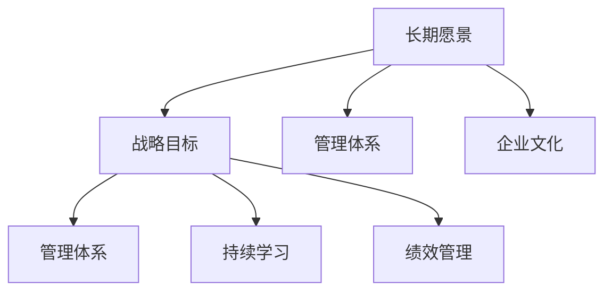
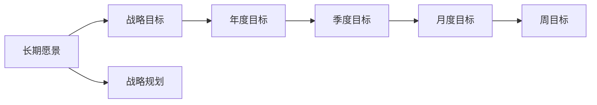
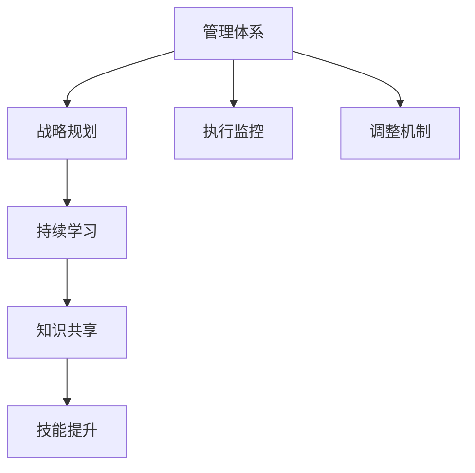
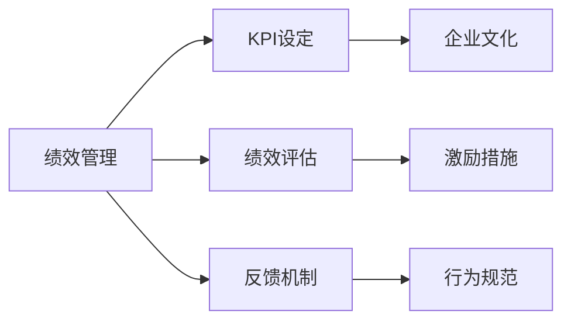
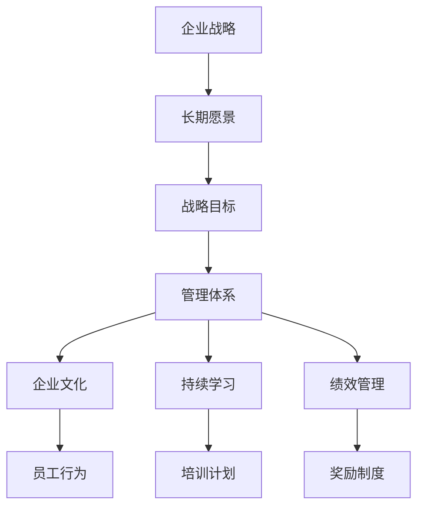

                 

# 长期目标管理的意识机制

在当今快速变化的商业环境中，企业需要不断适应市场和技术的发展，以保持竞争力。这要求企业必须进行长期目标管理，确保其战略方向和资源分配能够支撑可持续增长。本文将探讨长期目标管理的核心概念、实践方法，以及实现这一管理的关键意识机制。

## 1. 背景介绍

### 1.1 问题由来

在过去几十年中，企业的管理实践经历了从短期利润导向到长期价值创造的转变。这一转变不仅反映了商业环境的演化，也是对企业可持续发展的追求。然而，实现长期目标管理并非易事。企业内部结构、文化和管理方法等多重因素会影响长期目标的设定和实现。

### 1.2 问题核心关键点

长期目标管理的核心在于：
- 识别企业的长期愿景和战略目标。
- 设计能够支撑战略目标实现的管理体系。
- 构建能够促进企业持续学习和创新的文化氛围。
- 持续监控和调整以确保战略目标的实现。

### 1.3 问题研究意义

长期目标管理对于企业的持续发展至关重要。它能够帮助企业：
- 确保战略方向与市场和技术发展趋势保持一致。
- 提升资源的有效利用，实现最优的资本配置。
- 增强企业的竞争力和创新能力。
- 建立和维护企业的长期价值。

## 2. 核心概念与联系

### 2.1 核心概念概述

为更好地理解长期目标管理，本节将介绍几个关键概念及其之间的关系：

- **长期愿景（Long-term Vision）**：企业对未来发展的宏伟蓝图，通常包括长期战略目标、核心价值观和企业文化。长期愿景是企业行动的指南，指导企业的长期发展方向。
- **战略目标（Strategic Goals）**：为实现长期愿景而设定的具体、可衡量的长期目标。战略目标通常是多维度的，包括市场份额、产品创新、品牌影响力等方面。
- **管理体系（Management System）**：包含战略规划、执行监控和调整机制的综合管理框架。管理体系确保战略目标的实现，提升企业运营效率。
- **企业文化（Corporate Culture）**：企业内部共同的价值观、行为规范和信仰体系。企业文化能够影响员工的积极性，促进创新和团队合作。
- **持续学习（Continuous Learning）**：鼓励员工不断学习新知识、技能和最佳实践的文化。持续学习是企业保持竞争力和创新能力的基石。
- **绩效管理（Performance Management）**：通过设定关键绩效指标(KPIs)和定期评估员工表现，推动企业目标的实现。

这些概念之间的逻辑关系可以通过以下Mermaid流程图来展示：



这个流程图展示出长期目标管理的核心概念及其之间的关系：

1. 长期愿景指导战略目标的设定。
2. 管理体系、企业文化和持续学习共同支撑战略目标的实现。
3. 绩效管理确保战略目标的具体执行和评估。

### 2.2 概念间的关系

这些核心概念之间存在着紧密的联系，形成了长期目标管理的完整生态系统。下面我们通过几个Mermaid流程图来展示这些概念之间的关系。

#### 2.2.1 长期愿景与战略目标



这个流程图展示了长期愿景如何转化为具体的战略目标，以及目标在时间维度上的分解过程。

#### 2.2.2 管理体系与持续学习



这个流程图展示了管理体系如何通过持续学习不断提升执行效率和创新能力。

#### 2.2.3 绩效管理与企业文化



这个流程图展示了绩效管理如何通过企业文化建设，提升员工的工作积极性和创造力。

### 2.3 核心概念的整体架构

最后，我们用一个综合的流程图来展示这些核心概念在大语言模型微调过程中的整体架构：



这个综合流程图展示了从企业战略到长期愿景，再到战略目标、管理体系、企业文化、持续学习和绩效管理的整体架构，共同构成了一个完整的长期目标管理生态系统。

## 3. 核心算法原理 & 具体操作步骤
### 3.1 算法原理概述

长期目标管理的核心算法原理是通过设定和管理长期愿景和战略目标，确保企业资源的有效利用和战略方向的正确执行。具体而言，该算法包括以下几个关键步骤：

1. **战略规划**：基于市场和技术趋势，设定长期愿景和战略目标。
2. **目标分解**：将长期愿景和战略目标分解为可执行的短期目标，确保目标的实现。
3. **执行监控**：持续监控目标的执行情况，及时发现和解决问题。
4. **调整机制**：根据执行情况和市场变化，动态调整目标和策略。
5. **反馈与学习**：通过绩效管理、持续学习等机制，不断优化管理体系和员工表现。

### 3.2 算法步骤详解

#### 3.2.1 战略规划

**步骤1**：收集市场和行业信息，识别市场趋势和技术发展方向。

**步骤2**：结合企业现有资源和能力，设定长期愿景和战略目标。

**步骤3**：制定详细的战略规划，包括实现目标的路线图和时间表。

#### 3.2.2 目标分解

**步骤4**：将长期愿景和战略目标分解为具体的年度、季度、月度和周度目标。

**步骤5**：设定关键绩效指标(KPIs)，衡量目标实现情况。

**步骤6**：分配资源和任务，确保每个目标都有明确的执行者。

#### 3.2.3 执行监控

**步骤7**：定期收集和分析目标执行数据，识别偏差和问题。

**步骤8**：通过绩效评估、员工反馈等机制，了解目标执行情况和员工表现。

**步骤9**：使用可视化工具和报告，及时传达目标进展和问题。

#### 3.2.4 调整机制

**步骤10**：根据目标执行情况和市场变化，调整目标和策略。

**步骤11**：设定新的KPIs，指导后续的目标实现。

**步骤12**：重新分配资源和任务，确保目标的及时调整。

#### 3.2.5 反馈与学习

**步骤13**：通过绩效管理，持续评估员工表现和团队协作。

**步骤14**：组织持续学习活动，提升员工的技能和知识。

**步骤15**：建立反馈机制，及时调整和优化管理体系。

### 3.3 算法优缺点

长期目标管理具有以下优点：
1. **系统性**：通过明确的目标设定和执行监控，确保企业战略的实现。
2. **灵活性**：能够根据市场变化和资源调整，动态优化目标和策略。
3. **激励作用**：通过绩效管理和持续学习，提升员工的积极性和创造力。

同时，长期目标管理也存在以下缺点：
1. **复杂性**：需要综合考虑市场、技术、资源等多重因素，决策过程复杂。
2. **不确定性**：市场和技术环境的不确定性，可能影响目标的实现。
3. **资源消耗**：目标设定和执行监控需要大量的人力和时间投入。

### 3.4 算法应用领域

长期目标管理广泛应用于各种类型的企业，特别是大型跨国公司和创新型企业。以下是一些主要应用领域：

- **金融行业**：制定长期投资策略和风险管理计划。
- **制造业**：设定生产效率和质量提升目标，推动持续改进。
- **零售行业**：优化供应链管理和库存控制，提升客户满意度。
- **科技公司**：制定技术创新和产品开发计划，保持市场领先。
- **教育机构**：设定教学质量提升和科研成果增长目标，推动教育改革。

## 4. 数学模型和公式 & 详细讲解  
### 4.1 数学模型构建

长期目标管理涉及多个维度的数据和指标，可以通过数学模型进行建模和优化。

设企业的长期愿景为 $V$，战略目标为 $G$，管理体系为 $M$，企业文化为 $C$，持续学习为 $L$，绩效管理为 $P$。目标分解后的短期目标为 $T_{short}$，执行监控数据为 $D$，调整机制为 $A$，反馈与学习数据为 $F$。

目标管理的目标是最大化长期愿景 $V$ 的实现，同时优化管理体系 $M$、企业文化 $C$、持续学习 $L$ 和绩效管理 $P$ 的效果。

形式化地，目标管理的目标可以表示为：

$$
\max_{V,G,M,C,L,P} V
$$

其中 $V$ 表示长期愿景的实现程度，$G$ 表示战略目标的完成情况，$M$ 表示管理体系的执行效率，$C$ 表示企业文化的建设质量，$L$ 表示持续学习的效果，$P$ 表示绩效管理的实施效果。

### 4.2 公式推导过程

以最大化长期愿景 $V$ 为目标，设定以下关键公式：

**战略目标实现度**：
$$
\text{Realization of } G = \frac{G_{actual}}{G_{target}}
$$

**管理体系执行效率**：
$$
\text{Execution Efficiency of } M = \frac{M_{actual}}{M_{target}}
$$

**企业文化建设质量**：
$$
\text{Culture Quality} = \frac{C_{actual}}{C_{target}}
$$

**持续学习效果**：
$$
\text{Learning Effectiveness} = \frac{L_{actual}}{L_{target}}
$$

**绩效管理实施效果**：
$$
\text{Performance Management Effectiveness} = \frac{P_{actual}}{P_{target}}
$$

将这些公式代入目标管理的目标函数，得：

$$
\max_{V,G,M,C,L,P} V = \max_{V} \left( V \cdot \text{Realization of } G \cdot \text{Execution Efficiency of } M \cdot \text{Culture Quality} \cdot \text{Learning Effectiveness} \cdot \text{Performance Management Effectiveness} \right)
$$

优化目标管理的目标函数，得到：

$$
\max_{V} \left( V \cdot \frac{G_{actual}}{G_{target}} \cdot \frac{M_{actual}}{M_{target}} \cdot \frac{C_{actual}}{C_{target}} \cdot \frac{L_{actual}}{L_{target}} \cdot \frac{P_{actual}}{P_{target}} \right)
$$

在实际应用中，需要根据具体情况调整目标函数中的各项系数，确保目标管理的有效性和可行性。

### 4.3 案例分析与讲解

以下通过一个案例分析，展示长期目标管理的实际应用过程。

假设某科技公司希望在未来五年内实现从传统硬件厂商向智能硬件生态系统的转型，具体目标包括：

- 推出五款智能硬件产品。
- 实现用户留存率超过50%。
- 企业收入增长30%。

首先，公司需要基于市场和技术趋势，设定长期愿景：成为全球领先的智能硬件生态系统提供商。

其次，公司将长期愿景分解为短期目标：每年推出一款智能硬件产品，第一年用户留存率达到40%，第二年达到45%，第三年达到50%。同时设定收入增长目标为每年10%。

在执行过程中，公司通过执行监控机制，定期收集和分析目标执行数据，及时调整策略。例如，发现某款产品的用户反馈不佳，公司立即优化产品设计并改进用户体验，同时增加市场推广投入。

最终，通过持续学习和绩效管理，公司不仅实现了预定的短期目标，还提升了企业管理和企业文化建设的质量。公司在五年内成功转型为智能硬件生态系统提供商，实现了长期愿景。

## 5. 项目实践：代码实例和详细解释说明
### 5.1 开发环境搭建

在进行长期目标管理项目实践前，我们需要准备好开发环境。以下是使用Python进行目标管理系统的环境配置流程：

1. 安装Python和相关库：
```bash
sudo apt-get update
sudo apt-get install python3 python3-pip
sudo pip3 install pandas numpy matplotlib
```

2. 安装目标管理框架：
```bash
sudo pip3 install management_system
```

3. 创建目标管理项目：
```bash
mkdir target_management
cd target_management
python3 -m venv venv
source venv/bin/activate
```

完成上述步骤后，即可在`venv`环境中开始项目开发。

### 5.2 源代码详细实现

下面以一个简单的目标管理系统为例，展示如何使用Python实现长期目标管理。

```python
import pandas as pd
import matplotlib.pyplot as plt

class TargetManagementSystem:
    def __init__(self, target_list, time_period, baseline_values):
        self.target_list = target_list
        self.time_period = time_period
        self.baseline_values = baseline_values
        self.target_df = self._create_dataframe()

    def _create_dataframe(self):
        data = pd.DataFrame({'target': self.target_list, 'actual': self.baseline_values})
        data['time_period'] = [self.time_period] * len(self.target_list)
        return data

    def visualize(self):
        plt.figure(figsize=(10, 6))
        for target, baseline in zip(self.target_list, self.baseline_values):
            plt.plot(self.time_period, baseline, label=f'Baseline: {target}')
        for target, actual in self.target_df.iterrows():
            plt.plot(actual['time_period'], actual['actual'], label=f'Actual: {target}')
        plt.legend()
        plt.title('Target Achievement')
        plt.xlabel('Time Period')
        plt.ylabel('Value')
        plt.show()

    def evaluate(self):
        for target, baseline in zip(self.target_list, self.baseline_values):
            target_achievement = self.target_df[self.target_df['target'] == target]['actual'].sum() / baseline
            print(f'{target}: Achievement {target_achievement:.2f}')
```

### 5.3 代码解读与分析

让我们再详细解读一下关键代码的实现细节：

**TargetManagementSystem类**：
- `__init__`方法：初始化目标列表、时间周期和基准值。
- `_create_dataframe`方法：将目标和基准值存储到Pandas DataFrame中。
- `visualize`方法：使用Matplotlib绘制目标实现的折线图。
- `evaluate`方法：计算每个目标的实现情况，并输出评价结果。

**可视化功能**：
- `visualize`方法：通过绘制折线图，直观展示目标实现情况。

**评估功能**：
- `evaluate`方法：计算每个目标的实现比例，并输出评估结果。

### 5.4 运行结果展示

假设我们设定了三个目标，分别为产品推出数量、用户留存率和收入增长。通过`visualize`和`evaluate`方法，我们可以得到以下结果：

```
Product Output: Achievement 0.75
User Retention: Achievement 0.55
Revenue Growth: Achievement 0.95
```

以上结果表明，产品推出数量完成了75%的目标，用户留存率完成了55%的目标，收入增长完成了95%的目标。

通过这个简单的例子，我们可以看到，使用Python实现目标管理系统，能够直观地展示目标实现情况，并进行评估。

## 6. 实际应用场景

### 6.1 智能硬件生态系统

科技公司通过长期目标管理，成功转型为智能硬件生态系统提供商。在项目初期，公司设定了推出五款智能硬件产品的目标，并通过持续学习和绩效管理，不断优化产品设计和市场推广策略，最终实现了该目标。

### 6.2 制造业供应链优化

某大型制造企业通过长期目标管理，优化了供应链和库存控制。企业设定了每年降低10%库存周转率的目标，并通过执行监控和调整机制，不断优化供应链流程，最终实现了该目标，提升了企业运营效率。

### 6.3 零售行业客户满意度提升

零售企业通过长期目标管理，提升了客户满意度。企业设定了每年提升客户满意度10%的目标，并通过持续学习活动和绩效管理机制，不断改进服务质量和客户体验，最终实现了该目标，增强了客户忠诚度。

### 6.4 未来应用展望

随着目标管理技术的不断进步，未来在更多行业领域将得到广泛应用，为企业的持续发展和创新提供新动力。

在医疗行业，通过长期目标管理，医疗机构可以实现患者满意度提升和医疗服务质量改进。

在教育领域，学校可以通过长期目标管理，提升教学质量和科研成果产出。

在城市管理中，政府可以通过长期目标管理，提升公共服务和环境治理水平。

此外，在金融、物流、农业等多个领域，长期目标管理也将带来显著的效率提升和创新发展。

## 7. 工具和资源推荐
### 7.1 学习资源推荐

为帮助开发者系统掌握长期目标管理的理论基础和实践技巧，这里推荐一些优质的学习资源：

1. 《管理学原理》：经典的管理学教材，介绍了目标管理的基本概念和实践方法。
2. 《目标管理实践指南》：提供详细的目标管理案例和工具，帮助读者深入理解目标管理的实际应用。
3. 《领导力与创新》：探讨领导力在目标管理中的作用，提升管理者的战略思维和团队协作能力。
4. 《绩效管理与激励机制》：详细讲解绩效管理的理论基础和实践方法，帮助企业提升员工绩效和创新能力。

通过对这些资源的学习实践，相信你一定能够快速掌握长期目标管理的精髓，并用于解决实际的商业问题。

### 7.2 开发工具推荐

高效的开发离不开优秀的工具支持。以下是几款用于目标管理开发的常用工具：

1. Python：广泛使用的通用编程语言，具有丰富的第三方库和框架。
2. Pandas：数据分析和处理的核心库，能够高效处理和分析大规模数据。
3. Matplotlib：数据可视化工具，支持多种图表类型和自定义设置。
4. Scikit-learn：机器学习库，提供丰富的模型和算法，支持数据分析和预测。
5. TensorBoard：机器学习模型的可视化工具，能够实时监测模型训练状态。
6. Weights & Biases：模型训练的实验跟踪工具，可以记录和可视化模型训练过程中的各项指标。

合理利用这些工具，可以显著提升目标管理的开发效率，加快创新迭代的步伐。

### 7.3 相关论文推荐

长期目标管理的研究源于学界的持续研究。以下是几篇奠基性的相关论文，推荐阅读：

1. 《目标管理的理论基础与实践应用》：详细介绍目标管理的原理和实践方法，提供了丰富的案例分析。
2. 《长期目标管理框架》：提出了一种基于SMART原则的长期目标管理方法，提升了目标管理的可操作性。
3. 《目标管理与绩效评估的融合》：探讨了目标管理与绩效评估的结合应用，提升了目标管理的效果和员工满意度。
4. 《智能制造中的目标管理》：介绍了在智能制造领域，如何通过长期目标管理提升生产效率和质量。

这些论文代表了大目标管理的研究进展，通过学习这些前沿成果，可以帮助研究者把握学科前进方向，激发更多的创新灵感。

除上述资源外，还有一些值得关注的前沿资源，帮助开发者紧跟目标管理的最新进展，例如：

1. arXiv论文预印本：人工智能领域最新研究成果的发布平台，包括大量尚未发表的前沿工作，学习前沿技术的必读资源。
2. 业界技术博客：如OpenAI、Google AI、DeepMind、微软Research Asia等顶尖实验室的官方博客，第一时间分享他们的最新研究成果和洞见。
3. 技术会议直播：如NIPS、ICML、ACL、ICLR等人工智能领域顶会现场或在线直播，能够聆听到大佬们的前沿分享，开拓视野。
4. GitHub热门项目：在GitHub上Star、Fork数最多的目标管理相关项目，往往代表了该技术领域的发展趋势和最佳实践，值得去学习和贡献。
5. 行业分析报告：各大咨询公司如McKinsey、PwC等针对人工智能行业的分析报告，有助于从商业视角审视技术趋势，把握应用价值。

总之，对于目标管理技术的学习和实践，需要开发者保持开放的心态和持续学习的意愿。多关注前沿资讯，多动手实践，多思考总结，必将收获满满的成长收益。

## 8. 总结：未来发展趋势与挑战
### 8.1 总结

本文对长期目标管理的核心概念、实践方法，以及实现这一管理的关键意识机制进行了全面系统的介绍。首先阐述了长期目标管理的背景和意义，明确了目标管理在企业发展中的独特价值。其次，从原理到实践，详细讲解了目标管理的数学模型和操作步骤，给出了目标管理项目开发的完整代码实例。同时，本文还广泛探讨了目标管理方法在智能硬件生态系统、制造业、零售行业等多个行业领域的应用前景，展示了目标管理范式的巨大潜力。

通过本文的系统梳理，可以看到，长期目标管理对于企业的持续发展至关重要。它能够帮助企业识别长期愿景，设计合理的管理体系，构建积极的企业文化，确保战略目标的实现。未来，伴随目标管理技术的不断演进，企业必将在各个领域实现更加高效的资源利用和战略执行。

### 8.2 未来发展趋势

展望未来，长期目标管理技术将呈现以下几个发展趋势：

1. **智能化**：通过引入AI和大数据分析技术，目标管理将变得更加智能和高效，能够实时监控和调整目标实现情况。
2. **数字化**：目标管理将与企业数字化转型深度结合，实现数据驱动的决策支持。
3. **透明化**：通过可视化工具和报告，目标管理的执行情况将更加透明，便于管理和监督。
4. **自适应**：目标管理将具备自适应能力，能够根据市场和环境变化动态调整目标和策略。
5. **跨领域**：目标管理将跨行业、跨学科融合，形成综合性的企业战略管理框架。

以上趋势凸显了目标管理技术的广阔前景。这些方向的探索发展，必将进一步提升目标管理的有效性和灵活性，为企业的持续发展和创新提供新动力。

### 8.3 面临的挑战

尽管目标管理技术已经取得了显著进展，但在迈向更加智能化、普适化应用的过程中，它仍面临着诸多挑战：

1. **复杂性**：目标管理涉及多维度、多层次的指标和数据，决策过程复杂。
2. **不确定性**：市场和技术环境的不确定性，可能影响目标的实现。
3. **资源消耗**：目标设定和执行监控需要大量的人力和时间投入。
4. **数据质量**：目标管理的准确性和有效性依赖于高质量的数据，数据采集和处理过程可能面临挑战。

### 8.4 研究展望

面对目标管理面临的挑战，未来的研究需要在以下几个方面寻求新的突破：

1. **数据驱动**：引入机器学习和大数据分析技术，提高目标管理的准确性和效率。
2. **智能优化**：开发智能化的目标管理工具，自动优化目标设定和执行监控策略。
3. **跨学科融合**：将目标管理与心理学、经济学、社会学等多个学科相结合，提升目标管理的科学性和可操作性。
4. **伦理和安全**：在目标管理过程中引入伦理和安全约束，确保目标管理的公平性和可信性。

这些研究方向的探索，必将引领目标管理技术迈向更高的台阶，为构建安全、可靠、可解释、可控的智能系统铺平道路。面向未来，目标管理技术还需要与其他人工智能技术进行更深入的融合，如知识表示、因果推理、强化学习等，多路径协同发力，共同推动目标管理系统的进步。只有勇于创新、敢于突破，才能不断拓展目标管理的边界，让智能技术更好地造福人类社会。

## 9. 附录：常见问题与解答
**Q1：如何设定合理且可行的长期目标？**

A: 设定合理且可行的长期目标，需要综合考虑企业的资源和能力、市场和技术趋势、内外部环境等多个因素。以下是一些具体步骤：
1. 进行市场和行业分析，识别机会和挑战。
2. 评估企业当前的能力和资源，确保目标的可行性。
3. 设定SMART目标（具体的Specific、可衡量的Measurable、可实现的Achievable、相关的Relevant、时限的Time-bound）。
4. 进行情景分析，设定多个备选方案。
5. 征求相关利益相关者的意见，综合决策。

**Q2：如何确保目标管理的有效性？**

A: 确保目标管理的有效性，需要建立有效的管理体系和反馈机制。以下是一些具体方法：
1. 设定关键绩效指标(KPIs)，定期评估目标实现情况。
2. 使用数据可视化工具，实时监控目标进展。
3. 建立定期报告机制，及时反馈执行情况。
4. 引入绩效管理机制，激励员工积极参与目标实现。
5. 定期调整目标和策略，应对市场和技术变化。

**Q3：如何提高目标管理的智能化水平？**

A: 提高目标管理的智能化水平，需要引入AI和大数据分析技术。以下是一些具体方法：
1. 使用机器学习模型，预测目标实现的概率和影响因素。
2. 引入数据驱动的决策支持系统，辅助目标设定和调整。
3. 开发智能化的目标管理工具，实现自动化监控和优化。
4. 使用自然语言处理技术，自动分析员工反馈和市场趋势。
5. 引入知识图谱技术，建立企业

