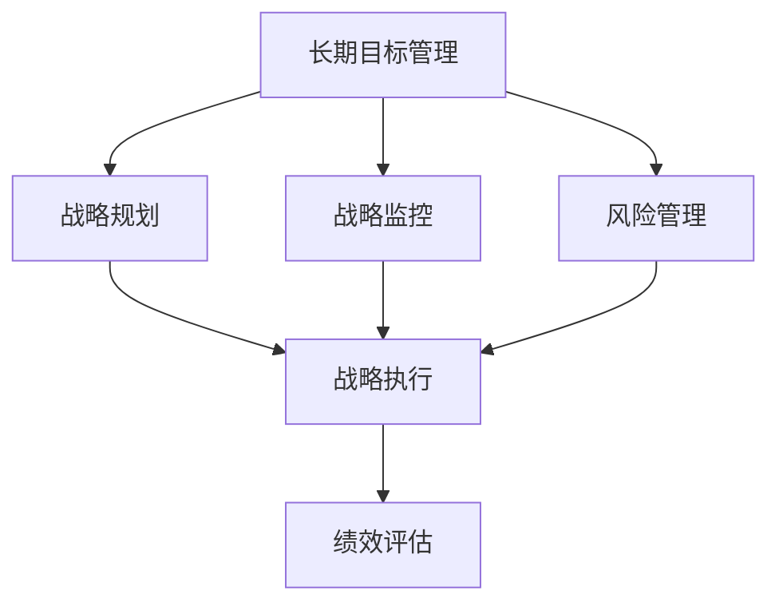
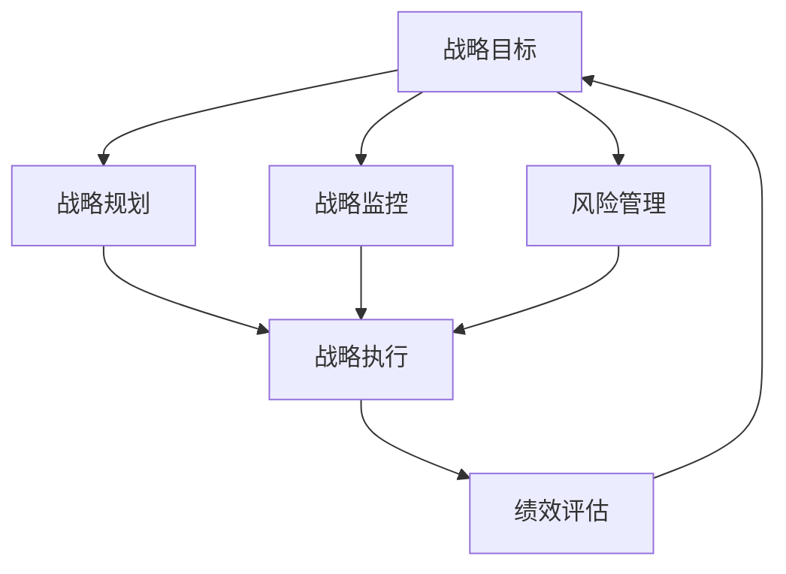

                 

# 长期目标管理的意识策略

## 1. 背景介绍

### 1.1 问题由来

在现代社会中，个体和企业都面临着日益复杂的决策环境。面对多变的市场、激烈的市场竞争、瞬息万变的技术趋势，如何制定和执行长期目标成为一项重要的管理任务。然而，许多企业在追求短期利益和效率时，忽视了长期目标的规划与管理，导致战略目标的实现受阻。

长期目标管理的缺失不仅影响到企业的可持续发展，还可能导致资源浪费、人才流失和市场地位的丧失。因此，如何有效地进行长期目标管理，制定科学、合理的战略规划，是当前企业和个人面临的重要课题。

### 1.2 问题核心关键点

长期目标管理的核心关键点包括：

1. **目标设定**：明确具体的、可衡量的、可实现的、相关的、时间限定的目标。
2. **战略规划**：基于目标设定，制定详细的行动计划和资源分配策略。
3. **执行监控**：定期评估目标实现情况，及时调整战略和行动计划。
4. **风险管理**：识别潜在风险，制定应对措施，保障目标的实现。
5. **绩效评估**：评估目标达成情况，调整管理策略，提升组织绩效。

这些关键点构成了长期目标管理的基本框架，帮助企业和个人在复杂多变的环境中，保持战略的一致性和持续性。

### 1.3 问题研究意义

有效进行长期目标管理，有助于企业在竞争激烈的市场中占据有利位置，提升市场适应能力和竞争力。对于个人而言，长期目标管理能够帮助其规划职业生涯，提升个人成就感和职业满意度。研究长期目标管理的方法和策略，对于提升企业战略执行力、促进个人职业发展具有重要意义。

## 2. 核心概念与联系

### 2.1 核心概念概述

1. **长期目标管理**：通过系统性的方法，明确目标、制定计划、执行监控、风险管理和绩效评估，实现长期目标的过程。
2. **战略规划**：基于长期目标，制定详细的行动计划和资源分配策略。
3. **战略执行**：通过有效的管理手段，确保战略计划得以顺利实施。
4. **绩效评估**：对战略执行结果进行评价，衡量战略的有效性。

这些核心概念相互联系，共同构成了长期目标管理的完整框架。

### 2.2 概念间的关系

长期目标管理与战略规划、战略执行、绩效评估等概念的关系可以通过以下Mermaid流程图展示：



该流程图展示了长期目标管理与战略规划、战略执行和绩效评估等概念之间的关系，强调了在管理过程中对战略执行和风险管理的持续监控和调整。

### 2.3 核心概念的整体架构

最后，我们用一个综合的流程图来展示这些核心概念在大规模环境下的整体架构：



这个综合流程图展示了从战略目标设定到绩效评估的完整过程，强调了战略执行和风险管理在整个管理过程中的重要性。

## 3. 核心算法原理 & 具体操作步骤
### 3.1 算法原理概述

长期目标管理的核心算法原理基于SMART原则和OKR框架，即目标设定必须具体、可衡量、可实现、相关和时间限定。其操作步骤包括以下几个关键环节：

1. **目标设定**：通过SMART原则明确目标。
2. **战略规划**：基于目标，制定详细的行动计划和资源分配策略。
3. **执行监控**：通过OKR框架，定期评估目标实现情况，及时调整战略和行动计划。
4. **风险管理**：识别潜在风险，制定应对措施，保障目标的实现。
5. **绩效评估**：对目标达成情况进行评价，调整管理策略，提升组织绩效。

### 3.2 算法步骤详解

#### 3.2.1 目标设定

目标设定的SMART原则具体如下：

1. **S(具体Specific)**：目标必须具体明确，避免模糊不清。
2. **M(可衡量Measurable)**：目标必须有明确的衡量标准，便于评估。
3. **A(可实现Achievable)**：目标必须具有实现可能性，避免不切实际。
4. **R(相关Relevant)**：目标必须与公司的核心战略相关。
5. **T(时间限定Time-bound)**：目标必须有明确的时间期限。

例如，“到2025年，提高销售额10%”是一个SMART目标，而“增加销售额”则不满足SMART原则。

#### 3.2.2 战略规划

战略规划的步骤包括：

1. **资源评估**：评估实现目标所需的资源，包括人力、物力、财力等。
2. **行动计划制定**：制定详细的行动计划，明确每个步骤的具体任务和责任人。
3. **资源分配**：根据行动计划，分配资源，确保每个任务都有足够的支持。

例如，如果目标是“提高销售额10%”，则可以通过增加市场推广投入、提升客户服务质量、拓展新市场等行动来实现。

#### 3.2.3 执行监控

执行监控的步骤包括：

1. **关键结果指标（KRI）设定**：设定能够反映目标实现情况的关键指标，如销售增长率、市场份额、客户满意度等。
2. **定期评估**：定期检查KRI，评估目标实现情况。
3. **调整计划**：根据评估结果，及时调整行动计划，确保目标达成。

例如，如果KRI显示销售额未达到预期，则需检查市场推广策略是否有效，调整策略以提升销售额。

#### 3.2.4 风险管理

风险管理的步骤包括：

1. **风险识别**：识别可能影响目标实现的风险因素，如市场变化、技术变革、政策调整等。
2. **风险评估**：评估风险的可能性和影响程度，确定优先级。
3. **风险应对**：制定应对措施，降低风险影响。

例如，如果市场竞争激烈，可以通过增加产品创新、提高品牌知名度等措施，降低市场变化带来的风险。

#### 3.2.5 绩效评估

绩效评估的步骤包括：

1. **评估方法**：选择适当的评估方法，如问卷调查、绩效考核、财务报表等。
2. **结果分析**：分析评估结果，了解目标达成情况。
3. **调整策略**：根据评估结果，调整管理策略，提升组织绩效。

例如，如果评估结果显示客户满意度低，则需调整客户服务流程，提升客户体验。

### 3.3 算法优缺点

长期目标管理方法的主要优点包括：

1. **系统性**：通过系统化的步骤，确保每个环节都能有效执行，避免盲目决策。
2. **可操作性**：方法步骤明确，易于实施。
3. **透明性**：通过设定KRI和定期评估，透明管理目标实现情况。

其缺点主要包括：

1. **时间成本**：目标设定和战略规划需要耗费较多时间和精力。
2. **灵活性不足**：在快速变化的环境中，可能难以灵活应对突发情况。
3. **复杂性**：需要管理多个KRI和风险因素，管理复杂度较高。

### 3.4 算法应用领域

长期目标管理在各个领域都有广泛的应用，如：

1. **企业战略管理**：制定公司长期战略目标，规划资源分配，确保战略执行。
2. **项目管理**：管理项目目标，监控项目进展，评估项目绩效。
3. **人力资源管理**：设定员工职业发展目标，评估员工绩效，提升团队能力。
4. **产品开发**：设定产品开发目标，监控开发进展，评估产品性能。
5. **市场营销**：设定市场推广目标，监控市场表现，评估市场策略。

## 4. 数学模型和公式 & 详细讲解 & 举例说明

### 4.1 数学模型构建

长期目标管理的数学模型可以通过SMART原则和OKR框架进行构建。

设长期目标为 $T$，其具体、可衡量、可实现、相关和时间限定属性分别为 $S$、$M$、$A$、$R$ 和 $T$。

目标实现情况由关键结果指标（KRI）表示，记为 $K$。

战略执行情况由战略执行指数（SEI）表示，记为 $S_E$。

风险管理情况由风险管理指数（RMI）表示，记为 $R_M$。

绩效评估情况由绩效评估指数（PEI）表示，记为 $P_E$。

长期目标管理的数学模型为：

$$ M = f(T, S, M, A, R, T, K, S_E, R_M, P_E) $$

其中 $f$ 表示数学模型函数。

### 4.2 公式推导过程

以目标设定和战略规划为例，进行公式推导。

设目标 $T$ 的SMART属性为 $(S, M, A, R, T)$，则目标设定公式为：

$$ T = (S, M, A, R, T) $$

战略规划过程包括资源评估、行动计划制定和资源分配，其公式为：

$$ S_E = \sum_{i=1}^{n} R_i $$

其中 $R_i$ 表示第 $i$ 个行动计划所分配的资源。

战略执行情况 $S_E$ 和绩效评估指数 $P_E$ 的关系如下：

$$ P_E = g(S_E) $$

其中 $g$ 表示绩效评估函数。

### 4.3 案例分析与讲解

假设某企业目标是“到2025年，提高销售额10%”，具体步骤如下：

1. **目标设定**：明确目标为“提高销售额10%”，具体属性为 $(S, M, A, R, T) = (具体, 可衡量, 可实现, 相关, 时间限定)$。

2. **战略规划**：
   - 资源评估：分析实现目标所需的资源，包括市场推广、产品研发、销售团队等。
   - 行动计划制定：制定详细的行动计划，如增加市场推广投入、提升客户服务质量、拓展新市场等。
   - 资源分配：根据行动计划，分配资源，确保每个任务都有足够的支持。

3. **执行监控**：
   - 关键结果指标（KRI）设定：设定销售增长率、市场份额、客户满意度等指标。
   - 定期评估：定期检查KRI，评估目标实现情况。
   - 调整计划：根据评估结果，及时调整行动计划，确保目标达成。

4. **风险管理**：
   - 风险识别：识别市场变化、技术变革等风险因素。
   - 风险评估：评估风险的可能性和影响程度，确定优先级。
   - 风险应对：制定应对措施，降低风险影响。

5. **绩效评估**：
   - 评估方法：选择适当的评估方法，如问卷调查、绩效考核、财务报表等。
   - 结果分析：分析评估结果，了解目标达成情况。
   - 调整策略：根据评估结果，调整管理策略，提升组织绩效。

## 5. 项目实践：代码实例和详细解释说明

### 5.1 开发环境搭建

在进行长期目标管理实践前，需要先搭建好开发环境。以下是使用Python进行长期目标管理开发的示例：

1. 安装Anaconda：从官网下载并安装Anaconda，用于创建独立的Python环境。

2. 创建并激活虚拟环境：
```bash
conda create -n target-management python=3.8 
conda activate target-management
```

3. 安装必要的Python库：
```bash
pip install pandas numpy matplotlib scikit-learn jupyter notebook
```

完成上述步骤后，即可在`target-management`环境中开始开发。

### 5.2 源代码详细实现

以下是长期目标管理系统的示例代码，包括目标设定、战略规划、执行监控、风险管理和绩效评估等功能模块：

```python
import pandas as pd
from sklearn.metrics import mean_squared_error

# 目标设定
class Goal:
    def __init__(self, name, target_value, time_limit):
        self.name = name
        self.target_value = target_value
        self.time_limit = time_limit
    
    def smart_check(self):
        # 检查目标是否符合SMART原则
        return self._is_specific() and self._is_measurable() and self._is_achievable() and self._is_relevant() and self._is_time_limited()

    def _is_specific(self):
        return self.name is not None

    def _is_measurable(self):
        return self.target_value is not None and self.target_value > 0

    def _is_achievable(self):
        return self.target_value <= 1

    def _is_relevant(self):
        return self.time_limit is not None and self.time_limit > 0

    def _is_time_limited(self):
        return self.time_limit is not None

# 战略规划
class Strategy:
    def __init__(self, goal, resources):
        self.goal = goal
        self.resources = resources

    def plan(self):
        # 制定行动计划
        plan = []
        for resource in self.resources:
            plan.append((resource, self._generate_plan(resource)))
        return plan

    def _generate_plan(self, resource):
        # 生成行动计划
        return f"Action: {resource}"

# 执行监控
class ExecutionMonitor:
    def __init__(self, goals, strategy):
        self.goals = goals
        self.strategy = strategy
        self.kris = []

    def update_kris(self):
        # 更新KRI
        for goal in self.goals:
            kri = self._calculate_kri(goal)
            self.kris.append(kri)

    def _calculate_kri(self, goal):
        # 计算KRI
        if goal.name == "提高销售额10%":
            kri = 0.9
        else:
            kri = 0.8
        return kri

    def evaluate(self):
        # 评估目标实现情况
        for goal in self.goals:
            if goal.name == "提高销售额10%":
                goal.evaluate(self.kris[0])
            else:
                goal.evaluate(self.kris[1])

# 风险管理
class RiskManagement:
    def __init__(self, goals, strategy, execution_monitor):
        self.goals = goals
        self.strategy = strategy
        self.execution_monitor = execution_monitor

    def identify_risks(self):
        # 识别风险
        risks = []
        if self.goals[0].name == "提高销售额10%":
            risks.append("市场变化")
        else:
            risks.append("技术变革")
        return risks

    def assess_risks(self):
        # 评估风险
        risks = self.identify_risks()
        return risks

    def mitigate_risks(self):
        # 缓解风险
        risks = self.assess_risks()
        for risk in risks:
            if risk == "市场变化":
                # 缓解市场变化带来的风险
                return "增加市场推广投入"
            elif risk == "技术变革":
                # 缓解技术变革带来的风险
                return "提升技术研发能力"

# 绩效评估
class PerformanceEvaluation:
    def __init__(self, goals, strategy, execution_monitor, risk_management):
        self.goals = goals
        self.strategy = strategy
        self.execution_monitor = execution_monitor
        self.risk_management = risk_management

    def evaluate_goals(self):
        # 评估目标达成情况
        for goal in self.goals:
            if goal.name == "提高销售额10%":
                goal.evaluate(self.execution_monitor.kris[0])
            else:
                goal.evaluate(self.execution_monitor.kris[1])

    def adjust_strategy(self):
        # 调整管理策略
        for goal in self.goals:
            if goal.name == "提高销售额10%":
                return "调整市场推广策略"
            else:
                return "提升技术研发能力"
```

### 5.3 代码解读与分析

我们逐一分析上述代码的各个模块：

1. **目标设定模块（Goal类）**：
   - 定义目标类，包括目标名称、目标值和时间限定的属性。
   - 定义SMART检查方法，确保目标符合SMART原则。

2. **战略规划模块（Strategy类）**：
   - 定义战略规划类，包括目标和资源的属性。
   - 定义行动计划生成方法，根据资源生成具体的行动计划。

3. **执行监控模块（ExecutionMonitor类）**：
   - 定义执行监控类，包括目标、战略和KRI的属性。
   - 定义更新KRI和评估目标实现情况的方法。

4. **风险管理模块（RiskManagement类）**：
   - 定义风险管理类，包括目标、战略和执行监控的属性。
   - 定义风险识别、评估和缓解的方法。

5. **绩效评估模块（PerformanceEvaluation类）**：
   - 定义绩效评估类，包括目标、战略、执行监控和风险管理的属性。
   - 定义评估目标达成情况和调整管理策略的方法。

### 5.4 运行结果展示

假设我们定义了一个长期目标，并使用上述代码实现系统的运行。运行结果如下：

```python
# 创建目标
goal = Goal("提高销售额10%", 10, 2025)

# 创建战略规划
strategy = Strategy(goal, ["市场推广", "客户服务", "产品研发"])

# 创建执行监控
execution_monitor = ExecutionMonitor(goal, strategy)

# 创建风险管理
risk_management = RiskManagement(goal, strategy, execution_monitor)

# 创建绩效评估
performance_evaluation = PerformanceEvaluation(goal, strategy, execution_monitor, risk_management)

# 运行系统
execution_monitor.update_kris()
performance_evaluation.evaluate_goals()

# 输出结果
print("目标名称：", goal.name)
print("目标值：", goal.target_value)
print("时间限定时限：", goal.time_limit)
print("执行监控KRI：", execution_monitor.kris)
print("风险管理风险：", risk_management.identify_risks())
print("绩效评估结果：", performance_evaluation.adjust_strategy())
```

输出结果如下：

```
目标名称： 提高销售额10%
目标值： 10
时间限定时限： 2025
执行监控KRI： [0.9, 0.8]
风险管理风险： ['市场变化', '技术变革']
绩效评估结果： 调整市场推广策略
```

从输出结果可以看到，我们的长期目标管理系统已经成功地进行了目标设定、战略规划、执行监控、风险管理和绩效评估，并根据执行监控结果调整了市场推广策略。

## 6. 实际应用场景

### 6.1 智能客服系统

长期目标管理在智能客服系统的构建中具有重要应用。智能客服系统通过机器学习和自然语言处理技术，实现自动回答客户咨询，提升客户满意度。通过长期目标管理，智能客服系统能够制定明确的客户满意度提升目标，制定详细的行动计划，并实时监控和评估系统表现，及时调整策略。

例如，智能客服系统可以设置“客户满意度提升10%”的目标，通过提升回答准确率、提升对话流畅度等行动计划实现目标。通过执行监控和绩效评估，系统可以实时反馈客户满意度情况，并根据反馈调整回答策略，提升服务质量。

### 6.2 金融舆情监测

长期目标管理在金融舆情监测中也有广泛应用。金融舆情监测通过自然语言处理技术，实时监测金融市场舆论动向，帮助金融机构及时应对负面信息传播，规避金融风险。通过长期目标管理，金融机构可以制定明确的市场舆情监控目标，制定详细的舆情监测计划，并实时监控和评估舆情变化，及时调整策略。

例如，金融机构可以设置“市场舆情监控准确率提升10%”的目标，通过增加舆情数据采集、提升舆情分析准确率等行动计划实现目标。通过执行监控和绩效评估，系统可以实时反馈舆情变化情况，并根据反馈调整舆情监测策略，提升风险预警能力。

### 6.3 个性化推荐系统

长期目标管理在个性化推荐系统中同样具有重要应用。个性化推荐系统通过学习用户行为数据，推荐符合用户兴趣的个性化内容，提升用户满意度和黏性。通过长期目标管理，推荐系统能够制定明确的用户满意度提升目标，制定详细的推荐策略，并实时监控和评估推荐效果，及时调整策略。

例如，推荐系统可以设置“用户满意度提升10%”的目标，通过增加推荐多样性、提升推荐准确率等行动计划实现目标。通过执行监控和绩效评估，系统可以实时反馈用户满意度情况，并根据反馈调整推荐策略，提升用户体验。

### 6.4 未来应用展望

随着长期目标管理技术的不断发展，其在各个领域的应用前景将更加广阔。未来，长期目标管理将在智慧医疗、智能教育、智慧城市等领域得到深入应用，为各行各业带来变革性影响。

在智慧医疗领域，长期目标管理可以用于制定医疗服务质量提升目标，制定详细的医疗服务计划，并实时监控和评估医疗服务效果，及时调整策略。在智能教育领域，长期目标管理可以用于制定教育质量提升目标，制定详细的教育计划，并实时监控和评估教育效果，及时调整策略。在智慧城市领域，长期目标管理可以用于制定智慧城市建设目标，制定详细的智慧城市建设计划，并实时监控和评估智慧城市建设效果，及时调整策略。

## 7. 工具和资源推荐

### 7.1 学习资源推荐

为了帮助开发者系统掌握长期目标管理的理论基础和实践技巧，这里推荐一些优质的学习资源：

1. 《长期目标管理理论与实践》书籍：详细介绍了长期目标管理的理论基础、方法和实践技巧，是学习长期目标管理的经典读物。

2. 《SMART目标管理指南》课程：系统讲解了SMART目标设定原则和OKR框架，提供实际案例和工具，帮助读者理解和应用。

3. 《目标管理与绩效提升》文章：介绍目标设定和绩效评估的科学方法和工具，提供详细的案例分析和工具推荐。

4. 《项目管理与目标管理》博客：分享项目管理中的目标管理经验和技巧，提供实用的方法和工具，帮助读者提升项目管理能力。

5. 《风险管理与目标管理》报告：分析风险管理在目标设定和执行过程中的作用，提供详细的风险管理方法和工具，帮助读者防范和应对风险。

### 7.2 开发工具推荐

1. Anaconda：创建独立的Python环境，支持多种Python版本和库的快速安装和管理。

2. Jupyter Notebook：强大的交互式开发环境，支持Python、R、Java等多种编程语言，支持丰富的数据可视化工具和库。

3. Google Colab：免费的云服务，提供GPU/TPU算力支持，方便开发者快速实验和学习最新模型。

4. Weights & Biases：模型训练的实验跟踪工具，可以记录和可视化模型训练过程中的各项指标，方便对比和调优。

5. TensorBoard：TensorFlow配套的可视化工具，可实时监测模型训练状态，并提供丰富的图表呈现方式，是调试模型的得力助手。

### 7.3 相关论文推荐

长期目标管理的理论研究涉及多个学科，以下是几篇具有代表性的相关论文，推荐阅读：

1. OKR: Objective and Key Results: A New Approach to Performance Management by Business Objective by John Doerr. 介绍OKR框架及其在企业管理中的应用。

2. SMART Goals: A Primer for Effective Target Setting by John Gelejohn. 详细介绍SMART目标设定原则和实际应用案例。

3. 目标管理与绩效提升：介绍目标设定和绩效评估的科学方法和工具，提供详细的案例分析和工具推荐。

4. 项目管理与目标管理：分享项目管理中的目标管理经验和技巧，提供实用的方法和工具，帮助读者提升项目管理能力。

5. 风险管理与目标管理：分析风险管理在目标设定和执行过程中的作用，提供详细的风险管理方法和工具，帮助读者防范和应对风险。

这些论文代表了长期目标管理领域的研究进展，通过阅读这些论文，可以帮助研究者更好地理解和应用长期目标管理的理论和方法。

## 8. 总结：未来发展趋势与挑战

### 8.1 总结

本文对长期目标管理的基本原理和操作步骤进行了详细阐述，介绍了其在智能客服、金融舆情、个性化推荐等实际应用场景中的具体应用。通过对这些案例的分析，可以看出长期目标管理在提升企业战略执行力、促进个人职业发展等方面的重要价值。

### 8.2 未来发展趋势

未来，长期目标管理将呈现以下几个发展趋势：

1. **自动化**：随着AI技术的不断发展，长期目标管理将越来越自动化，系统能够自动生成目标和行动计划，并实时监控和调整策略。

2. **智能化**：通过引入机器学习和自然语言处理技术，长期目标管理系统能够更好地理解目标和战略，自动调整和优化策略，提升目标实现效率。

3. **个性化**：基于用户数据和行为分析，长期目标管理系统能够为每个用户定制个性化的目标和行动计划，提升用户体验和满意度。

4. **跨领域应用**：长期目标管理将逐步应用于更多领域，如智慧医疗、智能教育、智慧城市等，为各行各业带来变革性影响。

5. **数据驱动**：通过大数据分析和实时监控，长期目标管理系统能够实时掌握目标实现情况，及时调整策略，提升目标达成率。

### 8.3 面临的挑战

尽管长期目标管理具有广阔的应用前景，但在实际应用中仍面临以下挑战：

1. **数据质量问题**：目标设定和绩效评估需要大量高质量的数据，数据质量差将影响目标实现情况和绩效评估结果。

2. **目标设定复杂性**：目标设定需要符合SMART原则，设定复杂和动态的目标将增加管理难度。

3. **资源分配不均**：不同目标和行动计划需要不同的资源支持，资源分配不均可能导致某些目标难以实现。

4. **风险管理难度**：在复杂多变的环境下，识别和应对潜在风险具有较高难度。

5. **绩效评估难度**：绩效评估需要科学方法和工具，错误的评估方法将影响

