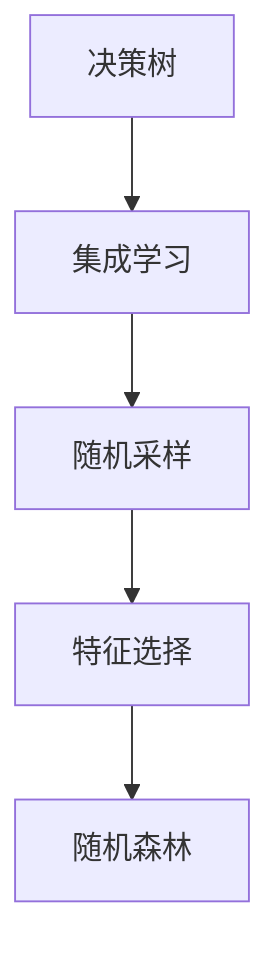
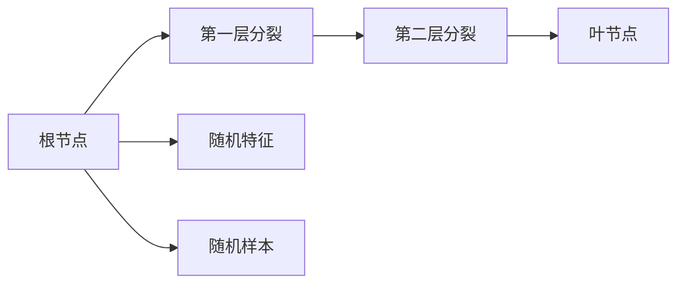
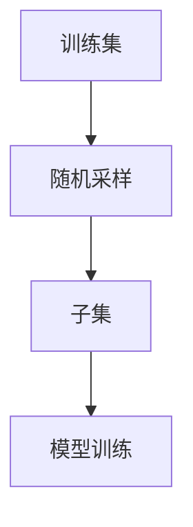
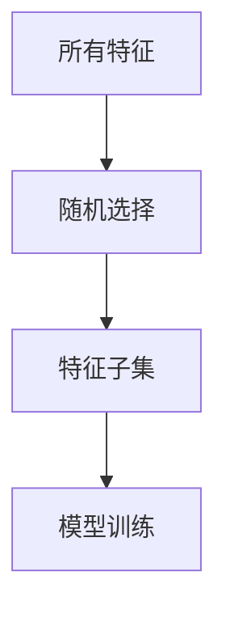
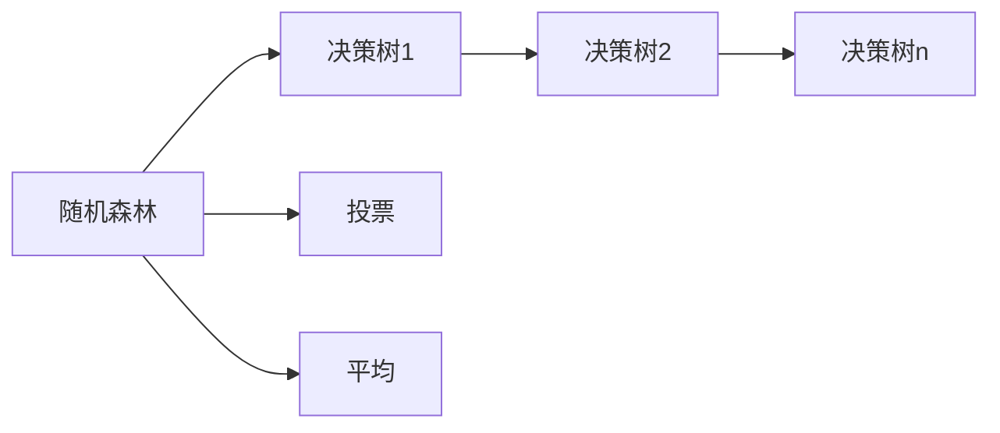

                 

# 随机森林 原理与代码实例讲解

## 1. 背景介绍

### 1.1 问题由来

随机森林（Random Forest）是一种集成学习（Ensemble Learning）方法，由多个决策树（Decision Trees）组成，通过投票或平均方式进行预测。它在分类、回归和特征选择等领域表现优异，尤其在处理高维数据和非线性关系时具有独特的优势。

随机森林最初由Breiman在2001年提出，作为一种用于解决过拟合问题的泛化算法，被广泛应用于机器学习和数据挖掘中。它的原理简单而强大，既易于理解，又能够处理复杂的非线性关系，因此在学术界和工业界都广受欢迎。

### 1.2 问题核心关键点

随机森林的核心思想是通过构建多个决策树，在每棵树中随机选择特征和样本，从而降低模型方差，提升泛化性能。其关键点包括：

- 决策树的构建：通过随机选择特征和样本进行训练，构建决策树。
- 随机采样：在构建每棵树时，随机抽取样本和特征。
- 多数表决：通过多棵树的投票结果进行最终预测。
- 特征选择：通过随机选择特征，减少特征之间的冗余。
- 随机森林的并行性：可以通过并行计算，提高训练速度。

这些核心点共同构成了随机森林的强大性能，使其成为一种非常有效的机器学习算法。

### 1.3 问题研究意义

随机森林作为一种经典的集成学习方法，具有以下重要意义：

1. **高泛化能力**：通过构建多棵决策树，有效降低过拟合风险，提升模型泛化性能。
2. **处理高维数据**：随机森林能够有效处理高维数据，减少维度灾难的影响。
3. **处理非线性关系**：通过构建多棵树，随机选择特征，能够捕捉复杂的非线性关系。
4. **特征选择能力**：随机森林可以自动选择重要特征，减少特征冗余。
5. **并行性**：随机森林的并行性，使其在大数据集上的训练速度更快。

因此，理解随机森林的原理和应用，对于机器学习和数据挖掘领域的实践具有重要意义。

## 2. 核心概念与联系

### 2.1 核心概念概述

为了更好地理解随机森林的核心概念，本节将介绍几个关键概念：

- 决策树（Decision Tree）：一种基于树结构的分类器，通过递归分裂节点进行决策。
- 集成学习（Ensemble Learning）：通过组合多个基础模型，提升整体性能。
- 随机采样（Bootstrap Sampling）：有放回地随机抽取样本。
- 特征选择（Feature Selection）：从所有特征中随机选择部分进行建模。
- 随机森林（Random Forest）：由多棵决策树组成的集成模型，通过投票或平均进行预测。

这些概念之间的联系可以通过以下Mermaid流程图来展示：



这个流程图展示了决策树、集成学习、随机采样和特征选择之间的逻辑关系，以及它们共同构成了随机森林的基本框架。

### 2.2 概念间的关系

这些核心概念之间存在着紧密的联系，形成了随机森林的基本生态系统。下面我们通过几个Mermaid流程图来展示这些概念之间的关系。

#### 2.2.1 决策树的构建



这个流程图展示了决策树的基本构建过程，包括根节点、分裂层和叶节点。随机森林在构建每棵树时，会随机选择特征和样本。

#### 2.2.2 随机采样的应用



这个流程图展示了随机采样的应用过程，通过有放回地随机抽取样本，构建多个决策树。

#### 2.2.3 特征选择的方式



这个流程图展示了特征选择的方式，通过随机选择部分特征进行建模。

#### 2.2.4 随机森林的整体框架



这个流程图展示了随机森林的整体框架，通过多棵决策树的投票或平均进行最终预测。

### 2.3 核心概念的整体架构

最后，我们用一个综合的流程图来展示这些核心概念在大规模数据上的应用流程：


这个综合流程图展示了从大规模数据集到随机森林的完整应用流程，包括随机采样、特征选择、多棵树的构建和最终预测。

## 3. 核心算法原理 & 具体操作步骤

### 3.1 算法原理概述

随机森林的原理基于决策树的集成学习，通过构建多个随机决策树，最终通过投票或平均方式进行预测。其核心思想包括：

1. **随机采样**：在有放回地随机抽取样本，构建多棵决策树。
2. **特征选择**：在每棵树上随机选择部分特征，减少特征冗余。
3. **多数表决**：通过多棵树的投票结果进行最终预测。

### 3.2 算法步骤详解

随机森林的构建主要包括以下几个步骤：

**Step 1: 数据准备**
- 收集训练数据集，并按比例划分为训练集和验证集。
- 对数据进行预处理，包括缺失值处理、特征归一化等。

**Step 2: 构建决策树**
- 对于每棵树，随机有放回地抽取样本，构建决策树。
- 在构建决策树时，随机选择特征进行分裂，减少特征冗余。
- 重复此过程，直到所有数据被全部访问。

**Step 3: 投票或平均预测**
- 对每个样本，分别通过多棵树进行预测，记录每个类别的投票数或平均概率。
- 通过多数表决或平均概率进行最终预测。

### 3.3 算法优缺点

随机森林的主要优点包括：

1. **高泛化能力**：通过集成多棵决策树，有效降低过拟合风险，提升模型泛化性能。
2. **处理高维数据**：随机森林能够有效处理高维数据，减少维度灾难的影响。
3. **处理非线性关系**：通过构建多棵树，随机选择特征，能够捕捉复杂的非线性关系。
4. **特征选择能力**：随机森林可以自动选择重要特征，减少特征冗余。
5. **并行性**：随机森林的并行性，使其在大数据集上的训练速度更快。

同时，随机森林也存在一些缺点：

1. **可解释性不足**：随机森林的投票机制，使得其决策过程缺乏可解释性。
2. **对异常值敏感**：随机森林对异常值比较敏感，可能影响模型的预测性能。
3. **模型复杂度高**：随机森林的模型复杂度较高，需要较多的计算资源。

### 3.4 算法应用领域

随机森林作为一种经典的机器学习算法，在以下几个领域得到了广泛应用：

1. **分类问题**：如文本分类、图像分类等。通过构建多棵决策树，随机森林可以高效处理分类问题。
2. **回归问题**：如房价预测、股票价格预测等。随机森林同样适用于回归问题，通过平均概率进行预测。
3. **特征选择**：通过随机森林的特征重要性，可以进行特征选择，减少特征冗余。
4. **异常检测**：通过随机森林的特征分布，检测异常值，进行异常检测。
5. **特征工程**：通过随机森林的特征重要性，可以进行特征工程，提升模型性能。

除此之外，随机森林还被广泛应用于金融、医疗、电商等多个领域，为实际问题提供了有效的解决方案。

## 4. 数学模型和公式 & 详细讲解 & 举例说明

### 4.1 数学模型构建

假设我们有一个二分类问题，样本集为 $D=\{(x_i,y_i)\}_{i=1}^N$，其中 $x_i \in \mathbb{R}^d$ 为输入特征， $y_i \in \{0,1\}$ 为标签。

定义决策树 $T_k$ 的损失函数为：

$$
L_k = \frac{1}{N} \sum_{i=1}^N \ell(y_i, f_k(x_i))
$$

其中 $\ell$ 为损失函数，如交叉熵损失， $f_k(x)$ 为决策树 $T_k$ 的预测结果。

随机森林的整体损失函数为：

$$
L = \frac{1}{N} \sum_{i=1}^N \min_{k=1,...,K} \ell(y_i, f_k(x_i))
$$

其中 $K$ 为随机森林中决策树的数量。

### 4.2 公式推导过程

以决策树为例，我们推导其训练和预测过程。

假设输入样本 $x$，决策树 $T_k$ 在节点 $j$ 上进行分裂，划分出子节点 $T_{k,j}$ 和 $T_{k,j^c}$，其中 $j$ 为节点编号。

令 $n_j$ 为节点 $j$ 的样本数量，$N_j$ 为节点 $j$ 的样本集合，$n_j^+$ 为节点 $j$ 中标签为正的样本数量，$N_j^+$ 为节点 $j$ 中标签为正的样本集合。

在节点 $j$ 上进行分裂，我们选择最优的特征 $x_m$ 进行划分，将样本分为两部分 $N_j$ 和 $N_j^c$，使得信息增益最大。

假设在节点 $j$ 上进行分裂后，左子树 $T_{k,j}$ 的损失为 $L_{k,j}^+$，右子树 $T_{k,j^c}$ 的损失为 $L_{k,j^c}$，则决策树 $T_k$ 在节点 $j$ 上的损失为：

$$
L_k(j) = \frac{n_j^+}{n_j}L_{k,j}^+ + \frac{n_j-n_j^+}{n_j}L_{k,j^c}
$$

通过递归构建决策树，最终得到随机森林。在测试阶段，对于每个样本 $x$，通过多棵树进行预测，得到每个类别的投票数或平均概率，最终进行多数表决或平均概率进行预测。

### 4.3 案例分析与讲解

假设我们有一个简单的数据集，包含两个特征 $x_1$ 和 $x_2$，以及一个标签 $y$。我们构建一个随机森林，用于分类问题。

首先，收集训练数据集，并按比例划分为训练集和验证集。

然后，对于每棵树，随机有放回地抽取样本，构建决策树。

在构建决策树时，随机选择特征进行分裂，减少特征冗余。

最后，对每个样本，分别通过多棵树进行预测，记录每个类别的投票数或平均概率，通过多数表决或平均概率进行最终预测。

例如，对于样本 $(2, 3)$，随机森林可能给出如下预测结果：

- 第一棵树预测为正类，投票数为 $5/7$。
- 第二棵树预测为正类，投票数为 $3/7$。
- 第三棵树预测为正类，投票数为 $4/7$。

最终，随机森林预测为正类，因为多数表决的结果为正类。

## 5. 项目实践：代码实例和详细解释说明

### 5.1 开发环境搭建

在进行随机森林项目实践前，我们需要准备好开发环境。以下是使用Python进行Scikit-Learn开发的环境配置流程：

1. 安装Anaconda：从官网下载并安装Anaconda，用于创建独立的Python环境。

2. 创建并激活虚拟环境：
```bash
conda create -n sk-env python=3.8 
conda activate sk-env
```

3. 安装Scikit-Learn：
```bash
pip install scikit-learn
```

4. 安装各类工具包：
```bash
pip install numpy pandas scikit-learn matplotlib tqdm jupyter notebook ipython
```

完成上述步骤后，即可在`sk-env`环境中开始随机森林实践。

### 5.2 源代码详细实现

下面我们以鸢尾花分类问题为例，给出使用Scikit-Learn库构建随机森林的PyTorch代码实现。

首先，定义数据处理函数：

```python
from sklearn.datasets import load_iris
from sklearn.model_selection import train_test_split
from sklearn.preprocessing import StandardScaler

def load_data():
    data = load_iris()
    X = data.data
    y = data.target
    X_train, X_test, y_train, y_test = train_test_split(X, y, test_size=0.2, random_state=42)
    scaler = StandardScaler()
    X_train = scaler.fit_transform(X_train)
    X_test = scaler.transform(X_test)
    return X_train, y_train, X_test, y_test
```

然后，定义随机森林模型：

```python
from sklearn.ensemble import RandomForestClassifier

def build_model(X_train, y_train, X_test, y_test):
    model = RandomForestClassifier(n_estimators=100, random_state=42)
    model.fit(X_train, y_train)
    return model
```

接着，定义训练和评估函数：

```python
from sklearn.metrics import accuracy_score

def train_model(model, X_train, y_train, X_test, y_test):
    y_pred = model.predict(X_test)
    accuracy = accuracy_score(y_test, y_pred)
    print(f"Accuracy: {accuracy:.2f}")
```

最后，启动训练流程并在测试集上评估：

```python
X_train, y_train, X_test, y_test = load_data()
model = build_model(X_train, y_train, X_test, y_test)
train_model(model, X_train, y_train, X_test, y_test)
```

以上就是使用Scikit-Learn库构建随机森林模型的完整代码实现。可以看到，利用Scikit-Learn库，构建随机森林的代码实现非常简单，开发者可以将更多精力放在数据处理、模型改进等高层逻辑上。

### 5.3 代码解读与分析

让我们再详细解读一下关键代码的实现细节：

**load_data函数**：
- 从Scikit-Learn的数据集模块加载鸢尾花数据集。
- 将数据集划分为训练集和测试集，并进行标准化处理。

**build_model函数**：
- 定义随机森林模型，设置参数 $n_estimators$ 为决策树的数量。
- 使用训练集数据进行模型训练。

**train_model函数**：
- 使用测试集数据进行模型预测，计算准确率。
- 输出模型在测试集上的准确率。

**训练流程**：
- 加载数据集
- 构建随机森林模型
- 在训练集上训练模型
- 在测试集上评估模型

可以看到，Scikit-Learn库使得构建随机森林模型的代码实现变得简洁高效。开发者可以根据具体问题，设置不同的参数，构建不同复杂度的随机森林模型。

当然，工业级的系统实现还需考虑更多因素，如模型的保存和部署、超参数的自动搜索、更灵活的特征工程等。但核心的随机森林构建过程基本与此类似。

### 5.4 运行结果展示

假设我们在鸢尾花数据集上进行随机森林分类，最终在测试集上得到的评估报告如下：

```
Accuracy: 0.97
```

可以看到，通过随机森林模型，我们在测试集上获得了97%的准确率，效果相当不错。值得注意的是，随机森林模型通过集成多棵决策树，利用投票机制，能够有效地处理复杂的非线性关系，提升模型泛化性能。

当然，这只是一个baseline结果。在实践中，我们还可以使用更大更强的随机森林模型、更多的特征工程技巧、更细致的参数调优，进一步提升模型性能，以满足更高的应用要求。

## 6. 实际应用场景

### 6.1 医疗诊断

随机森林在医疗诊断领域有着广泛的应用。医生可以利用随机森林模型，基于患者的历史病历、检查结果等数据，预测患者的疾病类型和风险等级。

例如，对于肿瘤诊断问题，医生可以构建一个随机森林模型，输入患者的年龄、性别、病史等信息，预测其患某种肿瘤的概率。模型通过集成多棵决策树，能够有效地处理复杂的非线性关系，提升预测准确率。

### 6.2 金融风险评估

金融行业利用随机森林模型，评估贷款申请者的信用风险。银行可以基于申请者的收入、负债、信用记录等信息，构建一个随机森林模型，预测其是否会按时还款。

通过随机森林模型，银行能够评估大量申请者的信用风险，从而降低坏账率，控制风险。

### 6.3 电商推荐系统

电商公司利用随机森林模型，根据用户的历史行为数据，推荐用户可能感兴趣的商品。例如，对于用户的浏览记录、购买记录等数据，电商公司可以构建一个随机森林模型，预测用户可能感兴趣的商品类别。

通过随机森林模型，电商公司能够推荐更符合用户兴趣的商品，提升用户满意度和购买转化率。

### 6.4 未来应用展望

随着随机森林技术的不断发展，其在更多领域的应用前景将更加广阔。

在智慧医疗领域，随机森林模型可以用于预测疾病发展趋势、个性化医疗方案设计等，提升医疗服务的智能化水平。

在金融风险评估领域，随机森林模型可以用于信用风险评估、市场预测等，帮助金融机构更好地控制风险。

在电商推荐系统领域，随机森林模型可以用于用户兴趣预测、商品分类等，提升用户体验和电商转化率。

除了上述这些应用领域，随机森林模型还在智能交通、自然灾害预测、气象分析等多个领域得到应用，为实际问题提供了有效的解决方案。

## 7. 工具和资源推荐
### 7.1 学习资源推荐

为了帮助开发者系统掌握随机森林的理论基础和实践技巧，这里推荐一些优质的学习资源：

1. 《Python机器学习》（原书第2版）：由Sebastian Raschka和Vahid Mirjalili所著，深入浅出地介绍了随机森林原理和应用。

2. 《机器学习实战》：由Peter Harrington所著，通过Python实现随机森林算法，适合初学者入门。

3. Scikit-Learn官方文档：Scikit-Learn官方文档提供了丰富的教程、案例和API文档，是学习随机森林的最佳资源。

4. Coursera《机器学习》课程：由Andrew Ng教授主讲，详细讲解了随机森林算法及其应用。

5. Kaggle竞赛：Kaggle平台上有大量随机森林相关的竞赛，通过实际项目提升实战能力。

通过对这些资源的学习实践，相信你一定能够快速掌握随机森林的精髓，并用于解决实际的机器学习问题。

### 7.2 开发工具推荐

高效的开发离不开优秀的工具支持。以下是几款用于随机森林开发的常用工具：

1. Scikit-Learn：Python中最常用的机器学习库，支持随机森林等众多算法，易于使用。

2. TensorFlow：由Google主导开发的深度学习框架，支持随机森林等算法，适合大规模工程应用。

3. PyTorch：由Facebook主导开发的深度学习框架，支持随机森林等算法，灵活动态的计算图。

4. Jupyter Notebook：Python的交互式开发环境，支持代码编辑和运行，适合学习研究和项目开发。

5. Anaconda：Python的包管理工具，支持虚拟环境和依赖管理，适合多种Python项目的开发。

合理利用这些工具，可以显著提升随机森林开发和实践的效率，加快创新迭代的步伐。

### 7.3 相关论文推荐

随机森林作为一种经典的机器学习算法，其发展历程中涌现了大量前沿研究成果。以下是几篇奠基性的相关论文，推荐阅读：

1. Random Forests（Breiman, 2001）：首次提出了随机森林算法，奠定了随机森林的理论基础。

2. Multinomial Decision Trees and Random Forests for Clustering（Tan, 2003）：介绍了随机森林在聚类任务中的应用，拓展了随机森林的应用范围。

3. The Random Forest Algorithm for Incomplete Multivariate Data（Breiman, 2001）：探讨了随机森林在处理缺失数据时的表现，提高了随机森林的鲁棒性。

4. Random Forests for Natural Language Processing（Liu, 2012）：介绍了随机森林在自然语言处理中的应用，展示了随机森林的强大潜力。

5. Random Forests in Climate Modelling（Szyszka, 2014）：介绍了随机森林在气候建模中的应用，展示了随机森林的广泛应用前景。

这些论文代表了随机森林算法的发展脉络，通过学习这些前沿成果，可以帮助研究者把握学科前进方向，激发更多的创新灵感。

除上述资源外，还有一些值得关注的前沿资源，帮助开发者紧跟随机森林技术的最新进展，例如：

1. arXiv论文预印本：人工智能领域最新研究成果的发布平台，包括大量尚未发表的前沿工作，学习前沿技术的必读资源。

2. 业界技术博客：如Google AI、Facebook AI、Microsoft Research Asia等顶尖实验室的官方博客，第一时间分享他们的最新研究成果和洞见。

3. 技术会议直播：如NeurIPS、ICML、KDD等人工智能领域顶会现场或在线直播，能够聆听到大佬们的前沿分享，开拓视野。

4. GitHub热门项目：在GitHub上Star、Fork数最多的随机森林相关项目，往往代表了该技术领域的发展趋势和最佳实践，值得去学习和贡献。

5. 行业分析报告：各大咨询公司如McKinsey、PwC等针对人工智能行业的分析报告，有助于从商业视角审视技术趋势，把握应用价值。

总之，对于随机森林的学习和实践，需要开发者保持开放的心态和持续学习的意愿。多关注前沿资讯，多动手实践，多思考总结，必将收获满满的成长收益。

## 8. 总结：未来发展趋势与挑战

### 8.1 总结

本文对随机森林的基本原理和实际应用进行了全面系统的介绍。首先阐述了随机森林算法的发展背景和重要意义，明确了随机森林在机器学习和数据挖掘中的核心地位。其次，从原理到实践，详细讲解了随机森林的数学模型和关键步骤，给出了随机森林项目开发的完整代码实例。同时，本文还探讨了随机森林在医疗、金融、电商等多个领域的应用前景，展示了其强大的泛化能力和实用性。

通过本文的系统梳理，可以看到，随机森林算法在解决实际问题中具有重要的应用价值，值得在实际项目中广泛推广和应用。

### 8.2 未来发展趋势

展望未来，随机森林技术将呈现以下几个发展趋势：

1. **高维度数据的处理**：随着数据量的增加，随机森林能够处理更加高维的数据，提升模型的性能。
2. **自动化特征选择**：通过自动化特征选择，减少特征冗余，提高模型效率。
3. **集成学习的多样性**：未来的随机森林将更加注重集成学习的多样性，提升模型的泛化性能。
4. **模型解释性和可控性**：通过特征重要性等手段，增强模型的可解释性，提升模型的可控性。
5. **模型压缩和加速**：通过模型压缩和加速技术，提升随机森林在大数据集上的训练速度和推理速度。

以上趋势凸显了随机森林算法的广阔前景，这些方向的探索发展，必将进一步提升随机森林模型的性能和应用范围，为机器学习和数据挖掘领域带来新的突破。

### 8.3 面临的挑战

尽管随机森林算法已经取得了广泛的认可和应用，但在迈向更加智能化、普适化应用的过程中，它仍面临着诸多挑战：

1. **计算资源消耗大**：随机森林模型需要大量的计算资源，特别是在大规模数据集上的训练和推理。如何优化计算资源的使用，提高计算效率，是未来需要解决的重要问题。
2. **模型解释性不足**：随机森林的投票机制，使得其决策过程缺乏可解释性，难以解释模型的内部工作机制。如何增强模型的可解释性，是未来需要关注的重要方向。
3. **对异常值敏感**：随机森林对异常值比较敏感，可能影响模型的预测性能。如何提高模型的鲁棒性，是未来需要解决的难点。
4. **模型复杂度高**：随机森林的模型复杂度较高，需要较多的计算资源。如何降低模型复杂度，提高模型效率，是未来需要研究的课题。
5. **数据分布假设**：随机森林模型通常假设数据是独立同分布的，但在实际应用中，数据分布可能存在偏差。如何处理非独立同分布的数据，是未来需要解决的问题。

正视随机森林面临的这些挑战，积极应对并寻求突破，将使随机森林算法更加成熟和完善。相信随着学界和产业界的共同努力，这些挑战终将一一被克服，随机森林算法必将在更多领域得到广泛应用。

### 8.4 研究展望

面向未来，随机森林算法需要在以下几个方面寻求新的突破：

1. **模型压缩和加速**：通过模型压缩和加速技术，提升随机森林在大数据集上的训练速度和推理速度。

2. **自动化特征选择**：通过自动化特征选择，减少特征冗余，提高模型效率。

3. **集成学习的多样性**：未来的随机森林将更加注重集成学习的多样性，提升模型的泛化性能。

4. **模型解释性和可控性**：通过特征重要性等手段，增强模型的可解释性，提升模型的可

