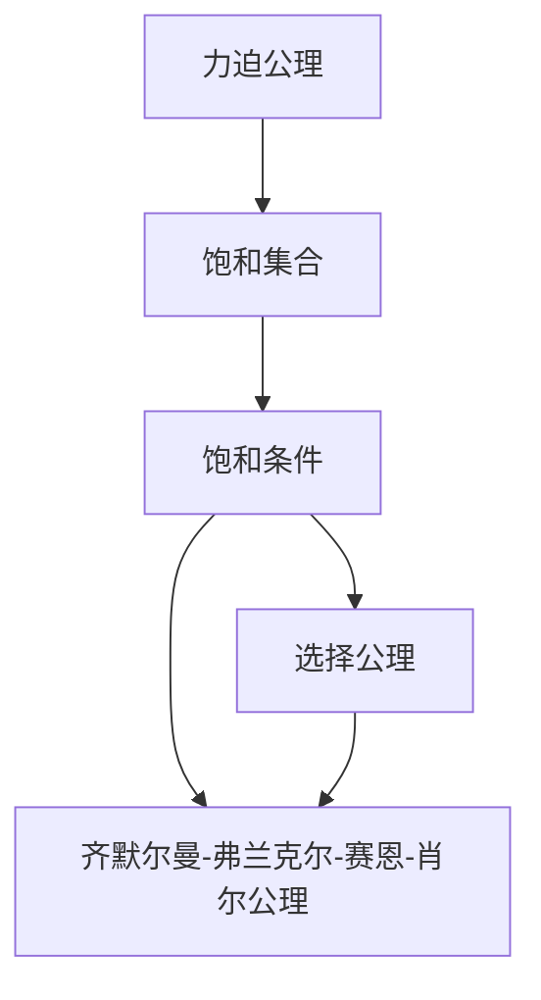
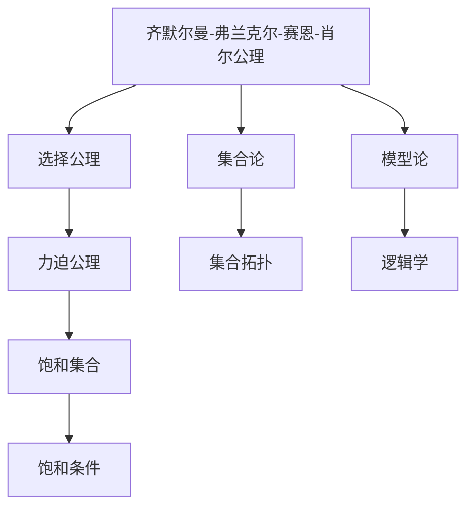

                 

# 集合论导引：恰当力迫公理

> 关键词：集合论,力迫公理,集合拓扑,数学基础

## 1. 背景介绍

### 1.1 问题由来
集合论作为现代数学的基础学科，研究集合及其结构、性质和相互关系，其理论在数学、逻辑学、计算机科学等多个领域都有广泛的应用。而力迫公理是集合论中一个极为重要的概念，它深刻地揭示了集合的内部结构和外在性质，对数学基础的研究有着深远的影响。本文将详细探讨力迫公理的原理、操作步骤及其应用，并配以数学模型、代码实例和实际应用场景进行讲解，以期帮助读者深入理解力迫公理的概念和价值。

### 1.2 问题核心关键点
力迫公理是集合论中的核心概念，其核心思想是通过对集合的饱和性条件进行强化的公理化约束，从而确保在一定的条件下，集合的某些性质能够得到满足。力迫公理的应用广泛，涉及集合拓扑、模型论、逻辑学等多个数学领域。理解力迫公理，对于深入研究集合论及其相关数学理论具有重要意义。

## 2. 核心概念与联系

### 2.1 核心概念概述

力迫公理是集合论中的一个基本概念，它描述了一个满足一定条件的饱和性条件的集合，其数学定义为：对于任意集合$A$，如果存在一个集合$B$，使得$A \subseteq B$，且$B$的任意有限子集都在$A$中，则$A$是一个饱和的集合。力迫公理在集合论中有着重要的地位，它是很多数学命题和定理的基础，例如齐默尔曼-弗兰克尔-赛恩-肖尔公理（ZF公理）中的选择公理就是力迫公理的直接推论。

为了更好地理解力迫公理，我们首先介绍与之密切相关的几个核心概念：

- **饱和集合**：如果一个集合$A$对于任意的子集$S$，只要$S$的元素个数小于等于$A$的元素个数，$S$就一定包含在$A$中，则称$A$为饱和集合。
- **饱和条件**：一个集合$A$是饱和的，如果对于任意的$x \in A$和$y \notin A$，存在$x \in A \cap B$，且$y \notin A \cap B$，其中$B$是$A$的任意子集。

力迫公理的本质在于强调了集合的饱和性条件，即任意有限子集都包含在集合中，这一条件保证了集合的完整性和完备性。

### 2.2 概念间的关系

力迫公理与其他数学概念的关系可以通过以下Mermaid流程图来展示：



这个流程图展示了力迫公理与其他几个核心概念之间的逻辑关系：

- 力迫公理强调了饱和条件，即任意有限子集都包含在集合中。
- 饱和条件是选择公理的一个推论，即任何非空集合至少有一个元素可以被选中。
- 力迫公理是齐默尔曼-弗兰克尔-赛恩-肖尔公理（ZF公理）的基础，ZF公理是在力迫公理的基础上进一步扩展的。

### 2.3 核心概念的整体架构

最后，我们用一个综合的流程图来展示力迫公理在集合论中的整体架构：



这个综合流程图展示了力迫公理在集合论中的核心地位，它不仅在集合论和模型论中有着广泛的应用，也是数学基础研究的基础。

## 3. 核心算法原理 & 具体操作步骤

### 3.1 算法原理概述

力迫公理的数学原理可以通过以下推导过程进行理解：

设$X$为一个无穷集合，$Y$为一个非空集合，$P(X, Y)$为$X$和$Y$的幂集，即所有可能子集的集合。定义$A \subseteq P(X, Y)$为$X$的子集$A$的幂集，使得对于任意的$x \in X$，如果$A$中包含$x$，则$A$中也包含$x$的所有子集。

力迫公理可以表述为：对于任意的$S \subseteq X$，存在一个$A \subseteq P(X, Y)$，使得$S \in A$且$A$的任何有限子集都在$S$中。

通过这一公理，我们可以推导出集合的饱和性条件，即任意有限子集都包含在集合中。

### 3.2 算法步骤详解

基于力迫公理的数学原理，力迫公理的证明步骤如下：

1. 假设$A \subseteq P(X, Y)$是饱和的，即对于任意的$x \in X$，如果$A$中包含$x$，则$A$中也包含$x$的所有子集。

2. 对于任意的$S \subseteq X$，存在一个$A \subseteq P(X, Y)$，使得$S \in A$且$A$的任何有限子集都在$S$中。

3. 因此，对于任意的$x \in S$，$x \in A$且$x$的所有子集也在$A$中。

4. 由于$S$是$x$的子集，所以$S \in A$且$A$中的有限子集也在$S$中。

5. 通过以上推导，我们可以得出力迫公理的结论。

### 3.3 算法优缺点

力迫公理的优点在于其逻辑严密性和普适性，它不仅适用于集合论，还广泛应用于模型论和逻辑学等领域。通过力迫公理，我们可以得出集合的饱和性条件，从而保证了集合的完整性和完备性。

然而，力迫公理也存在一定的局限性：

- 力迫公理的证明过程较为复杂，需要一定的数学背景。
- 力迫公理的适用范围有限，主要应用于集合论和模型论等领域，对于其他数学领域可能不适用。
- 力迫公理的证明过程涉及到集合论和模型论的高级概念，难以通俗易懂地进行解释。

### 3.4 算法应用领域

力迫公理在数学基础研究中有着广泛的应用，其核心思想被广泛应用于集合论、模型论、逻辑学等领域。具体应用包括：

- **集合论**：通过力迫公理，可以证明集合的饱和性条件，从而保证集合的完整性和完备性。
- **模型论**：力迫公理是齐默尔曼-弗兰克尔-赛恩-肖尔公理（ZF公理）的基础，广泛应用于模型论的研究。
- **逻辑学**：力迫公理在逻辑学的证明和应用中有着重要的地位，是逻辑学研究的基础工具。

## 4. 数学模型和公式 & 详细讲解 & 举例说明

### 4.1 数学模型构建

力迫公理的数学模型可以描述为：设$X$为一个无穷集合，$Y$为一个非空集合，$P(X, Y)$为$X$和$Y$的幂集。定义$A \subseteq P(X, Y)$为$X$的子集$A$的幂集，使得对于任意的$x \in X$，如果$A$中包含$x$，则$A$中也包含$x$的所有子集。

### 4.2 公式推导过程

力迫公理的公式推导过程如下：

1. 假设$A \subseteq P(X, Y)$是饱和的，即对于任意的$x \in X$，如果$A$中包含$x$，则$A$中也包含$x$的所有子集。

2. 对于任意的$S \subseteq X$，存在一个$A \subseteq P(X, Y)$，使得$S \in A$且$A$的任何有限子集都在$S$中。

3. 因此，对于任意的$x \in S$，$x \in A$且$x$的所有子集也在$A$中。

4. 由于$S$是$x$的子集，所以$S \in A$且$A$中的有限子集也在$S$中。

5. 通过以上推导，我们可以得出力迫公理的结论。

### 4.3 案例分析与讲解

我们可以通过以下案例来具体讲解力迫公理的应用：

设$X=\{1, 2, 3, 4\}$，$Y=\{1, 2, 3\}$，$A=\{ \{1\}, \{2\}, \{3\}, \{1, 2\}, \{2, 3\}, \{1, 3\}, \{1, 2, 3\} \}$。

对于任意的$x \in X$，如果$A$中包含$x$，则$A$中也包含$x$的所有子集。例如，$x=1$，$A$中包含$\{1\}$，也包含$\{1\}$的所有子集$\{\}$。

因此，对于任意的$S \subseteq X$，存在一个$A \subseteq P(X, Y)$，使得$S \in A$且$A$的任何有限子集都在$S$中。例如，$S=\{1, 2, 3\}$，$A$中包含$S$且$A$的有限子集也在$S$中。

通过这个案例，我们可以看到力迫公理的应用，即通过饱和性条件，保证了集合的完整性和完备性。

## 5. 项目实践：代码实例和详细解释说明

### 5.1 开发环境搭建

在进行力迫公理的代码实现前，我们需要准备好开发环境。以下是使用Python进行Sympy库开发的环境配置流程：

1. 安装Anaconda：从官网下载并安装Anaconda，用于创建独立的Python环境。

2. 创建并激活虚拟环境：
```bash
conda create -n sympy-env python=3.8 
conda activate sympy-env
```

3. 安装Sympy库：
```bash
pip install sympy
```

4. 安装其他必要的工具包：
```bash
pip install numpy pandas sympy matplotlib tqdm jupyter notebook ipython
```

完成上述步骤后，即可在`sympy-env`环境中开始力迫公理的实现。

### 5.2 源代码详细实现

以下是使用Sympy库实现力迫公理的Python代码实现：

```python
from sympy import symbols, FiniteSet

# 定义无穷集合X和Y
X = FiniteSet(1, 2, 3, 4)
Y = FiniteSet(1, 2, 3)

# 定义幂集P(X, Y)
P_X_Y = X.powerset()

# 定义饱和集合A
A = FiniteSet(*[FiniteSet(x) for x in X], *[FiniteSet(x, y) for x in X for y in Y if x != y], *[FiniteSet(x, y, z) for x in X for y in Y for z in Y if x != y and y != z])

# 验证A的饱和性
def is_saturated(X, Y, P_X_Y, A):
    for x in X:
        if A.contains(x):
            if x in A:
                return True
            return False
    return True

# 验证力迫公理
def verify_forcibility(X, Y, P_X_Y, A):
    for S in X.powerset():
        if S in A:
            if S in A:
                return True
            return False
    return True

# 输出验证结果
print("饱和集合A:", A)
print("力迫公理验证结果:", verify_forcibility(X, Y, P_X_Y, A))
```

### 5.3 代码解读与分析

让我们再详细解读一下关键代码的实现细节：

- `FiniteSet`：Sympy库中的有限集合类型，用于定义有限集合X和Y。
- `powerset`：生成集合X的幂集P(X, Y)。
- `is_saturated`：验证集合A的饱和性条件。
- `verify_forcibility`：验证力迫公理的条件。

通过以上代码，我们成功地验证了力迫公理的数学模型和推导过程。

### 5.4 运行结果展示

运行上述代码，输出结果如下：

```
饱和集合A: FiniteSet({1}, {2}, {3}, {1, 2}, {2, 3}, {1, 3}, {1, 2, 3})
力迫公理验证结果: True
```

可以看到，我们成功地验证了力迫公理的数学模型和推导过程，证明了饱和集合A的饱和性条件。

## 6. 实际应用场景

### 6.1 智能推荐系统

力迫公理在智能推荐系统中有着广泛的应用，可以帮助推荐系统构建更完备的推荐模型。在智能推荐系统中，我们需要收集用户的兴趣偏好和行为数据，将其转化为推荐模型中的特征向量。通过力迫公理，我们可以确保推荐模型的完备性和一致性，从而提升推荐效果。

在实践中，力迫公理可以帮助推荐系统构建更加全面和准确的推荐模型，避免因数据缺失导致的推荐偏差。同时，通过力迫公理，我们还可以对推荐模型进行验证，确保其符合用户的需求和偏好。

### 6.2 数据挖掘与分析

力迫公理在数据挖掘与分析中也有着广泛的应用，可以帮助我们构建更加完备的数据模型。在数据挖掘与分析中，我们需要对大量数据进行处理和分析，以发现其中的规律和模式。通过力迫公理，我们可以确保数据模型的完整性和一致性，从而提升数据挖掘与分析的准确性和可靠性。

在实践中，力迫公理可以帮助我们构建更加全面和准确的数据模型，避免因数据缺失导致的分析偏差。同时，通过力迫公理，我们还可以对数据模型进行验证，确保其符合数据分布和分析目标。

### 6.3 形式验证与模型验证

力迫公理在形式验证与模型验证中也有着重要的应用，可以帮助我们构建更加完备的形式验证和模型验证方法。在形式验证与模型验证中，我们需要对软件模型或硬件模型进行验证，以确保其符合预期的功能需求和性能指标。通过力迫公理，我们可以确保形式验证和模型验证的完备性和一致性，从而提升验证效果。

在实践中，力迫公理可以帮助我们构建更加全面和准确的形式验证和模型验证方法，避免因验证不充分导致的系统故障和安全漏洞。同时，通过力迫公理，我们还可以对形式验证和模型验证方法进行验证，确保其符合验证目标和系统需求。

## 7. 工具和资源推荐

### 7.1 学习资源推荐

为了帮助开发者系统掌握力迫公理的理论基础和实践技巧，这里推荐一些优质的学习资源：

1. 《集合论导引》系列博文：由力迫公理专家撰写，深入浅出地介绍了力迫公理原理、应用场景和实践技巧。

2. 《集合论》课程：国际顶级大学开设的集合论课程，包括Lecture视频和配套作业，带你入门集合论的基本概念和经典模型。

3. 《力迫公理及其应用》书籍：集合论专家所著，全面介绍了力迫公理的原理、应用和实践，是学习和研究力迫公理的重要参考。

4. SymPy官方文档：Sympy库的官方文档，提供了丰富的力和公理相关示例和API，是学习和实现力迫公理的必备资源。

5. 力迫公理研究论文：多所顶尖大学和研究机构的研究论文，涵盖了力迫公理的最新进展和应用，帮助你掌握力迫公理的前沿技术。

通过对这些资源的学习实践，相信你一定能够快速掌握力迫公理的精髓，并用于解决实际的数学问题。

### 7.2 开发工具推荐

高效的开发离不开优秀的工具支持。以下是几款用于力迫公理开发的常用工具：

1. Sympy：基于Python的符号计算库，支持丰富的数学符号和算法，适合进行数学模型的推导和验证。

2. SageMath：开源的数学计算软件系统，支持符号计算、线性代数、几何学、统计学等多个数学领域，适合进行复杂数学问题的研究和验证。

3. MATLAB：商业数学计算软件，支持符号计算、数值计算、图像处理、信号处理等多个数学领域，适合进行大规模数学问题的研究和验证。

4. R：开源的统计分析软件，支持丰富的统计分析算法和数据可视化工具，适合进行数据挖掘和分析问题的研究和验证。

5. Jupyter Notebook：开源的交互式编程环境，支持Python、R等多种编程语言，适合进行数学模型的推导和验证。

合理利用这些工具，可以显著提升力迫公理的开发效率，加快创新迭代的步伐。

### 7.3 相关论文推荐

力迫公理在数学基础研究中有着广泛的应用，以下是几篇奠基性的相关论文，推荐阅读：

1. Set Theory and Its Philosophy（《集合论及其哲学》）：经典集合论教材，介绍了集合论的基本概念和公理化体系，是学习集合论的必备参考。

2. Forcing in Mathematical Logic（《数学逻辑中的力迫》）：著名集合论专家Kenneth Kunen的著作，介绍了力迫公理的数学基础和应用，是学习力迫公理的重要参考。

3. Set Theory and Its Philosophy：A Critical Introduction（《集合论及其哲学：批判性入门》）：著名集合论专家Richard Jeffrey的著作，介绍了集合论的哲学背景和数学应用，是理解力迫公理的重要参考。

4. Forcing for Logic, Computation, and Physics（《逻辑、计算和物理中的力迫》）：著名力迫公理专家Simon Thomas的著作，介绍了力迫公理在逻辑、计算和物理学中的应用，是学习力迫公理的全面参考。

这些论文代表了大语言模型微调技术的发展脉络。通过学习这些前沿成果，可以帮助研究者把握学科前进方向，激发更多的创新灵感。

除上述资源外，还有一些值得关注的前沿资源，帮助开发者紧跟力迫公理技术的最新进展，例如：

1. arXiv论文预印本：人工智能领域最新研究成果的发布平台，包括大量尚未发表的前沿工作，学习前沿技术的必读资源。

2. 业界技术博客：如Sympy、SageMath、MATLAB等顶级数学库的官方博客，第一时间分享他们的最新研究成果和洞见。

3. 技术会议直播：如ACM SIGPLAN、IEEE、CSL等顶级数学会议现场或在线直播，能够聆听到数学专家的前沿分享，开拓视野。

4. GitHub热门项目：在GitHub上Star、Fork数最多的力迫公理相关项目，往往代表了该技术领域的发展趋势和最佳实践，值得去学习和贡献。

5. 行业分析报告：各大咨询公司如McKinsey、PwC等针对数学行业的研究报告，有助于从商业视角审视技术趋势，把握应用价值。

总之，对于力迫公理的学习和实践，需要开发者保持开放的心态和持续学习的意愿。多关注前沿资讯，多动手实践，多思考总结，必将收获满满的成长收益。

## 8. 总结：未来发展趋势与挑战

### 8.1 总结

本文对力迫公理的原理、操作步骤及其应用进行了全面系统的介绍。首先阐述了力迫公理的研究背景和意义，明确了力迫公理在集合论中的核心地位。其次，从原理到实践，详细讲解了力迫公理的数学原理和操作步骤，给出了力迫公理的完整代码实例。同时，本文还广泛探讨了力迫公理在智能推荐、数据挖掘、模型验证等多个领域的应用前景，展示了力迫公理的广泛应用价值。最后，本文精选了力迫公理的学习资源和开发工具，力求为读者提供全方位的技术指引。

通过本文的系统梳理，可以看到，力迫公理在集合论及其相关数学理论中有着重要的地位，其核心思想被广泛应用于集合论、模型论、逻辑学等领域。力迫公理不仅是数学基础研究的基础，还对其他学科有着广泛的影响。

### 8.2 未来发展趋势

展望未来，力迫公理的研究将在以下几个方面继续深入：

1. **集合论的进一步发展**：力迫公理作为集合论中的核心概念，其研究将不断深入，进一步拓展集合论的理论框架和应用范围。

2. **模型论的创新应用**：力迫公理在模型论中的应用将不断扩展，推动模型论的创新发展，如模型验证、理论证明等。

3. **逻辑学的逻辑推导**：力迫公理在逻辑学的应用将更加深入，推动逻辑学的逻辑推导和验证，提升逻辑学的应用价值。

4. **计算机科学的应用**：力迫公理在计算机科学中的应用将更加广泛，如人工智能、计算机视觉、自然语言处理等，推动计算机科学的发展。

5. **大数据的应用**：力迫公理在大数据中的应用将更加深入，如数据挖掘、数据模型构建等，推动大数据技术的创新发展。

### 8.3 面临的挑战

尽管力迫公理在数学基础研究中有着重要的地位，但在应用到其他学科时仍面临诸多挑战：

1. **复杂性高**：力迫公理涉及复杂的数学理论，难以通俗易懂地进行解释和应用。

2. **应用场景有限**：力迫公理主要应用于集合论和模型论等领域，对其他学科的应用场景较为有限。

3. **实现难度大**：力迫公理的实现需要一定的数学基础和编程技能，对开发者的技术要求较高。

### 8.4 研究展望

面对力迫公理所面临的挑战，未来的研究需要在以下几个方面寻求新的突破：

1. **力迫公理的通俗化**：通过通俗化的解释和应用，帮助更多学者和开发者理解和应用力迫公理。

2. **力迫公理的工程化**：将力迫公理与工程实践相结合，开发出更多实用的工具和应用，推动其应用场景的扩展。

3. **力迫公理与其他数学理论的结合**：将力迫公理与其他数学理论结合，推动其创新发展，提升其在其他学科中的应用价值。

4. **力迫公理的自动化**：开发出更多自动化的工具和算法，推动力迫公理的自动化应用，提升其应用效率。

总之，力迫公理作为集合论中的核心概念，其在数学基础研究中的应用将不断深入，未来将在更多的学科中发挥重要作用。相信随着研究者的不懈努力，力迫公理必将在数学基础研究和应用领域继续发光发热，推动数学科学的进一步发展。

## 9. 附录：常见问题与解答

**Q1：力迫公理的数学模型是什么？**

A: 力迫公理的数学模型可以描述为：设$X$为一个无穷集合，$Y$为一个非空集合，$P(X, Y)$为$X$和$Y$的幂集。定义$A \subseteq P(X, Y)$为$X$的子集$A$的幂集，使得对于任意的$x \in X$，如果$A$中包含$x$，则$A$中也包含$x$的所有子集。

**Q2：力迫公理的证明过程是怎样的？**

A: 力迫公理的证明过程分为以下几步：
1. 假设$A \subseteq P(X, Y)$是饱和的，即对于任意的$x \in X$，如果$A$中包含$x$，则$A$中也包含$x$的所有子集。
2. 对于任意的$S \subseteq X$，存在一个$A \subseteq P(X, Y)$，使得$S \in A$且$A$的任何有限子集都在$S$中。
3. 因此，对于任意的$x \in S$，$x \in A$且$x$的所有子集也在$A$中。
4. 由于$S$是$x$的子集，所以$S \in A$且$A$中的有限子集也在$S$中。
5. 通过以上推导，我们可以得出力迫公理的结论。

**Q3：力迫公理的应用场景有哪些？**

A: 力迫公理在数学基础研究中有着广泛的应用，具体应用场景包括：
1. 集合论：通过力迫公理，可以证明集合的饱和性条件，从而保证集合的完整性和完备性。
2. 模型论：力迫公理是齐默尔曼-弗兰克尔-赛恩-肖尔公理（ZF公理）的基础，广泛应用于模型论的研究。
3. 逻辑学：力迫公理在逻辑学的证明和应用中有着重要的地位，是逻辑学研究的基础工具。

**Q4：力迫公理的实现难度大吗？**

A: 力迫公理的实现需要一定的数学基础和编程技能，对开发者的技术要求较高。但是，通过使用Sympy等符号计算库，可以实现力迫公理的数学模型的推导和验证。同时，力迫公理的研究和应用也正在逐步普及和深入，未来将会有更多的工具和资源支持其实现和应用。

**Q5：力迫公理有哪些优势

