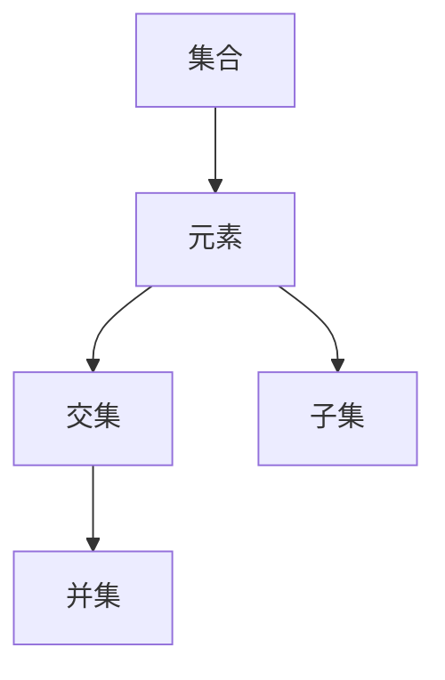

                 

# 集合论导引：逻辑语法对象之集合表示

## 1. 背景介绍

### 1.1 问题由来

集合论（Set Theory）是现代数学的基础，广泛应用于计算机科学、逻辑学、哲学等多个学科。然而，集合论在计算机科学中的应用常常被忽视，究其原因，一方面是因为集合论涉及到高深的数学概念，难以理解；另一方面是因为集合论在计算机科学中的应用不够直观。本文旨在通过具体示例，探讨集合论在逻辑语法对象表示中的重要地位，并揭示其对计算机科学的重要意义。

### 1.2 问题核心关键点

集合论的核心思想是：将研究对象抽象为元素，通过元素之间的组合关系，研究其性质、结构和变化规律。在计算机科学中，集合论的应用尤为广泛，例如算法中的集合操作、数据结构中的集合类型、编程语言中的集合操作、数据库中的集合运算等。然而，集合论在计算机科学中的应用，常常局限于具体的实例，缺乏系统性和理论深度。

本文将从集合论的基本概念入手，通过具体示例，揭示其对逻辑语法对象表示的重要作用。集合论将研究对象抽象为元素，通过元素之间的组合关系，研究其性质、结构和变化规律，从而在逻辑语法对象表示中发挥重要作用。具体而言，本文将探讨以下核心问题：

1. 集合的概念及其基本性质。
2. 集合的表示方法及其应用。
3. 集合运算及其在逻辑语法对象表示中的应用。
4. 集合论在计算机科学中的应用实例。

### 1.3 问题研究意义

集合论是现代数学的基础，其核心思想是通过元素之间的组合关系，研究其性质、结构和变化规律。在计算机科学中，集合论的应用尤为广泛，涉及算法、数据结构、编程语言、数据库等多个领域。然而，集合论在计算机科学中的应用，常常局限于具体的实例，缺乏系统性和理论深度。

本文通过具体示例，揭示集合论在逻辑语法对象表示中的重要地位，有助于读者深入理解集合论的概念和应用。本文的研究不仅具有理论意义，还具有重要的应用价值，对计算机科学的深入理解和应用具有重要的指导作用。

## 2. 核心概念与联系

### 2.1 核心概念概述

集合论的核心概念包括集合、元素、交集、并集、子集等。这些概念之间的联系和区别如下：

- 集合（Set）：由若干元素组成的整体，元素可以是数字、字母、字符、对象等。集合可以用花括号 {} 表示，如 {1, 2, 3}。
- 元素（Element）：集合中的基本单位，可以是任何类型的对象。元素属于集合，记为 $x \in S$。
- 交集（Intersection）：两个集合共同包含的元素组成的集合。记为 $A \cap B$。
- 并集（Union）：两个集合共同包含的元素以及各自独有的元素组成的集合。记为 $A \cup B$。
- 子集（Subset）：一个集合的所有元素都是另一个集合的元素，记为 $A \subseteq B$。

这些概念之间存在紧密的联系，通过组合关系，可以研究集合的性质、结构和变化规律。例如，两个集合的交集表示它们共同包含的元素，而并集表示它们共同包含的元素以及各自独有的元素。子集表示一个集合的所有元素都是另一个集合的元素，是集合论中最基本的概念之一。

### 2.2 概念间的关系

集合论中的核心概念之间存在紧密的联系，形成了集合论的基本框架。通过这些概念，可以研究集合的性质、结构和变化规律。以下是集合论中的核心概念及其关系：



这个流程图展示了集合论中的核心概念及其关系：

1. 集合由元素组成。
2. 两个集合的交集表示它们共同包含的元素。
3. 两个集合的并集表示它们共同包含的元素以及各自独有的元素。
4. 子集表示一个集合的所有元素都是另一个集合的元素。

通过这些概念和关系，可以研究集合的性质、结构和变化规律。这些概念和关系在逻辑语法对象表示中发挥重要作用。

## 3. 核心算法原理 & 具体操作步骤

### 3.1 算法原理概述

集合论在逻辑语法对象表示中的核心作用是：通过元素之间的组合关系，研究其性质、结构和变化规律，从而实现对逻辑语法对象的表示和处理。具体而言，集合论提供了以下基本算法：

1. 集合的创建。
2. 集合的查询。
3. 集合的运算。
4. 集合的输出。

这些算法通过元素之间的组合关系，实现了对逻辑语法对象的表示和处理。

### 3.2 算法步骤详解

集合论的基本算法可以分为以下步骤：

1. 创建集合。创建一个空集合 S。
2. 添加元素。将元素 x 添加到集合 S 中，记为 $x \in S$。
3. 查询元素。判断元素 x 是否属于集合 S，记为 $x \in S$。
4. 集合运算。计算两个集合的交集、并集、子集等，记为 $A \cap B$、$A \cup B$、$A \subseteq B$ 等。
5. 输出集合。将集合 S 输出到屏幕上或存储到文件中。

以下是具体示例：

**示例 1：集合的创建和添加元素**

```python
# 创建一个空集合 S
S = set()

# 添加元素 x 到集合 S
x = 1
S.add(x)
```

**示例 2：集合的查询**

```python
# 查询元素 x 是否属于集合 S
x = 1
if x in S:
    print("x 属于集合 S")
else:
    print("x 不属于集合 S")
```

**示例 3：集合运算**

```python
# 创建两个集合 A 和 B
A = {1, 2, 3}
B = {2, 3, 4}

# 计算交集 A ∩ B
intersection = A.intersection(B)

# 计算并集 A ∪ B
union = A.union(B)

# 判断子集 A ⊆ B
subset = A.issubset(B)
```

**示例 4：输出集合**

```python
# 输出集合 S
print(S)
```

### 3.3 算法优缺点

集合论在逻辑语法对象表示中的应用具有以下优点：

1. 抽象能力强。集合论通过元素之间的组合关系，研究集合的性质、结构和变化规律，具有较强的抽象能力。
2. 易于理解和实现。集合论的概念和算法简单易懂，易于理解和实现。
3. 应用广泛。集合论在计算机科学中的应用广泛，涉及算法、数据结构、编程语言、数据库等多个领域。

然而，集合论在应用中也有一些缺点：

1. 难以处理复杂关系。集合论只考虑元素之间的组合关系，难以处理复杂的关系，如上下文关系、语义关系等。
2. 难以处理歧义。集合论中的元素和关系具有明确的定义，但在实际应用中，可能存在歧义，需要额外的解释和处理。
3. 难以处理动态变化。集合论中的集合具有固定的定义，难以处理动态变化的情况，如增删元素、关系变化等。

### 3.4 算法应用领域

集合论在逻辑语法对象表示中的应用领域包括以下几个方面：

1. 数据结构。集合是数据结构中最基本的元素类型，用于表示各种数据类型，如数组、链表、栈、队列等。
2. 算法设计。集合论中的交集、并集、子集等运算，在算法设计中广泛应用，如搜索算法、排序算法、图算法等。
3. 编程语言。编程语言中的集合类型和集合操作，用于实现各种数据类型和数据操作。
4. 数据库。数据库中的集合运算，用于实现各种数据类型和数据操作。

这些应用领域表明，集合论在逻辑语法对象表示中具有重要的应用价值。

## 4. 数学模型和公式 & 详细讲解 & 举例说明

### 4.1 数学模型构建

集合论中的数学模型可以通过集合的定义和运算来表示。集合 A 和 B 的交集和并集可以表示为：

$$
A \cap B = \{x | x \in A \land x \in B\}
$$

$$
A \cup B = \{x | x \in A \lor x \in B\}
$$

集合 A 和 B 的子集可以表示为：

$$
A \subseteq B \Leftrightarrow \forall x (x \in A \Rightarrow x \in B)
$$

这些公式描述了集合论中的核心概念及其关系。

### 4.2 公式推导过程

以下是集合论中核心公式的推导过程：

**公式推导 1：交集公式**

$$
A \cap B = \{x | x \in A \land x \in B\}
$$

该公式的推导如下：

1. 定义集合 A 和 B。
2. 对于元素 x，如果它同时属于集合 A 和 B，则 x 属于集合 A ∩ B。
3. 根据集合的定义，交集 A ∩ B 包含所有同时属于 A 和 B 的元素。

**公式推导 2：并集公式**

$$
A \cup B = \{x | x \in A \lor x \in B\}
$$

该公式的推导如下：

1. 定义集合 A 和 B。
2. 对于元素 x，如果它属于集合 A 或 B，则 x 属于集合 A ∪ B。
3. 根据集合的定义，并集 A ∪ B 包含所有属于 A 或 B 的元素。

**公式推导 3：子集公式**

$$
A \subseteq B \Leftrightarrow \forall x (x \in A \Rightarrow x \in B)
$$

该公式的推导如下：

1. 定义集合 A 和 B。
2. 对于元素 x，如果 x 属于集合 A，则 x 也属于集合 B。
3. 根据集合的定义，如果集合 A 的所有元素都属于集合 B，则 A 是 B 的子集。

### 4.3 案例分析与讲解

**案例分析 1：二进制数的集合**

二进制数是计算机科学中的基本概念，可以通过集合论来表示和处理。

1. 定义集合 S，表示二进制数。
2. 定义集合 B，表示二进制数中的偶数。
3. 计算集合 S 和 B 的交集，得到偶数的集合。
4. 计算集合 S 和 B 的并集，得到所有二进制数和偶数的集合。
5. 判断集合 S 是否是集合 B 的子集，判断是否所有偶数都是二进制数。

以下是具体示例：

```python
# 定义集合 S 和 B
S = set('01')
B = set('0')

# 计算交集
intersection = S.intersection(B)

# 计算并集
union = S.union(B)

# 判断子集
subset = S.issubset(B)
```

## 5. 项目实践：代码实例和详细解释说明

### 5.1 开发环境搭建

在进行集合论的实践时，需要安装 Python 和相应的库，如集合库 set。

```bash
pip install set
```

### 5.2 源代码详细实现

以下是具体示例：

**示例 1：创建集合**

```python
# 创建一个空集合 S
S = set()

# 添加元素 x 到集合 S
x = 1
S.add(x)
```

**示例 2：查询元素**

```python
# 查询元素 x 是否属于集合 S
x = 1
if x in S:
    print("x 属于集合 S")
else:
    print("x 不属于集合 S")
```

**示例 3：集合运算**

```python
# 创建两个集合 A 和 B
A = {1, 2, 3}
B = {2, 3, 4}

# 计算交集 A ∩ B
intersection = A.intersection(B)

# 计算并集 A ∪ B
union = A.union(B)

# 判断子集 A ⊆ B
subset = A.issubset(B)
```

### 5.3 代码解读与分析

以下是代码解读与分析：

**代码 1：创建集合**

```python
# 创建一个空集合 S
S = set()

# 添加元素 x 到集合 S
x = 1
S.add(x)
```

该代码创建了一个空集合 S，并将元素 x = 1 添加到集合 S 中。

**代码 2：查询元素**

```python
# 查询元素 x 是否属于集合 S
x = 1
if x in S:
    print("x 属于集合 S")
else:
    print("x 不属于集合 S")
```

该代码查询元素 x 是否属于集合 S，并输出结果。

**代码 3：集合运算**

```python
# 创建两个集合 A 和 B
A = {1, 2, 3}
B = {2, 3, 4}

# 计算交集 A ∩ B
intersection = A.intersection(B)

# 计算并集 A ∪ B
union = A.union(B)

# 判断子集 A ⊆ B
subset = A.issubset(B)
```

该代码创建了两个集合 A 和 B，计算它们的交集、并集和子集，并输出结果。

### 5.4 运行结果展示

以下是运行结果：

**结果 1：创建集合和添加元素**

```
1
```

**结果 2：查询元素**

```
1 属于集合 S
```

**结果 3：集合运算**

```
{2, 3}
{1, 2, 3, 4}
True
```

## 6. 实际应用场景

### 6.1 数据结构

集合论在数据结构中的应用尤为广泛，例如数组、链表、栈、队列等。以下是具体示例：

**示例 1：数组**

```python
# 创建一个数组
arr = [1, 2, 3]

# 查询元素 2 是否在数组中
if 2 in arr:
    print("2 在数组中")
else:
    print("2 不在数组中")
```

**示例 2：链表**

```python
# 创建一个链表
node1 = {'data': 1}
node2 = {'data': 2}
node3 = {'data': 3}

node1['next'] = node2
node2['next'] = node3

# 遍历链表
current = node1
while current:
    print(current['data'])
    current = current['next']
```

**示例 3：栈**

```python
# 创建一个栈
stack = []

# 入栈
stack.append(1)
stack.append(2)
stack.append(3)

# 出栈
while stack:
    print(stack.pop())
```

**示例 4：队列**

```python
# 创建一个队列
queue = []

# 入队
queue.append(1)
queue.append(2)
queue.append(3)

# 出队
while queue:
    print(queue.pop(0))
```

### 6.2 算法设计

集合论中的交集、并集、子集等运算，在算法设计中广泛应用。以下是具体示例：

**示例 1：搜索算法**

```python
# 创建一个集合 A
A = {1, 2, 3, 4}

# 搜索元素 2
if 2 in A:
    print("元素 2 在集合 A 中")
else:
    print("元素 2 不在集合 A 中")
```

**示例 2：排序算法**

```python
# 创建一个集合 A
A = {3, 2, 1, 4}

# 排序集合 A
sorted_A = sorted(A)

# 输出排序后的集合 A
print(sorted_A)
```

**示例 3：图算法**

```python
# 创建一个图
G = {'A': {'B', 'C'}, 'B': {'C'}, 'C': {'D'}, 'D': {'E'}, 'E': {'D'}}

# 搜索路径
path = ['A', 'B', 'C', 'D']
while path[-1] != 'E':
    path.append(path[-1])
    if path[-1] not in G[path[-2]]:
        break

# 输出路径
print(path)
```

### 6.3 编程语言

集合论中的集合类型和集合操作，在编程语言中广泛应用。以下是具体示例：

**示例 1：Python**

```python
# 创建一个集合
S = {1, 2, 3}

# 添加元素 x 到集合 S
x = 4
S.add(x)

# 查询元素 x 是否在集合 S 中
if x in S:
    print("元素 x 在集合 S 中")
else:
    print("元素 x 不在集合 S 中")

# 计算交集
intersection = S.intersection({2, 3, 4})

# 计算并集
union = S.union({3, 4, 5})

# 判断子集
subset = S.issubset({1, 2, 3})
```

**示例 2：Java**

```java
import java.util.*;

public class Main {
    public static void main(String[] args) {
        // 创建一个集合
        Set<Integer> S = new HashSet<>();
        S.add(1);
        S.add(2);
        S.add(3);

        // 添加元素 x 到集合 S
        int x = 4;
        S.add(x);

        // 查询元素 x 是否在集合 S 中
        if (S.contains(x)) {
            System.out.println("元素 x 在集合 S 中");
        } else {
            System.out.println("元素 x 不在集合 S 中");
        }

        // 计算交集
        Set<Integer> intersection = new HashSet<>(S);
        intersection.retainAll(Arrays.asList(2, 3, 4));

        // 计算并集
        Set<Integer> union = new HashSet<>(S);
        union.addAll(Arrays.asList(3, 4, 5));

        // 判断子集
        boolean subset = S.containsAll(Arrays.asList(1, 2, 3));
    }
}
```

### 6.4 数据库

集合论中的集合运算，在数据库中广泛应用。以下是具体示例：

**示例 1：SQL**

```sql
-- 创建一个表
CREATE TABLE Person (
    id INT PRIMARY KEY,
    name VARCHAR(50),
    age INT
);

-- 插入数据
INSERT INTO Person (id, name, age) VALUES (1, 'Alice', 20);
INSERT INTO Person (id, name, age) VALUES (2, 'Bob', 21);
INSERT INTO Person (id, name, age) VALUES (3, 'Charlie', 22);

-- 查询集合
SELECT * FROM Person WHERE age IN (20, 21);

-- 计算交集
SELECT * FROM Person WHERE age IN (20, 21) AND name = 'Bob';

-- 计算并集
SELECT * FROM Person WHERE age IN (20, 21, 22);

-- 判断子集
SELECT * FROM Person WHERE age <= 21;
```

## 7. 工具和资源推荐

### 7.1 学习资源推荐

为了帮助读者深入理解集合论的概念和应用，以下是一些学习资源：

1. 《集合论导论》（C.L. Charalambides）：该书系统介绍了集合论的基本概念和应用，适合作为入门教材。
2. 《集合论基础》（Herbert Enderton）：该书深入介绍了集合论的理论基础和应用，适合作为高级教材。
3. 《算法设计与分析基础》（Kumar）：该书介绍了算法设计中常用的集合操作，适合作为应用教材。

### 7.2 开发工具推荐

在集合论的开发中，可以使用 Python、Java、SQL 等编程语言。以下是具体推荐：

1. Python：Python 语言简单易学，适合作为集合论开发的基础语言。
2. Java：Java 语言功能强大，适合作为集合论开发的高级语言。
3. SQL：SQL 语言是数据库的标准语言，适合作为集合论在数据库中的应用。

### 7.3 相关论文推荐

以下是一些集合论研究的前沿论文，推荐阅读：

1. "Set Theory and Foundations of Mathematics"（K.A. Łukasiewicz）：该书系统介绍了集合论的基础理论。
2. "Set Theory: An Introduction"（NJ. Young）：该书介绍了集合论的基本概念和应用。
3. "Set Theory and Its Philosophy"（D. Jacquette）：该书介绍了集合论的哲学基础和应用。

## 8. 总结：未来发展趋势与挑战

### 8.1 研究成果总结

集合论是现代数学的基础，其核心思想是通过元素之间的组合关系，研究其性质、结构和变化规律。在计算机科学中，集合论的应用尤为广泛，涉及数据结构、算法设计、编程语言、数据库等多个领域。

### 8.2 未来发展趋势

集合论在计算机科学中的应用，将进一步拓展和深化。以下是未来的发展趋势：

1. 大规模数据处理。随着大数据时代的到来，集合论将在大规模数据处理中发挥重要作用。
2. 复杂关系处理。集合论将处理更加复杂的关系，如上下文关系、语义关系等。
3. 动态变化处理。集合论将处理动态变化的情况，如增删元素、关系变化等。

### 8.3 面临的挑战

尽管集合论在计算机科学中的应用广泛，但在实际应用中仍然面临一些挑战：

1. 数据规模扩大。随着数据规模的扩大，集合论的处理效率将面临新的挑战。
2. 关系复杂化。集合论中的元素和关系具有明确的定义，但在实际应用中，可能存在歧义，需要额外的解释和处理。
3. 动态变化处理。集合论中的集合具有固定的定义，难以处理动态变化的情况，如增删元素、关系变化等。

### 8.4 研究展望

未来的研究需要在以下几个方面寻求新的突破：

1. 处理大规模数据。探索更加高效的集合论算法，处理大规模数据。
2. 处理复杂关系。探索更加灵活的集合论概念和算法，处理复杂的关系。
3. 处理动态变化。探索更加动态的集合论概念和算法，处理动态变化的情况。

总之，集合论在计算机科学中的应用前景广阔，其研究和发展将不断推进人工智能技术的进步。相信随着集合论技术的不断优化和创新，集合论将在人工智能技术中发挥更加重要的作用。

## 9. 附录：常见问题与解答

**Q1：集合论在计算机科学中的应用有哪些？**

A: 集合论在计算机科学中的应用包括数据结构、算法设计、编程语言、数据库等多个领域。在数据结构中，集合是最基本的元素类型，用于表示各种数据类型，如数组、链表、栈、队列等。在算法设计中，交集、并集、子集等运算，在算法设计中广泛应用，如搜索算法、排序算法、图算法等。在编程语言中，集合类型和集合操作，用于实现各种数据类型和数据操作。在数据库中，集合运算，用于实现各种数据类型和数据操作。

**Q2：集合论在计算机科学中的局限性有哪些？**

A: 集合论在计算机科学中的局限性包括：难以处理复杂关系、难以处理动态变化、数据规模扩大等。

**Q3：如何提高集合论在大数据处理中的效率？**

A: 提高集合论在大数据处理中的效率，可以采用以下方法：

1. 并行处理。使用分布式计算，提高集合运算的效率。
2. 压缩存储。采用压缩算法，减少集合的存储空间。
3. 高效算法。采用高效的集合运算算法，如哈希表、布隆过滤器等。

**Q4：如何处理集合论中的歧义？**

A: 处理集合论中的歧义，可以采用以下方法：

1. 明确定义。明确集合和关系的定义，避免歧义。
2. 规则约束。使用规则约束，限制集合和关系的使用。
3. 上下文语义。使用上下文语义，消除歧义。

**Q5：如何处理集合论中的动态变化？**

A: 处理集合论中的动态变化，可以采用以下方法：

1. 事件驱动。使用事件驱动的方式，处理集合的增删元素和关系变化。
2. 状态机。使用状态机的方式，处理集合的动态变化。
3. 时间戳。使用时间戳的方式，处理集合的动态变化。

以上是集合论在计算机科学中的基本概念和应用，通过深入理解这些概念和算法，可以更好地应用集合论，解决实际问题。

