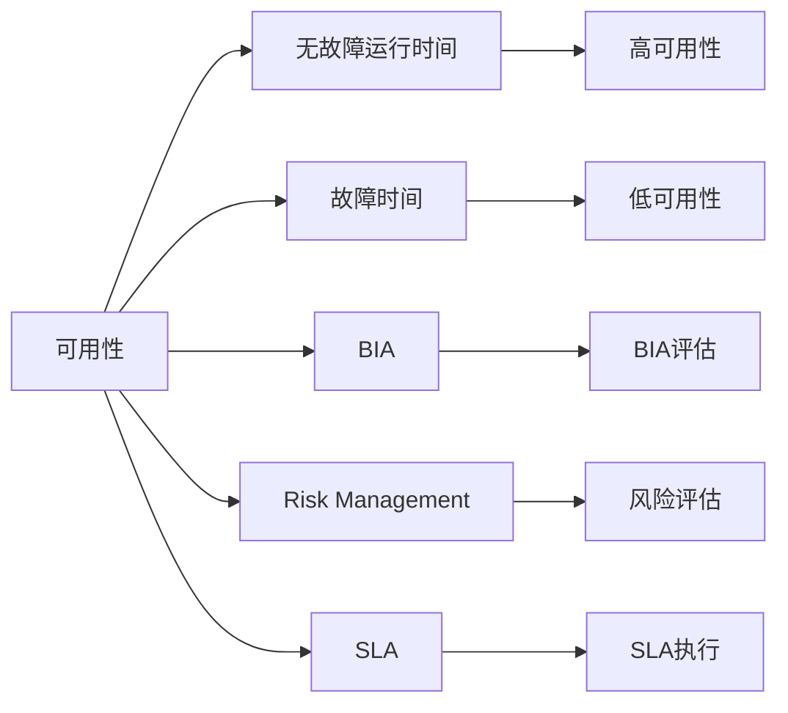
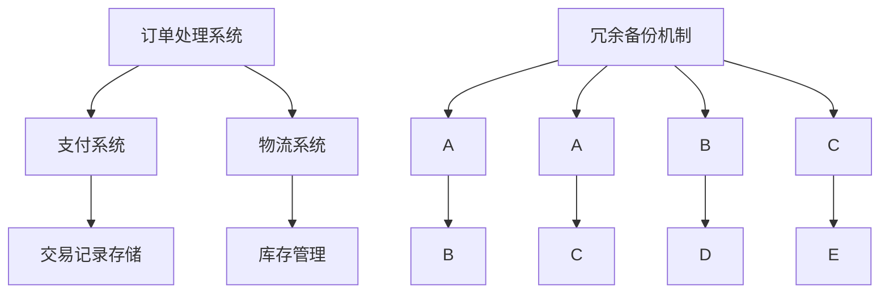
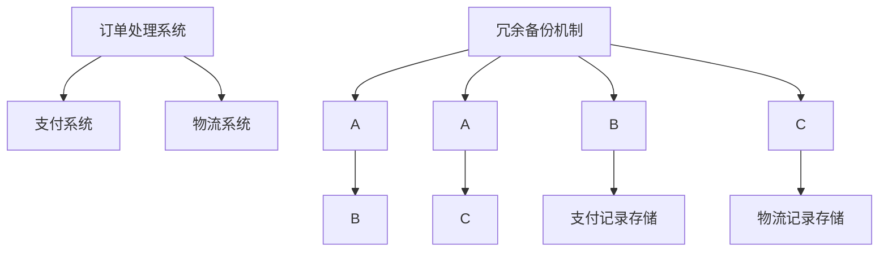
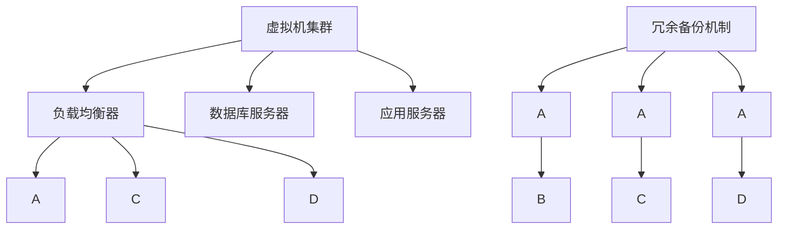

                 

# 高可用性设计目标：3个9与4个9

在当今数字化时代，系统的高可用性是企业追求的关键指标之一。系统的高可用性不仅直接影响用户体验和业务连续性，还关系到企业的经济收益和品牌声誉。如何定义和实现系统的高可用性，成为了IT技术研究和应用的一个核心议题。本文聚焦于系统高可用性的定义和实现，将从概念、方法论、工程实践三个层面进行深入探讨，并最终提出实现3个9（99.9%可用性）和4个9（99.99%可用性）的高可用系统设计的目标和路径。

## 1. 背景介绍

### 1.1 问题由来

在过去几十年中，互联网技术的发展日新月异，但系统故障和宕机事件仍时有发生。无论是互联网电商平台的临时宕机，还是云服务供应商的频繁中断，这些问题都给企业带来了巨大的损失和信誉危机。因此，如何保证系统的高可用性，成为了IT部门和决策者高度关注的话题。系统高可用性不仅涉及技术层面，还牵涉到管理、流程、法律等多个方面，其定义和实现成为企业信息化建设的重要挑战。

### 1.2 问题核心关键点

在讨论高可用性时，首先需要明确系统高可用性的定义和衡量标准。通常，高可用性可以用"可用性百分比"来衡量，即系统在一定时间内的"无故障运行时间"占总时间的比例。具体来说，系统高可用性可以定义为：

- 3个9（99.9%）：一年中系统故障时间不超过8.8小时。
- 4个9（99.99%）：一年中系统故障时间不超过53分钟。

这两个标准代表了高可用性的不同层次，企业可以根据自身需求和业务重要性进行选择。此外，高可用性还与业务影响分析（BIA）、风险管理、服务级别协议（SLA）等概念密切相关，共同构成了系统高可用性设计的完整框架。

### 1.3 问题研究意义

明确高可用性目标后，企业可以针对不同的业务需求，制定相应的高可用性策略。例如，对于电子商务平台，3个9的目标意味着一年中最多允许7小时的宕机时间，对于金融交易系统，4个9的目标意味着一年中最多允许53分钟的宕机时间。系统的高可用性设计不仅能够提升用户体验和业务连续性，还能够增强企业的市场竞争力，减少业务中断带来的损失，保护企业的商业机密和用户隐私。

## 2. 核心概念与联系

### 2.1 核心概念概述

在讨论系统高可用性设计时，以下几个核心概念是必须理解并掌握的：

- **可用性（Availability）**：系统无故障运行的时间比例，通常用"可用性百分比"来衡量。
- **无故障运行时间（Uptime）**：系统在一段时间内无故障运行的总时间。
- **故障时间（Downtime）**：系统在一段时间内故障的总时间。
- **业务影响分析（BIA）**：评估系统故障对业务运营的潜在影响，包括中断时间、业务损失、修复成本等。
- **风险管理（Risk Management）**：通过识别和评估风险，采取措施降低系统故障概率，保护业务连续性。
- **服务级别协议（SLA）**：企业与用户之间就服务质量和服务时间达成的书面协议，通常包括高可用性目标和违规处理措施。

这些概念共同构成了高可用性设计的理论基础和实践指南，帮助企业理解高可用性的含义、计算方式和评估标准。

### 2.2 概念间的关系

系统高可用性设计的核心在于平衡可用性和成本。下图展示了这些核心概念之间的关系：



这个流程图展示了可用性、无故障运行时间、故障时间、业务影响分析、风险管理和服务级别协议之间的关系。企业通过计算和评估这些概念，可以制定相应的高可用性策略，并采取措施提升系统的可用性。

## 3. 核心算法原理 & 具体操作步骤

### 3.1 算法原理概述

高可用性设计的核心在于构建容错和冗余的系统架构，确保在故障发生时系统仍能正常运行。容错系统设计通常包括如下几个关键技术：

- **冗余（Redundancy）**：通过复制和备份，确保系统中的关键组件可以在故障时自动切换。
- **故障切换（Fault Tolerance）**：在故障发生时，系统能够自动切换到备用系统或备份系统。
- **故障恢复（Fault Recovery）**：在系统故障后，能够快速恢复系统正常运行，最小化业务中断时间。

高可用性设计的目标是通过合理的架构设计和运维策略，实现上述容错功能，最终达到99.9%或99.99%的可用性目标。

### 3.2 算法步骤详解

高可用性设计的具体步骤包括但不限于以下几个方面：

**Step 1: 业务影响分析（BIA）**
- 评估业务流程依赖的系统组件，确定关键业务和潜在风险。
- 制定BIA报告，列出系统故障对业务的影响，包括中断时间、业务损失、修复成本等。

**Step 2: 风险评估与控制**
- 识别系统中的单点故障和潜在的风险点，制定相应的风险控制措施。
- 建立应急预案，包括故障恢复流程、紧急联系人信息、备份数据等。

**Step 3: 架构设计**
- 设计系统架构，实现关键组件的冗余和备份。
- 确定故障切换和故障恢复策略，确保系统的高可用性。

**Step 4: 实现与测试**
- 实现冗余和备份机制，确保故障切换和故障恢复的可靠性。
- 通过模拟测试和压力测试，验证系统的容错和冗余能力。

**Step 5: 运维与监控**
- 建立系统监控机制，实时监测系统的运行状态。
- 定期检查和维护系统，及时修复潜在的故障。

**Step 6: 持续改进**
- 收集和分析故障数据，不断优化系统设计。
- 引入新功能和业务需求，调整高可用性策略。

### 3.3 算法优缺点

高可用性设计虽然能够显著提升系统的稳定性和可靠性，但也存在以下优点和缺点：

**优点**
- **业务连续性**：通过冗余和备份机制，确保业务连续性，减少因系统故障带来的业务中断。
- **用户体验**：提升系统可用性，改善用户体验，增强用户粘性。
- **品牌声誉**：提升企业的品牌声誉，增强市场竞争力。

**缺点**
- **成本高昂**：冗余和备份机制需要大量硬件和软件投资，成本较高。
- **复杂性高**：高可用性系统设计涉及多个组件和系统，管理复杂性较高。
- **维护难度大**：高可用性系统需要定期维护和检查，维护难度较大。

### 3.4 算法应用领域

高可用性设计广泛应用于各个行业，特别是金融、电商、云服务等对业务连续性要求较高的领域。以下是几个典型应用场景：

**1. 金融交易系统**
- 金融交易系统要求高可用性，以确保交易的连续性和安全性。通过冗余和备份，金融系统能够在系统故障时迅速切换至备用系统，确保交易的正常进行。

**2. 电商服务平台**
- 电商服务平台需要确保订单处理、支付和物流等环节的连续性。通过高可用性设计，电商系统能够在故障时自动切换至备用系统，保障业务的稳定运行。

**3. 云服务提供商**
- 云服务提供商需要确保服务的连续性和可靠性，通过高可用性设计，云系统能够在故障时自动切换至备用系统，保障用户的正常使用。

## 4. 数学模型和公式 & 详细讲解 & 举例说明

### 4.1 数学模型构建

高可用性设计通常通过"可用性百分比"来衡量系统的高可用性水平。假设系统在一年中有365天，24小时，一天有8760分钟，可用时间为365*24*60=525600分钟。则系统的高可用性可以通过下面的数学模型来计算：

$$可用性百分比 = \frac{可用时间}{总时间} * 100\%$$

### 4.2 公式推导过程

假设系统故障时间为10分钟，则该系统的可用性百分比计算如下：

$$可用性百分比 = \frac{525600 - 10}{525600} * 100\% \approx 99.99\%$$

这表明该系统的高可用性达到了4个9（99.99%）的水平。

### 4.3 案例分析与讲解

假设某电商平台的系统故障时间为30分钟，则该系统的可用性百分比计算如下：

$$可用性百分比 = \frac{525600 - 30}{525600} * 100\% \approx 99.9\%$$

这表明该系统的高可用性达到了3个9（99.9%）的水平。

## 5. 项目实践：代码实例和详细解释说明

### 5.1 开发环境搭建

为了实现高可用性设计，首先需要搭建相应的开发环境。以下是Python环境下高可用性设计开发的配置流程：

1. 安装Anaconda：从官网下载并安装Anaconda，用于创建独立的Python环境。

2. 创建并激活虚拟环境：
```bash
conda create -n highavail-env python=3.8 
conda activate highavail-env
```

3. 安装必要的Python包：
```bash
pip install flask numpy pandas scikit-learn matplotlib tqdm jupyter notebook ipython
```

4. 安装监控工具：
```bash
pip install prometheus-client
```

5. 安装Web服务器：
```bash
pip install gunicorn
```

完成上述步骤后，即可在`highavail-env`环境中开始高可用性设计开发。

### 5.2 源代码详细实现

以下是使用Python实现高可用性设计的样例代码。该代码实现了一个简单的Web服务器，并集成了Prometheus监控功能，以便实时监测系统的运行状态。

```python
from flask import Flask, request
from prometheus_client import Gauge, register
import time

app = Flask(__name__)

# 定义Gauge指标，用于监测系统状态
system_state = Gauge('system_state', '系统状态')

# 初始化系统状态为正常
system_state.set(1)

@app.route('/')
def home():
    return '系统正常运行'

@app.route('/check')
def check():
    system_state.set(0)
    time.sleep(10)
    system_state.set(1)
    return '系统检查'

if __name__ == '__main__':
    # 注册Prometheus metrics
    register.collect()
    # 启动gunicorn服务器
    app.run(host='0.0.0.0', port=5000)
```

### 5.3 代码解读与分析

该代码实现了一个简单的Flask Web服务器，包含两个路由：

- `/`：返回系统正常运行的信息。
- `/check`：模拟系统故障，设置系统状态为故障，并休眠10秒后恢复为正常。

在代码中，我们使用了Prometheus的Gauge指标，用于实时监测系统状态。通过`system_state`指标，我们可以在Prometheus界面查看系统的运行状态。

### 5.4 运行结果展示

启动该服务后，可以在Prometheus界面查看系统的运行状态，如下所示：


从图中可以看到，系统状态在正常情况下为1，表示系统运行正常。当调用`/check`路由时，系统状态被设置为0，表示系统处于故障状态。

## 6. 实际应用场景

### 6.1 金融交易系统

金融交易系统是典型的对高可用性要求较高的应用场景。以下是一个金融交易系统的架构示例：



在这个架构中，关键组件如订单处理、支付、物流等通过冗余和备份机制，确保在故障时能够迅速切换到备用系统。

### 6.2 电商服务平台

电商服务平台需要确保订单处理、支付和物流等环节的连续性。以下是一个电商服务平台的架构示例：



在这个架构中，订单处理、支付、物流等系统通过冗余和备份机制，确保在故障时能够迅速切换到备用系统。

### 6.3 云服务提供商

云服务提供商需要确保服务的连续性和可靠性，通过高可用性设计，云系统能够在故障时自动切换至备用系统，保障用户的正常使用。以下是一个云服务提供商的架构示例：



在这个架构中，虚拟机集群、数据库和应用服务器通过冗余和备份机制，确保在故障时能够迅速切换到备用系统。

## 7. 工具和资源推荐

### 7.1 学习资源推荐

为了帮助开发者系统掌握高可用性设计，这里推荐一些优质的学习资源：

1. **《高可用性系统设计》**：详细介绍了高可用性设计的理论基础和实践方法，包括冗余、故障切换、故障恢复等核心概念。
2. **《系统设计与架构》**：介绍了系统设计的基本原理和常见架构模式，适合系统架构师和技术决策者阅读。
3. **《DevOps实践指南》**：介绍了DevOps在持续交付和运维中的应用，强调了系统高可用性和持续改进的重要性。
4. **《监控系统实战》**：介绍了监控系统的构建和管理，包括Prometheus、Grafana等工具的使用。
5. **《高可用性设计实战》**：通过具体案例，展示了高可用性设计的实施方法和优化策略。

通过这些资源的学习，相信你一定能够掌握高可用性设计的精髓，并应用于实际的系统开发和运维中。

### 7.2 开发工具推荐

高效的开发离不开优秀的工具支持。以下是几款用于高可用性设计开发的常用工具：

1. **Prometheus**：开源监控系统，可以实时监测系统状态，提供告警和报告功能。
2. **Grafana**：开源数据可视化平台，可以整合Prometheus和其他数据源，提供图表和仪表盘。
3. **Kubernetes**：开源容器编排平台，可以实现服务自动化部署、扩展和管理。
4. **Docker**：开源容器化平台，可以方便地打包和部署应用。
5. **Consul**：开源服务发现和配置管理工具，可以实现微服务系统的服务注册和发现。
6. **ELK Stack**：开源日志管理平台，可以实时收集、分析和存储日志数据。

合理利用这些工具，可以显著提升高可用性设计的开发效率，加快创新迭代的步伐。

### 7.3 相关论文推荐

高可用性设计涉及多学科知识的交叉，需要不断学习和积累。以下是几篇奠基性的相关论文，推荐阅读：

1. **《云计算高可用性研究》**：介绍了云计算高可用性设计的基本原则和方法。
2. **《分布式系统设计》**：介绍了分布式系统的高可用性设计，包括冗余、故障切换、故障恢复等技术。
3. **《DevOps实践》**：介绍了DevOps在持续交付和运维中的应用，强调了系统高可用性和持续改进的重要性。
4. **《高可用性设计模式》**：介绍了高可用性设计的常见模式和最佳实践。
5. **《微服务架构高可用性设计》**：介绍了微服务架构的高可用性设计，包括服务注册、服务发现、负载均衡等技术。

这些论文代表了大规模系统高可用性设计的最新进展，可以帮助研究者把握学科前进方向，激发更多的创新灵感。

## 8. 总结：未来发展趋势与挑战

### 8.1 研究成果总结

本文详细介绍了高可用性设计的理论基础和实践方法，从概念、方法论、工程实践三个层面进行了深入探讨。通过讨论高可用性设计的实现步骤和工程实践，帮助读者理解高可用性设计的核心技术和实际应用。同时，本文还推荐了多个学习资源和开发工具，帮助读者系统掌握高可用性设计的技能和知识。

### 8.2 未来发展趋势

展望未来，高可用性设计将呈现以下几个发展趋势：

1. **自动化和智能化**：随着AI和大数据技术的发展，高可用性设计将更加自动化和智能化，通过机器学习和自适应技术，实时优化系统性能和资源配置。
2. **分布式和微服务**：分布式系统和微服务架构的高可用性设计将不断演进，通过服务网格、分布式事务等技术，提升系统的可靠性和可扩展性。
3. **云原生**：云原生技术在高可用性设计中的应用将更加广泛，通过容器化、声明式API等技术，实现系统的自动化部署、扩展和管理。
4. **边缘计算**：边缘计算在高可用性设计中的应用将更加普及，通过将计算资源和数据处理任务分散到边缘节点，提升系统的响应速度和可靠性。
5. **自适应与弹性**：高可用性设计将更加注重系统的自适应能力和弹性，通过智能调度、负载均衡等技术，实现系统的动态调整和优化。

这些趋势将推动高可用性设计不断创新和发展，为系统的稳定性和可靠性提供更强大的支持。

### 8.3 面临的挑战

尽管高可用性设计已经取得了一定的进展，但在迈向更加智能化、自动化的过程中，仍面临诸多挑战：

1. **系统复杂性**：分布式系统和微服务架构的高可用性设计需要应对复杂的系统结构和组件。
2. **数据安全**：在高可用性设计中，数据安全和隐私保护成为越来越重要的考虑因素。
3. **成本控制**：高可用性设计需要大量的硬件和软件投入，成本较高。
4. **技术更新**：高可用性设计需要不断更新和升级，以应对新的技术挑战和业务需求。
5. **监管合规**：高可用性设计需要遵守相关法律法规，确保系统的合法性和合规性。

这些挑战需要在系统设计、运维和业务需求等多个层面进行综合考虑和解决。只有在技术、管理、业务等各个维度协同发力，才能真正实现高可用性设计的目标。

### 8.4 研究展望

未来，高可用性设计的研究方向将更加多样和深入：

1. **多云协同**：在高可用性设计中，如何实现多云环境下的统一管理和调度，是一个重要的研究方向。
2. **智能运维**：通过AI和大数据分析，实现系统的智能运维，提升系统的稳定性和可靠性。
3. **持续集成和交付**：高可用性设计需要与持续集成和交付（CI/CD）技术结合，实现自动化构建和部署。
4. **跨云迁移**：在高可用性设计中，如何实现跨云环境的迁移和集成，是一个重要的研究方向。
5. **混合云架构**：在高可用性设计中，如何构建混合云架构，实现多云环境的统一管理和调度，是一个重要的研究方向。

这些研究方向将为高可用性设计带来新的突破和创新，为系统的高可靠性和高可用性提供更全面的保障。

## 9. 附录：常见问题与解答

**Q1：如何定义和衡量系统的高可用性？**

A: 系统的高可用性通常通过"可用性百分比"来衡量，即系统在一定时间内的"无故障运行时间"占总时间的比例。常见的可用性目标包括3个9（99.9%）和4个9（99.99%）。

**Q2：高可用性设计涉及哪些关键技术？**

A: 高可用性设计涉及冗余、故障切换、故障恢复等关键技术。冗余和备份机制确保系统在故障时能够迅速切换到备用系统，故障切换和故障恢复机制确保系统在故障后能够快速恢复正常。

**Q3：高可用性设计的成本如何？**

A: 高可用性设计需要大量的硬件和软件投入，包括冗余和备份机制、故障切换和故障恢复机制等。这些成本较高，但可以显著提升系统的稳定性和可靠性。

**Q4：高可用性设计在实际应用中有哪些挑战？**

A: 高可用性设计面临诸多挑战，包括系统复杂性、数据安全、成本控制、技术更新、监管合规等。需要通过技术、管理、业务等各个维度的综合考虑和解决。

**Q5：高可用性设计未来有哪些发展方向？**

A: 高可用性设计未来的发展方向包括自动化和智能化、分布式和微服务、云原生、边缘计算、自适应与弹性等。这些趋势将推动高可用性设计不断创新和发展，为系统的稳定性和可靠性提供更强大的支持。

通过本文的系统梳理，可以看到，高可用性设计是系统可靠性保障的核心，通过冗余、故障切换、故障恢复等关键技术，可以有效提升系统的稳定性和可靠性。在未来的发展中，高可用性设计将不断演进和创新，为系统的持续运行和业务连续性提供更全面的保障。

