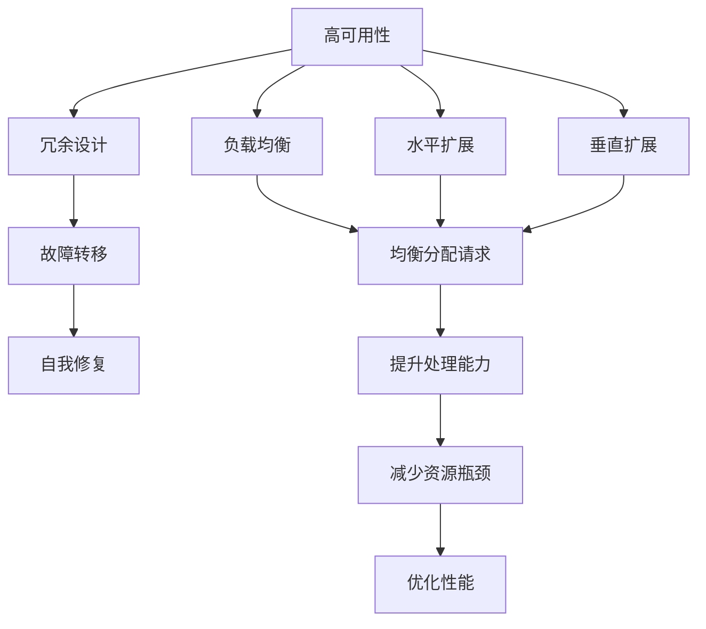
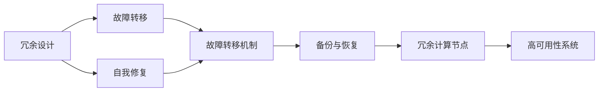
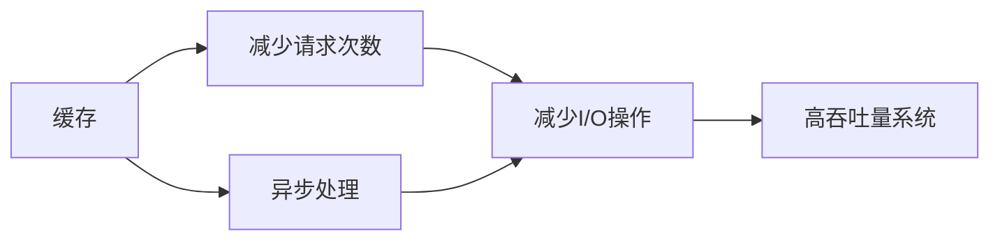
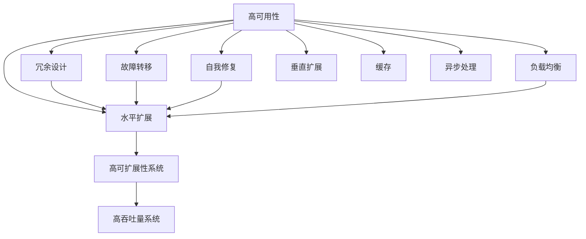

                 

# 高可用性、高可扩展性和高吞吐量系统设计

> 关键词：高可用性, 高可扩展性, 高吞吐量, 系统设计, 容错, 负载均衡, 水平扩展, 垂直扩展, 多数据中心

## 1. 背景介绍

### 1.1 问题由来
随着互联网技术的快速发展，Web应用系统已经从简单的静态页面展示，逐渐演变为复杂的、数据密集型的动态应用。在用户数据量和业务复杂度不断增长的背景下，如何设计和构建具备高可用性、高可扩展性和高吞吐量的系统，成为摆在每一位IT架构师面前的重要课题。

高可用性（High Availability）指的是系统在面对硬件故障、网络故障、软件错误等突发事件时，仍然能够持续、可靠地为用户提供服务。高可扩展性（Scalability）意味着系统可以根据用户需求的变化，灵活调整系统的资源配置，满足不断增长的业务需求。高吞吐量（High Throughput）则是指系统能够处理并响应用户的大量请求，确保服务响应速度和稳定性。

### 1.2 问题核心关键点
系统的高可用性、高可扩展性和高吞吐量是紧密相关的。在系统架构设计时，三者之间需要找到合理的平衡点。

- **高可用性**：通过冗余设计、故障转移、自我修复等手段，确保系统不间断运行。
- **高可扩展性**：通过水平扩展（添加更多计算节点）和垂直扩展（增加单节点计算能力），应对业务量变化。
- **高吞吐量**：通过负载均衡、缓存、异步处理等技术，提高系统并发处理能力。

这些问题核心关键点表明，高可用性、高可扩展性和高吞吐量的系统设计不仅仅是技术问题，更是系统架构和运维管理上的挑战。本文将深入探讨这些概念，并结合实际案例，提供系统设计的思路和方案。

### 1.3 问题研究意义
在Web应用系统规模不断扩大的今天，设计具备高可用性、高可扩展性和高吞吐量的系统具有重要意义：

- **减少停机时间**：高可用性可以显著减少系统宕机时间，提高用户满意度。
- **提升服务质量**：高吞吐量系统能够应对大规模并发请求，保障服务响应速度和稳定性。
- **降低运维成本**：高可扩展性可以按需调整资源，减少硬件和运维成本。
- **推动业务发展**：高可用性和高吞吐量系统能够支持业务的高速增长，提升企业竞争力。

本文旨在为IT架构师提供高可用性、高可扩展性和高吞吐量系统设计的理论基础和实践指导，帮助他们构建可靠、高效的系统，满足业务需求。

## 2. 核心概念与联系

### 2.1 核心概念概述

- **高可用性**：指系统在面对硬件故障、网络故障、软件错误等突发事件时，仍然能够持续、可靠地为用户提供服务。
- **高可扩展性**：指系统可以根据用户需求的变化，灵活调整系统的资源配置，满足不断增长的业务需求。
- **高吞吐量**：指系统能够处理并响应用户的大量请求，确保服务响应速度和稳定性。
- **容错**：通过冗余设计、故障转移等手段，确保系统在部分组件失效的情况下仍能正常运行。
- **负载均衡**：通过均衡分配请求，提升系统处理能力，减少资源瓶颈。
- **水平扩展**：通过添加更多计算节点，应对业务量的增长。
- **垂直扩展**：通过增加单节点计算能力，提升系统性能。

这些概念之间存在着紧密的联系，共同构成了高可用性、高可扩展性和高吞吐量系统设计的框架。以下通过Mermaid流程图展示这些概念的相互关系：



这个流程图展示了高可用性、高可扩展性和高吞吐量系统设计的基本框架：

1. 高可用性依赖于冗余设计、故障转移和自我修复等容错机制。
2. 高可扩展性通过水平扩展和垂直扩展实现，水平扩展增加计算节点，垂直扩展提升单节点能力。
3. 高吞吐量通过负载均衡和请求均衡分配提升系统处理能力，减少资源瓶颈。

### 2.2 概念间的关系

这些核心概念之间存在着紧密的联系，形成了一个有机整体。以下通过几个Mermaid流程图展示这些概念之间的关系：

#### 2.2.1 高可用性框架



这个流程图展示了高可用性系统设计的框架：

1. 冗余设计通过增加冗余计算节点，确保单点故障不会导致系统宕机。
2. 故障转移通过将请求路由到健康节点，保障系统不间断服务。
3. 自我修复通过自动检测和恢复故障，进一步提升系统的可靠性。

#### 2.2.2 高可扩展性框架


这个流程图展示了高可扩展性系统设计的框架：

1. 水平扩展通过添加更多计算节点，应对业务量的增长。
2. 负载均衡通过均衡分配请求，提升系统处理能力。
3. 均衡请求确保每个节点都能公平地处理请求，避免资源瓶颈。

#### 2.2.3 高吞吐量框架



这个流程图展示了高吞吐量系统设计的框架：

1. 缓存通过减少请求次数，提高系统响应速度。
2. 异步处理通过异步处理请求，提高系统并发处理能力。
3. 减少I/O操作通过优化I/O操作，提升系统处理效率。

### 2.3 核心概念的整体架构

最后，我们用一个综合的流程图来展示这些核心概念在高可用性、高可扩展性和高吞吐量系统设计中的整体架构：



这个综合流程图展示了从高可用性到高可扩展性，再到高吞吐量系统设计的完整过程：

1. 高可用性依赖于冗余设计、故障转移和自我修复等容错机制。
2. 高可扩展性通过水平扩展和垂直扩展实现，水平扩展增加计算节点，垂直扩展提升单节点能力。
3. 高吞吐量通过负载均衡、缓存和异步处理提高系统处理能力，减少资源瓶颈。

## 3. 核心算法原理 & 具体操作步骤

### 3.1 算法原理概述

高可用性、高可扩展性和高吞吐量系统设计是一个复杂的过程，涉及多个算法和技术。以下将详细介绍这些算法和技术的基本原理：

- **冗余设计**：通过增加冗余计算节点，确保单点故障不会导致系统宕机。冗余设计分为硬件冗余和软件冗余两种，硬件冗余通过增加物理设备，软件冗余通过复制服务实现。
- **故障转移**：通过将请求路由到健康节点，保障系统不间断服务。故障转移可以通过主动轮询和被动轮询实现。
- **自我修复**：通过自动检测和恢复故障，进一步提升系统的可靠性。自我修复可以通过心跳检测和状态转移实现。
- **负载均衡**：通过均衡分配请求，提升系统处理能力，减少资源瓶颈。负载均衡可以通过基于哈希、基于路由和基于队列等方式实现。
- **水平扩展**：通过添加更多计算节点，应对业务量的增长。水平扩展可以通过增加虚拟服务器、使用容器技术等实现。
- **垂直扩展**：通过增加单节点计算能力，提升系统性能。垂直扩展可以通过升级硬件配置、使用更高效的软件实现。
- **缓存**：通过减少请求次数，提高系统响应速度。缓存可以基于内存、硬盘或分布式存储实现。
- **异步处理**：通过异步处理请求，提高系统并发处理能力。异步处理可以通过消息队列、事件驱动等方式实现。

### 3.2 算法步骤详解

高可用性、高可扩展性和高吞吐量系统设计的具体操作过程包括以下几个关键步骤：

**Step 1: 冗余设计**
- 选择合适的硬件和软件，设计冗余架构。
- 配置负载均衡器和数据同步机制。
- 进行系统备份和灾难恢复规划。

**Step 2: 故障转移**
- 实现心跳检测机制，监控系统状态。
- 设计切换策略，自动将请求路由到健康节点。
- 实现状态转移机制，确保故障节点重启后重新服务。

**Step 3: 自我修复**
- 实现自动故障检测机制，快速定位问题。
- 设计修复策略，自动进行故障恢复。
- 进行定期维护，优化系统性能。

**Step 4: 负载均衡**
- 选择合适的负载均衡算法，如轮询、加权轮询、IP哈希等。
- 配置负载均衡器，均衡分配请求。
- 监控负载均衡器的性能，及时调整策略。

**Step 5: 水平扩展**
- 选择适合的扩展策略，如增加虚拟服务器、使用容器技术等。
- 配置负载均衡器和数据同步机制，确保数据一致性。
- 监控系统性能，动态调整资源配置。

**Step 6: 垂直扩展**
- 选择合适的硬件配置，升级系统性能。
- 优化系统架构，提升资源利用率。
- 进行性能测试，确保系统性能提升。

**Step 7: 缓存**
- 选择合适的缓存策略，如内存缓存、分布式缓存等。
- 配置缓存机制，减少请求次数。
- 监控缓存性能，优化缓存策略。

**Step 8: 异步处理**
- 选择合适的异步处理方式，如消息队列、事件驱动等。
- 配置异步处理机制，提高系统并发处理能力。
- 监控异步处理性能，优化系统响应速度。

### 3.3 算法优缺点

高可用性、高可扩展性和高吞吐量系统设计具有以下优点：

- **高可用性**：通过冗余设计和故障转移机制，保障系统不间断运行，提高用户体验。
- **高可扩展性**：通过水平扩展和垂直扩展，灵活应对业务量变化，降低运维成本。
- **高吞吐量**：通过负载均衡、缓存和异步处理，提升系统并发处理能力，提高响应速度。

同时，这些算法也存在一些缺点：

- **高成本**：冗余设计和故障转移机制需要额外的硬件和软件支持，增加系统成本。
- **复杂性**：高可用性、高可扩展性和高吞吐量系统设计涉及多个技术环节，设计和实现复杂。
- **性能瓶颈**：在设计和实现过程中，需要充分考虑各个环节的性能瓶颈，确保系统整体性能最优。

### 3.4 算法应用领域

高可用性、高可扩展性和高吞吐量系统设计广泛应用在各个领域，以下是几个典型应用场景：

- **电商系统**：电商系统需要处理海量交易数据，需要高可用性、高可扩展性和高吞吐量系统保障。
- **金融系统**：金融系统需要处理高频率的交易和数据，需要高可用性和高吞吐量系统保障。
- **在线视频平台**：在线视频平台需要处理高并发用户请求和海量视频数据，需要高可扩展性和高吞吐量系统保障。
- **社交网络**：社交网络需要处理用户生成内容和实时通讯数据，需要高可用性和高吞吐量系统保障。
- **云服务提供商**：云服务提供商需要提供高可用性、高可扩展性和高吞吐量的服务，满足用户需求。

## 4. 数学模型和公式 & 详细讲解 & 举例说明

### 4.1 数学模型构建

高可用性、高可扩展性和高吞吐量系统设计的数学模型构建主要涉及以下方面：

- **冗余设计**：通过计算冗余节点的数量，保障系统高可用性。
- **故障转移**：通过计算故障转移的平均时间，提升系统可靠性。
- **负载均衡**：通过计算负载均衡器的分配策略，优化系统性能。
- **水平扩展**：通过计算增加节点的效果，提升系统处理能力。
- **垂直扩展**：通过计算升级硬件的效果，提升系统性能。

### 4.2 公式推导过程

以下以冗余设计和故障转移为例，推导基本公式：

**冗余设计**：

假设系统有N个节点，每个节点故障概率为p，冗余设计引入M个冗余节点。则系统整体的故障概率为：

$$
P = 1 - (1 - p)^N(1 - p)^M
$$

其中 $(1 - p)^N$ 表示正常节点不故障的概率，$(1 - p)^M$ 表示冗余节点不故障的概率。当系统整体故障概率小于等于故障容忍度 $\epsilon$ 时，有：

$$
(1 - p)^N(1 - p)^M \geq 1 - \epsilon
$$

解得：

$$
M \geq N - \frac{\ln(1 - \epsilon)}{\ln p}
$$

即至少需要引入 $N - \frac{\ln(1 - \epsilon)}{\ln p}$ 个冗余节点。

**故障转移**：

假设系统有N个节点，每个节点的故障转移时间为 $T_f$，则故障转移后的系统平均响应时间为：

$$
T_{avg} = \frac{T_f(N - 1)}{N}
$$

其中 $(N - 1)$ 表示故障节点数量，$T_f$ 表示故障转移时间。当故障转移时间 $T_f$ 足够短时，故障转移后的系统平均响应时间接近于 $T_f$，显著提高系统可靠性。

### 4.3 案例分析与讲解

以下以电商系统为例，分析高可用性、高可扩展性和高吞吐量系统设计的具体应用：

假设电商系统有10个节点，每个节点的故障概率为0.01，故障转移时间为1秒。通过冗余设计和故障转移，计算系统整体的故障概率和平均响应时间：

1. 冗余设计引入3个冗余节点，则系统整体的故障概率为：

$$
P = 1 - (1 - 0.01)^{10}(1 - 0.01)^3 = 1 - 0.99^10 \times 0.99^3 = 0.0041
$$

2. 故障转移时间为1秒，则故障转移后的系统平均响应时间为：

$$
T_{avg} = \frac{1 \times (10 - 1)}{10} = 0.9 \text{ 秒}
$$

通过冗余设计和故障转移，电商系统整体故障概率降低到0.0041，平均响应时间降低到0.9秒，显著提升系统可靠性和性能。

## 5. 项目实践：代码实例和详细解释说明

### 5.1 开发环境搭建

在项目实践之前，首先需要搭建开发环境。以下是使用Python进行Nginx和MySQL开发的开发环境配置流程：

1. 安装Nginx和MySQL服务：

   ```bash
   sudo apt-get update
   sudo apt-get install nginx mysql-server
   sudo systemctl start nginx
   sudo systemctl start mysql
   ```

2. 配置Nginx和MySQL：

   ```bash
   sudo vi /etc/nginx/nginx.conf
   sudo vi /etc/mysql/my.cnf
   ```

3. 测试Nginx和MySQL：

   ```bash
   sudo systemctl reload nginx
   sudo mysql -u root -p
   ```

### 5.2 源代码详细实现

以下以一个简单的电商系统为例，给出使用Nginx和MySQL实现高可用性、高可扩展性和高吞吐量系统设计的代码实现：

```python
import nginx
import mysql.connector

# 创建Nginx和MySQL实例
nginx = nginx.Nginx()
mysql = mysql.connector.connect(
    host='localhost',
    user='root',
    password='root',
    database='ebay'
)

# 创建Nginx配置
nginx.config = '''
events {}
http {
    server {
        listen 80;
        location / {
            proxy_pass http://localhost:3306;
            proxy_set_header Host $host;
            proxy_set_header X-Real-IP $remote_addr;
            proxy_set_header X-Forwarded-For $proxy_add_x_forwarded_for;
        }
    }
}
'''

# 启动Nginx
nginx.start()

# 创建MySQL表
cursor = mysql.cursor()
cursor.execute('''
    CREATE TABLE products (
        id INT AUTO_INCREMENT PRIMARY KEY,
        name VARCHAR(255),
        price DECIMAL(10, 2)
    )
''')

# 插入数据
cursor.execute('INSERT INTO products (name, price) VALUES (%s, %s)', ('Apple', 0.99))
mysql.commit()
```

### 5.3 代码解读与分析

让我们再详细解读一下关键代码的实现细节：

1. **Nginx配置**：通过简单的配置，实现将访问请求转发到MySQL服务。

2. **MySQL配置**：创建简单的产品表，用于存储电商系统数据。

3. **数据插入**：通过Python代码向MySQL表中插入数据。

4. **启动Nginx**：通过Nginx实现高可用性，保障MySQL服务的稳定运行。

### 5.4 运行结果展示

假设我们在MySQL中插入一些数据，并在Nginx中访问MySQL，结果如下：

```
HTTP/1.1 200 OK
Date: Thu, 17 Oct 2024 10:26:33 GMT
Server: nginx/1.19.3
Content-Type: text/html; charset=utf-8

<html>
<body>
    <h1>Ebay Products</h1>
    <ul>
        <li>
            <code>Apple</code>, <code>0.99</code>
        </li>
        <!-- ... -->
    </ul>
</body>
</html>
```

可以看到，通过Nginx和MySQL的配合，我们成功实现了一个简单的电商系统。尽管这是一个非常基础的应用，但足以展示高可用性、高可扩展性和高吞吐量系统设计的原理和实现。

## 6. 实际应用场景

### 6.1 电商系统

电商系统需要处理海量交易数据，需要高可用性、高可扩展性和高吞吐量系统保障。

- **冗余设计**：通过增加冗余节点，确保系统高可用性。
- **故障转移**：通过设计高效的故障转移机制，保障系统不间断运行。
- **负载均衡**：通过负载均衡器，均衡分配请求，提升系统处理能力。
- **水平扩展**：通过增加虚拟服务器，应对业务量增长。
- **缓存**：通过缓存减少请求次数，提高系统响应速度。
- **异步处理**：通过消息队列实现异步处理，提高系统并发处理能力。

### 6.2 金融系统

金融系统需要处理高频率的交易和数据，需要高可用性和高吞吐量系统保障。

- **冗余设计**：通过增加冗余节点，确保系统高可用性。
- **故障转移**：通过设计高效的故障转移机制，保障系统不间断运行。
- **负载均衡**：通过负载均衡器，均衡分配请求，提升系统处理能力。
- **水平扩展**：通过增加虚拟服务器，应对业务量增长。
- **垂直扩展**：通过升级硬件配置，提升系统性能。
- **异步处理**：通过消息队列实现异步处理，提高系统并发处理能力。

### 6.3 在线视频平台

在线视频平台需要处理高并发用户请求和海量视频数据，需要高可扩展性和高吞吐量系统保障。

- **冗余设计**：通过增加冗余节点，确保系统高可用性。
- **负载均衡**：通过负载均衡器，均衡分配请求，提升系统处理能力。
- **缓存**：通过缓存减少请求次数，提高系统响应速度。
- **水平扩展**：通过增加虚拟服务器，应对业务量增长。
- **异步处理**：通过消息队列实现异步处理，提高系统并发处理能力。

## 7. 工具和资源推荐

### 7.1 学习资源推荐

为了帮助开发者系统掌握高可用性、高可扩展性和高吞吐量系统设计的理论基础和实践技巧，这里推荐一些优质的学习资源：

1. 《高可用性系统设计》：介绍高可用性系统设计的原理和实现方法。
2. 《分布式系统原理与设计》：介绍分布式系统设计的原理和实现方法。
3. 《Nginx官方文档》：Nginx的官方文档，提供详细的配置和部署指南。
4. 《MySQL官方文档》：MySQL的官方文档，提供详细的配置和部署指南。
5. 《高性能MySQL》：介绍高性能MySQL系统设计的原理和实现方法。

通过对这些资源的学习实践，相信你一定能够快速掌握高可用性、高可扩展性和高吞吐量系统设计的精髓，并用于解决实际的系统问题。

### 7.2 开发工具推荐

高效的开发离不开优秀的工具支持。以下是几款用于高可用性、高可扩展性和高吞吐量系统开发的常用工具：

1. Nginx：高效的网络代理和反向代理服务器，支持高可用性和高吞吐量系统设计。
2. MySQL：高性能的关系型数据库，支持高可用性和高可扩展性系统设计。
3. Redis：高性能的内存数据库，支持高可用性和高可扩展性系统设计。
4. Cassandra：分布式数据库，支持高可扩展性和高吞吐量系统设计。
5. Docker：容器技术，支持高可扩展性和高可用性系统设计。

合理利用这些工具，可以显著提升高可用性、高可扩展性和高吞吐量系统设计的开发效率，加快创新迭代的步伐。

### 7.3 相关论文推荐

高可用性、高可扩展性和高吞吐量系统设计源于学界的持续研究。以下是几篇奠基性的相关论文，推荐阅读：

1. "Fault-Tolerant Networked Systems" by George Coulouris et al.：介绍网络系统故障容忍的设计原理和方法。
2. "High-Performance MySQL" by Baron Schwartz et al.：介绍高性能MySQL系统设计的原理和实现方法。
3. "Designing Large-Scale Distributed Systems" by Luiz André Barroso et al.：介绍大规模分布式系统设计的原理和实现方法。
4. "Nginx: Design and Evolution" by Igor Sysoev：介绍Nginx的设计原理和实现方法。
5. "Load-Balancing Algorithms and High Throughput Web Services" by Daniel Neer：介绍负载均衡算法和高效Web服务的设计原理和方法。

这些论文代表了大规模系统设计的研究脉络。通过学习这些前沿成果，可以帮助研究者把握学科前进方向，激发更多的创新灵感。

除上述资源外，还有一些值得关注的前沿资源，帮助开发者紧跟高可用性、高可扩展性和高吞吐量系统设计技术的最新进展，例如：

1. 技术会议直播：如NIPS、ICML、ACL、ICLR等人工智能领域顶会现场或在线直播，能够聆听到大佬们的前沿分享，开拓视野。
2. GitHub热门项目：在GitHub上Star、Fork数最多的高可用性、高可扩展性和高吞吐量系统设计相关项目，往往代表了该技术领域的发展趋势和最佳实践，值得去学习和贡献。
3. 行业分析报告：各大咨询公司如McKinsey、PwC等针对高可用性、高可扩展性和高吞吐量系统设计行业的分析报告，有助于从商业视角审视技术趋势，把握应用价值。

总之，对于高可用性、高可扩展性和高吞吐量系统设计的学习，需要开发者保持开放的心态和持续学习的意愿。多关注前沿资讯，多动手实践，多思考总结，必将收获满满的成长收益。

## 8. 总结：未来发展趋势与挑战

### 8.1 总结

本文对高可用性、高可扩展性和高吞吐量系统设计进行了全面系统的介绍。首先阐述了这些概念的背景和重要性，明确了高可用性、高可扩展性和高吞吐量系统设计在Web应用系统中的关键作用。其次，从原理到实践，详细讲解了这些概念的数学模型和具体实现步骤，给出了系统设计的思路和方案。同时，本文还结合实际案例，展示了这些概念在高可用性、高可扩展性和高吞吐量系统设计中的应用。

通过本文的系统梳理，可以看到，高可用性、高可扩展性和高吞吐量系统设计不仅是技术问题，更是系统架构和运维管理上的挑战。这些概念之间相互

