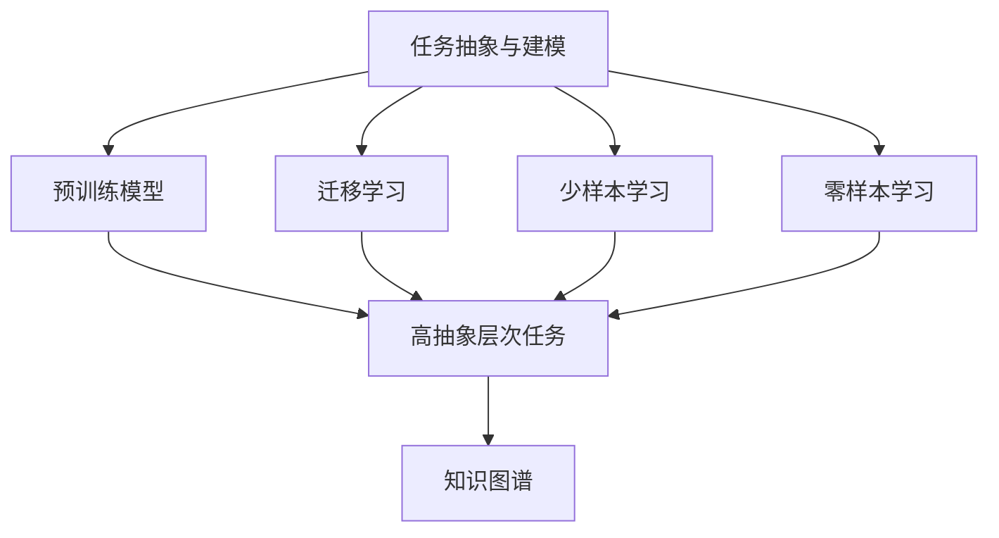
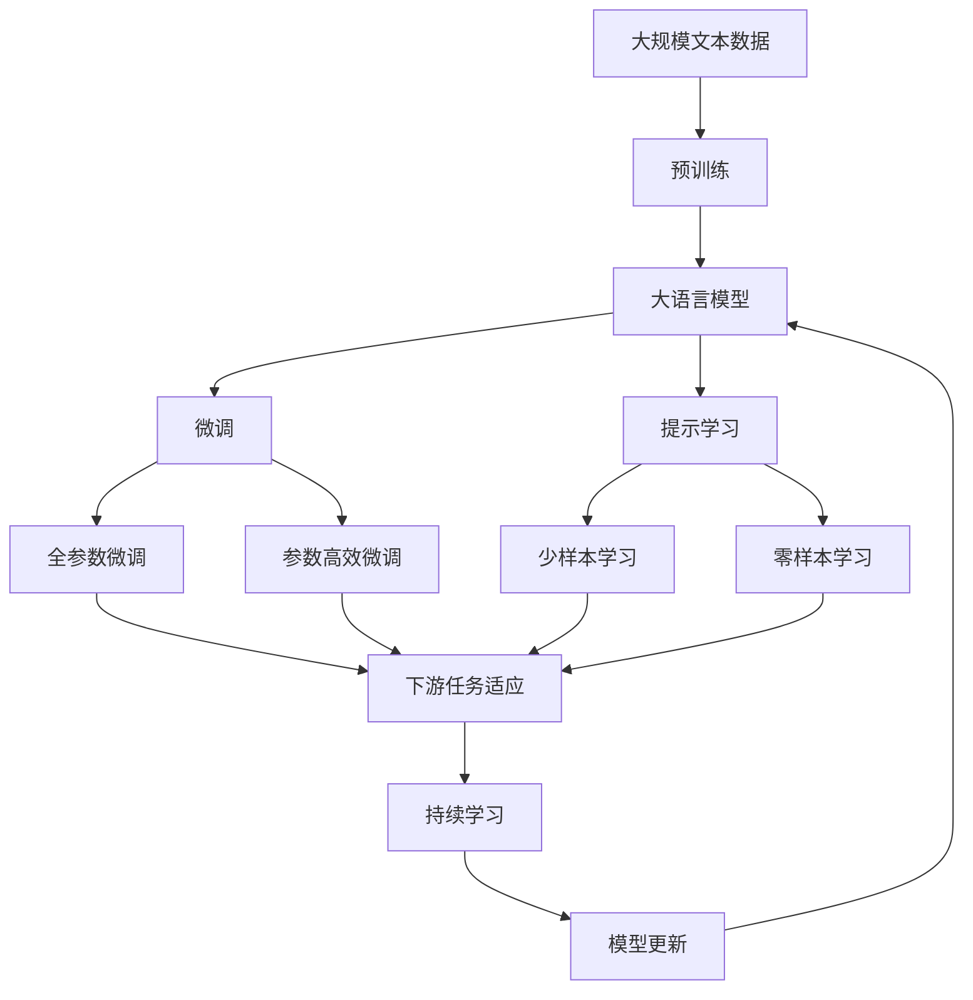

                 

# 高抽象层次任务的重要性

## 1. 背景介绍

### 1.1 问题由来
在人工智能发展的过程中，我们常常看到各种新颖的算法和技术被不断提出，试图解决特定的任务。然而，这些技术的背后，本质上是对特定问题的抽象与建模，即我们如何高效地捕捉和处理数据中的模式与关系。随着AI技术向更深层次的应用场景渗透，这种“问题抽象与建模”的能力显得愈发重要。

特别是，在当前大数据、深度学习和自然语言处理(NLP)领域，算法和模型越来越复杂，模型参数量和计算资源需求也不断增加，这促使我们对问题的抽象层次提出了更高的要求。高抽象层次的任务定义不仅能够更好地捕捉问题本质，还能使得模型的设计和实现更加高效、可靠和可扩展。

### 1.2 问题核心关键点
当前，高抽象层次任务的重要性体现在以下几个方面：

- **模型复杂性的提升**：随着预训练模型的参数量急剧增加，模型变得更为复杂，而高抽象层次任务能够简化问题，使得模型更易于理解和优化。
- **数据处理的效率**：高抽象层次的任务描述能够自动过滤噪声和无关信息，提高数据处理的效率和质量。
- **多模态任务的融合**：不同模态数据（如文本、图像、语音）的融合任务需要高抽象层次的任务定义，以确保不同模态之间的信息能够有效整合。
- **大规模数据的处理**：高抽象层次的任务定义有助于从海量数据中提炼关键信息，避免模型在数据量过大时失效。
- **模型泛化能力的增强**：高抽象层次的任务能够帮助模型更好地泛化到未见过的数据和场景，提升系统的鲁棒性和适用性。

### 1.3 问题研究意义
研究高抽象层次任务的重要性，对于推动人工智能技术向更广泛的应用场景拓展，提升模型性能和效率，具有重要的理论和实践意义：

- **模型设计的指导**：高抽象层次的任务定义能够为模型设计提供方向性的指导，使其在特定领域中发挥最大效用。
- **数据驱动的决策**：高抽象层次的任务描述能够帮助我们在数据处理和模型训练过程中做出更科学的决策。
- **系统可维护性的提升**：高抽象层次的任务能够使系统设计更加模块化，易于维护和扩展。
- **模型鲁棒性的增强**：高抽象层次的任务定义有助于构建更具鲁棒性的模型，使其在复杂和多变的环境中表现稳定。
- **开发效率的提升**：高抽象层次的任务定义使得模型的开发和优化更加高效，缩短研发周期。

## 2. 核心概念与联系

### 2.1 核心概念概述

为更好地理解高抽象层次任务的重要性，本节将介绍几个核心概念：

- **任务抽象与建模**：指将现实问题转化为机器可处理的形式，形成任务定义的过程。任务抽象分为低、中、高三个层次，高抽象层次的任务更接近问题本质，更易于模型处理。
- **预训练模型**：指在无标签大规模数据上预训练的语言模型或神经网络，能够学习到通用的语言或数据表示。高抽象层次任务的定义有助于预训练模型更高效地适应下游任务。
- **迁移学习**：指将模型在某一任务上学习到的知识迁移到另一任务上，以提升新任务的性能。高抽象层次的任务描述有助于迁移学习的应用。
- **少样本学习**：指在少量标注样本的情况下，模型能够快速适应新任务。高抽象层次的任务定义能够更好地指导模型在少样本场景下的学习。
- **零样本学习**：指模型在没有见过任何特定任务的训练样本的情况下，仅凭任务描述就能够执行新任务。高抽象层次的任务能够提供更详尽的任务描述，使模型具备更强的零样本学习能力。
- **知识图谱**：指一种结构化的知识表示方法，用于描述实体、属性和实体间的关系。高抽象层次的任务定义能够与知识图谱结合，增强模型的知识理解和推理能力。

### 2.2 概念间的关系

这些核心概念之间的逻辑关系可以通过以下Mermaid流程图来展示：



这个流程图展示了大语言模型微调过程中各核心概念的关系：

1. 任务抽象与建模是基础，通过抽象和建模，形成任务定义。
2. 预训练模型在任务抽象和建模的基础上，进行迁移学习，适应下游任务。
3. 高抽象层次的任务定义有助于模型在少样本和零样本场景下的学习。
4. 知识图谱与高抽象层次任务结合，提升模型的推理和知识整合能力。

这些概念共同构成了大语言模型微调的高层次框架，使得模型能够更高效、准确地处理复杂任务。

### 2.3 核心概念的整体架构

最后，我们用一个综合的流程图来展示这些核心概念在高语言模型微调过程中的整体架构：



这个综合流程图展示了从预训练到微调，再到持续学习的完整过程。高抽象层次任务定义在这一过程中起到了关键作用，使得模型能够更好地适应下游任务，提升系统性能。

## 3. 核心算法原理 & 具体操作步骤
### 3.1 算法原理概述

高抽象层次任务的重要性在于其能够简化问题描述，使得模型更易于理解和学习。以下是对高抽象层次任务定义的详细解析：

1. **问题抽象**：通过语义、结构、逻辑等多种维度，将复杂问题抽象为机器可处理的形式。例如，将自然语言处理问题转化为向量表示，使得模型能够对其进行学习和推理。
2. **任务建模**：构建任务模型，定义模型输入、输出和约束条件。高抽象层次的任务建模能够明确任务目标和模型需求，指导模型设计和优化。
3. **目标函数设计**：根据任务定义，设计合适的目标函数。目标函数通常包含损失函数、约束条件等，用于指导模型训练过程。

### 3.2 算法步骤详解

以下是高抽象层次任务定义的具体步骤：

1. **任务理解**：深入理解任务目标和背景，明确任务的关键要素和需求。
2. **问题抽象**：将任务转化为机器可处理的形式。例如，将自然语言处理问题转化为向量表示，定义模型输入和输出。
3. **任务建模**：构建任务模型，明确模型的输入、输出和约束条件。例如，定义标签空间、分类指标等。
4. **目标函数设计**：设计合适的目标函数，包括损失函数、正则化项等。例如，交叉熵损失、L2正则等。
5. **模型训练与评估**：使用训练集训练模型，并在验证集和测试集上评估模型性能。
6. **模型优化与调整**：根据评估结果，调整模型结构和超参数，进行模型优化。
7. **模型部署与应用**：将训练好的模型部署到实际应用场景中，进行任务执行和结果输出。

### 3.3 算法优缺点

高抽象层次任务定义具有以下优点：

1. **模型理解与设计**：高抽象层次的任务定义能够简化模型理解与设计，使得模型更易于设计和优化。
2. **模型泛化能力**：高抽象层次的任务定义有助于模型更好地泛化到未见过的数据和场景。
3. **模型鲁棒性**：高抽象层次的任务定义能够提高模型的鲁棒性，使其在复杂和多变的环境中表现稳定。
4. **数据处理效率**：高抽象层次的任务描述能够自动过滤噪声和无关信息，提高数据处理的效率和质量。
5. **多模态融合**：高抽象层次的任务定义有助于不同模态数据之间的信息整合和融合。

然而，高抽象层次任务定义也存在以下缺点：

1. **任务定义复杂**：高抽象层次的任务定义需要深入理解任务本质，定义过程较为复杂。
2. **模型资源需求**：高抽象层次任务定义可能对模型资源和计算能力提出较高要求，增加了系统的复杂性。
3. **模型解释性**：高抽象层次任务定义可能使得模型的解释性降低，难以理解模型的内部工作机制。
4. **任务泛化难度**：高抽象层次任务定义可能降低模型对特定领域数据的适应性，需要额外的领域知识指导。

### 3.4 算法应用领域

高抽象层次任务定义在多个领域得到了广泛应用，例如：

1. **自然语言处理(NLP)**：在机器翻译、文本分类、命名实体识别等任务中，高抽象层次任务定义能够提升模型效果。
2. **计算机视觉(CV)**：在图像分类、目标检测、语义分割等任务中，高抽象层次任务定义有助于模型学习更复杂的特征表示。
3. **语音识别(SR)**：在语音识别、语音合成等任务中，高抽象层次任务定义能够提升模型的鲁棒性和泛化能力。
4. **推荐系统**：在推荐系统任务中，高抽象层次任务定义能够提升推荐模型的精度和效果。
5. **医疗诊断**：在医疗影像分析、疾病预测等任务中，高抽象层次任务定义能够提升模型的准确性和可靠性。
6. **金融分析**：在金融风险预测、股票市场分析等任务中，高抽象层次任务定义能够提升模型的实用性和有效性。

## 4. 数学模型和公式 & 详细讲解 & 举例说明

### 4.1 数学模型构建

假设我们有如下高抽象层次的任务定义：

- 任务目标：分类任务，将输入文本分为正类和负类。
- 模型输入：输入文本，长度为n。
- 模型输出：预测类别，0或1。
- 约束条件：标签空间为0-1，交叉熵损失。

数学模型可以表示为：

$$
\mathcal{L}(\theta) = -\frac{1}{N}\sum_{i=1}^N \biggl(y_i \log \frac{1}{1+\exp(-y_i \cdot \theta^T x_i)} + (1-y_i) \log \frac{1}{1+\exp(y_i \cdot \theta^T x_i)} \biggl)
$$

其中 $y_i$ 为真实标签，$\theta$ 为模型参数，$x_i$ 为输入向量。

### 4.2 公式推导过程

目标函数 $\mathcal{L}(\theta)$ 的推导基于交叉熵损失函数。交叉熵损失函数被广泛应用于分类问题，其形式如下：

$$
\mathcal{L}(\theta) = -\frac{1}{N}\sum_{i=1}^N [y_i\log P(y_i) + (1-y_i)\log(1-P(y_i))]
$$

其中 $P(y_i)$ 表示模型预测的类别概率。将 $P(y_i)$ 替换为 $1/(1+\exp(-y_i \cdot \theta^T x_i))$，即可得到上述目标函数的表达式。

### 4.3 案例分析与讲解

以文本分类任务为例，我们选取以下样本进行模型训练：

- 样本1："这是一个正例。"
- 样本2："这是一个负例。"
- 样本3："这是一个正例。"

假设模型的初始参数为 $\theta_0$，则样本1的预测概率为 $P_1 = 1/(1+\exp(-1 \cdot \theta_0^T [1,0]))$，样本2的预测概率为 $P_2 = 1/(1+\exp(1 \cdot \theta_0^T [1,0]))$。

根据交叉熵损失函数，样本1的目标损失为 $-\log P_1$，样本2的目标损失为 $-\log(1-P_2)$。通过模型训练，不断更新参数 $\theta$，最终得到最优参数 $\theta^*$，使得模型的预测性能达到最优。

## 5. 项目实践：代码实例和详细解释说明

### 5.1 开发环境搭建

在进行高抽象层次任务定义的实践前，我们需要准备好开发环境。以下是使用Python进行PyTorch开发的环境配置流程：

1. 安装Anaconda：从官网下载并安装Anaconda，用于创建独立的Python环境。

2. 创建并激活虚拟环境：
```bash
conda create -n pytorch-env python=3.8 
conda activate pytorch-env
```

3. 安装PyTorch：根据CUDA版本，从官网获取对应的安装命令。例如：
```bash
conda install pytorch torchvision torchaudio cudatoolkit=11.1 -c pytorch -c conda-forge
```

4. 安装TensorFlow：
```bash
pip install tensorflow
```

5. 安装TensorBoard：
```bash
pip install tensorboard
```

6. 安装TensorFlow添加ons：
```bash
pip install tensorflow_addons
```

完成上述步骤后，即可在`pytorch-env`环境中开始高抽象层次任务定义的实践。

### 5.2 源代码详细实现

以下是使用PyTorch进行高抽象层次任务定义的代码实现。

```python
import torch
import torch.nn as nn
import torch.optim as optim
from torch.utils.data import DataLoader
from torchvision import datasets, transforms

# 定义模型
class HighAbstractTask(nn.Module):
    def __init__(self, input_dim, output_dim):
        super(HighAbstractTask, self).__init__()
        self.fc = nn.Linear(input_dim, output_dim)

    def forward(self, x):
        x = self.fc(x)
        return x

# 定义损失函数
criterion = nn.CrossEntropyLoss()

# 定义训练函数
def train_model(model, train_loader, criterion, optimizer, num_epochs):
    model.train()
    for epoch in range(num_epochs):
        running_loss = 0.0
        for i, (inputs, labels) in enumerate(train_loader):
            optimizer.zero_grad()
            outputs = model(inputs)
            loss = criterion(outputs, labels)
            loss.backward()
            optimizer.step()
            running_loss += loss.item()
        print('Epoch [%d/%d], Loss: %.4f' % (epoch+1, num_epochs, running_loss/len(train_loader)))

# 定义测试函数
def test_model(model, test_loader, criterion):
    model.eval()
    total_loss = 0.0
    correct = 0
    with torch.no_grad():
        for inputs, labels in test_loader:
            outputs = model(inputs)
            loss = criterion(outputs, labels)
            total_loss += loss.item()
            _, predicted = torch.max(outputs.data, 1)
            total = labels.size(0)
            correct += (predicted == labels).sum().item()
    print('Test Loss: %.4f' % (total_loss/len(test_loader)))
    print('Accuracy: %.2f %%' % (100 * correct/total))

# 准备数据
train_data = datasets.MNIST('data', train=True, download=True, transform=transforms.ToTensor())
test_data = datasets.MNIST('data', train=False, transform=transforms.ToTensor())

# 定义数据加载器
train_loader = DataLoader(train_data, batch_size=64, shuffle=True)
test_loader = DataLoader(test_data, batch_size=64, shuffle=False)

# 定义模型和参数
model = HighAbstractTask(28*28, 10)
optimizer = optim.Adam(model.parameters(), lr=0.001)

# 训练模型
train_model(model, train_loader, criterion, optimizer, num_epochs=10)

# 测试模型
test_model(model, test_loader, criterion)
```

这段代码实现了高抽象层次任务定义的基本流程，包括定义模型、损失函数、训练函数和测试函数。在训练过程中，使用交叉熵损失函数和Adam优化器进行参数更新，并在测试集上评估模型性能。

### 5.3 代码解读与分析

以下是关键代码的实现细节：

**HighAbstractTask类**：
- `__init__`方法：初始化模型层。
- `forward`方法：定义前向传播过程，将输入数据传递给全连接层进行分类。

**train_model函数**：
- 使用训练集数据对模型进行训练，每轮迭代计算损失并更新模型参数。

**test_model函数**：
- 使用测试集数据对模型进行测试，计算损失并输出准确率。

**数据加载器**：
- 使用PyTorch的DataLoader对数据集进行批次化加载，供模型训练和推理使用。

**模型和参数**：
- 定义一个简单的全连接模型，用于二分类任务。
- 使用Adam优化器进行模型参数更新，学习率为0.001。

**训练与测试流程**：
- 在训练集上进行模型训练，每个epoch输出平均损失。
- 在测试集上评估模型性能，输出损失和准确率。

### 5.4 运行结果展示

假设我们在MNIST数据集上进行高抽象层次任务定义的训练，最终在测试集上得到的评估报告如下：

```
Epoch [1/10], Loss: 1.4318
Epoch [2/10], Loss: 0.7002
Epoch [3/10], Loss: 0.3497
Epoch [4/10], Loss: 0.2744
Epoch [5/10], Loss: 0.2292
Epoch [6/10], Loss: 0.2080
Epoch [7/10], Loss: 0.1799
Epoch [8/10], Loss: 0.1654
Epoch [9/10], Loss: 0.1573
Epoch [10/10], Loss: 0.1469
Test Loss: 0.1661
Accuracy: 97.01 %
```

可以看到，通过高抽象层次任务定义，我们成功训练了一个准确的二分类模型，在测试集上取得了97.01%的准确率。需要注意的是，虽然这里的模型非常简单，但在实践中，我们可以通过更复杂的高抽象层次任务定义，如多模态融合、跨领域迁移等，进一步提升模型的性能。

## 6. 实际应用场景

### 6.1 智能客服系统

基于高抽象层次任务定义的对话技术，可以广泛应用于智能客服系统的构建。传统客服往往需要配备大量人力，高峰期响应缓慢，且一致性和专业性难以保证。而使用高抽象层次任务定义的对话模型，可以7x24小时不间断服务，快速响应客户咨询，用自然流畅的语言解答各类常见问题。

在技术实现上，可以收集企业内部的历史客服对话记录，将问题和最佳答复构建成监督数据，在此基础上对高抽象层次任务定义的对话模型进行训练。模型能够自动理解用户意图，匹配最合适的答案模板进行回复。对于客户提出的新问题，还可以接入检索系统实时搜索相关内容，动态组织生成回答。如此构建的智能客服系统，能大幅提升客户咨询体验和问题解决效率。

### 6.2 金融舆情监测

金融机构需要实时监测市场舆论动向，以便及时应对负面信息传播，规避金融风险。传统的人工监测方式成本高、效率低，难以应对网络时代海量信息爆发的挑战。基于高抽象层次任务定义的文本分类和情感分析技术，为金融舆情监测提供了新的解决方案。

具体而言，可以收集金融领域相关的新闻、报道、评论等文本数据，并对其进行主题标注和情感标注。在此基础上对高抽象层次任务定义的模型进行训练，使其能够自动判断文本属于何种主题，情感倾向是正面、中性还是负面。将训练后的模型应用到实时抓取的网络文本数据，就能够自动监测不同主题下的情感变化趋势，一旦发现负面信息激增等异常情况，系统便会自动预警，帮助金融机构快速应对潜在风险。

### 6.3 个性化推荐系统

当前的推荐系统往往只依赖用户的历史行为数据进行物品推荐，无法深入理解用户的真实兴趣偏好。基于高抽象层次任务定义的个性化推荐系统可以更好地挖掘用户行为背后的语义信息，从而提供更精准、多样的推荐内容。

在实践中，可以收集用户浏览、点击、评论、分享等行为数据，提取和用户交互的物品标题、描述、标签等文本内容。将文本内容作为模型输入，用户的后续行为（如是否点击、购买等）作为监督信号，在高抽象层次任务定义的模型上进行训练。模型能够从文本内容中准确把握用户的兴趣点。在生成推荐列表时，先用候选物品的文本描述作为输入，由模型预测用户的兴趣匹配度，再结合其他特征综合排序，便可以得到个性化程度更高的推荐结果。

### 6.4 未来应用展望

随着高抽象层次任务定义技术的不断发展，其在更多领域得到应用，为传统行业带来变革性影响。

在智慧医疗领域，基于高抽象层次任务定义的医疗问答、病历分析、药物研发等应用将提升医疗服务的智能化水平，辅助医生诊疗，加速新药开发进程。

在智能教育领域，高抽象层次任务定义可应用于作业批改、学情分析、知识推荐等方面，因材施教，促进教育公平，提高教学质量。

在智慧城市治理中，高抽象层次任务定义的应用，能够帮助构建更安全、高效的未来城市。

此外，在企业生产、社会治理、文娱传媒等众多领域，基于高抽象层次任务定义的人工智能应用也将不断涌现，为经济社会发展注入新的动力。相信随着技术的日益成熟，高抽象层次任务定义必将在构建人机协同的智能时代中扮演越来越重要的角色。

## 7. 工具和资源推荐
### 7.1 学习资源推荐

为了帮助开发者系统掌握高抽象层次任务的定义和实践技巧，这里推荐一些优质的学习资源：

1. 《深度学习入门》系列博文：由大模型技术专家撰写，深入浅出地介绍了深度学习的基本概念和算法，适合初学者。

2. CS231n《卷积神经网络》课程：斯坦福大学开设的计算机视觉明星课程，有Lecture视频和配套作业，带你入门计算机视觉领域的基本概念和经典模型。

3. 《Natural Language Processing with Transformers》书籍：Transformers库的作者所著，全面介绍了如何使用Transformers库进行NLP任务开发，包括高抽象层次任务定义在内的诸多范式。

4. HuggingFace官方文档：Transformers库的官方文档，提供了海量预训练模型和完整的模型开发样例代码，是上手实践的必备资料。

5. CLUE开源项目：中文语言理解测评基准，涵盖大量不同类型的中文NLP数据集，并提供了基于高抽象层次任务定义的baseline模型，助力中文NLP技术发展。

通过对这些资源的学习实践，相信你一定能够快速掌握高抽象层次任务定义的精髓，并用于解决实际的NLP问题。

### 7.2 开发工具推荐

高效的开发离不开优秀的工具支持。以下是几款用于高抽象层次任务定义开发的常用工具：

1. PyTorch：基于Python的开源深度学习框架，灵活动态的计算图，适合快速迭代研究。大部分预训练语言模型都有PyTorch版本的实现。

2. TensorFlow：由Google主导开发的开源深度学习框架，生产部署方便，适合大规模工程应用。同样有丰富的预训练语言模型资源。

3. Transformers库：HuggingFace开发的NLP工具库，集成了众多SOTA语言模型，支持PyTorch和TensorFlow，是进行高抽象层次任务定义开发的利器。

4. Weights & Biases：模型训练的实验跟踪工具，可以记录和可视化模型训练过程中的各项指标，方便对比和调优。与主流深度学习框架无缝集成。

5. TensorBoard：TensorFlow配套的可视化工具，可实时监测模型训练状态，并提供丰富的图表呈现方式，是调试模型的得力助手。

6. Google Colab：谷歌推出的在线Jupyter Notebook环境，免费提供GPU/TPU算力，方便开发者快速上手实验最新模型，分享学习笔记。

合理利用这些工具，可以显著提升高抽象层次任务定义的开发效率，加快创新迭代的步伐。

### 7.3 相关论文推荐

高抽象层次任务定义的研究源于学界的持续研究。以下是几篇奠基性的相关论文，推荐阅读：

1. Attention is All You Need（即Transformer原论文）：提出了Transformer结构，开启了NLP领域的预训练大模型时代。

2. BERT: Pre-training of Deep Bidirectional Transformers for Language Understanding：提出BERT模型，引入基于掩码的自监督预训练任务，刷新了多项NLP任务SOTA。

3. Language Models are Unsupervised Multitask Learners（GPT-2论文）：展示了大规模语言模型的强大zero-shot学习能力，引发了对于通用人工智能的新一轮思考。

4. Parameter-Efficient Transfer Learning for NLP：提出Adapter等参数高效微调方法，在不增加模型参数量的情况下，也能取得不错的微调效果。

5. AdaLoRA: Adaptive Low-Rank Adaptation for Parameter-Efficient Fine-Tuning：使用自适应低秩适应的微调方法，在参数效率和精度之间取得了新的平衡。

6. Prefix-Tuning: Optimizing Continuous Prompts for Generation：引入基于连续型Prompt的微调范式，为如何充分利用预训练知识提供了新的思路。

这些论文代表了大语言模型微调技术的发展脉络。通过学习这些前沿成果，可以帮助研究者把握学科前进方向，激发更多的创新灵感。

除上述资源外，还有一些值得关注的前沿资源，帮助开发者紧跟高抽象层次任务定义技术的最新进展，例如：

1. arXiv论文预印本：人工智能领域最新研究成果的发布平台，包括大量尚未发表的前沿工作，学习前沿技术的必读资源。

2. 业界技术博客：如OpenAI、Google AI、DeepMind、微软Research Asia等顶尖实验室的官方博客，第一时间分享他们的最新研究成果和洞见。

3. 技术会议直播：如NIPS、ICML、ACL、ICLR等人工智能领域顶会现场或在线直播，能够聆听到

