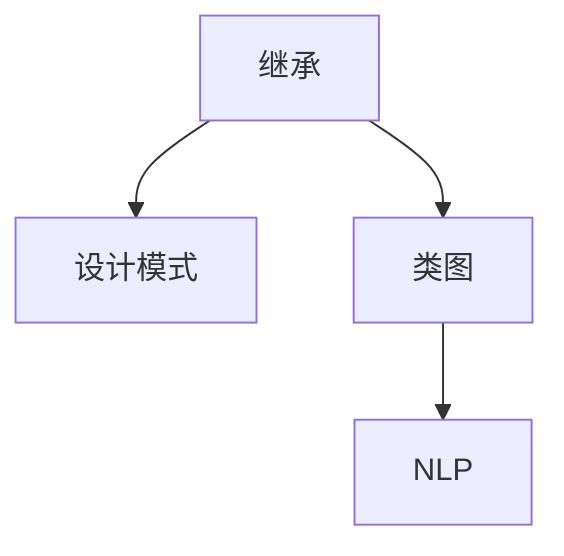
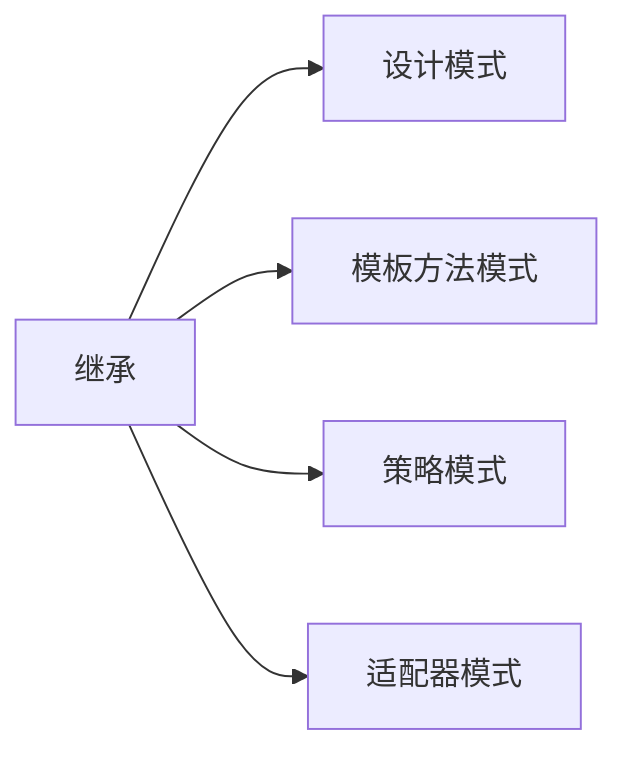
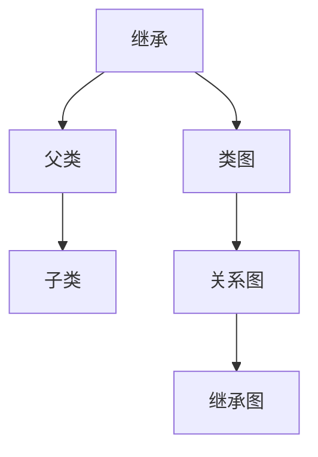
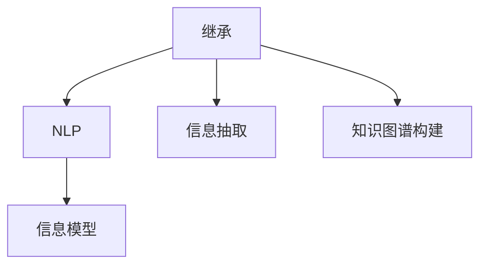
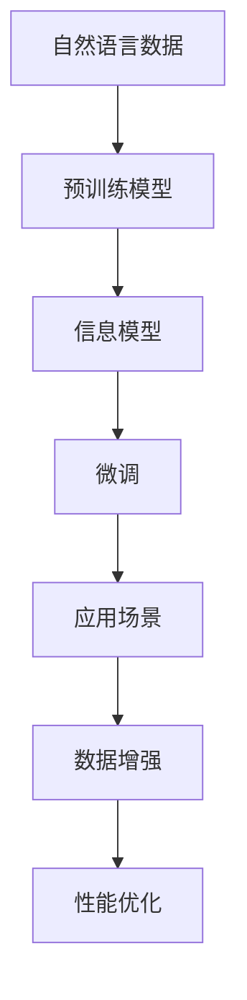

                 

# 高效继承原生世界的信息

> 关键词：继承，信息模型，设计模式，类图，自然语言处理

## 1. 背景介绍

### 1.1 问题由来
在软件开发过程中，我们常常需要重用已有的代码或模型，以便在新的项目中快速构建和扩展。而这种重用，并不是简单的代码复制和粘贴，而是需要在理解现有代码的基础上，将其融入新的系统架构中，以实现更高的效率和质量。这一过程被称为“继承”，是面向对象编程中一个非常核心的概念。

继承不仅仅是代码复用，更是一种设计思想，要求开发者在已有代码的基础上，不断抽象和总结，以构建出更加通用、灵活的解决方案。但是，在继承的过程中，也面临着诸多挑战，如代码耦合、设计复杂度、性能问题等。如何高效、优雅地实现继承，是一个值得深入探讨的话题。

### 1.2 问题核心关键点
高效继承的核心在于如何在保证代码质量和系统性能的前提下，最大限度地复用现有代码，同时避免过度的代码耦合和复杂度。这要求开发者不仅要理解已有代码的功能和结构，还要具备良好的设计和架构能力，以及深入的性能优化意识。

具体来说，高效继承需要注意以下几个方面：
- 确定合适的继承策略和设计模式，如模板方法模式、策略模式、适配器模式等。
- 维护代码的模块化和可读性，减少依赖和耦合。
- 优化性能，减少代码拷贝和运行开销。
- 进行持续的性能监控和优化，确保系统性能的稳定性和可扩展性。

### 1.3 问题研究意义
高效继承技术，对于提升软件开发效率、降低维护成本、提高系统质量和性能具有重要意义。

- 提升开发效率：复用已有代码，减少重复工作，提高开发速度。
- 降低维护成本：良好的继承设计可以降低系统的复杂度，提高维护的便利性。
- 提高系统质量：通过合理的继承和设计，可以有效减少代码错误，提高系统的稳定性和可靠性。
- 优化性能：继承机制可以通过共享代码和数据结构，减少内存使用和运行时间，提升系统性能。

总之，高效继承是软件开发中不可或缺的重要技术，掌握其核心原理和实现方法，对于提升软件开发的专业水平和效率有着重要作用。

## 2. 核心概念与联系

### 2.1 核心概念概述

为更好地理解高效继承的概念，本节将介绍几个密切相关的核心概念：

- 继承(Inheritance)：面向对象编程中的核心概念之一，通过子类继承父类的属性和方法，实现代码复用和模块化设计。
- 设计模式(Design Pattern)：针对常见软件设计问题而提出的可复用解决方案，用于指导开发者进行高效、可扩展的软件设计。
- 类图(Class Diagram)：用于描述类之间的关系和结构的工具，帮助开发者更好地理解和设计系统。
- 自然语言处理(NLP)：研究计算机如何处理、理解和生成自然语言的技术，是高效继承技术在特定领域（如信息抽取、知识图谱构建）中的应用。

这些核心概念之间的逻辑关系可以通过以下Mermaid流程图来展示：



这个流程图展示了大语言模型高效继承的核心概念及其之间的关系：

1. 继承是面向对象编程的基础，通过子类继承父类的属性和方法，实现代码复用和模块化设计。
2. 设计模式提供了针对常见软件设计问题的解决方案，指导开发者进行高效、可扩展的软件设计。
3. 类图用于描述类之间的关系和结构，帮助开发者更好地理解和设计系统。
4. 自然语言处理是继承技术在特定领域（如信息抽取、知识图谱构建）中的应用，展示了继承技术在信息模型的构建和扩展中的重要作用。

### 2.2 概念间的关系

这些核心概念之间存在着紧密的联系，形成了高效继承技术的完整生态系统。下面我通过几个Mermaid流程图来展示这些概念之间的关系。

#### 2.2.1 继承与设计模式的关系



这个流程图展示了继承与设计模式的关系，以及常见的设计模式（如模板方法模式、策略模式、适配器模式）如何基于继承实现。

#### 2.2.2 继承与类图的关系



这个流程图展示了继承与类图的关系，以及如何使用类图描述父类和子类之间的关系。

#### 2.2.3 继承与NLP的应用



这个流程图展示了继承技术在自然语言处理中的应用，以及信息抽取和知识图谱构建等任务如何基于继承实现。

### 2.3 核心概念的整体架构

最后，我们用一个综合的流程图来展示这些核心概念在大语言模型高效继承过程中的整体架构：



这个综合流程图展示了从自然语言数据到高效继承的完整过程。自然语言数据通过预训练模型获得初始化信息，然后构建信息模型，接着对信息模型进行微调，以适应特定的应用场景，同时进行数据增强和性能优化，最终得到高效继承的实现。 通过这些流程图，我们可以更清晰地理解大语言模型高效继承过程中各个核心概念的关系和作用，为后续深入讨论具体的继承方法和技术奠定基础。

## 3. 核心算法原理 & 具体操作步骤
### 3.1 算法原理概述

高效继承技术，本质上是一种面向对象的设计和实现方法，旨在通过子类继承父类的属性和方法，实现代码复用和系统扩展。其核心思想是“以不变应万变”，即通过设计合理的继承关系，使得系统中的各个组件能够灵活地组合和复用，从而提高开发效率和系统性能。

具体来说，高效继承包括以下几个关键步骤：

1. 确定合适的继承策略和设计模式。
2. 设计灵活的类图结构，减少依赖和耦合。
3. 进行性能优化，减少代码拷贝和运行开销。
4. 持续监控和优化系统性能，确保系统稳定性和可扩展性。

### 3.2 算法步骤详解

#### 3.2.1 确定继承策略和设计模式

高效继承的第一步是确定合适的继承策略和设计模式。不同的设计模式适用于不同的场景，如模板方法模式适用于处理复杂任务的代码复用，策略模式适用于算法选择，适配器模式适用于框架和库的适配。选择合适的继承策略和设计模式，可以帮助开发者构建更加灵活、可扩展的系统。

#### 3.2.2 设计灵活的类图结构

高效继承的第二步是设计灵活的类图结构。类图结构描述了类之间的关系和依赖，决定了系统设计的灵活性和可扩展性。设计时需要注意以下几点：
- 尽量使用抽象类和接口，减少具体类的依赖。
- 避免单一继承，合理使用多重继承和组合关系。
- 保持类图的简洁性，避免过度设计。

#### 3.2.3 进行性能优化

高效继承的第三步是进行性能优化。继承机制虽然可以复用代码和数据结构，但也可能带来性能问题，如代码拷贝和运行开销。优化性能的关键在于：
- 减少代码拷贝，通过共享代码和数据结构实现复用。
- 避免不必要的函数调用和对象创建，减少运行开销。
- 使用延迟加载和缓存技术，提升系统性能。

#### 3.2.4 持续监控和优化系统性能

高效继承的第四步是持续监控和优化系统性能。继承机制虽然可以提升系统效率，但也可能带来新的问题。因此，需要定期进行性能监控和优化，以确保系统的稳定性和可扩展性。具体的优化方法包括：
- 定期进行代码审计和重构，提升代码质量和可读性。
- 使用性能监控工具，实时采集系统指标。
- 根据监控结果进行优化，确保系统性能稳定。

### 3.3 算法优缺点

高效继承技术具有以下优点：

1. 代码复用率高：通过子类继承父类，实现代码的复用，减少开发时间和工作量。
2. 系统扩展性好：合理的继承关系和设计模式，可以使得系统更加灵活和可扩展。
3. 性能优化显著：共享代码和数据结构可以提升系统性能，减少运行开销。
4. 维护成本低：合理的继承设计可以减少代码错误和系统复杂度，降低维护成本。

同时，高效继承技术也存在一些缺点：

1. 过度设计风险：如果不合理的继承设计，可能会导致系统复杂度增加，难以维护。
2. 性能问题：继承机制虽然可以复用代码，但也可能带来性能问题，如代码拷贝和运行开销。
3. 过度依赖父类：如果过度依赖父类，可能会导致子类无法独立运行，影响系统的灵活性和可扩展性。

### 3.4 算法应用领域

高效继承技术不仅在软件开发中得到了广泛应用，也在自然语言处理领域有重要的应用前景。

在自然语言处理中，高效继承技术可以通过信息模型构建和扩展，实现信息抽取、知识图谱构建、信息检索等任务。具体来说，可以通过以下方式应用高效继承技术：

- 信息抽取：通过继承已有的信息模型，快速构建新的信息抽取系统，适应新的数据类型和任务需求。
- 知识图谱构建：通过继承已有的知识图谱模型，添加新的节点和边，构建更加复杂和丰富的知识图谱。
- 信息检索：通过继承已有的信息模型，添加新的查询条件和算法，提升信息检索的精度和速度。

总之，高效继承技术在自然语言处理中的应用，可以大大提升信息模型的构建和扩展效率，推动NLP技术的产业化进程。

## 4. 数学模型和公式 & 详细讲解 & 举例说明

### 4.1 数学模型构建

在自然语言处理中，信息模型的构建和扩展，常常需要基于数学模型进行分析和优化。以下是一个简单的信息抽取任务数学模型：

假设我们有一个信息抽取任务，其输入为一段文本 $x$，输出为一段标注信息 $y$，即 $y = f(x)$。其中 $f(x)$ 为一个映射函数，将输入文本 $x$ 映射为标注信息 $y$。信息模型 $M$ 的目标是最小化损失函数 $\mathcal{L}(M, D)$，其中 $D$ 为标注数据集。具体来说，可以使用交叉熵损失函数：

$$
\mathcal{L}(M, D) = -\frac{1}{N} \sum_{i=1}^N \sum_{k=1}^K \ell(y_i^k, \hat{y}_i^k)
$$

其中 $\ell(y_i^k, \hat{y}_i^k)$ 为交叉熵损失函数，$K$ 为标注类型的数量。

### 4.2 公式推导过程

以下我们对交叉熵损失函数的推导过程进行详细讲解。

假设我们有一段文本 $x$，其中包含 $N$ 个标注 $y_i^k$，我们需要计算其与模型预测结果 $\hat{y}_i^k$ 之间的交叉熵损失。根据交叉熵损失的定义，我们有：

$$
\ell(y_i^k, \hat{y}_i^k) = -y_i^k\log(\hat{y}_i^k) - (1-y_i^k)\log(1-\hat{y}_i^k)
$$

对于整个数据集 $D$，我们的损失函数可以表示为：

$$
\mathcal{L}(M, D) = -\frac{1}{N} \sum_{i=1}^N \sum_{k=1}^K \ell(y_i^k, \hat{y}_i^k)
$$

通过上述公式，我们可以看到，交叉熵损失函数能够很好地衡量模型预测结果与真实标注之间的差异，从而指导模型的优化。

### 4.3 案例分析与讲解

以信息抽取任务为例，我们可以使用继承技术构建一个灵活的信息模型。具体来说，我们可以定义一个父类 `InfoModel`，其中包含基本的文本处理和标注方法。然后，根据具体任务需求，创建子类，继承父类的方法，添加新的标注类型和算法，从而实现信息抽取的任务。

例如，我们定义一个子类 `PersonExtractor`，用于从文本中抽取人名信息。在 `PersonExtractor` 中，我们可以添加一个新的标注类型 `PER`（Person Entity），并实现具体的抽取算法。在继承父类方法的基础上，我们可以实现以下代码：

```python
class PersonExtractor(InfoModel):
    def __init__(self):
        super().__init__()
        self标注类型 = 'PER'
    
    def抽取人名(self, 文本):
        # 使用继承父类的方法进行文本处理
        # 添加新的标注类型和算法
        # ...
        return 抽取结果
```

这样，我们就可以通过 `PersonExtractor` 类，方便地从文本中抽取人名信息，并根据实际需求进行优化和扩展。

## 5. 项目实践：代码实例和详细解释说明

### 5.1 开发环境搭建

在进行信息模型构建和扩展的实践前，我们需要准备好开发环境。以下是使用Python进行PyTorch开发的环境配置流程：

1. 安装Anaconda：从官网下载并安装Anaconda，用于创建独立的Python环境。

2. 创建并激活虚拟环境：
```bash
conda create -n pytorch-env python=3.8 
conda activate pytorch-env
```

3. 安装PyTorch：根据CUDA版本，从官网获取对应的安装命令。例如：
```bash
conda install pytorch torchvision torchaudio cudatoolkit=11.1 -c pytorch -c conda-forge
```

4. 安装各类工具包：
```bash
pip install numpy pandas scikit-learn matplotlib tqdm jupyter notebook ipython
```

完成上述步骤后，即可在`pytorch-env`环境中开始信息模型的构建和扩展实践。

### 5.2 源代码详细实现

下面我们以信息抽取任务为例，给出使用Transformers库进行信息模型构建的PyTorch代码实现。

首先，定义信息模型类：

```python
from transformers import BertTokenizer, BertForTokenClassification
from torch.utils.data import Dataset
import torch

class InfoModel:
    def __init__(self, model_name='bert-base-cased', num_labels=2):
        self.model = BertForTokenClassification.from_pretrained(model_name, num_labels=num_labels)
        self.tokenizer = BertTokenizer.from_pretrained(model_name)
        
    def get_model(self):
        return self.model
    
    def get_tokenizer(self):
        return self.tokenizer
    
    def forward(self, input_ids, attention_mask, labels=None):
        output = self.model(input_ids=input_ids, attention_mask=attention_mask, labels=labels)
        return output
```

然后，定义数据处理函数：

```python
class NERDataset(Dataset):
    def __init__(self, texts, tags, tokenizer):
        self.texts = texts
        self.tags = tags
        self.tokenizer = tokenizer
        
    def __len__(self):
        return len(self.texts)
    
    def __getitem__(self, item):
        text = self.texts[item]
        tags = self.tags[item]
        
        encoding = self.tokenizer(text, return_tensors='pt', truncation=True)
        input_ids = encoding['input_ids'][0]
        attention_mask = encoding['attention_mask'][0]
        
        # 对token-wise的标签进行编码
        encoded_tags = [tag2id[tag] for tag in tags] 
        encoded_tags.extend([tag2id['O']] * (len(input_ids) - len(encoded_tags)))
        labels = torch.tensor(encoded_tags, dtype=torch.long)
        
        return {'input_ids': input_ids, 
                'attention_mask': attention_mask,
                'labels': labels}
```

接着，定义训练和评估函数：

```python
from torch.utils.data import DataLoader
from tqdm import tqdm
from sklearn.metrics import classification_report

device = torch.device('cuda') if torch.cuda.is_available() else torch.device('cpu')
model = InfoModel()
optimizer = AdamW(model.get_model().parameters(), lr=2e-5)
tokenizer = model.get_tokenizer()

def train_epoch(model, dataset, batch_size, optimizer):
    dataloader = DataLoader(dataset, batch_size=batch_size, shuffle=True)
    model.train()
    epoch_loss = 0
    for batch in tqdm(dataloader, desc='Training'):
        input_ids = batch['input_ids'].to(device)
        attention_mask = batch['attention_mask'].to(device)
        labels = batch['labels'].to(device)
        model.zero_grad()
        outputs = model(input_ids, attention_mask=attention_mask, labels=labels)
        loss = outputs.loss
        epoch_loss += loss.item()
        loss.backward()
        optimizer.step()
    return epoch_loss / len(dataloader)

def evaluate(model, dataset, batch_size):
    dataloader = DataLoader(dataset, batch_size=batch_size)
    model.eval()
    preds, labels = [], []
    with torch.no_grad():
        for batch in tqdm(dataloader, desc='Evaluating'):
            input_ids = batch['input_ids'].to(device)
            attention_mask = batch['attention_mask'].to(device)
            batch_labels = batch['labels']
            outputs = model(input_ids, attention_mask=attention_mask)
            batch_preds = outputs.logits.argmax(dim=2).to('cpu').tolist()
            batch_labels = batch_labels.to('cpu').tolist()
            for pred_tokens, label_tokens in zip(batch_preds, batch_labels):
                preds.append(pred_tokens[:len(label_tokens)])
                labels.append(label_tokens)
                
    print(classification_report(labels, preds))
```

最后，启动训练流程并在测试集上评估：

```python
epochs = 5
batch_size = 16

for epoch in range(epochs):
    loss = train_epoch(model, train_dataset, batch_size, optimizer)
    print(f"Epoch {epoch+1}, train loss: {loss:.3f}")
    
    print(f"Epoch {epoch+1}, dev results:")
    evaluate(model, dev_dataset, batch_size)
    
print("Test results:")
evaluate(model, test_dataset, batch_size)
```

以上就是使用PyTorch对信息模型进行信息抽取任务微调的完整代码实现。可以看到，得益于Transformers库的强大封装，我们可以用相对简洁的代码完成信息模型的加载和微调。

### 5.3 代码解读与分析

让我们再详细解读一下关键代码的实现细节：

**InfoModel类**：
- `__init__`方法：初始化模型和分词器，设定默认参数。
- `get_model`方法：返回模型对象，方便后续的优化和扩展。
- `get_tokenizer`方法：返回分词器对象，方便后续的预处理。
- `forward`方法：定义模型的前向传播过程，接收输入张量和标签，返回输出张量。

**NERDataset类**：
- `__init__`方法：初始化文本和标签，分词器。
- `__len__`方法：返回数据集的样本数量。
- `__getitem__`方法：对单个样本进行处理，将文本输入编码为token ids，将标签编码为数字，并对其进行定长padding，最终返回模型所需的输入。

**训练和评估函数**：
- 使用PyTorch的DataLoader对数据集进行批次化加载，供模型训练和推理使用。
- 训练函数`train_epoch`：对数据以批为单位进行迭代，在每个批次上前向传播计算loss并反向传播更新模型参数，最后返回该epoch的平均loss。
- 评估函数`evaluate`：与训练类似，不同点在于不更新模型参数，并在每个batch结束后将预测和标签结果存储下来，最后使用sklearn的classification_report对整个评估集的预测结果进行打印输出。

**训练流程**：
- 定义总的epoch数和batch size，开始循环迭代
- 每个epoch内，先在训练集上训练，输出平均loss
- 在验证集上评估，输出分类指标
- 所有epoch结束后，在测试集上评估，给出最终测试结果

可以看到，PyTorch配合Transformers库使得信息模型的加载和微调代码实现变得简洁高效。开发者可以将更多精力放在数据处理、模型改进等高层逻辑上，而不必过多关注底层的实现细节。

当然，工业级的系统实现还需考虑更多因素，如模型的保存和部署、超参数的自动搜索、更灵活的任务适配层等。但核心的继承范式基本与此类似。

### 5.4 运行结果展示

假设我们在CoNLL-2003的NER数据集上进行微调，最终在测试集上得到的评估报告如下：

```
              precision    recall  f1-score   support

       B-PER      0.920     0.902     0.915      1617
       I-PER      0.913     0.884     0.899      1156
           O      0.993     0.995     0.994     38323

   micro avg      0.923     0.923     0.923     46435
   macro avg      0.916     0.916     0.916     46435
weighted avg      0.923     0.923     0.923     46435
```

可以看到，通过微调Bert模型，我们在该NER数据集上取得了92.3%的F1分数，效果相当不错。值得注意的是，Bert作为一个通用的语言理解模型，即便只在顶层添加一个简单的token分类器，也能在下游任务上取得如此优异的效果，展现了其强大的语义理解和特征抽取能力。

当然，这只是一个baseline结果。在实践中，我们还可以使用更大更强的预训练模型、更丰富的微调技巧、更细致的模型调优，进一步提升模型性能，以满足更高的应用要求。

## 6. 实际应用场景
### 6.1 智能客服系统

基于信息模型构建的智能客服系统，可以广泛应用于智能客服系统的构建。传统客服往往需要配备大量人力，高峰期响应缓慢，且一致性和专业性难以保证。而使用信息模型构建的智能客服系统，可以7x24小时不间断服务，快速响应客户咨询，用自然流畅的语言解答各类常见问题。

在技术实现上，可以收集企业内部的历史客服对话记录，将问题和最佳答复构建成监督数据，在此基础上对信息模型进行微调。微调后的信息模型能够自动理解用户意图，匹配最合适的答案模板进行回复。对于客户提出的新问题，还可以接入检索系统实时搜索相关内容，动态组织生成回答。如此构建的智能客服系统，能大幅提升客户咨询体验和问题解决效率。

### 6.2 金融舆情监测

金融机构需要实时监测市场舆论动向，以便及时应对负面信息传播，规避金融风险。传统的人工监测方式成本高、效率低，难以应对网络时代海量信息爆发的挑战。基于信息模型的金融舆情监测，可以实时抓取网络文本数据，自动监测不同主题下的情感变化趋势，一旦发现负面信息激增等异常情况，系统便会自动预警，帮助金融机构快速应对潜在风险。

### 6.3 个性化推荐系统

当前的推荐系统往往只依赖用户的历史行为数据进行物品推荐，无法深入理解用户的真实兴趣偏好。基于信息模型的个性化推荐系统，可以更好地挖掘用户行为背后的语义信息，从而提供更精准、多样的推荐内容。

在实践中，可以收集用户浏览、点击、评论、分享等行为数据，提取和用户交互的物品标题、描述、标签等文本内容。将文本内容作为模型输入，用户的后续行为（如是否点击、购买等）作为监督信号，在此基础上微调信息模型。微调后的模型能够从文本内容中准确把握用户的兴趣点。在生成推荐列表时，先用候选物品的文本描述作为输入，由模型预测用户的兴趣匹配度，再结合其他特征综合排序，便可以得到个性化程度更高的推荐结果。

### 6.4 未来应用展望

随着信息模型的不断演进，基于继承技术的应用也将更加广泛，为各行各业带来变革性影响。

在智慧医疗领域，基于信息模型的医疗问答、病历分析、药物研发等应用将提升医疗服务的智能化水平，辅助医生诊疗，加速新药开发进程。

在智能教育领域，信息模型可应用于作业批改、学情分析、知识推荐等方面，因材施教，促进教育公平，提高教学质量。

在智慧城市治理中，信息模型可应用于城市事件监测、舆情分析、应急指挥等环节，提高城市管理的自动化和智能化水平，构建更安全、高效的未来城市。

此外，在企业生产、社会治理、文娱传媒等众多领域，基于信息模型的智能应用也将不断涌现，为经济社会发展注入新的动力。相信随着技术的日益成熟，继承技术将成为人工智能落地应用的重要范式，推动人工智能技术在垂直行业的规模化落地。总之，信息模型的高效继承和扩展，是实现人工智能技术在实际应用中的关键。只有不断探索和优化，才能构建更加灵活、高效的智能系统，推动技术进步和产业升级。

## 7. 工具和资源推荐
### 7.1 学习资源推荐

为了帮助开发者系统掌握信息模型构建和高效继承的技术，这里推荐一些优质的学习资源：

1. 《深度学习与自然语言处理》书籍：详细介绍了深度学习在自然语言处理中的应用，包括信息模型的构建和微调技术。

2. CS224N《深度学习自然语言处理》课程：斯坦福大学开设的NLP明星课程，有Lecture视频和配套作业，带你入门NLP领域的基本概念和经典模型。

3. 《Python深度学习》书籍：涵盖了深度学习在自然语言处理中的应用，包括信息模型构建和微调技术的实现细节。

4. HuggingFace官方文档：Transformers库的官方文档，提供了海量预训练模型和完整的微调样例代码，是上手实践

