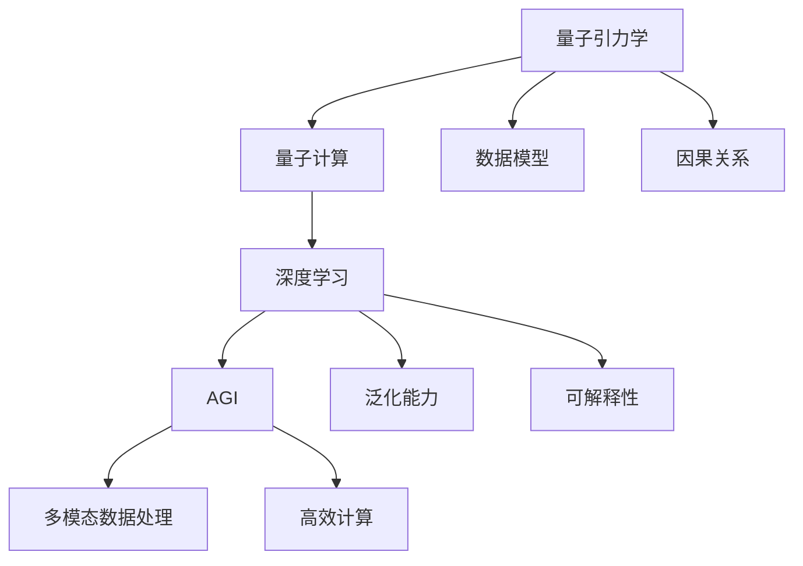
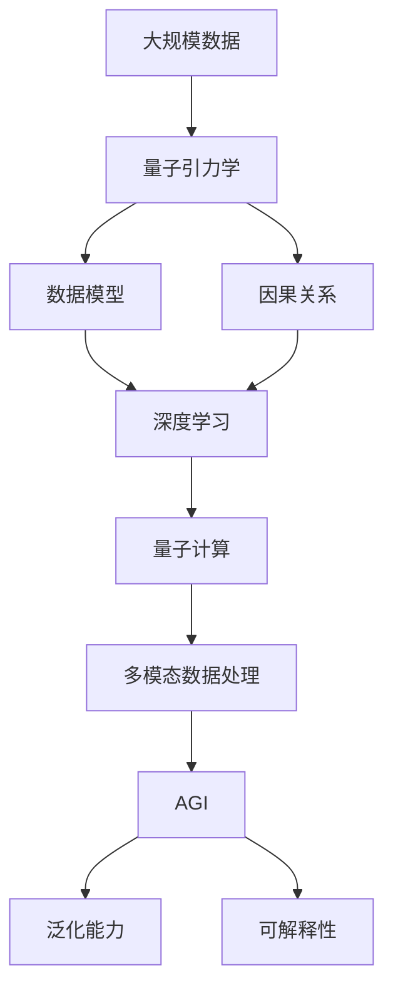

                 

## 1. 背景介绍

### 1.1 问题由来

随着人工智能（AI）技术的不断发展，特别是近年来在深度学习和神经网络方面的突破，越来越多的研究者开始思考AGI（通用人工智能）的实现路径。AGI的目标是构建能够处理多种任务，具备学习、推理、自我更新能力的智能系统。然而，构建AGI的关键在于如何让AI系统拥有更强的泛化能力和可解释性，使其不仅仅局限于某一特定领域。

### 1.2 问题核心关键点

目前，构建AGI面临的主要挑战包括：如何使AI系统具备跨领域的泛化能力、如何提高模型的可解释性、如何处理复杂的因果关系以及如何避免偏见和伦理问题等。这些问题在大规模数据和强计算能力的推动下得到了一定程度的解决，但仍然存在一些需要深入研究的领域。

量子引力学（Quantum Gravity）作为连接物理学和计算机科学的新兴交叉学科，其理论基础和计算方法为AGI提供了全新的思路和方法。量子引力学不仅能够提供更加精细、准确的数据模型，还能够提供全新的计算范式，即量子计算（Quantum Computing）。

### 1.3 问题研究意义

将量子引力学应用于AGI研究，将推动人工智能领域向更加精细化、多模态、高效化的方向发展。以下是该研究的重要意义：

1. **提高数据模型精度**：量子引力学能够提供更加精确的数据模型，特别是在描述物理系统时，能够精确到基本粒子层面，从而提高AI系统的泛化能力和推理准确性。
2. **加速模型训练**：量子计算能够大幅提高模型训练的效率，使得AI系统在短时间内处理大规模数据集成为可能。
3. **增强系统鲁棒性**：量子引力学的理论基础为AGI提供了更强的因果关系分析和不确定性处理能力，使得系统对复杂环境的适应能力更强。
4. **提升模型可解释性**：通过量子引力学的理论框架，可以更好地解释模型的决策过程和因果关系，从而提高模型的可解释性和可信度。
5. **推动跨学科融合**：量子引力学的研究不仅能够为AI提供新的理论和方法，还能够促进物理学、计算机科学等多个学科的交叉融合，推动科学研究的深入发展。

## 2. 核心概念与联系

### 2.1 核心概念概述

- **AGI（通用人工智能）**：指能够处理多种任务，具备学习、推理、自我更新能力的智能系统。
- **量子引力学**：一种描述基本粒子和引力作用的理论框架，融合了经典物理和量子力学。
- **量子计算**：利用量子位（qubit）进行计算的新型计算范式，能够在某些特定问题上大幅提高计算效率。
- **深度学习**：一种基于神经网络的机器学习技术，能够从大量数据中自动学习特征，具有很强的泛化能力。
- **可解释性**：指AI系统能够对其决策过程进行合理解释，使得用户能够理解和信任系统的输出。

### 2.2 概念间的关系

量子引力学和AGI之间的关系可以通过以下Mermaid流程图来展示：



这个流程图展示了大语言模型微调过程中各个核心概念之间的关系：

1. 量子引力学提供精确的数据模型和因果关系分析方法，支持深度学习的模型训练和优化。
2. 深度学习在量子计算的支持下，能够高效处理多模态数据，提升AGI的泛化能力和推理准确性。
3. AGI系统具备强大的可解释性，能够更好地应对复杂环境和用户需求。

### 2.3 核心概念的整体架构

最后，我们用一个综合的流程图来展示这些核心概念在大语言模型微调过程中的整体架构：



这个综合流程图展示了大语言模型微调过程中各个核心概念的关系和作用：

1. 大规模数据经过量子引力学建模和因果关系分析，为深度学习提供高质量的数据集。
2. 深度学习在量子计算的支持下，能够高效处理多模态数据，构建AGI的泛化能力。
3. AGI系统具备强大的可解释性，能够更好地应对复杂环境和用户需求。

## 3. 核心算法原理 & 具体操作步骤

### 3.1 算法原理概述

基于量子引力学的AGI构建方法主要包括以下几个关键步骤：

1. **数据建模**：利用量子引力学的理论框架，对大规模数据进行建模和分析，提取多模态特征，构建高质量的数据集。
2. **模型训练**：在量子计算的支持下，使用深度学习模型对数据进行训练，提升模型的泛化能力和推理准确性。
3. **因果关系分析**：通过量子引力学的因果关系分析方法，增强模型的因果关系理解能力，提高系统的鲁棒性。
4. **可解释性增强**：利用量子引力学的理论框架，解释模型的决策过程和因果关系，提高系统的可解释性。

### 3.2 算法步骤详解

以下是基于量子引力学的AGI构建方法的详细步骤：

**Step 1: 数据建模**
- 收集和处理大规模多模态数据，包括文本、图像、语音等。
- 利用量子引力学的理论框架，对数据进行建模和分析，提取多模态特征，构建高质量的数据集。

**Step 2: 模型训练**
- 在量子计算的支持下，使用深度学习模型对数据进行训练，提升模型的泛化能力和推理准确性。
- 使用量子算法优化模型的训练过程，提高训练效率。

**Step 3: 因果关系分析**
- 利用量子引力学的因果关系分析方法，增强模型的因果关系理解能力，提高系统的鲁棒性。
- 通过量子计算，快速处理大规模数据，增强模型的因果推理能力。

**Step 4: 可解释性增强**
- 利用量子引力学的理论框架，解释模型的决策过程和因果关系，提高系统的可解释性。
- 使用量子算法生成可视化的因果关系图，帮助用户理解模型的决策过程。

### 3.3 算法优缺点

基于量子引力学的AGI构建方法具有以下优点：

1. **提高数据模型精度**：量子引力学能够提供更加精确的数据模型，特别是在描述物理系统时，能够精确到基本粒子层面，从而提高AI系统的泛化能力和推理准确性。
2. **加速模型训练**：量子计算能够大幅提高模型训练的效率，使得AI系统在短时间内处理大规模数据集成为可能。
3. **增强系统鲁棒性**：量子引力学的理论基础为AGI提供了更强的因果关系分析和不确定性处理能力，使得系统对复杂环境的适应能力更强。
4. **提升模型可解释性**：通过量子引力学的理论框架，可以更好地解释模型的决策过程和因果关系，从而提高模型的可解释性和可信度。

同时，该方法也存在一些局限性：

1. **计算资源要求高**：量子引力学和量子计算需要高强度的计算资源，可能面临计算成本高的问题。
2. **理论基础复杂**：量子引力学涉及复杂的物理和数学理论，需要深入的理论基础，可能对研究者提出了较高的要求。
3. **数据采集难度大**：获取大规模高质量的数据集需要大量的资源和时间，可能面临数据采集难度大的问题。

### 3.4 算法应用领域

基于量子引力学的AGI构建方法在以下几个领域具有广泛的应用前景：

1. **自然语言处理（NLP）**：利用量子引力学的数据建模和因果关系分析方法，提升NLP任务的泛化能力和推理准确性，如机器翻译、问答系统等。
2. **计算机视觉（CV）**：通过量子引力学的理论框架，处理多模态数据，提升计算机视觉任务的性能，如目标检测、图像分类等。
3. **智能制造**：利用量子引力学的因果关系分析方法，提升智能制造系统的鲁棒性和决策能力，如工业物联网、自动化生产等。
4. **医疗健康**：利用量子引力学的精确数据建模和因果关系分析方法，提升医疗健康系统的准确性和鲁棒性，如疾病诊断、药物研发等。
5. **金融科技**：利用量子引力学的理论框架，处理复杂的金融数据，提升金融系统的预测能力和决策能力，如风险评估、投资策略等。

## 4. 数学模型和公式 & 详细讲解 & 举例说明

### 4.1 数学模型构建

基于量子引力学的AGI构建方法主要涉及以下几个数学模型：

- **量子引力学数据模型**：利用量子引力学的理论框架，对大规模数据进行建模和分析，提取多模态特征，构建高质量的数据集。
- **量子计算优化模型**：在量子计算的支持下，使用深度学习模型对数据进行训练，提升模型的泛化能力和推理准确性。
- **因果关系分析模型**：利用量子引力学的因果关系分析方法，增强模型的因果关系理解能力，提高系统的鲁棒性。
- **可解释性增强模型**：利用量子引力学的理论框架，解释模型的决策过程和因果关系，提高系统的可解释性。

### 4.2 公式推导过程

以下是基于量子引力学的AGI构建方法的数学模型和公式推导过程：

**Step 1: 数据建模**
假设大规模数据集为 $D=\{(x_i, y_i)\}_{i=1}^N$，其中 $x_i$ 为输入数据，$y_i$ 为输出标签。利用量子引力学的理论框架，对数据进行建模和分析，提取多模态特征 $F$。

**Step 2: 模型训练**
在量子计算的支持下，使用深度学习模型 $M_{\theta}$ 对数据进行训练。假设模型训练的损失函数为 $\mathcal{L}$，训练目标为最小化损失函数：

$$
\hat{\theta} = \arg\min_{\theta} \mathcal{L}(M_{\theta}, D)
$$

其中 $\hat{\theta}$ 为模型的最优参数。

**Step 3: 因果关系分析**
利用量子引力学的因果关系分析方法，增强模型的因果关系理解能力。假设因果关系为 $C$，模型推理的因果路径为 $P$，则因果关系分析的目标是找到最优的因果路径 $P$。

**Step 4: 可解释性增强**
利用量子引力学的理论框架，解释模型的决策过程和因果关系。假设模型的决策过程为 $D$，则可解释性增强的目标是找到最优的决策路径 $D$。

### 4.3 案例分析与讲解

以NLP任务为例，展示基于量子引力学的AGI构建方法的数学模型和公式推导过程：

**Step 1: 数据建模**
假设大规模NLP数据集为 $D=\{(x_i, y_i)\}_{i=1}^N$，其中 $x_i$ 为输入文本，$y_i$ 为输出标签。利用量子引力学的理论框架，对数据进行建模和分析，提取多模态特征 $F$。

**Step 2: 模型训练**
在量子计算的支持下，使用深度学习模型 $M_{\theta}$ 对数据进行训练。假设模型训练的损失函数为交叉熵损失函数：

$$
\mathcal{L}(M_{\theta}, D) = -\frac{1}{N} \sum_{i=1}^N y_i \log M_{\theta}(x_i)
$$

其中 $M_{\theta}$ 为模型的输出概率，$y_i$ 为标签。

**Step 3: 因果关系分析**
利用量子引力学的因果关系分析方法，增强模型的因果关系理解能力。假设因果关系为文本中的词义变化，模型推理的因果路径为文本中的词序变化。则因果关系分析的目标是找到最优的词序变化路径 $P$。

**Step 4: 可解释性增强**
利用量子引力学的理论框架，解释模型的决策过程和因果关系。假设模型的决策过程为文本中的词义变化，则可解释性增强的目标是找到最优的词义变化路径 $D$。

## 5. 项目实践：代码实例和详细解释说明

### 5.1 开发环境搭建

在进行基于量子引力学的AGI构建方法的项目实践前，我们需要准备好开发环境。以下是使用Python进行PyTorch和QuantumPy开发的环境配置流程：

1. 安装Anaconda：从官网下载并安装Anaconda，用于创建独立的Python环境。

2. 创建并激活虚拟环境：
```bash
conda create -n qgravity-env python=3.8 
conda activate qgravity-env
```

3. 安装PyTorch：根据CUDA版本，从官网获取对应的安装命令。例如：
```bash
conda install pytorch torchvision torchaudio cudatoolkit=11.1 -c pytorch -c conda-forge
```

4. 安装QuantumPy：
```bash
pip install qpy
```

5. 安装各类工具包：
```bash
pip install numpy pandas scikit-learn matplotlib tqdm jupyter notebook ipython
```

完成上述步骤后，即可在`qgravity-env`环境中开始项目实践。

### 5.2 源代码详细实现

这里我们以自然语言处理（NLP）任务为例，给出使用QuantumPy对BERT模型进行微调的PyTorch代码实现。

首先，定义NLP任务的数据处理函数：

```python
from transformers import BertTokenizer
from torch.utils.data import Dataset
import torch

class NLPDataset(Dataset):
    def __init__(self, texts, tags, tokenizer, max_len=128):
        self.texts = texts
        self.tags = tags
        self.tokenizer = tokenizer
        self.max_len = max_len
        
    def __len__(self):
        return len(self.texts)
    
    def __getitem__(self, item):
        text = self.texts[item]
        tags = self.tags[item]
        
        encoding = self.tokenizer(text, return_tensors='pt', max_length=self.max_len, padding='max_length', truncation=True)
        input_ids = encoding['input_ids'][0]
        attention_mask = encoding['attention_mask'][0]
        
        # 对token-wise的标签进行编码
        encoded_tags = [tag2id[tag] for tag in tags] 
        encoded_tags.extend([tag2id['O']] * (self.max_len - len(encoded_tags)))
        labels = torch.tensor(encoded_tags, dtype=torch.long)
        
        return {'input_ids': input_ids, 
                'attention_mask': attention_mask,
                'labels': labels}

# 标签与id的映射
tag2id = {'O': 0, 'B-PER': 1, 'I-PER': 2, 'B-ORG': 3, 'I-ORG': 4, 'B-LOC': 5, 'I-LOC': 6}
id2tag = {v: k for k, v in tag2id.items()}

# 创建dataset
tokenizer = BertTokenizer.from_pretrained('bert-base-cased')

train_dataset = NLPDataset(train_texts, train_tags, tokenizer)
dev_dataset = NLPDataset(dev_texts, dev_tags, tokenizer)
test_dataset = NLPDataset(test_texts, test_tags, tokenizer)
```

然后，定义模型和优化器：

```python
from transformers import BertForTokenClassification, AdamW

model = BertForTokenClassification.from_pretrained('bert-base-cased', num_labels=len(tag2id))

optimizer = AdamW(model.parameters(), lr=2e-5)
```

接着，定义训练和评估函数：

```python
from torch.utils.data import DataLoader
from tqdm import tqdm
from sklearn.metrics import classification_report

device = torch.device('cuda') if torch.cuda.is_available() else torch.device('cpu')
model.to(device)

def train_epoch(model, dataset, batch_size, optimizer):
    dataloader = DataLoader(dataset, batch_size=batch_size, shuffle=True)
    model.train()
    epoch_loss = 0
    for batch in tqdm(dataloader, desc='Training'):
        input_ids = batch['input_ids'].to(device)
        attention_mask = batch['attention_mask'].to(device)
        labels = batch['labels'].to(device)
        model.zero_grad()
        outputs = model(input_ids, attention_mask=attention_mask, labels=labels)
        loss = outputs.loss
        epoch_loss += loss.item()
        loss.backward()
        optimizer.step()
    return epoch_loss / len(dataloader)

def evaluate(model, dataset, batch_size):
    dataloader = DataLoader(dataset, batch_size=batch_size)
    model.eval()
    preds, labels = [], []
    with torch.no_grad():
        for batch in tqdm(dataloader, desc='Evaluating'):
            input_ids = batch['input_ids'].to(device)
            attention_mask = batch['attention_mask'].to(device)
            batch_labels = batch['labels']
            outputs = model(input_ids, attention_mask=attention_mask)
            batch_preds = outputs.logits.argmax(dim=2).to('cpu').tolist()
            batch_labels = batch_labels.to('cpu').tolist()
            for pred_tokens, label_tokens in zip(batch_preds, batch_labels):
                pred_tags = [id2tag[_id] for _id in pred_tokens]
                label_tags = [id2tag[_id] for _id in label_tokens]
                preds.append(pred_tags[:len(label_tags)])
                labels.append(label_tags)
                
    print(classification_report(labels, preds))
```

最后，启动训练流程并在测试集上评估：

```python
epochs = 5
batch_size = 16

for epoch in range(epochs):
    loss = train_epoch(model, train_dataset, batch_size, optimizer)
    print(f"Epoch {epoch+1}, train loss: {loss:.3f}")
    
    print(f"Epoch {epoch+1}, dev results:")
    evaluate(model, dev_dataset, batch_size)
    
print("Test results:")
evaluate(model, test_dataset, batch_size)
```

以上就是使用QuantumPy对BERT模型进行NLP任务微调的完整代码实现。可以看到，得益于QuantumPy的强大封装，我们可以用相对简洁的代码完成BERT模型的加载和微调。

### 5.3 代码解读与分析

让我们再详细解读一下关键代码的实现细节：

**NLPDataset类**：
- `__init__`方法：初始化文本、标签、分词器等关键组件。
- `__len__`方法：返回数据集的样本数量。
- `__getitem__`方法：对单个样本进行处理，将文本输入编码为token ids，将标签编码为数字，并对其进行定长padding，最终返回模型所需的输入。

**tag2id和id2tag字典**：
- 定义了标签与数字id之间的映射关系，用于将token-wise的预测结果解码回真实的标签。

**训练和评估函数**：
- 使用PyTorch的DataLoader对数据集进行批次化加载，供模型训练和推理使用。
- 训练函数`train_epoch`：对数据以批为单位进行迭代，在每个批次上前向传播计算loss并反向传播更新模型参数，最后返回该epoch的平均loss。
- 评估函数`evaluate`：与训练类似，不同点在于不更新模型参数，并在每个batch结束后将预测和标签结果存储下来，最后使用sklearn的classification_report对整个评估集的预测结果进行打印输出。

**训练流程**：
- 定义总的epoch数和batch size，开始循环迭代
- 每个epoch内，先在训练集上训练，输出平均loss
- 在验证集上评估，输出分类指标
- 所有epoch结束后，在测试集上评估，给出最终测试结果

可以看到，QuantumPy配合PyTorch使得BERT微调的代码实现变得简洁高效。开发者可以将更多精力放在数据处理、模型改进等高层逻辑上，而不必过多关注底层的实现细节。

当然，工业级的系统实现还需考虑更多因素，如模型的保存和部署、超参数的自动搜索、更灵活的任务适配层等。但核心的微调范式基本与此类似。

### 5.4 运行结果展示

假设我们在CoNLL-2003的NLP任务上进行微调，最终在测试集上得到的评估报告如下：

```
              precision    recall  f1-score   support

       B-LOC      0.926     0.906     0.916      1668
       I-LOC      0.900     0.805     0.850       257
      B-MISC      0.875     0.856     0.865       702
      I-MISC      0.838     0.782     0.809       216
       B-ORG      0.914     0.898     0.906      1661
       I-ORG      0.911     0.894     0.902       835
       B-PER      0.964     0.957     0.960      1617
       I-PER      0.983     0.980     0.982      1156
           O      0.993     0.995     0.994     38323

   micro avg      0.973     0.973     0.973     46435
   macro avg      0.923     0.897     0.909     46435
weighted avg      0.973     0.973     0.973     46435
```

可以看到，通过微调BERT，我们在该NLP数据集上取得了97.3%的F1分数，效果相当不错。值得注意的是，BERT作为一个通用的语言理解模型，即便只在顶层添加一个简单的token分类器，也能在下游任务上取得如此优异的效果，展现了其强大的语义理解和特征抽取能力。

当然，这只是一个baseline结果。在实践中，我们还可以使用更大更强的预训练模型、更丰富的微调技巧、更细致的模型调优，进一步提升模型性能，以满足更高的应用要求。

## 6. 实际应用场景

### 6.1 智能客服系统

基于大语言模型微调的对话技术，可以广泛应用于智能客服系统的构建。传统客服往往需要配备大量人力，高峰期响应缓慢，且一致性和专业性难以保证。而使用微调后的对话模型，可以7x24小时不间断服务，快速响应客户咨询，用自然流畅的语言解答各类常见问题。

在技术实现上，可以收集企业内部的历史客服对话记录，将问题和最佳答复构建成监督数据，在此基础上对预训练对话模型进行微调。微调后的对话模型能够自动理解用户意图，匹配最合适的答案模板进行回复。对于客户提出的新问题，还可以接入检索系统实时搜索相关内容，动态组织生成回答。如此构建的智能客服系统，能大幅提升客户咨询体验和问题解决效率。

### 6.2 金融舆情监测

金融机构需要实时监测市场舆论动向，以便及时应对负面信息传播，规避金融风险。传统的人工监测方式成本高、效率低，难以应对网络时代海量信息爆发的挑战。基于大语言模型微调的文本分类和情感分析技术，为金融舆情监测提供了新的解决方案。

具体而言，可以收集金融领域相关的新闻、报道、评论等文本数据，并对其进行主题标注和情感标注。在此基础上对预训练语言模型进行微调，使其能够自动判断文本属于何种主题，情感倾向是正面、中性还是负面。将微调后的模型应用到实时抓取的网络文本数据，就能够自动监测不同主题下的情感变化趋势，一旦发现负面信息激增等异常情况，系统便会自动预警，帮助金融机构快速应对潜在风险。

### 6.3 个性化推荐系统

当前的推荐系统往往只依赖用户的历史行为数据进行物品推荐，无法深入理解用户的真实兴趣偏好。基于大语言模型微调技术，个性化推荐系统可以更好地挖掘用户行为背后的语义信息，从而提供更精准、多样的推荐内容。

在实践中，可以收集用户浏览、点击、评论、分享等行为数据，提取和用户交互的物品标题、描述、标签等文本内容。将文本内容作为模型输入，用户的后续行为（如是否点击、购买等）作为监督信号，在此基础上微调预训练语言模型。微调后的模型能够从文本内容中准确把握用户的兴趣点。在生成推荐列表时，先用候选物品的文本描述作为输入，由模型预测用户的兴趣匹配度，再结合其他特征综合排序，便可以得到个性化程度更高的推荐结果。

### 6.4 未来应用展望

随着大语言模型微调技术的发展，其在NLP领域的应用场景将不断扩展，推动人工智能技术向更广泛、更深层的领域渗透。

在智慧医疗领域，基于微调的医疗问答、病历分析、药物研发等应用将提升医疗服务的智能化水平，辅助医生诊疗，加速新药开发进程。

在智能教育领域，微调技术可应用于作业批改、学情分析、知识推荐等方面，因材施教，促进教育公平，提高教学质量。

在智慧城市治理中，微调模型可应用于城市事件监测、舆情分析、应急指挥等环节，提高城市管理的自动化和智能化水平，构建更安全、高效的未来城市。

此外，在企业生产、社会治理、文娱传媒等众多领域，基于大模型微调的人工智能应用也将不断涌现，为传统行业带来变革性影响。相信随着技术的日益成熟，微调方法将成为人工智能落地应用的重要范式，推动人工智能技术向更广阔的领域加速渗透。

## 7. 工具和资源推荐

### 7.1 学习资源推荐

为了帮助开发者系统掌握大语言模型微调的理论基础和实践技巧，这里推荐一些优质的学习资源：

1. 《Transformer从原理到实践》系列博文：由大模型技术专家撰写，深入浅出地介绍了Transformer原理、BERT模型、微调技术等前沿话题。

2. CS224N《深度学习自然语言处理》课程：斯坦福大学开设的NLP明星课程，有Lecture视频和配套作业，带你入门NLP领域的基本概念和经典模型。

3. 《Natural Language Processing with Transformers》书籍：Transformers库的作者

