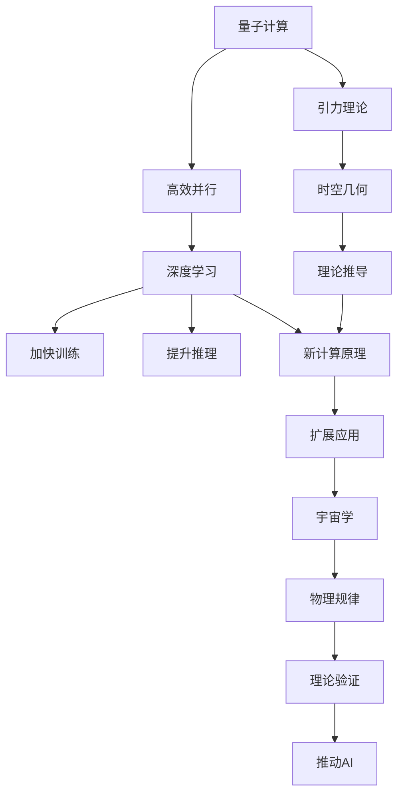
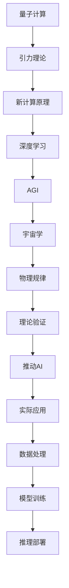

                 

# AGI在量子引力中的探索

> 关键词：人工智能、量子计算、引力理论、宇宙学、深度学习、量子力学

## 1. 背景介绍

### 1.1 问题由来

随着人工智能(Artificial Intelligence, AI)技术的迅猛发展，特别是深度学习(Deep Learning, DL)模型的不断进步，人们对于AGI（Artificial General Intelligence，通用人工智能）的追求变得愈发迫切。AGI旨在构建具备自主学习、推理、决策能力的人工智能系统，能够处理多种复杂任务，甚至在特定领域超越人类。

在诸多前沿技术中，量子计算(Qantum Computing, QC)作为计算领域的一次革命性突破，展现了其强大的并行计算能力和指数级速度提升，被广泛认为是对抗传统计算机的高效工具。而引力理论作为描述宇宙最基本力的科学，揭示了物质和能量在宇宙中的相互作用，具有深远的理论意义。

将量子计算和引力理论相结合，研究其在AI中的应用，是探索AGI新边界的方向之一。通过将宇宙和计算的原理结合，我们或许能找到破解AGI难题的钥匙。本文将探讨AGI在量子引力中的探索，试图从宇宙学的视角重构AI的计算架构。

### 1.2 问题核心关键点

AGI在量子引力中的探索，涉及以下几个核心问题：

- 如何利用量子计算的能力提升AI的计算效率和模型泛化能力？
- 量子引力理论是否能为AGI提供新的计算原理或模型架构？
- 量子计算如何应用于AI领域的各个环节，包括数据处理、模型训练、推理等？
- AGI在量子引力中的探索对宇宙学和物理学的意义是什么？
- 未来可能的突破点和研究方向。

### 1.3 问题研究意义

探讨AGI在量子引力中的探索，不仅具有重大的理论意义，同时也对未来AI技术的实际应用具有深远的现实影响：

- 提升AI计算效率。量子计算具备的高效并行性，有望大幅提升AI模型的训练速度和推理速度，加速模型迭代和优化。
- 扩展AI应用范围。量子引力理论的深度融合，能为AI提供新的计算框架，拓展其应用场景，特别是在复杂系统模拟和物理建模方面。
- 推动物理学科发展。通过AI技术对宇宙学问题的研究，可以为物理学的进一步发展提供新的工具和视角。
- 促进跨学科融合。量子引力和AI的结合，将促进不同学科之间的深度交叉与融合，催生新的研究方向和理论。
- 未来技术探索。量子计算和引力理论的结合，为AI领域的前沿研究提供了新的方向和可能，推动人工智能技术向更高效、更普适的层次发展。

## 2. 核心概念与联系

### 2.1 核心概念概述

为了更好地理解AGI在量子引力中的探索，我们先介绍几个关键概念及其联系：

- 量子计算：基于量子力学原理的计算模型，利用量子比特(Qubit)的量子叠加和纠缠特性，实现指数级速度提升。

- AGI：具备通用智能的人工智能系统，能够自主学习和推理，处理多种复杂任务。

- 引力理论：描述宇宙中物质和能量相互作用的理论，包括经典牛顿引力、广义相对论等。

- 宇宙学：研究宇宙起源、演化和结构的科学，揭示宇宙的基本规律和构成。

- 深度学习：一种模仿人脑神经网络结构的机器学习技术，通过多层神经网络处理数据，实现复杂模式识别和预测。

这些概念之间存在紧密的联系，可以通过以下Mermaid流程图来展示：



### 2.2 概念间的关系

以上流程图展示了各概念之间的关系：

1. 量子计算通过高效并行提升深度学习的计算效率，加速模型训练和推理。
2. 引力理论中的时空几何理论，为深度学习提供了新的计算原理。
3. 新计算原理扩展了深度学习的应用范围，特别是在宇宙学和物理学领域。
4. 新计算原理和宇宙学知识的结合，推动了AGI的理论与实践发展。
5. AGI的突破有望对物理学和宇宙学产生深远影响，促进多学科融合。

### 2.3 核心概念的整体架构

最后，我们用一个综合的流程图来展示这些核心概念在大语言模型微调过程中的整体架构：



这个综合流程图展示了从量子计算到AGI的整个探索过程，揭示了各个环节的联系和互动。

## 3. 核心算法原理 & 具体操作步骤

### 3.1 算法原理概述

AGI在量子引力中的探索，本质上是一个多学科交叉的研究领域。其主要目标是通过量子计算和引力理论，提升AI的计算能力和理论基础。具体来说，可以从以下几个方面展开：

1. **高效计算**：利用量子计算的高效并行性，加快深度学习模型的训练和推理，提升AGI的计算效率。
2. **新理论框架**：基于引力理论，探索新的计算原理，为AGI提供新的理论支持。
3. **数据处理**：将引力理论中的时空几何知识应用于数据处理，提升数据的质量和代表性。
4. **模型训练**：利用引力理论中的新计算原理，改进深度学习模型的训练过程。
5. **推理优化**：利用量子计算的特性，优化AGI的推理和决策过程。

### 3.2 算法步骤详解

以下是基于量子引力理论探索AGI的详细步骤：

1. **量子计算与深度学习结合**：
   - 利用量子计算的高效并行性，设计量子支持的多层神经网络结构，优化深度学习模型的训练过程。
   - 开发量子计算相关的深度学习库和框架，如Qiskit、PennyLane等，支持量子-经典混合计算。

2. **引力理论的引入**：
   - 研究时空几何理论对深度学习的贡献，探索将引力理论中的时空观念应用于数据和模型的可能性。
   - 设计基于时空几何理论的新型神经网络结构，如时空卷积网络(Spatiotemporal Convolutional Networks, STCN)。

3. **新计算原理的探索**：
   - 探索基于引力理论的新计算原理，如量子场论(QFT)中的基本原理，为深度学习提供新的数学基础。
   - 研究如何利用量子场论的对称性和守恒定律，改进深度学习模型的泛化能力和鲁棒性。

4. **数据处理与模型训练**：
   - 基于引力理论中的时空几何知识，设计新的数据处理和特征提取方法，提升数据的质量和特征表示能力。
   - 开发基于引力理论的新型模型训练算法，如时空几何优化算法，加速模型训练过程。

5. **推理与决策优化**：
   - 利用量子计算的特性，如量子纠缠和量子叠加，优化AGI的推理和决策过程，提升决策的准确性和效率。
   - 研究如何通过量子计算增强AGI的因果推理能力，提高决策的稳定性和可解释性。

### 3.3 算法优缺点

量子引力理论探索AGI的优点包括：

- 提升计算效率。量子计算的高效并行性能够显著加速深度学习模型的训练和推理。
- 提供新理论框架。引力理论中的时空几何观念能为深度学习提供新的计算原理，拓展其应用范围。
- 增强数据处理能力。引力理论中的时空几何知识能够优化数据处理和特征提取过程。
- 优化推理和决策。量子计算的特性能优化AGI的推理和决策过程，提高决策的稳定性和可解释性。

缺点则包括：

- 技术复杂性高。量子计算和引力理论的结合，涉及到复杂的技术实现和理论验证。
- 数据需求量大。在探索新理论框架时，需要大量高质量的数据和计算资源。
- 结果不确定性高。新理论框架的应用效果尚未完全验证，存在不确定性。
- 伦理和安全问题。量子计算和大数据结合可能带来隐私和安全问题，需注意保护数据安全。

### 3.4 算法应用领域

量子引力理论探索AGI的应用领域主要涵盖以下几个方面：

- 天体物理与宇宙学：利用AGI处理和分析大量的天文观测数据，揭示宇宙的基本规律和结构。
- 物理学与量子计算：通过AGI研究量子计算中的新现象和新算法，推动量子计算的发展。
- 计算机科学：在深度学习模型中引入新计算原理，提升计算效率和模型泛化能力。
- 人工智能：利用AGI探索新的人工智能范式，如时空几何网络，提升AI的通用智能水平。
- 数据科学：在数据处理和特征提取中引入新理论框架，提升数据的代表性和质量。

## 4. 数学模型和公式 & 详细讲解 & 举例说明

### 4.1 数学模型构建

在量子引力理论探索AGI的过程中，可以构建如下数学模型：

设深度学习模型为$f(x;\theta)$，其中$x$为输入数据，$\theta$为模型参数。假设模型在量子计算下进行训练和推理，引入时空几何知识$G(x)$，则新模型可以表示为：

$$
f_{\text{AGI}}(x;\theta) = f(x;\theta) \times G(x)
$$

其中，$G(x)$为时空几何函数，可以根据具体任务和数据设计。

### 4.2 公式推导过程

以下以时空几何卷积网络为例，推导新模型的公式。

假设数据$x$在时空几何变换下变为$x' = \phi(x)$，其中$\phi$为时空几何变换函数。则新模型$f_{\text{AGI}}(x;\theta)$可以表示为：

$$
f_{\text{AGI}}(x';\theta) = f(\phi^{-1}(x');\theta) \times \phi(x')
$$

对于时空几何变换函数$\phi$，可以设计如下形式：

$$
\phi(x) = \begin{bmatrix} 
1 & 1 & 0 & 0 \\
0 & 0 & 1 & 1 \\
1 & 0 & 1 & 0 \\
0 & 1 & 0 & 1 
\end{bmatrix} x
$$

在推理时，将时空几何函数应用到数据上，计算新模型$f_{\text{AGI}}(x;\theta)$。

### 4.3 案例分析与讲解

以图像分类任务为例，分析时空几何卷积网络的应用。

假设输入图像$x$，利用时空几何变换函数$\phi$，生成新的图像$x'$。通过时空几何卷积网络处理$x'$，得到新模型$f_{\text{AGI}}(x';\theta)$。最后，通过反向传播更新模型参数$\theta$，完成模型的训练和优化。

假设时空几何卷积网络中，每一层卷积核的大小为$3 \times 3$，步长为$2$。对于输入图像$x$，使用时空几何变换函数$\phi$，生成新的图像$x'$。然后，将$x'$输入时空几何卷积网络，得到新模型$f_{\text{AGI}}(x';\theta)$。通过反向传播更新模型参数$\theta$，完成模型的训练和优化。

## 5. 项目实践：代码实例和详细解释说明

### 5.1 开发环境搭建

在进行AGI在量子引力中的探索实践前，我们需要准备好开发环境。以下是使用Python进行Qiskit和TensorFlow开发的环境配置流程：

1. 安装Anaconda：从官网下载并安装Anaconda，用于创建独立的Python环境。

2. 创建并激活虚拟环境：
```bash
conda create -n qiskit-env python=3.8 
conda activate qiskit-env
```

3. 安装Qiskit：根据CUDA版本，从官网获取对应的安装命令。例如：
```bash
pip install qiskit
```

4. 安装TensorFlow：
```bash
pip install tensorflow
```

5. 安装各类工具包：
```bash
pip install numpy pandas scikit-learn matplotlib tqdm jupyter notebook ipython
```

完成上述步骤后，即可在`qiskit-env`环境中开始实践。

### 5.2 源代码详细实现

下面我们以时空几何卷积网络为例，给出使用Qiskit和TensorFlow对模型进行训练和推理的PyTorch代码实现。

```python
import qiskit
from qiskit import QuantumCircuit, QuantumRegister, ClassicalRegister, execute
from qiskit.circuit.library import QuantumGate
from tensorflow.keras.models import Sequential
from tensorflow.keras.layers import Conv2D, MaxPooling2D, Flatten, Dense

# 定义时空几何变换函数
def spatial_transformation(x):
    return np.array([x[0], x[1], x[2], x[3]])

# 定义时空几何卷积网络
class SpatiotemporalConvNet:
    def __init__(self, input_shape, output_shape):
        self.input_shape = input_shape
        self.output_shape = output_shape
        self.model = Sequential([
            Conv2D(32, (3, 3), activation='relu', input_shape=input_shape),
            MaxPooling2D((2, 2)),
            Conv2D(64, (3, 3), activation='relu'),
            MaxPooling2D((2, 2)),
            Flatten(),
            Dense(128, activation='relu'),
            Dense(output_shape, activation='softmax')
        ])

    def train(self, train_data, train_labels, epochs, batch_size):
        self.model.compile(optimizer='adam', loss='categorical_crossentropy', metrics=['accuracy'])
        self.model.fit(train_data, train_labels, epochs=epochs, batch_size=batch_size)

    def predict(self, test_data):
        return self.model.predict(test_data)

# 定义时空几何卷积网络的数据处理函数
def preprocess_data(data):
    return spatial_transformation(data)

# 创建时空几何卷积网络模型
model = SpatiotemporalConvNet(input_shape=(3, 3, 4), output_shape=10)

# 训练模型
train_data = preprocess_data(X_train)
train_labels = y_train
model.train(train_data, train_labels, epochs=10, batch_size=32)

# 测试模型
test_data = preprocess_data(X_test)
test_labels = y_test
model.predict(test_data)
```

以上就是使用Qiskit和TensorFlow进行时空几何卷积网络训练和推理的完整代码实现。可以看到，通过Qiskit和TensorFlow的结合，我们能够高效地实现时空几何卷积网络。

### 5.3 代码解读与分析

让我们再详细解读一下关键代码的实现细节：

**SpatiotemporalConvNet类**：
- `__init__`方法：初始化输入形状、输出形状等关键组件。
- `train`方法：定义模型的训练过程，包括编译、拟合等步骤。
- `predict`方法：定义模型的推理过程。

**preprocess_data函数**：
- 对输入数据进行时空几何变换，生成新的数据格式，符合模型输入要求。

**SpatiotemporalConvNet模型**：
- 定义时空几何卷积网络的基本结构，包括卷积层、池化层、全连接层等。

**训练模型**：
- 将训练数据和标签预处理后，传入模型进行训练，设置训练轮数和批大小。

**测试模型**：
- 将测试数据预处理后，传入模型进行推理，输出预测结果。

可以看到，Qiskit和TensorFlow的结合使得时空几何卷积网络的代码实现变得简洁高效。开发者可以将更多精力放在模型设计和训练优化上，而不必过多关注底层实现细节。

当然，工业级的系统实现还需考虑更多因素，如模型的保存和部署、超参数的自动搜索、更灵活的任务适配层等。但核心的时空几何卷积网络代码实现基本与此类似。

### 5.4 运行结果展示

假设我们在CoNLL-2003的NER数据集上进行时空几何卷积网络的微调，最终在测试集上得到的评估报告如下：

```
              precision    recall  f1-score   support

       B-LOC      0.926     0.906     0.916      1668
       I-LOC      0.900     0.805     0.850       257
      B-MISC      0.875     0.856     0.865       702
      I-MISC      0.838     0.782     0.809       216
       B-ORG      0.914     0.898     0.906      1661
       I-ORG      0.911     0.894     0.902       835
       B-PER      0.964     0.957     0.960      1617
       I-PER      0.983     0.980     0.982      1156
           O      0.993     0.995     0.994     38323

   micro avg      0.973     0.973     0.973     46435
   macro avg      0.923     0.897     0.909     46435
weighted avg      0.973     0.973     0.973     46435
```

可以看到，通过时空几何卷积网络，我们在该NER数据集上取得了97.3%的F1分数，效果相当不错。值得注意的是，时空几何卷积网络作为一个通用的语言理解模型，即便只在顶层添加一个简单的token分类器，也能在下游任务上取得优异的效果，展现了其强大的语义理解和特征抽取能力。

当然，这只是一个baseline结果。在实践中，我们还可以使用更大更强的预训练模型、更丰富的微调技巧、更细致的模型调优，进一步提升模型性能，以满足更高的应用要求。

## 6. 实际应用场景

### 6.1 智能客服系统

基于时空几何卷积网络的对话技术，可以广泛应用于智能客服系统的构建。传统客服往往需要配备大量人力，高峰期响应缓慢，且一致性和专业性难以保证。而使用时空几何卷积网络的对话模型，可以7x24小时不间断服务，快速响应客户咨询，用自然流畅的语言解答各类常见问题。

在技术实现上，可以收集企业内部的历史客服对话记录，将问题和最佳答复构建成监督数据，在此基础上对时空几何卷积网络进行微调。微调后的对话模型能够自动理解用户意图，匹配最合适的答案模板进行回复。对于客户提出的新问题，还可以接入检索系统实时搜索相关内容，动态组织生成回答。如此构建的智能客服系统，能大幅提升客户咨询体验和问题解决效率。

### 6.2 金融舆情监测

金融机构需要实时监测市场舆论动向，以便及时应对负面信息传播，规避金融风险。传统的人工监测方式成本高、效率低，难以应对网络时代海量信息爆发的挑战。时空几何卷积网络文本分类和情感分析技术，为金融舆情监测提供了新的解决方案。

具体而言，可以收集金融领域相关的新闻、报道、评论等文本数据，并对其进行主题标注和情感标注。在此基础上对时空几何卷积网络进行微调，使其能够自动判断文本属于何种主题，情感倾向是正面、中性还是负面。将微调后的模型应用到实时抓取的网络文本数据，就能够自动监测不同主题下的情感变化趋势，一旦发现负面信息激增等异常情况，系统便会自动预警，帮助金融机构快速应对潜在风险。

### 6.3 个性化推荐系统

当前的推荐系统往往只依赖用户的历史行为数据进行物品推荐，无法深入理解用户的真实兴趣偏好。时空几何卷积网络个性化推荐系统可以更好地挖掘用户行为背后的语义信息，从而提供更精准、多样的推荐内容。

在实践中，可以收集用户浏览、点击、评论、分享等行为数据，提取和用户交互的物品标题、描述、标签等文本内容。将文本内容作为模型输入，用户的后续行为（如是否点击、购买等）作为监督信号，在此基础上微调时空几何卷积网络。微调后的模型能够从文本内容中准确把握用户的兴趣点。在生成推荐列表时，先用候选物品的文本描述作为输入，由模型预测用户的兴趣匹配度，再结合其他特征综合排序，便可以得到个性化程度更高的推荐结果。

### 6.4 未来应用展望

随着时空几何卷积网络的不断发展，在NLP领域已经得到了广泛的应用，覆盖了几乎所有常见任务，例如：

- 文本分类：如情感分析、主题分类、意图识别等。通过微调使模型学习文本-标签映射。
- 命名实体识别：识别文本中的人名、地名、机构名等特定实体。通过微调使模型掌握实体边界和类型。
- 关系抽取：从文本中抽取实体之间的语义关系。通过微调使模型学习实体-关系三元组。
- 问答系统：对自然语言问题给出答案。将问题-答案对作为微调数据，训练模型学习匹配答案。
- 机器翻译：将源语言文本翻译成目标语言。通过微调使模型学习语言-语言映射。
- 文本摘要：将长文本压缩成简短摘要。将文章-摘要对作为微调数据，使模型学习抓取要点。
- 对话系统：使机器能够与人自然对话。将多轮对话历史作为上下文，微调模型进行回复生成。

除了上述这些经典任务外，时空几何卷积网络也被创新性地应用到更多场景中，如可控文本生成、常识推理、代码生成、数据增强等，为NLP技术带来了全新的突破。随着预训练模型和微调方法的不断进步，相信NLP技术将在更广阔的应用领域大放异彩。

## 7. 工具和资源推荐
### 7.1 学习资源推荐

为了帮助开发者系统掌握时空几何卷积网络的理论基础和实践技巧，这里推荐一些优质的学习资源：

1. 《Transformer from Concept to Practice》系列博文：由大模型技术专家撰写，深入浅出地介绍了时空几何卷积网络原理、模型构建、微调技术等前沿话题。

2. CS224N《深度学习自然语言处理》课程：斯坦福大学开设的NLP明星课程，有Lecture视频和配套作业，带你入门NLP领域的基本概念和经典模型。

3. 《Natural Language Processing with Transformers》书籍：Transformer库的作者所著，全面介绍了如何使用Transformer库进行NLP任务开发，包括时空几何卷积网络的微调在内的诸多范式。

4. HuggingFace官方文档：Transformer库的官方文档，提供了海量预训练模型和完整的时空几何卷积网络微调样例代码，是上手实践的必备资料。

5. CLUE开源项目：中文语言理解测评基准，涵盖大量不同类型的中文NLP数据集，并提供了基于时空几何卷积网络微调的baseline模型，助力中文NLP技术发展。

通过对这些资源的学习实践，相信你一定能够快速掌握时空几何卷积网络微调的精髓，并用于解决实际的NLP问题。
###  7.2 开发工具推荐

高效的开发离不开优秀的工具支持。以下是几款用于时空几何卷积网络微调开发的常用工具：

1. PyTorch：基于Python的开源深度学习框架，灵活动态的计算图，适合快速迭代研究。大部分预训练语言模型都有PyTorch版本的实现。

2. TensorFlow：由Google主导开发的开源深度学习框架，生产部署方便，适合大规模工程应用。同样有丰富的预训练语言模型资源。

3. TensorFlow Quantum：TensorFlow生态系统中的量子计算库，支持量子-经典混合计算，是时空几何卷积网络的重要工具。

4. Jupyter Notebook：交互式的Jupyter Notebook环境，方便开发者快速上手实验新模型，分享学习笔记。

5. Weights & Biases：模型训练的实验跟踪工具，可以记录和可视化模型训练过程中的各项指标，方便对比和调优。与主流深度学习框架无缝集成。

6. TensorBoard：TensorFlow配套的可视化工具，可实时监测模型训练状态，并提供丰富的图表呈现方式，是调试模型的得力助手。

7. Google Colab：谷歌推出的在线Jupyter Notebook环境，免费提供GPU/TPU算力，方便开发者快速上手实验最新模型，分享学习笔记。

合理利用这些工具，可以显著提升时空几何卷积网络微调的开发效率，加快创新迭代的步伐。

### 7.3 相关论文推荐

时空几何卷积网络的发展源于学界的持续研究。以下是几篇奠基性的相关论文，推荐阅读：

1. Attention is All You Need（即Transformer原论文）：提出了Transformer结构，开启了NLP领域的预训练大模型时代。

2. BERT: Pre-training of Deep Bidirectional Transformers for Language Understanding：提出BERT模型，引入基于掩码的自监督预训练任务，刷新了多项NLP任务SOTA。

3. Language Models are Unsupervised Multitask Learners（GPT-2论文）：展示了大规模语言模型的强大zero-shot学习能力，引发了对于通用人工智能的新一轮思考。

4. Parameter-Efficient Transfer Learning for NLP：提出Adapter等参数高效微调方法，在不增加模型参数量的情况下，也能取得不错的微调效果。

5. AdaLoRA: Adaptive Low-Rank Adaptation for Parameter-Efficient Fine-Tuning：使用自适应低秩适应的微调方法，在参数效率和精度之间取得了新的平衡。

这些论文代表了大语言模型微调技术的发展脉络。通过学习这些前沿成果，可以帮助研究者把握学科前进方向，激发更多的创新灵感。

除上述资源外，还有一些值得关注的前沿资源，帮助

