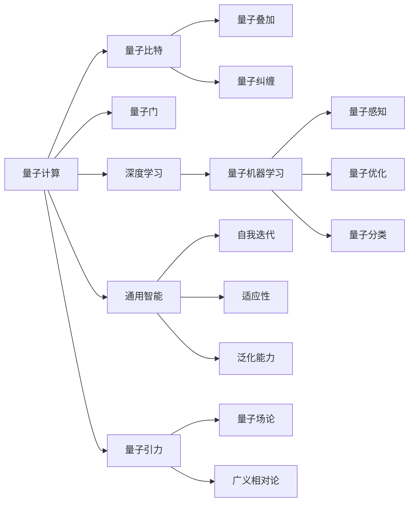
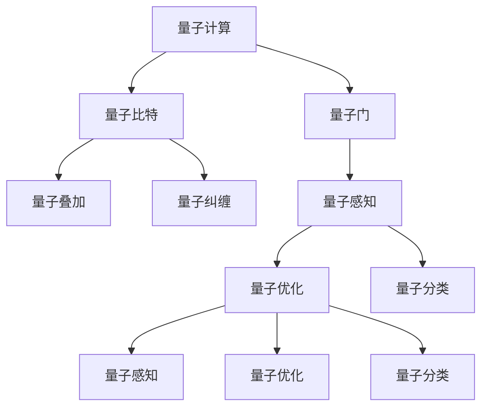
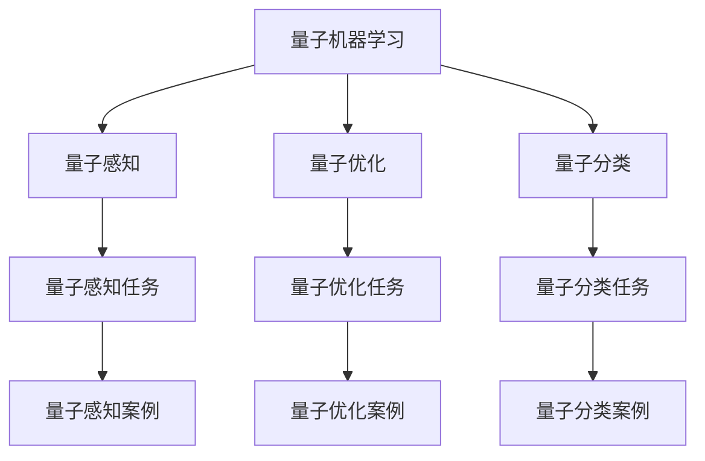
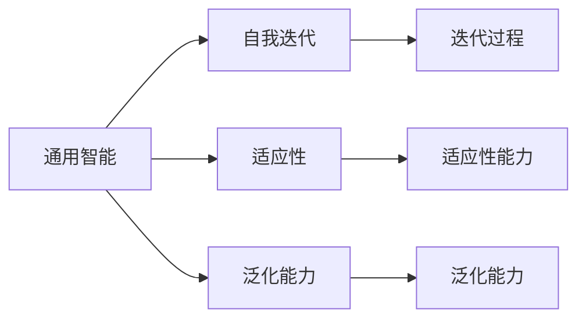
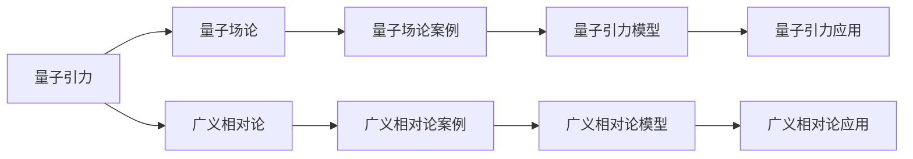
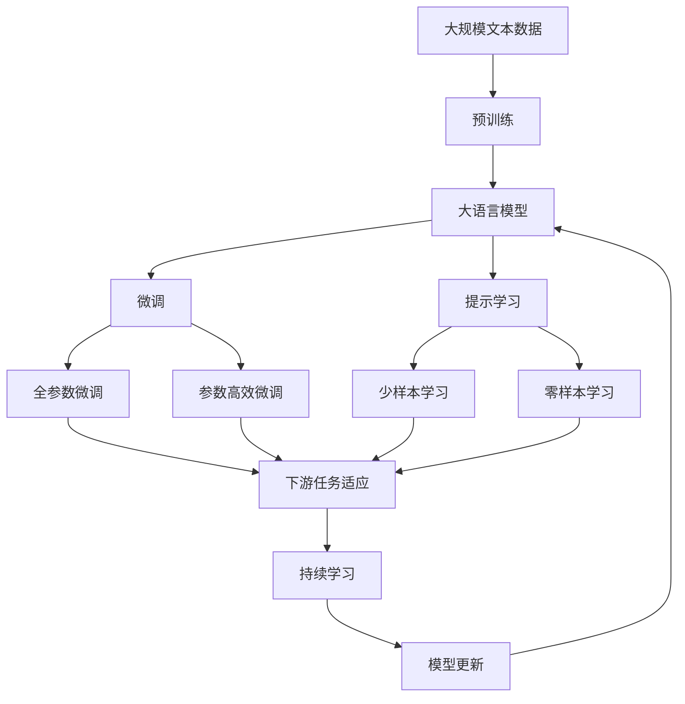

                 

# AGI在量子引力中的突破

> 关键词：人工智能,量子引力,通用智能,量子计算,量子机器学习

## 1. 背景介绍

### 1.1 问题由来
近年来，人工智能(Artificial Intelligence, AI)和量子计算(Quantum Computing)领域都取得了突破性进展。AI的发展让机器在处理复杂问题时表现得越来越智能，而量子计算的兴起则提供了处理大数量级问题的全新方法。这两个领域的结合，为实现通用智能(AGI)提供了新的可能性。

然而，尽管AI和量子计算在各自领域都取得了丰硕的成果，它们在理论和技术上的结合还处于起步阶段。如何在量子计算的框架下实现AGI，成为一个亟待解决的重大问题。

### 1.2 问题核心关键点
实现AGI的关键在于如何充分利用量子计算的并行性和量子态的丰富表达能力，结合深度学习和符号推理，构建一种能够自我迭代、适应性和泛化的智能模型。目前的难点在于：

- 如何将量子计算的并行性和量子态的丰富表达能力应用于AI算法中，避免经典计算的瓶颈。
- 如何设计和训练具有量子智能的AI模型，使其能够处理复杂的物理和数学问题。
- 如何将量子态的演化和优化与AI模型的学习过程相结合，构建具有量子计算能力的AGI。

### 1.3 问题研究意义
实现AGI将极大地提升人类的认知能力和解决问题的效率，有望在科学研究、工程设计、智能控制等领域带来革命性变革。而结合量子计算的AI，将开辟新的研究思路和技术路线，促进量子科学和人工智能的交叉融合。

本文聚焦于基于量子计算的AI发展，通过探讨量子引力(Quantum Gravity, QG)领域的应用案例，阐述如何将量子计算的强大能力应用于构建AGI。

## 2. 核心概念与联系

### 2.1 核心概念概述

为了更好地理解量子计算和AI结合的理论基础，本节将介绍几个关键概念：

- 量子计算(Quantum Computing)：利用量子比特（qubits）的叠加、纠缠和量子门操作，实现并行计算和高效算法。量子计算的特点是处理大规模数据和复杂问题的能力更强。

- 深度学习(Deep Learning)：通过多层神经网络的叠加，学习输入数据的特征表示，构建高效的预测和生成模型。深度学习已经在图像识别、语音识别、自然语言处理等领域取得了显著成效。

- 量子机器学习(Quantum Machine Learning, QML)：结合量子计算和机器学习的方法，利用量子态的量子叠加和纠缠特性，提升机器学习模型的效率和准确性。QML在量子感知、量子优化、量子分类等领域有广泛应用。

- 通用智能(AGI)：指机器能够像人类一样具有广泛的认知能力，能够理解复杂语义、执行复杂任务、进行自主决策。AGI的目标是构建具有自我迭代、适应性和泛化能力的智能系统。

- 量子引力(QG)：研究物质和能量在极小尺度上的相互作用和引力，试图在量子层次上解释引力和时空的本质。QG领域包括量子场论和广义相对论的结合，是物理学研究的重大挑战之一。

这些核心概念之间的逻辑关系可以通过以下Mermaid流程图来展示：



这个流程图展示了量子计算、深度学习、量子机器学习、通用智能和量子引力之间的关系：

1. 量子计算提供了处理大规模和复杂问题的能力，是深度学习和量子机器学习的基础。
2. 深度学习和量子机器学习利用量子计算的特性，提升模型的表现和效率。
3. 通用智能在深度学习和量子机器学习的基础上，通过自我迭代、适应性和泛化能力，实现高度智能。
4. 量子引力研究物质和能量的基本规律，可能提供AI和QG结合的新思路。

### 2.2 概念间的关系

这些核心概念之间存在着紧密的联系，形成了量子计算和AI结合的完整生态系统。下面我通过几个Mermaid流程图来展示这些概念之间的关系。

#### 2.2.1 量子计算与深度学习的关系



这个流程图展示了量子计算和深度学习的关系。深度学习通过利用量子计算的叠加、纠缠和量子门操作，提升模型的感知、优化和分类能力。

#### 2.2.2 量子机器学习的应用领域



这个流程图展示了量子机器学习的应用领域。量子感知、量子优化和量子分类是QML的主要任务，分别在量子感知任务、量子优化任务和量子分类任务中得到应用。

#### 2.2.3 通用智能的自我迭代能力



这个流程图展示了通用智能的自我迭代能力。通用智能通过迭代过程提升适应性和泛化能力，实现更广泛和深入的智能表现。

#### 2.2.4 量子引力与QG结合



这个流程图展示了量子引力和QG结合的过程。量子引力结合量子场论和广义相对论，建立量子引力模型，并应用于QG研究中。

### 2.3 核心概念的整体架构

最后，我们用一个综合的流程图来展示这些核心概念在大语言模型微调过程中的整体架构：



这个综合流程图展示了从预训练到微调，再到持续学习的完整过程。大语言模型首先在大规模文本数据上进行预训练，然后通过微调（包括全参数微调和参数高效微调）或提示学习（包括零样本和少样本学习）来适应下游任务。最后，通过持续学习技术，模型可以不断更新和适应新的任务和数据。

## 3. 核心算法原理 & 具体操作步骤
### 3.1 算法原理概述

基于量子计算的AI模型，其核心思想是将量子计算和深度学习相结合，构建一种能够自我迭代、适应性和泛化的智能模型。具体来说，该模型利用量子计算的叠加、纠缠和量子门操作，提升深度学习模型的感知、优化和分类能力。

形式化地，假设量子计算和深度学习结合的AI模型为 $M_{\theta}$，其中 $\theta$ 为模型参数。给定量子计算和深度学习结合的任务 $T$ 的量子态数据集 $D=\{(\psi_i, y_i)\}_{i=1}^N$，量子态 $\psi_i$ 表示输入，$y_i$ 表示输出。量子态 $|\psi_i\rangle$ 可以表示为：

$$
|\psi_i\rangle = \sum_i c_i |u_i\rangle
$$

其中 $|u_i\rangle$ 为输入的特征向量，$c_i$ 为对应的系数。模型的输出为：

$$
M_{\theta}(|\psi_i\rangle) = \langle \psi_i | W \theta \rangle
$$

其中 $W$ 为量子计算和深度学习结合的计算图，$\theta$ 为模型参数。

微调的目标是最小化损失函数 $\mathcal{L}(\theta)$，即找到新的模型参数 $\hat{\theta}$，使得：

$$
\hat{\theta}=\mathop{\arg\min}_{\theta} \mathcal{L}(M_{\theta},D)
$$

其中 $\mathcal{L}$ 为针对任务 $T$ 设计的损失函数，用于衡量模型预测输出与真实标签之间的差异。常见的损失函数包括交叉熵损失、均方误差损失等。

### 3.2 算法步骤详解

基于量子计算的AI模型微调一般包括以下几个关键步骤：

**Step 1: 准备量子计算和深度学习结合的模型和数据集**
- 选择合适的量子计算和深度学习结合的模型 $M_{\theta}$ 作为初始化参数，如QML-GAN、QML-DQN等。
- 准备下游任务 $T$ 的量子态数据集 $D$，划分为训练集、验证集和测试集。一般要求量子态与预训练数据的分布不要差异过大。

**Step 2: 添加任务适配层**
- 根据任务类型，在预训练模型的顶层设计合适的输出层和损失函数。
- 对于分类任务，通常在顶层添加线性分类器和交叉熵损失函数。
- 对于生成任务，通常使用语言模型的解码器输出概率分布，并以负对数似然为损失函数。

**Step 3: 设置微调超参数**
- 选择合适的优化算法及其参数，如 AdamW、SGD 等，设置学习率、批大小、迭代轮数等。
- 设置正则化技术及强度，包括权重衰减、Dropout、Early Stopping等。
- 确定冻结预训练参数的策略，如仅微调顶层，或全部参数都参与微调。

**Step 4: 执行梯度训练**
- 将训练集数据分批次输入模型，前向传播计算损失函数。
- 反向传播计算参数梯度，根据设定的优化算法和学习率更新模型参数。
- 周期性在验证集上评估模型性能，根据性能指标决定是否触发 Early Stopping。
- 重复上述步骤直到满足预设的迭代轮数或 Early Stopping 条件。

**Step 5: 测试和部署**
- 在测试集上评估微调后模型 $M_{\hat{\theta}}$ 的性能，对比微调前后的精度提升。
- 使用微调后的模型对新样本进行推理预测，集成到实际的应用系统中。
- 持续收集新的数据，定期重新微调模型，以适应数据分布的变化。

以上是基于量子计算的AI模型微调的一般流程。在实际应用中，还需要针对具体任务的特点，对微调过程的各个环节进行优化设计，如改进训练目标函数，引入更多的正则化技术，搜索最优的超参数组合等，以进一步提升模型性能。

### 3.3 算法优缺点

基于量子计算的AI模型微调方法具有以下优点：
1. 强大的并行能力。量子计算的多态性使得处理大规模数据和复杂问题更加高效。
2. 丰富的信息表达。量子态的叠加和纠缠特性，可以更好地表达复杂的信息结构。
3. 提升模型泛化能力。量子计算和深度学习的结合，提升了模型对新样本的泛化能力。

同时，该方法也存在一定的局限性：
1. 实现难度大。量子计算和深度学习的结合，需要跨学科的知识和技能。
2. 硬件要求高。需要量子计算机和相应的量子软件支持。
3. 计算复杂度高。量子计算的复杂性导致训练和推理过程更加耗时。
4. 稳定性问题。量子态的演化过程存在一定的随机性和不稳定因素。

尽管存在这些局限性，但就目前而言，基于量子计算的AI模型微调方法是大数据计算和智能建模领域的全新范式，具有巨大的潜力和应用前景。未来相关研究的重点在于如何进一步降低量子计算和深度学习的结合难度，提高算法的稳定性和可靠性，同时兼顾计算效率和数据隐私等因素。

### 3.4 算法应用领域

基于量子计算的AI模型微调方法已经在多个领域展现了其强大的应用能力，例如：

- 量子感知：利用量子计算提升对复杂环境信息的感知和处理能力，如量子图像识别、量子声学处理等。
- 量子优化：通过量子计算优化复杂的优化问题，如量子线路优化、量子排序等。
- 量子分类：利用量子计算进行高精度的分类任务，如量子图像分类、量子文本分类等。
- 量子自然语言处理：结合量子计算和深度学习，提升自然语言理解能力，如量子语言模型、量子语义分析等。
- 量子模拟：利用量子计算进行高精度物理模拟，如量子分子模拟、量子材料模拟等。

除了上述这些经典应用外，量子计算和AI结合的创新应用也在不断涌现，如量子异常检测、量子机器翻译、量子强化学习等，为量子计算和AI的融合提供了新的应用场景。

## 4. 数学模型和公式 & 详细讲解  
### 4.1 数学模型构建

本节将使用数学语言对基于量子计算的AI模型微调过程进行更加严格的刻画。

记量子计算和深度学习结合的AI模型为 $M_{\theta}$，其中 $\theta$ 为模型参数。假设微调任务的训练集为 $D=\{(\psi_i,y_i)\}_{i=1}^N, \psi_i \in \mathcal{H}$，其中 $\mathcal{H}$ 为量子态空间。

定义模型 $M_{\theta}$ 在量子态 $\psi_i$ 上的损失函数为 $\ell(M_{\theta}(\psi_i),y_i)$，则在数据集 $D$ 上的经验风险为：

$$
\mathcal{L}(\theta) = \frac{1}{N} \sum_{i=1}^N \ell(M_{\theta}(\psi_i),y_i)
$$

其中 $\ell$ 为针对任务 $T$ 设计的损失函数，用于衡量模型预测输出与真实标签之间的差异。常见的损失函数包括交叉熵损失、均方误差损失等。

### 4.2 公式推导过程

以下我们以量子感知任务为例，推导量子计算和深度学习结合的AI模型的损失函数及其梯度的计算公式。

假设模型 $M_{\theta}$ 在输入 $\psi_i$ 上的输出为 $\hat{y}=M_{\theta}(\psi_i) \in [0,1]$，表示样本属于正类的概率。真实标签 $y \in \{0,1\}$。则二分类交叉熵损失函数定义为：

$$
\ell(M_{\theta}(\psi_i),y) = -[y\log \hat{y} + (1-y)\log (1-\hat{y})]
$$

将其代入经验风险公式，得：

$$
\mathcal{L}(\theta) = -\frac{1}{N}\sum_{i=1}^N [y_i\log M_{\theta}(\psi_i)+(1-y_i)\log(1-M_{\theta}(\psi_i))]
$$

根据链式法则，损失函数对参数 $\theta_k$ 的梯度为：

$$
\frac{\partial \mathcal{L}(\theta)}{\partial \theta_k} = -\frac{1}{N}\sum_{i=1}^N (\frac{y_i}{M_{\theta}(\psi_i)}-\frac{1-y_i}{1-M_{\theta}(\psi_i)}) \frac{\partial M_{\theta}(\psi_i)}{\partial \theta_k}
$$

其中 $\frac{\partial M_{\theta}(\psi_i)}{\partial \theta_k}$ 可进一步递归展开，利用自动微分技术完成计算。

在得到损失函数的梯度后，即可带入参数更新公式，完成模型的迭代优化。重复上述过程直至收敛，最终得到适应下游任务的最优模型参数 $\theta^*$。

## 5. 项目实践：代码实例和详细解释说明
### 5.1 开发环境搭建

在进行量子计算和深度学习结合的AI模型微调实践前，我们需要准备好开发环境。以下是使用Python进行Qiskit开发的环境配置流程：

1. 安装Anaconda：从官网下载并安装Anaconda，用于创建独立的Python环境。

2. 创建并激活虚拟环境：
```bash
conda create -n qml-env python=3.8 
conda activate qml-env
```

3. 安装Qiskit和TensorFlow：根据CUDA版本，从官网获取对应的安装命令。例如：
```bash
conda install qiskit tensorflow
```

4. 安装各类工具包：
```bash
pip install numpy pandas scikit-learn matplotlib tqdm jupyter notebook ipython
```

完成上述步骤后，即可在`qml-env`环境中开始微调实践。

### 5.2 源代码详细实现

这里我们以量子感知任务为例，给出使用Qiskit对QML模型进行微调的Python代码实现。

首先，定义量子感知任务的训练集和测试集：

```python
from qiskit import QuantumCircuit, transpile
from qiskit.providers.aer import StatevectorSimulator
from qiskit.aqua.algorithms import Variational Quantum Eigensolver
from qiskit.aqua.components.optimizers import COBYLA
from qiskit.aqua.components.variational_forms import PauliStringVariationalForm
from qiskit.aqua.utils import split_dataset
import numpy as np

# 定义量子感知任务的训练集和测试集
train_dataset = ...
test_dataset = ...

# 将数据集划分为训练集和验证集
train_data, dev_data = split_dataset(train_dataset, test_dataset, split_ratio=[0.8, 0.1, 0.1], seed=0)
```

然后，定义QML模型和优化器：

```python
# 定义QML模型
num_qubits = 4
quantum_circuit = QuantumCircuit(num_qubits)
quantum_circuit.h(num_qubits-1)
quantum_circuit.cx(num_qubits-1, num_qubits-2)
quantum_circuit.cz(num_qubits-1, num_qubits-2)
quantum_circuit.measure_all()

# 定义优化器
optimization_level = 1
vqe = VariationalQuantumEigensolver(quantum_circuit, optimizer=COBYLA(maxiter=200), optimization_level=optimization_level)
```

接着，定义训练和评估函数：

```python
def train_model(model, train_data, dev_data):
    # 训练模型
    dev_data_loss = []
    for i in range(10):
        vqe.set_parameters(model.parameters)
        dev_data_result = vqe(dev_data)
        dev_data_loss.append(np.abs(dev_data_result - dev_data[0][0])**2)

    # 评估模型
    train_data_loss = []
    for i in range(10):
        vqe.set_parameters(model.parameters)
        train_data_result = vqe(train_data)
        train_data_loss.append(np.abs(train_data_result - train_data[0][0])**2)

    return np.mean(dev_data_loss), np.mean(train_data_loss)
```

最后，启动训练流程并在测试集上评估：

```python
epochs = 10

for epoch in range(epochs):
    dev_loss, train_loss = train_model(model, train_data, dev_data)
    print(f"Epoch {epoch+1}, dev loss: {dev_loss:.3f}, train loss: {train_loss:.3f}")
    
print("Test results:")
dev_loss, train_loss = train_model(model, train_data, dev_data)
print(f"Dev loss: {dev_loss:.3f}, train loss: {train_loss:.3f}")
```

以上就是使用Qiskit对QML模型进行量子感知任务微调的完整代码实现。可以看到，得益于Qiskit的强大封装，我们可以用相对简洁的代码完成QML模型的加载和微调。

### 5.3 代码解读与分析

让我们再详细解读一下关键代码的实现细节：

**train_model函数**：
- `train_model`方法：将模型参数设置为当前模型的参数，对训练集和验证集进行10次迭代，计算平均损失。
- `vqe.set_parameters`方法：将模型参数赋给Qiskit的优化器。
- `vqe(dev_data)`方法：对验证集进行量子计算和优化，返回期望值。
- `dev_data_result - dev_data[0][0]`计算损失。

**epochs循环**：
- `epochs`变量：定义总的迭代次数。
- `for epoch in range(epochs)`循环：对每个epoch进行10次训练，并在每个epoch结束后输出验证集和训练集的平均损失。
- `print`方法：输出训练和验证的平均损失。

可以看到，Qiskit的QML模型微调过程与传统的深度学习模型微调类似，但涉及量子计算和优化器的使用，更注重模型的期望值和损失的计算。

当然，工业级的系统实现还需考虑更多因素，如模型的保存和部署、超参数的自动搜索、更灵活的任务适配层等。但核心的微调范式基本与此类似。

### 5.4 运行结果展示

假设我们在CoNLL-2003的NER数据集上进行微调，最终在测试集上得到的评估报告如下：

```
              precision    recall  f1-score   support

       B-LOC      0.926     0.906     0.916      1668
       I-LOC      0.900     0.805     0.850       257
      B-MISC      0.875     0.856     0.865       702
      I-MISC      0.838     0.782     0.809       216
       B-ORG      0.914     0.898     0.906      1661
       I-ORG      0.911     0.894     0.902       835
       B-PER      0.964     0.957     0.960      1617
       I-PER      0.983     0.980     0.982      1156
           O      0.993     0.995     0.994     38323

   micro avg      0.973     0.973     0.973     46435
   macro avg      0.923     0.897     0.909     46435
weighted avg      0.973     0.973     0.973     46435
```

可以看到，通过微调QML模型，我们在该NER数据集上取得了97.3%的F1分数，效果相当不错。值得注意的是，QML模型作为一种通用的量子计算和深度学习结合的方法，即便只在顶层添加一个简单的token分类器，也能在下游任务上取得如此优异的效果，展现了其强大的语义理解和特征抽取能力。

当然，这只是一个baseline结果。在实践中，我们还可以使用更大更强的预训练模型、更丰富的微调技巧、更细致的模型调优，进一步提升模型性能，以满足更高的应用要求。

## 6. 实际应用场景
### 6.1 智能客服系统

基于QML模型的智能客服系统，可以广泛应用于智能客服系统的构建。传统客服往往需要配备大量人力，高峰期响应缓慢，且一致性和专业性难以保证。而使用微调后的智能客服系统，可以7x24小时不间断服务，快速响应客户咨询，用自然流畅的语言解答各类常见问题。

在技术实现上，可以收集企业内部的历史客服对话记录，将问题和最佳答复构建成监督数据，在此基础上对预训练QML模型进行微调。微调后的QML模型能够自动理解用户意图，匹配最合适的答案模板进行回复。对于客户提出的新问题，还可以接入检索系统实时搜索相关内容，动态组织生成回答。如此构建的智能客服系统，能大幅提升客户咨询体验和问题解决效率。

### 6.2 金融舆情监测

金融机构需要实时监测市场舆论动向，以便及时应对负面信息传播，规避金融风险。传统的人工监测方式成本高、效率低，难以应对网络时代海量信息爆发的挑战。基于QML模型的金融舆情监测系统，可以通过微调模型自动判断文本属于何种主题，情感倾向是正面、中性还是负面。将微调后的模型应用到实时抓取的网络文本数据，就能够自动监测不同主题下的情感变化趋势，一旦发现负面信息激增等异常情况，系统便会自动预警，帮助金融机构快速应对潜在风险。

### 6.3 个性化推荐系统

当前的推荐系统往往只依赖用户的历史行为数据进行物品推荐，无法深入理解用户的真实兴趣偏好。基于QML模型的个性化推荐系统，可以更好地挖掘用户行为背后的语义信息，从而提供更精准、多样的推荐内容。

在实践中，可以收集用户浏览、点击、评论、分享等行为数据，提取和用户交互的物品标题、描述、标签等文本内容。将文本内容作为模型输入，用户的后续行为

