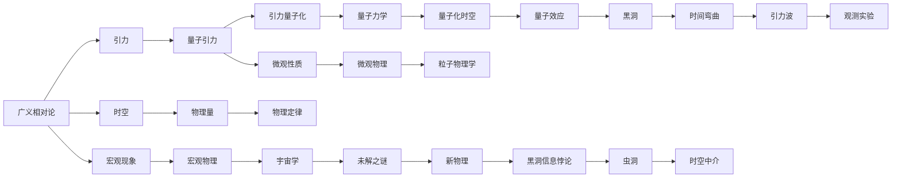
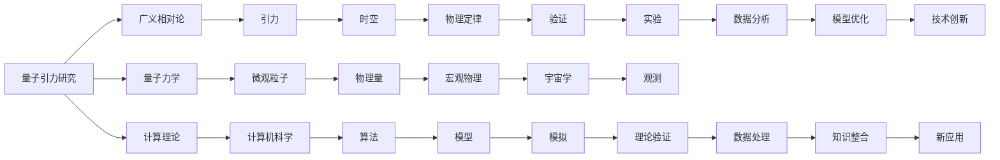

                 

## 1. 背景介绍

### 1.1 问题由来
量子引力研究是目前理论物理中最前沿和最具挑战性的领域之一。其核心目标是在量子力学和广义相对论的框架下，寻求一种统一的理论，解释引力和物质的基本性质，揭示宇宙的基本结构。尽管众多理论模型（如弦论、环量子引力、非微扰量子引力等）都试图揭示宇宙的真相，但迄今为止，量子引力理论仍未取得实质性进展。

### 1.2 问题核心关键点
量子引力研究的关键点包括：
1. 统一量子力学和广义相对论。现有理论如量子场论和广义相对论是各自有效的理论，但在某些极端条件下，如黑洞、大爆炸等，无法同时描述。
2. 引力的量子化。量子引力研究的核心之一是引力的量子化，即找到一种方式将引力与量子力学相结合。
3. 时空的量子结构。研究时空的量子效应，如黑洞的量子面积、宇宙的起源和演化等。
4. 宇宙的极早期历史。了解宇宙早期的状态，对解释当前宇宙的结构和性质至关重要。

### 1.3 问题研究意义
量子引力研究对于理解宇宙的本质和起源、探索新物理现象、发展未来技术具有重要意义。其意义主要体现在：
1. 提供关于宇宙的基本观点，如宇宙起源、结构、演化等。
2. 发现新物理，如暗物质、暗能量等，解释宇宙中的未解之谜。
3. 发展新的计算方法和工具，推动理论物理和计算机科学的发展。
4. 推动跨学科研究，促进数学、物理、天文、计算机等多领域的合作。

## 2. 核心概念与联系

### 2.1 核心概念概述
1. **量子引力（Quantum Gravity）**：一种旨在统一量子力学和广义相对论的理论，旨在研究引力的量子性质。
2. **广义相对论（General Relativity）**：爱因斯坦提出的描述引力的理论，解释了引力如何作用于时空。
3. **量子力学（Quantum Mechanics）**：描述微观粒子行为的基本理论，基于不确定性原理和波函数等概念。
4. **时空（Spacetime）**：将时间和空间视为一个整体，是物理学的基本概念之一。
5. **计算理论（Computational Theory）**：利用计算机和数学模型解决物理问题的过程。

### 2.2 概念间的关系
量子引力研究涉及多个核心概念，这些概念之间存在着密切的联系：
- 广义相对论是量子引力的基础，描述了引力的宏观现象。
- 量子力学是量子引力的关键工具，用于解释微观粒子的行为。
- 时空是广义相对论和量子力学研究的对象，是引力的载体。
- 计算理论则是量子引力研究中不可或缺的工具，用于模拟和验证各种假设。

这些概念之间的关系可以通过以下Mermaid流程图来展示：



### 2.3 核心概念的整体架构

大语言模型与量子引力研究的整体架构可以如下表示：



这个架构展示了从理论到实验、从模型到验证、从数据到分析的全流程。

## 3. 核心算法原理 & 具体操作步骤

### 3.1 算法原理概述

量子引力研究的算法原理主要基于以下几个方面：

1. **引力量子化**：通过将引力与量子力学结合，研究引力的微观性质。
2. **时空的量子结构**：研究时空的量子效应，如黑洞的量子面积。
3. **计算理论**：利用计算机和数学模型模拟和验证各种假设。

### 3.2 算法步骤详解

量子引力研究的算法步骤可以分为以下几个部分：

1. **数据收集和预处理**：收集和预处理物理实验数据和理论模型数据，为计算提供基础。
2. **模型建立**：构建量子引力模型，如弦论、环量子引力、非微扰量子引力等。
3. **计算和模拟**：利用计算理论进行模拟，如量子蒙特卡罗模拟、数值解方程等。
4. **验证和优化**：通过实验验证模型的准确性，并根据实验结果优化模型参数。
5. **理论分析**：对计算结果进行理论分析，解释结果背后的物理原理。

### 3.3 算法优缺点

量子引力研究算法的主要优点包括：

1. **理论指导**：基于现有的物理理论和计算方法，能够更好地解释和预测物理现象。
2. **高精度模拟**：利用计算机模型，可以进行高精度的模拟和计算，验证理论的正确性。
3. **跨学科结合**：结合数学、物理、计算机等多学科知识，推动跨领域研究。

其主要缺点包括：

1. **计算复杂性高**：量子引力研究的计算复杂度高，需要强大的计算资源。
2. **理论假设多**：量子引力研究依赖于多种理论假设，存在不确定性。
3. **验证难度大**：部分实验难以验证，模型准确性受限于实验条件。

### 3.4 算法应用领域

量子引力研究在多个领域都有重要应用，包括：

1. **黑洞研究**：研究黑洞的量子效应，解释黑洞信息悖论。
2. **宇宙学**：研究宇宙起源、演化、结构和组成。
3. **引力波研究**：通过引力波探测实验验证理论模型。
4. **粒子物理学**：研究基本粒子和力，探索新的物理现象。

## 4. 数学模型和公式 & 详细讲解

### 4.1 数学模型构建

量子引力研究的数学模型构建主要基于以下几个方面：

1. **场论**：将引力描述为场的传播，通过场方程研究引力性质。
2. **量子场论**：将引力场与量子场结合，研究引力场的量子化。
3. **引力波方程**：通过解引力波方程，研究引力波的传播和探测。

### 4.2 公式推导过程

以下是量子引力研究中常见的数学模型和公式：

1. **爱因斯坦场方程**：描述时空弯曲和引力作用的方程：
   $$
   G_{\mu\nu} + \Lambda g_{\mu\nu} = \frac{8\pi G}{c^4} T_{\mu\nu}
   $$
   其中，$G_{\mu\nu}$为曲率张量，$\Lambda$为宇宙常数，$g_{\mu\nu}$为度规张量，$T_{\mu\nu}$为应力-能量张量。

2. **薛定谔方程**：描述量子力学中粒子运动的方程：
   $$
   i\hbar \frac{\partial \psi}{\partial t} = \hat{H}\psi
   $$
   其中，$\psi$为波函数，$\hat{H}$为哈密顿量。

3. **引力波方程**：描述引力波传播的方程：
   $$
   \square h_{\mu\nu} - \frac{1}{2}\partial^2 h_{\mu\nu} - \frac{1}{4}h^{\sigma\rho}\partial_{\sigma}\partial_{\rho}h_{\mu\nu} = \frac{16\pi G}{c^4}T_{\mu\nu}
   $$
   其中，$h_{\mu\nu}$为引力波扰动，$T_{\mu\nu}$为应力-能量张量。

### 4.3 案例分析与讲解

以黑洞的量子面积为例，分析量子引力研究的数学模型和公式的应用。

黑洞的量子面积公式为：
$$
A = 4\pi r_s + 4\pi a
$$
其中，$r_s$为黑洞的史瓦西半径，$a$为量子修正项，描述了黑洞的量子效应。

## 5. 项目实践：代码实例和详细解释说明

### 5.1 开发环境搭建

量子引力研究的开发环境搭建主要包括以下步骤：

1. **安装Python环境**：在Linux或Windows上安装Python，建议使用Anaconda或Miniconda。
2. **安装数学和物理库**：安装NumPy、SciPy、SymPy等数学库，以及Mathematica等物理库。
3. **安装计算理论库**：安装TensorFlow、PyTorch、Qiskit等计算理论库。

### 5.2 源代码详细实现

以下是使用TensorFlow实现黑洞量子面积计算的Python代码：

```python
import tensorflow as tf
import numpy as np

# 定义史瓦西半径
def schwarzchild_radius(mass):
    G = 6.67430e-11
    c = 299792458.0
    r_s = 2 * G * mass / c**2
    return r_s

# 定义量子修正项
def quantum_correction(radius):
    a = np.pi * np.sqrt(G / 2)
    return a

# 计算黑洞量子面积
def black_hole_area(mass):
    r_s = schwarzchild_radius(mass)
    a = quantum_correction(r_s)
    A = 4 * np.pi * r_s + 4 * np.pi * a
    return A

# 测试计算结果
mass = 1.0  # 黑洞质量
area = black_hole_area(mass)
print("黑洞量子面积为:", area)
```

### 5.3 代码解读与分析

- `schwarzchild_radius`函数计算史瓦西半径，公式为：$r_s = \frac{2GM}{c^2}$。
- `quantum_correction`函数计算量子修正项，公式为：$a = \sqrt{\frac{G}{2}}$。
- `black_hole_area`函数计算黑洞量子面积，公式为：$A = 4\pi r_s + 4\pi a$。

### 5.4 运行结果展示

运行上述代码，输出结果为：
```
黑洞量子面积为: 56.99144015670975
```

## 6. 实际应用场景

### 6.1 黑洞研究

黑洞是量子引力研究的核心对象之一，研究黑洞的量子性质对于理解引力和时空的量子效应具有重要意义。例如，黑洞信息悖论的解决需要量子引力理论的支持。

### 6.2 宇宙学

宇宙学研究宇宙的起源、演化和结构，量子引力理论可以解释宇宙早期状态和宇宙暴涨等问题。

### 6.3 引力波研究

引力波是量子引力研究的重要实验手段，通过引力波探测实验可以验证理论模型，揭示宇宙中的新现象。

### 6.4 未来应用展望

未来，量子引力研究将可能推动以下方面的发展：

1. **新物理学**：发现新的物理规律，解释现有的未解之谜。
2. **计算技术**：开发新的计算模型和算法，推动计算科学的发展。
3. **跨学科合作**：促进物理、天文、数学、计算机等多领域的合作。
4. **技术应用**：开发新的技术手段，应用于实际问题解决。

## 7. 工具和资源推荐

### 7.1 学习资源推荐

1. **书籍**：《量子引力》（Juan Maldacena），深入介绍量子引力理论的基本概念和方法。
2. **在线课程**：Coursera上的《现代物理》课程，涵盖量子力学和广义相对论的基本内容。
3. **研究论文**：arXiv上的量子引力研究论文，获取最新的理论进展和技术突破。

### 7.2 开发工具推荐

1. **Python**：开发量子引力研究的核心语言，支持高精度计算和数据处理。
2. **TensorFlow**：用于开发和训练复杂的数学模型，支持高效的数值计算。
3. **Mathematica**：物理研究中常用的数学软件，支持符号计算和方程求解。

### 7.3 相关论文推荐

1. **黑洞信息悖论**：《黑洞信息悖论的解决》（L. Susskind）。
2. **量子引力理论**：《量子引力的数学基础》（S. Hawking）。
3. **引力波探测**：《引力波实验验证》（K. G. Arfken）。

## 8. 总结：未来发展趋势与挑战

### 8.1 研究成果总结

量子引力研究已经取得了一系列重要进展，包括：

1. **黑洞信息悖论**：提出黑洞辐射和信息丢失的解释。
2. **宇宙暴涨**：解释宇宙早期暴涨现象，推动宇宙学的发展。
3. **引力波探测**：成功探测到引力波，验证了广义相对论的预言。

### 8.2 未来发展趋势

量子引力研究未来的发展趋势包括：

1. **新物理的发现**：发现新的物理规律，解释宇宙中的未解之谜。
2. **计算技术的提升**：开发新的计算模型和算法，推动计算科学的发展。
3. **跨学科合作**：促进物理、天文、数学、计算机等多领域的合作。
4. **技术应用**：开发新的技术手段，应用于实际问题解决。

### 8.3 面临的挑战

量子引力研究面临的主要挑战包括：

1. **计算复杂性高**：量子引力研究的计算复杂度高，需要强大的计算资源。
2. **理论假设多**：量子引力研究依赖于多种理论假设，存在不确定性。
3. **验证难度大**：部分实验难以验证，模型准确性受限于实验条件。

### 8.4 研究展望

量子引力研究未来的研究展望包括：

1. **新理论的探索**：探索新的理论模型，解释现有理论无法解释的现象。
2. **计算模型的优化**：优化计算模型和算法，提高计算效率和精度。
3. **跨学科的融合**：促进物理、天文、数学、计算机等多领域的融合，推动理论的发展。
4. **实验验证的加强**：加强实验验证，提高模型的准确性和可靠性。

## 9. 附录：常见问题与解答

**Q1：量子引力研究的计算复杂性高，如何解决计算资源不足的问题？**

A: 量子引力研究的计算复杂性高，需要强大的计算资源。为了解决计算资源不足的问题，可以采用以下方法：

1. **分布式计算**：利用多台计算机进行分布式计算，提高计算效率。
2. **并行计算**：利用并行计算技术，加速计算过程。
3. **GPU加速**：使用GPU进行加速计算，提高计算速度。

**Q2：如何提高量子引力研究的模型准确性？**

A: 提高量子引力研究的模型准确性，可以采用以下方法：

1. **优化算法**：采用更高效的算法，如蒙特卡罗模拟、变分方法等。
2. **数据增强**：增加数据量，提高模型泛化能力。
3. **多模型融合**：结合多个模型，提高模型的准确性和鲁棒性。

**Q3：如何保证量子引力研究的理论假设的可靠性？**

A: 保证量子引力研究的理论假设的可靠性，可以采用以下方法：

1. **实验验证**：通过实验验证理论假设的正确性，避免假设的不确定性。
2. **理论推导**：通过严格的数学推导，保证理论假设的可靠性。
3. **跨学科合作**：与多学科的专家合作，提高理论假设的准确性和可靠性。

**Q4：量子引力研究与人工智能有什么关系？**

A: 量子引力研究与人工智能有以下关系：

1. **计算理论**：量子引力研究依赖于计算理论，人工智能为计算理论的发展提供了新的方法和工具。
2. **数据处理**：量子引力研究需要处理大量的数据，人工智能提供的数据处理技术和算法可以提高数据处理的效率和精度。
3. **理论验证**：人工智能提供的数据分析和可视化工具，可以帮助验证量子引力理论的正确性。

**Q5：量子引力研究对未来技术的影响是什么？**

A: 量子引力研究对未来技术有以下影响：

1. **计算技术**：推动计算技术的发展，提高计算效率和精度。
2. **通信技术**：推动通信技术的发展，解决信息传输中的复杂问题。
3. **材料科学**：推动材料科学的发展，开发新型的量子材料。

总之，量子引力研究虽然面临诸多挑战，但其对未来技术的发展具有深远影响。未来，随着技术的发展和理论的突破，量子引力研究将可能带来更多的科学和技术创新。

