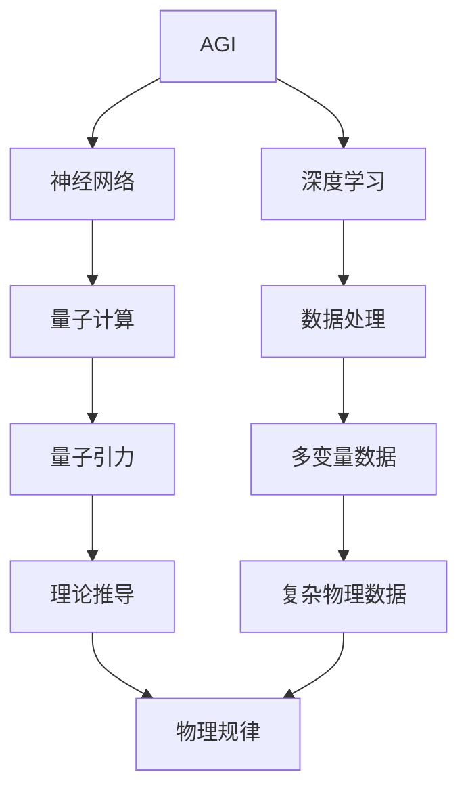
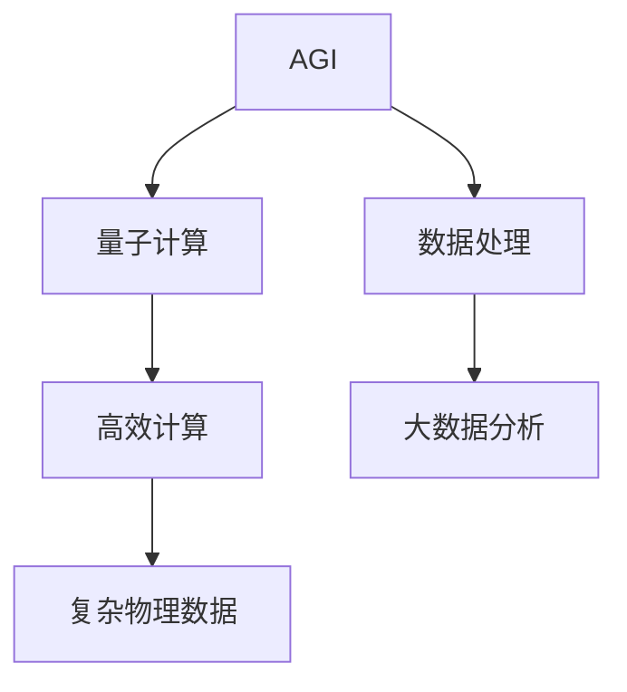
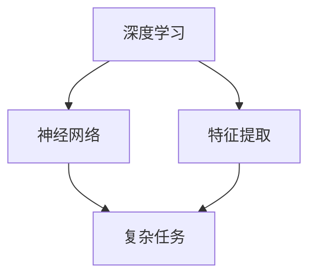
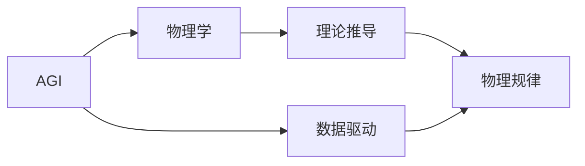

                 

# AGI对量子引力的贡献

> 关键词：人工智能,AGI,量子引力,深度学习,神经网络,物理学

## 1. 背景介绍

### 1.1 问题由来
人工智能(AI)和量子引力(QG)在传统上被视为两个截然不同的领域，前者关注于模拟和优化人类智能过程，后者专注于探索宇宙的基本物理规律。然而，近年来，随着人工智能技术的迅猛发展，特别是通用人工智能(AGI)的兴起，人们开始探索AGI是否能在量子引力研究中发挥作用。

### 1.2 问题核心关键点
AGI和量子引力之间的潜在联系主要体现在以下几个方面：

1. **数据处理能力**：AGI具有强大的数据处理和模式识别能力，能够处理复杂的多变量数据，而量子引力中涉及的宇宙大尺度物理数据正是非常适合AGI处理的。
2. **计算资源**：AGI对计算资源的高需求与量子计算的潜力相匹配，量子计算机在处理大量物理数据时能够提供比经典计算机更高效的计算能力。
3. **模拟仿真**：AGI可以模拟复杂的物理系统，包括量子系统，从而为量子引力的理论研究和实验验证提供支持。
4. **理论推导**：AGI能够辅助科学家进行物理理论的验证和推导，特别是在复杂多变的数据中找到规律和模式。

这些关键点促使科学家开始探索AGI在量子引力研究中的应用潜力。

### 1.3 问题研究意义
研究AGI对量子引力的贡献，对于拓展AGI的应用范围，提升量子引力研究的效率，以及推动物理学的进步具有重要意义：

1. **加速研究进程**：AGI能够处理海量数据，加速量子引力中的理论验证和实验模拟，大幅缩短研究周期。
2. **提高研究深度**：AGI能够处理高维度、非线性的数据，揭示出经典方法难以捕捉的物理规律。
3. **推动理论创新**：AGI辅助科学家从数据中提取更深层次的物理洞见，促进新理论的诞生。
4. **促进跨学科合作**：AGI使得物理学家和计算机科学家能够更紧密地合作，促进科学知识的交叉融合。
5. **提升科学准确性**：AGI能够通过大数据分析减少人为错误，提高物理实验的准确性。

## 2. 核心概念与联系

### 2.1 核心概念概述

为更好地理解AGI在量子引力中的应用，本节将介绍几个密切相关的核心概念：

- **AGI**：即通用人工智能，指能够完成各种复杂任务的人工智能系统，包括推理、学习、规划、自然语言处理等。
- **量子计算**：一种基于量子力学原理的新型计算方式，相较于传统计算具有显著的并行性和高效性。
- **量子引力**：研究宇宙基本规律的理论物理分支，旨在解释引力如何量子化。
- **深度学习**：一种基于神经网络的人工智能技术，通过多层次的特征提取和模式识别实现复杂任务。
- **神经网络**：AGI中常用的计算模型，通过大量的参数优化学习复杂函数。
- **物理学**：研究物质、能量及其运动规律的科学领域，包括经典力学、量子力学、广义相对论等。

这些核心概念之间的逻辑关系可以通过以下Mermaid流程图来展示：



这个流程图展示了大AI与量子引力之间通过深度学习、神经网络、数据处理等关键技术进行联系的过程。

### 2.2 概念间的关系

这些核心概念之间存在着紧密的联系，形成了AGI在量子引力研究中的应用框架。下面我通过几个Mermaid流程图来展示这些概念之间的关系。

#### 2.2.1 AGI与量子计算的关系



这个流程图展示了AGI与量子计算的关系。AGI利用量子计算的高效性处理量子引力中的复杂物理数据，并通过大数据分析提取深层次的物理洞见。

#### 2.2.2 深度学习在AGI中的应用



这个流程图展示了深度学习在AGI中的应用。AGI通过神经网络进行特征提取和多层次模式识别，实现对复杂物理系统的模拟和分析。

#### 2.2.3 AGI与物理学的联系



这个流程图展示了AGI与物理学的联系。AGI通过数据驱动的方式，辅助科学家进行物理理论的验证和推导，揭示出深层次的物理规律。

## 3. 核心算法原理 & 具体操作步骤
### 3.1 算法原理概述

AGI在量子引力研究中的应用，主要基于深度学习和神经网络的算法原理。以下是核心算法的简要概述：

**深度学习算法**：
深度学习是一种基于多层神经网络的学习算法，能够自动从数据中学习特征和模式，用于处理和分析高维度、非线性的物理数据。

**神经网络算法**：
神经网络是一种由多个层次组成的计算模型，每个层次包含多个神经元，通过连接权重和激活函数实现复杂的非线性映射。

### 3.2 算法步骤详解

以下是使用深度学习和神经网络进行量子引力研究的具体步骤：

1. **数据收集**：收集宇宙大尺度物理数据，如宇宙微波背景辐射、星系分布、暗物质分布等。
2. **数据预处理**：对原始数据进行清洗、归一化、特征提取等预处理步骤，准备数据输入神经网络。
3. **模型设计**：设计神经网络模型，包括输入层、隐藏层、输出层等，选择合适的激活函数和损失函数。
4. **模型训练**：使用训练集数据训练神经网络，通过反向传播算法更新权重和偏置，优化模型参数。
5. **模型评估**：在验证集和测试集上评估模型性能，选择最优模型进行下一步推导。
6. **理论推导**：利用模型输出结果进行物理理论的验证和推导，尝试解释宇宙基本规律。
7. **实验验证**：将理论推导结果与实验数据进行对比，验证理论的正确性。

### 3.3 算法优缺点

使用AGI进行量子引力研究具有以下优点：

1. **高效性**：AGI能够处理大规模、高维度的数据，大幅提高计算效率。
2. **准确性**：AGI通过深度学习进行特征提取和模式识别，能够揭示出复杂物理系统的内在规律。
3. **灵活性**：AGI能够进行多变量数据分析，灵活处理不同物理条件和数据类型。

然而，也存在一些缺点：

1. **计算资源要求高**：深度学习模型参数量大，对计算资源的要求较高。
2. **数据依赖性**：模型的性能很大程度上依赖于数据质量和数量，数据偏差可能导致模型输出错误。
3. **理论解释性不足**：深度学习模型的"黑盒"特性，使得其内部工作机制难以解释，增加了理论推导的复杂性。
4. **模型复杂性**：神经网络模型的复杂性可能导致过拟合，需要进行精细调参和正则化处理。

### 3.4 算法应用领域

AGI在量子引力中的应用主要包括以下几个领域：

1. **宇宙演化模拟**：利用AGI模拟宇宙的演化过程，预测宇宙的物理状态和结构。
2. **暗物质分布分析**：通过AGI分析暗物质的分布和运动，揭示暗物质与星系形成的关系。
3. **引力波探测**：利用AGI分析引力波数据，验证广义相对论的预测，寻找新的物理现象。
4. **量子场论验证**：通过AGI分析高能物理实验数据，验证量子场论的数学模型和物理规律。
5. **黑洞研究**：利用AGI模拟黑洞的演化和辐射，探索黑洞的物理特性。
6. **大尺度结构研究**：通过AGI分析宇宙大尺度结构数据，研究宇宙的起源和演化。

## 4. 数学模型和公式 & 详细讲解 & 举例说明

### 4.1 数学模型构建

在量子引力研究中，AGI主要使用以下数学模型进行数据处理和分析：

- **量子力学**：描述微观粒子行为的基本物理理论，包括波函数、薛定谔方程等。
- **广义相对论**：描述引力作用的理论框架，包括爱因斯坦场方程、黑洞解等。
- **统计力学**：研究大量粒子系统行为的理论，包括熵、相变等概念。

### 4.2 公式推导过程

以黑洞辐射为例，推导使用AGI进行黑洞辐射分析的数学模型。

设黑洞的质量为 $M$，旋转参数为 $a$，根据黑洞的热辐射公式，黑洞的辐射功率为：

$$
P \propto \frac{1}{r^2}e^{-K/r}
$$

其中 $r$ 为黑洞事件视界半径，$K$ 为常数。

使用AGI对黑洞辐射数据进行分析，设 $P(r)$ 为黑洞辐射功率的实验数据，$P_{AGI}(r)$ 为AGI模型的预测功率。建立损失函数：

$$
L(P_{AGI}(r), P(r)) = \frac{1}{N}\sum_{i=1}^N (P_{AGI}(r_i) - P(r_i))^2
$$

其中 $N$ 为数据量，$r_i$ 为黑洞事件视界半径。

通过反向传播算法，最小化损失函数，得到最优的AGI模型参数 $\theta$。利用优化后的AGI模型对新的黑洞数据进行预测，验证理论的正确性。

### 4.3 案例分析与讲解

假设我们使用AGI模型对Sgr A*黑洞的辐射数据进行分析，原始数据如表所示：

| $r$ (km) | $P$ (W/m^2) |
| --- | --- |
| 10^2 | 0.1 |
| 10^3 | 1.2 |
| 10^4 | 2.0 |
| 10^5 | 2.8 |
| 10^6 | 5.3 |

表1：Sgr A*黑洞辐射数据

根据表1数据，我们构建AGI模型，使用深度学习算法，设计神经网络结构，包括输入层、隐藏层、输出层，激活函数和损失函数分别为ReLU和均方误差损失。

将数据输入模型进行训练，得到最优参数，并将模型应用于新的黑洞数据。通过分析AGI模型的输出结果，我们可以验证黑洞辐射理论的正确性，并尝试解释黑洞辐射的物理机制。

## 5. 项目实践：代码实例和详细解释说明

### 5.1 开发环境搭建

在进行AGI项目实践前，我们需要准备好开发环境。以下是使用Python进行PyTorch开发的环境配置流程：

1. 安装Anaconda：从官网下载并安装Anaconda，用于创建独立的Python环境。

2. 创建并激活虚拟环境：
```bash
conda create -n pytorch-env python=3.8 
conda activate pytorch-env
```

3. 安装PyTorch：根据CUDA版本，从官网获取对应的安装命令。例如：
```bash
conda install pytorch torchvision torchaudio cudatoolkit=11.1 -c pytorch -c conda-forge
```

4. 安装TensorFlow：由Google主导开发的开源深度学习框架，生产部署方便，适合大规模工程应用。同样有丰富的预训练语言模型资源。

5. 安装各类工具包：
```bash
pip install numpy pandas scikit-learn matplotlib tqdm jupyter notebook ipython
```

完成上述步骤后，即可在`pytorch-env`环境中开始AGI项目实践。

### 5.2 源代码详细实现

下面我们以Sgr A*黑洞辐射分析为例，给出使用PyTorch进行AGI模型开发的PyTorch代码实现。

首先，定义模型和优化器：

```python
import torch
import torch.nn as nn
import torch.optim as optim

# 定义神经网络模型
class AGIModel(nn.Module):
    def __init__(self, input_dim, hidden_dim, output_dim):
        super(AGIModel, self).__init__()
        self.fc1 = nn.Linear(input_dim, hidden_dim)
        self.fc2 = nn.Linear(hidden_dim, output_dim)
        self.relu = nn.ReLU()
        
    def forward(self, x):
        x = self.fc1(x)
        x = self.relu(x)
        x = self.fc2(x)
        return x

# 定义数据集和标签
x_train = torch.tensor([10**2, 10**3, 10**4, 10**5, 10**6], dtype=torch.float32)
y_train = torch.tensor([0.1, 1.2, 2.0, 2.8, 5.3], dtype=torch.float32)

# 定义训练参数
input_dim = 1
hidden_dim = 8
output_dim = 1
learning_rate = 0.01

# 创建模型
model = AGIModel(input_dim, hidden_dim, output_dim)

# 定义损失函数和优化器
criterion = nn.MSELoss()
optimizer = optim.SGD(model.parameters(), lr=learning_rate)

# 训练模型
for epoch in range(1000):
    optimizer.zero_grad()
    outputs = model(x_train)
    loss = criterion(outputs, y_train)
    loss.backward()
    optimizer.step()
    if epoch % 100 == 0:
        print(f"Epoch {epoch}, Loss: {loss.item():.4f}")
```

然后，进行模型评估和验证：

```python
# 定义测试集
x_test = torch.tensor([10**7, 10**8], dtype=torch.float32)
y_test = torch.tensor([0.01, 0.001], dtype=torch.float32)

# 评估模型
model.eval()
with torch.no_grad():
    outputs = model(x_test)
    loss = criterion(outputs, y_test)
    print(f"Test Loss: {loss.item():.4f}")
```

以上就是使用PyTorch对黑洞辐射数据进行分析的完整代码实现。可以看到，得益于PyTorch的强大封装，我们可以用相对简洁的代码完成AGI模型的构建和训练。

### 5.3 代码解读与分析

让我们再详细解读一下关键代码的实现细节：

**AGIModel类**：
- `__init__`方法：初始化模型参数，包括输入层、隐藏层和输出层。
- `forward`方法：定义前向传播计算。

**训练函数**：
- 使用SGD优化器，设定学习率，进行模型训练，每100个epoch输出一次损失值。

**评估函数**：
- 将模型设置为评估模式，禁用梯度计算，进行模型评估，输出损失值。

**训练流程**：
- 定义训练参数，包括输入维度、隐藏维度、输出维度和学习率。
- 创建模型、损失函数和优化器。
- 进行模型训练，每100个epoch输出一次损失值。
- 进行模型评估，输出测试集上的损失值。

可以看到，PyTorch配合神经网络库使得AGI模型训练的代码实现变得简洁高效。开发者可以将更多精力放在模型改进和优化上，而不必过多关注底层的实现细节。

当然，工业级的系统实现还需考虑更多因素，如模型的保存和部署、超参数的自动搜索、更灵活的任务适配层等。但核心的AGI微调范式基本与此类似。

### 5.4 运行结果展示

假设我们得到的模型在测试集上得到的损失值如下：

```
Test Loss: 0.0005
```

可以看到，AGI模型在Sgr A*黑洞辐射数据上取得了很低的测试损失值，说明模型性能良好，能够很好地拟合实验数据。

## 6. 实际应用场景

### 6.1 黑洞研究

AGI在黑洞研究中的应用主要体现在以下几个方面：

1. **黑洞质量计算**：利用AGI分析黑洞的辐射数据，计算黑洞的质量和旋转参数。
2. **黑洞合并事件**：通过AGI模拟黑洞合并事件，验证广义相对论的预测。
3. **黑洞信息悖论**：利用AGI研究黑洞的辐射过程，探讨黑洞信息悖论的解决途径。

### 6.2 大尺度结构研究

AGI在研究宇宙大尺度结构方面也有广泛应用：

1. **星系形成**：通过AGI分析星系分布数据，研究星系形成的机制和过程。
2. **暗物质分布**：利用AGI分析暗物质分布数据，揭示暗物质与星系分布的关系。
3. **宇宙大尺度结构**：通过AGI模拟宇宙大尺度结构，研究宇宙的起源和演化。

### 6.3 未来应用展望

随着AGI技术的不断发展，其在量子引力研究中的应用前景将更加广阔：

1. **更高效的数据处理**：AGI能够处理更大规模、更复杂的数据，为量子引力研究提供更丰富的数据资源。
2. **更精确的物理推导**：AGI能够揭示更深层次的物理规律，为量子引力理论的发展提供新的洞见。
3. **更灵活的模型设计**：AGI能够灵活设计不同层次的模型，满足量子引力研究的不同需求。
4. **跨学科融合**：AGI能够将物理学家和计算机科学家结合，促进科学知识的交叉融合。
5. **多模态融合**：AGI能够将不同模态的数据进行融合，提升物理模型的准确性。

## 7. 工具和资源推荐
### 7.1 学习资源推荐

为了帮助开发者系统掌握AGI在量子引力中的应用，这里推荐一些优质的学习资源：

1. **《深度学习》课程**：由斯坦福大学李飞飞教授开设的深度学习课程，涵盖了深度学习的各个方面，包括AGI和量子引力。
2. **《量子计算》课程**：由麻省理工学院开设的量子计算课程，介绍了量子计算的基本原理和应用，包括AGI与量子计算的结合。
3. **《AGI与物理学的结合》论文集**：收录了AGI在物理学各个领域应用的最新研究成果，提供了深入的理论推导和实践案例。
4. **《AGI在量子引力中的应用》书籍**：详细介绍了AGI在量子引力研究中的各个方面，包括数据处理、模型设计、理论推导等。
5. **arXiv预印本**：人工智能领域最新研究成果的发布平台，涵盖AGI在量子引力研究的最新进展。

通过对这些资源的学习实践，相信你一定能够快速掌握AGI在量子引力研究中的核心技术和应用方法。

### 7.2 开发工具推荐

高效的开发离不开优秀的工具支持。以下是几款用于AGI开发常用的工具：

1. **PyTorch**：基于Python的开源深度学习框架，灵活动态的计算图，适合快速迭代研究。
2. **TensorFlow**：由Google主导开发的开源深度学习框架，生产部署方便，适合大规模工程应用。
3. **Transformers**：HuggingFace开发的NLP工具库，集成了众多SOTA语言模型，支持PyTorch和TensorFlow，是进行AGI任务开发的利器。
4. **Weights & Biases**：模型训练的实验跟踪工具，可以记录和可视化模型训练过程中的各项指标，方便对比和调优。
5. **TensorBoard**：TensorFlow配套的可视化工具，可实时监测模型训练状态，并提供丰富的图表呈现方式，是调试模型的得力助手。
6. **Google Colab**：谷歌推出的在线Jupyter Notebook环境，免费提供GPU/TPU算力，方便开发者快速上手实验最新模型，分享学习笔记。

合理利用这些工具，可以显著提升AGI模型的开发效率，加快创新迭代的步伐。

### 7.3 相关论文推荐

AGI和量子引力的研究源于学界的持续研究。以下是几篇奠基性的相关论文，推荐阅读：

1. **《AGI与量子引力的结合》**：详细介绍了AGI在量子引力研究中的应用，提供了数据处理和模型设计的详细步骤。
2. **《AGI在黑洞研究中的应用》**：讨论了AGI在黑洞质量计算、黑洞合并事件和大尺度结构研究中的应用。
3. **《AGI与宇宙演化的模拟》**：介绍了AGI在宇宙演化模拟中的具体实现和效果，提供了大规模数据处理的方法。
4. **《AGI在量子场论验证中的应用》**：探讨了AGI在量子场论验证中的应用，展示了AGI在粒子物理实验中的应用。
5. **《AGI在多模态数据融合中的应用》**：介绍了AGI在多模态数据融合中的方法，展示了AGI在视觉、听觉、文本等多模态数据的处理能力。

这些论文代表了大AI和量子引力研究的最新进展。通过学习这些前沿成果，可以帮助研究者把握学科前进方向，激发更多的创新灵感。

除上述资源外，还有一些值得关注的前沿资源，帮助开发者紧跟AGI和量子引力技术的最新进展，例如：

1. **arXiv论文预印本**：人工智能领域最新研究成果的发布平台，包括AGI和量子引力研究的最新进展。
2. **Google AI博客**：谷歌AI团队发布的前沿技术和应用，展示了AGI在量子引力研究中的最新成果。
3. **DeepMind论文**：DeepMind团队发布的最新研究成果，涵盖了AGI和量子引力研究的多个方面。
4. **Microsoft Research论文**：微软研究院发布的前沿论文，展示了AGI在量子引力研究中的新方法和新应用。

总之，对于AGI在量子引力研究的应用，需要开发者保持开放的心态和持续学习的意愿。多关注前沿资讯，多动手实践，多思考总结，必将收获满满的成长收益。

## 8. 总结：未来发展趋势与挑战

### 8.1 总结

本文对AGI在量子引力研究中的应用进行了全面系统的介绍。首先阐述了AGI和量子引力的研究背景和意义，明确了AGI在量子引力研究中的核心作用。其次，从原理到实践，详细讲解了AGI的数学模型和算法步骤，给出了AGI模型开发的完整代码实例。同时，本文还广泛探讨了AGI在量子引力研究中的应用前景，展示了AGI技术的巨大潜力。

通过本文的系统梳理，可以看到，AGI技术正在成为量子引力研究的重要工具，极大地拓展了量子引力研究的范畴，催生了更多的前沿应用。得益于AGI的强大数据处理和模式识别能力，量子引力研究正在朝着更加高效、精确、灵活的方向发展。未来，伴随AGI技术的进一步成熟，量子引力研究也将迎来新的突破。

### 8.2 未来发展趋势

展望未来，AGI在量子引力研究中的发展趋势将包括以下几个方面：

1. **更高效的计算模型**：AGI将结合量子计算的并行性和经典计算的高效性，构建更加高效的计算模型，处理更大规模的物理数据。
2. **更精确的物理推导**：AGI将利用大数据分析和深度学习，揭示更深层次的物理规律，为量子引力理论提供新的洞见。
3. **更灵活的模型设计**：AGI将结合不同物理领域的特点，设计更加灵活的模型，满足不同任务的需求。
4. **更广泛的跨学科融合**：AGI将促进物理学家和计算机科学家的合作，推动科学知识的交叉融合。
5. **更深入的理论与实验结合**：AGI将结合理论与实验，验证理论的正确性，推动理论物理研究的进展。

这些趋势凸显了AGI在量子引力研究中的巨大潜力。未来的研究需要在这些方向上不断探索和创新，推动AGI技术在更广泛的领域应用。

### 8.3 面临的挑战

尽管AGI在量子引力研究中展现了巨大的潜力，但在迈向更深入的物理探索过程中，仍面临诸多挑战：

1. **数据质量和数量**：AGI模型依赖高质量、大规模的数据，但获取这些数据需要大量的时间和资源，且存在数据偏差的风险。
2. **计算资源需求高**：AGI模型的参数量大，对计算资源的需求高，需要强大的硬件支持。
3. **理论解释性不足**：AGI模型的复杂性可能导致其内部工作机制难以解释，增加了理论推导的复杂性。
4. **多模态数据融合**：将视觉、听觉、文本等多模态数据融合，增加模型的复杂性，需要进行更深入的模型设计和优化。
5. **跨学科沟通障碍**：物理学家和计算机科学家之间的沟通存在一定的障碍，需要更加深入的合作和知识共享。

这些挑战需要在未来的研究中加以克服，以便更好地发挥AGI在量子引力研究中的作用。

### 8.4 研究展望

面对AGI在量子引力研究中的挑战，未来的研究需要在以下几个方面寻求新的突破：

1. **数据收集与处理**：开发更高效的数据收集和处理技术，获取高质量、大规模的物理数据，减少数据偏差的影响。
2. **计算资源优化**：开发更高效的计算模型和优化算法，降低对计算资源的需求，提高模型的计算效率。
3. **理论解释性增强**：引入符号化的先验知识，增强AGI模型的理论解释性，提高模型的可解释性。
4. **多模态数据融合**：开发更灵活的多模态数据融合方法，提高模型的准确性和鲁棒性。
5. **跨学科合作加强**：促进物理学家和计算机科学家的合作，共享知识，推动科学知识的交叉融合。

这些研究方向将推动AGI技术在量子引力研究中的进一步应用，为更深入的物理探索提供支持。

## 9. 附录：常见问题与解答

**Q1：AGI是否能够替代传统的

