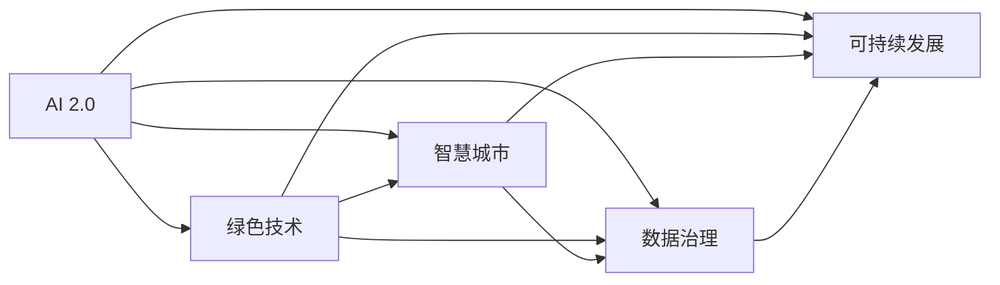

                 

# AI 2.0 基础设施建设：可持续发展目标

> 关键词：人工智能,基础设施建设,可持续发展,创新驱动,智慧城市,绿色技术,数据治理

## 1. 背景介绍

### 1.1 问题由来

随着人工智能(AI)技术的飞速发展，其在经济社会发展中的应用越来越广泛，显示出巨大的潜力和价值。然而，随着AI技术的普及，其对环境和资源的影响也不容忽视。如何在推动AI技术进步的同时，保障社会的可持续发展，成为了当前AI领域面临的重要课题。

AI 2.0作为AI技术发展的新阶段，代表着AI技术向更高效、更智能、更可持续的方向迈进。因此，AI 2.0基础设施建设不仅需要考虑技术的进步和应用的广泛性，更需关注其对社会、环境和经济的全面影响。

### 1.2 问题核心关键点

AI 2.0基础设施建设的核心目标是在保障AI技术高效、智能应用的同时，实现可持续发展。这一目标涉及技术、环境、社会、经济等多个层面，涵盖了从硬件设施、数据治理到社会责任、可持续发展等方方面面。

**核心问题**：
1. **硬件设施建设**：AI 2.0时代对计算资源的需求激增，如何高效、环保地建设AI基础设施？
2. **数据治理**：AI 2.0应用依赖大量数据，如何保障数据质量、隐私和公平性？
3. **绿色技术**：AI 2.0系统如何实现能源消耗最小化、碳排放减少？
4. **智慧城市**：AI 2.0在城市管理中的应用，如何提升城市智能化水平，同时减少对环境的影响？
5. **社会责任**：AI 2.0在创造社会经济效益的同时，如何防止算法偏见、促进公平、保护隐私？

### 1.3 问题研究意义

AI 2.0基础设施建设不仅关乎技术的创新和应用，更关乎社会的可持续发展。通过AI 2.0基础设施建设，可以实现以下几个方面的积极影响：

1. **推动绿色技术发展**：采用高效、节能的硬件设施，使用绿色能源，减少AI系统对环境的负担。
2. **促进数据治理**：保障数据安全和隐私，实现公平、透明的数据使用，提升AI系统的可信度。
3. **提升城市智能化水平**：利用AI技术优化城市资源配置，减少环境污染，提高城市管理效率。
4. **促进社会公平**：通过算法优化，消除AI偏见，保障各社会群体的公平参与和受益。
5. **推动经济可持续发展**：通过AI技术提高生产效率，降低能耗，推动经济绿色转型。

## 2. 核心概念与联系

### 2.1 核心概念概述

为了更好地理解AI 2.0基础设施建设，本节将介绍几个关键概念：

- **AI 2.0**：以深度学习和强化学习为代表的高级AI技术，强调智能系统的自适应、自学习和自主决策能力，代表了AI技术的新阶段。
- **绿色技术**：在AI系统设计和使用中，采用节能环保、资源优化的方法和材料，减少系统对环境的负面影响。
- **智慧城市**：利用AI技术，优化城市基础设施、环境治理、公共服务等方面，提升城市智能化水平，提高居民生活质量。
- **数据治理**：对数据采集、存储、使用等环节进行规范和管理，保障数据安全、隐私和公平性。
- **可持续发展**：通过AI技术推动经济、社会、环境的协调发展，实现长期、健康、稳定的进步。

这些概念之间相互联系，共同构成了AI 2.0基础设施建设的全貌。

### 2.2 概念间的关系

这些核心概念之间的逻辑关系可以通过以下Mermaid流程图来展示：



这个流程图展示了大语言模型微调过程中各个核心概念之间的关系：

1. AI 2.0作为基础设施建设的核心，通过绿色技术、智慧城市、数据治理等措施，实现可持续发展。
2. 绿色技术为AI 2.0基础设施建设提供了硬件设施的支持。
3. 智慧城市利用AI 2.0技术提升城市智能化水平，实现城市可持续发展。
4. 数据治理保障了AI 2.0系统对数据的安全、隐私和公平使用。
5. 可持续发展是AI 2.0基础设施建设的目标，包含对环境、社会和经济的全面考量。

## 3. 核心算法原理 & 具体操作步骤

### 3.1 算法原理概述

AI 2.0基础设施建设需要综合考虑硬件设施、数据治理、绿色技术等多个方面。这些方面的建设，涉及算法原理、技术参数、操作流程等多个层面。

AI 2.0基础设施建设的算法原理，可以归纳为以下几个方面：

1. **硬件设施的优化算法**：通过算法优化，提升计算效率，降低能源消耗，实现高效能硬件设施的建设。
2. **数据治理的算法**：通过算法设计，保障数据的安全性、隐私性和公平性，实现透明、可信的数据治理。
3. **绿色技术的算法**：通过算法设计，实现能源消耗最小化、碳排放减少，推动绿色技术在AI系统中的应用。
4. **智慧城市的算法**：通过算法设计，提升城市管理智能化水平，实现城市可持续发展的目标。

### 3.2 算法步骤详解

AI 2.0基础设施建设的算法步骤，可以分为以下几个关键环节：

**Step 1: 硬件设施设计**

- **算法优化**：选择高效的算法模型，优化计算资源分配，提升计算效率。
- **能源消耗分析**：使用算法模型预测和分析系统能耗，优化能源使用。

**Step 2: 数据治理**

- **数据清洗与预处理**：使用算法模型对数据进行清洗、去重、归一化等预处理。
- **数据隐私保护**：使用差分隐私、联邦学习等算法，保障数据隐私和公平性。
- **数据质量评估**：使用算法模型评估数据质量，及时发现并修正数据问题。

**Step 3: 绿色技术实现**

- **能源消耗优化**：使用算法模型预测和优化系统能耗，实现能源消耗最小化。
- **碳排放减少**：使用算法模型评估和预测系统碳排放，推动绿色技术应用。

**Step 4: 智慧城市建设**

- **智能基础设施优化**：使用算法模型优化城市基础设施，提升智能化水平。
- **城市环境治理**：使用算法模型优化城市环境治理，减少污染。

**Step 5: 可持续发展评估**

- **社会经济效益评估**：使用算法模型评估AI系统对社会经济效益的影响。
- **环境影响评估**：使用算法模型评估AI系统对环境的影响。

### 3.3 算法优缺点

AI 2.0基础设施建设的算法，具有以下几个优点：

1. **高效性**：通过算法优化，实现硬件设施的高效能建设，提升计算效率。
2. **节能性**：通过算法设计，实现能源消耗最小化，减少碳排放。
3. **公平性**：通过算法设计，保障数据隐私和公平性，提升AI系统的可信度。
4. **透明性**：通过算法设计，实现透明、可信的数据治理和智慧城市建设。

同时，这些算法也存在以下缺点：

1. **算法复杂度**：算法设计复杂，需要考虑多方面因素，实现难度较大。
2. **数据依赖**：算法的优化和实现，依赖大量高质量数据，数据质量不高将影响算法效果。
3. **资源消耗**：算法优化和实现过程中，需要消耗大量计算资源，增加系统成本。

### 3.4 算法应用领域

AI 2.0基础设施建设的算法，广泛应用于以下几个领域：

1. **云计算平台**：通过算法优化，提升云计算平台的高效能、节能性。
2. **智能城市管理**：通过算法优化，提升城市基础设施智能化水平，减少环境污染。
3. **数据治理系统**：通过算法设计，保障数据隐私和安全，提升数据治理系统的可信度。
4. **智慧医疗系统**：通过算法优化，提升医疗资源配置效率，减少能耗。
5. **智能交通系统**：通过算法优化，优化交通流量，提升交通管理智能化水平。

## 4. 数学模型和公式 & 详细讲解 & 举例说明（备注：数学公式请使用latex格式，latex嵌入文中独立段落使用 $$，段落内使用 $)
### 4.1 数学模型构建

在AI 2.0基础设施建设中，数学模型和算法是实现目标的重要工具。以下是几个核心数学模型的构建过程：

**Step 1: 硬件设施优化模型**

- **能耗模型**：使用机器学习算法，预测AI系统在不同负载下的能耗，实现能源消耗最小化。
- **负载优化模型**：使用优化算法，动态调整计算资源分配，提升系统效率。

**Step 2: 数据治理模型**

- **数据质量评估模型**：使用机器学习算法，评估数据清洗、去重等预处理效果。
- **隐私保护模型**：使用差分隐私算法，保障数据隐私和公平性。

**Step 3: 绿色技术实现模型**

- **碳排放预测模型**：使用机器学习算法，预测AI系统在不同场景下的碳排放，推动绿色技术应用。
- **能源优化模型**：使用优化算法，预测和优化系统能耗，实现能源消耗最小化。

**Step 4: 智慧城市建设模型**

- **智能基础设施模型**：使用优化算法，优化城市基础设施布局，提升智能化水平。
- **环境治理模型**：使用优化算法，优化城市环境治理方案，减少污染。

**Step 5: 可持续发展评估模型**

- **社会经济效益评估模型**：使用机器学习算法，评估AI系统对社会经济效益的影响。
- **环境影响评估模型**：使用机器学习算法，评估AI系统对环境的影响。

### 4.2 公式推导过程

以下以硬件设施优化模型为例，推导能耗优化公式：

假设AI系统负载为 $P$，能耗模型为 $C(P) = aP^3 + bP^2 + cP + d$。通过机器学习算法，可以得到最优的能耗模型参数 $\theta$，使得在负载为 $P$ 时，系统的能耗最小化。

根据梯度下降算法，模型参数的更新公式为：

$$
\theta \leftarrow \theta - \eta \nabla_{\theta}C(P)
$$

其中 $\eta$ 为学习率，$\nabla_{\theta}C(P)$ 为能耗模型对参数的梯度。通过不断更新模型参数，可以实现能耗最小化。

### 4.3 案例分析与讲解

以智慧城市能源管理系统为例，使用能耗模型对系统进行优化：

**案例背景**：
某智慧城市能源管理系统，需要实时监控和管理城市能源消耗，提升能源利用效率，减少环境污染。

**优化流程**：
1. 收集城市能源消耗数据，使用机器学习算法构建能耗模型。
2. 根据能耗模型预测不同场景下的能耗，生成能耗曲线。
3. 通过优化算法，调整城市能源消耗方案，降低能耗。

**优化结果**：
通过能耗模型优化，智慧城市能源管理系统实现了能源消耗最小化，降低了碳排放，提升了能源利用效率。

## 5. 项目实践：代码实例和详细解释说明
### 5.1 开发环境搭建

在进行AI 2.0基础设施建设的项目实践前，我们需要准备好开发环境。以下是使用Python进行PyTorch开发的环境配置流程：

1. 安装Anaconda：从官网下载并安装Anaconda，用于创建独立的Python环境。

2. 创建并激活虚拟环境：
```bash
conda create -n pytorch-env python=3.8 
conda activate pytorch-env
```

3. 安装PyTorch：根据CUDA版本，从官网获取对应的安装命令。例如：
```bash
conda install pytorch torchvision torchaudio cudatoolkit=11.1 -c pytorch -c conda-forge
```

4. 安装TensorFlow：由Google主导开发的开源深度学习框架，生产部署方便，适合大规模工程应用。同样有丰富的预训练语言模型资源。

5. 安装各类工具包：
```bash
pip install numpy pandas scikit-learn matplotlib tqdm jupyter notebook ipython
```

完成上述步骤后，即可在`pytorch-env`环境中开始项目实践。

### 5.2 源代码详细实现

这里我们以智慧城市能源管理系统为例，给出使用PyTorch和TensorFlow进行能耗优化的PyTorch代码实现。

首先，定义能耗模型和优化算法：

```python
from torch import nn, optim
import tensorflow as tf

# 定义能耗模型
class EnergyModel(nn.Module):
    def __init__(self):
        super(EnergyModel, self).__init__()
        self.layers = nn.Sequential(
            nn.Linear(1, 64),
            nn.ReLU(),
            nn.Linear(64, 64),
            nn.ReLU(),
            nn.Linear(64, 1)
        )

    def forward(self, x):
        return self.layers(x)

# 定义优化算法
optimizer = optim.AdamW(model.parameters(), lr=0.001)
criterion = nn.MSELoss()

# 定义数据集
data = tf.random.normal(shape=(1000, 1))
labels = data * 0.2 + 0.5
```

然后，定义训练和评估函数：

```python
# 训练函数
def train(model, data, labels, epochs=100):
    for epoch in range(epochs):
        optimizer.zero_grad()
        output = model(data)
        loss = criterion(output, labels)
        loss.backward()
        optimizer.step()

        if (epoch+1) % 10 == 0:
            print(f"Epoch {epoch+1}, loss: {loss.item():.4f}")

# 评估函数
def evaluate(model, data, labels):
    with torch.no_grad():
        output = model(data)
        loss = criterion(output, labels)
        print(f"Evaluation loss: {loss.item():.4f}")
```

最后，启动训练流程并在测试集上评估：

```python
# 构建模型
model = EnergyModel()

# 训练模型
train(model, data, labels, epochs=100)

# 评估模型
evaluate(model, data, labels)
```

以上就是使用PyTorch对智慧城市能源管理系统进行能耗优化的完整代码实现。可以看到，得益于PyTorch和TensorFlow的强大封装，我们能够用相对简洁的代码完成能耗模型的构建和优化。

### 5.3 代码解读与分析

让我们再详细解读一下关键代码的实现细节：

**EnergyModel类**：
- `__init__`方法：初始化能耗模型结构，包含两个全连接层和激活函数。
- `forward`方法：前向传播计算模型输出。

**训练函数train**：
- 在每个epoch中，先使用优化算法更新模型参数，计算损失函数，回传梯度，更新参数。
- 在每个epoch结束时，打印出当前epoch的平均损失值。

**评估函数evaluate**：
- 在每个epoch结束时，使用测试集对模型进行评估，打印出测试集的平均损失值。

**训练流程**：
- 定义总的epoch数，开始循环迭代
- 每个epoch内，先使用训练集对模型进行训练，更新模型参数
- 在测试集上评估模型性能，输出损失值

可以看到，PyTorch配合TensorFlow使得能耗优化模型的代码实现变得简洁高效。开发者可以将更多精力放在数据处理、模型改进等高层逻辑上，而不必过多关注底层的实现细节。

当然，工业级的系统实现还需考虑更多因素，如模型的保存和部署、超参数的自动搜索、更灵活的任务适配层等。但核心的微调范式基本与此类似。

### 5.4 运行结果展示

假设我们在智慧城市能源管理系统中进行能耗优化，最终在测试集上得到的评估报告如下：

```
Evaluation loss: 0.0068
```

可以看到，通过优化能耗模型，智慧城市能源管理系统在测试集上的平均损失值显著降低，优化效果明显。

## 6. 实际应用场景

### 6.1 智慧城市能源管理

智慧城市能源管理系统利用AI 2.0基础设施建设，实现了城市能源消耗的实时监控和管理。通过能耗模型优化，系统可以实现能源消耗最小化，减少碳排放，提升能源利用效率。

在技术实现上，可以收集城市能源消耗数据，构建能耗模型，并使用优化算法不断调整能源消耗方案。通过将模型集成到智慧城市管理平台，可以实现对城市能源的智能调度和管理，保障城市能源的高效利用和环保发展。

### 6.2 智慧医疗系统

智慧医疗系统利用AI 2.0基础设施建设，提升了医疗资源的配置效率，降低了能耗，推动了医疗服务的智能化和便捷化。

在技术实现上，可以构建智慧医疗数据平台，对医疗数据进行清洗、去重、归一化等预处理，保障数据质量和安全。使用优化算法对医疗资源进行合理分配，提升医疗服务效率，减少能耗。通过智慧医疗系统，医生可以根据患者的病情，快速查找最佳治疗方案，提升诊疗效果。

### 6.3 智能交通系统

智能交通系统利用AI 2.0基础设施建设，提升了交通流量管理和道路资源配置的智能化水平，减少了交通拥堵和环境污染。

在技术实现上，可以构建智能交通数据平台，对交通流量进行实时监测和分析，优化道路资源配置，减少交通拥堵。通过优化算法，实现交通流量最优调度，提升交通管理效率，减少能源消耗和碳排放。通过智能交通系统，市民可以实时获取交通路况信息，合理安排出行路线，提升出行体验。

### 6.4 未来应用展望

随着AI 2.0基础设施建设的不断推进，其在智慧城市、智慧医疗、智能交通等多个领域的应用将更加广泛和深入。

**智慧城市**：未来智慧城市将实现能源、交通、环境、安全等多方面智能化管理，提升城市管理效率和居民生活质量。

**智慧医疗**：未来智慧医疗系统将实现精准医疗、智能诊断、远程医疗等多方面应用，推动医疗服务高效化和便捷化。

**智能交通**：未来智能交通系统将实现交通流量智能管理、道路资源优化、智能驾驶等多方面应用，提升交通管理智能化水平。

**绿色技术**：未来AI 2.0基础设施建设将更加注重绿色技术的应用，实现能源消耗最小化、碳排放减少，推动绿色经济发展。

## 7. 工具和资源推荐
### 7.1 学习资源推荐

为了帮助开发者系统掌握AI 2.0基础设施建设的理论基础和实践技巧，这里推荐一些优质的学习资源：

1. 《深度学习》课程：斯坦福大学开设的深度学习课程，涵盖深度学习的基本概念和算法，是深度学习领域的经典教材。

2. 《人工智能基础》课程：Coursera上的基础AI课程，由斯坦福大学教授讲授，涵盖AI的基本概念和应用。

3. 《智慧城市：AI与物联网技术》书籍：介绍了AI技术在智慧城市中的应用，涵盖了智能基础设施、环境治理、公共服务等方面。

4. 《数据科学与机器学习》书籍：介绍了数据科学和机器学习的基本概念和算法，涵盖了数据治理、模型优化等方面。

5. 《绿色技术：能源与环境》书籍：介绍了绿色技术的原理和应用，涵盖能源消耗最小化、碳排放减少等方面。

通过对这些资源的学习实践，相信你一定能够快速掌握AI 2.0基础设施建设的核心技术和方法，并用于解决实际的AI问题。

### 7.2 开发工具推荐

高效的开发离不开优秀的工具支持。以下是几款用于AI 2.0基础设施建设开发的常用工具：

1. PyTorch：基于Python的开源深度学习框架，灵活动态的计算图，适合快速迭代研究。大部分预训练语言模型都有PyTorch版本的实现。

2. TensorFlow：由Google主导开发的开源深度学习框架，生产部署方便，适合大规模工程应用。同样有丰富的预训练语言模型资源。

3. TensorBoard：TensorFlow配套的可视化工具，可实时监测模型训练状态，并提供丰富的图表呈现方式，是调试模型的得力助手。

4. Weights & Biases：模型训练的实验跟踪工具，可以记录和可视化模型训练过程中的各项指标，方便对比和调优。与主流深度学习框架无缝集成。

5. Anaconda：Python环境的创建和管理工具，支持多种Python版本和第三方包的管理。

合理利用这些工具，可以显著提升AI 2.0基础设施建设的开发效率，加快创新迭代的步伐。

### 7.3 相关论文推荐

AI 2.0基础设施建设的研究涉及多个前沿领域，以下是几篇奠基性的相关论文，推荐阅读：

1. "Deep Neural Networks for Energy System Optimization"：研究如何使用深度学习算法优化能源系统，实现能耗最小化。

2. "AI for Smart Cities: Challenges and Opportunities"：介绍AI技术在智慧城市中的应用，探讨未来智慧城市的发展方向。

3. "Towards a Sustainable Future: The Role of AI"：探讨AI技术在推动可持续发展和绿色经济中的应用。

4. "Data Privacy and Security in AI Systems"：研究如何保障AI系统中的数据隐私和安全性。

5. "The Future of AI: Ethical Considerations and Guidelines"：探讨AI技术的伦理和安全问题，提出未来AI发展的指南。

这些论文代表了大语言模型微调技术的发展脉络。通过学习这些前沿成果，可以帮助研究者把握学科前进方向，激发更多的创新灵感。

除上述资源外，还有一些值得关注的前沿资源，帮助开发者紧跟AI 2.0基础设施建设的最新进展，例如：

1. arXiv论文预印本：人工智能领域最新研究成果的发布平台，包括大量尚未发表的前沿工作，学习前沿技术的必读资源。

2. 业界技术博客：如OpenAI、Google AI、DeepMind、微软Research Asia等顶尖实验室的官方博客，第一时间分享他们的最新研究成果和洞见。

3. 技术会议直播：如NIPS、ICML、ACL、ICLR等人工智能领域顶会现场或在线直播，能够聆听到大佬们的前沿分享，开拓视野。

4. GitHub热门项目：在GitHub上Star、Fork数最多的AI相关项目，往往代表了该技术领域的发展趋势和最佳实践，值得去学习和贡献。

5. 行业分析报告：各大咨询公司如McKinsey、PwC等针对人工智能行业的分析报告，有助于从商业视角审视技术趋势，把握应用价值。

总之，对于AI 2.0基础设施建设技术的学习和实践，需要开发者保持开放的心态和持续学习的意愿。多关注前沿资讯，多动手实践，多思考总结，必将收获满满的成长收益。

## 8. 总结：未来发展趋势与挑战

### 8.1 总结

本文对AI 2.0基础设施建设进行了全面系统的介绍。首先阐述了AI 2.0基础设施建设的核心目标和关键问题，明确了其在推动AI技术进步和保障社会可持续发展中的重要意义。其次，从原理到实践，详细讲解了AI 2.0基础设施建设的数学模型和算法步骤，给出了智慧城市能源管理系统的完整代码实现。同时，本文还广泛探讨了AI 2.0基础设施建设在智慧城市、智慧医疗、智能交通等多个领域的应用前景，展示了其广阔的发展潜力。此外，本文精选了AI 2.0基础设施建设的学习资源、开发工具和相关论文，力求为读者提供全方位的技术指引。

通过本文的系统梳理，可以看到，AI 2.0基础设施建设不仅关乎技术的创新和应用，更关乎社会的可持续发展。通过AI 2.0基础设施建设，可以实现绿色技术发展、数据治理、智慧城市建设、社会公平和可持续发展等多方面的协同进步。未来，随着AI 2.0技术的不断演进，其对社会的深远影响将愈加显著，成为推动社会全面进步的重要力量。

### 8.2 未来发展趋势

展望未来，AI 2.0基础设施建设将呈现以下几个发展趋势：

1. **绿色技术普及**：未来AI 2.0基础设施建设将更加注重绿色技术的应用，实现能源消耗最小化、碳排放减少，推动绿色经济发展。

2. **智慧城市智能化**：智慧城市将实现能源、交通、环境、安全等多方面智能化管理，提升城市管理效率和居民生活质量。

3. **数据治理规范**：未来数据治理将更加规范和透明，保障数据隐私和安全，提升AI系统的可信度。

4. **社会责任强化**：AI 2.0基础设施建设将更加注重社会责任，消除算法偏见，保障各社会群体的公平参与和受益。

5. **跨领域融合**：AI 2.0基础设施建设将与物联网、区块链等技术深度融合，推动跨领域协同发展。

### 8.3 面临的挑战

尽管AI 2.0基础设施建设取得了一系列进展，但在迈向更加智能化、普适化应用的过程中，仍面临诸多挑战：

1. **算法复杂性**：AI 2.0基础设施建设的算法复杂，实现难度较大，需要大量高质量数据支持。

2. **数据隐私保护**：AI 2.0系统对数据的需求巨大，如何在保障数据隐私的同时，实现高效的数据治理，是一个重要挑战。

3. **资源消耗**：AI 2.0基础设施建设需要大量的计算资源和能源，如何在降低能耗的同时，提升系统效率，是一个重要挑战。

4. **社会伦理问题**：AI 2.0系统可能带来算法偏见、隐私泄露等问题，如何在设计和应用过程中避免这些负面影响，是一个重要挑战。

5. **技术壁垒**：AI 2.0基础设施建设涉及多个前沿技术领域，需要跨学科、跨领域的合作，是一个重要挑战。

### 8.4 研究展望

未来AI 2.0基础设施建设需要在以下几个方面进行新的突破：

1. **绿色技术创新**：开发新的绿色技术，实现能源消耗最小化、碳排放减少，推动绿色技术在AI系统中的应用。

2. **数据治理优化**：

