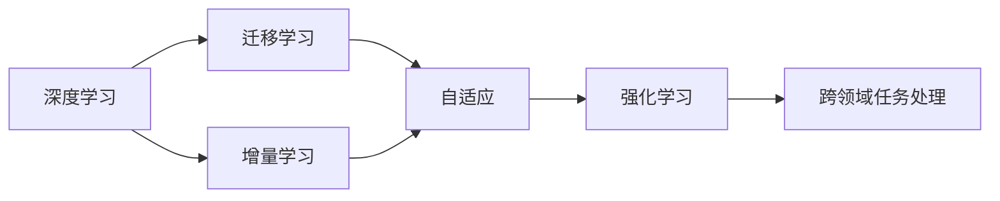

                 

## 1. 背景介绍

### 1.1 问题由来

AI 2.0时代的到来，标志着人工智能技术的全面成熟和应用化。作为人类进入智能社会的关键推动力，AI 2.0不仅仅是一种技术，更是一种生活方式的变革。自20世纪90年代以来，人工智能技术经历了从规则驱动、统计学习到深度学习的三次重大飞跃，其中深度学习在处理复杂图像、语音、文本等任务上取得了前所未有的突破。然而，尽管人工智能在技术层面取得了巨大进展，但其应用范围和场景却始终未能得到广泛普及。

### 1.2 问题核心关键点

AI 2.0的核心在于“普及”。如何让智能技术更好地服务大众，成为未来AI研究的重点。此外，AI 2.0时代的数据、算法、计算资源等不再稀缺，如何更高效地利用这些资源，推动AI技术的落地应用，也是亟待解决的问题。

### 1.3 问题研究意义

AI 2.0的普及和应用，将极大地推动社会生产力的发展，提升人民生活品质，解决资源配置不均、环境污染等问题。AI 2.0有望成为实现可持续发展的重要手段。此外，AI 2.0时代的技术创新、产业升级、就业结构变化等，将带来全新的社会变革。

## 2. 核心概念与联系

### 2.1 核心概念概述

为了更好地理解AI 2.0时代的技术框架和应用场景，本文将介绍几个核心的概念：

- **AI 2.0**：人工智能技术进入成熟阶段的标志，包括通用智能、自主学习、自适应、跨领域任务处理等能力。
- **深度学习**：一种模拟人脑神经网络的机器学习技术，通过多层非线性神经网络结构，能够有效处理大规模数据集，实现复杂模式的识别和分类。
- **迁移学习**：将一个领域学到的知识迁移到另一个相关领域，以加快新任务的训练和学习。
- **增量学习**：在已有模型基础上，不断更新模型参数以适应用户行为和需求的变化。
- **强化学习**：通过与环境的交互，不断优化模型策略以获得最大化的奖励或最小化的损失。

这些核心概念之间相互联系，构成了AI 2.0时代的整体技术框架。深度学习是AI 2.0的重要工具，迁移学习则扩展了AI的应用范围，增量学习保证了AI系统的持续性和稳定性，强化学习则提供了AI自适应环境的能力。

### 2.2 概念间的关系

这些核心概念之间的逻辑关系可以通过以下Mermaid流程图来展示：



这个流程图展示了深度学习、迁移学习、增量学习和强化学习之间的联系和演变。深度学习提供了AI系统所需的基本功能，迁移学习使得AI系统能够处理不同领域的问题，增量学习保证了AI系统的持续改进，强化学习则赋予了AI系统自适应环境的能力。

### 2.3 核心概念的整体架构

最后，我们用一个综合的流程图来展示这些核心概念在大规模智能系统中的一体化应用：


这个综合流程图展示了从数据输入到智能决策的完整过程，深度学习模型通过迁移学习、增量学习和强化学习，逐步适应不同领域和环境，最终实现智能决策并根据反馈不断优化。

## 3. 核心算法原理 & 具体操作步骤

### 3.1 算法原理概述

AI 2.0的核心算法之一是深度学习。深度学习通过多层神经网络结构，能够自动地从数据中学习到复杂的高维特征表示。这种特征表示不仅在图像、语音、文本等领域表现出色，而且能够跨领域应用，提高AI系统的通用性和适应性。

### 3.2 算法步骤详解

#### 3.2.1 数据预处理

数据预处理是深度学习模型的重要步骤。主要包括以下几个方面：

1. **数据清洗**：去除数据中的噪声和异常值，保证数据的质量和一致性。
2. **数据归一化**：对数据进行标准化处理，使其符合深度学习模型的输入要求。
3. **数据增强**：通过数据增强技术，扩充训练数据集，提高模型的鲁棒性。

#### 3.2.2 模型训练

模型训练是深度学习模型的关键步骤。主要包括以下几个方面：

1. **模型选择**：根据任务需求选择合适的深度学习模型架构，如卷积神经网络（CNN）、循环神经网络（RNN）、长短期记忆网络（LSTM）等。
2. **损失函数设计**：根据任务类型选择合适的损失函数，如交叉熵、均方误差、对数似然等。
3. **优化算法**：选择适当的优化算法，如梯度下降、Adam、Adagrad等，优化模型参数。
4. **正则化**：使用L2正则化、Dropout等技术，避免模型过拟合。

#### 3.2.3 模型评估

模型评估是深度学习模型的重要步骤。主要包括以下几个方面：

1. **训练集和验证集划分**：将数据集划分为训练集和验证集，用于模型训练和评估。
2. **模型验证**：在验证集上评估模型性能，如准确率、精确率、召回率等。
3. **超参数调整**：根据验证集结果调整模型超参数，如学习率、批大小、迭代轮数等。

#### 3.2.4 模型部署

模型部署是深度学习模型的最后一步。主要包括以下几个方面：

1. **模型优化**：对模型进行优化，如裁剪、量化、剪枝等，以提高模型效率和性能。
2. **模型集成**：将模型集成到应用系统中，如移动应用、网页应用、服务器应用等。
3. **模型监控**：实时监控模型性能，及时发现和解决模型问题。

### 3.3 算法优缺点

深度学习的优点在于其强大的数据处理能力，能够在复杂的多维空间中识别出有意义的特征，从而提高模型的准确性和泛化能力。然而，深度学习的缺点在于其对数据量的依赖和计算资源的高需求，容易导致模型过拟合和训练时间长的问题。

### 3.4 算法应用领域

深度学习在多个领域都有广泛的应用，如计算机视觉、自然语言处理、语音识别、推荐系统等。这些领域的应用不仅提升了人类的生产效率和生活品质，而且推动了相关行业的发展和变革。

## 4. 数学模型和公式 & 详细讲解

### 4.1 数学模型构建

在深度学习中，我们通常使用多层神经网络模型来处理复杂的数据。以卷积神经网络（CNN）为例，其基本结构可以表示为：

$$
f(x;w) = \sigma(\sum_{i=1}^{d} w_i \cdot \phi(x_i) + b)
$$

其中 $x$ 为输入数据，$w$ 为模型参数，$\phi(x)$ 为神经网络激活函数，$\sigma$ 为激活函数，$b$ 为偏置项。

### 4.2 公式推导过程

假设我们有一个二分类问题，模型的预测输出为 $y = \sigma(\sum_{i=1}^{d} w_i \cdot x_i + b)$。假设训练集为 $D = \{(x_1, y_1), (x_2, y_2), \ldots, (x_N, y_N)\}$，其中 $y_i \in \{0, 1\}$，则损失函数可以表示为：

$$
L(w) = -\frac{1}{N} \sum_{i=1}^{N}[y_i \log y_i + (1 - y_i) \log (1 - y_i)]
$$

其中 $L(w)$ 为交叉熵损失函数。梯度下降算法可以用于优化模型参数 $w$ 和偏置 $b$，具体的梯度下降公式为：

$$
\frac{\partial L(w)}{\partial w_i} = -\frac{1}{N} \sum_{i=1}^{N}[y_i - y] * \frac{\partial \sigma^{-1}(y)}{\partial x_i}
$$

其中 $y_i = \sigma(\sum_{i=1}^{d} w_i \cdot x_i + b)$，$y = \sigma(\sum_{i=1}^{d} w_i \cdot x_i + b)$。

### 4.3 案例分析与讲解

以图像分类为例，我们训练一个CNN模型对手写数字进行分类。首先，我们需要对数据进行预处理，包括归一化、数据增强等步骤。然后，我们将数据集划分为训练集和验证集，使用交叉验证法进行模型训练。在模型训练过程中，我们使用梯度下降算法对模型参数进行优化，并使用交叉熵损失函数作为评估指标。最后，我们在测试集上评估模型性能，如准确率、精确率、召回率等，并根据评估结果调整模型参数，以提高模型的泛化能力。

## 5. 项目实践：代码实例和详细解释说明

### 5.1 开发环境搭建

在进行深度学习项目实践时，我们需要准备以下开发环境：

1. 安装Python环境：在Windows、Linux或MacOS等操作系统中，安装Python 3.8以上版本，并安装Pip工具。
2. 安装深度学习库：安装TensorFlow、PyTorch、Keras等深度学习库，这些库提供了丰富的API和模型实现。
3. 安装数据处理库：安装NumPy、Pandas等数据处理库，用于数据的读取、处理和可视化。
4. 安装可视化工具：安装Matplotlib、Seaborn等可视化工具，用于模型训练和评估过程中的数据可视化。
5. 安装分布式计算框架：安装Apache Spark、Dask等分布式计算框架，用于大规模数据处理和模型训练。

### 5.2 源代码详细实现

下面以TensorFlow为例，给出卷积神经网络（CNN）对手写数字图像分类的代码实现。

```python
import tensorflow as tf
from tensorflow.keras import datasets, layers, models
import matplotlib.pyplot as plt

# 加载数据集
(train_images, train_labels), (test_images, test_labels) = datasets.mnist.load_data()

# 数据预处理
train_images = train_images.reshape((60000, 28, 28, 1))
test_images = test_images.reshape((10000, 28, 28, 1))
train_images, test_images = train_images / 255.0, test_images / 255.0

# 定义模型
model = models.Sequential([
    layers.Conv2D(32, (3, 3), activation='relu', input_shape=(28, 28, 1)),
    layers.MaxPooling2D((2, 2)),
    layers.Conv2D(64, (3, 3), activation='relu'),
    layers.MaxPooling2D((2, 2)),
    layers.Conv2D(64, (3, 3), activation='relu'),
    layers.Flatten(),
    layers.Dense(64, activation='relu'),
    layers.Dense(10, activation='softmax')
])

# 编译模型
model.compile(optimizer='adam',
              loss='sparse_categorical_crossentropy',
              metrics=['accuracy'])

# 训练模型
history = model.fit(train_images, train_labels, epochs=5, 
                    validation_data=(test_images, test_labels))

# 评估模型
test_loss, test_acc = model.evaluate(test_images, test_labels, verbose=2)
print('\nTest accuracy:', test_acc)
```

### 5.3 代码解读与分析

在上述代码中，我们首先加载了MNIST数据集，并对数据进行了预处理，将图像数据归一化到[0, 1]范围内。然后，我们定义了一个卷积神经网络模型，包括卷积层、池化层、全连接层等。最后，我们编译了模型，使用Adam优化器、交叉熵损失函数和准确率指标，并进行了模型训练和评估。

## 6. 实际应用场景

### 6.1 智能医疗

在智能医疗领域，深度学习技术被广泛应用在疾病诊断、医学影像分析、健康管理等方面。例如，深度学习模型可以通过医学影像数据，自动识别出疾病相关的影像特征，从而辅助医生进行诊断。此外，深度学习模型还可以分析电子健康记录（EHR）中的大量数据，发现患者的健康趋势，提供个性化的健康管理方案。

### 6.2 智能交通

在智能交通领域，深度学习技术被用于交通流量预测、车辆行为分析、自动驾驶等方面。例如，深度学习模型可以通过传感器数据，预测未来交通流量，优化交通信号灯的控制，减少交通拥堵。此外，深度学习模型还可以分析车辆行为数据，发现异常行为，提升自动驾驶系统的安全性。

### 6.3 智能家居

在智能家居领域，深度学习技术被用于智能音箱、智能空调、智能安防等方面。例如，深度学习模型可以通过语音识别技术，实现语音控制家居设备，提升用户体验。此外，深度学习模型还可以分析家庭能源消耗数据，提供节能建议，优化家庭能源管理。

### 6.4 未来应用展望

未来，AI 2.0技术将在更多领域得到广泛应用，推动社会生产力的进一步提升。例如，在金融领域，深度学习技术被用于信用评估、风险控制、欺诈检测等方面，提升金融机构的运营效率和风险管理能力。在教育领域，深度学习技术被用于个性化教育、智能辅导、智能评估等方面，提高教育质量和公平性。在环境保护领域，深度学习技术被用于气候预测、环境监测、污染控制等方面，推动可持续发展。

## 7. 工具和资源推荐

### 7.1 学习资源推荐

为了帮助开发者系统掌握深度学习技术，以下是一些优质的学习资源：

1. 《深度学习》课程：由吴恩达教授主讲，提供深度学习的基本概念和算法实现。
2. 《Python深度学习》书籍：由Francois Chollet撰写，提供TensorFlow和Keras的使用方法。
3. 《动手学深度学习》书籍：由李沐等作者撰写，提供深度学习的理论与实践。
4. Coursera深度学习课程：由多所大学和公司提供的深度学习课程，涵盖深度学习的各个方面。
5. Kaggle竞赛平台：提供各种深度学习竞赛，帮助开发者实践深度学习技术。

### 7.2 开发工具推荐

为了提高深度学习项目的开发效率，以下是一些常用的开发工具：

1. TensorFlow：由Google主导开发的深度学习框架，提供丰富的API和模型实现。
2. PyTorch：由Facebook开发的一种深度学习框架，提供灵活的动态计算图。
3. Keras：由Francois Chollet开发的深度学习框架，提供简单易用的API。
4. Jupyter Notebook：一种交互式的数据分析工具，支持Python和R等多种编程语言。
5. Scikit-learn：一个用于机器学习的数据处理库，提供各种数据预处理和模型评估工具。

### 7.3 相关论文推荐

以下是一些深度学习领域的经典论文，推荐阅读：

1. ImageNet Classification with Deep Convolutional Neural Networks：提出卷积神经网络（CNN），并应用于图像分类任务。
2. Deep Residual Learning for Image Recognition：提出残差网络（ResNet），解决深度神经网络训练中梯度消失问题。
3. Attention is All You Need：提出Transformer模型，广泛应用于自然语言处理任务。
4. Generative Adversarial Nets：提出生成对抗网络（GAN），用于图像生成和图像修复。
5. Reinforcement Learning for Robotics：提出强化学习在机器人控制中的应用。

这些论文代表了深度学习技术的发展脉络，帮助开发者深入理解深度学习的基本原理和应用。

## 8. 总结：未来发展趋势与挑战

### 8.1 研究成果总结

AI 2.0时代，深度学习技术取得了显著进展，在多个领域得到了广泛应用。深度学习模型的准确性和泛化能力得到了大幅提升，推动了人工智能技术的普及和应用。然而，深度学习技术仍然面临一些挑战，如计算资源消耗大、模型复杂度高、泛化能力不足等问题。

### 8.2 未来发展趋势

未来，深度学习技术将向更加智能化、普适化方向发展。随着计算资源的不断丰富和算法的不断优化，深度学习技术将实现更大规模的应用。同时，深度学习技术将与其他技术（如自然语言处理、计算机视觉、强化学习等）进一步融合，推动人工智能技术的全面普及。

### 8.3 面临的挑战

尽管深度学习技术取得了重要进展，但仍面临一些挑战：

1. 数据质量问题：深度学习模型对数据质量要求高，低质量数据容易导致模型过拟合。
2. 计算资源问题：深度学习模型需要大量计算资源，高昂的计算成本成为应用推广的瓶颈。
3. 模型复杂度问题：深度学习模型结构复杂，难以解释和调试。
4. 泛化能力问题：深度学习模型在特定领域表现良好，但在其他领域泛化能力不足。
5. 伦理道德问题：深度学习模型可能存在偏见和歧视，需要考虑伦理道德问题。

### 8.4 研究展望

未来，深度学习技术需要从以下几个方面进行研究：

1. 数据增强技术：提高数据质量，丰富数据集，降低对标注数据的依赖。
2. 模型优化技术：优化模型结构，提高模型效率和泛化能力。
3. 算法优化技术：研究更加高效的算法和模型，提高计算资源利用率。
4. 伦理道德问题：研究如何保证深度学习模型的公平性、透明性和可解释性。
5. 跨领域应用：研究如何将深度学习技术与其他技术结合，推动跨领域应用的突破。

总之，AI 2.0时代的深度学习技术具有广阔的发展前景，需要从数据、算法、伦理等多个方面进行全面研究，推动人工智能技术的不断进步。

## 9. 附录：常见问题与解答

**Q1: 什么是深度学习？**

A: 深度学习是一种基于神经网络的机器学习技术，通过多层非线性变换，能够自动地从数据中学习出复杂的特征表示，并用于分类、回归、聚类等任务。

**Q2: 深度学习模型的训练过程是怎样的？**

A: 深度学习模型的训练过程通常包括数据预处理、模型定义、模型编译、模型训练、模型评估等步骤。其中，数据预处理包括数据清洗、数据归一化、数据增强等操作；模型定义包括选择神经网络结构、设置激活函数、设置损失函数等；模型编译包括选择优化算法、设置评估指标等；模型训练包括对模型进行前向传播、反向传播、参数更新等操作；模型评估包括在验证集上评估模型性能、调整模型参数等操作。

**Q3: 深度学习模型如何优化？**

A: 深度学习模型的优化通常包括梯度下降、Adam、Adagrad等优化算法，以及L2正则化、Dropout等正则化技术，避免模型过拟合。同时，还可以通过模型剪枝、量化、知识蒸馏等技术，提高模型效率和性能。

**Q4: 深度学习模型在应用过程中如何部署？**

A: 深度学习模型的部署通常包括模型优化、模型集成、模型监控等步骤。其中，模型优化包括对模型进行裁剪、量化、剪枝等操作；模型集成包括将模型集成到应用系统中；模型监控包括实时监控模型性能，及时发现和解决模型问题。

**Q5: 深度学习模型如何避免过拟合？**

A: 深度学习模型避免过拟合的方法包括数据增强、正则化、模型简化等。其中，数据增强包括对数据进行回译、近义替换等操作，扩充训练数据集；正则化包括使用L2正则化、Dropout等技术，避免模型过拟合；模型简化包括对模型进行剪枝、量化等操作，减少模型参数量。

总之，AI 2.0时代的深度学习技术具有广阔的发展前景，需要从数据、算法、伦理等多个方面进行全面研究，推动人工智能技术的不断进步。未来，深度学习技术将在更多领域得到广泛应用，推动社会生产力的进一步提升。

