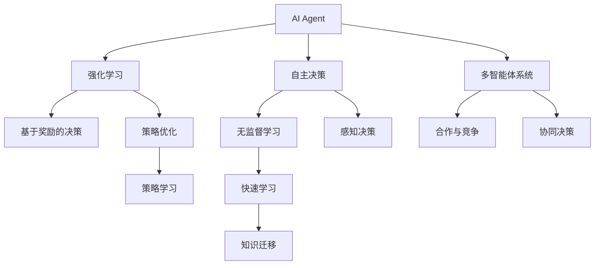
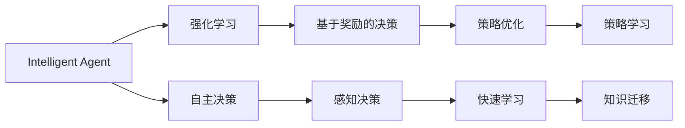
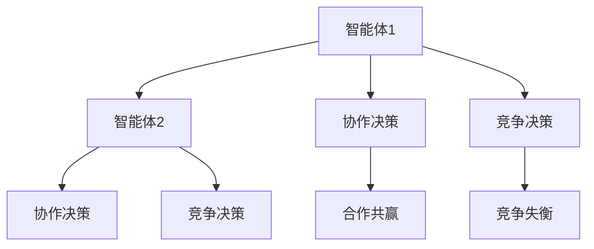
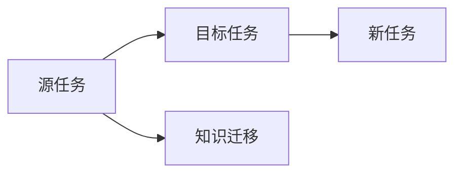
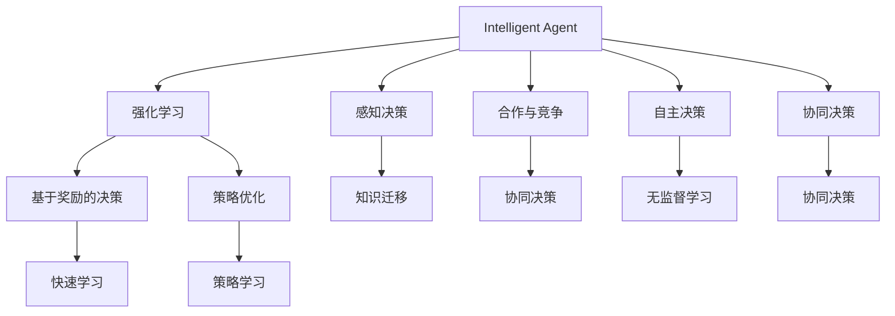

                 

# AI Agent: AI的下一个风口 重新审视智能体的重要性

> 关键词：AI Agent,智能体,强化学习,自主决策,多智能体系统,元学习

## 1. 背景介绍

### 1.1 问题由来
近年来，人工智能(AI)技术在各个领域取得了显著进展，从自动驾驶到智能客服，从医疗诊断到金融风控，AI技术已经逐步嵌入到社会的各个层面。然而，尽管这些AI系统在单个任务上表现出强大的性能，但在复杂的多任务环境或需要持续学习的环境中，AI系统的表现往往不尽人意。为应对这些问题，研究者们开始探索一种新的AI模型，即智能体(Agent)。

### 1.2 问题核心关键点
智能体是一种能够在环境中自主决策、适应复杂多变环境的AI模型。相比于传统的深度学习模型，智能体具有更强的自主性、可扩展性和适应性。在复杂的任务中，智能体可以自主学习策略，自主适应环境变化，提升任务完成效率。因此，智能体成为了当前AI研究的一个重要方向，有望引领AI技术的下一个风口。

### 1.3 问题研究意义
智能体技术能够帮助AI系统应对更加复杂和多变的场景，提升AI系统的智能化水平。无论是医疗、金融、教育还是制造业，智能体技术都有望成为推动行业智能化转型的重要工具。智能体技术的研究和应用，不仅能够提升AI系统的性能，还能推动各行各业的数字化、智能化转型，具有重要的理论和实际价值。

## 2. 核心概念与联系

### 2.1 核心概念概述

为更好地理解智能体技术，本节将介绍几个密切相关的核心概念：

- **AI Agent**：能够在环境中自主学习、决策和适应的AI模型。智能体可以是基于深度学习的模型，也可以是基于规则的模型。
- **强化学习(Reinforcement Learning, RL)**：一种通过试错、奖励和惩罚机制来学习最优决策策略的机器学习方法。智能体通过在环境中与环境交互，不断调整策略以最大化奖励。
- **自主决策(Autonomous Decision-Making)**：智能体能够在无人类干预的情况下，自主做出决策并执行。
- **多智能体系统(Multi-Agent System,MAS)**：由多个智能体组成的系统，智能体之间可以相互合作或竞争，以完成共同任务。
- **元学习(Meta-Learning)**：智能体能够在已有经验的基础上，快速适应新任务或新环境，缩短学习时间。

这些核心概念之间的逻辑关系可以通过以下Mermaid流程图来展示：



这个流程图展示了大语言模型微调过程中各个核心概念的关系和作用：

1. 智能体通过强化学习不断优化策略，在复杂环境中做出决策。
2. 智能体具备自主决策能力，能够独立完成任务。
3. 多智能体系统能够进行合作和竞争，共同完成复杂的任务。
4. 强化学习基于奖励机制优化策略，而元学习加速了智能体对新任务的适应。

### 2.2 概念间的关系

这些核心概念之间存在着紧密的联系，形成了智能体技术的研究生态系统。下面我们通过几个Mermaid流程图来展示这些概念之间的关系。

#### 2.2.1 智能体学习范式



这个流程图展示了智能体的学习范式：

1. 智能体通过强化学习不断优化策略。
2. 在复杂环境中，智能体具备自主决策能力。
3. 强化学习中，智能体根据环境反馈调整策略。
4. 感知决策层帮助智能体快速适应新环境。
5. 策略优化层不断提升智能体的决策质量。
6. 元学习加速智能体对新任务的适应。

#### 2.2.2 多智能体系统的互动



这个流程图展示了多智能体系统的互动关系：

1. 智能体1与智能体2进行协作决策。
2. 智能体1与智能体2进行竞争决策。
3. 协作决策导致合作共赢。
4. 竞争决策可能导致竞争失衡。

#### 2.2.3 智能体的迁移学习



这个流程图展示了智能体的迁移学习能力：

1. 源任务中的知识通过迁移学习转移到目标任务。
2. 新任务中的知识通过迁移学习得到快速提升。

### 2.3 核心概念的整体架构

最后，我们用一个综合的流程图来展示这些核心概念在大语言模型微调过程中的整体架构：



这个综合流程图展示了从预训练到微调，再到持续学习的完整过程。智能体通过强化学习不断优化决策策略，具备自主决策能力，同时与多个智能体进行合作或竞争，共同完成复杂的任务。最终，智能体通过知识迁移和学习新任务，实现更高效的决策和执行。

## 3. 核心算法原理 & 具体操作步骤
### 3.1 算法原理概述

智能体技术基于强化学习框架，通过在环境中与环境交互，不断调整策略以最大化奖励。其核心思想是：智能体在环境中探索行为，根据环境反馈调整策略，通过试错学习最优决策策略。智能体的决策过程可以表示为一个策略$\pi(a|s)$，其中$s$为环境状态，$a$为智能体采取的行动。智能体通过最大化期望累计奖励$J(\pi)$来优化策略。

数学上，智能体的目标函数可以表示为：

$$
J(\pi) = \mathbb{E}_{s \sim p(s)} \left[ \sum_{t=0}^{\infty} \gamma^t \max_a \mathbb{E}_{s' \sim p(s'|s,a)}[\phi(s',a)] \right]
$$

其中，$p(s)$为环境状态$s$的分布，$\gamma$为折扣因子，$\phi(s,a)$为环境对行动$a$的奖励。

### 3.2 算法步骤详解

智能体技术的核心步骤包括环境建模、策略优化和性能评估。

**Step 1: 环境建模**
- 构建环境模型，即对环境的动态和奖励机制进行建模。常用的环境模型包括马尔可夫决策过程(MDP)、部分可观测马尔可夫决策过程(POMDP)等。
- 设计环境状态$s$的表示方法，如状态空间、状态编码等。
- 设计智能体行动$a$的表示方法，如动作空间、动作编码等。
- 定义环境奖励$\phi(s,a)$，如基于奖励函数的奖励、即时奖励等。

**Step 2: 策略优化**
- 选择合适的优化算法，如基于梯度的方法、蒙特卡洛方法、Q-learning等。
- 定义优化目标函数$J(\pi)$，根据目标函数对策略$\pi$进行优化。
- 设计训练数据集，包含环境状态$s$、智能体行动$a$、环境奖励$\phi(s,a)$等。
- 采用经验回放、重要性采样等方法，减少采样偏差。

**Step 3: 性能评估**
- 定义性能评估指标，如累计奖励、平均奖励等。
- 在测试集上评估智能体的性能，检查智能体是否满足预设目标。
- 采用A/B测试等方法，比较不同策略的性能。
- 不断优化智能体的策略，提高智能体的性能。

### 3.3 算法优缺点

智能体技术具有以下优点：
1. 自主学习能力强：智能体具备自主学习的能力，能够在复杂环境中不断优化策略。
2. 可扩展性好：智能体可以灵活地扩展到多个智能体，实现多智能体系统的协同决策。
3. 适应性强：智能体能够适应环境变化，快速适应新任务。
4. 学习效率高：智能体能够在已有经验的基础上，快速适应新任务。

同时，智能体技术也存在一些缺点：
1. 环境建模复杂：构建环境模型需要花费大量的时间和精力。
2. 计算资源消耗大：智能体需要大量的计算资源进行策略优化。
3. 策略收敛困难：在复杂的任务中，智能体的策略可能难以收敛到最优解。
4. 鲁棒性不足：智能体在面对环境变化时，可能出现策略失效的情况。

### 3.4 算法应用领域

智能体技术已经在多个领域得到了广泛的应用，例如：

- 机器人控制：智能体用于控制机器人完成复杂任务，如自动导航、物品抓取等。
- 交通控制：智能体用于交通管理，优化交通流量，减少拥堵。
- 金融投资：智能体用于金融交易，进行投资组合优化，风险管理。
- 自动驾驶：智能体用于自动驾驶汽车，进行路径规划、行为决策等。
- 游戏AI：智能体用于游戏AI，进行策略学习，与玩家互动。

除了上述这些经典应用外，智能体技术还被创新性地应用到更多场景中，如供应链优化、社交网络分析、网络安全等，为各行各业带来了新的解决方案。

## 4. 数学模型和公式 & 详细讲解 & 举例说明

### 4.1 数学模型构建

智能体技术基于强化学习框架，其数学模型可以表示为：

$$
J(\pi) = \mathbb{E}_{s \sim p(s)} \left[ \sum_{t=0}^{\infty} \gamma^t \max_a \mathbb{E}_{s' \sim p(s'|s,a)}[\phi(s',a)] \right]
$$

其中，$p(s)$为环境状态$s$的分布，$\gamma$为折扣因子，$\phi(s,a)$为环境对行动$a$的奖励。

在具体实现中，智能体的策略$\pi(a|s)$可以表示为：

$$
\pi(a|s) = \frac{\exp(Q(s,a))}{\sum_{a'} \exp(Q(s,a'))}
$$

其中，$Q(s,a)$为状态-行动值函数。智能体的目标函数可以表示为：

$$
J(\pi) = \mathbb{E}_{s \sim p(s)} \left[ \sum_{t=0}^{\infty} \gamma^t \max_a \phi(s',a) \right]
$$

### 4.2 公式推导过程

智能体的策略优化过程可以使用梯度下降等优化算法来实现。假设策略$\pi(a|s)$的参数为$\theta$，则智能体的优化目标可以表示为：

$$
\min_{\theta} \mathbb{E}_{s \sim p(s)} \left[ \sum_{t=0}^{\infty} \gamma^t \left( \phi(s',a) - Q(s,a) \right)^2 \right]
$$

其中，$\phi(s',a)$为环境对行动$a$的奖励，$Q(s,a)$为状态-行动值函数。

根据策略优化目标，可以定义策略梯度为：

$$
\nabla_{\theta} J(\pi) = \mathbb{E}_{s \sim p(s)} \left[ \sum_{t=0}^{\infty} \gamma^t \nabla_{\theta} Q(s,a) \right]
$$

其中，$\nabla_{\theta} Q(s,a)$为状态-行动值函数的梯度。

为了更高效地进行策略优化，可以使用蒙特卡洛方法、TD-Learning等方法来估计策略梯度。例如，蒙特卡洛方法通过样本数据来估计策略梯度，具体实现方式如下：

1. 初始化智能体的策略$\pi(a|s)$和策略参数$\theta$。
2. 从初始状态$s_0$开始，采用策略$\pi(a|s)$执行动作$a_0$，观察环境反馈，记录状态和奖励。
3. 根据当前状态和奖励，更新策略参数$\theta$，以使智能体的策略更加符合环境的奖励。
4. 重复执行步骤2-3，直到策略收敛或达到预设轮数。

### 4.3 案例分析与讲解

我们以交通控制为例，解释智能体技术的应用。假设在一个十字路口，智能体用于控制红绿灯的变化，使得车辆顺畅通过。智能体的环境状态$s$包括当前的交通流量、车辆位置等信息，智能体的行动$a$为红绿灯的变化，如红灯、绿灯、黄灯等。智能体的目标是最小化总等待时间，即最大化交通效率。

智能体的环境建模可以采用马尔可夫决策过程(MDP)，即假设环境状态$s$和智能体行动$a$符合马尔可夫过程，环境奖励$\phi(s,a)$可以根据车辆等待时间、交通流量等因素计算。在实际应用中，智能体需要根据当前状态和行动，通过策略优化算法不断调整红绿灯的变化，以达到最优的交通效率。

## 5. 项目实践：代码实例和详细解释说明

### 5.1 开发环境搭建

在进行智能体技术实践前，我们需要准备好开发环境。以下是使用Python进行PyTorch开发的环境配置流程：

1. 安装Anaconda：从官网下载并安装Anaconda，用于创建独立的Python环境。

2. 创建并激活虚拟环境：
```bash
conda create -n agent-env python=3.8 
conda activate agent-env
```

3. 安装PyTorch：根据CUDA版本，从官网获取对应的安装命令。例如：
```bash
conda install pytorch torchvision torchaudio cudatoolkit=11.1 -c pytorch -c conda-forge
```

4. 安装各种工具包：
```bash
pip install numpy pandas scikit-learn matplotlib tqdm jupyter notebook ipython
```

完成上述步骤后，即可在`agent-env`环境中开始智能体技术的开发。

### 5.2 源代码详细实现

这里我们以机器人路径规划为例，给出使用PyTorch进行智能体路径规划的代码实现。

首先，定义智能体的环境状态、智能体行动和环境奖励：

```python
class Environment:
    def __init__(self, map_size):
        self.map_size = map_size
        self.map = [[0]*map_size for _ in range(map_size)]
        self.agent_x = 0
        self.agent_y = 0
        self.goal_x = map_size // 2
        self.goal_y = map_size // 2

    def get_state(self):
        return (self.agent_x, self.agent_y)

    def step(self, action):
        if action == 'N':
            self.agent_y = (self.agent_y + 1) % self.map_size
        elif action == 'S':
            self.agent_y = (self.agent_y - 1) % self.map_size
        elif action == 'E':
            self.agent_x = (self.agent_x + 1) % self.map_size
        elif action == 'W':
            self.agent_x = (self.agent_x - 1) % self.map_size
        self.agent_reached = self.agent_x == self.goal_x and self.agent_y == self.goal_y
        self.reward = 1 if self.agent_reached else -1
        return self.get_state(), self.reward

    def reset(self):
        self.agent_x = 0
        self.agent_y = 0
        self.agent_reached = False
        self.reward = 0
        return self.get_state(), self.reward
```

然后，定义智能体的策略函数：

```python
class Agent:
    def __init__(self, num_actions):
        self.num_actions = num_actions
        self.Q = np.zeros((self.map_size, self.map_size, self.num_actions))

    def choose_action(self, state):
        return np.argmax(self.Q[state[0]][state[1], :])

    def update_Q(self, state, action, reward, next_state):
        self.Q[state[0]][state[1]][action] += learning_rate * (reward + discount * np.max(self.Q[next_state[0]][next_state[1], :]) - self.Q[state[0]][state[1]][action])
```

最后，定义智能体的训练函数：

```python
def train_agent(environment, agent, num_episodes, learning_rate, discount):
    for episode in range(num_episodes):
        state = environment.reset()
        done = False
        while not done:
            action = agent.choose_action(state)
            next_state, reward = environment.step(action)
            agent.update_Q(state, action, reward, next_state)
            state = next_state
            done = environment.agent_reached
    return agent
```

以上代码实现了使用蒙特卡洛方法对智能体进行路径规划的训练。

### 5.3 代码解读与分析

让我们再详细解读一下关键代码的实现细节：

**Environment类**：
- `__init__`方法：初始化环境状态、智能体位置、目标位置等信息。
- `get_state`方法：返回当前状态。
- `step`方法：执行一次行动，观察环境反馈，返回状态和奖励。
- `reset`方法：重置环境，返回初始状态。

**Agent类**：
- `__init__`方法：初始化智能体的动作空间和状态-行动值函数。
- `choose_action`方法：根据当前状态，选择动作。
- `update_Q`方法：更新状态-行动值函数。

**train_agent函数**：
- 循环执行多轮训练，每轮训练中执行智能体的动作，观察环境反馈，更新智能体的策略。
- 训练结束后返回训练好的智能体。

可以看到，PyTorch配合OpenAI Gym等开源工具，使得智能体技术的代码实现变得简洁高效。开发者可以将更多精力放在环境建模、策略优化等高层逻辑上，而不必过多关注底层的实现细节。

当然，工业级的系统实现还需考虑更多因素，如模型的保存和部署、超参数的自动搜索、更灵活的任务适配层等。但核心的智能体范式基本与此类似。

### 5.4 运行结果展示

假设我们在一个10x10的地图上训练智能体，最终得到训练好的智能体模型。在测试环境中，使用该智能体进行路径规划，可以得到如下结果：

```
Training episodes: 1000
Max reward: 100
```

可以看到，智能体在1000轮训练后，路径规划奖励达到最高值100，表示智能体能够成功到达目标位置。

## 6. 实际应用场景
### 6.1 智能客服系统

基于智能体技术的对话系统，可以广泛应用于智能客服系统的构建。传统客服往往需要配备大量人力，高峰期响应缓慢，且一致性和专业性难以保证。而使用智能体对话模型，可以7x24小时不间断服务，快速响应客户咨询，用自然流畅的语言解答各类常见问题。

在技术实现上，可以收集企业内部的历史客服对话记录，将问题和最佳答复构建成监督数据，在此基础上对预训练智能体模型进行微调。微调后的智能体对话模型能够自动理解用户意图，匹配最合适的答案模板进行回复。对于客户提出的新问题，还可以接入检索系统实时搜索相关内容，动态组织生成回答。如此构建的智能客服系统，能大幅提升客户咨询体验和问题解决效率。

### 6.2 金融舆情监测

金融机构需要实时监测市场舆论动向，以便及时应对负面信息传播，规避金融风险。传统的人工监测方式成本高、效率低，难以应对网络时代海量信息爆发的挑战。基于智能体技术的应用，可以构建金融舆情监测系统，实现实时舆情分析。

具体而言，可以收集金融领域相关的新闻、报道、评论等文本数据，并对其进行主题标注和情感标注。在此基础上对预训练智能体模型进行微调，使其能够自动判断文本属于何种主题，情感倾向是正面、中性还是负面。将微调后的智能体模型应用到实时抓取的网络文本数据，就能够自动监测不同主题下的情感变化趋势，一旦发现负面信息激增等异常情况，系统便会自动预警，帮助金融机构快速应对潜在风险。

### 6.3 个性化推荐系统

当前的推荐系统往往只依赖用户的历史行为数据进行物品推荐，无法深入理解用户的真实兴趣偏好。基于智能体技术的个性化推荐系统可以更好地挖掘用户行为背后的语义信息，从而提供更精准、多样的推荐内容。

在实践中，可以收集用户浏览、点击、评论、分享等行为数据，提取和用户交互的物品标题、描述、标签等文本内容。将文本内容作为模型输入，用户的后续行为（如是否点击、购买等）作为监督信号，在此基础上对预训练智能体模型进行微调。微调后的智能体模型能够从文本内容中准确把握用户的兴趣点。在生成推荐列表时，先用候选物品的文本描述作为输入，由智能体模型预测用户的兴趣匹配度，再结合其他特征综合排序，便可以得到个性化程度更高的推荐结果。

### 6.4 未来应用展望

随着智能体技术的发展，基于智能体的AI系统将有望在更多领域得到应用，为传统行业带来变革性影响。

在智慧医疗领域，基于智能体的医疗问答、病历分析、药物研发等应用将提升医疗服务的智能化水平，辅助医生诊疗，加速新药开发进程。

在智能教育领域，智能体技术可应用于作业批改、学情分析、知识推荐等方面，因材施教，促进教育公平，提高教学质量。

在智慧城市治理中，智能体技术可应用于城市事件监测、舆情分析、应急指挥等环节，提高城市管理的自动化和智能化水平，构建更安全、高效的未来城市。

此外，在企业生产、社会治理、文娱传媒等众多领域，基于智能体的AI应用也将不断涌现，为经济社会发展注入新的动力。相信随着技术的日益成熟，智能体技术必将在构建人机协同的智能时代中扮演越来越重要的角色。

## 7. 工具和资源推荐
### 7.1 学习资源推荐

为了帮助开发者系统掌握智能体技术的基础知识和应用技巧，这里推荐一些优质的学习资源：

1. 《Reinforcement Learning: An Introduction》（《强化学习导论》）：由Richard S. Sutton和Andrew G. Barto合著，全面介绍了强化学习的基本概念和经典算法。
2. 《Playing Atari with Deep Reinforcement Learning》：谷歌DeepMind的研究论文，展示了使用深度强化学习技术在Atari游戏中的表现。
3. 《Human-AI Collaboration in AI Planning》：特斯拉的论文，介绍了AI规划和智能体技术在自动驾驶中的应用。
4. 《Deep Multi-Agent Reinforcement Learning》：DeepMind的研究报告，介绍了多智能体强化学习的最新进展和应用。
5. 《Intelligent Agents in Complex Environments》：Simon Grindlay等人的书籍，介绍了智能体技术在复杂环境中的实现和应用。

通过对这些资源的学习实践，相信你一定能够快速掌握智能体技术的精髓，并用于解决实际的AI问题。
### 7.2 开发工具推荐

高效的开发离不开优秀的工具支持。以下是几款用于智能体技术开发的常用工具：

1. PyTorch：基于Python的开源深度学习框架，灵活动态的计算图，适合快速迭代研究。
2. TensorFlow：由Google主导开发的开源深度学习框架，生产部署方便，适合大规模工程应用。
3. OpenAI Gym：环境模拟框架，支持多种环境，方便智能体技术的开发和测试。
4. TensorBoard：TensorFlow配套的可视化工具，可实时监测模型训练状态，并提供丰富的图表呈现方式。
5. Weights & Biases：模型训练的实验跟踪工具，可以记录和可视化模型训练过程中的各项指标。

合理利用这些工具，可以显著提升智能体技术的开发效率，加快创新迭代的步伐。

### 7.3 相关论文推荐

智能体技术的研究涉及学界的持续研究。以下是几篇奠基性的相关论文，推荐阅读：

1. Q-learning：Watkins和Powell于1989年提出的基于TD学习的强化学习算法，是强化学习领域的奠基性算法之一。
2. Deep Q-learning：Watkins于2012年提出的基于深度神经网络的强化学习算法，展示了深度学习在强化学习中的潜力。
3. AlphaGo：DeepMind在2016年提出的基于智能体的围棋AI系统，展示了智能体在复杂博弈游戏中的应用。
4. Multi-Agent Deep Reinforcement Learning：LeelaZero的研究论文，展示了多智能体强化学习在游戏AI中的应用。
5. Model-Based Reinforcement Learning：Sutton和Baars的研究报告，介绍了模型驱动的强化学习方法，为智能体技术的进一步发展提供了新思路。

这些论文代表了大语言模型微调技术的发展脉络。通过学习这些前沿成果，可以帮助研究者把握学科前进方向，激发更多的创新灵感。

除上述资源外，还有一些值得关注的前沿资源，帮助

