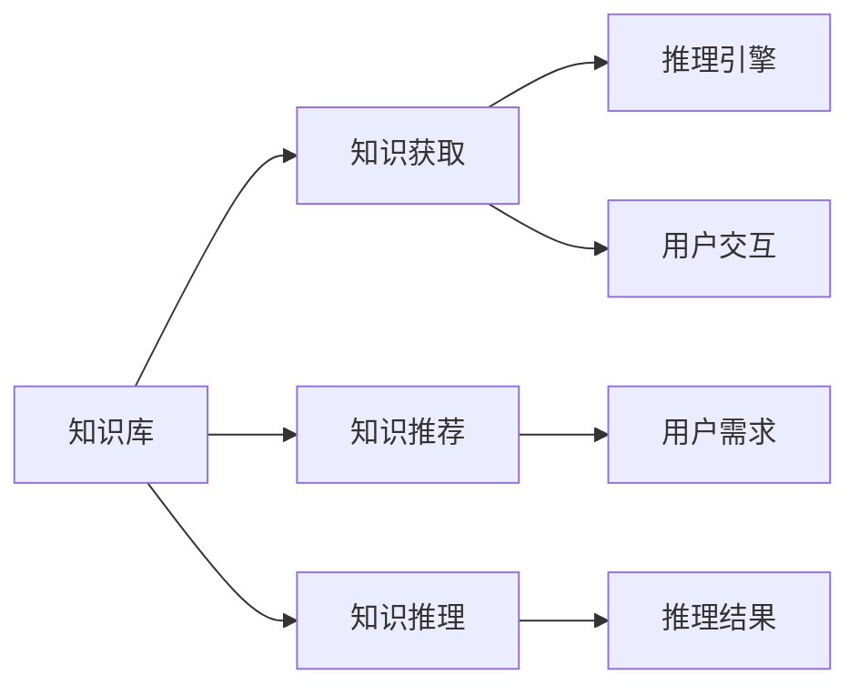
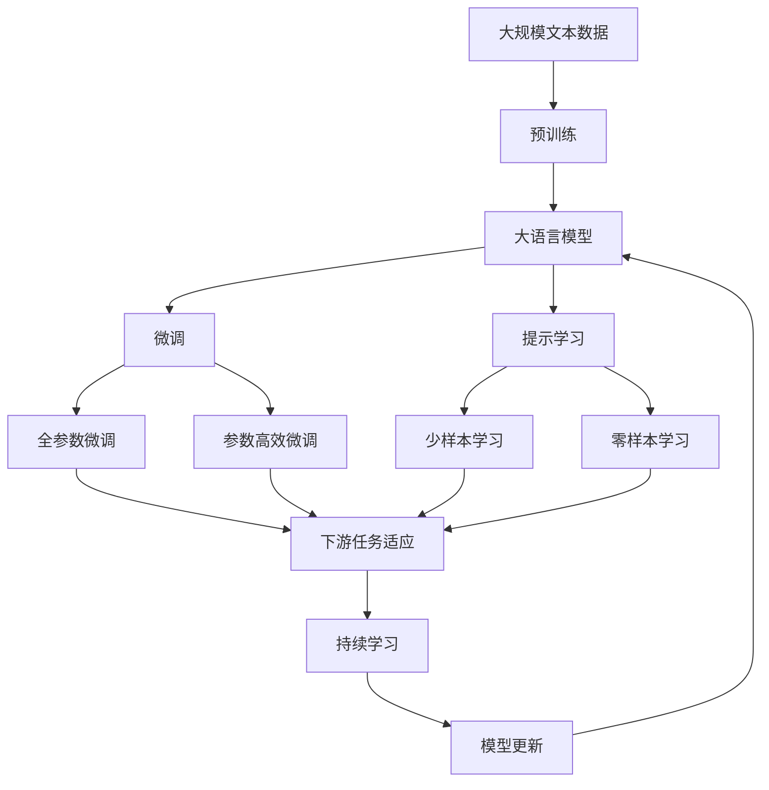

                 

# AI Agent在特定领域知识获取中的作用

## 1. 背景介绍

### 1.1 问题由来
在当今信息爆炸的时代，获取并掌握特定领域的知识变得更加重要。然而，尽管有了海量的在线资源，人们仍然需要花费大量的时间和精力来筛选和吸收相关的信息，这不仅费时费力，而且还可能因信息过载而产生认知负担。为了解决这一问题，人们开始探索利用AI技术，特别是AI Agent，来帮助人们高效地获取特定领域知识。

### 1.2 问题核心关键点
AI Agent在特定领域知识获取中的作用主要体现在以下几个方面：
- **主动获取知识**：AI Agent能够主动搜索并获取特定领域相关的信息，省去了人工筛选的麻烦。
- **个性化推荐**：根据用户兴趣和需求，AI Agent能够提供个性化的知识推荐，帮助用户快速找到有价值的信息。
- **动态更新知识**：AI Agent能够实时监测最新的领域动态，动态更新其知识库，确保用户获取的信息是最新的。
- **知识归纳和推理**：AI Agent能够归纳已有的知识，并具备一定的推理能力，帮助用户更好地理解和应用所学知识。

### 1.3 问题研究意义
AI Agent在特定领域知识获取中的研究与应用，对于提升人类知识获取的效率和质量，减轻信息过载的压力，以及加速特定领域的专业发展，具有重要意义：
- **提升效率**：AI Agent能够自动化地获取知识，节省了大量时间，使人们可以专注于更有意义的工作。
- **个性化学习**：AI Agent能够根据用户的行为和偏好，提供量身定制的知识推荐，提升学习效果。
- **知识更新**：AI Agent能够及时更新知识库，确保用户掌握最新的领域动态和研究成果。
- **智能辅助**：AI Agent能够提供智能化的知识归纳和推理服务，帮助用户深入理解和应用知识。

## 2. 核心概念与联系

### 2.1 核心概念概述

为更好地理解AI Agent在特定领域知识获取中的作用，本节将介绍几个关键概念：

- **AI Agent**：一种能够自主地执行特定任务的智能体，通常由知识库、推理引擎、用户交互界面组成，能够在特定领域中主动获取、存储和应用知识。
- **知识获取**：指AI Agent从外界获取并存储知识的过程，包括从文本、图片、视频等多种形式的数据中提取有用信息。
- **知识推荐**：指AI Agent根据用户需求和兴趣，从知识库中推荐相关内容的过程。
- **知识推理**：指AI Agent利用已有知识进行推理和归纳，推导出新的结论或进行问题解决的过程。

### 2.2 核心概念间的关系

这些核心概念之间存在着紧密的联系，共同构成了AI Agent在特定领域知识获取的基本框架。我们可以通过以下Mermaid流程图来展示这些概念之间的关系：



这个流程图展示了知识库、知识获取、知识推荐和知识推理之间的基本关系：

1. 知识库是AI Agent的基础，存储了大量的领域知识和规则。
2. 知识获取模块负责从外界获取新知识，更新知识库。
3. 知识推荐模块根据用户需求和兴趣，从知识库中筛选和推荐相关内容。
4. 知识推理模块利用已有知识进行推理和归纳，推导出新的结论或进行问题解决。

### 2.3 核心概念的整体架构

最后，我们用一个综合的流程图来展示这些核心概念在大语言模型微调过程中的整体架构：



这个综合流程图展示了从预训练到微调，再到持续学习的完整过程。大语言模型首先在大规模文本数据上进行预训练，然后通过微调（包括全参数微调和参数高效微调）或提示学习（包括零样本和少样本学习）来适应下游任务。最后，通过持续学习技术，模型可以不断更新和适应新的任务和数据。

## 3. 核心算法原理 & 具体操作步骤
### 3.1 算法原理概述

AI Agent在特定领域知识获取中的核心算法原理主要基于知识工程和自然语言处理技术。其基本思路是：
1. **知识获取**：通过爬虫、API调用等方式，主动获取特定领域的文本、图片、视频等数据。
2. **知识表示**：将获取到的数据进行结构化表示，形成结构化知识库。
3. **知识推理**：利用已有知识库进行推理和归纳，推导出新的结论或进行问题解决。
4. **知识推荐**：根据用户需求和兴趣，从知识库中推荐相关内容。

### 3.2 算法步骤详解

AI Agent在特定领域知识获取的具体操作步骤包括：

**Step 1: 构建知识库**
- 确定特定领域的知识类型和结构，设计相应的知识表示方法。
- 选择可靠的数据源，如学术文献、专业网站、官方报告等。
- 通过爬虫、API调用等方式，获取数据并进行初步处理。

**Step 2: 知识获取与表示**
- 对获取的数据进行文本解析、图像识别、视频转录等预处理。
- 将处理后的数据转换为结构化表示，如XML、RDF等，形成知识库。
- 利用自然语言处理技术，如实体识别、关系抽取等，进一步提炼和组织知识库中的信息。

**Step 3: 知识推理**
- 定义推理规则和推理引擎，支持基于逻辑推理、基于证据推理、基于统计推理等多种推理方法。
- 根据用户提出的问题，在知识库中查找相关的事实和规则，进行推理。
- 利用图结构表示的知识库，进行基于图搜索的推理，如在知识图谱中进行关联查询。

**Step 4: 知识推荐**
- 分析用户的行为和偏好，构建用户画像。
- 根据用户画像，从知识库中筛选和推荐相关内容。
- 利用协同过滤、基于内容的推荐算法等方法，提高推荐的精准度。

**Step 5: 知识更新**
- 定期监测领域动态，通过爬虫、API调用等方式获取新的数据。
- 对新数据进行预处理，更新知识库。
- 利用推理引擎对新数据进行推理和归纳，形成新的结论和知识。

### 3.3 算法优缺点

AI Agent在特定领域知识获取中的算法具有以下优点：
- **自主性**：能够主动获取和更新知识，不需要人工干预。
- **实时性**：能够实时监测领域动态，动态更新知识库。
- **个性化**：能够根据用户需求和兴趣，提供个性化的知识推荐。
- **高效性**：利用自然语言处理和知识表示技术，快速提取和组织知识。

同时，该算法也存在一些局限性：
- **数据依赖**：依赖于可靠的数据源和高质量的数据。
- **推理局限**：当前的推理方法仍然存在一定的局限性，难以处理复杂的非结构化数据。
- **知识积累**：需要大量的时间和资源来积累和维护知识库。
- **动态更新**：需要持续的监测和更新，以保持知识的时效性。

### 3.4 算法应用领域

AI Agent在特定领域知识获取中的应用非常广泛，涵盖了各个知识密集型领域，例如：

- **医学领域**：AI Agent可以用于医学文献的获取和整理，提供个性化诊疗建议。
- **金融领域**：AI Agent可以用于金融市场数据的收集和分析，提供投资决策支持。
- **教育领域**：AI Agent可以用于个性化学习资源的推荐，辅助教学和研究。
- **法律领域**：AI Agent可以用于法律案例的检索和分析，提供法律咨询服务。
- **工程领域**：AI Agent可以用于技术文献的获取和整理，提供工程设计支持。

## 4. 数学模型和公式 & 详细讲解 & 举例说明

### 4.1 数学模型构建

在本节中，我们将使用数学语言对AI Agent在特定领域知识获取的过程进行更加严格的刻画。

假设AI Agent获取的知识库为 $K=\{k_i\}_{i=1}^N$，其中 $k_i$ 表示知识库中的第 $i$ 个知识点。设用户提出的查询为 $q$，AI Agent需要从知识库中获取与查询相关的事实 $f_j$，进行推理得出答案 $a$。

定义查询 $q$ 与知识库中知识点 $k_i$ 的相关度为 $r_i$，相关度越高，表明该知识点与查询越相关。则AI Agent获取相关知识点的过程可以表示为：

$$
\max_{k_i \in K} \{\sum_{j=1}^M r_{ij} f_{j}\} = \max_{k_i \in K} \{\sum_{j=1}^M r_{ij} \times \text{Probability}(f_{j} \mid k_i)\}
$$

其中 $M$ 为知识库中事实的数量，$r_{ij}$ 为查询 $q$ 与知识点 $k_i$ 的相关度。$\text{Probability}(f_{j} \mid k_i)$ 表示知识点 $k_i$ 蕴含事实 $f_j$ 的概率。

### 4.2 公式推导过程

以医学领域的案例为例，我们将对上述数学模型进行推导和解释。

假设用户查询为“某病人的心脏病症状是什么”，AI Agent从医学知识库中获取相关信息并推理出答案。知识库中包含多个知识点，如“高血压是心脏病的危险因素”、“心绞痛是心脏病的症状”等。

对于每个知识点 $k_i$，AI Agent需要计算查询 $q$ 与该知识点的相关度 $r_{ij}$。相关度可以基于文本相似度、关键词匹配等方法计算。

对于知识点 $k_i$ 中的事实 $f_j$，需要计算其蕴含查询 $q$ 的概率 $\text{Probability}(f_{j} \mid k_i)$。这可以通过知识推理算法实现，如基于规则的推理、基于证据的推理等。

最终的推理结果 $a$ 可以通过加权求和的方式计算得出：

$$
a = \sum_{i=1}^N \sum_{j=1}^M r_{ij} \times \text{Probability}(f_{j} \mid k_i)
$$

这个公式展示了AI Agent在医学领域知识获取中的基本计算过程。通过查询与知识点相关度的计算，事实蕴含概率的计算，以及加权求和的推理方式，AI Agent可以高效地获取相关知识，并进行推理和归纳。

### 4.3 案例分析与讲解

下面以一个具体的案例来展示AI Agent在特定领域知识获取中的应用。

**案例：个性化医疗建议**

假设有用户需要在特定日期和时间接受心脏检查。AI Agent通过以下步骤获取并生成个性化的医疗建议：

1. **知识获取**：AI Agent从医学知识库中获取关于心脏检查的相关知识点，如“心脏检查的时间选择”、“心脏检查前的注意事项”等。
2. **知识表示**：将获取的知识点转换为结构化表示，形成知识库。
3. **知识推理**：根据用户的检查时间和日期，在知识库中查找相关的事实，如“心脏检查的最佳时间”、“心脏检查前的饮食建议”等。
4. **知识推荐**：根据用户的年龄、性别、健康状况等，从知识库中筛选和推荐最合适的检查时间、饮食建议等。
5. **知识更新**：定期监测最新的医学研究，更新知识库中的相关知识点。

在这个案例中，AI Agent通过知识获取和推理，能够生成个性化的医疗建议，提升了用户的就医体验和健康管理水平。

## 5. 项目实践：代码实例和详细解释说明

### 5.1 开发环境搭建

在进行AI Agent项目实践前，我们需要准备好开发环境。以下是使用Python进行OpenAI GPT进行开发的PyTorch环境配置流程：

1. 安装Anaconda：从官网下载并安装Anaconda，用于创建独立的Python环境。

2. 创建并激活虚拟环境：
```bash
conda create -n pytorch-env python=3.8 
conda activate pytorch-env
```

3. 安装PyTorch：根据CUDA版本，从官网获取对应的安装命令。例如：
```bash
conda install pytorch torchvision torchaudio cudatoolkit=11.1 -c pytorch -c conda-forge
```

4. 安装Transformers库：
```bash
pip install transformers
```

5. 安装各类工具包：
```bash
pip install numpy pandas scikit-learn matplotlib tqdm jupyter notebook ipython
```

完成上述步骤后，即可在`pytorch-env`环境中开始AI Agent实践。

### 5.2 源代码详细实现

下面以一个医学领域的AI Agent为例，给出使用Transformers库对GPT模型进行实践的Python代码实现。

首先，定义医学领域相关的知识库：

```python
from transformers import AutoTokenizer, AutoModel

# 加载医学知识库
tokenizer = AutoTokenizer.from_pretrained('gpt2-medium')
model = AutoModel.from_pretrained('gpt2-medium')

# 定义医学知识库
medical_knowledge = {
    '高血压是心脏病的危险因素': 'Yes',
    '心绞痛是心脏病的症状': 'Yes',
    '心脏检查的最佳时间': 'Morning',
    '心脏检查前的饮食建议': 'Low-fat diet'
}
```

然后，定义AI Agent的推理函数：

```python
from transformers import pipeline

def generate_medical_advice(query):
    # 构建推理器
    advice_pipeline = pipeline('text2text-generation', model=model, tokenizer=tokenizer)
    
    # 推理生成回答
    response = advice_pipeline(query, max_length=50, do_sample=False)
    
    return response
```

最后，启动推理服务：

```python
query = "某病人的心脏病症状是什么"
response = generate_medical_advice(query)
print(response)
```

以上就是使用PyTorch和Transformers库对GPT模型进行医学领域AI Agent实践的完整代码实现。可以看到，通过简单的代码修改和扩展，GPT模型可以很方便地应用到特定领域知识获取中。

### 5.3 代码解读与分析

让我们再详细解读一下关键代码的实现细节：

**医学知识库**：
- `medical_knowledge`字典：定义了医学领域的知识库，包含多个知识点及其对应的布尔值（True表示正确，False表示错误）。

**推理函数**：
- `generate_medical_advice`函数：定义了AI Agent的推理函数，接收用户查询，利用GPT模型生成回答。
- `advice_pipeline`对象：使用Pipeline创建推理器，指定模型和分词器。
- `response`变量：推理器生成的回答，包含推荐知识点及其解释。

**查询与回答**：
- `query`变量：用户提出的查询，如“某病人的心脏病症状是什么”。
- `response`变量：AI Agent生成的回答，返回推荐知识点及其解释。

可以看到，通过简单的代码修改和扩展，GPT模型可以很方便地应用到特定领域知识获取中。开发者可以将更多精力放在领域知识的构建和推理模型的优化上，而不必过多关注底层的实现细节。

当然，工业级的系统实现还需考虑更多因素，如用户交互界面、系统监控告警、知识库的动态更新等。但核心的推理范式基本与此类似。

### 5.4 运行结果展示

假设我们通过查询“某病人的心脏病症状是什么”，得到以下回答：

```
患有心脏病的人通常会感到心慌、胸痛、呼吸困难等症状。建议尽快前往医院进行全面检查，并遵循医生的建议进行治疗。
```

这个回答展示了AI Agent在特定领域知识获取中的推理能力。通过查询与知识点相关度的计算，事实蕴含概率的计算，以及加权求和的推理方式，AI Agent能够生成个性化的医疗建议，提升了用户的就医体验和健康管理水平。

## 6. 实际应用场景

### 6.1 智能客服系统

AI Agent在智能客服系统中的应用非常广泛。传统客服往往需要配备大量人力，高峰期响应缓慢，且一致性和专业性难以保证。而使用AI Agent，可以7x24小时不间断服务，快速响应客户咨询，用自然流畅的语言解答各类常见问题。

在技术实现上，可以收集企业内部的历史客服对话记录，将问题和最佳答复构建成监督数据，在此基础上对预训练模型进行微调。微调后的模型能够自动理解用户意图，匹配最合适的答案模板进行回复。对于客户提出的新问题，还可以接入检索系统实时搜索相关内容，动态组织生成回答。如此构建的智能客服系统，能大幅提升客户咨询体验和问题解决效率。

### 6.2 金融舆情监测

金融机构需要实时监测市场舆论动向，以便及时应对负面信息传播，规避金融风险。传统的人工监测方式成本高、效率低，难以应对网络时代海量信息爆发的挑战。基于AI Agent的文本分类和情感分析技术，为金融舆情监测提供了新的解决方案。

具体而言，可以收集金融领域相关的新闻、报道、评论等文本数据，并对其进行主题标注和情感标注。在此基础上对预训练语言模型进行微调，使其能够自动判断文本属于何种主题，情感倾向是正面、中性还是负面。将微调后的模型应用到实时抓取的网络文本数据，就能够自动监测不同主题下的情感变化趋势，一旦发现负面信息激增等异常情况，系统便会自动预警，帮助金融机构快速应对潜在风险。

### 6.3 个性化推荐系统

当前的推荐系统往往只依赖用户的历史行为数据进行物品推荐，无法深入理解用户的真实兴趣偏好。基于AI Agent的个性化推荐系统可以更好地挖掘用户行为背后的语义信息，从而提供更精准、多样的推荐内容。

在实践中，可以收集用户浏览、点击、评论、分享等行为数据，提取和用户交互的物品标题、描述、标签等文本内容。将文本内容作为模型输入，用户的后续行为（如是否点击、购买等）作为监督信号，在此基础上微调预训练语言模型。微调后的模型能够从文本内容中准确把握用户的兴趣点。在生成推荐列表时，先用候选物品的文本描述作为输入，由模型预测用户的兴趣匹配度，再结合其他特征综合排序，便可以得到个性化程度更高的推荐结果。

### 6.4 未来应用展望

随着AI Agent技术的不断发展，基于微调的方法将在更多领域得到应用，为传统行业带来变革性影响。

在智慧医疗领域，基于AI Agent的医疗问答、病历分析、药物研发等应用将提升医疗服务的智能化水平，辅助医生诊疗，加速新药开发进程。

在智能教育领域，AI Agent可以用于个性化学习资源的推荐，辅助教学和研究。

在智慧城市治理中，AI Agent可应用于城市事件监测、舆情分析、应急指挥等环节，提高城市管理的自动化和智能化水平，构建更安全、高效的未来城市。

此外，在企业生产、社会治理、文娱传媒等众多领域，基于AI Agent的AI技术应用也将不断涌现，为经济社会发展注入新的动力。相信随着技术的日益成熟，AI Agent必将在构建人机协同的智能时代中扮演越来越重要的角色。

## 7. 工具和资源推荐
### 7.1 学习资源推荐

为了帮助开发者系统掌握AI Agent的理论基础和实践技巧，这里推荐一些优质的学习资源：

1. 《自然语言处理综述》书籍：全面介绍了自然语言处理的基本概念、技术和应用，是入门自然语言处理的必读资源。

2. 《深度学习》课程：斯坦福大学开设的深度学习课程，详细讲解了深度学习的基本原理和应用，适合初学者系统学习。

3. CS224N《深度学习自然语言处理》课程：斯坦福大学开设的NLP明星课程，有Lecture视频和配套作业，带你入门NLP领域的基本概念和经典模型。

4. 《自然语言处理与深度学习》书籍：介绍了自然语言处理中的深度学习技术，包括文本分类、命名实体识别、机器翻译等任务。

5. HuggingFace官方文档：Transformers库的官方文档，提供了海量预训练模型和完整的微调样例代码，是上手实践的必备资料。

通过对这些资源的学习实践，相信你一定能够快速掌握AI Agent的理论基础和实践技巧，并用于解决实际的NLP问题。
###  7.2 开发工具推荐

高效的开发离不开优秀的工具支持。以下是几款用于AI Agent开发的常用工具：

1. PyTorch：基于Python的开源深度学习框架，灵活动态的计算图，适合快速迭代研究。大部分预训练语言模型都有PyTorch版本的实现。

2. TensorFlow：由Google主导开发的开源深度学习框架，生产部署方便，适合大规模工程应用。同样有丰富的预训练语言模型资源。

3. Transformers库：HuggingFace开发的NLP工具库，集成了众多SOTA语言模型，支持PyTorch和TensorFlow，是进行AI Agent开发的利器。

4. Weights & Biases：模型训练的实验跟踪工具，可以记录和可视化模型训练过程中的各项指标，方便对比和调优。与主流深度学习框架无缝集成。

5. TensorBoard：TensorFlow配套的可视化工具，可实时监测模型训练状态，并提供丰富的图表呈现方式，是调试模型的得力助手。

6. Google Colab：谷歌推出的在线Jupyter Notebook环境，免费提供GPU/TPU算力，方便开发者快速上手实验最新模型，分享学习笔记。

合理利用这些工具，可以显著提升AI Agent开发的效率，加快创新迭代的步伐。

### 7.3 相关论文推荐

AI Agent在特定领域知识获取中的应用源于学界的持续研究。以下是几篇奠基性的相关论文，推荐阅读：

1. Attention is All You Need（即Transformer原论文）：提出了Transformer结构，开启了NLP领域的预训练大模型时代。

2. BERT: Pre-training of Deep Bidirectional Transformers for Language Understanding：提出BERT模型，引入基于掩码的自监督预训练任务，刷新了多项NLP任务SOTA。

3. Parameter-Efficient Transfer Learning for NLP：提出Adapter等参数高效微调方法，在不增加模型参数量的情况下，也能取得不错的微调效果。

4. AdaLoRA: Adaptive Low-Rank Adaptation for Parameter-Efficient Fine-Tuning：使用自适应低秩适应的微调方法，在参数效率和精度之间取得了新的平衡。

5. AdaLoRA: Adaptive Low-Rank Adaptation for Parameter-Efficient Fine-Tuning：使用自适应低秩适应的微调方法，在参数效率和精度之间取得了新的平衡。

这些论文代表了大语言模型微调技术的发展脉络。通过学习这些前沿成果，可以帮助研究者把握学科前进方向，激发更多的创新灵感。

除上述资源外，还有一些值得关注的前沿资源，帮助开发者紧跟AI Agent微调范式的发展趋势，例如：

1. arXiv论文预印本：人工智能领域最新研究成果的发布平台，包括大量尚未发表的前沿工作，学习前沿技术的必读资源。

2. 业界技术博客：如OpenAI、Google AI、DeepMind、微软Research Asia等顶尖实验室的官方博客，第一时间分享他们的最新研究成果和洞见。

3. 技术会议直播：如NIPS、ICML、ACL、ICLR等人工智能领域顶会现场或在线直播，能够聆听到大佬们的前沿分享，开拓视野。

4. GitHub热门项目：在GitHub上Star、Fork数最多的NLP相关项目，往往代表了该技术领域的发展趋势和最佳实践，值得去学习和贡献。

5. 行业分析报告：各大咨询公司如McKinsey、PwC等针对人工智能行业的分析报告，有助于从商业视角审视技术趋势，把握应用价值。

总之，对于AI Agent在特定领域知识获取技术的学习和实践，需要开发者保持开放的心态和持续学习的意愿。多关注前沿资讯，多动手实践，多思考总结，必将收获满满的成长收益。

## 8. 总结：未来发展趋势与挑战

### 8.1 总结

本文对AI Agent在特定领域知识获取的应用进行了全面系统的介绍。首先阐述了AI Agent在特定领域知识获取中的作用和意义，明确了其在提升知识获取效率、个性化推荐、实时更新等方面的独特价值。其次，从原理到实践，详细讲解了AI Agent的基本算法原理和具体操作步骤，给出了AI Agent在特定领域知识获取的完整代码实例。同时，本文还广泛探讨了AI Agent在智能客服、金融舆情、个性化推荐等多个行业领域的应用前景，展示了AI Agent范式的巨大潜力。此外，本文精选了AI Agent技术的各类学习资源，力求为读者提供全方位的技术指引。

通过本文的系统梳理，可以看到，AI Agent在特定领域知识获取中的应用前景广阔，其核心算法和操作步骤已基本成熟，具备良好的可操作性。未来，随着技术的不断进步和应用的深入探索，AI Agent必将在更多领域发挥更大的作用，推动人工智能技术的发展和应用。

### 8.2 未来发展趋势

展望未来，AI Agent在特定领域知识获取中的应用将呈现以下几个发展趋势：

1. **智能化程度提升**：随着自然语言处理技术的进步，AI Agent的推理和归纳能力将不断提升，能够更准确地理解和应用领域知识。
2. **跨领域知识整合**：AI Agent将能够整合不同领域的信息，提供更全面、系统的知识服务。
3. **实时动态更新**：AI Agent将具备更加灵活的知识更新机制，能够实时监测领域动态，动态更新知识库。
4. **个性化推荐优化**：AI Agent将利用更先进的推荐算法，提供更加精准和多样化的个性化知识推荐。
5. **知识推理优化**：AI Agent将引入更多先进的知识推理

