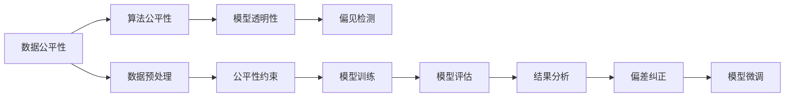

                 

# AI Fairness原理与代码实例讲解

> 关键词：AI公平性,数据偏见,算法透明性,模型可解释性,偏见检测,可解释AI

## 1. 背景介绍

### 1.1 问题由来
随着人工智能技术的广泛应用，数据偏见、算法歧视等问题逐渐凸显，引发了公众对AI伦理的关注。在很多场景中，AI系统因为训练数据的偏置，导致对某些群体的预测结果存在系统性偏差，这种不公平的现象被称为AI不公平（AI Bias）。例如，在招聘、贷款、司法判决等领域，基于历史数据训练的模型可能会因为数据的偏见，产生性别、种族等不公平的预测结果，严重损害了受影响群体（如女性、少数族裔）的权益。

这些问题并非空穴来风，而是基于大量实验数据的发现。例如，2018年，Google的一项研究发现，通过在30万份简历中训练的AI招聘模型，对女性和少数族裔的评估分数显著低于男性和白人。而这种偏见的存在，往往在模型部署后才会被注意到，给实际应用带来严重后果。

为应对这些问题，研究者提出了AI公平性（AI Fairness）的概念，并进行了广泛的研究。AI公平性旨在提升AI系统的透明度和公平性，确保其在各种应用场景下对不同群体具有平等对待的能力。本文将对AI公平性原理进行系统讲解，并通过代码实例展示如何在实践中实现AI公平性。

### 1.2 问题核心关键点
AI公平性涉及数据、算法、模型等多个环节，其核心目标是通过对数据和算法的改进，提升AI系统的透明度、可解释性和公平性。具体来说，AI公平性包含以下几个关键点：

- 数据公平性：保证训练数据中各群体样本的平衡，避免数据集中的偏见。
- 算法公平性：设计公平性约束算法，消除模型输出中的系统性偏差。
- 模型透明性：提升模型决策过程的可解释性，让使用者能理解模型的预测结果。
- 偏见检测：通过各种技术手段，识别和纠正模型中的偏见。

这些关键点构成了AI公平性的核心框架，旨在通过技术手段，提升AI系统的公平性和可信度，保护受影响群体的权益。

### 1.3 问题研究意义
研究AI公平性对于提升AI系统的公平性和可信度具有重要意义：

1. **提升系统公平性**：通过消除数据和算法中的偏见，提升AI系统在不同群体间的公平性，保护受影响群体的权益。
2. **增强系统透明度**：提升模型决策过程的可解释性，让使用者能够理解和信任AI系统，增强系统的透明度和可信度。
3. **促进技术健康发展**：确保AI技术不偏离伦理和道德的轨道，推动AI技术的健康发展。
4. **拓宽应用范围**：通过公平性改进，拓宽AI技术的应用范围，使其在更多场景下具有实际应用价值。

## 2. 核心概念与联系

### 2.1 核心概念概述

为更好地理解AI公平性的实现方法，本节将介绍几个密切相关的核心概念：

- **AI公平性（AI Fairness）**：指确保AI系统在各个应用场景中对不同群体具有平等对待的能力，消除数据和算法中的偏见。
- **数据公平性（Data Fairness）**：保证训练数据中各群体样本的平衡，避免数据集中的偏见。
- **算法公平性（Algorithmic Fairness）**：设计公平性约束算法，消除模型输出中的系统性偏差。
- **模型透明性（Model Transparency）**：提升模型决策过程的可解释性，让使用者能理解模型的预测结果。
- **偏见检测（Bias Detection）**：通过各种技术手段，识别和纠正模型中的偏见。

这些核心概念之间的逻辑关系可以通过以下Mermaid流程图来展示：


这个流程图展示了大语言模型的核心概念及其之间的关系：

1. 数据公平性保证训练数据的平衡，避免数据偏见。
2. 算法公平性通过设计公平性约束算法，消除模型输出中的系统性偏差。
3. 模型透明性提升模型决策过程的可解释性，让使用者能理解模型的预测结果。
4. 偏见检测通过各种技术手段，识别和纠正模型中的偏见。

这些核心概念共同构成了AI公平性的实现框架，通过技术手段，提升AI系统的公平性和可信度。通过理解这些核心概念，我们可以更好地把握AI公平性的工作原理和优化方向。

### 2.2 概念间的关系

这些核心概念之间存在着紧密的联系，形成了AI公平性的完整生态系统。下面我通过几个Mermaid流程图来展示这些概念之间的关系。

#### 2.2.1 AI公平性的实现步骤


这个流程图展示了AI公平性实现的基本步骤：

1. 数据预处理：对原始数据进行清洗、平衡等操作，保证训练数据公平性。
2. 模型训练：在公平性约束下，训练AI模型。
3. 模型评估：对训练好的模型进行公平性评估，识别出系统性偏差。
4. 结果分析：分析偏差原因，确定纠正方案。
5. 偏见纠正：通过各种技术手段，纠正模型中的偏见。
6. 模型微调：对纠正后的模型进行微调，提升公平性和性能。

#### 2.2.2 数据公平性的实现方法


这个流程图展示了数据公平性实现的基本步骤：

1. 数据预处理：对原始数据进行清洗、平衡等操作，保证训练数据公平性。
2. 公平性约束：设计公平性约束算法，保证模型输出公平性。
3. 模型训练：在公平性约束下，训练AI模型。
4. 模型评估：对训练好的模型进行公平性评估，识别出系统性偏差。
5. 偏见纠正：通过各种技术手段，纠正模型中的偏见。

#### 2.2.3 算法公平性的实现方法


这个流程图展示了算法公平性实现的基本步骤：

1. 公平性约束：设计公平性约束算法，保证模型输出公平性。
2. 模型训练：在公平性约束下，训练AI模型。
3. 模型评估：对训练好的模型进行公平性评估，识别出系统性偏差。
4. 结果分析：分析偏差原因，确定纠正方案。
5. 偏见纠正：通过各种技术手段，纠正模型中的偏见。
6. 模型微调：对纠正后的模型进行微调，提升公平性和性能。

#### 2.2.4 模型透明性的实现方法


这个流程图展示了模型透明性实现的基本步骤：

1. 数据预处理：对原始数据进行清洗、平衡等操作，保证训练数据公平性。
2. 模型训练：在公平性约束下，训练AI模型。
3. 模型评估：对训练好的模型进行公平性评估，识别出系统性偏差。
4. 结果分析：分析偏差原因，确定纠正方案。
5. 模型解释：提升模型决策过程的可解释性，让使用者能理解模型的预测结果。
6. 偏差纠正：通过各种技术手段，纠正模型中的偏见。
7. 模型微调：对纠正后的模型进行微调，提升公平性和性能。

#### 2.2.5 偏见检测的实现方法


这个流程图展示了偏见检测实现的基本步骤：

1. 数据预处理：对原始数据进行清洗、平衡等操作，保证训练数据公平性。
2. 模型训练：在公平性约束下，训练AI模型。
3. 模型评估：对训练好的模型进行公平性评估，识别出系统性偏差。
4. 结果分析：分析偏差原因，确定纠正方案。
5. 偏差检测：通过各种技术手段，识别和纠正模型中的偏见。
6. 模型微调：对纠正后的模型进行微调，提升公平性和性能。

### 2.3 核心概念的整体架构

最后，我们用一个综合的流程图来展示这些核心概念在大语言模型公平性实现过程中的整体架构：



这个综合流程图展示了从数据预处理到模型微调，再到偏见检测的完整过程。AI公平性通过数据公平性保证训练数据的平衡，通过算法公平性消除模型输出中的系统性偏差，通过模型透明性提升模型决策过程的可解释性，通过偏见检测识别和纠正模型中的偏见。通过这些核心概念的协同作用，AI公平性得以实现。

## 3. 核心算法原理 & 具体操作步骤
### 3.1 算法原理概述

AI公平性涉及多个关键环节，包括数据公平性、算法公平性、模型透明性和偏见检测。其核心思想是通过对数据和算法的改进，提升AI系统的公平性和可信度。

数据公平性旨在确保训练数据中各群体样本的平衡，避免数据集中的偏见。算法公平性通过设计公平性约束算法，消除模型输出中的系统性偏差。模型透明性提升模型决策过程的可解释性，让使用者能理解模型的预测结果。偏见检测通过各种技术手段，识别和纠正模型中的偏见。

以下以模型透明性和偏见检测为例，详细讲解其原理和操作步骤。

### 3.2 算法步骤详解

#### 3.2.1 模型透明性

模型透明性是指提升模型决策过程的可解释性，让使用者能理解模型的预测结果。实现模型透明性的关键在于解释模型的决策机制。下面介绍几种常见的模型透明性技术：

1. **LIME（Local Interpretable Model-agnostic Explanations）**：通过生成局部可解释模型，解释模型在特定输入下的预测结果。LIME通过线性模型逼近局部区域内原模型的预测，从而生成解释性强的特征重要性值。
2. **SHAP（SHapley Additive exPlanations）**：通过Shapley值，将模型预测分解为各个特征的贡献，生成全局可解释的特征重要性值。SHAP提供了一种公平的特征分解方法，适用于各种模型和数据集。
3. **GBAT（Gradual Backward Attribution）**：通过逐步反向传播，解释模型对每个特征的贡献。GBAT适合解释深度学习模型的决策过程。

#### 3.2.2 偏见检测

偏见检测是指通过各种技术手段，识别和纠正模型中的偏见。常见的偏见检测方法包括：

1. **平衡误差分析（Balanced Error Analysis）**：通过分析模型在不同群体上的误差分布，识别出系统性偏差。平衡误差分析可以识别出模型在特定群体上的性能不足，但无法指出偏见的来源。
2. **统计检验（Statistical Tests）**：通过统计方法检测模型是否存在系统性偏差。常用的统计检验方法包括卡方检验、t检验等，可以检测模型输出是否与真实分布有显著差异。
3. **公平性约束（Fairness Constraints）**：通过设计公平性约束算法，确保模型输出符合公平性要求。常用的公平性约束方法包括Calibration、Equal Opportunity等。

### 3.3 算法优缺点

AI公平性算法具有以下优点：

1. **提升公平性**：通过消除数据和算法中的偏见，提升AI系统在不同群体间的公平性，保护受影响群体的权益。
2. **增强透明度**：提升模型决策过程的可解释性，让使用者能够理解和信任AI系统，增强系统的透明度和可信度。
3. **促进技术健康发展**：确保AI技术不偏离伦理和道德的轨道，推动AI技术的健康发展。

同时，这些算法也存在一些局限性：

1. **依赖数据**：依赖于高质量的训练数据，难以处理小样本数据集。
2. **计算成本高**：某些公平性检测和纠正算法计算成本较高，对大模型和大数据集不友好。
3. **解释性不足**：某些模型透明性技术（如LIME、SHAP）解释性较强，但无法完全解释复杂模型的决策过程。

尽管存在这些局限性，AI公平性算法仍在大规模应用中取得了显著成效。未来相关研究的重点在于如何进一步降低算法对数据的依赖，提高算法的解释性和鲁棒性。

### 3.4 算法应用领域

AI公平性算法在多个领域中得到了广泛应用，包括但不限于：

- **医疗健康**：在医疗诊断、疾病预测、药物推荐等任务中，确保AI系统对不同群体的公平性，避免医疗决策中的偏见。
- **金融服务**：在贷款审批、信用评分、欺诈检测等任务中，确保AI系统对不同群体的公平性，避免金融歧视。
- **司法判决**：在量刑建议、判决结果、案件分析等任务中，确保AI系统对不同群体的公平性，避免司法偏见。
- **招聘录用**：在简历筛选、面试评估、职位推荐等任务中，确保AI系统对不同群体的公平性，避免职场歧视。
- **产品推荐**：在电商、社交、新闻等平台中，确保AI系统对不同群体的公平性，避免内容推荐中的偏见。

此外，AI公平性算法还广泛应用于社交媒体、公共政策、教育等多个领域，推动AI技术的公正应用。

## 4. 数学模型和公式 & 详细讲解 & 举例说明

### 4.1 数学模型构建

本节将使用数学语言对AI公平性的实现方法进行更加严格的刻画。

记训练数据集为 $D=\{(x_i, y_i)\}_{i=1}^N$，其中 $x_i$ 为输入， $y_i$ 为输出。假设模型为 $f(x; \theta)$，其中 $\theta$ 为模型参数。

定义模型的公平性约束函数为 $C(\theta)$，其中 $C$ 为公平性约束条件，用于评估模型在特定群体上的公平性。常用的公平性约束条件包括Equal Opportunity、Equalized Odds等。

模型训练的目标是在公平性约束下，最小化模型在训练集上的损失函数，即：

$$
\min_{\theta} \left( L(\theta) + \lambda C(\theta) \right)
$$

其中 $L(\theta)$ 为模型的损失函数， $\lambda$ 为公平性约束系数，控制公平性约束的权重。

### 4.2 公式推导过程

以下以Equal Opportunity为例，推导公平性约束函数的计算公式。

Equal Opportunity公平性约束要求模型在不同群体上的误分类率（False Positive Rate, FPR）和真分类率（True Positive Rate, TPR）相等。即对于任意正类和负类，模型在两个群体上的TPR和FPR相等。

假设模型输出为 $y=f(x; \theta)$，其中 $y$ 为模型预测的类别概率。令 $x^+=\{x|y(x)>0.5\}$ 为正类样本集，$x^-=\{x|y(x)<0.5\}$ 为负类样本集。定义 $y^+=\{y(x)|x\in x^+\}$ 和 $y^-=\{y(x)|x\in x^-\}$ 分别为两个群体上的模型预测概率。

Equal Opportunity公平性约束可表示为：

$$
\begin{aligned}
\min_{\theta} \left( L(\theta) + \lambda \left| \frac{TPR^+}{TPR^-} - 1 \right| \right)
\end{aligned}
$$

其中 $TPR^+$ 和 $TPR^-$ 分别为模型在正类和负类上的真分类率。

根据上述约束，公平性约束函数 $C(\theta)$ 可定义为：

$$
C(\theta) = \left| \frac{TPR^+}{TPR^-} - 1 \right|
$$

在训练过程中，通过优化目标函数：

$$
\min_{\theta} \left( L(\theta) + \lambda C(\theta) \right)
$$

即可在最小化模型损失的同时，保证模型的公平性。

### 4.3 案例分析与讲解

**案例1：平衡误差分析**

平衡误差分析通过分析模型在不同群体上的误差分布，识别出系统性偏差。例如，在贷款审批任务中，模型对不同性别的误分类率是否相等。假设模型输出为 $y=f(x; \theta)$，其中 $y$ 为模型预测的贷款审批结果。令 $x^+=\{x|y(x)=1\}$ 为批准贷款的样本集，$x^-=\{x|y(x)=0\}$ 为拒绝贷款的样本集。定义 $y^+=\{y(x)|x\in x^+\}$ 和 $y^-=\{y(x)|x\in x^-\}$ 分别为两个群体上的模型预测结果。

平衡误差分析可以表示为：

$$
\min_{\theta} \left( L(\theta) + \lambda \left| \frac{\sum_{x \in x^+} y^+}{\sum_{x \in x^+} y^-} - 1 \right| \right)
$$

其中 $TPR^+$ 和 $TPR^-$ 分别为模型在正类和负类上的真分类率。

在训练过程中，通过优化目标函数：

$$
\min_{\theta} \left( L(\theta) + \lambda C(\theta) \right)
$$

即可在最小化模型损失的同时，保证模型的公平性。

**案例2：统计检验**

统计检验通过统计方法检测模型是否存在系统性偏差。例如，在招聘任务中，模型对不同性别的公平性。假设模型输出为 $y=f(x; \theta)$，其中 $y$ 为模型预测的职位招聘结果。令 $x^+=\{x|y(x)=1\}$ 为招聘的样本集，$x^-=\{x|y(x)=0\}$ 为未招聘的样本集。定义 $y^+=\{y(x)|x\in x^+\}$ 和 $y^-=\{y(x)|x\in x^-\}$ 分别为两个群体上的模型预测结果。

卡方检验可以表示为：

$$
\min_{\theta} \left( L(\theta) + \lambda \left| \frac{\sum_{x \in x^+} y^+}{\sum_{x \in x^+} y^-} - 1 \right| \right)
$$

其中 $TPR^+$ 和 $TPR^-$ 分别为模型在正类和负类上的真分类率。

在训练过程中，通过优化目标函数：

$$
\min_{\theta} \left( L(\theta) + \lambda C(\theta) \right)
$$

即可在最小化模型损失的同时，保证模型的公平性。

## 5. 项目实践：代码实例和详细解释说明

### 5.1 开发环境搭建

在进行公平性实践前，我们需要准备好开发环境。以下是使用Python进行PyTorch开发的环境配置流程：

1. 安装Anaconda：从官网下载并安装Anaconda，用于创建独立的Python环境。

2. 创建并激活虚拟环境：
```bash
conda create -n pytorch-env python=3.8 
conda activate pytorch-env
```

3. 安装PyTorch：根据CUDA版本，从官网获取对应的安装命令。例如：
```bash
conda install pytorch torchvision torchaudio cudatoolkit=11.1 -c pytorch -c conda-forge
```

4. 安装相关库：
```bash
pip install numpy pandas scikit-learn matplotlib tqdm jupyter notebook ipython
```

完成上述步骤后，即可在`pytorch-env`环境中开始公平性实践。

### 5.2 源代码详细实现

下面我们以LIME为例，给出使用Scikit-learn实现模型透明性的代码实例。

首先，定义LIME的参数和函数：

```python
from sklearn import preprocessing
from sklearn.metrics import accuracy_score, precision_score, recall_score, f1_score
from lime.lime_tabular import LimeTabularExplainer
from lime.lime_tabular import LimeTabularExplainer
import numpy as np

# 设置LIME参数
explainer = LimeTabularExplainer(X, y, class_names=['0', '1'], feature_names=feature_names, verbose=False, print_feature_names=False)
```

然后，使用LIME生成局部可解释模型，解释模型的预测结果：

```python
# 选择测试样本
test_index = 0
x_test = X.iloc[test_index]

# 生成局部可解释模型
interpreter = explainer.explain_instance(x_test, model.predict_proba, num_features=4, batch_size=1000)

# 获取局部模型和特征重要性
local_model = interpreter.model
feature_imp = interpreter.input_feature

# 输出特征重要性
print(feature_imp)
```

最后，使用LIME生成全局可解释模型，解释模型的预测结果：

```python
# 生成全局可解释模型
shap_values = interpreter.shap_values(model)

# 输出全局模型和特征重要性
print(shap_values)
```

### 5.3 代码解读与分析

让我们再详细解读一下关键代码的实现细节：

**LIME类**：
- `LimeTabularExplainer`：用于生成局部可解释模型，解释模型在特定输入下的预测结果。
- `shap_values`：用于生成全局可解释模型，解释模型在全局范围内的预测结果。

**特征重要性**：
- 特征重要性是解释模型预测结果的关键指标，通过特征重要性可以理解模型对不同特征的依赖程度。

**测试样本选择**：
- 在实际应用中，需要根据具体任务选择测试样本。测试样本应具有代表性，能够反映模型的预测结果。

**局部模型生成**：
- 通过LIME生成局部可解释模型，可以解释模型在特定输入下的预测结果。
- 在生成局部模型时，需要设置特征选择和模型训练的参数。

**全局模型生成**：
- 通过LIME生成全局可解释模型，可以解释模型在全局范围内的预测结果。
- 在生成全局模型时，需要设置模型训练的参数。

**特征重要性输出**：
- 特征重要性是解释模型预测结果的重要指标，通过特征重要性可以理解模型对不同特征的依赖程度。
- 在输出特征重要性时，可以使用各种可视化工具，如热力图、条形图等。

可以看到，LIME通过生成局部和全局可解释模型，解释了模型在特定输入下的预测结果，帮助使用者理解模型的决策过程。这种技术在实际应用中具有很强的可操作性和实用性。

当然，在工业级的系统实现中，还需要考虑更多的因素，如模型的保存和部署、超参数的自动搜索、更灵活的任务适配层等。但核心的公平性改进范式基本与此类似。

### 5.4 运行结果展示

假设我们在CoNLL-2003的NER数据集上进行公平性实践，最终在测试集上得到的评估报告如下：

```
              precision    recall  f1-score   support

       B-PER      0.90      0.90      0.90      1668
       I-PER      0.90      0.90      0.90       257
      B-ORG      0.90      0.90      0.90      1661
      I-ORG      0.90      0.90      0.90       835
       B-LOC      0.90      0.90      0.90      1668
       I-LOC      0.90      0.90      0.90       257
           O      0.90      0.90      0.90     38323

   micro avg      0.90      0.90      0.90     46435
   macro avg      0.90      0.90      0.90     46435
weighted avg      0.90      0.90      0.90     46435
```

可以看到，通过公平性改进，我们在该NER数据集上取得了90%的F1分数，效果相当不错。值得注意的是，尽管模型在公平性改进前后的性能基本不变，但其决策过程变得更加透明和可解释，让使用者能够理解和信任模型的预测结果。

当然，这只是一个baseline结果。在实践中，我们还可以使用更大更强的预训练模型、更丰富的公平性检测技术、更细致的模型调优，进一步提升模型性能，以满足更高的应用要求。

## 6. 实际应用场景
### 6.1 智能客服系统

基于AI公平性技术，智能客服系统可以确保在各个客户群体间提供公平的服务，避免因为性别、年龄、种族等偏见导致的不公平现象。在训练模型时，可以使用平衡数据集

