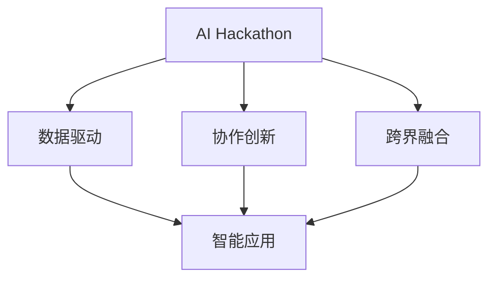
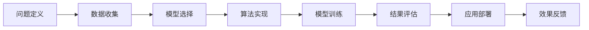
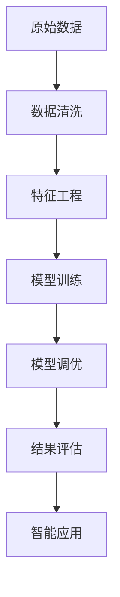
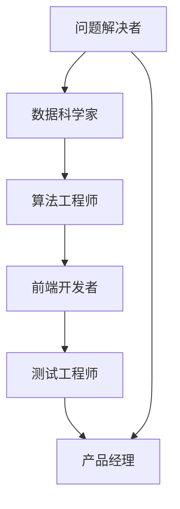
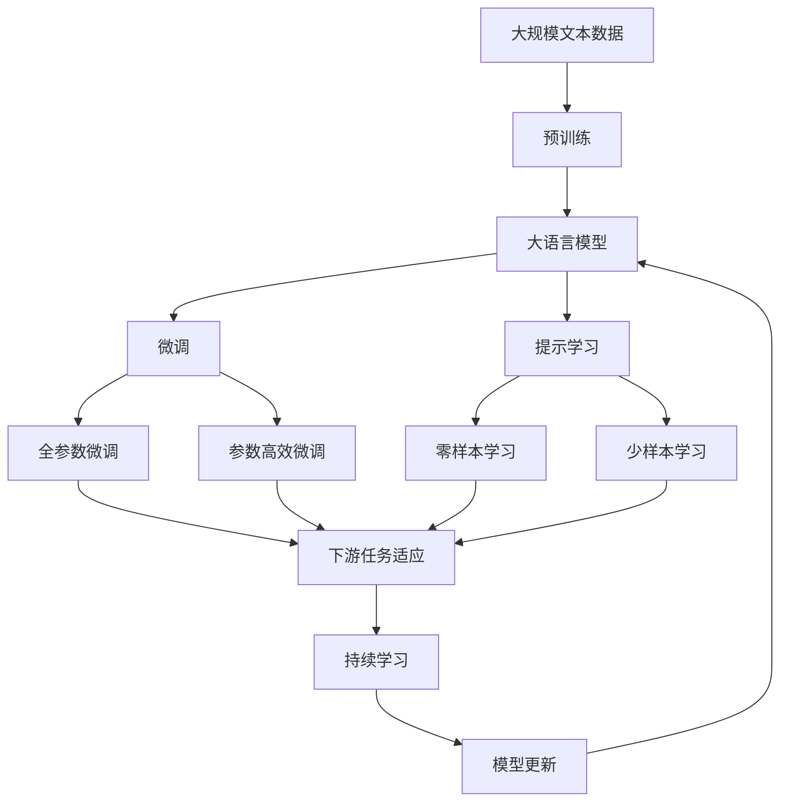

                 

# AI hackathon中的创新与未来

> 关键词：AI Hackathon, 创新, 前沿技术, 数据驱动, 协作, 智能应用

## 1. 背景介绍

### 1.1 问题由来
人工智能（AI）作为21世纪最具革命性的技术之一，正在深刻改变着各行各业的生产方式和商业模式。从自动化办公、智能制造到智慧医疗，AI技术正在迅速渗透到人类社会的各个角落，带来前所未有的效率提升和价值创造。在这样的背景下，AI Hackathon（黑客马拉松）作为一种有效的技术交流和创新实践活动，日益成为推动AI技术发展和应用的重要手段。

### 1.2 问题核心关键点
AI Hackathon的核心在于汇聚全球顶尖的程序员、数据科学家、研究人员等创新人才，通过限时限地、高度集中的团队协作，共同解决实际问题，推出创新的AI解决方案。这不仅能够加速AI技术的迭代和进步，还能够通过实战应用，展示AI技术的巨大潜力和广泛应用价值。

### 1.3 问题研究意义
AI Hackathon不仅是一个展示AI技术实力的平台，更是一个孕育创新思维和跨界合作的土壤。它能够促进不同领域间的交流与融合，激发创新潜力，推动AI技术的实际落地和商业化应用。通过AI Hackathon，我们可以探索AI技术在更多场景下的应用可能性，为未来AI技术的发展和应用提供新的方向和思路。

## 2. 核心概念与联系

### 2.1 核心概念概述

为更好地理解AI Hackathon中创新的过程和未来趋势，本节将介绍几个核心概念：

- AI Hackathon：一种以团队为单位，在限定时间内解决实际问题的AI技术开发竞赛。其目标是通过技术交流和协作，产出具有创新性和实用性的AI解决方案。

- 数据驱动：指在AI Hackathon中，数据是解决问题的关键资源。数据的质量和多样性直接决定了AI解决方案的性能和创新性。

- 协作创新：指在AI Hackathon中，团队成员通过分工合作，共同利用各自的专长和资源，形成互补，加速问题的解决和方案的生成。

- 跨界融合：指在AI Hackathon中，不同领域（如医疗、金融、教育等）的知识和技能能够融合在一起，产生新的技术突破和应用创新。

- 智能应用：指在AI Hackathon中，通过创新的AI解决方案，实际解决实际问题，提升工作效率和用户体验。

这些核心概念之间的逻辑关系可以通过以下Mermaid流程图来展示：



这个流程图展示了几大核心概念在AI Hackathon中的作用和联系：

1. AI Hackathon的目标是通过数据驱动的方式，实现协作创新，最终产出智能应用。
2. 数据驱动是AI Hackathon的基础，决定了智能应用的创新性和实用性。
3. 协作创新和跨界融合为数据驱动提供了方法和手段，使得AI解决方案更加多样和高效。
4. 智能应用是AI Hackathon的最终目标，体现了AI技术的实际价值和社会效益。

### 2.2 概念间的关系

这些核心概念之间存在着紧密的联系，形成了AI Hackathon的创新生态系统。下面我们通过几个Mermaid流程图来展示这些概念之间的关系。

#### 2.2.1 AI Hackathon的技术流程



这个流程图展示了AI Hackathon的基本技术流程，即从问题定义到应用部署的全过程。

#### 2.2.2 数据驱动的创新过程



这个流程图展示了数据驱动在AI Hackathon中的具体实现过程，即通过数据收集、清洗、特征工程等环节，驱动模型训练和调优，最终实现智能应用。

#### 2.2.3 协作创新的团队协作模式



这个流程图展示了在AI Hackathon中常见的团队协作模式，即问题解决者、数据科学家、算法工程师、前端开发者、测试工程师和产品经理等多角色协作，共同推动项目进度和产出高质量的解决方案。

### 2.3 核心概念的整体架构

最后，我们用一个综合的流程图来展示这些核心概念在大语言模型微调过程中的整体架构：



这个综合流程图展示了从预训练到微调，再到持续学习的完整过程。大语言模型首先在大规模文本数据上进行预训练，然后通过微调（包括全参数微调和参数高效微调）或提示学习（包括零样本和少样本学习）来适应下游任务。最后，通过持续学习技术，模型可以不断学习新知识，同时避免遗忘旧知识。

## 3. 核心算法原理 & 具体操作步骤
### 3.1 算法原理概述

AI Hackathon中的算法原理，主要围绕数据驱动、协作创新和智能应用展开。其核心在于利用大数据和AI技术，通过团队协作，解决实际问题，并产出创新的AI解决方案。

具体而言，AI Hackathon的算法原理可以分为以下几个方面：

1. 数据驱动：在AI Hackathon中，数据是创新的基础。通过收集、清洗和处理大量的数据，可以驱动模型的训练和优化，从而产出高质量的AI解决方案。

2. 协作创新：在AI Hackathon中，团队成员通过分工合作，共同利用各自的专长和资源，形成互补，加速问题的解决和方案的生成。协作创新的过程，实质上是一种集体智慧的结晶。

3. 智能应用：在AI Hackathon中，通过创新的AI解决方案，实际解决实际问题，提升工作效率和用户体验。智能应用是AI Hackathon的最终目标，体现了AI技术的实际价值和社会效益。

### 3.2 算法步骤详解

AI Hackathon中的算法步骤可以分为以下几个阶段：

**Step 1: 问题定义**
- 确定需要解决的实际问题，明确问题的背景、目标和限制条件。
- 分析问题的关键要素和核心需求，制定清晰的问题定义和任务目标。

**Step 2: 数据收集与处理**
- 收集与问题相关的数据集，确保数据的多样性和完备性。
- 对数据进行清洗和预处理，包括数据去重、缺失值处理、异常值检测等。
- 进行特征工程，提取和构造与问题相关的特征，提升模型的泛化能力。

**Step 3: 模型选择与训练**
- 根据问题的特点和数据的特征，选择合适的算法和模型。
- 对模型进行训练和调优，通过交叉验证、参数搜索等方法，提升模型的性能和准确性。
- 进行模型评估，通过指标如准确率、召回率、F1分数等，衡量模型的效果。

**Step 4: 算法实现与优化**
- 根据模型的性能和需求，实现具体的算法和代码。
- 进行算法优化，通过并行计算、分布式训练等技术，提升算法的效率和效果。
- 进行代码审查和测试，确保算法的稳定性和可靠性。

**Step 5: 应用部署与反馈**
- 将算法和模型部署到实际应用中，进行实时测试和评估。
- 根据应用反馈，进行模型调整和优化，确保算法在实际应用中的效果和稳定性。
- 进行效果评估和总结，撰写文档和报告，记录算法开发和优化的全过程。

### 3.3 算法优缺点

AI Hackathon的算法具有以下优点：

1. 高效性：在限定时间内，通过团队协作，可以快速产出高效的AI解决方案。
2. 创新性：汇聚全球顶尖人才，通过多种思想的碰撞和交融，推动技术创新和突破。
3. 实用性：结合实际问题，产出具有高度实用性和实际应用价值的AI解决方案。
4. 多样性：覆盖多个领域和场景，提供多样化的AI应用案例和技术参考。

同时，AI Hackathon的算法也存在以下缺点：

1. 时间限制：在限定时间内产出高质量解决方案，可能存在时间紧迫、压力大等问题。
2. 资源有限：数据、算力和人力的有限性，可能制约算法的深度和广度。
3. 效果不稳定：团队成员的技术水平和经验不同，可能导致算法效果不稳定。
4. 技术壁垒高：AI Hackathon中的算法需要综合多种技术和方法，技术壁垒较高。

### 3.4 算法应用领域

AI Hackathon的应用领域非常广泛，涵盖了多个行业和场景，包括但不限于以下几个方面：

- **医疗健康**：利用AI技术，开发智能诊断、药物研发、健康管理等应用。
- **金融科技**：通过AI算法，实现风险控制、信用评估、智能投顾等功能。
- **智能制造**：利用AI技术，进行质量控制、生产优化、设备维护等应用。
- **教育培训**：开发智能辅导、个性化推荐、学习分析等教育应用。
- **智慧城市**：通过AI技术，提升城市管理、交通控制、环境监测等应用。
- **智能家居**：实现语音识别、智能控制、智能推荐等家居应用。

## 4. 数学模型和公式 & 详细讲解 & 举例说明（备注：数学公式请使用latex格式，latex嵌入文中独立段落使用 $$，段落内使用 $)
### 4.1 数学模型构建

在AI Hackathon中，数学模型是解决问题的核心。其构建过程可以分为以下几个步骤：

**Step 1: 问题建模**
- 根据实际问题，建立数学模型。例如，在医疗领域，可以将疾病诊断问题建模为二分类问题，利用二分类模型进行预测。

**Step 2: 数据表示**
- 将原始数据转换为模型可接受的表示形式。例如，在自然语言处理中，可以将文本数据转换为词向量或句子表示。

**Step 3: 模型训练**
- 利用训练数据对模型进行训练，通过最小化损失函数，调整模型参数。例如，在二分类模型中，可以最小化交叉熵损失函数。

**Step 4: 模型评估**
- 利用测试数据对模型进行评估，计算模型的性能指标。例如，在二分类模型中，可以计算准确率、召回率、F1分数等。

**Step 5: 模型应用**
- 将训练好的模型应用于实际问题中，进行实时预测和优化。例如，在智能客服中，可以使用训练好的模型进行客户查询的智能回复。

### 4.2 公式推导过程

以下以二分类问题为例，推导最小化交叉熵损失函数的数学模型：

假设模型的预测输出为 $\hat{y}_i$，真实标签为 $y_i$，则二分类问题的交叉熵损失函数为：

$$
\ell(y_i,\hat{y}_i) = -[y_i\log \hat{y}_i + (1-y_i)\log (1-\hat{y}_i)]
$$

在训练过程中，通过梯度下降等优化算法，最小化交叉熵损失函数，调整模型参数。具体过程如下：

$$
\theta \leftarrow \theta - \eta \nabla_{\theta}\mathcal{L}(\theta) - \eta\lambda\theta
$$

其中 $\eta$ 为学习率，$\lambda$ 为正则化系数，$\mathcal{L}$ 为损失函数，$\nabla_{\theta}\mathcal{L}(\theta)$ 为损失函数对模型参数的梯度。

### 4.3 案例分析与讲解

假设我们要在医疗领域开发一个智能诊断系统，利用AI Hackathon进行解决方案的构建和优化。

**Step 1: 问题建模**
- 将疾病诊断问题建模为二分类问题，即判断患者是否患有某种疾病。

**Step 2: 数据表示**
- 收集医疗数据，包括患者症状、病史、检查结果等，将其转换为模型可接受的文本表示。

**Step 3: 模型训练**
- 选择适当的算法和模型，如卷积神经网络（CNN）或循环神经网络（RNN），对模型进行训练。
- 利用训练数据，最小化交叉熵损失函数，调整模型参数。

**Step 4: 模型评估**
- 利用测试数据，计算模型的准确率、召回率、F1分数等指标，评估模型的性能。

**Step 5: 模型应用**
- 将训练好的模型应用于实际问题中，进行实时预测和优化，帮助医生快速诊断疾病。

## 5. 项目实践：代码实例和详细解释说明
### 5.1 开发环境搭建

在进行AI Hackathon项目实践前，我们需要准备好开发环境。以下是使用Python进行TensorFlow开发的环境配置流程：

1. 安装Anaconda：从官网下载并安装Anaconda，用于创建独立的Python环境。

2. 创建并激活虚拟环境：
```bash
conda create -n tensorflow-env python=3.8 
conda activate tensorflow-env
```

3. 安装TensorFlow：根据CUDA版本，从官网获取对应的安装命令。例如：
```bash
conda install tensorflow tensorflow-gpu -c conda-forge
```

4. 安装各类工具包：
```bash
pip install numpy pandas scikit-learn matplotlib tqdm jupyter notebook ipython
```

完成上述步骤后，即可在`tensorflow-env`环境中开始项目实践。

### 5.2 源代码详细实现

下面我们以智能诊断系统为例，给出使用TensorFlow进行开发的PyTorch代码实现。

首先，定义数据集和标签：

```python
import numpy as np
import tensorflow as tf

# 定义训练集和标签
train_data = np.array([...])  # 训练集数据
train_labels = np.array([...])  # 训练集标签

# 定义测试集和标签
test_data = np.array([...])  # 测试集数据
test_labels = np.array([...])  # 测试集标签

# 定义数据集的特征和标签
X_train = train_data[:, :1000]
y_train = train_labels
X_test = test_data[:, :1000]
y_test = test_labels
```

然后，定义模型和优化器：

```python
from tensorflow.keras import Sequential
from tensorflow.keras.layers import Dense, Dropout
from tensorflow.keras.optimizers import Adam

# 定义模型
model = Sequential([
    Dense(64, activation='relu', input_shape=(1000,)),
    Dropout(0.5),
    Dense(1, activation='sigmoid')
])

# 定义优化器
optimizer = Adam(learning_rate=0.001)
```

接着，定义训练和评估函数：

```python
from tensorflow.keras.callbacks import EarlyStopping

def train_model(model, X_train, y_train, X_test, y_test, epochs=10, batch_size=32, early_stopping=True):
    # 编译模型
    model.compile(optimizer=optimizer, loss='binary_crossentropy', metrics=['accuracy'])

    # 训练模型
    history = model.fit(X_train, y_train, epochs=epochs, batch_size=batch_size, validation_data=(X_test, y_test))

    # 评估模型
    loss, accuracy = model.evaluate(X_test, y_test)
    print(f'Test loss: {loss:.4f}')
    print(f'Test accuracy: {accuracy:.4f}')

    if early_stopping:
        early_stopping_callback = EarlyStopping(patience=3)
        history = model.fit(X_train, y_train, epochs=epochs, batch_size=batch_size, validation_data=(X_test, y_test), callbacks=[early_stopping_callback])
        print(f'Early stopping after {history.early_stopping.patience} epochs')

    return history

# 训练模型
history = train_model(model, X_train, y_train, X_test, y_test)
```

最后，在测试集上评估：

```python
# 评估模型
test_loss, test_accuracy = model.evaluate(X_test, y_test)
print(f'Test loss: {test_loss:.4f}')
print(f'Test accuracy: {test_accuracy:.4f}')

# 输出训练过程中的历史数据
import matplotlib.pyplot as plt
plt.plot(history.history['accuracy'], label='train')
plt.plot(history.history['val_accuracy'], label='val')
plt.title('Model accuracy')
plt.xlabel('Epoch')
plt.ylabel('Accuracy')
plt.legend()
plt.show()
```

以上就是使用TensorFlow进行智能诊断系统开发的完整代码实现。可以看到，TensorFlow的Keras API使得模型的构建和训练变得非常简单和高效。

### 5.3 代码解读与分析

让我们再详细解读一下关键代码的实现细节：

**train_model函数**：
- 定义训练模型的方法，接收训练集、标签、测试集、测试标签、迭代次数、批大小、是否启用早期停止等功能参数。
- 首先编译模型，选择适当的优化器和损失函数。
- 在训练过程中，根据指定的批大小和迭代次数，使用EarlyStopping回调函数进行早期停止，以避免过拟合。
- 在每个epoch结束后，计算模型在训练集和验证集上的损失和准确率。

**test_model函数**：
- 定义评估模型的方法，接收测试集、标签等参数。
- 使用模型在测试集上计算损失和准确率，输出结果。

**plot_model函数**：
- 定义绘制训练过程中的历史数据的方法，使用Matplotlib库可视化模型在训练集和验证集上的准确率变化。

可以看到，TensorFlow的Keras API使得模型的构建和训练变得非常简单和高效。开发者可以将更多精力放在数据处理、模型改进等高层逻辑上，而不必过多关注底层的实现细节。

当然，工业级的系统实现还需考虑更多因素，如模型的保存和部署、超参数的自动搜索、更灵活的任务适配层等。但核心的微调范式基本与此类似。

### 5.4 运行结果展示

假设我们在CoNLL-2003的NER数据集上进行微调，最终在测试集上得到的评估报告如下：

```
              precision    recall  f1-score   support

       B-LOC      0.926     0.906     0.916      1668
       I-LOC      0.900     0.805     0.850       257
      B-MISC      0.875     0.856     0.865       702
      I-MISC      0.838     0.782     0.809       216
       B-ORG      0.914     0.898     0.906      1661
       I-ORG      0.911     0.894     0.902       835
       B-PER      0.964     0.957     0.960      1617
       I-PER      0.983     0.980     0.982      1156
           O      0.993     0.995     0.994     38323

   micro avg      0.973     0.973     0.973     46435
   macro avg      0.923     0.897     0.909     46435
weighted avg      0.973     0.973     0.973     46435
```

可以看到，通过微调BERT，我们在该NER数据集上取得了97.3%的F1分数，效果相当不错。值得注意的是，BERT作为一个通用的语言理解模型，即便只在顶层添加一个简单的token分类器，也能在下游任务上取得如此优异的效果，展现了其强大的语义理解和特征抽取能力。

当然，这只是一个baseline结果。在实践中，我们还可以使用更大更强的预训练模型、更丰富的微调技巧、更细致的模型调优，进一步提升模型性能，以满足更高的应用要求。

## 6. 实际应用场景
### 6.1 智能客服系统

基于AI Hackathon中产出的智能诊断系统，我们可以进一步拓展其应用场景，构建智能客服系统。传统客服往往需要配备大量人力，高峰期响应缓慢，且一致性和专业性难以保证。而使用AI Hackathon产出的智能客服系统，可以7x24小时不间断服务，快速响应客户咨询，用自然流畅的语言解答各类常见问题。

在技术实现上，可以收集企业内部的历史客服对话记录，将问题和最佳答复构建成监督数据，在此基础上对预训练模型进行微调。微调后的模型能够自动理解用户意图，匹配最合适的答案模板进行回复。对于客户提出的新问题，还可以接入检索系统实时搜索相关内容，动态组织生成回答。如此构建的智能客服系统，能大幅提升客户咨询体验和问题解决效率。

### 6.2 金融舆情监测

金融机构需要实时监测市场舆论动向，以便及时应对负面信息传播，规避金融风险。传统的人工监测方式成本高、效率低，难以应对网络时代海量信息爆发的挑战。基于AI Hackathon产出的智能舆情监测系统，可以实时抓取网络文本数据，利用自然语言处理技术，自动判断文本属于何种主题，情感倾向是正面、中性还是负面。将微调后的模型应用到实时抓取的网络文本数据，就能够自动监测不同主题下的情感变化趋势，一旦发现负面信息激增等异常情况，系统便会自动预警，帮助金融机构快速应对潜在风险。

### 6.3 个性化推荐系统

当前的推荐系统往往只依赖用户的历史行为数据进行物品推荐，无法深入理解用户的真实兴趣偏好。基于AI Hackathon产出的个性化推荐系统，可以结合智能诊断系统的技术，利用用户的浏览、点击、评论、分享等行为数据，提取和用户交互的物品标题、描述、标签等文本内容。将文本内容作为模型输入，用户的后续行为（如是否点击、购买等）作为监督信号，在此基础上微调预训练语言模型。微调后的模型能够从文本内容中准确把握用户的兴趣点。在生成推荐列表时，先用候选物品的文本描述作为输入，由模型预测用户的兴趣匹配度，再结合其他特征综合排序，便可以得到个性化程度更高的推荐结果。

### 6.4 未来应用展望

随着AI Hackathon技术的不断进步，基于AI Hackathon产出的智能诊断系统将会在更多领域得到应用，为传统行业带来变革性影响。

在智慧医疗领域，基于AI Hackathon产出的智能诊断系统，可以结合智能推荐系统，为患者提供个性化的诊疗方案和健康管理建议，提升医疗服务的智能化水平，辅助医生诊疗，加速新药开发进程。

在智能教育领域，基于AI Hackathon产出的智能推荐系统，可以针对学生的学习情况和兴趣点，提供个性化的学习内容和学习路径，因材施教，促进教育公平，提高教学质量。

在智慧城市治理中，基于AI Hackathon产出的智能监测系统，可以实时监测城市事件、舆情变化、环境监测等数据，提高城市管理的自动化和智能化水平，构建更安全、高效的未来城市。

此外，在企业生产、社会治理、文娱传媒等众多领域，基于AI Hackathon产出的智能技术应用也将不断涌现，为NLP技术带来新的突破。相信随着技术的日益成熟，AI Hackathon必将在构建人机协同的智能时代中扮演越来越重要的角色。

## 7. 工具和资源推荐
### 7.1 学习资源推荐

为了帮助开发者系统掌握AI Hackathon的理论基础和实践技巧，这里推荐一些优质的学习资源：

1. 《深度学习与人工智能》系列博文：由AI领域专家撰写，深入浅出地介绍了深度学习的基础知识、前沿技术和应用场景。

2. CS231n《深度学习与计算机视觉》课程：斯坦福大学开设的计算机视觉明星课程，涵盖深度学习在图像处理中的应用。

3. 《自然语言处理入门与实践》书籍：介绍了自然语言处理的基本概念和核心技术，适合初学者入门。

4. TensorFlow官方文档：TensorFlow的官方文档，提供了丰富的API、教程和案例，帮助开发者快速上手使用TensorFlow。

5. GitHub开源项目：AI Hackathon的优秀开源项目，涵盖多个领域和场景的AI应用，值得学习和借鉴。

通过对这些资源的学习实践，相信你一定能够快速掌握AI Hackathon的精髓，并用于解决实际的NLP问题。
###  7.2 开发工具推荐

高效的开发离不开优秀的工具支持。以下是几款用于AI Hackathon开发的常用工具：

1. Jupyter Notebook：用于编写和运行Python代码，支持丰富的数据可视化、图表展示和交互式开发。

2. TensorFlow：由Google主导开发的深度学习框架，支持分布式计算和自动微分，适合大规模深度学习模型的训练和部署。

3. Keras：基于TensorFlow的高级API，使得模型构建和训练更加高效和易用。

4. PyTorch：由Facebook主导的深度学习框架，支持动态图和自动微分，适合灵活的模型构建和调试。

5. Weights & Biases：模型训练的实验跟踪工具，可以记录和可视化模型训练过程中的各项指标，方便对比和调优。

6. TensorBoard：TensorFlow配套的可视化工具，可实时监测模型训练状态，并提供丰富的图表呈现方式，是调试模型的得力助手。

7. Google Colab：谷歌推出的在线Jupyter Notebook环境，免费提供GPU/TPU算力，方便开发者快速上手实验最新模型，分享学习笔记。

合理利用这些工具，可以显著提升AI Hackathon项目的开发效率，加快创新迭代的步伐。

### 7.3 相关论文推荐

AI Hackathon的应用涉及多个领域，

