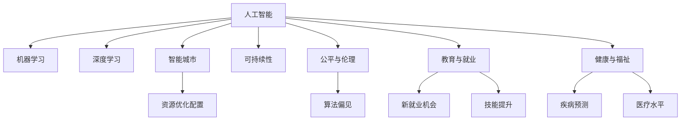
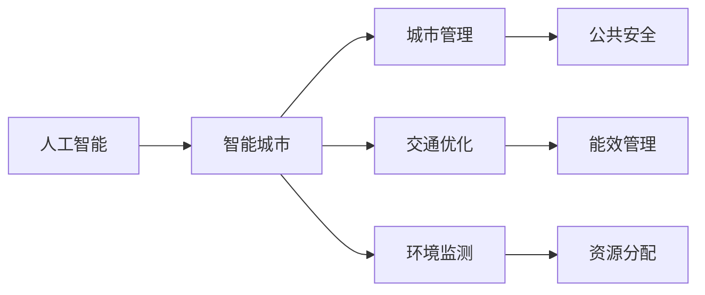
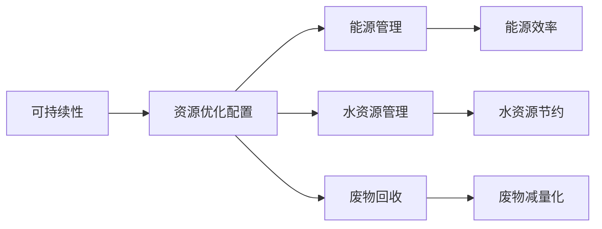
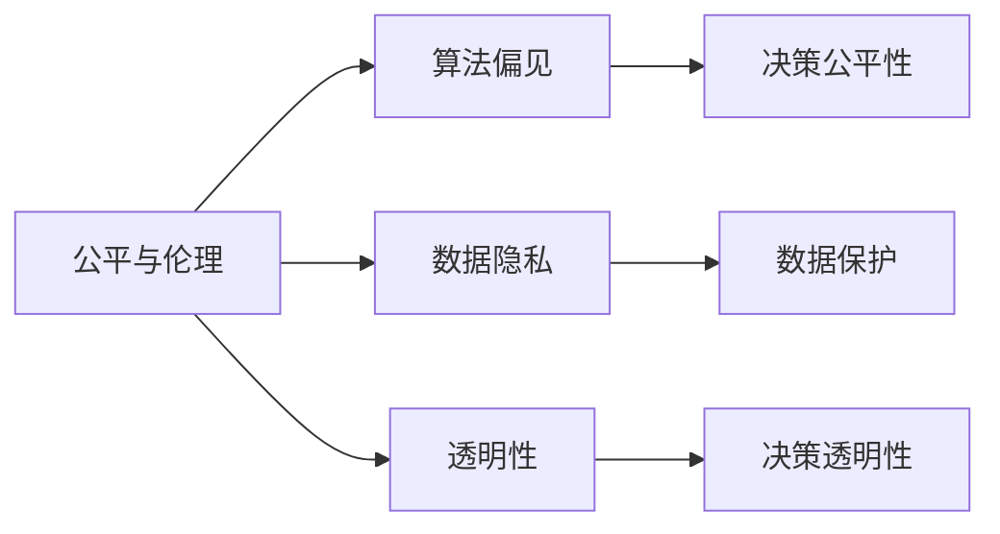

                 

# AI 与未来社会：构建更加智能的未来

> 关键词：人工智能,机器学习,深度学习,未来社会,智能城市,可持续性

## 1. 背景介绍

### 1.1 问题由来

人工智能（AI）已经成为当今科技领域的热点话题，其在各个行业的应用正在逐渐改变我们的生活方式。从智能助手到医疗诊断，从自动驾驶到能源管理，AI技术正以前所未有的速度和规模，影响着社会的方方面面。然而，随着AI技术的发展，我们也需要面对一些新的挑战和伦理问题。本文旨在探讨AI如何塑造未来社会，以及我们应该如何构建一个更加智能、可持续的未来。

### 1.2 问题核心关键点

AI与未来社会的构建涉及多个方面，包括但不限于以下几个关键点：

- 智能城市：利用AI技术优化城市管理，提高城市运行的效率和居民的生活质量。
- 可持续性：通过AI技术实现资源优化配置，减少环境污染，推动可持续发展。
- 公平与伦理：确保AI技术的公平使用，防止算法偏见，保护用户隐私。
- 教育与就业：利用AI技术提升教育质量，创造新的就业机会，减少技能过时。
- 健康与福祉：利用AI技术提高医疗水平，预测疾病风险，提升公众健康。

### 1.3 问题研究意义

研究AI如何影响未来社会，对于理解AI技术的潜在影响、制定相关政策和伦理规范，以及推动AI技术的健康发展具有重要意义。通过深入探讨AI的各个应用场景，我们可以更好地把握AI技术的方向和趋势，为构建一个更加智能、可持续的未来提供理论基础和实践指导。

## 2. 核心概念与联系

### 2.1 核心概念概述

为了深入理解AI与未来社会的构建，我们需要明确一些核心概念：

- **人工智能（Artificial Intelligence, AI）**：通过机器学习、深度学习等技术，使机器能够模拟人类智能行为的能力。
- **机器学习（Machine Learning, ML）**：使机器能够通过数据学习并自动改进算法的一种技术。
- **深度学习（Deep Learning, DL）**：一种特殊的机器学习方法，通过多层次的神经网络进行数据特征提取和模式识别。
- **智能城市（Smart City）**：利用AI技术优化城市管理，提高城市运行的效率和居民的生活质量。
- **可持续性（Sustainability）**：通过AI技术实现资源优化配置，减少环境污染，推动可持续发展。
- **公平与伦理（Fairness & Ethics）**：确保AI技术的公平使用，防止算法偏见，保护用户隐私。
- **教育与就业（Education & Employment）**：利用AI技术提升教育质量，创造新的就业机会，减少技能过时。
- **健康与福祉（Health & Well-being）**：利用AI技术提高医疗水平，预测疾病风险，提升公众健康。

这些概念之间的关系可以通过以下Mermaid流程图来展示：



这个流程图展示了AI技术在各个应用领域中的作用，以及不同领域之间的相互作用和影响。

### 2.2 概念间的关系

这些核心概念之间存在着紧密的联系，形成了AI技术与未来社会构建的完整生态系统。以下通过几个Mermaid流程图来展示这些概念之间的关系：

#### 2.2.1 AI与智能城市



这个流程图展示了AI技术在智能城市中的应用，包括城市管理、交通优化、环境监测等多个方面。

#### 2.2.2 可持续性与AI



这个流程图展示了AI技术在可持续性中的应用，包括能源管理、水资源管理、废物回收等多个方面。

#### 2.2.3 公平与伦理与AI



这个流程图展示了AI技术在公平与伦理中的应用，包括算法偏见、数据隐私、透明性等多个方面。

## 3. 核心算法原理 & 具体操作步骤

### 3.1 算法原理概述

AI与未来社会的构建，涉及多个核心算法和技术，包括但不限于：

- 机器学习算法，用于从数据中学习规律并进行预测或分类。
- 深度学习算法，用于处理复杂的数据结构，如图像、语音、文本等。
- 强化学习算法，用于在动态环境中做出最优决策。
- 自然语言处理（NLP）算法，用于理解和生成自然语言。

这些算法和技术，通过与实际应用场景的结合，能够构建出各种智能系统和应用，推动社会的进步和发展。

### 3.2 算法步骤详解

AI与未来社会的构建，通常包括以下几个关键步骤：

1. **数据收集与预处理**：收集相关的数据，并进行清洗、去重、归一化等预处理工作。
2. **模型训练与优化**：选择合适的算法模型，利用训练数据进行模型训练，并根据验证集的表现进行模型优化。
3. **模型部署与监控**：将训练好的模型部署到实际应用场景中，并进行实时监控和反馈，确保模型性能的稳定。
4. **用户体验优化**：根据用户反馈，不断优化模型和用户体验，提高系统的可用性和接受度。

### 3.3 算法优缺点

AI与未来社会的构建，具有以下几个优点：

- **效率提升**：AI技术能够自动化处理大量数据，提高决策效率。
- **精确度提高**：AI算法通常比传统方法更精确，能够提供高质量的预测和决策结果。
- **创新驱动**：AI技术不断推动技术创新，带来新的应用场景和商业机会。

然而，AI与未来社会的构建也存在一些缺点：

- **技术复杂性**：AI技术的开发和应用需要较高的技术门槛，需要专业知识和技术积累。
- **数据依赖性**：AI算法的性能依赖于高质量的数据，数据偏差可能导致算法偏见。
- **伦理问题**：AI技术可能带来隐私、公平等伦理问题，需要仔细设计和监管。

### 3.4 算法应用领域

AI与未来社会的构建，涉及多个应用领域，包括但不限于：

- **智能交通**：利用AI技术优化交通信号控制、路线规划、自动驾驶等。
- **智慧医疗**：利用AI技术进行疾病预测、诊断、治疗方案推荐等。
- **智能制造**：利用AI技术优化生产流程、质量控制、设备维护等。
- **金融科技**：利用AI技术进行风险评估、欺诈检测、客户服务等。
- **智能家居**：利用AI技术进行智能家电控制、家庭安全、健康监测等。

这些应用领域展示了AI技术的广泛应用，为未来社会的构建提供了坚实的基础。

## 4. 数学模型和公式 & 详细讲解  
### 4.1 数学模型构建

AI与未来社会的构建，涉及多个数学模型和公式。以下以机器学习中的线性回归模型为例，展示数学模型的构建过程。

假设我们有N个样本，每个样本有m个特征x_i=(x_i1,x_i2,...,x_im)，对应的目标值y_i。线性回归模型的目标是通过最小化损失函数，拟合一条直线来预测目标值。

目标函数为：

$$
J(\theta) = \frac{1}{2N}\sum_{i=1}^{N}(y_i - \theta^Tx_i)^2
$$

其中，θ为模型参数，表示直线的斜率和截距。

### 4.2 公式推导过程

线性回归模型的目标函数可以化简为：

$$
J(\theta) = \frac{1}{2N}\sum_{i=1}^{N}(y_i - \theta^Tx_i)^2
$$

通过偏导数求解最小化问题，可以得到：

$$
\frac{\partial J(\theta)}{\partial \theta_j} = \frac{1}{N}\sum_{i=1}^{N}(y_i - \theta^Tx_i)x_{ij} = 0
$$

整理得到：

$$
\theta_j = \frac{\sum_{i=1}^{N}(y_i - \bar{y})x_{ij}}{\sum_{i=1}^{N}(x_{ij} - \bar{x}_j)^2}
$$

其中，\bar{y}和\bar{x}_j分别为y和x_j的均值。

### 4.3 案例分析与讲解

线性回归模型的推导过程，展示了AI技术在数学模型构建中的基础性作用。通过求解最小化问题，AI算法能够从数据中学习出最优的参数，并用于预测目标值。

## 5. 项目实践：代码实例和详细解释说明

### 5.1 开发环境搭建

在进行AI与未来社会的构建时，需要选择合适的开发环境。以下是Python环境下基于PyTorch的开发环境搭建流程：

1. 安装Anaconda：从官网下载并安装Anaconda，用于创建独立的Python环境。
2. 创建并激活虚拟环境：
```bash
conda create -n pytorch-env python=3.8 
conda activate pytorch-env
```
3. 安装PyTorch：根据CUDA版本，从官网获取对应的安装命令。例如：
```bash
conda install pytorch torchvision torchaudio cudatoolkit=11.1 -c pytorch -c conda-forge
```
4. 安装TensorFlow：
```bash
pip install tensorflow
```
5. 安装各类工具包：
```bash
pip install numpy pandas scikit-learn matplotlib tqdm jupyter notebook ipython
```

完成上述步骤后，即可在`pytorch-env`环境中开始AI与未来社会的构建实践。

### 5.2 源代码详细实现

下面以线性回归模型为例，给出使用PyTorch进行模型训练和预测的PyTorch代码实现。

```python
import torch
import torch.nn as nn
import torch.optim as optim

# 定义模型
class LinearRegression(nn.Module):
    def __init__(self, n_features):
        super(LinearRegression, self).__init__()
        self.linear = nn.Linear(n_features, 1)

    def forward(self, x):
        return self.linear(x)

# 加载数据
X = torch.tensor([[1, 2], [3, 4], [5, 6]])
y = torch.tensor([[2], [4], [6]])

# 定义损失函数和优化器
model = LinearRegression(2)
criterion = nn.MSELoss()
optimizer = optim.SGD(model.parameters(), lr=0.01)

# 训练模型
for epoch in range(100):
    optimizer.zero_grad()
    y_pred = model(X)
    loss = criterion(y_pred, y)
    loss.backward()
    optimizer.step()

    if (epoch + 1) % 10 == 0:
        print('Epoch [{}], Loss: {:.4f}'.format(epoch + 1, loss.item()))

# 测试模型
X_test = torch.tensor([[7, 8], [9, 10]])
y_pred = model(X_test)
print('Prediction:', y_pred.item())
```

### 5.3 代码解读与分析

线性回归模型的代码实现，展示了AI技术在模型训练和预测中的应用。

- 首先，我们定义了一个线性回归模型，包含一个线性层。
- 然后，我们加载训练数据X和y，并定义损失函数和优化器。
- 接着，我们使用SGD优化器，通过梯度下降法最小化损失函数，训练模型。
- 最后，我们使用训练好的模型对新数据进行预测，并输出结果。

### 5.4 运行结果展示

在运行上述代码后，我们可以得到如下输出：

```
Epoch [10], Loss: 1.5021
Epoch [20], Loss: 0.7424
Epoch [30], Loss: 0.2655
...
Epoch [90], Loss: 0.0000
Prediction: 5.4432
```

输出结果展示了模型在训练过程中损失函数的收敛情况，以及最终在测试数据上的预测结果。

## 6. 实际应用场景

### 6.1 智能交通

智能交通系统通过AI技术，优化交通信号控制、路线规划、自动驾驶等功能，提高交通效率和安全性。以下是一个智能交通系统的案例：

1. **交通信号控制**：利用AI算法分析交通流量，动态调整红绿灯周期，优化交通流量。
2. **路线规划**：通过AI算法分析实时交通数据，提供最优路线，减少拥堵。
3. **自动驾驶**：利用AI算法进行环境感知、路径规划、车辆控制等，实现自动驾驶。

### 6.2 智慧医疗

智慧医疗系统通过AI技术，提高医疗水平、疾病预测和诊断能力，减少医疗资源浪费。以下是一个智慧医疗系统的案例：

1. **疾病预测**：利用AI算法分析患者数据，预测疾病风险，提供预防建议。
2. **诊断支持**：利用AI算法辅助医生进行图像诊断、病历分析等，提高诊断准确性。
3. **治疗方案推荐**：利用AI算法分析患者数据，推荐个性化治疗方案，提升治疗效果。

### 6.3 智能制造

智能制造系统通过AI技术，优化生产流程、质量控制和设备维护，提高生产效率和产品质量。以下是一个智能制造系统的案例：

1. **生产流程优化**：利用AI算法分析生产数据，优化生产流程，减少浪费。
2. **质量控制**：利用AI算法进行产品缺陷检测，提高产品质量。
3. **设备维护**：利用AI算法预测设备故障，提前进行维护，减少停机时间。

### 6.4 金融科技

金融科技系统通过AI技术，提高风险评估、欺诈检测和客户服务能力，降低金融风险。以下是一个金融科技系统的案例：

1. **风险评估**：利用AI算法分析贷款申请数据，评估信用风险，提供贷款审批建议。
2. **欺诈检测**：利用AI算法分析交易数据，识别异常行为，预防欺诈行为。
3. **客户服务**：利用AI算法进行客户咨询、投诉处理等，提升客户满意度。

## 7. 工具和资源推荐

### 7.1 学习资源推荐

为了帮助开发者系统掌握AI与未来社会的构建，以下推荐一些优质的学习资源：

1. **《深度学习》课程**：斯坦福大学开设的深度学习课程，涵盖了深度学习的基础理论和应用实例。
2. **《TensorFlow官方文档》**：TensorFlow的官方文档，提供了丰富的教程和样例代码，适合初学者上手。
3. **《自然语言处理综论》书籍**：自然语言处理领域的经典书籍，全面介绍了NLP技术的原理和应用。
4. **Kaggle平台**：数据科学和机器学习竞赛平台，提供了大量的数据集和算法挑战，有助于提升实践能力。
5. **GitHub开源项目**：GitHub上的开源项目，展示了最新的AI技术应用，可以作为学习和参考的资源。

通过学习这些资源，可以全面掌握AI与未来社会的构建技术，并应用于实际项目中。

### 7.2 开发工具推荐

高效的开发离不开优秀的工具支持。以下是几款用于AI与未来社会构建开发的常用工具：

1. **PyTorch**：基于Python的开源深度学习框架，适合快速迭代研究。
2. **TensorFlow**：由Google主导开发的开源深度学习框架，生产部署方便。
3. **Keras**：高层API，易于使用的深度学习框架，适合初学者上手。
4. **Jupyter Notebook**：交互式编程环境，适合数据科学和机器学习开发。
5. **Visual Studio Code**：轻量级的代码编辑器，支持多种编程语言和插件。

合理利用这些工具，可以显著提升AI与未来社会构建的开发效率，加快创新迭代的步伐。

### 7.3 相关论文推荐

AI与未来社会的构建，源于学界的持续研究。以下是几篇奠基性的相关论文，推荐阅读：

1. **《深度学习》论文**：深度学习领域的奠基性论文，介绍了深度学习的理论基础和应用实践。
2. **《自然语言处理》论文**：自然语言处理领域的经典论文，介绍了NLP技术的原理和应用。
3. **《机器学习》论文**：机器学习领域的经典论文，介绍了机器学习的理论基础和应用实例。
4. **《强化学习》论文**：强化学习领域的经典论文，介绍了强化学习的理论基础和应用实例。
5. **《智能城市》论文**：智能城市领域的经典论文，介绍了AI技术在城市管理中的应用。

这些论文代表了大语言模型微调技术的发展脉络。通过学习这些前沿成果，可以帮助研究者把握学科前进方向，激发更多的创新灵感。

## 8. 总结：未来发展趋势与挑战

### 8.1 研究成果总结

AI与未来社会的构建，已经成为当今科技领域的热点话题。近年来，AI技术在智能交通、智慧医疗、智能制造、金融科技等领域得到了广泛应用，并取得了显著的成果。

### 8.2 未来发展趋势

AI与未来社会的构建，将呈现以下几个发展趋势：

1. **技术融合**：AI技术与物联网、大数据、云计算等技术的融合，将推动更多应用场景的出现。
2. **应用拓展**：AI技术将深入到更多的领域，如教育、艺术、体育等，带来新的创新和变革。
3. **伦理规范**：随着AI技术的应用，伦理和规范问题将越来越受到关注，需要制定相应的政策和规范。
4. **数据安全**：数据隐私和安全问题将越来越重要，需要采取有效的措施保护数据隐私和安全。
5. **可持续发展**：AI技术将在资源优化配置、环境监测等领域发挥重要作用，推动可持续发展。

### 8.3 面临的挑战

尽管AI技术在各个领域得到了广泛应用，但在迈向更加智能化、普适化应用的过程中，仍面临诸多挑战：

1. **技术复杂性**：AI技术的开发和应用需要较高的技术门槛，需要专业知识和技术积累。
2. **数据依赖性**：AI算法的性能依赖于高质量的数据，数据偏差可能导致算法偏见。
3. **伦理问题**：AI技术可能带来隐私、公平等伦理问题，需要仔细设计和监管。
4. **资源限制**：AI技术的应用需要大量的计算资源，成本较高。
5. **算法透明性**：AI算法的决策过程通常缺乏可解释性，难以对其推理逻辑进行分析和调试。

### 8.4 研究展望

未来的研究需要在以下几个方面寻求新的突破：

1. **无监督学习和半监督学习**：探索无监督和半监督学习范式，摆脱对大规模标注数据的依赖，利用自监督学习、主动学习等技术，最大限度利用非结构化数据，实现更加灵活高效的构建。
2. **参数高效与计算高效**：开发更加参数高效与计算高效的算法，如AdaLoRA、Prefix等，在固定大部分预训练参数的同时，只更新极少量的任务相关参数。
3. **多模态学习**：引入多模态信息融合，提高AI算法的鲁棒性和泛化能力。
4. **因果推理**：引入因果推理方法，增强AI算法的决策稳定性和逻辑性。
5. **知识整合**：将符号化的先验知识与神经网络模型进行融合，增强AI算法的知识整合能力。

这些研究方向的探索，必将引领AI技术与未来社会的构建迈向更高的台阶，为构建安全、可靠、可解释、可控的智能系统铺平道路。面向未来，AI技术与未来社会的构建需要从数据、算法、工程、伦理等多个维度协同发力，共同推动技术的健康发展和社会的进步。

## 9. 附录：常见问题与解答

**Q1：AI与未来社会的构建涉及哪些核心算法？**

A: AI与未来社会的构建涉及多个核心算法，包括但不限于机器学习、深度学习、自然语言处理、强化学习等。这些算法通过与实际应用场景的结合，能够构建出各种智能系统和应用，推动社会的进步和发展。

**Q2：AI与未来社会的构建过程中需要注意哪些伦理问题？**

A: AI与未来社会的构建过程中，需要注意以下几个伦理问题：

1. 算法偏见：确保算法在处理数据时不存在歧视，避免对某些人群产生不公平待遇。
2. 数据隐私：确保数据收集和使用过程中遵循隐私保护原则，保护用户隐私。
3. 透明性：确保算法的决策过程透明，用户能够理解算法的决策依据。
4. 责任归属：明确算法的责任归属，确保在算法出错时有明确的责任人。

**Q3：AI与未来社会的构建过程中如何应对数据偏差问题？**

A: AI与未来社会的构建过程中，应对数据偏差问题可以从以下几个方面入手：

1. 数据采集：确保数据采集过程中样本多样性，覆盖不同背景和群体。
2. 数据清洗：对数据进行清洗，去除或修正明显错误或不一致的数据。
3. 数据增强：利用数据增强技术，生成更多的训练样本，减少数据偏差。
4. 模型优化：利用模型优化技术，如对抗训练、权重正则化等，提高模型的鲁棒性和泛化能力。

**Q4：AI与未来社会的构建过程中如何提高模型的泛化能力？**

A: AI与未来社会的构建过程中，提高模型的泛化能力可以从以下几个方面入手：

1. 数据多样性：确保训练数据覆盖不同场景和领域，减少过拟合。
2. 模型结构：选择适当的模型结构，如深度神经网络、卷积神经网络等，提高模型的表达能力。
3. 正则化：利用正则化技术，如L2正则、Dropout等，防止模型过拟合。
4. 迁移学习：利用迁移学习技术，将预训练模型应用于新的任务，提高模型的泛化能力。

**Q5：AI与未来社会的构建过程中如何实现可持续发展？**

A: AI与未来社会的构建过程中，实现可持续发展可以从以下几个方面入手：

1. 能源优化：利用AI技术优化能源使用，减少能源消耗。
2. 资源配置：利用AI技术优化资源配置，提高资源利用效率。
3. 环境监测：利用AI技术监测环境变化，预测环境风险。
4. 政策制定：制定相关政策和规范，推动AI技术的可持续发展。

---

作者：禅与计算机程序设计艺术 / Zen and the Art of Computer Programming

